🔙 **[Kembali ke Daftar Soal](./README.md)**

---

# Latihan Soal Part C - Modul 03 - Set 05

### Soal 101
```cpp
int n = 6, s = 0;
while(n > 0) { s += n; n -= 3; }
```
**Pertanyaan:**
1. Berapakah hasil akhirnya?
2. Mengapa demikian?

**Jawaban & Diagnosis:**
1. **9**
2. Lihat Tracing.

**Mermaid Flowchart:**
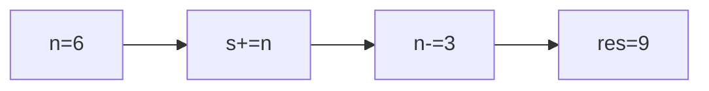

**📖 Penjelasan:**
**Langkah Tracing:**
1. Loop berjalan dengan langkah 3.
2. Hasil akumulasi: 9.

---
### Soal 102
```cpp
int s = 0;
for(int i=0; i<8; i+=1) s += i;
```
**Pertanyaan:**
1. Berapakah hasil akhirnya?
2. Mengapa demikian?

**Jawaban & Diagnosis:**
1. **28**
2. Lihat Tracing.

**Mermaid Flowchart:**
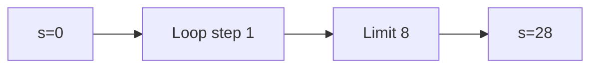

**📖 Penjelasan:**
**Langkah Tracing:**
1. Loop berjalan dengan langkah 1.
2. Hasil akumulasi: 28.

---
### Soal 103
```cpp
int s = 0;
for(int i=0; i<8; i+=3) s += i;
```
**Pertanyaan:**
1. Berapakah hasil akhirnya?
2. Mengapa demikian?

**Jawaban & Diagnosis:**
1. **9**
2. Lihat Tracing.

**Mermaid Flowchart:**


**📖 Penjelasan:**
**Langkah Tracing:**
1. Loop berjalan dengan langkah 3.
2. Hasil akumulasi: 9.

---
### Soal 104
```cpp
int n = 5, s = 0;
while(n > 0) { s += n; n -= 2; }
```
**Pertanyaan:**
1. Berapakah hasil akhirnya?
2. Mengapa demikian?

**Jawaban & Diagnosis:**
1. **9**
2. Lihat Tracing.

**Mermaid Flowchart:**
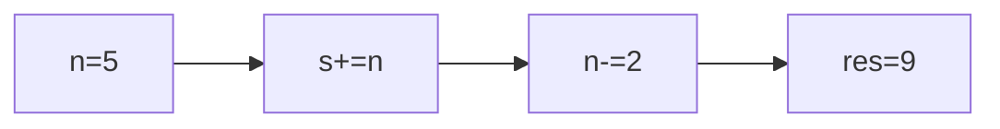

**📖 Penjelasan:**
**Langkah Tracing:**
1. Loop berjalan dengan langkah 2.
2. Hasil akumulasi: 9.

---
### Soal 105
```cpp
int n = 6, s = 0;
while(n > 0) { s += n; n -= 3; }
```
**Pertanyaan:**
1. Berapakah hasil akhirnya?
2. Mengapa demikian?

**Jawaban & Diagnosis:**
1. **9**
2. Lihat Tracing.

**Mermaid Flowchart:**


**📖 Penjelasan:**
**Langkah Tracing:**
1. Loop berjalan dengan langkah 3.
2. Hasil akumulasi: 9.

---
### Soal 106
```cpp
int s = 0;
for(int i=0; i<8; i+=2) s += i;
```
**Pertanyaan:**
1. Berapakah hasil akhirnya?
2. Mengapa demikian?

**Jawaban & Diagnosis:**
1. **12**
2. Lihat Tracing.

**Mermaid Flowchart:**
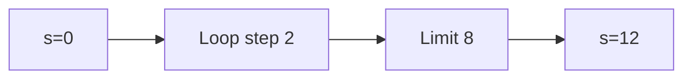

**📖 Penjelasan:**
**Langkah Tracing:**
1. Loop berjalan dengan langkah 2.
2. Hasil akumulasi: 12.

---
### Soal 107
```cpp
int s = 0;
for(int i=0; i<6; i+=3) s += i;
```
**Pertanyaan:**
1. Berapakah hasil akhirnya?
2. Mengapa demikian?

**Jawaban & Diagnosis:**
1. **3**
2. Lihat Tracing.

**Mermaid Flowchart:**
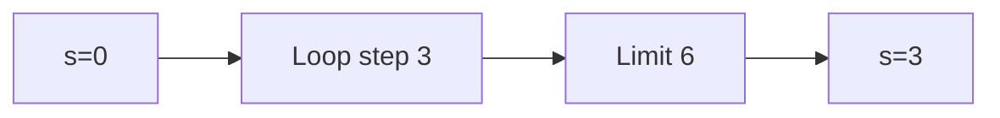

**📖 Penjelasan:**
**Langkah Tracing:**
1. Loop berjalan dengan langkah 3.
2. Hasil akumulasi: 3.

---
### Soal 108
```cpp
int s = 0;
for(int i=0; i<10; i+=1) s += i;
```
**Pertanyaan:**
1. Berapakah hasil akhirnya?
2. Mengapa demikian?

**Jawaban & Diagnosis:**
1. **45**
2. Lihat Tracing.

**Mermaid Flowchart:**
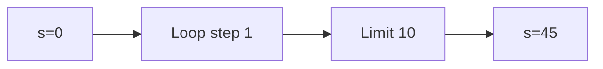

**📖 Penjelasan:**
**Langkah Tracing:**
1. Loop berjalan dengan langkah 1.
2. Hasil akumulasi: 45.

---
### Soal 109
```cpp
int s = 0;
for(int i=0; i<7; i+=3) s += i;
```
**Pertanyaan:**
1. Berapakah hasil akhirnya?
2. Mengapa demikian?

**Jawaban & Diagnosis:**
1. **9**
2. Lihat Tracing.

**Mermaid Flowchart:**
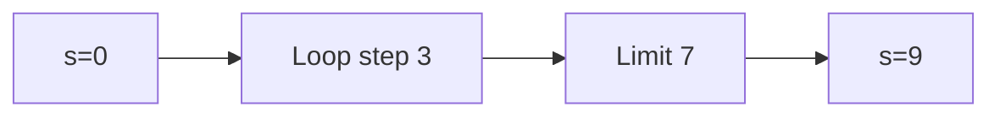

**📖 Penjelasan:**
**Langkah Tracing:**
1. Loop berjalan dengan langkah 3.
2. Hasil akumulasi: 9.

---
### Soal 110
```cpp
int n = 8, s = 0;
while(n > 0) { s += n; n -= 1; }
```
**Pertanyaan:**
1. Berapakah hasil akhirnya?
2. Mengapa demikian?

**Jawaban & Diagnosis:**
1. **36**
2. Lihat Tracing.

**Mermaid Flowchart:**
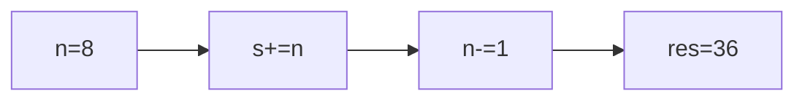

**📖 Penjelasan:**
**Langkah Tracing:**
1. Loop berjalan dengan langkah 1.
2. Hasil akumulasi: 36.

---
### Soal 111
```cpp
int s = 0;
for(int i=0; i<8; i+=1) s += i;
```
**Pertanyaan:**
1. Berapakah hasil akhirnya?
2. Mengapa demikian?

**Jawaban & Diagnosis:**
1. **28**
2. Lihat Tracing.

**Mermaid Flowchart:**


**📖 Penjelasan:**
**Langkah Tracing:**
1. Loop berjalan dengan langkah 1.
2. Hasil akumulasi: 28.

---
### Soal 112
```cpp
int n = 5, s = 0;
while(n > 0) { s += n; n -= 2; }
```
**Pertanyaan:**
1. Berapakah hasil akhirnya?
2. Mengapa demikian?

**Jawaban & Diagnosis:**
1. **9**
2. Lihat Tracing.

**Mermaid Flowchart:**


**📖 Penjelasan:**
**Langkah Tracing:**
1. Loop berjalan dengan langkah 2.
2. Hasil akumulasi: 9.

---
### Soal 113
```cpp
int s = 0;
for(int i=0; i<5; i+=3) s += i;
```
**Pertanyaan:**
1. Berapakah hasil akhirnya?
2. Mengapa demikian?

**Jawaban & Diagnosis:**
1. **3**
2. Lihat Tracing.

**Mermaid Flowchart:**
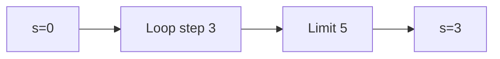

**📖 Penjelasan:**
**Langkah Tracing:**
1. Loop berjalan dengan langkah 3.
2. Hasil akumulasi: 3.

---
### Soal 114
```cpp
int s = 0;
for(int i=0; i<7; i+=2) s += i;
```
**Pertanyaan:**
1. Berapakah hasil akhirnya?
2. Mengapa demikian?

**Jawaban & Diagnosis:**
1. **12**
2. Lihat Tracing.

**Mermaid Flowchart:**
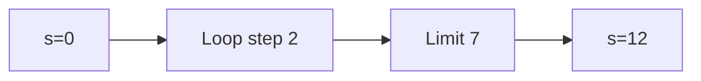

**📖 Penjelasan:**
**Langkah Tracing:**
1. Loop berjalan dengan langkah 2.
2. Hasil akumulasi: 12.

---
### Soal 115
```cpp
int s = 0;
for(int i=0; i<9; i+=2) s += i;
```
**Pertanyaan:**
1. Berapakah hasil akhirnya?
2. Mengapa demikian?

**Jawaban & Diagnosis:**
1. **20**
2. Lihat Tracing.

**Mermaid Flowchart:**
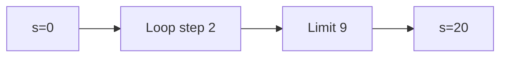

**📖 Penjelasan:**
**Langkah Tracing:**
1. Loop berjalan dengan langkah 2.
2. Hasil akumulasi: 20.

---
### Soal 116
```cpp
int n = 10, s = 0;
while(n > 0) { s += n; n -= 1; }
```
**Pertanyaan:**
1. Berapakah hasil akhirnya?
2. Mengapa demikian?

**Jawaban & Diagnosis:**
1. **55**
2. Lihat Tracing.

**Mermaid Flowchart:**
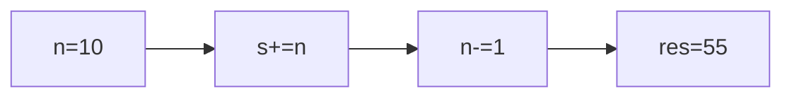

**📖 Penjelasan:**
**Langkah Tracing:**
1. Loop berjalan dengan langkah 1.
2. Hasil akumulasi: 55.

---
### Soal 117
```cpp
int n = 7, s = 0;
while(n > 0) { s += n; n -= 3; }
```
**Pertanyaan:**
1. Berapakah hasil akhirnya?
2. Mengapa demikian?

**Jawaban & Diagnosis:**
1. **12**
2. Lihat Tracing.

**Mermaid Flowchart:**
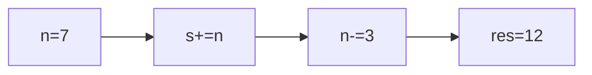

**📖 Penjelasan:**
**Langkah Tracing:**
1. Loop berjalan dengan langkah 3.
2. Hasil akumulasi: 12.

---
### Soal 118
```cpp
int n = 7, s = 0;
while(n > 0) { s += n; n -= 3; }
```
**Pertanyaan:**
1. Berapakah hasil akhirnya?
2. Mengapa demikian?

**Jawaban & Diagnosis:**
1. **12**
2. Lihat Tracing.

**Mermaid Flowchart:**


**📖 Penjelasan:**
**Langkah Tracing:**
1. Loop berjalan dengan langkah 3.
2. Hasil akumulasi: 12.

---
### Soal 119
```cpp
int s = 0;
for(int i=0; i<5; i+=1) s += i;
```
**Pertanyaan:**
1. Berapakah hasil akhirnya?
2. Mengapa demikian?

**Jawaban & Diagnosis:**
1. **10**
2. Lihat Tracing.

**Mermaid Flowchart:**
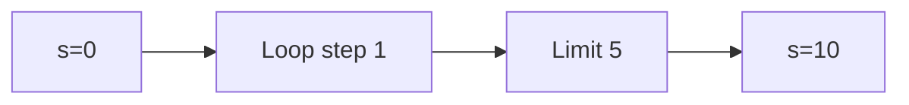

**📖 Penjelasan:**
**Langkah Tracing:**
1. Loop berjalan dengan langkah 1.
2. Hasil akumulasi: 10.

---
### Soal 120
```cpp
int n = 6, s = 0;
while(n > 0) { s += n; n -= 2; }
```
**Pertanyaan:**
1. Berapakah hasil akhirnya?
2. Mengapa demikian?

**Jawaban & Diagnosis:**
1. **12**
2. Lihat Tracing.

**Mermaid Flowchart:**
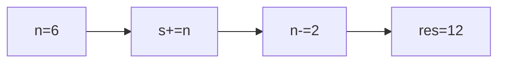

**📖 Penjelasan:**
**Langkah Tracing:**
1. Loop berjalan dengan langkah 2.
2. Hasil akumulasi: 12.

---
### Soal 121
```cpp
int n = 8, s = 0;
while(n > 0) { s += n; n -= 1; }
```
**Pertanyaan:**
1. Berapakah hasil akhirnya?
2. Mengapa demikian?

**Jawaban & Diagnosis:**
1. **36**
2. Lihat Tracing.

**Mermaid Flowchart:**
```mermaid
graph LR
A["n=8"] --> B["s+=n"]
B --> C["n-=1"]
C --> D["res=36"]
```

**📖 Penjelasan:**
**Langkah Tracing:**
1. Loop berjalan dengan langkah 1.
2. Hasil akumulasi: 36.

---
### Soal 122
```cpp
int s = 0;
for(int i=0; i<8; i+=1) s += i;
```
**Pertanyaan:**
1. Berapakah hasil akhirnya?
2. Mengapa demikian?

**Jawaban & Diagnosis:**
1. **28**
2. Lihat Tracing.

**Mermaid Flowchart:**
```mermaid
graph LR
A["s=0"] --> B["Loop step 1"]
B --> C["Limit 8"]
C --> D["s=28"]
```

**📖 Penjelasan:**
**Langkah Tracing:**
1. Loop berjalan dengan langkah 1.
2. Hasil akumulasi: 28.

---
### Soal 123
```cpp
int s = 0;
for(int i=0; i<6; i+=3) s += i;
```
**Pertanyaan:**
1. Berapakah hasil akhirnya?
2. Mengapa demikian?

**Jawaban & Diagnosis:**
1. **3**
2. Lihat Tracing.

**Mermaid Flowchart:**
```mermaid
graph LR
A["s=0"] --> B["Loop step 3"]
B --> C["Limit 6"]
C --> D["s=3"]
```

**📖 Penjelasan:**
**Langkah Tracing:**
1. Loop berjalan dengan langkah 3.
2. Hasil akumulasi: 3.

---
### Soal 124
```cpp
int n = 6, s = 0;
while(n > 0) { s += n; n -= 2; }
```
**Pertanyaan:**
1. Berapakah hasil akhirnya?
2. Mengapa demikian?

**Jawaban & Diagnosis:**
1. **12**
2. Lihat Tracing.

**Mermaid Flowchart:**
```mermaid
graph LR
A["n=6"] --> B["s+=n"]
B --> C["n-=2"]
C --> D["res=12"]
```

**📖 Penjelasan:**
**Langkah Tracing:**
1. Loop berjalan dengan langkah 2.
2. Hasil akumulasi: 12.

---
### Soal 125
```cpp
int n = 8, s = 0;
while(n > 0) { s += n; n -= 2; }
```
**Pertanyaan:**
1. Berapakah hasil akhirnya?
2. Mengapa demikian?

**Jawaban & Diagnosis:**
1. **20**
2. Lihat Tracing.

**Mermaid Flowchart:**
```mermaid
graph LR
A["n=8"] --> B["s+=n"]
B --> C["n-=2"]
C --> D["res=20"]
```

**📖 Penjelasan:**
**Langkah Tracing:**
1. Loop berjalan dengan langkah 2.
2. Hasil akumulasi: 20.

---
