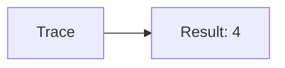
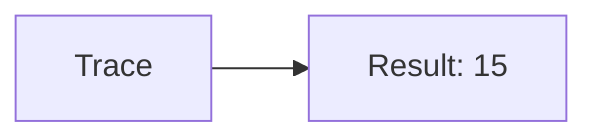
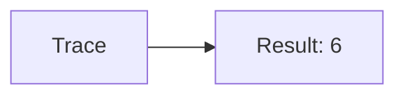
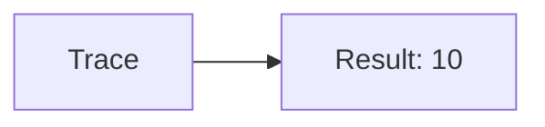
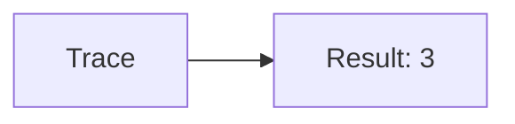

🔙 **[Kembali ke Daftar Soal](./README.md)**

---

# Latihan Soal Part C - Modul 03 - Set 06

### Soal 126
```cpp
// Puasa: Counter
int n=4, count=0;
while(n > 0) { count++; n--; }
```
**Pertanyaan:**
1. Berapakah hasil akhirnya?
2. Deskripsikan alur pikir 'Compiler Manusia' untuk soal ini!

**Jawaban & Diagnosis:**
1. **4**
2. Loop berjalan 4 kali sampai n=0.

**Mermaid Flowchart:**


---
### Soal 127
```cpp
// Zakat: Akumulasi
int total_zakat = 0;
for(int i=1; i<=5; i++) total_zakat += i;
```
**Pertanyaan:**
1. Berapakah hasil akhirnya?
2. Deskripsikan alur pikir 'Compiler Manusia' untuk soal ini!

**Jawaban & Diagnosis:**
1. **15**
2. Menghitung total dari 1 sampai 5.

**Mermaid Flowchart:**


---
### Soal 128
```cpp
// Haji: Counter
int n=5, count=0;
while(n > 0) { count++; n--; }
```
**Pertanyaan:**
1. Berapakah hasil akhirnya?
2. Deskripsikan alur pikir 'Compiler Manusia' untuk soal ini!

**Jawaban & Diagnosis:**
1. **5**
2. Loop berjalan 5 kali sampai n=0.

**Mermaid Flowchart:**


---
### Soal 129
```cpp
// Umroh: Akumulasi
int total_umroh = 0;
for(int i=1; i<=3; i++) total_umroh += i;
```
**Pertanyaan:**
1. Berapakah hasil akhirnya?
2. Deskripsikan alur pikir 'Compiler Manusia' untuk soal ini!

**Jawaban & Diagnosis:**
1. **6**
2. Menghitung total dari 1 sampai 3.

**Mermaid Flowchart:**


---
### Soal 130
```cpp
// Sadaqah: Counter
int n=4, count=0;
while(n > 0) { count++; n--; }
```
**Pertanyaan:**
1. Berapakah hasil akhirnya?
2. Deskripsikan alur pikir 'Compiler Manusia' untuk soal ini!

**Jawaban & Diagnosis:**
1. **4**
2. Loop berjalan 4 kali sampai n=0.

**Mermaid Flowchart:**


---
### Soal 131
```cpp
// Infaq: Akumulasi
int total_infaq = 0;
for(int i=1; i<=5; i++) total_infaq += i;
```
**Pertanyaan:**
1. Berapakah hasil akhirnya?
2. Deskripsikan alur pikir 'Compiler Manusia' untuk soal ini!

**Jawaban & Diagnosis:**
1. **15**
2. Menghitung total dari 1 sampai 5.

**Mermaid Flowchart:**


---
### Soal 132
```cpp
// Donasi: Counter
int n=4, count=0;
while(n > 0) { count++; n--; }
```
**Pertanyaan:**
1. Berapakah hasil akhirnya?
2. Deskripsikan alur pikir 'Compiler Manusia' untuk soal ini!

**Jawaban & Diagnosis:**
1. **4**
2. Loop berjalan 4 kali sampai n=0.

**Mermaid Flowchart:**


---
### Soal 133
```cpp
// BaktiSocial: Akumulasi
int total_baktisocial = 0;
for(int i=1; i<=3; i++) total_baktisocial += i;
```
**Pertanyaan:**
1. Berapakah hasil akhirnya?
2. Deskripsikan alur pikir 'Compiler Manusia' untuk soal ini!

**Jawaban & Diagnosis:**
1. **6**
2. Menghitung total dari 1 sampai 3.

**Mermaid Flowchart:**


---
### Soal 134
```cpp
// Relawan: Counter
int n=5, count=0;
while(n > 0) { count++; n--; }
```
**Pertanyaan:**
1. Berapakah hasil akhirnya?
2. Deskripsikan alur pikir 'Compiler Manusia' untuk soal ini!

**Jawaban & Diagnosis:**
1. **5**
2. Loop berjalan 5 kali sampai n=0.

**Mermaid Flowchart:**


---
### Soal 135
```cpp
// Amal: Akumulasi
int total_amal = 0;
for(int i=1; i<=4; i++) total_amal += i;
```
**Pertanyaan:**
1. Berapakah hasil akhirnya?
2. Deskripsikan alur pikir 'Compiler Manusia' untuk soal ini!

**Jawaban & Diagnosis:**
1. **10**
2. Menghitung total dari 1 sampai 4.

**Mermaid Flowchart:**


---
### Soal 136
```cpp
// Ibadah: Counter
int n=5, count=0;
while(n > 0) { count++; n--; }
```
**Pertanyaan:**
1. Berapakah hasil akhirnya?
2. Deskripsikan alur pikir 'Compiler Manusia' untuk soal ini!

**Jawaban & Diagnosis:**
1. **5**
2. Loop berjalan 5 kali sampai n=0.

**Mermaid Flowchart:**


---
### Soal 137
```cpp
// Dzikir: Akumulasi
int total_dzikir = 0;
for(int i=1; i<=3; i++) total_dzikir += i;
```
**Pertanyaan:**
1. Berapakah hasil akhirnya?
2. Deskripsikan alur pikir 'Compiler Manusia' untuk soal ini!

**Jawaban & Diagnosis:**
1. **6**
2. Menghitung total dari 1 sampai 3.

**Mermaid Flowchart:**


---
### Soal 138
```cpp
// Doa: Counter
int n=3, count=0;
while(n > 0) { count++; n--; }
```
**Pertanyaan:**
1. Berapakah hasil akhirnya?
2. Deskripsikan alur pikir 'Compiler Manusia' untuk soal ini!

**Jawaban & Diagnosis:**
1. **3**
2. Loop berjalan 3 kali sampai n=0.

**Mermaid Flowchart:**


---
### Soal 139
```cpp
// Ngaji: Akumulasi
int total_ngaji = 0;
for(int i=1; i<=4; i++) total_ngaji += i;
```
**Pertanyaan:**
1. Berapakah hasil akhirnya?
2. Deskripsikan alur pikir 'Compiler Manusia' untuk soal ini!

**Jawaban & Diagnosis:**
1. **10**
2. Menghitung total dari 1 sampai 4.

**Mermaid Flowchart:**


---
### Soal 140
```cpp
// Tadarus: Counter
int n=5, count=0;
while(n > 0) { count++; n--; }
```
**Pertanyaan:**
1. Berapakah hasil akhirnya?
2. Deskripsikan alur pikir 'Compiler Manusia' untuk soal ini!

**Jawaban & Diagnosis:**
1. **5**
2. Loop berjalan 5 kali sampai n=0.

**Mermaid Flowchart:**


---
### Soal 141
```cpp
// Hafalan: Akumulasi
int total_hafalan = 0;
for(int i=1; i<=3; i++) total_hafalan += i;
```
**Pertanyaan:**
1. Berapakah hasil akhirnya?
2. Deskripsikan alur pikir 'Compiler Manusia' untuk soal ini!

**Jawaban & Diagnosis:**
1. **6**
2. Menghitung total dari 1 sampai 3.

**Mermaid Flowchart:**


---
### Soal 142
```cpp
// Setoran: Counter
int n=3, count=0;
while(n > 0) { count++; n--; }
```
**Pertanyaan:**
1. Berapakah hasil akhirnya?
2. Deskripsikan alur pikir 'Compiler Manusia' untuk soal ini!

**Jawaban & Diagnosis:**
1. **3**
2. Loop berjalan 3 kali sampai n=0.

**Mermaid Flowchart:**


---
### Soal 143
```cpp
// Ustadz: Akumulasi
int total_ustadz = 0;
for(int i=1; i<=6; i++) total_ustadz += i;
```
**Pertanyaan:**
1. Berapakah hasil akhirnya?
2. Deskripsikan alur pikir 'Compiler Manusia' untuk soal ini!

**Jawaban & Diagnosis:**
1. **21**
2. Menghitung total dari 1 sampai 6.

**Mermaid Flowchart:**


---
### Soal 144
```cpp
// Kiai: Counter
int n=6, count=0;
while(n > 0) { count++; n--; }
```
**Pertanyaan:**
1. Berapakah hasil akhirnya?
2. Deskripsikan alur pikir 'Compiler Manusia' untuk soal ini!

**Jawaban & Diagnosis:**
1. **6**
2. Loop berjalan 6 kali sampai n=0.

**Mermaid Flowchart:**


---
### Soal 145
```cpp
// Santri: Akumulasi
int total_santri = 0;
for(int i=1; i<=5; i++) total_santri += i;
```
**Pertanyaan:**
1. Berapakah hasil akhirnya?
2. Deskripsikan alur pikir 'Compiler Manusia' untuk soal ini!

**Jawaban & Diagnosis:**
1. **15**
2. Menghitung total dari 1 sampai 5.

**Mermaid Flowchart:**


---
### Soal 146
```cpp
// Pesantren: Counter
int n=6, count=0;
while(n > 0) { count++; n--; }
```
**Pertanyaan:**
1. Berapakah hasil akhirnya?
2. Deskripsikan alur pikir 'Compiler Manusia' untuk soal ini!

**Jawaban & Diagnosis:**
1. **6**
2. Loop berjalan 6 kali sampai n=0.

**Mermaid Flowchart:**
```mermaid
graph LR
A[Trace] --> B[Result: 6]
```

---
### Soal 147
```cpp
// Madrasah: Akumulasi
int total_madrasah = 0;
for(int i=1; i<=6; i++) total_madrasah += i;
```
**Pertanyaan:**
1. Berapakah hasil akhirnya?
2. Deskripsikan alur pikir 'Compiler Manusia' untuk soal ini!

**Jawaban & Diagnosis:**
1. **21**
2. Menghitung total dari 1 sampai 6.

**Mermaid Flowchart:**
```mermaid
graph LR
A[Trace] --> B[Result: 21]
```

---
### Soal 148
```cpp
// Sekolah: Counter
int n=6, count=0;
while(n > 0) { count++; n--; }
```
**Pertanyaan:**
1. Berapakah hasil akhirnya?
2. Deskripsikan alur pikir 'Compiler Manusia' untuk soal ini!

**Jawaban & Diagnosis:**
1. **6**
2. Loop berjalan 6 kali sampai n=0.

**Mermaid Flowchart:**
```mermaid
graph LR
A[Trace] --> B[Result: 6]
```

---
### Soal 149
```cpp
// Kampus: Akumulasi
int total_kampus = 0;
for(int i=1; i<=5; i++) total_kampus += i;
```
**Pertanyaan:**
1. Berapakah hasil akhirnya?
2. Deskripsikan alur pikir 'Compiler Manusia' untuk soal ini!

**Jawaban & Diagnosis:**
1. **15**
2. Menghitung total dari 1 sampai 5.

**Mermaid Flowchart:**
```mermaid
graph LR
A[Trace] --> B[Result: 15]
```

---
### Soal 150
```cpp
// Kuliah: Counter
int n=5, count=0;
while(n > 0) { count++; n--; }
```
**Pertanyaan:**
1. Berapakah hasil akhirnya?
2. Deskripsikan alur pikir 'Compiler Manusia' untuk soal ini!

**Jawaban & Diagnosis:**
1. **5**
2. Loop berjalan 5 kali sampai n=0.

**Mermaid Flowchart:**
```mermaid
graph LR
A[Trace] --> B[Result: 5]
```

---
