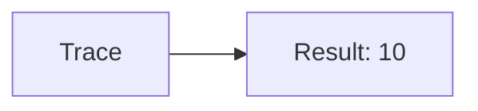
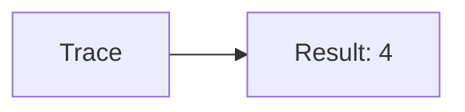
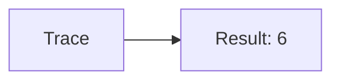
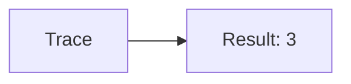
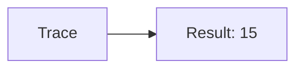

🔙 **[Kembali ke Daftar Soal](./README.md)**

---

# Latihan Soal Part C - Modul 03 - Set 07

### Soal 151
```cpp
// Skripsi: Akumulasi
int total_skripsi = 0;
for(int i=1; i<=4; i++) total_skripsi += i;
```
**Pertanyaan:**
1. Berapakah hasil akhirnya?
2. Deskripsikan alur pikir 'Compiler Manusia' untuk soal ini!

**Jawaban & Diagnosis:**
1. **10**
2. Menghitung total dari 1 sampai 4.

**Mermaid Flowchart:**


---
### Soal 152
```cpp
// Tesis: Counter
int n=4, count=0;
while(n > 0) { count++; n--; }
```
**Pertanyaan:**
1. Berapakah hasil akhirnya?
2. Deskripsikan alur pikir 'Compiler Manusia' untuk soal ini!

**Jawaban & Diagnosis:**
1. **4**
2. Loop berjalan 4 kali sampai n=0.

**Mermaid Flowchart:**


---
### Soal 153
```cpp
// Disertasi: Akumulasi
int total_disertasi = 0;
for(int i=1; i<=4; i++) total_disertasi += i;
```
**Pertanyaan:**
1. Berapakah hasil akhirnya?
2. Deskripsikan alur pikir 'Compiler Manusia' untuk soal ini!

**Jawaban & Diagnosis:**
1. **10**
2. Menghitung total dari 1 sampai 4.

**Mermaid Flowchart:**


---
### Soal 154
```cpp
// Wisuda: Counter
int n=5, count=0;
while(n > 0) { count++; n--; }
```
**Pertanyaan:**
1. Berapakah hasil akhirnya?
2. Deskripsikan alur pikir 'Compiler Manusia' untuk soal ini!

**Jawaban & Diagnosis:**
1. **5**
2. Loop berjalan 5 kali sampai n=0.

**Mermaid Flowchart:**


---
### Soal 155
```cpp
// Ijazah: Akumulasi
int total_ijazah = 0;
for(int i=1; i<=3; i++) total_ijazah += i;
```
**Pertanyaan:**
1. Berapakah hasil akhirnya?
2. Deskripsikan alur pikir 'Compiler Manusia' untuk soal ini!

**Jawaban & Diagnosis:**
1. **6**
2. Menghitung total dari 1 sampai 3.

**Mermaid Flowchart:**


---
### Soal 156
```cpp
// Sertifikat: Counter
int n=4, count=0;
while(n > 0) { count++; n--; }
```
**Pertanyaan:**
1. Berapakah hasil akhirnya?
2. Deskripsikan alur pikir 'Compiler Manusia' untuk soal ini!

**Jawaban & Diagnosis:**
1. **4**
2. Loop berjalan 4 kali sampai n=0.

**Mermaid Flowchart:**


---
### Soal 157
```cpp
// Piagam: Akumulasi
int total_piagam = 0;
for(int i=1; i<=6; i++) total_piagam += i;
```
**Pertanyaan:**
1. Berapakah hasil akhirnya?
2. Deskripsikan alur pikir 'Compiler Manusia' untuk soal ini!

**Jawaban & Diagnosis:**
1. **21**
2. Menghitung total dari 1 sampai 6.

**Mermaid Flowchart:**


---
### Soal 158
```cpp
// Medali: Counter
int n=6, count=0;
while(n > 0) { count++; n--; }
```
**Pertanyaan:**
1. Berapakah hasil akhirnya?
2. Deskripsikan alur pikir 'Compiler Manusia' untuk soal ini!

**Jawaban & Diagnosis:**
1. **6**
2. Loop berjalan 6 kali sampai n=0.

**Mermaid Flowchart:**


---
### Soal 159
```cpp
// Piala: Akumulasi
int total_piala = 0;
for(int i=1; i<=3; i++) total_piala += i;
```
**Pertanyaan:**
1. Berapakah hasil akhirnya?
2. Deskripsikan alur pikir 'Compiler Manusia' untuk soal ini!

**Jawaban & Diagnosis:**
1. **6**
2. Menghitung total dari 1 sampai 3.

**Mermaid Flowchart:**


---
### Soal 160
```cpp
// Juara: Counter
int n=5, count=0;
while(n > 0) { count++; n--; }
```
**Pertanyaan:**
1. Berapakah hasil akhirnya?
2. Deskripsikan alur pikir 'Compiler Manusia' untuk soal ini!

**Jawaban & Diagnosis:**
1. **5**
2. Loop berjalan 5 kali sampai n=0.

**Mermaid Flowchart:**


---
### Soal 161
```cpp
// Menang: Akumulasi
int total_menang = 0;
for(int i=1; i<=4; i++) total_menang += i;
```
**Pertanyaan:**
1. Berapakah hasil akhirnya?
2. Deskripsikan alur pikir 'Compiler Manusia' untuk soal ini!

**Jawaban & Diagnosis:**
1. **10**
2. Menghitung total dari 1 sampai 4.

**Mermaid Flowchart:**


---
### Soal 162
```cpp
// Kalah: Counter
int n=4, count=0;
while(n > 0) { count++; n--; }
```
**Pertanyaan:**
1. Berapakah hasil akhirnya?
2. Deskripsikan alur pikir 'Compiler Manusia' untuk soal ini!

**Jawaban & Diagnosis:**
1. **4**
2. Loop berjalan 4 kali sampai n=0.

**Mermaid Flowchart:**


---
### Soal 163
```cpp
// Seri: Akumulasi
int total_seri = 0;
for(int i=1; i<=6; i++) total_seri += i;
```
**Pertanyaan:**
1. Berapakah hasil akhirnya?
2. Deskripsikan alur pikir 'Compiler Manusia' untuk soal ini!

**Jawaban & Diagnosis:**
1. **21**
2. Menghitung total dari 1 sampai 6.

**Mermaid Flowchart:**


---
### Soal 164
```cpp
// Skor: Counter
int n=5, count=0;
while(n > 0) { count++; n--; }
```
**Pertanyaan:**
1. Berapakah hasil akhirnya?
2. Deskripsikan alur pikir 'Compiler Manusia' untuk soal ini!

**Jawaban & Diagnosis:**
1. **5**
2. Loop berjalan 5 kali sampai n=0.

**Mermaid Flowchart:**


---
### Soal 165
```cpp
// Gol: Akumulasi
int total_gol = 0;
for(int i=1; i<=6; i++) total_gol += i;
```
**Pertanyaan:**
1. Berapakah hasil akhirnya?
2. Deskripsikan alur pikir 'Compiler Manusia' untuk soal ini!

**Jawaban & Diagnosis:**
1. **21**
2. Menghitung total dari 1 sampai 6.

**Mermaid Flowchart:**


---
### Soal 166
```cpp
// Poin: Counter
int n=3, count=0;
while(n > 0) { count++; n--; }
```
**Pertanyaan:**
1. Berapakah hasil akhirnya?
2. Deskripsikan alur pikir 'Compiler Manusia' untuk soal ini!

**Jawaban & Diagnosis:**
1. **3**
2. Loop berjalan 3 kali sampai n=0.

**Mermaid Flowchart:**


---
### Soal 167
```cpp
// Set: Akumulasi
int total_set = 0;
for(int i=1; i<=6; i++) total_set += i;
```
**Pertanyaan:**
1. Berapakah hasil akhirnya?
2. Deskripsikan alur pikir 'Compiler Manusia' untuk soal ini!

**Jawaban & Diagnosis:**
1. **21**
2. Menghitung total dari 1 sampai 6.

**Mermaid Flowchart:**


---
### Soal 168
```cpp
// Game: Counter
int n=5, count=0;
while(n > 0) { count++; n--; }
```
**Pertanyaan:**
1. Berapakah hasil akhirnya?
2. Deskripsikan alur pikir 'Compiler Manusia' untuk soal ini!

**Jawaban & Diagnosis:**
1. **5**
2. Loop berjalan 5 kali sampai n=0.

**Mermaid Flowchart:**


---
### Soal 169
```cpp
// Match: Akumulasi
int total_match = 0;
for(int i=1; i<=5; i++) total_match += i;
```
**Pertanyaan:**
1. Berapakah hasil akhirnya?
2. Deskripsikan alur pikir 'Compiler Manusia' untuk soal ini!

**Jawaban & Diagnosis:**
1. **15**
2. Menghitung total dari 1 sampai 5.

**Mermaid Flowchart:**


---
### Soal 170
```cpp
// Tournament: Counter
int n=4, count=0;
while(n > 0) { count++; n--; }
```
**Pertanyaan:**
1. Berapakah hasil akhirnya?
2. Deskripsikan alur pikir 'Compiler Manusia' untuk soal ini!

**Jawaban & Diagnosis:**
1. **4**
2. Loop berjalan 4 kali sampai n=0.

**Mermaid Flowchart:**


---
### Soal 171
```cpp
// League: Akumulasi
int total_league = 0;
for(int i=1; i<=6; i++) total_league += i;
```
**Pertanyaan:**
1. Berapakah hasil akhirnya?
2. Deskripsikan alur pikir 'Compiler Manusia' untuk soal ini!

**Jawaban & Diagnosis:**
1. **21**
2. Menghitung total dari 1 sampai 6.

**Mermaid Flowchart:**
```mermaid
graph LR
A[Trace] --> B[Result: 21]
```

---
### Soal 172
```cpp
// Cup: Counter
int n=4, count=0;
while(n > 0) { count++; n--; }
```
**Pertanyaan:**
1. Berapakah hasil akhirnya?
2. Deskripsikan alur pikir 'Compiler Manusia' untuk soal ini!

**Jawaban & Diagnosis:**
1. **4**
2. Loop berjalan 4 kali sampai n=0.

**Mermaid Flowchart:**
```mermaid
graph LR
A[Trace] --> B[Result: 4]
```

---
### Soal 173
```cpp
// Trophy: Akumulasi
int total_trophy = 0;
for(int i=1; i<=6; i++) total_trophy += i;
```
**Pertanyaan:**
1. Berapakah hasil akhirnya?
2. Deskripsikan alur pikir 'Compiler Manusia' untuk soal ini!

**Jawaban & Diagnosis:**
1. **21**
2. Menghitung total dari 1 sampai 6.

**Mermaid Flowchart:**
```mermaid
graph LR
A[Trace] --> B[Result: 21]
```

---
### Soal 174
```cpp
// Playoff: Counter
int n=6, count=0;
while(n > 0) { count++; n--; }
```
**Pertanyaan:**
1. Berapakah hasil akhirnya?
2. Deskripsikan alur pikir 'Compiler Manusia' untuk soal ini!

**Jawaban & Diagnosis:**
1. **6**
2. Loop berjalan 6 kali sampai n=0.

**Mermaid Flowchart:**
```mermaid
graph LR
A[Trace] --> B[Result: 6]
```

---
### Soal 175
```cpp
// Final: Akumulasi
int total_final = 0;
for(int i=1; i<=6; i++) total_final += i;
```
**Pertanyaan:**
1. Berapakah hasil akhirnya?
2. Deskripsikan alur pikir 'Compiler Manusia' untuk soal ini!

**Jawaban & Diagnosis:**
1. **21**
2. Menghitung total dari 1 sampai 6.

**Mermaid Flowchart:**
```mermaid
graph LR
A[Trace] --> B[Result: 21]
```

---
