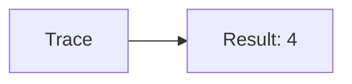
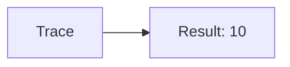
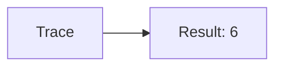
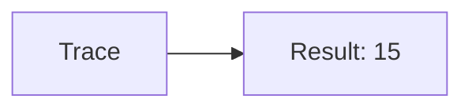
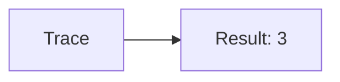

🔙 **[Kembali ke Daftar Soal](./README.md)**

---

# Latihan Soal Part C - Modul 03 - Set 09

### Soal 201
```cpp
// Step: Akumulasi
int total_step = 0;
for(int i=1; i<=6; i++) total_step += i;
```
**Pertanyaan:**
1. Berapakah hasil akhirnya?
2. Deskripsikan alur pikir 'Compiler Manusia' untuk soal ini!

**Jawaban & Diagnosis:**
1. **21**
2. Menghitung total dari 1 sampai 6.

**Mermaid Flowchart:**


---
### Soal 202
```cpp
// Save: Counter
int n=4, count=0;
while(n > 0) { count++; n--; }
```
**Pertanyaan:**
1. Berapakah hasil akhirnya?
2. Deskripsikan alur pikir 'Compiler Manusia' untuk soal ini!

**Jawaban & Diagnosis:**
1. **4**
2. Loop berjalan 4 kali sampai n=0.

**Mermaid Flowchart:**


---
### Soal 203
```cpp
// Lari: Akumulasi
int total_lari = 0;
for(int i=1; i<=4; i++) total_lari += i;
```
**Pertanyaan:**
1. Berapakah hasil akhirnya?
2. Deskripsikan alur pikir 'Compiler Manusia' untuk soal ini!

**Jawaban & Diagnosis:**
1. **10**
2. Menghitung total dari 1 sampai 4.

**Mermaid Flowchart:**


---
### Soal 204
```cpp
// Baca: Counter
int n=6, count=0;
while(n > 0) { count++; n--; }
```
**Pertanyaan:**
1. Berapakah hasil akhirnya?
2. Deskripsikan alur pikir 'Compiler Manusia' untuk soal ini!

**Jawaban & Diagnosis:**
1. **6**
2. Loop berjalan 6 kali sampai n=0.

**Mermaid Flowchart:**


---
### Soal 205
```cpp
// Tulis: Akumulasi
int total_tulis = 0;
for(int i=1; i<=5; i++) total_tulis += i;
```
**Pertanyaan:**
1. Berapakah hasil akhirnya?
2. Deskripsikan alur pikir 'Compiler Manusia' untuk soal ini!

**Jawaban & Diagnosis:**
1. **15**
2. Menghitung total dari 1 sampai 5.

**Mermaid Flowchart:**


---
### Soal 206
```cpp
// Makan: Counter
int n=5, count=0;
while(n > 0) { count++; n--; }
```
**Pertanyaan:**
1. Berapakah hasil akhirnya?
2. Deskripsikan alur pikir 'Compiler Manusia' untuk soal ini!

**Jawaban & Diagnosis:**
1. **5**
2. Loop berjalan 5 kali sampai n=0.

**Mermaid Flowchart:**


---
### Soal 207
```cpp
// Minum: Akumulasi
int total_minum = 0;
for(int i=1; i<=5; i++) total_minum += i;
```
**Pertanyaan:**
1. Berapakah hasil akhirnya?
2. Deskripsikan alur pikir 'Compiler Manusia' untuk soal ini!

**Jawaban & Diagnosis:**
1. **15**
2. Menghitung total dari 1 sampai 5.

**Mermaid Flowchart:**


---
### Soal 208
```cpp
// Tidur: Counter
int n=5, count=0;
while(n > 0) { count++; n--; }
```
**Pertanyaan:**
1. Berapakah hasil akhirnya?
2. Deskripsikan alur pikir 'Compiler Manusia' untuk soal ini!

**Jawaban & Diagnosis:**
1. **5**
2. Loop berjalan 5 kali sampai n=0.

**Mermaid Flowchart:**


---
### Soal 209
```cpp
// Main: Akumulasi
int total_main = 0;
for(int i=1; i<=6; i++) total_main += i;
```
**Pertanyaan:**
1. Berapakah hasil akhirnya?
2. Deskripsikan alur pikir 'Compiler Manusia' untuk soal ini!

**Jawaban & Diagnosis:**
1. **21**
2. Menghitung total dari 1 sampai 6.

**Mermaid Flowchart:**


---
### Soal 210
```cpp
// Kerja: Counter
int n=4, count=0;
while(n > 0) { count++; n--; }
```
**Pertanyaan:**
1. Berapakah hasil akhirnya?
2. Deskripsikan alur pikir 'Compiler Manusia' untuk soal ini!

**Jawaban & Diagnosis:**
1. **4**
2. Loop berjalan 4 kali sampai n=0.

**Mermaid Flowchart:**


---
### Soal 211
```cpp
// Belajar: Akumulasi
int total_belajar = 0;
for(int i=1; i<=5; i++) total_belajar += i;
```
**Pertanyaan:**
1. Berapakah hasil akhirnya?
2. Deskripsikan alur pikir 'Compiler Manusia' untuk soal ini!

**Jawaban & Diagnosis:**
1. **15**
2. Menghitung total dari 1 sampai 5.

**Mermaid Flowchart:**


---
### Soal 212
```cpp
// Kursus: Counter
int n=4, count=0;
while(n > 0) { count++; n--; }
```
**Pertanyaan:**
1. Berapakah hasil akhirnya?
2. Deskripsikan alur pikir 'Compiler Manusia' untuk soal ini!

**Jawaban & Diagnosis:**
1. **4**
2. Loop berjalan 4 kali sampai n=0.

**Mermaid Flowchart:**


---
### Soal 213
```cpp
// Les: Akumulasi
int total_les = 0;
for(int i=1; i<=3; i++) total_les += i;
```
**Pertanyaan:**
1. Berapakah hasil akhirnya?
2. Deskripsikan alur pikir 'Compiler Manusia' untuk soal ini!

**Jawaban & Diagnosis:**
1. **6**
2. Menghitung total dari 1 sampai 3.

**Mermaid Flowchart:**


---
### Soal 214
```cpp
// Ujian: Counter
int n=3, count=0;
while(n > 0) { count++; n--; }
```
**Pertanyaan:**
1. Berapakah hasil akhirnya?
2. Deskripsikan alur pikir 'Compiler Manusia' untuk soal ini!

**Jawaban & Diagnosis:**
1. **3**
2. Loop berjalan 3 kali sampai n=0.

**Mermaid Flowchart:**


---
### Soal 215
```cpp
// Tugas: Akumulasi
int total_tugas = 0;
for(int i=1; i<=3; i++) total_tugas += i;
```
**Pertanyaan:**
1. Berapakah hasil akhirnya?
2. Deskripsikan alur pikir 'Compiler Manusia' untuk soal ini!

**Jawaban & Diagnosis:**
1. **6**
2. Menghitung total dari 1 sampai 3.

**Mermaid Flowchart:**


---
### Soal 216
```cpp
// Proyek: Counter
int n=4, count=0;
while(n > 0) { count++; n--; }
```
**Pertanyaan:**
1. Berapakah hasil akhirnya?
2. Deskripsikan alur pikir 'Compiler Manusia' untuk soal ini!

**Jawaban & Diagnosis:**
1. **4**
2. Loop berjalan 4 kali sampai n=0.

**Mermaid Flowchart:**


---
### Soal 217
```cpp
// Rapat: Akumulasi
int total_rapat = 0;
for(int i=1; i<=6; i++) total_rapat += i;
```
**Pertanyaan:**
1. Berapakah hasil akhirnya?
2. Deskripsikan alur pikir 'Compiler Manusia' untuk soal ini!

**Jawaban & Diagnosis:**
1. **21**
2. Menghitung total dari 1 sampai 6.

**Mermaid Flowchart:**


---
### Soal 218
```cpp
// Presentasi: Counter
int n=4, count=0;
while(n > 0) { count++; n--; }
```
**Pertanyaan:**
1. Berapakah hasil akhirnya?
2. Deskripsikan alur pikir 'Compiler Manusia' untuk soal ini!

**Jawaban & Diagnosis:**
1. **4**
2. Loop berjalan 4 kali sampai n=0.

**Mermaid Flowchart:**


---
### Soal 219
```cpp
// Diskusi: Akumulasi
int total_diskusi = 0;
for(int i=1; i<=3; i++) total_diskusi += i;
```
**Pertanyaan:**
1. Berapakah hasil akhirnya?
2. Deskripsikan alur pikir 'Compiler Manusia' untuk soal ini!

**Jawaban & Diagnosis:**
1. **6**
2. Menghitung total dari 1 sampai 3.

**Mermaid Flowchart:**


---
### Soal 220
```cpp
// Debat: Counter
int n=6, count=0;
while(n > 0) { count++; n--; }
```
**Pertanyaan:**
1. Berapakah hasil akhirnya?
2. Deskripsikan alur pikir 'Compiler Manusia' untuk soal ini!

**Jawaban & Diagnosis:**
1. **6**
2. Loop berjalan 6 kali sampai n=0.

**Mermaid Flowchart:**


---
### Soal 221
```cpp
// Pidato: Akumulasi
int total_pidato = 0;
for(int i=1; i<=5; i++) total_pidato += i;
```
**Pertanyaan:**
1. Berapakah hasil akhirnya?
2. Deskripsikan alur pikir 'Compiler Manusia' untuk soal ini!

**Jawaban & Diagnosis:**
1. **15**
2. Menghitung total dari 1 sampai 5.

**Mermaid Flowchart:**
```mermaid
graph LR
A[Trace] --> B[Result: 15]
```

---
### Soal 222
```cpp
// Ceramah: Counter
int n=4, count=0;
while(n > 0) { count++; n--; }
```
**Pertanyaan:**
1. Berapakah hasil akhirnya?
2. Deskripsikan alur pikir 'Compiler Manusia' untuk soal ini!

**Jawaban & Diagnosis:**
1. **4**
2. Loop berjalan 4 kali sampai n=0.

**Mermaid Flowchart:**
```mermaid
graph LR
A[Trace] --> B[Result: 4]
```

---
### Soal 223
```cpp
// Khotbah: Akumulasi
int total_khotbah = 0;
for(int i=1; i<=6; i++) total_khotbah += i;
```
**Pertanyaan:**
1. Berapakah hasil akhirnya?
2. Deskripsikan alur pikir 'Compiler Manusia' untuk soal ini!

**Jawaban & Diagnosis:**
1. **21**
2. Menghitung total dari 1 sampai 6.

**Mermaid Flowchart:**
```mermaid
graph LR
A[Trace] --> B[Result: 21]
```

---
### Soal 224
```cpp
// Dakwah: Counter
int n=3, count=0;
while(n > 0) { count++; n--; }
```
**Pertanyaan:**
1. Berapakah hasil akhirnya?
2. Deskripsikan alur pikir 'Compiler Manusia' untuk soal ini!

**Jawaban & Diagnosis:**
1. **3**
2. Loop berjalan 3 kali sampai n=0.

**Mermaid Flowchart:**
```mermaid
graph LR
A[Trace] --> B[Result: 3]
```

---
### Soal 225
```cpp
// Sholat: Akumulasi
int total_sholat = 0;
for(int i=1; i<=6; i++) total_sholat += i;
```
**Pertanyaan:**
1. Berapakah hasil akhirnya?
2. Deskripsikan alur pikir 'Compiler Manusia' untuk soal ini!

**Jawaban & Diagnosis:**
1. **21**
2. Menghitung total dari 1 sampai 6.

**Mermaid Flowchart:**
```mermaid
graph LR
A[Trace] --> B[Result: 21]
```

---
