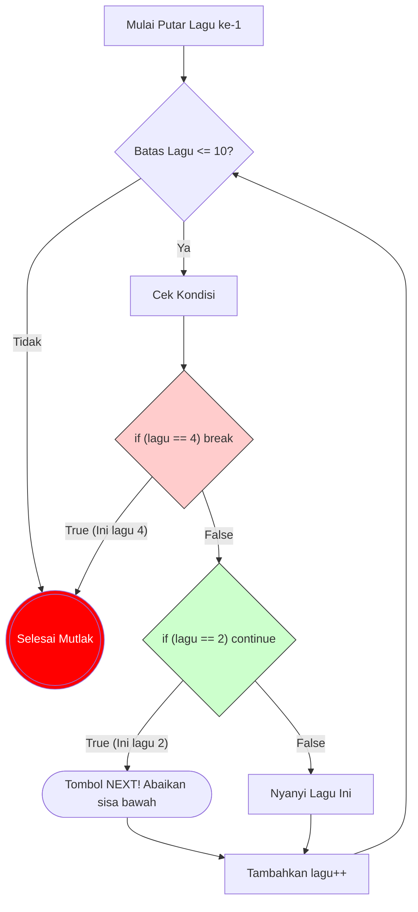

# 3. Perulangan & Array (Trek Lari & Playlist Spotify)

Kamu sudah lulus dari ujian *Simulasi Brute Force* di Part B kemarin! Di Part C ini, kita akan melihat wujud asli kode C++ bermesin putar yang kamu lacak susah payah kemarin siang: **Perulangan (`for`, `while`)** dan tempat penyimpanannya yakni **Array**.

Dalam membaca soal *"Compiler Manusia"*, sering kali juri sengaja menyisipkan tombol gaib bernama `break` dan `continue` untuk mengecoh simulasi iterasi *looping*-mu. Mari kita bongkar saklar rahasiannya!


---

### 📝 Latihan Soal Tracing
Sudah paham teorinya? Uji ketajaman matamu di sini:
👉 **[Bank Soal Modul 03: Perulangan (300 Soal)](./latihan/README.md)**

---

## 🏃 A. Aturan Main Mesin Lari (Looping Mutlak)

Sintaks C++ `for` memiliki 3 mesin waktu yang dipisahkan oleh tanda titik koma (`;`).
```cpp
for (int i = 0; i < 5; i++) {
   // Aksi putaran
}
```
**Analogi Trek Lari Senayan:**
1. Mesin 1: `int i = 0`. Ini Dapur Start. Kamu mulai memanaskan mesin sepatu dari garis $0$.
2. Mesin 2: `i < 5`. Ini Wasit Peniup Peluit. Selama syarta ini terpenuhi (contoh: Apakah sepatu $i=3$ masih lebih kecil dari $5$?), peluit terus menerus dibunyikan untuk suruh kamu lari 1 putaran lagi! Peringatan keras: Kalau $i=5$, peluit distop. Mesin lari mati seketika!
3. Mesin 3: `i++` (alias `i = i + 1`). Ini Sepatu Lari. Begitu kelar putaran track lapangan, poin kamu ditambahkan sesuai batas ini.

### ⚠️ Jebakan Batman #4: Loop Berjalan Mundur
Hati-hati! OSN-K benci soal yang lurus lurus aja. Jangan otomatis selalu mutar *Nge-plus-plus* (`i++`). Soal sering menaruh `i = i - 2` yang menyebabkan mesin lari ke arah belakang.

```cpp
for (int peluru = 10; peluru > 0; peluru -= 3) {
    ...
}
```
Dalam *Tracing Loop* di coretan kertas buram, mulailah berteriak manual: "Peluru 10 $\\rightarrow$ sisa 7 $\\rightarrow$ sisa 4 $\\rightarrow$ sisa 1 $\\rightarrow$ sisa -2 (STOP/BUNUH DIRI SINTAKTIKAL!)."

---

## ⏳ B. Macam-Macam Mesin Waktu Lainnya (While & Do-While)

Selain `for`, Juri C++ punya dua mesin waktu alternatif yang sering dipakai kalau mereka "Malas Ngitung Pakai Batasan Angka Mutlak".

### 1. `while` (Sang Penjaga Pintu Setia)
Beda dengan `for` yang mesinnnya lengkap di atas, `while` **hanya punya 1 syarat (Si Penjaga Pintu Peluit)**. Dia tidak peduli di dalam nanti kamu jalan ke depan, mundur, atau guling-guling, selama *syarat pintunya* murni terpenuhi, dia akan mutar selamanya!

**Analogi Lampu Merah:**
```cpp
int bensin = 5;
while (bensin > 0) {
    printf("Ngegas!\n");
    bensin--;  // JANGAN LUPA DITURUNIN!
}
```
*Tracing Logika:* Syarat `bensin > 0`. Selama mobil ada bensinnya terus aja maju!
**Jebakan Kematian OSN-K (`Infinite Loop`):** Hampir $20\%$ soal *tracing* yang bikin stress adalah saat mesin `while` **LUPA MENGURANGI/MENAMBAH VARIABEL PEMBANDINGNYA!**
Jika di kode di atas teks `bensin--;` dihapus, maka mesin ini akan berputar abadi sampai matahari runtuh! (Dan jawaban di pilgan OSN-K biasanya tertulis: `"Program tidak akan berhenti / TLE"`).

### 2. `do-while` (Lakukan Dulu, Mati Belakangan!)
Ini adalah mesin Paling Konyol! Mesin ini **memaksa nyemplung ke kolam SATU KALI WAJIB SATU KALI MURNI**... dan baru mikir ngecek keamanan airnya belakangan sesudah basah kuyup!

**Analogi Nebeng Temen Kebut-kebutan:**
```cpp
int keberanian = 0;
do {
    printf("Naik Rollercoaster!\n");
} while (keberanian > 100);
```
*Tracing Logika OSN-K:*
Apakah `keberanian` si Budi di atas $100$? Jelas tidak, batinnya $0$ (Pengecut murni).
TAPI! Karena ini pakai `do`, Budi **DIPAKSA NAIK ROLLERCOASTER DULUAN SATU KALI!** (`printf` dieksekusi). 
Setelah selesai muntah-muntah 1 kali putaran, mesin di bawah baru mengecek penjaga pintunya: `while (keberanian > 100)`. Apakah iya? Oalah ternyata ngga berani. Budi pun berhenti!
*(Jika memakai `while` biasa, Budi TIDAK AKAN PERNAH NAIK SEKALIPUN!)*

---

## 🪆 C. Perulangan Bersarang (Nested Loops & Jam Pasir)

Di level lanjut, juri menaruh mesin `for` di DALAM mesin `for` yang lain! (Inception!).
```cpp
for (int hari = 1; hari <= 3; hari++) {        // SIKLUS LUAR (Lambat)
    for (int jam = 1; jam <= 2; jam++) {       // SIKLUS DALAM (Berputar Gila-gilaan)
        printf("Hari %d, Jam %d\n", hari, jam);
    }
}
```
**Analogi Jam Pasir & Jarum Jam:**
Jarum Pendek (Hari) menunjuk angka $1$. 
Lalu turun ke Jarum Panjang (Jam). Jarum panjang WAJIB BERPUTAR SIKSA CEPAT MENGHABISKAN SELURUH AMUNISINYA ($1$ dan $2$) SEBELUM DIIZINKAN KEMBALI NAIK KE ATAS MEMUTAR JARUM PENDEK KE ANGKA $2$!

*Jejak Kertas OSN-K mu harus begini:*
- `H = 1` $\rightarrow$ Turun ke dalam. `J` berputar: $1$, lalu $2$ (Stop).
- Naik ke atas. `H` maju jadi `2`. Turun ke dalam. `J` **DIPUTAR ULANG DARI AWAL!**: $1$, lalu $2$ (Stop).
- Naik ke atas. `H` maju jadi `3`. Turun ke dalam. `J` dihajar ulangi lagi: $1$, lalu $2$ (Stop).
Total output baris yang keluar adalah $3 \times 2 = 6$ baris!
Inilah algoritma pencetak Segitiga Bintang (`*`) dan array Matriks $2D$ yang akan nge-*lag*-in otak *tracing* mu nanti.

---

## 🎵 D. Tombol Gaib: Break vs Continue (Playlist Spotify)

Di dalam lorong gelap perulangan, sang juri C++ kadang meletakkan gerbang penyeleksi:

```cpp
for (int lagu = 1; lagu <= 10; lagu++) {
    if (lagu == 4) break;
    if (lagu == 2) continue;
    printf("Nyanyi lagu %d\n", lagu);
}
```

Bagi *Compiler Manusia* pemula, `break` dan `continue` ini sering tertukar definisinya.
Mari perjelas perbedaannya memakai analogi **Aplikasi Spotify**:


**📖 Cara Membaca Grafik "*Break vs Continue*":**
- Saat Loop mencapai `lagu = 2` (Kotak F), mesin membentur dinding `continue`. Panah akan memaksa mesin lompat menyeberang langsung ke atas (`lagu++`) tanpa sempat menyanyikan lagunya. *"Lagu 2 Di-Skip!"*
- Saat Loop menyentuh `lagu = 4` (Kotak E), mesin menabrak tembok sakratul maut `break`. Panah merah akan menyeret mesin KELUAR dari seluruh sistem *Looping* (Kotak D/Selesai). Perulangan resmi tamat di hari itu juga, `lagu=5` ke atas takkan pernah disentuh!

### ⏩ 1. CONTINUE (Skip ke Lagu Selanjutnya!)
`continue` artinya kamu membatalkan sisa bait program pada putaran spesifik *saat ini* SAJA, lalu langsung lompat ke kepala iterasi atas buat **memutar lagu berikutnya**.

- **Jejak Logika Coretanmu:** *Aplikasi mutar Lagu ke-2 $\\rightarrow$ Eh, lagunya galau banget (Ketemu `continue`) $\\rightarrow$ Langsung tekan tombol "Next Track" ($\\rightarrow$) lewati printf, naik kembali putar lagu 3.*

### ⏹️ 2. BREAK (Matikan Aplikasinya! Lari dari Lorong!)
`break` jauh lebih kejam. Begitu tersentuh, fungsi ini seketika MELEDAKKAN / MEMBUNUH seluruh aplikasi perulangan seutuhnya! Lingkaran Trek senayan dibakar! Lagu sisa takkan diputar selamanya.

- **Jejak Logika Coretanmu:** *Aplikasi mutar Lagu ke-4 $\\rightarrow$ Astaga penyanyinya mantan pacarku (Ketemu `break`) $\\rightarrow$ Banting HP nya, keluar cabut pulang! Mesin langsung lompat menembus dinding keluar dari kurung kurawal `}` sang Perulangan.* 

*(Output kodingan di atas hanyalah "Nyanyi lagu 1" lalu "Nyanyi lagu 3" lalu sunyi murni!).*

---

## 📦 C. Tabrakan Dinding Array (Index Bounded)

Array di C++ (seperti `arr[10]`) adalah deretan lemari berhimpitan. Indeks mutlaknya selalu berjalan dari kardus nomor gembok **`0` hingga `9`**.
Juri C++ sangat suka mengetes kepekaanmu di ujung batas (*Off-by-One Error*).

```cpp
int uang[5] = {10, 20, 30, 40, 50};
for (int i = 0; i <= 5; i++) {
    uang[i] += 5;
}
```
**Bencana OOB (Out Of Bounds):**
Lihat mesin `for` melempar `i <= 5`.
Artinya *looping* mesin sepatu tersebut memaksakan diri mengakses loker kunci ke `5` alias `uang[5]`. Padahal deklarasinya, `uang[5]` HANYA berdiri untuk 5 pintu loker berindeks gembok `0, 1, 2, 3, 4`!

Mengakses `uang[5]` di C++ = **Mendobrak dinding kelas sebelah!**
Perilaku program memuntahkan *Garbage Value* atau berpotensi kiamat OS (Segmentation Fault). Sebagai pembaca soal, kalau ditanya nilai `uang[5]`, ketahuilah itu murni kesalahan mematikan dari sang arsitek soalnya!

---

## 💰 E. Teknik Kantong Tabungan (Prefix Sum)
 
 **Prasyarat (Prerequisite):** Kamu harus sudah paham cara kerja `for` loop dan cara meng-update nilai variabel (misal: `total = total + angka`).
 
 Di OSN-K 2025, muncul sebuah trik baru yang sering diselipkan dalam soal perulangan. Juri tidak lagi hanya bertanya berapa hasil akhir loop, tapi mereka membuat sebuah **"Daftar Tabungan"** di mana setiap elemen adalah jumlah dari elemen-elemen sebelumnya. Teknik ini disebut **Prefix Sum**.
 
 ### 🏺 1. Analogi Kantong Tabungan
 Bayangkan kamu menabung selama 5 hari:
 - Hari 1: Masukkan 10rb
 - Hari 2: Masukkan 20rb
 - Hari 3: Masukkan 5rb
 
 Jika ditanya: "Berapa isi kantongmu di hari ke-3?", jawabannya bukan 5rb, melainkan **10 + 20 + 5 = 35rb**. 
 
 Di C++, kodenya biasanya terlihat seperti ini:
 ```cpp
 int A[] = {10, 20, 5, 15, 10};
 int B[6]; // Kantong tabungan
 B[0] = 0; // Hari ke-0, tabungan masih kosong
 
 for (int i = 0; i < 5; i++) {
     B[i+1] = B[i] + A[i];
 }
 ```
 
 ### 🔍 2. Cara Tracing Prefix Sum (Human Compiler)
 Jangan menghitung totalnya satu-satu setiap kali ditanya. Buatlah tabel tabungan kumulatif:
 
 | `i` | `A[i]` (Uang Baru) | `B[i]` (Tabungan Lama) | `B[i+1]` (Tabungan Baru) |
 |---|---|---|---|
 | 0 | 10 | 0 | 0 + 10 = **10** |
 | 1 | 20 | 10 | 10 + 20 = **30** |
 | 2 | 5 | 30 | 30 + 5 = **35** |
 | 3 | 15 | 35 | 35 + 15 = **50** |
 | 4 | 10 | 50 | 50 + 10 = **60** |
 
 ### ⚡ 3. Kenapa Ini Penting? (Trik Cepat Soal OSN-K)
 Jika juri bertanya: **"Berapa jumlah elemen dari indeks 1 sampai 3?"** (yaitu 20 + 5 + 15).
 Kamu tidak perlu menjumlahkan manual lagi! Cukup lihat tabel tabunganmu:
 `Tabungan[Hari4] - Tabungan[Hari1]` $\rightarrow$ `50 - 10 = 40`.
 
 > [!TIP]
 > **Pola Hafalan OSN-K:** Jika kamu melihat kode di dalam loop yang polanya `B[i] = B[i-1] + A[i]`, itu tandanya juri sedang membangun **Prefix Sum**. Siapkan tabel akumulasi di kertas burammu segera!
 
 ---
 
 ### Siap Di Uji Tracing?

Kamu ditunjuk menjadi Komandan Compiler pada sebaris kodingan OSN Murni berikut:

```cpp
int total_harta = 0;
for (int lemari = 1; lemari <= 10; lemari += 2) {
    if (lemari == 5) continue;
    if (lemari == 9) break;
    total_harta += lemari;
}
print(total_harta);
```
**Berapakah total_harta yang dikurasi komputermu?**

**Diagnosis Logika Papan Tulis Juri C++:**
1. Mesin mulai dari pintu lari ganjil `lemari = 1, 3, 5, 7, 9`.
2. Lari `lemari=1` $\\rightarrow$ Aman. `total_harta += 1`. (Saldo = 1)
3. Lari `lemari=3` $\\rightarrow$ Aman. `total_harta += 3`. (Saldo = 4)
4. Lari `lemari=5` $\\rightarrow$ Pintu terdeteksi `continue`! Juri berteriak "SKIP KE NEXT LAGU!". Baris pertambahan *total harta* diabaikan mutlak. Mesin dipaksa lompat lanjut ke lari indeks `7`. (Saldo tetap 4).
5. Lari `lemari=7` $\\rightarrow$ Aman. `total_harta += 7`. (Saldo = 11)
6. Lari `lemari=9` $\\rightarrow$ Pintu terdeteksi `break`! Juri berteriak "BAKAR TREK LARI INI!". Sang juri lompat cabut terbang dari jeruji `{}` For Loop! Sisa proses tak tersentuh abadi.
7. Print Saldo Mutlak Final $\\rightarrow$ Nilainya tembus **`11`**.

Selamat, matamu telah mewarisi kutukan presisi mesin CPU intel gen-12!

⏩ **Lanjut ke Modul Keempat:** [Fungsi C++ & Manipulasi Referensi (Nyontek PR Tip-Ex)](./04-fungsi-dan-parameter-referensi.md)
