🔙 **[Kembali ke Daftar Soal](./README.md)**

---

# Latihan Soal Part C - Modul 04 - Set 01

### Soal 1
```cpp
void mesin_ajaib(int &a) { a = a + 10; }
// main: int saldo = 18; mesin_ajaib(saldo);
```
**Pertanyaan:**
1. Berapakah hasil akhirnya?
2. Deskripsikan langkah robot compiler saat memproses kode ini!

**Jawaban & Diagnosis:**
1. **28**
2. Baca bagian 'Analisis Mendalam' di bawah.

**Mermaid Flowchart:**


**📖 Penjelasan Komprehensif:**
**Analisis Mendalam (Compiler Manusia):**
1. **Pass-by-Reference**: Tanda `&` memberikan kunci akses langsung ke variabel `saldo`.
2. **Efek**: Apa pun yang dilakukan fungsi pada `a` langsung merubah isi fisik memori `saldo`.
3. **Hasil Akhir**: `saldo` bertambah jadi **28**.

---
### Soal 2
```cpp
void mesin_ajaib(int &a) { a = a + 10; }
// main: int saldo = 24; mesin_ajaib(saldo);
```
**Pertanyaan:**
1. Berapakah hasil akhirnya?
2. Deskripsikan langkah robot compiler saat memproses kode ini!

**Jawaban & Diagnosis:**
1. **34**
2. Baca bagian 'Analisis Mendalam' di bawah.

**Mermaid Flowchart:**
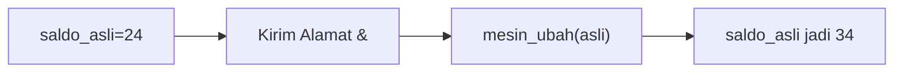

**📖 Penjelasan Komprehensif:**
**Analisis Mendalam (Compiler Manusia):**
1. **Pass-by-Reference**: Tanda `&` memberikan kunci akses langsung ke variabel `saldo`.
2. **Efek**: Apa pun yang dilakukan fungsi pada `a` langsung merubah isi fisik memori `saldo`.
3. **Hasil Akhir**: `saldo` bertambah jadi **34**.

---
### Soal 3
```cpp
void mesin_foto(int a) { a = a + 100; }
// main: int uang = 45; mesin_foto(uang);
```
**Pertanyaan:**
1. Berapakah hasil akhirnya?
2. Deskripsikan langkah robot compiler saat memproses kode ini!

**Jawaban & Diagnosis:**
1. **45**
2. Baca bagian 'Analisis Mendalam' di bawah.

**Mermaid Flowchart:**
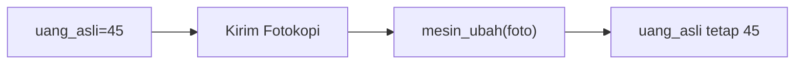

**📖 Penjelasan Komprehensif:**
**Analisis Mendalam (Compiler Manusia):**
1. **Pass-by-Value**: Variabel `uang` hanya mengirim salinannya ke fungsi.
2. **Efek**: Fungsi mengacak-acak salinan tersebut (tambah 100), tapi tidak menyentuh dompet aslimu.
3. **Hasil Akhir**: Nilai `uang` di main tetap **45**.

---
### Soal 4
```cpp
void mesin_ajaib(int &a) { a = a + 10; }
// main: int saldo = 41; mesin_ajaib(saldo);
```
**Pertanyaan:**
1. Berapakah hasil akhirnya?
2. Deskripsikan langkah robot compiler saat memproses kode ini!

**Jawaban & Diagnosis:**
1. **51**
2. Baca bagian 'Analisis Mendalam' di bawah.

**Mermaid Flowchart:**
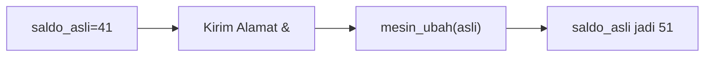

**📖 Penjelasan Komprehensif:**
**Analisis Mendalam (Compiler Manusia):**
1. **Pass-by-Reference**: Tanda `&` memberikan kunci akses langsung ke variabel `saldo`.
2. **Efek**: Apa pun yang dilakukan fungsi pada `a` langsung merubah isi fisik memori `saldo`.
3. **Hasil Akhir**: `saldo` bertambah jadi **51**.

---
### Soal 5
```cpp
void mesin_ajaib(int &a) { a = a + 10; }
// main: int saldo = 33; mesin_ajaib(saldo);
```
**Pertanyaan:**
1. Berapakah hasil akhirnya?
2. Deskripsikan langkah robot compiler saat memproses kode ini!

**Jawaban & Diagnosis:**
1. **43**
2. Baca bagian 'Analisis Mendalam' di bawah.

**Mermaid Flowchart:**


**📖 Penjelasan Komprehensif:**
**Analisis Mendalam (Compiler Manusia):**
1. **Pass-by-Reference**: Tanda `&` memberikan kunci akses langsung ke variabel `saldo`.
2. **Efek**: Apa pun yang dilakukan fungsi pada `a` langsung merubah isi fisik memori `saldo`.
3. **Hasil Akhir**: `saldo` bertambah jadi **43**.

---
### Soal 6
```cpp
void mesin_ajaib(int &a) { a = a + 10; }
// main: int saldo = 37; mesin_ajaib(saldo);
```
**Pertanyaan:**
1. Berapakah hasil akhirnya?
2. Deskripsikan langkah robot compiler saat memproses kode ini!

**Jawaban & Diagnosis:**
1. **47**
2. Baca bagian 'Analisis Mendalam' di bawah.

**Mermaid Flowchart:**


**📖 Penjelasan Komprehensif:**
**Analisis Mendalam (Compiler Manusia):**
1. **Pass-by-Reference**: Tanda `&` memberikan kunci akses langsung ke variabel `saldo`.
2. **Efek**: Apa pun yang dilakukan fungsi pada `a` langsung merubah isi fisik memori `saldo`.
3. **Hasil Akhir**: `saldo` bertambah jadi **47**.

---
### Soal 7
```cpp
void mesin_foto(int a) { a = a + 100; }
// main: int uang = 32; mesin_foto(uang);
```
**Pertanyaan:**
1. Berapakah hasil akhirnya?
2. Deskripsikan langkah robot compiler saat memproses kode ini!

**Jawaban & Diagnosis:**
1. **32**
2. Baca bagian 'Analisis Mendalam' di bawah.

**Mermaid Flowchart:**
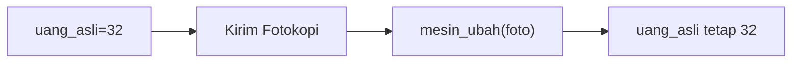

**📖 Penjelasan Komprehensif:**
**Analisis Mendalam (Compiler Manusia):**
1. **Pass-by-Value**: Variabel `uang` hanya mengirim salinannya ke fungsi.
2. **Efek**: Fungsi mengacak-acak salinan tersebut (tambah 100), tapi tidak menyentuh dompet aslimu.
3. **Hasil Akhir**: Nilai `uang` di main tetap **32**.

---
### Soal 8
```cpp
void mesin_foto(int a) { a = a + 100; }
// main: int uang = 22; mesin_foto(uang);
```
**Pertanyaan:**
1. Berapakah hasil akhirnya?
2. Deskripsikan langkah robot compiler saat memproses kode ini!

**Jawaban & Diagnosis:**
1. **22**
2. Baca bagian 'Analisis Mendalam' di bawah.

**Mermaid Flowchart:**
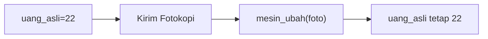

**📖 Penjelasan Komprehensif:**
**Analisis Mendalam (Compiler Manusia):**
1. **Pass-by-Value**: Variabel `uang` hanya mengirim salinannya ke fungsi.
2. **Efek**: Fungsi mengacak-acak salinan tersebut (tambah 100), tapi tidak menyentuh dompet aslimu.
3. **Hasil Akhir**: Nilai `uang` di main tetap **22**.

---
### Soal 9
```cpp
void mesin_ajaib(int &a) { a = a + 10; }
// main: int saldo = 44; mesin_ajaib(saldo);
```
**Pertanyaan:**
1. Berapakah hasil akhirnya?
2. Deskripsikan langkah robot compiler saat memproses kode ini!

**Jawaban & Diagnosis:**
1. **54**
2. Baca bagian 'Analisis Mendalam' di bawah.

**Mermaid Flowchart:**


**📖 Penjelasan Komprehensif:**
**Analisis Mendalam (Compiler Manusia):**
1. **Pass-by-Reference**: Tanda `&` memberikan kunci akses langsung ke variabel `saldo`.
2. **Efek**: Apa pun yang dilakukan fungsi pada `a` langsung merubah isi fisik memori `saldo`.
3. **Hasil Akhir**: `saldo` bertambah jadi **54**.

---
### Soal 10
```cpp
void mesin_ajaib(int &a) { a = a + 10; }
// main: int saldo = 45; mesin_ajaib(saldo);
```
**Pertanyaan:**
1. Berapakah hasil akhirnya?
2. Deskripsikan langkah robot compiler saat memproses kode ini!

**Jawaban & Diagnosis:**
1. **55**
2. Baca bagian 'Analisis Mendalam' di bawah.

**Mermaid Flowchart:**
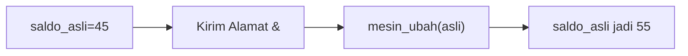

**📖 Penjelasan Komprehensif:**
**Analisis Mendalam (Compiler Manusia):**
1. **Pass-by-Reference**: Tanda `&` memberikan kunci akses langsung ke variabel `saldo`.
2. **Efek**: Apa pun yang dilakukan fungsi pada `a` langsung merubah isi fisik memori `saldo`.
3. **Hasil Akhir**: `saldo` bertambah jadi **55**.

---
### Soal 11
```cpp
void mesin_foto(int a) { a = a + 100; }
// main: int uang = 49; mesin_foto(uang);
```
**Pertanyaan:**
1. Berapakah hasil akhirnya?
2. Deskripsikan langkah robot compiler saat memproses kode ini!

**Jawaban & Diagnosis:**
1. **49**
2. Baca bagian 'Analisis Mendalam' di bawah.

**Mermaid Flowchart:**
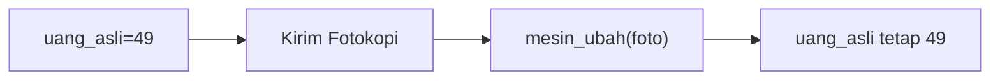

**📖 Penjelasan Komprehensif:**
**Analisis Mendalam (Compiler Manusia):**
1. **Pass-by-Value**: Variabel `uang` hanya mengirim salinannya ke fungsi.
2. **Efek**: Fungsi mengacak-acak salinan tersebut (tambah 100), tapi tidak menyentuh dompet aslimu.
3. **Hasil Akhir**: Nilai `uang` di main tetap **49**.

---
### Soal 12
```cpp
void mesin_foto(int a) { a = a + 100; }
// main: int uang = 38; mesin_foto(uang);
```
**Pertanyaan:**
1. Berapakah hasil akhirnya?
2. Deskripsikan langkah robot compiler saat memproses kode ini!

**Jawaban & Diagnosis:**
1. **38**
2. Baca bagian 'Analisis Mendalam' di bawah.

**Mermaid Flowchart:**
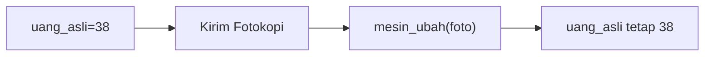

**📖 Penjelasan Komprehensif:**
**Analisis Mendalam (Compiler Manusia):**
1. **Pass-by-Value**: Variabel `uang` hanya mengirim salinannya ke fungsi.
2. **Efek**: Fungsi mengacak-acak salinan tersebut (tambah 100), tapi tidak menyentuh dompet aslimu.
3. **Hasil Akhir**: Nilai `uang` di main tetap **38**.

---
### Soal 13
```cpp
void mesin_ajaib(int &a) { a = a + 10; }
// main: int saldo = 21; mesin_ajaib(saldo);
```
**Pertanyaan:**
1. Berapakah hasil akhirnya?
2. Deskripsikan langkah robot compiler saat memproses kode ini!

**Jawaban & Diagnosis:**
1. **31**
2. Baca bagian 'Analisis Mendalam' di bawah.

**Mermaid Flowchart:**
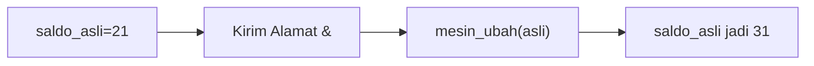

**📖 Penjelasan Komprehensif:**
**Analisis Mendalam (Compiler Manusia):**
1. **Pass-by-Reference**: Tanda `&` memberikan kunci akses langsung ke variabel `saldo`.
2. **Efek**: Apa pun yang dilakukan fungsi pada `a` langsung merubah isi fisik memori `saldo`.
3. **Hasil Akhir**: `saldo` bertambah jadi **31**.

---
### Soal 14
```cpp
void mesin_foto(int a) { a = a + 100; }
// main: int uang = 28; mesin_foto(uang);
```
**Pertanyaan:**
1. Berapakah hasil akhirnya?
2. Deskripsikan langkah robot compiler saat memproses kode ini!

**Jawaban & Diagnosis:**
1. **28**
2. Baca bagian 'Analisis Mendalam' di bawah.

**Mermaid Flowchart:**


**📖 Penjelasan Komprehensif:**
**Analisis Mendalam (Compiler Manusia):**
1. **Pass-by-Value**: Variabel `uang` hanya mengirim salinannya ke fungsi.
2. **Efek**: Fungsi mengacak-acak salinan tersebut (tambah 100), tapi tidak menyentuh dompet aslimu.
3. **Hasil Akhir**: Nilai `uang` di main tetap **28**.

---
### Soal 15
```cpp
void mesin_foto(int a) { a = a + 100; }
// main: int uang = 48; mesin_foto(uang);
```
**Pertanyaan:**
1. Berapakah hasil akhirnya?
2. Deskripsikan langkah robot compiler saat memproses kode ini!

**Jawaban & Diagnosis:**
1. **48**
2. Baca bagian 'Analisis Mendalam' di bawah.

**Mermaid Flowchart:**


**📖 Penjelasan Komprehensif:**
**Analisis Mendalam (Compiler Manusia):**
1. **Pass-by-Value**: Variabel `uang` hanya mengirim salinannya ke fungsi.
2. **Efek**: Fungsi mengacak-acak salinan tersebut (tambah 100), tapi tidak menyentuh dompet aslimu.
3. **Hasil Akhir**: Nilai `uang` di main tetap **48**.

---
### Soal 16
```cpp
void mesin_ajaib(int &a) { a = a + 10; }
// main: int saldo = 36; mesin_ajaib(saldo);
```
**Pertanyaan:**
1. Berapakah hasil akhirnya?
2. Deskripsikan langkah robot compiler saat memproses kode ini!

**Jawaban & Diagnosis:**
1. **46**
2. Baca bagian 'Analisis Mendalam' di bawah.

**Mermaid Flowchart:**
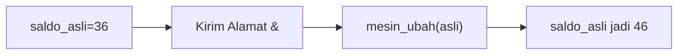

**📖 Penjelasan Komprehensif:**
**Analisis Mendalam (Compiler Manusia):**
1. **Pass-by-Reference**: Tanda `&` memberikan kunci akses langsung ke variabel `saldo`.
2. **Efek**: Apa pun yang dilakukan fungsi pada `a` langsung merubah isi fisik memori `saldo`.
3. **Hasil Akhir**: `saldo` bertambah jadi **46**.

---
### Soal 17
```cpp
void mesin_ajaib(int &a) { a = a + 10; }
// main: int saldo = 45; mesin_ajaib(saldo);
```
**Pertanyaan:**
1. Berapakah hasil akhirnya?
2. Deskripsikan langkah robot compiler saat memproses kode ini!

**Jawaban & Diagnosis:**
1. **55**
2. Baca bagian 'Analisis Mendalam' di bawah.

**Mermaid Flowchart:**


**📖 Penjelasan Komprehensif:**
**Analisis Mendalam (Compiler Manusia):**
1. **Pass-by-Reference**: Tanda `&` memberikan kunci akses langsung ke variabel `saldo`.
2. **Efek**: Apa pun yang dilakukan fungsi pada `a` langsung merubah isi fisik memori `saldo`.
3. **Hasil Akhir**: `saldo` bertambah jadi **55**.

---
### Soal 18
```cpp
void mesin_ajaib(int &a) { a = a + 10; }
// main: int saldo = 43; mesin_ajaib(saldo);
```
**Pertanyaan:**
1. Berapakah hasil akhirnya?
2. Deskripsikan langkah robot compiler saat memproses kode ini!

**Jawaban & Diagnosis:**
1. **53**
2. Baca bagian 'Analisis Mendalam' di bawah.

**Mermaid Flowchart:**


**📖 Penjelasan Komprehensif:**
**Analisis Mendalam (Compiler Manusia):**
1. **Pass-by-Reference**: Tanda `&` memberikan kunci akses langsung ke variabel `saldo`.
2. **Efek**: Apa pun yang dilakukan fungsi pada `a` langsung merubah isi fisik memori `saldo`.
3. **Hasil Akhir**: `saldo` bertambah jadi **53**.

---
### Soal 19
```cpp
void mesin_foto(int a) { a = a + 100; }
// main: int uang = 17; mesin_foto(uang);
```
**Pertanyaan:**
1. Berapakah hasil akhirnya?
2. Deskripsikan langkah robot compiler saat memproses kode ini!

**Jawaban & Diagnosis:**
1. **17**
2. Baca bagian 'Analisis Mendalam' di bawah.

**Mermaid Flowchart:**


**📖 Penjelasan Komprehensif:**
**Analisis Mendalam (Compiler Manusia):**
1. **Pass-by-Value**: Variabel `uang` hanya mengirim salinannya ke fungsi.
2. **Efek**: Fungsi mengacak-acak salinan tersebut (tambah 100), tapi tidak menyentuh dompet aslimu.
3. **Hasil Akhir**: Nilai `uang` di main tetap **17**.

---
### Soal 20
```cpp
void mesin_foto(int a) { a = a + 100; }
// main: int uang = 27; mesin_foto(uang);
```
**Pertanyaan:**
1. Berapakah hasil akhirnya?
2. Deskripsikan langkah robot compiler saat memproses kode ini!

**Jawaban & Diagnosis:**
1. **27**
2. Baca bagian 'Analisis Mendalam' di bawah.

**Mermaid Flowchart:**
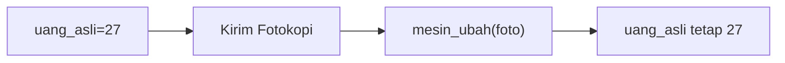

**📖 Penjelasan Komprehensif:**
**Analisis Mendalam (Compiler Manusia):**
1. **Pass-by-Value**: Variabel `uang` hanya mengirim salinannya ke fungsi.
2. **Efek**: Fungsi mengacak-acak salinan tersebut (tambah 100), tapi tidak menyentuh dompet aslimu.
3. **Hasil Akhir**: Nilai `uang` di main tetap **27**.

---
### Soal 21
```cpp
void mesin_foto(int a) { a = a + 100; }
// main: int uang = 47; mesin_foto(uang);
```
**Pertanyaan:**
1. Berapakah hasil akhirnya?
2. Deskripsikan langkah robot compiler saat memproses kode ini!

**Jawaban & Diagnosis:**
1. **47**
2. Baca bagian 'Analisis Mendalam' di bawah.

**Mermaid Flowchart:**
```mermaid
graph LR
A["uang_asli=47"] --> B["Kirim Fotokopi"]
B --> C["mesin_ubah(foto)"]
C --> D["uang_asli tetap 47"]
```

**📖 Penjelasan Komprehensif:**
**Analisis Mendalam (Compiler Manusia):**
1. **Pass-by-Value**: Variabel `uang` hanya mengirim salinannya ke fungsi.
2. **Efek**: Fungsi mengacak-acak salinan tersebut (tambah 100), tapi tidak menyentuh dompet aslimu.
3. **Hasil Akhir**: Nilai `uang` di main tetap **47**.

---
### Soal 22
```cpp
void mesin_ajaib(int &a) { a = a + 10; }
// main: int saldo = 30; mesin_ajaib(saldo);
```
**Pertanyaan:**
1. Berapakah hasil akhirnya?
2. Deskripsikan langkah robot compiler saat memproses kode ini!

**Jawaban & Diagnosis:**
1. **40**
2. Baca bagian 'Analisis Mendalam' di bawah.

**Mermaid Flowchart:**
```mermaid
graph LR
A["saldo_asli=30"] --> B["Kirim Alamat &"]
B --> C["mesin_ubah(asli)"]
C --> D["saldo_asli jadi 40"]
```

**📖 Penjelasan Komprehensif:**
**Analisis Mendalam (Compiler Manusia):**
1. **Pass-by-Reference**: Tanda `&` memberikan kunci akses langsung ke variabel `saldo`.
2. **Efek**: Apa pun yang dilakukan fungsi pada `a` langsung merubah isi fisik memori `saldo`.
3. **Hasil Akhir**: `saldo` bertambah jadi **40**.

---
### Soal 23
```cpp
void mesin_foto(int a) { a = a + 100; }
// main: int uang = 32; mesin_foto(uang);
```
**Pertanyaan:**
1. Berapakah hasil akhirnya?
2. Deskripsikan langkah robot compiler saat memproses kode ini!

**Jawaban & Diagnosis:**
1. **32**
2. Baca bagian 'Analisis Mendalam' di bawah.

**Mermaid Flowchart:**
```mermaid
graph LR
A["uang_asli=32"] --> B["Kirim Fotokopi"]
B --> C["mesin_ubah(foto)"]
C --> D["uang_asli tetap 32"]
```

**📖 Penjelasan Komprehensif:**
**Analisis Mendalam (Compiler Manusia):**
1. **Pass-by-Value**: Variabel `uang` hanya mengirim salinannya ke fungsi.
2. **Efek**: Fungsi mengacak-acak salinan tersebut (tambah 100), tapi tidak menyentuh dompet aslimu.
3. **Hasil Akhir**: Nilai `uang` di main tetap **32**.

---
### Soal 24
```cpp
void mesin_foto(int a) { a = a + 100; }
// main: int uang = 11; mesin_foto(uang);
```
**Pertanyaan:**
1. Berapakah hasil akhirnya?
2. Deskripsikan langkah robot compiler saat memproses kode ini!

**Jawaban & Diagnosis:**
1. **11**
2. Baca bagian 'Analisis Mendalam' di bawah.

**Mermaid Flowchart:**
```mermaid
graph LR
A["uang_asli=11"] --> B["Kirim Fotokopi"]
B --> C["mesin_ubah(foto)"]
C --> D["uang_asli tetap 11"]
```

**📖 Penjelasan Komprehensif:**
**Analisis Mendalam (Compiler Manusia):**
1. **Pass-by-Value**: Variabel `uang` hanya mengirim salinannya ke fungsi.
2. **Efek**: Fungsi mengacak-acak salinan tersebut (tambah 100), tapi tidak menyentuh dompet aslimu.
3. **Hasil Akhir**: Nilai `uang` di main tetap **11**.

---
### Soal 25
```cpp
void mesin_ajaib(int &a) { a = a + 10; }
// main: int saldo = 19; mesin_ajaib(saldo);
```
**Pertanyaan:**
1. Berapakah hasil akhirnya?
2. Deskripsikan langkah robot compiler saat memproses kode ini!

**Jawaban & Diagnosis:**
1. **29**
2. Baca bagian 'Analisis Mendalam' di bawah.

**Mermaid Flowchart:**
```mermaid
graph LR
A["saldo_asli=19"] --> B["Kirim Alamat &"]
B --> C["mesin_ubah(asli)"]
C --> D["saldo_asli jadi 29"]
```

**📖 Penjelasan Komprehensif:**
**Analisis Mendalam (Compiler Manusia):**
1. **Pass-by-Reference**: Tanda `&` memberikan kunci akses langsung ke variabel `saldo`.
2. **Efek**: Apa pun yang dilakukan fungsi pada `a` langsung merubah isi fisik memori `saldo`.
3. **Hasil Akhir**: `saldo` bertambah jadi **29**.

---
