🔙 **[Kembali ke Daftar Soal](./README.md)**

---

# Latihan Soal Part C - Modul 04 - Set 01

### Soal 1
```cpp
int f(int x) { return x * 2; }
// main: int a = 4; a = f(a) + f(2);
```
**Pertanyaan:**
1. Berapakah hasil akhirnya?
2. Mengapa demikian?

**Jawaban & Diagnosis:**
1. **12**
2. Lihat Tracing.

**Mermaid Flowchart:**
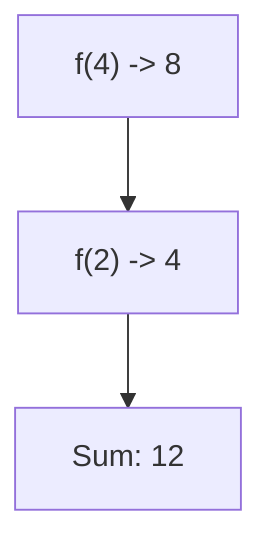

**📖 Penjelasan:**
**Langkah Tracing:**
1. f(4) = 8.
2. f(2) = 4.
3. Jumlah: 12.

---
### Soal 2
```cpp
void swap(int &a, int b) { int t=a; a=b; b=t; }
// main: int x=15, y=14; swap(x, y);
```
**Pertanyaan:**
1. Berapakah hasil akhirnya?
2. Mengapa demikian?

**Jawaban & Diagnosis:**
1. **x=14, y=14**
2. Lihat Tracing.

**Mermaid Flowchart:**
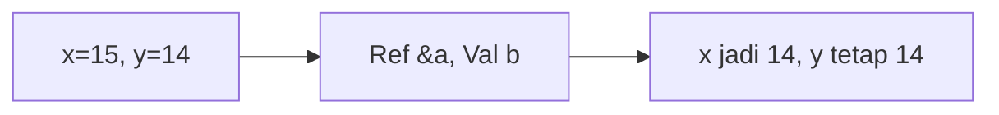

**📖 Penjelasan:**
**Langkah Tracing:**
1. x dilempar secara `reference` (&), maka nilainya berubah.
2. y dilempar secara `value`, maka aslinya aman.

---
### Soal 3
```cpp
int f(int x) { return x * 2; }
// main: int a = 14; a = f(a) + f(2);
```
**Pertanyaan:**
1. Berapakah hasil akhirnya?
2. Mengapa demikian?

**Jawaban & Diagnosis:**
1. **32**
2. Lihat Tracing.

**Mermaid Flowchart:**
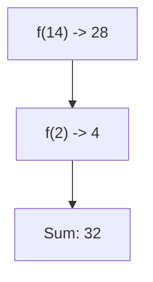

**📖 Penjelasan:**
**Langkah Tracing:**
1. f(14) = 28.
2. f(2) = 4.
3. Jumlah: 32.

---
### Soal 4
```cpp
void swap(int &a, int b) { int t=a; a=b; b=t; }
// main: int x=4, y=10; swap(x, y);
```
**Pertanyaan:**
1. Berapakah hasil akhirnya?
2. Mengapa demikian?

**Jawaban & Diagnosis:**
1. **x=10, y=10**
2. Lihat Tracing.

**Mermaid Flowchart:**
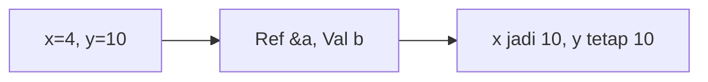

**📖 Penjelasan:**
**Langkah Tracing:**
1. x dilempar secara `reference` (&), maka nilainya berubah.
2. y dilempar secara `value`, maka aslinya aman.

---
### Soal 5
```cpp
int f(int x) { return x * 2; }
// main: int a = 16; a = f(a) + f(2);
```
**Pertanyaan:**
1. Berapakah hasil akhirnya?
2. Mengapa demikian?

**Jawaban & Diagnosis:**
1. **36**
2. Lihat Tracing.

**Mermaid Flowchart:**


**📖 Penjelasan:**
**Langkah Tracing:**
1. f(16) = 32.
2. f(2) = 4.
3. Jumlah: 36.

---
### Soal 6
```cpp
void swap(int &a, int b) { int t=a; a=b; b=t; }
// main: int x=1, y=2; swap(x, y);
```
**Pertanyaan:**
1. Berapakah hasil akhirnya?
2. Mengapa demikian?

**Jawaban & Diagnosis:**
1. **x=2, y=2**
2. Lihat Tracing.

**Mermaid Flowchart:**
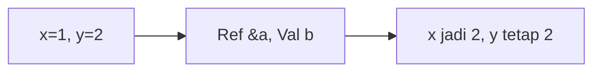

**📖 Penjelasan:**
**Langkah Tracing:**
1. x dilempar secara `reference` (&), maka nilainya berubah.
2. y dilempar secara `value`, maka aslinya aman.

---
### Soal 7
```cpp
void swap(int &a, int b) { int t=a; a=b; b=t; }
// main: int x=4, y=11; swap(x, y);
```
**Pertanyaan:**
1. Berapakah hasil akhirnya?
2. Mengapa demikian?

**Jawaban & Diagnosis:**
1. **x=11, y=11**
2. Lihat Tracing.

**Mermaid Flowchart:**


**📖 Penjelasan:**
**Langkah Tracing:**
1. x dilempar secara `reference` (&), maka nilainya berubah.
2. y dilempar secara `value`, maka aslinya aman.

---
### Soal 8
```cpp
int f(int x) { return x * 2; }
// main: int a = 17; a = f(a) + f(2);
```
**Pertanyaan:**
1. Berapakah hasil akhirnya?
2. Mengapa demikian?

**Jawaban & Diagnosis:**
1. **38**
2. Lihat Tracing.

**Mermaid Flowchart:**
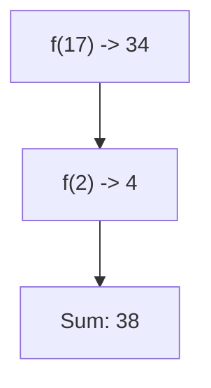

**📖 Penjelasan:**
**Langkah Tracing:**
1. f(17) = 34.
2. f(2) = 4.
3. Jumlah: 38.

---
### Soal 9
```cpp
int f(int x) { return x * 2; }
// main: int a = 17; a = f(a) + f(2);
```
**Pertanyaan:**
1. Berapakah hasil akhirnya?
2. Mengapa demikian?

**Jawaban & Diagnosis:**
1. **38**
2. Lihat Tracing.

**Mermaid Flowchart:**


**📖 Penjelasan:**
**Langkah Tracing:**
1. f(17) = 34.
2. f(2) = 4.
3. Jumlah: 38.

---
### Soal 10
```cpp
void swap(int &a, int b) { int t=a; a=b; b=t; }
// main: int x=13, y=14; swap(x, y);
```
**Pertanyaan:**
1. Berapakah hasil akhirnya?
2. Mengapa demikian?

**Jawaban & Diagnosis:**
1. **x=14, y=14**
2. Lihat Tracing.

**Mermaid Flowchart:**
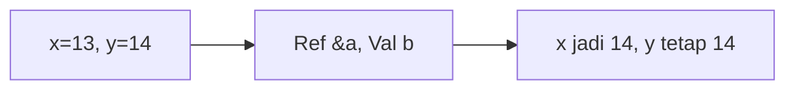

**📖 Penjelasan:**
**Langkah Tracing:**
1. x dilempar secara `reference` (&), maka nilainya berubah.
2. y dilempar secara `value`, maka aslinya aman.

---
### Soal 11
```cpp
void swap(int &a, int b) { int t=a; a=b; b=t; }
// main: int x=9, y=7; swap(x, y);
```
**Pertanyaan:**
1. Berapakah hasil akhirnya?
2. Mengapa demikian?

**Jawaban & Diagnosis:**
1. **x=7, y=7**
2. Lihat Tracing.

**Mermaid Flowchart:**
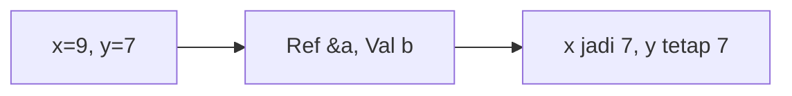

**📖 Penjelasan:**
**Langkah Tracing:**
1. x dilempar secara `reference` (&), maka nilainya berubah.
2. y dilempar secara `value`, maka aslinya aman.

---
### Soal 12
```cpp
int f(int x) { return x * 2; }
// main: int a = 11; a = f(a) + f(2);
```
**Pertanyaan:**
1. Berapakah hasil akhirnya?
2. Mengapa demikian?

**Jawaban & Diagnosis:**
1. **26**
2. Lihat Tracing.

**Mermaid Flowchart:**
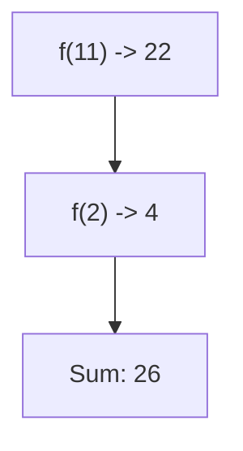

**📖 Penjelasan:**
**Langkah Tracing:**
1. f(11) = 22.
2. f(2) = 4.
3. Jumlah: 26.

---
### Soal 13
```cpp
void swap(int &a, int b) { int t=a; a=b; b=t; }
// main: int x=11, y=9; swap(x, y);
```
**Pertanyaan:**
1. Berapakah hasil akhirnya?
2. Mengapa demikian?

**Jawaban & Diagnosis:**
1. **x=9, y=9**
2. Lihat Tracing.

**Mermaid Flowchart:**
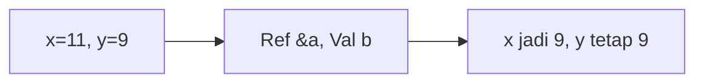

**📖 Penjelasan:**
**Langkah Tracing:**
1. x dilempar secara `reference` (&), maka nilainya berubah.
2. y dilempar secara `value`, maka aslinya aman.

---
### Soal 14
```cpp
int f(int x) { return x * 2; }
// main: int a = 14; a = f(a) + f(2);
```
**Pertanyaan:**
1. Berapakah hasil akhirnya?
2. Mengapa demikian?

**Jawaban & Diagnosis:**
1. **32**
2. Lihat Tracing.

**Mermaid Flowchart:**


**📖 Penjelasan:**
**Langkah Tracing:**
1. f(14) = 28.
2. f(2) = 4.
3. Jumlah: 32.

---
### Soal 15
```cpp
void swap(int &a, int b) { int t=a; a=b; b=t; }
// main: int x=10, y=4; swap(x, y);
```
**Pertanyaan:**
1. Berapakah hasil akhirnya?
2. Mengapa demikian?

**Jawaban & Diagnosis:**
1. **x=4, y=4**
2. Lihat Tracing.

**Mermaid Flowchart:**
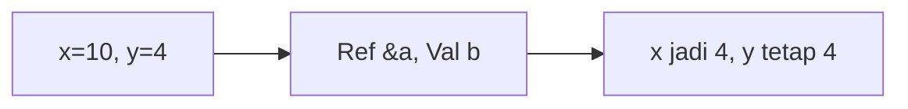

**📖 Penjelasan:**
**Langkah Tracing:**
1. x dilempar secara `reference` (&), maka nilainya berubah.
2. y dilempar secara `value`, maka aslinya aman.

---
### Soal 16
```cpp
int f(int x) { return x * 2; }
// main: int a = 14; a = f(a) + f(2);
```
**Pertanyaan:**
1. Berapakah hasil akhirnya?
2. Mengapa demikian?

**Jawaban & Diagnosis:**
1. **32**
2. Lihat Tracing.

**Mermaid Flowchart:**


**📖 Penjelasan:**
**Langkah Tracing:**
1. f(14) = 28.
2. f(2) = 4.
3. Jumlah: 32.

---
### Soal 17
```cpp
int f(int x) { return x * 2; }
// main: int a = 13; a = f(a) + f(2);
```
**Pertanyaan:**
1. Berapakah hasil akhirnya?
2. Mengapa demikian?

**Jawaban & Diagnosis:**
1. **30**
2. Lihat Tracing.

**Mermaid Flowchart:**


**📖 Penjelasan:**
**Langkah Tracing:**
1. f(13) = 26.
2. f(2) = 4.
3. Jumlah: 30.

---
### Soal 18
```cpp
int f(int x) { return x * 2; }
// main: int a = 4; a = f(a) + f(2);
```
**Pertanyaan:**
1. Berapakah hasil akhirnya?
2. Mengapa demikian?

**Jawaban & Diagnosis:**
1. **12**
2. Lihat Tracing.

**Mermaid Flowchart:**


**📖 Penjelasan:**
**Langkah Tracing:**
1. f(4) = 8.
2. f(2) = 4.
3. Jumlah: 12.

---
### Soal 19
```cpp
int f(int x) { return x * 2; }
// main: int a = 12; a = f(a) + f(2);
```
**Pertanyaan:**
1. Berapakah hasil akhirnya?
2. Mengapa demikian?

**Jawaban & Diagnosis:**
1. **28**
2. Lihat Tracing.

**Mermaid Flowchart:**


**📖 Penjelasan:**
**Langkah Tracing:**
1. f(12) = 24.
2. f(2) = 4.
3. Jumlah: 28.

---
### Soal 20
```cpp
void swap(int &a, int b) { int t=a; a=b; b=t; }
// main: int x=1, y=11; swap(x, y);
```
**Pertanyaan:**
1. Berapakah hasil akhirnya?
2. Mengapa demikian?

**Jawaban & Diagnosis:**
1. **x=11, y=11**
2. Lihat Tracing.

**Mermaid Flowchart:**
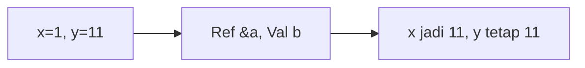

**📖 Penjelasan:**
**Langkah Tracing:**
1. x dilempar secara `reference` (&), maka nilainya berubah.
2. y dilempar secara `value`, maka aslinya aman.

---
### Soal 21
```cpp
int f(int x) { return x * 2; }
// main: int a = 12; a = f(a) + f(2);
```
**Pertanyaan:**
1. Berapakah hasil akhirnya?
2. Mengapa demikian?

**Jawaban & Diagnosis:**
1. **28**
2. Lihat Tracing.

**Mermaid Flowchart:**
```mermaid
graph TD
A["f(12) -> 24"] --> B["f(2) -> 4"]
B --> C["Sum: 28"]
```

**📖 Penjelasan:**
**Langkah Tracing:**
1. f(12) = 24.
2. f(2) = 4.
3. Jumlah: 28.

---
### Soal 22
```cpp
int f(int x) { return x * 2; }
// main: int a = 3; a = f(a) + f(2);
```
**Pertanyaan:**
1. Berapakah hasil akhirnya?
2. Mengapa demikian?

**Jawaban & Diagnosis:**
1. **10**
2. Lihat Tracing.

**Mermaid Flowchart:**
```mermaid
graph TD
A["f(3) -> 6"] --> B["f(2) -> 4"]
B --> C["Sum: 10"]
```

**📖 Penjelasan:**
**Langkah Tracing:**
1. f(3) = 6.
2. f(2) = 4.
3. Jumlah: 10.

---
### Soal 23
```cpp
int f(int x) { return x * 2; }
// main: int a = 19; a = f(a) + f(2);
```
**Pertanyaan:**
1. Berapakah hasil akhirnya?
2. Mengapa demikian?

**Jawaban & Diagnosis:**
1. **42**
2. Lihat Tracing.

**Mermaid Flowchart:**
```mermaid
graph TD
A["f(19) -> 38"] --> B["f(2) -> 4"]
B --> C["Sum: 42"]
```

**📖 Penjelasan:**
**Langkah Tracing:**
1. f(19) = 38.
2. f(2) = 4.
3. Jumlah: 42.

---
### Soal 24
```cpp
void swap(int &a, int b) { int t=a; a=b; b=t; }
// main: int x=19, y=18; swap(x, y);
```
**Pertanyaan:**
1. Berapakah hasil akhirnya?
2. Mengapa demikian?

**Jawaban & Diagnosis:**
1. **x=18, y=18**
2. Lihat Tracing.

**Mermaid Flowchart:**
```mermaid
graph LR
A["x=19, y=18"] --> B["Ref &a, Val b"]
B --> C["x jadi 18, y tetap 18"]
```

**📖 Penjelasan:**
**Langkah Tracing:**
1. x dilempar secara `reference` (&), maka nilainya berubah.
2. y dilempar secara `value`, maka aslinya aman.

---
### Soal 25
```cpp
void swap(int &a, int b) { int t=a; a=b; b=t; }
// main: int x=5, y=14; swap(x, y);
```
**Pertanyaan:**
1. Berapakah hasil akhirnya?
2. Mengapa demikian?

**Jawaban & Diagnosis:**
1. **x=14, y=14**
2. Lihat Tracing.

**Mermaid Flowchart:**
```mermaid
graph LR
A["x=5, y=14"] --> B["Ref &a, Val b"]
B --> C["x jadi 14, y tetap 14"]
```

**📖 Penjelasan:**
**Langkah Tracing:**
1. x dilempar secara `reference` (&), maka nilainya berubah.
2. y dilempar secara `value`, maka aslinya aman.

---
