# Latihan Soal Part C - Modul 04 - Set 01

### Soal 1 (Global vs Local)
```cpp
int skor = 106; // Global

void cek() {
    int skor = 3; // Local
    printf("%d", skor);
}

// output = ?
```
**Pertanyaan:**
1. Angka berapakah yang akan tercetak di layar?
2. Siapa yang lebih berkuasa: skor 106 atau skor 3?
3. Apa istilah untuk variabel lokal yang menutupi variabel global?

**Jawaban & Diagnosis:**
1. **3**
2. **Skor 3 (Lokal/Ketua Kelas) karena letaknya di dalam fungsi.**
3. **Shadowing (Membayangi).**

**Mermaid Flowchart:**


**📖 Cara Membaca Diagram:**
Mesin masuk fungsi. Dia melihat ada dua nama 'skor'. Dia pilih yang terdekat (lokal). Cetak lokal.

---
### Soal 2 (Global vs Local)
```cpp
int skor = 186; // Global

void cek() {
    int skor = 7; // Local
    printf("%d", skor);
}

// output = ?
```
**Pertanyaan:**
1. Angka berapakah yang akan tercetak di layar?
2. Siapa yang lebih berkuasa: skor 186 atau skor 7?
3. Apa istilah untuk variabel lokal yang menutupi variabel global?

**Jawaban & Diagnosis:**
1. **7**
2. **Skor 7 (Lokal/Ketua Kelas) karena letaknya di dalam fungsi.**
3. **Shadowing (Membayangi).**

**Mermaid Flowchart:**


**📖 Cara Membaca Diagram:**
Mesin masuk fungsi. Dia melihat ada dua nama 'skor'. Dia pilih yang terdekat (lokal). Cetak lokal.

---
### Soal 3 (Swap Trick)
```cpp
void tukar(int &a, int &b) {
    a = a + b;
    b = a - b;
    a = a - b;
}
// main: a=3, b=11; tukar(a,b);
```
**Pertanyaan:**
1. Setelah swap, berapa nilai `a`?
2. Setelah swap, berapa nilai `b`?
3. Kenapa tukar ini berhasil tanpa variabel ketiga?

**Jawaban & Diagnosis:**
1. **11**
2. **3**
3. **Karena menggunakan trik aritmetika (tambah-kurang) untuk membalas nilai.**

**Mermaid Flowchart:**
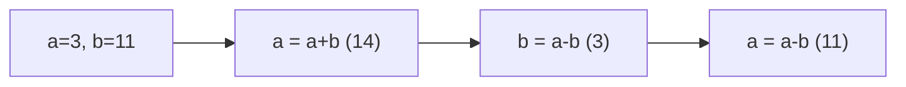

**📖 Cara Membaca Diagram:**
a=3, b=11. a=a+b=14. b=a-b=3=3. a=a-b=11=11. Terbalik!

---
### Soal 4 (Global vs Local)
```cpp
int skor = 175; // Global

void cek() {
    int skor = 2; // Local
    printf("%d", skor);
}

// output = ?
```
**Pertanyaan:**
1. Angka berapakah yang akan tercetak di layar?
2. Siapa yang lebih berkuasa: skor 175 atau skor 2?
3. Apa istilah untuk variabel lokal yang menutupi variabel global?

**Jawaban & Diagnosis:**
1. **2**
2. **Skor 2 (Lokal/Ketua Kelas) karena letaknya di dalam fungsi.**
3. **Shadowing (Membayangi).**

**Mermaid Flowchart:**


**📖 Cara Membaca Diagram:**
Mesin masuk fungsi. Dia melihat ada dua nama 'skor'. Dia pilih yang terdekat (lokal). Cetak lokal.

---
### Soal 5 (Swap Trick)
```cpp
void tukar(int &a, int &b) {
    a = a + b;
    b = a - b;
    a = a - b;
}
// main: a=1, b=13; tukar(a,b);
```
**Pertanyaan:**
1. Setelah swap, berapa nilai `a`?
2. Setelah swap, berapa nilai `b`?
3. Kenapa tukar ini berhasil tanpa variabel ketiga?

**Jawaban & Diagnosis:**
1. **13**
2. **1**
3. **Karena menggunakan trik aritmetika (tambah-kurang) untuk membalas nilai.**

**Mermaid Flowchart:**
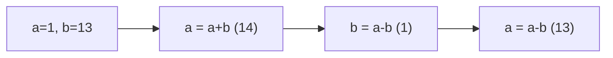

**📖 Cara Membaca Diagram:**
a=1, b=13. a=a+b=14. b=a-b=1=1. a=a-b=13=13. Terbalik!

---
### Soal 6 (Swap Trick)
```cpp
void tukar(int &a, int &b) {
    a = a + b;
    b = a - b;
    a = a - b;
}
// main: a=5, b=14; tukar(a,b);
```
**Pertanyaan:**
1. Setelah swap, berapa nilai `a`?
2. Setelah swap, berapa nilai `b`?
3. Kenapa tukar ini berhasil tanpa variabel ketiga?

**Jawaban & Diagnosis:**
1. **14**
2. **5**
3. **Karena menggunakan trik aritmetika (tambah-kurang) untuk membalas nilai.**

**Mermaid Flowchart:**
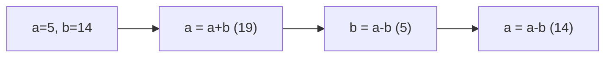

**📖 Cara Membaca Diagram:**
a=5, b=14. a=a+b=19. b=a-b=5=5. a=a-b=14=14. Terbalik!

---
### Soal 7 (Swap Trick)
```cpp
void tukar(int &a, int &b) {
    a = a + b;
    b = a - b;
    a = a - b;
}
// main: a=6, b=13; tukar(a,b);
```
**Pertanyaan:**
1. Setelah swap, berapa nilai `a`?
2. Setelah swap, berapa nilai `b`?
3. Kenapa tukar ini berhasil tanpa variabel ketiga?

**Jawaban & Diagnosis:**
1. **13**
2. **6**
3. **Karena menggunakan trik aritmetika (tambah-kurang) untuk membalas nilai.**

**Mermaid Flowchart:**
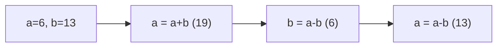

**📖 Cara Membaca Diagram:**
a=6, b=13. a=a+b=19. b=a-b=6=6. a=a-b=13=13. Terbalik!

---
### Soal 8 (Pass By Value)
```cpp
void ubah(int a) {
    a = 100;
}

int main() {
    int x = 41;
    ubah(x);
    // x = ?
```
**Pertanyaan:**
1. Berapakah nilai variabel `x` di dalam `main` setelah fungsi `ubah` selesai?
2. Apa yang terjadi pada variabel `a` di dalam fungsi `ubah`?
3. Analogi apa yang cocok untuk Pass-By-Value?

**Jawaban & Diagnosis:**
1. **41**
2. **Berubah jadi 100, tapi hanya di dalam fungsi tersebut (lokal).**
3. **Fotokopi PR (Dicoret-coret temen gak ngaruh ke buku aslimu).**

**Mermaid Flowchart:**
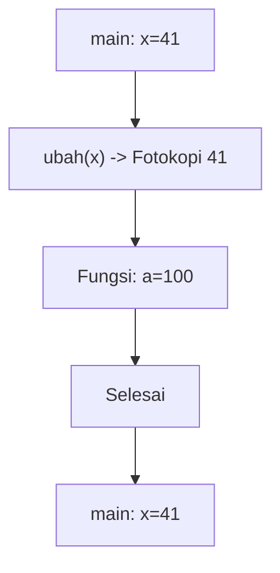

**📖 Cara Membaca Diagram:**
x=41. Saat `ubah(x)`, komputer hanya mengirim fotokopi nilai 41. Fungsi merubah fotokopi jadi 100. Di main, dompet asli x tetap 41.

---
### Soal 9 (Pass By Value)
```cpp
void ubah(int a) {
    a = 100;
}

int main() {
    int x = 17;
    ubah(x);
    // x = ?
```
**Pertanyaan:**
1. Berapakah nilai variabel `x` di dalam `main` setelah fungsi `ubah` selesai?
2. Apa yang terjadi pada variabel `a` di dalam fungsi `ubah`?
3. Analogi apa yang cocok untuk Pass-By-Value?

**Jawaban & Diagnosis:**
1. **17**
2. **Berubah jadi 100, tapi hanya di dalam fungsi tersebut (lokal).**
3. **Fotokopi PR (Dicoret-coret temen gak ngaruh ke buku aslimu).**

**Mermaid Flowchart:**
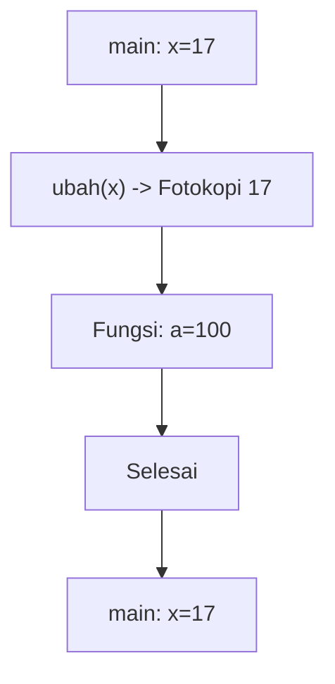

**📖 Cara Membaca Diagram:**
x=17. Saat `ubah(x)`, komputer hanya mengirim fotokopi nilai 17. Fungsi merubah fotokopi jadi 100. Di main, dompet asli x tetap 17.

---
### Soal 10 (Pass By Reference)
```cpp
void silet(int &a) {
    a = 0;
}

int main() {
    int y = 38;
    silet(y);
    // y = ?
```
**Pertanyaan:**
1. Berapakah nilai variabel `y` di akhir program?
2. Apa tanda yang menunjukkan fungsi ini menggunakan 'Reference'?
3. Analogi apa yang cocok untuk Pass-By-Reference?

**Jawaban & Diagnosis:**
1. **0**
2. **Tanda Amperstand (&) pada parameter `int &a`.**
3. **Memberikan Buku Asli (Kalau dicoret, aslinya rusak).**

**Mermaid Flowchart:**
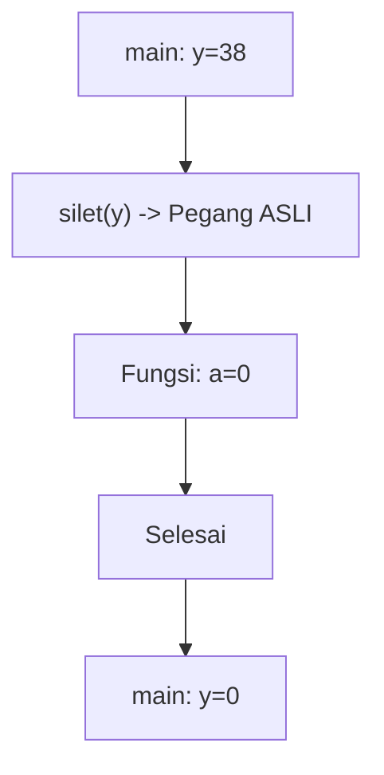

**📖 Cara Membaca Diagram:**
y=38. Karena ada `&`, fungsi `silet` memegang dompet aslimu. Dia pasang 0, maka y di main ikut jadi 0.

---
### Soal 11 (Swap Trick)
```cpp
void tukar(int &a, int &b) {
    a = a + b;
    b = a - b;
    a = a - b;
}
// main: a=1, b=20; tukar(a,b);
```
**Pertanyaan:**
1. Setelah swap, berapa nilai `a`?
2. Setelah swap, berapa nilai `b`?
3. Kenapa tukar ini berhasil tanpa variabel ketiga?

**Jawaban & Diagnosis:**
1. **20**
2. **1**
3. **Karena menggunakan trik aritmetika (tambah-kurang) untuk membalas nilai.**

**Mermaid Flowchart:**
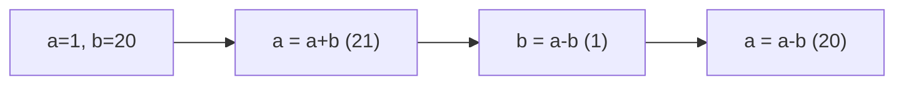

**📖 Cara Membaca Diagram:**
a=1, b=20. a=a+b=21. b=a-b=1=1. a=a-b=20=20. Terbalik!

---
### Soal 12 (Pass By Reference)
```cpp
void silet(int &a) {
    a = 0;
}

int main() {
    int y = 33;
    silet(y);
    // y = ?
```
**Pertanyaan:**
1. Berapakah nilai variabel `y` di akhir program?
2. Apa tanda yang menunjukkan fungsi ini menggunakan 'Reference'?
3. Analogi apa yang cocok untuk Pass-By-Reference?

**Jawaban & Diagnosis:**
1. **0**
2. **Tanda Amperstand (&) pada parameter `int &a`.**
3. **Memberikan Buku Asli (Kalau dicoret, aslinya rusak).**

**Mermaid Flowchart:**
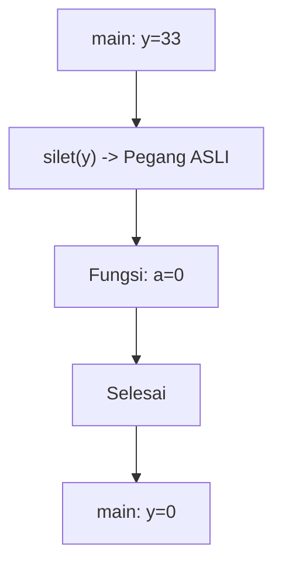

**📖 Cara Membaca Diagram:**
y=33. Karena ada `&`, fungsi `silet` memegang dompet aslimu. Dia pasang 0, maka y di main ikut jadi 0.

---
### Soal 13 (Swap Trick)
```cpp
void tukar(int &a, int &b) {
    a = a + b;
    b = a - b;
    a = a - b;
}
// main: a=10, b=11; tukar(a,b);
```
**Pertanyaan:**
1. Setelah swap, berapa nilai `a`?
2. Setelah swap, berapa nilai `b`?
3. Kenapa tukar ini berhasil tanpa variabel ketiga?

**Jawaban & Diagnosis:**
1. **11**
2. **10**
3. **Karena menggunakan trik aritmetika (tambah-kurang) untuk membalas nilai.**

**Mermaid Flowchart:**
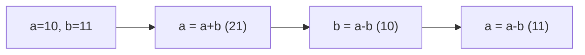

**📖 Cara Membaca Diagram:**
a=10, b=11. a=a+b=21. b=a-b=10=10. a=a-b=11=11. Terbalik!

---
### Soal 14 (Swap Trick)
```cpp
void tukar(int &a, int &b) {
    a = a + b;
    b = a - b;
    a = a - b;
}
// main: a=3, b=19; tukar(a,b);
```
**Pertanyaan:**
1. Setelah swap, berapa nilai `a`?
2. Setelah swap, berapa nilai `b`?
3. Kenapa tukar ini berhasil tanpa variabel ketiga?

**Jawaban & Diagnosis:**
1. **19**
2. **3**
3. **Karena menggunakan trik aritmetika (tambah-kurang) untuk membalas nilai.**

**Mermaid Flowchart:**
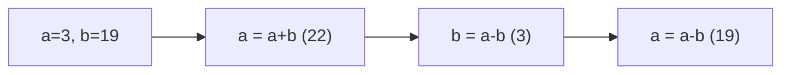

**📖 Cara Membaca Diagram:**
a=3, b=19. a=a+b=22. b=a-b=3=3. a=a-b=19=19. Terbalik!

---
### Soal 15 (Swap Trick)
```cpp
void tukar(int &a, int &b) {
    a = a + b;
    b = a - b;
    a = a - b;
}
// main: a=3, b=19; tukar(a,b);
```
**Pertanyaan:**
1. Setelah swap, berapa nilai `a`?
2. Setelah swap, berapa nilai `b`?
3. Kenapa tukar ini berhasil tanpa variabel ketiga?

**Jawaban & Diagnosis:**
1. **19**
2. **3**
3. **Karena menggunakan trik aritmetika (tambah-kurang) untuk membalas nilai.**

**Mermaid Flowchart:**


**📖 Cara Membaca Diagram:**
a=3, b=19. a=a+b=22. b=a-b=3=3. a=a-b=19=19. Terbalik!

---
### Soal 16 (Swap Trick)
```cpp
void tukar(int &a, int &b) {
    a = a + b;
    b = a - b;
    a = a - b;
}
// main: a=6, b=15; tukar(a,b);
```
**Pertanyaan:**
1. Setelah swap, berapa nilai `a`?
2. Setelah swap, berapa nilai `b`?
3. Kenapa tukar ini berhasil tanpa variabel ketiga?

**Jawaban & Diagnosis:**
1. **15**
2. **6**
3. **Karena menggunakan trik aritmetika (tambah-kurang) untuk membalas nilai.**

**Mermaid Flowchart:**
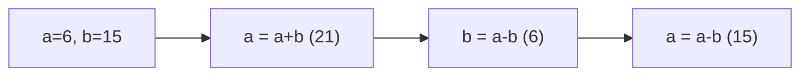

**📖 Cara Membaca Diagram:**
a=6, b=15. a=a+b=21. b=a-b=6=6. a=a-b=15=15. Terbalik!

---
### Soal 17 (Global vs Local)
```cpp
int skor = 102; // Global

void cek() {
    int skor = 3; // Local
    printf("%d", skor);
}

// output = ?
```
**Pertanyaan:**
1. Angka berapakah yang akan tercetak di layar?
2. Siapa yang lebih berkuasa: skor 102 atau skor 3?
3. Apa istilah untuk variabel lokal yang menutupi variabel global?

**Jawaban & Diagnosis:**
1. **3**
2. **Skor 3 (Lokal/Ketua Kelas) karena letaknya di dalam fungsi.**
3. **Shadowing (Membayangi).**

**Mermaid Flowchart:**


**📖 Cara Membaca Diagram:**
Mesin masuk fungsi. Dia melihat ada dua nama 'skor'. Dia pilih yang terdekat (lokal). Cetak lokal.

---
### Soal 18 (Global vs Local)
```cpp
int skor = 156; // Global

void cek() {
    int skor = 6; // Local
    printf("%d", skor);
}

// output = ?
```
**Pertanyaan:**
1. Angka berapakah yang akan tercetak di layar?
2. Siapa yang lebih berkuasa: skor 156 atau skor 6?
3. Apa istilah untuk variabel lokal yang menutupi variabel global?

**Jawaban & Diagnosis:**
1. **6**
2. **Skor 6 (Lokal/Ketua Kelas) karena letaknya di dalam fungsi.**
3. **Shadowing (Membayangi).**

**Mermaid Flowchart:**
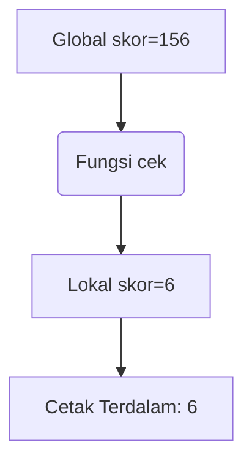

**📖 Cara Membaca Diagram:**
Mesin masuk fungsi. Dia melihat ada dua nama 'skor'. Dia pilih yang terdekat (lokal). Cetak lokal.

---
### Soal 19 (Pass By Value)
```cpp
void ubah(int a) {
    a = 100;
}

int main() {
    int x = 37;
    ubah(x);
    // x = ?
```
**Pertanyaan:**
1. Berapakah nilai variabel `x` di dalam `main` setelah fungsi `ubah` selesai?
2. Apa yang terjadi pada variabel `a` di dalam fungsi `ubah`?
3. Analogi apa yang cocok untuk Pass-By-Value?

**Jawaban & Diagnosis:**
1. **37**
2. **Berubah jadi 100, tapi hanya di dalam fungsi tersebut (lokal).**
3. **Fotokopi PR (Dicoret-coret temen gak ngaruh ke buku aslimu).**

**Mermaid Flowchart:**
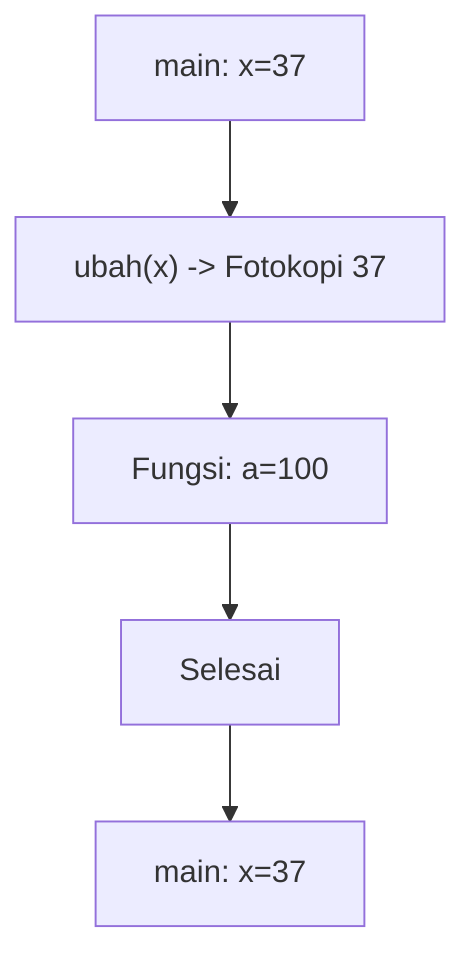

**📖 Cara Membaca Diagram:**
x=37. Saat `ubah(x)`, komputer hanya mengirim fotokopi nilai 37. Fungsi merubah fotokopi jadi 100. Di main, dompet asli x tetap 37.

---
### Soal 20 (Global vs Local)
```cpp
int skor = 162; // Global

void cek() {
    int skor = 3; // Local
    printf("%d", skor);
}

// output = ?
```
**Pertanyaan:**
1. Angka berapakah yang akan tercetak di layar?
2. Siapa yang lebih berkuasa: skor 162 atau skor 3?
3. Apa istilah untuk variabel lokal yang menutupi variabel global?

**Jawaban & Diagnosis:**
1. **3**
2. **Skor 3 (Lokal/Ketua Kelas) karena letaknya di dalam fungsi.**
3. **Shadowing (Membayangi).**

**Mermaid Flowchart:**


**📖 Cara Membaca Diagram:**
Mesin masuk fungsi. Dia melihat ada dua nama 'skor'. Dia pilih yang terdekat (lokal). Cetak lokal.

---
### Soal 21 (Pass By Value)
```cpp
void ubah(int a) {
    a = 100;
}

int main() {
    int x = 50;
    ubah(x);
    // x = ?
```
**Pertanyaan:**
1. Berapakah nilai variabel `x` di dalam `main` setelah fungsi `ubah` selesai?
2. Apa yang terjadi pada variabel `a` di dalam fungsi `ubah`?
3. Analogi apa yang cocok untuk Pass-By-Value?

**Jawaban & Diagnosis:**
1. **50**
2. **Berubah jadi 100, tapi hanya di dalam fungsi tersebut (lokal).**
3. **Fotokopi PR (Dicoret-coret temen gak ngaruh ke buku aslimu).**

**Mermaid Flowchart:**
```mermaid
graph TD
    A[main: x=50] --> B["ubah(x) -> Fotokopi 50"]
    B --> C[Fungsi: a=100]
    C --> D[Selesai]
    D --> E[main: x=50]
```

**📖 Cara Membaca Diagram:**
x=50. Saat `ubah(x)`, komputer hanya mengirim fotokopi nilai 50. Fungsi merubah fotokopi jadi 100. Di main, dompet asli x tetap 50.

---
### Soal 22 (Swap Trick)
```cpp
void tukar(int &a, int &b) {
    a = a + b;
    b = a - b;
    a = a - b;
}
// main: a=9, b=17; tukar(a,b);
```
**Pertanyaan:**
1. Setelah swap, berapa nilai `a`?
2. Setelah swap, berapa nilai `b`?
3. Kenapa tukar ini berhasil tanpa variabel ketiga?

**Jawaban & Diagnosis:**
1. **17**
2. **9**
3. **Karena menggunakan trik aritmetika (tambah-kurang) untuk membalas nilai.**

**Mermaid Flowchart:**
```mermaid
graph LR
    A["a=9, b=17"] --> B["a = a+b (26)"]
    B --> C["b = a-b (9)"]
    C --> D["a = a-b (17)"]
```

**📖 Cara Membaca Diagram:**
a=9, b=17. a=a+b=26. b=a-b=9=9. a=a-b=17=17. Terbalik!

---
### Soal 23 (Global vs Local)
```cpp
int skor = 104; // Global

void cek() {
    int skor = 7; // Local
    printf("%d", skor);
}

// output = ?
```
**Pertanyaan:**
1. Angka berapakah yang akan tercetak di layar?
2. Siapa yang lebih berkuasa: skor 104 atau skor 7?
3. Apa istilah untuk variabel lokal yang menutupi variabel global?

**Jawaban & Diagnosis:**
1. **7**
2. **Skor 7 (Lokal/Ketua Kelas) karena letaknya di dalam fungsi.**
3. **Shadowing (Membayangi).**

**Mermaid Flowchart:**
```mermaid
graph TD
    A[Global skor=104] --> B(Fungsi cek)
    B --> C[Lokal skor=7]
    C --> D[Cetak Terdalam: 7]
```

**📖 Cara Membaca Diagram:**
Mesin masuk fungsi. Dia melihat ada dua nama 'skor'. Dia pilih yang terdekat (lokal). Cetak lokal.

---
### Soal 24 (Pass By Reference)
```cpp
void silet(int &a) {
    a = 0;
}

int main() {
    int y = 26;
    silet(y);
    // y = ?
```
**Pertanyaan:**
1. Berapakah nilai variabel `y` di akhir program?
2. Apa tanda yang menunjukkan fungsi ini menggunakan 'Reference'?
3. Analogi apa yang cocok untuk Pass-By-Reference?

**Jawaban & Diagnosis:**
1. **0**
2. **Tanda Amperstand (&) pada parameter `int &a`.**
3. **Memberikan Buku Asli (Kalau dicoret, aslinya rusak).**

**Mermaid Flowchart:**
```mermaid
graph TD
    A[main: y=26] --> B["silet(y) -> Pegang ASLI"]
    B --> C[Fungsi: a=0]
    C --> D[Selesai]
    D --> E[main: y=0]
```

**📖 Cara Membaca Diagram:**
y=26. Karena ada `&`, fungsi `silet` memegang dompet aslimu. Dia pasang 0, maka y di main ikut jadi 0.

---
### Soal 25 (Global vs Local)
```cpp
int skor = 102; // Global

void cek() {
    int skor = 2; // Local
    printf("%d", skor);
}

// output = ?
```
**Pertanyaan:**
1. Angka berapakah yang akan tercetak di layar?
2. Siapa yang lebih berkuasa: skor 102 atau skor 2?
3. Apa istilah untuk variabel lokal yang menutupi variabel global?

**Jawaban & Diagnosis:**
1. **2**
2. **Skor 2 (Lokal/Ketua Kelas) karena letaknya di dalam fungsi.**
3. **Shadowing (Membayangi).**

**Mermaid Flowchart:**
```mermaid
graph TD
    A[Global skor=102] --> B(Fungsi cek)
    B --> C[Lokal skor=2]
    C --> D[Cetak Terdalam: 2]
```

**📖 Cara Membaca Diagram:**
Mesin masuk fungsi. Dia melihat ada dua nama 'skor'. Dia pilih yang terdekat (lokal). Cetak lokal.

---
