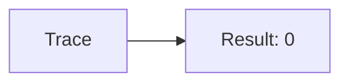
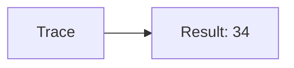
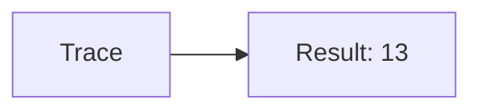
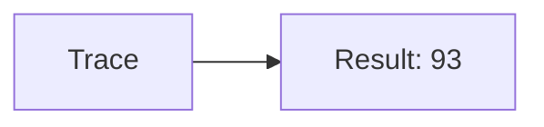

🔙 **[Kembali ke Daftar Soal](./README.md)**

---

# Latihan Soal Part C - Modul 04 - Set 01

### Soal 1
```cpp
// PR: Pass-by-Value
void ubah(int x) { x = 0; }
// main: int pr=80;
ubah(pr);
```
**Pertanyaan:**
1. Berapakah hasil akhirnya?
2. Deskripsikan alur pikir 'Compiler Manusia' untuk soal ini!

**Jawaban & Diagnosis:**
1. **80**
2. Value 'PR' dikirim fotokopinya. Aslinya tetap 80.

**Mermaid Flowchart:**


---
### Soal 2
```cpp
// Laporan: Pass-by-Reference
void reset(int &x) { x = 0; }
// main: int laporan=71;
reset(laporan);
```
**Pertanyaan:**
1. Berapakah hasil akhirnya?
2. Deskripsikan alur pikir 'Compiler Manusia' untuk soal ini!

**Jawaban & Diagnosis:**
1. **0**
2. Reference '&' dikirim alamat aslinya. 'Laporan' ter-reset jadi 0.

**Mermaid Flowchart:**


---
### Soal 3
```cpp
// Data: Pass-by-Value
void ubah(int x) { x = 0; }
// main: int data=62;
ubah(data);
```
**Pertanyaan:**
1. Berapakah hasil akhirnya?
2. Deskripsikan alur pikir 'Compiler Manusia' untuk soal ini!

**Jawaban & Diagnosis:**
1. **62**
2. Value 'Data' dikirim fotokopinya. Aslinya tetap 62.

**Mermaid Flowchart:**


---
### Soal 4
```cpp
// Uang: Pass-by-Reference
void reset(int &x) { x = 0; }
// main: int uang=45;
reset(uang);
```
**Pertanyaan:**
1. Berapakah hasil akhirnya?
2. Deskripsikan alur pikir 'Compiler Manusia' untuk soal ini!

**Jawaban & Diagnosis:**
1. **0**
2. Reference '&' dikirim alamat aslinya. 'Uang' ter-reset jadi 0.

**Mermaid Flowchart:**


---
### Soal 5
```cpp
// Saldo: Pass-by-Value
void ubah(int x) { x = 0; }
// main: int saldo=34;
ubah(saldo);
```
**Pertanyaan:**
1. Berapakah hasil akhirnya?
2. Deskripsikan alur pikir 'Compiler Manusia' untuk soal ini!

**Jawaban & Diagnosis:**
1. **34**
2. Value 'Saldo' dikirim fotokopinya. Aslinya tetap 34.

**Mermaid Flowchart:**


---
### Soal 6
```cpp
// Poin: Pass-by-Reference
void reset(int &x) { x = 0; }
// main: int poin=22;
reset(poin);
```
**Pertanyaan:**
1. Berapakah hasil akhirnya?
2. Deskripsikan alur pikir 'Compiler Manusia' untuk soal ini!

**Jawaban & Diagnosis:**
1. **0**
2. Reference '&' dikirim alamat aslinya. 'Poin' ter-reset jadi 0.

**Mermaid Flowchart:**


---
### Soal 7
```cpp
// Skor: Pass-by-Value
void ubah(int x) { x = 0; }
// main: int skor=15;
ubah(skor);
```
**Pertanyaan:**
1. Berapakah hasil akhirnya?
2. Deskripsikan alur pikir 'Compiler Manusia' untuk soal ini!

**Jawaban & Diagnosis:**
1. **15**
2. Value 'Skor' dikirim fotokopinya. Aslinya tetap 15.

**Mermaid Flowchart:**


---
### Soal 8
```cpp
// Level: Pass-by-Reference
void reset(int &x) { x = 0; }
// main: int level=53;
reset(level);
```
**Pertanyaan:**
1. Berapakah hasil akhirnya?
2. Deskripsikan alur pikir 'Compiler Manusia' untuk soal ini!

**Jawaban & Diagnosis:**
1. **0**
2. Reference '&' dikirim alamat aslinya. 'Level' ter-reset jadi 0.

**Mermaid Flowchart:**


---
### Soal 9
```cpp
// Hp: Pass-by-Value
void ubah(int x) { x = 0; }
// main: int hp=40;
ubah(hp);
```
**Pertanyaan:**
1. Berapakah hasil akhirnya?
2. Deskripsikan alur pikir 'Compiler Manusia' untuk soal ini!

**Jawaban & Diagnosis:**
1. **40**
2. Value 'Hp' dikirim fotokopinya. Aslinya tetap 40.

**Mermaid Flowchart:**


---
### Soal 10
```cpp
// Atk: Pass-by-Reference
void reset(int &x) { x = 0; }
// main: int atk=48;
reset(atk);
```
**Pertanyaan:**
1. Berapakah hasil akhirnya?
2. Deskripsikan alur pikir 'Compiler Manusia' untuk soal ini!

**Jawaban & Diagnosis:**
1. **0**
2. Reference '&' dikirim alamat aslinya. 'Atk' ter-reset jadi 0.

**Mermaid Flowchart:**


---
### Soal 11
```cpp
// Def: Pass-by-Value
void ubah(int x) { x = 0; }
// main: int def=13;
ubah(def);
```
**Pertanyaan:**
1. Berapakah hasil akhirnya?
2. Deskripsikan alur pikir 'Compiler Manusia' untuk soal ini!

**Jawaban & Diagnosis:**
1. **13**
2. Value 'Def' dikirim fotokopinya. Aslinya tetap 13.

**Mermaid Flowchart:**


---
### Soal 12
```cpp
// Spd: Pass-by-Reference
void reset(int &x) { x = 0; }
// main: int spd=67;
reset(spd);
```
**Pertanyaan:**
1. Berapakah hasil akhirnya?
2. Deskripsikan alur pikir 'Compiler Manusia' untuk soal ini!

**Jawaban & Diagnosis:**
1. **0**
2. Reference '&' dikirim alamat aslinya. 'Spd' ter-reset jadi 0.

**Mermaid Flowchart:**


---
### Soal 13
```cpp
// Luck: Pass-by-Value
void ubah(int x) { x = 0; }
// main: int luck=33;
ubah(luck);
```
**Pertanyaan:**
1. Berapakah hasil akhirnya?
2. Deskripsikan alur pikir 'Compiler Manusia' untuk soal ini!

**Jawaban & Diagnosis:**
1. **33**
2. Value 'Luck' dikirim fotokopinya. Aslinya tetap 33.

**Mermaid Flowchart:**


---
### Soal 14
```cpp
// Cri: Pass-by-Reference
void reset(int &x) { x = 0; }
// main: int cri=19;
reset(cri);
```
**Pertanyaan:**
1. Berapakah hasil akhirnya?
2. Deskripsikan alur pikir 'Compiler Manusia' untuk soal ini!

**Jawaban & Diagnosis:**
1. **0**
2. Reference '&' dikirim alamat aslinya. 'Cri' ter-reset jadi 0.

**Mermaid Flowchart:**


---
### Soal 15
```cpp
// Eva: Pass-by-Value
void ubah(int x) { x = 0; }
// main: int eva=93;
ubah(eva);
```
**Pertanyaan:**
1. Berapakah hasil akhirnya?
2. Deskripsikan alur pikir 'Compiler Manusia' untuk soal ini!

**Jawaban & Diagnosis:**
1. **93**
2. Value 'Eva' dikirim fotokopinya. Aslinya tetap 93.

**Mermaid Flowchart:**


---
### Soal 16
```cpp
// Hit: Pass-by-Reference
void reset(int &x) { x = 0; }
// main: int hit=48;
reset(hit);
```
**Pertanyaan:**
1. Berapakah hasil akhirnya?
2. Deskripsikan alur pikir 'Compiler Manusia' untuk soal ini!

**Jawaban & Diagnosis:**
1. **0**
2. Reference '&' dikirim alamat aslinya. 'Hit' ter-reset jadi 0.

**Mermaid Flowchart:**


---
### Soal 17
```cpp
// Res: Pass-by-Value
void ubah(int x) { x = 0; }
// main: int res=50;
ubah(res);
```
**Pertanyaan:**
1. Berapakah hasil akhirnya?
2. Deskripsikan alur pikir 'Compiler Manusia' untuk soal ini!

**Jawaban & Diagnosis:**
1. **50**
2. Value 'Res' dikirim fotokopinya. Aslinya tetap 50.

**Mermaid Flowchart:**


---
### Soal 18
```cpp
// Elem: Pass-by-Reference
void reset(int &x) { x = 0; }
// main: int elem=85;
reset(elem);
```
**Pertanyaan:**
1. Berapakah hasil akhirnya?
2. Deskripsikan alur pikir 'Compiler Manusia' untuk soal ini!

**Jawaban & Diagnosis:**
1. **0**
2. Reference '&' dikirim alamat aslinya. 'Elem' ter-reset jadi 0.

**Mermaid Flowchart:**


---
### Soal 19
```cpp
// Skill: Pass-by-Value
void ubah(int x) { x = 0; }
// main: int skill=36;
ubah(skill);
```
**Pertanyaan:**
1. Berapakah hasil akhirnya?
2. Deskripsikan alur pikir 'Compiler Manusia' untuk soal ini!

**Jawaban & Diagnosis:**
1. **36**
2. Value 'Skill' dikirim fotokopinya. Aslinya tetap 36.

**Mermaid Flowchart:**


---
### Soal 20
```cpp
// Magic: Pass-by-Reference
void reset(int &x) { x = 0; }
// main: int magic=44;
reset(magic);
```
**Pertanyaan:**
1. Berapakah hasil akhirnya?
2. Deskripsikan alur pikir 'Compiler Manusia' untuk soal ini!

**Jawaban & Diagnosis:**
1. **0**
2. Reference '&' dikirim alamat aslinya. 'Magic' ter-reset jadi 0.

**Mermaid Flowchart:**


---
### Soal 21
```cpp
// Stam: Pass-by-Value
void ubah(int x) { x = 0; }
// main: int stam=34;
ubah(stam);
```
**Pertanyaan:**
1. Berapakah hasil akhirnya?
2. Deskripsikan alur pikir 'Compiler Manusia' untuk soal ini!

**Jawaban & Diagnosis:**
1. **34**
2. Value 'Stam' dikirim fotokopinya. Aslinya tetap 34.

**Mermaid Flowchart:**
```mermaid
graph LR
A[Trace] --> B[Result: 34]
```

---
### Soal 22
```cpp
// Mana: Pass-by-Reference
void reset(int &x) { x = 0; }
// main: int mana=16;
reset(mana);
```
**Pertanyaan:**
1. Berapakah hasil akhirnya?
2. Deskripsikan alur pikir 'Compiler Manusia' untuk soal ini!

**Jawaban & Diagnosis:**
1. **0**
2. Reference '&' dikirim alamat aslinya. 'Mana' ter-reset jadi 0.

**Mermaid Flowchart:**
```mermaid
graph LR
A[Trace] --> B[Result: 0]
```

---
### Soal 23
```cpp
// Health: Pass-by-Value
void ubah(int x) { x = 0; }
// main: int health=42;
ubah(health);
```
**Pertanyaan:**
1. Berapakah hasil akhirnya?
2. Deskripsikan alur pikir 'Compiler Manusia' untuk soal ini!

**Jawaban & Diagnosis:**
1. **42**
2. Value 'Health' dikirim fotokopinya. Aslinya tetap 42.

**Mermaid Flowchart:**
```mermaid
graph LR
A[Trace] --> B[Result: 42]
```

---
### Soal 24
```cpp
// Shield: Pass-by-Reference
void reset(int &x) { x = 0; }
// main: int shield=36;
reset(shield);
```
**Pertanyaan:**
1. Berapakah hasil akhirnya?
2. Deskripsikan alur pikir 'Compiler Manusia' untuk soal ini!

**Jawaban & Diagnosis:**
1. **0**
2. Reference '&' dikirim alamat aslinya. 'Shield' ter-reset jadi 0.

**Mermaid Flowchart:**
```mermaid
graph LR
A[Trace] --> B[Result: 0]
```

---
### Soal 25
```cpp
// Armor: Pass-by-Value
void ubah(int x) { x = 0; }
// main: int armor=43;
ubah(armor);
```
**Pertanyaan:**
1. Berapakah hasil akhirnya?
2. Deskripsikan alur pikir 'Compiler Manusia' untuk soal ini!

**Jawaban & Diagnosis:**
1. **43**
2. Value 'Armor' dikirim fotokopinya. Aslinya tetap 43.

**Mermaid Flowchart:**
```mermaid
graph LR
A[Trace] --> B[Result: 43]
```

---
