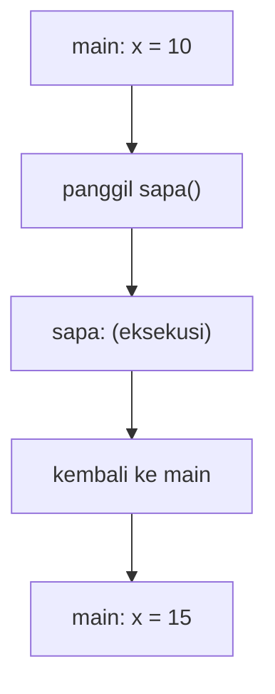
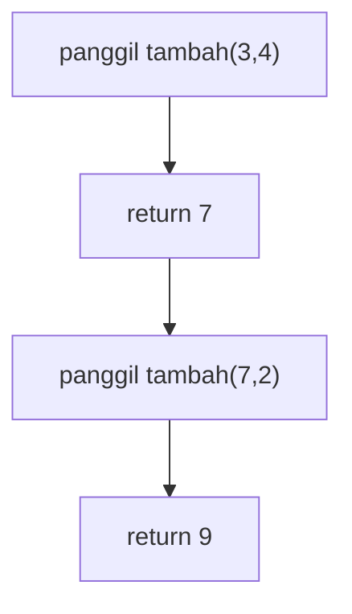
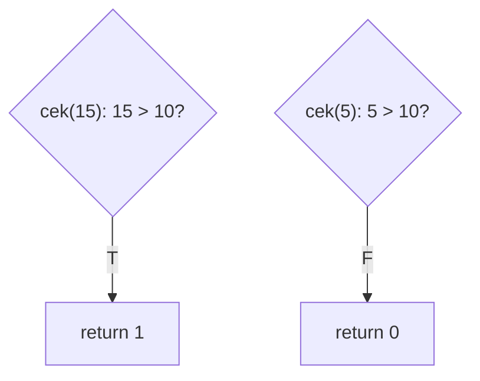
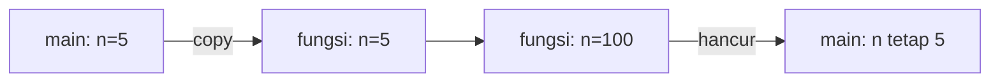
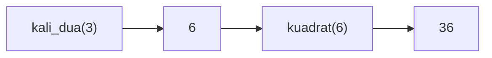
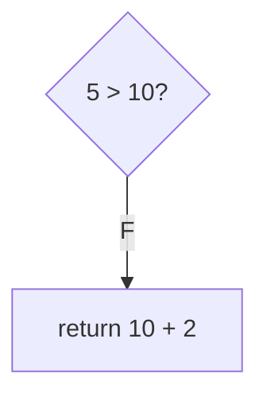
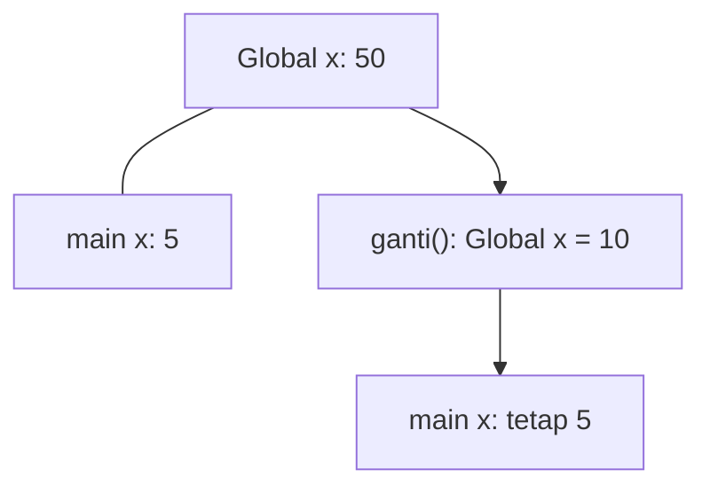
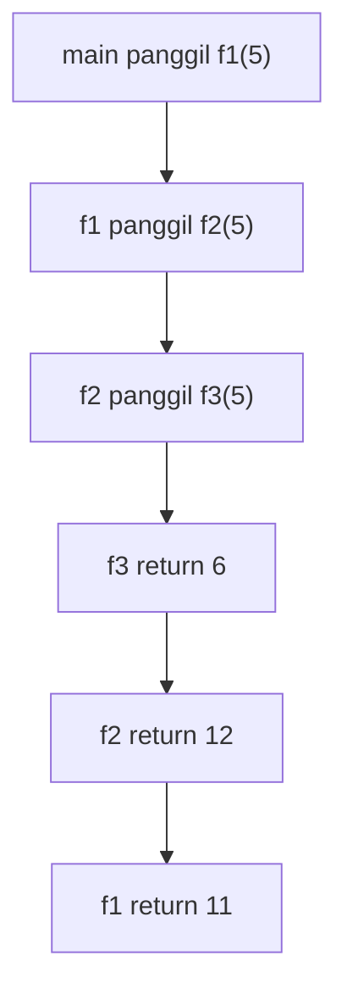

		🔙 **[Kembali ke Daftar Soal](./README.md)**

---

# Latihan Soal Part C - Modul 04 - Set 01 (Premium Edition)

---

### Soal 1: Pemanggil Void (Basic Call)
```cpp
void sapa() {
    // Mencetak "Halo"
}

int main() {
    int x = 10;
    sapa();
    x += 5;
    return 0;
}
```
**Pertanyaan:**
1. Berapakah nilai `x` di akhir fungsi `main`?
2. Apakah fungsi `sapa()` mengubah nilai `x`?

<details>
<summary><b>Klik untuk Lihat Jawaban & Diagnosis</b></summary>

**Mermaid Flowchart:**


**Jawaban:**
1. **15**
2. **Tidak.** Fungsi `sapa()` tidak memiliki akses ke variabel `x` yang ada di dalam `main`.

**📖 Analisis Mendalam:**
Ini adalah contoh fungsi `void` (tidak mengembalikan nilai). Alur eksekusi melompat ke `sapa`, lalu kembali ke baris berikutnya di `main`. Variabel di dalam fungsi yang berbeda bersifat terisolasi.
</details>

---

### Soal 2: Pengembalian Nilai (Return Type)
```cpp
int tambah(int a, int b) {
    return a + b;
}

int main() {
    int hasil = tambah(3, 4);
    hasil = tambah(hasil, 2);
    return 0;
}
```
**Pertanyaan:**
1. Berapakah nilai `hasil` akhir?
2. Berapa kali fungsi `tambah` dipanggil?

<details>
<summary><b>Klik untuk Lihat Jawaban & Diagnosis</b></summary>

**Mermaid Flowchart:**


**Jawaban:**
1. **9**
2. **2 kali**

**📖 Analisis Mendalam:**
Fungsi `int` mengembalikan sebuah nilai yang bisa disimpan kembali ke dalam variabel atau digunakan langsung sebagai argumen fungsi lain.
</details>

---

### Soal 3: ⚠️ Return Prematur (Early Return)
```cpp
int cek(int n) {
    if (n > 10) return 1;
    return 0;
    return 2; // Baris ini?
}

int main() {
    int x = cek(15);
    int y = cek(5);
}
```
**Pertanyaan:**
1. Berapakah nilai `x`?
2. Berapakah nilai `y`?
3. Apakah `return 2` akan pernah dieksekusi?

<details>
<summary><b>Klik untuk Lihat Jawaban & Diagnosis</b></summary>

**Mermaid Flowchart:**


**Jawaban:**
1. **1**
2. **0**
3. **Tidak.** Begitu komputer bertemu kata `return`, fungsi langsung berhenti dan keluar. Kode di bawahnya menjadi "dead code".
</details>

---

### Soal 4: Parameter Terisolasi (Local Scope)
```cpp
void ubah(int n) {
    n = 100;
}

int main() {
    int n = 5;
    ubah(n);
    // n di sini?
}
```
**Pertanyaan:**
1. Berapakah nilai `n` di dalam `main` setelah `ubah(n)` dipanggil?
2. Mengapa `n = 100` di dalam fungsi tidak merubah `n` di luar?

<details>
<summary><b>Klik untuk Lihat Jawaban & Diagnosis</b></summary>

**Mermaid Flowchart:**


**Jawaban:**
1. **5**
2. Karena ini adalah **Pass-by-Value**. Fungsi hanya menerima "fotokopi" dari nilainya, bukan variabel aslinya.
</details>

---

### Soal 5: Komposisi Fungsi (Nested Calls)
```cpp
int kuadrat(int n) { return n * n; }
int kali_dua(int n) { return n * 2; }

int main() {
    int x = kuadrat(kali_dua(3));
}
```
**Pertanyaan:**
1. Berapakah nilai `x`?
2. Fungsi mana yang selesai dieksekusi lebih dulu?

<details>
<summary><b>Klik untuk Lihat Jawaban & Diagnosis</b></summary>

**Mermaid Flowchart:**


**Jawaban:**
1. **36**
2. **kali_dua(3)**. Bagian paling dalam dari kurung harus diselesaikan dulu sebelum hasilnya dikirim ke fungsi luar.
</details>

---

### Soal 6: Return Ekspresi (Math Return)
```cpp
int hitung(int a) {
    return a * a - a;
}

int main() {
    int hasil = hitung(4);
}
```
**Pertanyaan:**
1. Berapakah nilai `hasil`?
2. Jika dilakukan `hitung(1)`, berapakah hasilnya?

<details>
<summary><b>Klik untuk Lihat Jawaban & Diagnosis</b></summary>

**Jawaban:**
1. **12** (16 - 4)
2. **0** (1 - 1)
</details>

---

### Soal 7: ⚠️ Void return? (Syntax Trap)
```cpp
void tampil(int n) {
    if (n < 0) return;
    // Cetak n
}

int main() {
    tampil(-5);
}
```
**Pertanyaan:**
1. Apakah `return;` (tanpa nilai) diperbolehkan di fungsi `void`?
2. Apa fungsi `return;` di baris kedua tersebut?

<details>
<summary><b>Klik untuk Lihat Jawaban & Diagnosis</b></summary>

**Jawaban:**
1. **Boleh.**
2. Sebagai **pintu keluar darurat**. Ia menghentikan fungsi saat itu juga tanpa memberikan nilai balik.

**📖 Analisis Mendalam:**
Ini sering digunakan untuk validasi input di awal fungsi. Jika syarat tidak terpenuhi, langsung "cabut".
</details>

---

### Soal 8: Parameter Ganda (Multi-param)
```cpp
int rahasia(int a, int b, int c) {
    if (a > b) return a + c;
    return b + c;
}

int main() {
    int x = rahasia(5, 10, 2);
}
```
**Pertanyaan:**
1. Berapakah nilai `x`?
2. Syarat mana yang terpenuhi di dalam fungsi?

<details>
<summary><b>Klik untuk Lihat Jawaban & Diagnosis</b></summary>

**Mermaid Flowchart:**


**Jawaban:**
1. **12**
2. Syarat **False** (masuk ke baris return kedua).
</details>

---

### Soal 9: Bayangan Global (Global Scope)
```cpp
int x = 50;

void ganti() {
    x = 10;
}

int main() {
    int x = 5;
    ganti();
    // Berapa x di main?
}
```
**Pertanyaan:**
1. Berapakah nilai `x` di dalam `main` di akhir program?
2. Apakah fungsi `ganti()` berhasil mengubah `x` global?

<details>
<summary><b>Klik untuk Lihat Jawaban & Diagnosis</b></summary>

**Mermaid Flowchart:**


**Jawaban:**
1. **5**
2. **Ya, tapi** `x` di dalam `main` adalah variabel lokal yang berbeda, sehingga `main` tetap melihat `x` miliknya sendiri (5).

**📖 Analisis Mendalam:**
Hati-hati dengan nama yang sama! Variabel lokal akan "menutupi" variabel global dengan nama yang sama.
</details>

---

### Soal 10: Rantai Panggilan (Chain Call)
```cpp
int f3(int n) { return n + 1; }
int f2(int n) { return f3(n) * 2; }
int f1(int n) { return f2(n) - 1; }

int main() {
    int hasil = f1(5);
}
```
**Pertanyaan:**
1. Berapakah nilai `hasil`?
2. Berapa kali loncatan stack yang terjadi?

<details>
<summary><b>Klik untuk Lihat Jawaban & Diagnosis</b></summary>

**Mermaid Flowchart:**


**Jawaban:**
1. **11**
2. **3 loncatan** ke depan, dan 3 kali kembali.
</details>
