🔙 **[Kembali ke Daftar Soal](./README.md)**

---

# Latihan Soal Part C - Modul 04 - Set 02

### Soal 26
```cpp
int f(int x) { return x * 2; }
// main: int a = 17; a = f(a) + f(2);
```
**Pertanyaan:**
1. Berapakah hasil akhirnya?
2. Mengapa demikian?

**Jawaban & Diagnosis:**
1. **38**
2. Lihat Tracing.

**Mermaid Flowchart:**
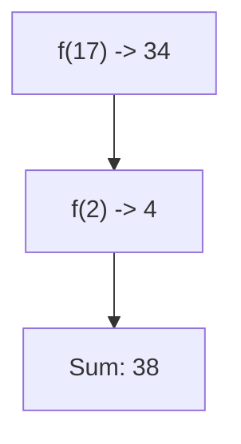

**📖 Penjelasan:**
**Langkah Tracing:**
1. f(17) = 34.
2. f(2) = 4.
3. Jumlah: 38.

---
### Soal 27
```cpp
void swap(int &a, int b) { int t=a; a=b; b=t; }
// main: int x=10, y=19; swap(x, y);
```
**Pertanyaan:**
1. Berapakah hasil akhirnya?
2. Mengapa demikian?

**Jawaban & Diagnosis:**
1. **x=19, y=19**
2. Lihat Tracing.

**Mermaid Flowchart:**
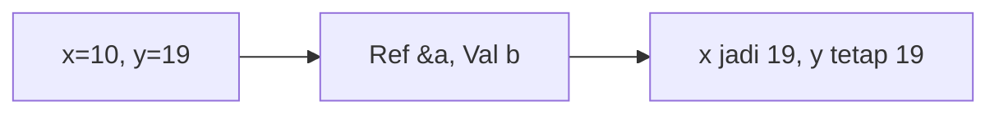

**📖 Penjelasan:**
**Langkah Tracing:**
1. x dilempar secara `reference` (&), maka nilainya berubah.
2. y dilempar secara `value`, maka aslinya aman.

---
### Soal 28
```cpp
int f(int x) { return x * 2; }
// main: int a = 6; a = f(a) + f(2);
```
**Pertanyaan:**
1. Berapakah hasil akhirnya?
2. Mengapa demikian?

**Jawaban & Diagnosis:**
1. **16**
2. Lihat Tracing.

**Mermaid Flowchart:**
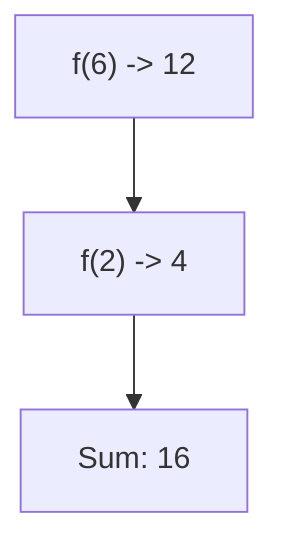

**📖 Penjelasan:**
**Langkah Tracing:**
1. f(6) = 12.
2. f(2) = 4.
3. Jumlah: 16.

---
### Soal 29
```cpp
int f(int x) { return x * 2; }
// main: int a = 8; a = f(a) + f(2);
```
**Pertanyaan:**
1. Berapakah hasil akhirnya?
2. Mengapa demikian?

**Jawaban & Diagnosis:**
1. **20**
2. Lihat Tracing.

**Mermaid Flowchart:**
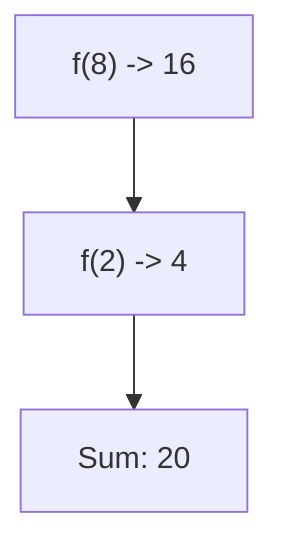

**📖 Penjelasan:**
**Langkah Tracing:**
1. f(8) = 16.
2. f(2) = 4.
3. Jumlah: 20.

---
### Soal 30
```cpp
int f(int x) { return x * 2; }
// main: int a = 16; a = f(a) + f(2);
```
**Pertanyaan:**
1. Berapakah hasil akhirnya?
2. Mengapa demikian?

**Jawaban & Diagnosis:**
1. **36**
2. Lihat Tracing.

**Mermaid Flowchart:**


**📖 Penjelasan:**
**Langkah Tracing:**
1. f(16) = 32.
2. f(2) = 4.
3. Jumlah: 36.

---
### Soal 31
```cpp
void swap(int &a, int b) { int t=a; a=b; b=t; }
// main: int x=10, y=9; swap(x, y);
```
**Pertanyaan:**
1. Berapakah hasil akhirnya?
2. Mengapa demikian?

**Jawaban & Diagnosis:**
1. **x=9, y=9**
2. Lihat Tracing.

**Mermaid Flowchart:**
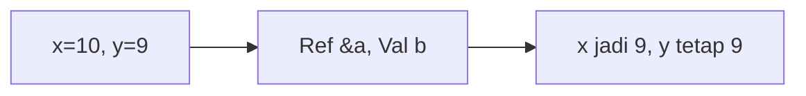

**📖 Penjelasan:**
**Langkah Tracing:**
1. x dilempar secara `reference` (&), maka nilainya berubah.
2. y dilempar secara `value`, maka aslinya aman.

---
### Soal 32
```cpp
int f(int x) { return x * 2; }
// main: int a = 13; a = f(a) + f(2);
```
**Pertanyaan:**
1. Berapakah hasil akhirnya?
2. Mengapa demikian?

**Jawaban & Diagnosis:**
1. **30**
2. Lihat Tracing.

**Mermaid Flowchart:**
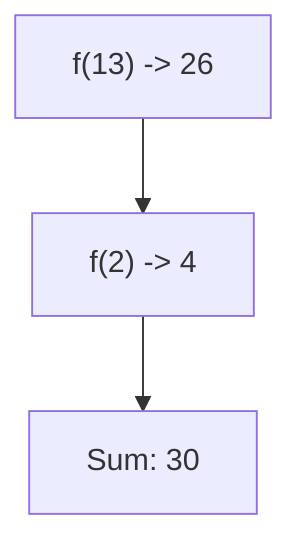

**📖 Penjelasan:**
**Langkah Tracing:**
1. f(13) = 26.
2. f(2) = 4.
3. Jumlah: 30.

---
### Soal 33
```cpp
void swap(int &a, int b) { int t=a; a=b; b=t; }
// main: int x=9, y=5; swap(x, y);
```
**Pertanyaan:**
1. Berapakah hasil akhirnya?
2. Mengapa demikian?

**Jawaban & Diagnosis:**
1. **x=5, y=5**
2. Lihat Tracing.

**Mermaid Flowchart:**
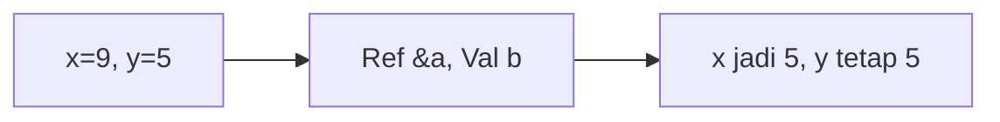

**📖 Penjelasan:**
**Langkah Tracing:**
1. x dilempar secara `reference` (&), maka nilainya berubah.
2. y dilempar secara `value`, maka aslinya aman.

---
### Soal 34
```cpp
int f(int x) { return x * 2; }
// main: int a = 2; a = f(a) + f(2);
```
**Pertanyaan:**
1. Berapakah hasil akhirnya?
2. Mengapa demikian?

**Jawaban & Diagnosis:**
1. **8**
2. Lihat Tracing.

**Mermaid Flowchart:**


**📖 Penjelasan:**
**Langkah Tracing:**
1. f(2) = 4.
2. f(2) = 4.
3. Jumlah: 8.

---
### Soal 35
```cpp
int f(int x) { return x * 2; }
// main: int a = 13; a = f(a) + f(2);
```
**Pertanyaan:**
1. Berapakah hasil akhirnya?
2. Mengapa demikian?

**Jawaban & Diagnosis:**
1. **30**
2. Lihat Tracing.

**Mermaid Flowchart:**


**📖 Penjelasan:**
**Langkah Tracing:**
1. f(13) = 26.
2. f(2) = 4.
3. Jumlah: 30.

---
### Soal 36
```cpp
int f(int x) { return x * 2; }
// main: int a = 16; a = f(a) + f(2);
```
**Pertanyaan:**
1. Berapakah hasil akhirnya?
2. Mengapa demikian?

**Jawaban & Diagnosis:**
1. **36**
2. Lihat Tracing.

**Mermaid Flowchart:**


**📖 Penjelasan:**
**Langkah Tracing:**
1. f(16) = 32.
2. f(2) = 4.
3. Jumlah: 36.

---
### Soal 37
```cpp
int f(int x) { return x * 2; }
// main: int a = 7; a = f(a) + f(2);
```
**Pertanyaan:**
1. Berapakah hasil akhirnya?
2. Mengapa demikian?

**Jawaban & Diagnosis:**
1. **18**
2. Lihat Tracing.

**Mermaid Flowchart:**
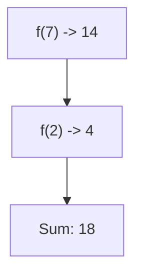

**📖 Penjelasan:**
**Langkah Tracing:**
1. f(7) = 14.
2. f(2) = 4.
3. Jumlah: 18.

---
### Soal 38
```cpp
int f(int x) { return x * 2; }
// main: int a = 1; a = f(a) + f(2);
```
**Pertanyaan:**
1. Berapakah hasil akhirnya?
2. Mengapa demikian?

**Jawaban & Diagnosis:**
1. **6**
2. Lihat Tracing.

**Mermaid Flowchart:**
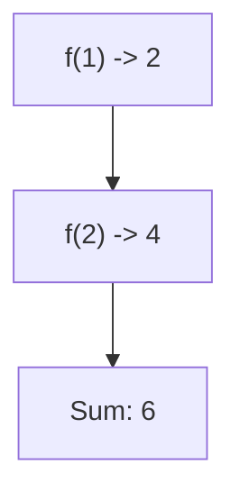

**📖 Penjelasan:**
**Langkah Tracing:**
1. f(1) = 2.
2. f(2) = 4.
3. Jumlah: 6.

---
### Soal 39
```cpp
int f(int x) { return x * 2; }
// main: int a = 7; a = f(a) + f(2);
```
**Pertanyaan:**
1. Berapakah hasil akhirnya?
2. Mengapa demikian?

**Jawaban & Diagnosis:**
1. **18**
2. Lihat Tracing.

**Mermaid Flowchart:**


**📖 Penjelasan:**
**Langkah Tracing:**
1. f(7) = 14.
2. f(2) = 4.
3. Jumlah: 18.

---
### Soal 40
```cpp
int f(int x) { return x * 2; }
// main: int a = 14; a = f(a) + f(2);
```
**Pertanyaan:**
1. Berapakah hasil akhirnya?
2. Mengapa demikian?

**Jawaban & Diagnosis:**
1. **32**
2. Lihat Tracing.

**Mermaid Flowchart:**
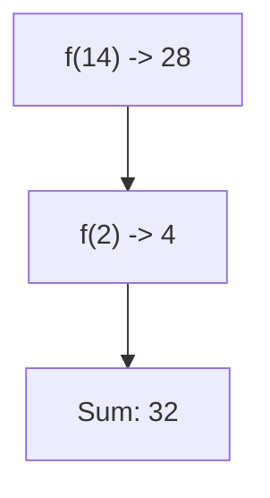

**📖 Penjelasan:**
**Langkah Tracing:**
1. f(14) = 28.
2. f(2) = 4.
3. Jumlah: 32.

---
### Soal 41
```cpp
int f(int x) { return x * 2; }
// main: int a = 4; a = f(a) + f(2);
```
**Pertanyaan:**
1. Berapakah hasil akhirnya?
2. Mengapa demikian?

**Jawaban & Diagnosis:**
1. **12**
2. Lihat Tracing.

**Mermaid Flowchart:**
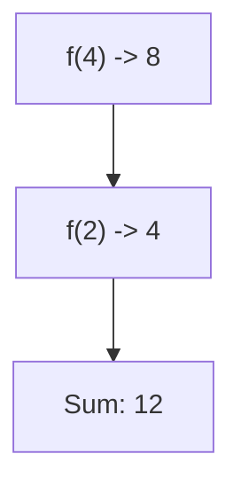

**📖 Penjelasan:**
**Langkah Tracing:**
1. f(4) = 8.
2. f(2) = 4.
3. Jumlah: 12.

---
### Soal 42
```cpp
void swap(int &a, int b) { int t=a; a=b; b=t; }
// main: int x=7, y=6; swap(x, y);
```
**Pertanyaan:**
1. Berapakah hasil akhirnya?
2. Mengapa demikian?

**Jawaban & Diagnosis:**
1. **x=6, y=6**
2. Lihat Tracing.

**Mermaid Flowchart:**
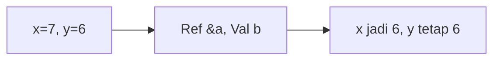

**📖 Penjelasan:**
**Langkah Tracing:**
1. x dilempar secara `reference` (&), maka nilainya berubah.
2. y dilempar secara `value`, maka aslinya aman.

---
### Soal 43
```cpp
int f(int x) { return x * 2; }
// main: int a = 19; a = f(a) + f(2);
```
**Pertanyaan:**
1. Berapakah hasil akhirnya?
2. Mengapa demikian?

**Jawaban & Diagnosis:**
1. **42**
2. Lihat Tracing.

**Mermaid Flowchart:**
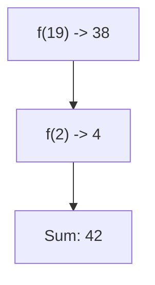

**📖 Penjelasan:**
**Langkah Tracing:**
1. f(19) = 38.
2. f(2) = 4.
3. Jumlah: 42.

---
### Soal 44
```cpp
void swap(int &a, int b) { int t=a; a=b; b=t; }
// main: int x=9, y=11; swap(x, y);
```
**Pertanyaan:**
1. Berapakah hasil akhirnya?
2. Mengapa demikian?

**Jawaban & Diagnosis:**
1. **x=11, y=11**
2. Lihat Tracing.

**Mermaid Flowchart:**
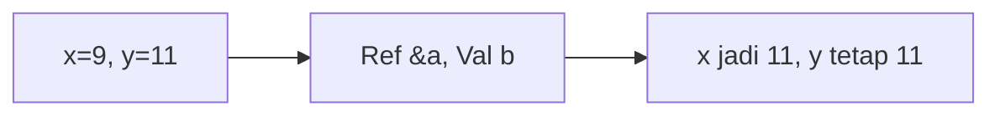

**📖 Penjelasan:**
**Langkah Tracing:**
1. x dilempar secara `reference` (&), maka nilainya berubah.
2. y dilempar secara `value`, maka aslinya aman.

---
### Soal 45
```cpp
void swap(int &a, int b) { int t=a; a=b; b=t; }
// main: int x=11, y=3; swap(x, y);
```
**Pertanyaan:**
1. Berapakah hasil akhirnya?
2. Mengapa demikian?

**Jawaban & Diagnosis:**
1. **x=3, y=3**
2. Lihat Tracing.

**Mermaid Flowchart:**
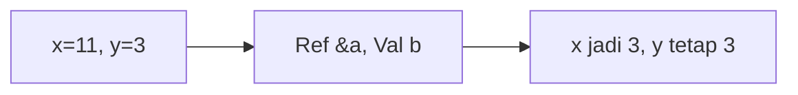

**📖 Penjelasan:**
**Langkah Tracing:**
1. x dilempar secara `reference` (&), maka nilainya berubah.
2. y dilempar secara `value`, maka aslinya aman.

---
### Soal 46
```cpp
void swap(int &a, int b) { int t=a; a=b; b=t; }
// main: int x=18, y=18; swap(x, y);
```
**Pertanyaan:**
1. Berapakah hasil akhirnya?
2. Mengapa demikian?

**Jawaban & Diagnosis:**
1. **x=18, y=18**
2. Lihat Tracing.

**Mermaid Flowchart:**
```mermaid
graph LR
A["x=18, y=18"] --> B["Ref &a, Val b"]
B --> C["x jadi 18, y tetap 18"]
```

**📖 Penjelasan:**
**Langkah Tracing:**
1. x dilempar secara `reference` (&), maka nilainya berubah.
2. y dilempar secara `value`, maka aslinya aman.

---
### Soal 47
```cpp
int f(int x) { return x * 2; }
// main: int a = 14; a = f(a) + f(2);
```
**Pertanyaan:**
1. Berapakah hasil akhirnya?
2. Mengapa demikian?

**Jawaban & Diagnosis:**
1. **32**
2. Lihat Tracing.

**Mermaid Flowchart:**
```mermaid
graph TD
A["f(14) -> 28"] --> B["f(2) -> 4"]
B --> C["Sum: 32"]
```

**📖 Penjelasan:**
**Langkah Tracing:**
1. f(14) = 28.
2. f(2) = 4.
3. Jumlah: 32.

---
### Soal 48
```cpp
void swap(int &a, int b) { int t=a; a=b; b=t; }
// main: int x=20, y=12; swap(x, y);
```
**Pertanyaan:**
1. Berapakah hasil akhirnya?
2. Mengapa demikian?

**Jawaban & Diagnosis:**
1. **x=12, y=12**
2. Lihat Tracing.

**Mermaid Flowchart:**
```mermaid
graph LR
A["x=20, y=12"] --> B["Ref &a, Val b"]
B --> C["x jadi 12, y tetap 12"]
```

**📖 Penjelasan:**
**Langkah Tracing:**
1. x dilempar secara `reference` (&), maka nilainya berubah.
2. y dilempar secara `value`, maka aslinya aman.

---
### Soal 49
```cpp
int f(int x) { return x * 2; }
// main: int a = 19; a = f(a) + f(2);
```
**Pertanyaan:**
1. Berapakah hasil akhirnya?
2. Mengapa demikian?

**Jawaban & Diagnosis:**
1. **42**
2. Lihat Tracing.

**Mermaid Flowchart:**
```mermaid
graph TD
A["f(19) -> 38"] --> B["f(2) -> 4"]
B --> C["Sum: 42"]
```

**📖 Penjelasan:**
**Langkah Tracing:**
1. f(19) = 38.
2. f(2) = 4.
3. Jumlah: 42.

---
### Soal 50
```cpp
void swap(int &a, int b) { int t=a; a=b; b=t; }
// main: int x=8, y=3; swap(x, y);
```
**Pertanyaan:**
1. Berapakah hasil akhirnya?
2. Mengapa demikian?

**Jawaban & Diagnosis:**
1. **x=3, y=3**
2. Lihat Tracing.

**Mermaid Flowchart:**
```mermaid
graph LR
A["x=8, y=3"] --> B["Ref &a, Val b"]
B --> C["x jadi 3, y tetap 3"]
```

**📖 Penjelasan:**
**Langkah Tracing:**
1. x dilempar secara `reference` (&), maka nilainya berubah.
2. y dilempar secara `value`, maka aslinya aman.

---
