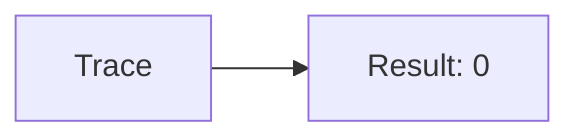
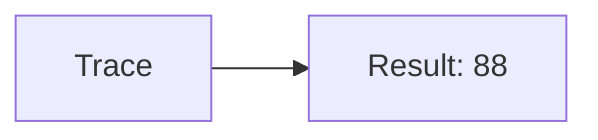
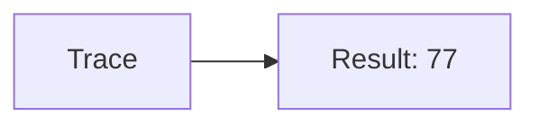
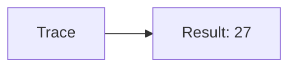
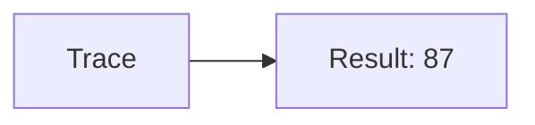
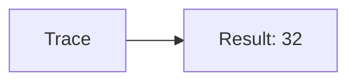

🔙 **[Kembali ke Daftar Soal](./README.md)**

---

# Latihan Soal Part C - Modul 04 - Set 02

### Soal 26
```cpp
// Weapon: Pass-by-Reference
void reset(int &x) { x = 0; }
// main: int weapon=15;
reset(weapon);
```
**Pertanyaan:**
1. Berapakah hasil akhirnya?
2. Deskripsikan alur pikir 'Compiler Manusia' untuk soal ini!

**Jawaban & Diagnosis:**
1. **0**
2. Reference '&' dikirim alamat aslinya. 'Weapon' ter-reset jadi 0.

**Mermaid Flowchart:**


---
### Soal 27
```cpp
// Tool: Pass-by-Value
void ubah(int x) { x = 0; }
// main: int tool=96;
ubah(tool);
```
**Pertanyaan:**
1. Berapakah hasil akhirnya?
2. Deskripsikan alur pikir 'Compiler Manusia' untuk soal ini!

**Jawaban & Diagnosis:**
1. **96**
2. Value 'Tool' dikirim fotokopinya. Aslinya tetap 96.

**Mermaid Flowchart:**


---
### Soal 28
```cpp
// Item: Pass-by-Reference
void reset(int &x) { x = 0; }
// main: int item=29;
reset(item);
```
**Pertanyaan:**
1. Berapakah hasil akhirnya?
2. Deskripsikan alur pikir 'Compiler Manusia' untuk soal ini!

**Jawaban & Diagnosis:**
1. **0**
2. Reference '&' dikirim alamat aslinya. 'Item' ter-reset jadi 0.

**Mermaid Flowchart:**


---
### Soal 29
```cpp
// Food: Pass-by-Value
void ubah(int x) { x = 0; }
// main: int food=53;
ubah(food);
```
**Pertanyaan:**
1. Berapakah hasil akhirnya?
2. Deskripsikan alur pikir 'Compiler Manusia' untuk soal ini!

**Jawaban & Diagnosis:**
1. **53**
2. Value 'Food' dikirim fotokopinya. Aslinya tetap 53.

**Mermaid Flowchart:**


---
### Soal 30
```cpp
// Drink: Pass-by-Reference
void reset(int &x) { x = 0; }
// main: int drink=18;
reset(drink);
```
**Pertanyaan:**
1. Berapakah hasil akhirnya?
2. Deskripsikan alur pikir 'Compiler Manusia' untuk soal ini!

**Jawaban & Diagnosis:**
1. **0**
2. Reference '&' dikirim alamat aslinya. 'Drink' ter-reset jadi 0.

**Mermaid Flowchart:**


---
### Soal 31
```cpp
// Potion: Pass-by-Value
void ubah(int x) { x = 0; }
// main: int potion=18;
ubah(potion);
```
**Pertanyaan:**
1. Berapakah hasil akhirnya?
2. Deskripsikan alur pikir 'Compiler Manusia' untuk soal ini!

**Jawaban & Diagnosis:**
1. **18**
2. Value 'Potion' dikirim fotokopinya. Aslinya tetap 18.

**Mermaid Flowchart:**


---
### Soal 32
```cpp
// Scroll: Pass-by-Reference
void reset(int &x) { x = 0; }
// main: int scroll=73;
reset(scroll);
```
**Pertanyaan:**
1. Berapakah hasil akhirnya?
2. Deskripsikan alur pikir 'Compiler Manusia' untuk soal ini!

**Jawaban & Diagnosis:**
1. **0**
2. Reference '&' dikirim alamat aslinya. 'Scroll' ter-reset jadi 0.

**Mermaid Flowchart:**


---
### Soal 33
```cpp
// Book: Pass-by-Value
void ubah(int x) { x = 0; }
// main: int book=88;
ubah(book);
```
**Pertanyaan:**
1. Berapakah hasil akhirnya?
2. Deskripsikan alur pikir 'Compiler Manusia' untuk soal ini!

**Jawaban & Diagnosis:**
1. **88**
2. Value 'Book' dikirim fotokopinya. Aslinya tetap 88.

**Mermaid Flowchart:**


---
### Soal 34
```cpp
// Map: Pass-by-Reference
void reset(int &x) { x = 0; }
// main: int map=51;
reset(map);
```
**Pertanyaan:**
1. Berapakah hasil akhirnya?
2. Deskripsikan alur pikir 'Compiler Manusia' untuk soal ini!

**Jawaban & Diagnosis:**
1. **0**
2. Reference '&' dikirim alamat aslinya. 'Map' ter-reset jadi 0.

**Mermaid Flowchart:**


---
### Soal 35
```cpp
// Key: Pass-by-Value
void ubah(int x) { x = 0; }
// main: int key=63;
ubah(key);
```
**Pertanyaan:**
1. Berapakah hasil akhirnya?
2. Deskripsikan alur pikir 'Compiler Manusia' untuk soal ini!

**Jawaban & Diagnosis:**
1. **63**
2. Value 'Key' dikirim fotokopinya. Aslinya tetap 63.

**Mermaid Flowchart:**


---
### Soal 36
```cpp
// Coin: Pass-by-Reference
void reset(int &x) { x = 0; }
// main: int coin=60;
reset(coin);
```
**Pertanyaan:**
1. Berapakah hasil akhirnya?
2. Deskripsikan alur pikir 'Compiler Manusia' untuk soal ini!

**Jawaban & Diagnosis:**
1. **0**
2. Reference '&' dikirim alamat aslinya. 'Coin' ter-reset jadi 0.

**Mermaid Flowchart:**


---
### Soal 37
```cpp
// Gem: Pass-by-Value
void ubah(int x) { x = 0; }
// main: int gem=96;
ubah(gem);
```
**Pertanyaan:**
1. Berapakah hasil akhirnya?
2. Deskripsikan alur pikir 'Compiler Manusia' untuk soal ini!

**Jawaban & Diagnosis:**
1. **96**
2. Value 'Gem' dikirim fotokopinya. Aslinya tetap 96.

**Mermaid Flowchart:**


---
### Soal 38
```cpp
// Jewel: Pass-by-Reference
void reset(int &x) { x = 0; }
// main: int jewel=76;
reset(jewel);
```
**Pertanyaan:**
1. Berapakah hasil akhirnya?
2. Deskripsikan alur pikir 'Compiler Manusia' untuk soal ini!

**Jawaban & Diagnosis:**
1. **0**
2. Reference '&' dikirim alamat aslinya. 'Jewel' ter-reset jadi 0.

**Mermaid Flowchart:**


---
### Soal 39
```cpp
// Stone: Pass-by-Value
void ubah(int x) { x = 0; }
// main: int stone=77;
ubah(stone);
```
**Pertanyaan:**
1. Berapakah hasil akhirnya?
2. Deskripsikan alur pikir 'Compiler Manusia' untuk soal ini!

**Jawaban & Diagnosis:**
1. **77**
2. Value 'Stone' dikirim fotokopinya. Aslinya tetap 77.

**Mermaid Flowchart:**


---
### Soal 40
```cpp
// Ore: Pass-by-Reference
void reset(int &x) { x = 0; }
// main: int ore=83;
reset(ore);
```
**Pertanyaan:**
1. Berapakah hasil akhirnya?
2. Deskripsikan alur pikir 'Compiler Manusia' untuk soal ini!

**Jawaban & Diagnosis:**
1. **0**
2. Reference '&' dikirim alamat aslinya. 'Ore' ter-reset jadi 0.

**Mermaid Flowchart:**


---
### Soal 41
```cpp
// Metal: Pass-by-Value
void ubah(int x) { x = 0; }
// main: int metal=27;
ubah(metal);
```
**Pertanyaan:**
1. Berapakah hasil akhirnya?
2. Deskripsikan alur pikir 'Compiler Manusia' untuk soal ini!

**Jawaban & Diagnosis:**
1. **27**
2. Value 'Metal' dikirim fotokopinya. Aslinya tetap 27.

**Mermaid Flowchart:**


---
### Soal 42
```cpp
// Wood: Pass-by-Reference
void reset(int &x) { x = 0; }
// main: int wood=32;
reset(wood);
```
**Pertanyaan:**
1. Berapakah hasil akhirnya?
2. Deskripsikan alur pikir 'Compiler Manusia' untuk soal ini!

**Jawaban & Diagnosis:**
1. **0**
2. Reference '&' dikirim alamat aslinya. 'Wood' ter-reset jadi 0.

**Mermaid Flowchart:**


---
### Soal 43
```cpp
// Leather: Pass-by-Value
void ubah(int x) { x = 0; }
// main: int leather=87;
ubah(leather);
```
**Pertanyaan:**
1. Berapakah hasil akhirnya?
2. Deskripsikan alur pikir 'Compiler Manusia' untuk soal ini!

**Jawaban & Diagnosis:**
1. **87**
2. Value 'Leather' dikirim fotokopinya. Aslinya tetap 87.

**Mermaid Flowchart:**


---
### Soal 44
```cpp
// Cloth: Pass-by-Reference
void reset(int &x) { x = 0; }
// main: int cloth=24;
reset(cloth);
```
**Pertanyaan:**
1. Berapakah hasil akhirnya?
2. Deskripsikan alur pikir 'Compiler Manusia' untuk soal ini!

**Jawaban & Diagnosis:**
1. **0**
2. Reference '&' dikirim alamat aslinya. 'Cloth' ter-reset jadi 0.

**Mermaid Flowchart:**


---
### Soal 45
```cpp
// Herb: Pass-by-Value
void ubah(int x) { x = 0; }
// main: int herb=32;
ubah(herb);
```
**Pertanyaan:**
1. Berapakah hasil akhirnya?
2. Deskripsikan alur pikir 'Compiler Manusia' untuk soal ini!

**Jawaban & Diagnosis:**
1. **32**
2. Value 'Herb' dikirim fotokopinya. Aslinya tetap 32.

**Mermaid Flowchart:**


---
### Soal 46
```cpp
// Seed: Pass-by-Reference
void reset(int &x) { x = 0; }
// main: int seed=70;
reset(seed);
```
**Pertanyaan:**
1. Berapakah hasil akhirnya?
2. Deskripsikan alur pikir 'Compiler Manusia' untuk soal ini!

**Jawaban & Diagnosis:**
1. **0**
2. Reference '&' dikirim alamat aslinya. 'Seed' ter-reset jadi 0.

**Mermaid Flowchart:**
```mermaid
graph LR
A[Trace] --> B[Result: 0]
```

---
### Soal 47
```cpp
// Crop: Pass-by-Value
void ubah(int x) { x = 0; }
// main: int crop=73;
ubah(crop);
```
**Pertanyaan:**
1. Berapakah hasil akhirnya?
2. Deskripsikan alur pikir 'Compiler Manusia' untuk soal ini!

**Jawaban & Diagnosis:**
1. **73**
2. Value 'Crop' dikirim fotokopinya. Aslinya tetap 73.

**Mermaid Flowchart:**
```mermaid
graph LR
A[Trace] --> B[Result: 73]
```

---
### Soal 48
```cpp
// Animal: Pass-by-Reference
void reset(int &x) { x = 0; }
// main: int animal=88;
reset(animal);
```
**Pertanyaan:**
1. Berapakah hasil akhirnya?
2. Deskripsikan alur pikir 'Compiler Manusia' untuk soal ini!

**Jawaban & Diagnosis:**
1. **0**
2. Reference '&' dikirim alamat aslinya. 'Animal' ter-reset jadi 0.

**Mermaid Flowchart:**
```mermaid
graph LR
A[Trace] --> B[Result: 0]
```

---
### Soal 49
```cpp
// Fish: Pass-by-Value
void ubah(int x) { x = 0; }
// main: int fish=42;
ubah(fish);
```
**Pertanyaan:**
1. Berapakah hasil akhirnya?
2. Deskripsikan alur pikir 'Compiler Manusia' untuk soal ini!

**Jawaban & Diagnosis:**
1. **42**
2. Value 'Fish' dikirim fotokopinya. Aslinya tetap 42.

**Mermaid Flowchart:**
```mermaid
graph LR
A[Trace] --> B[Result: 42]
```

---
### Soal 50
```cpp
// Insect: Pass-by-Reference
void reset(int &x) { x = 0; }
// main: int insect=90;
reset(insect);
```
**Pertanyaan:**
1. Berapakah hasil akhirnya?
2. Deskripsikan alur pikir 'Compiler Manusia' untuk soal ini!

**Jawaban & Diagnosis:**
1. **0**
2. Reference '&' dikirim alamat aslinya. 'Insect' ter-reset jadi 0.

**Mermaid Flowchart:**
```mermaid
graph LR
A[Trace] --> B[Result: 0]
```

---
