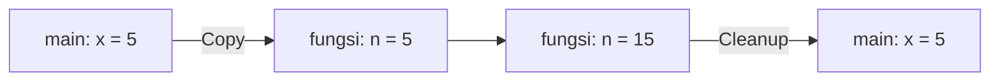
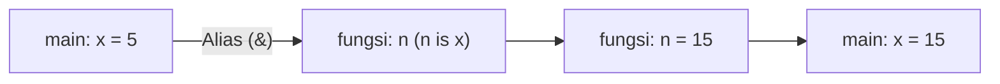
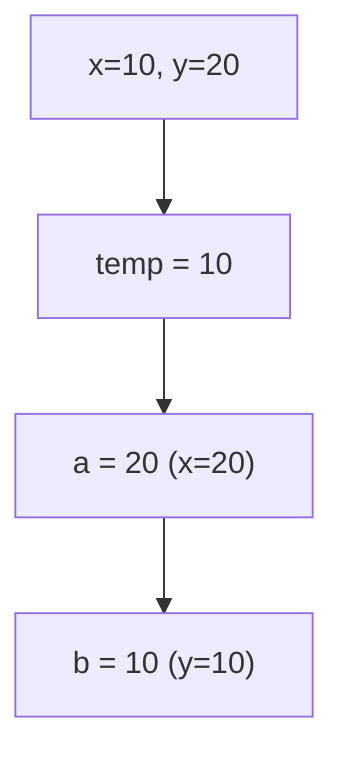
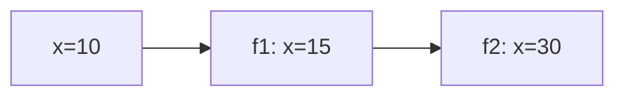
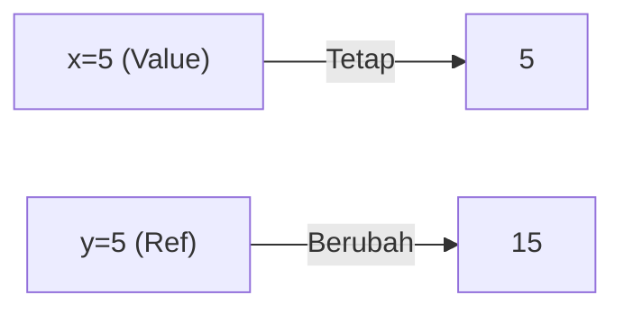
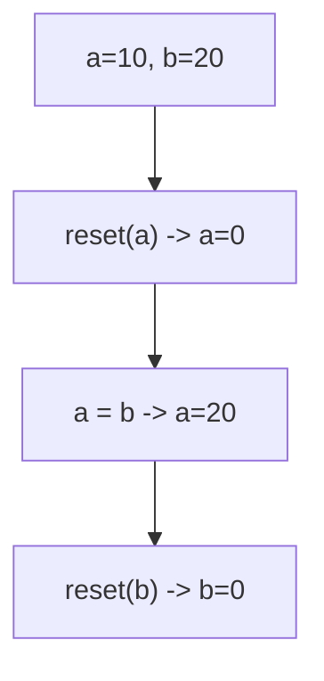

		🔙 **[Kembali ke Daftar Soal](./README.md)**

---

# Latihan Soal Part C - Modul 04 - Set 02 (Premium Edition)

---

### Soal 11: ⚠️ Pass by Value Trap
```cpp
void tambah_sepuluh(int n) {
    n += 10;
}

int main() {
    int x = 5;
    tambah_sepuluh(x);
    // Berapa x sekarang?
}
```
**Pertanyaan:**
1. Berapakah nilai `x` di akhir fungsi `main`?
2. Apakah perintah `n += 10` di dalam fungsi berhasil dijalankan?

<details>
<summary><b>Klik untuk Lihat Jawaban & Diagnosis</b></summary>

**Mermaid Flowchart:**


**Jawaban:**
1. **5**
2. **Ya, tapi** hanya pada variabel lokal `n` yang merupakan fotokopi dari `x`. Setelah fungsi selesai, `n` dihancurkan dan tidak memberi efek pada `x` asli.
</details>

---

### Soal 12: Sang Penyelamat (& Reference)
```cpp
void tambah_sepuluh(int &n) {
    n += 10;
}

int main() {
    int x = 5;
    tambah_sepuluh(x);
    // Berapa x sekarang?
}
```
**Pertanyaan:**
1. Berapakah nilai `x` sekarang?
2. Apa fungsi dari simbol `&` di samping tipe data `int`?

<details>
<summary><b>Klik untuk Lihat Jawaban & Diagnosis</b></summary>

**Mermaid Flowchart:**


**Jawaban:**
1. **15**
2. **Pass-by-Reference.** Ini membuat fungsi tidak menyalin nilainya, melainkan bekerja langsung pada "alamat" atau identitas asli variabel yang dikirim.

**📖 Analisis Mendalam:**
Bayangkan Pass-by-Value sebagai memberikan fotokopi PR, dan Pass-by-Reference sebagai memberikan buku asli. Di referensi, coretan apapun di dalam buku akan tetap ada saat buku dikembalikan.
</details>

---

### Soal 13: Tukar Tempat (The Classic Swap)
```cpp
void tukar(int &a, int &b) {
    int temp = a;
    a = b;
    b = temp;
}

int main() {
    int x = 10, y = 20;
    tukar(x, y);
}
```
**Pertanyaan:**
1. Berapakah nilai `x`?
2. Berapakah nilai `y`?
3. Apa yang terjadi jika simbol `&` dihapus?

<details>
<summary><b>Klik untuk Lihat Jawaban & Diagnosis</b></summary>

**Mermaid Flowchart:**


**Jawaban:**
1. **20**
2. **10**
3. Penukaran **gagal total** karena fungsi hanya menukar fotokopi nilai di dalam memorinya sendiri.
</details>

---

### Soal 14: Referensi Berantai
```cpp
void f2(int &n) {
    n *= 2;
}

void f1(int &n) {
    n += 5;
    f2(n);
}

int main() {
    int x = 10;
    f1(x);
}
```
**Pertanyaan:**
1. Berapakah nilai `x` akhir?
2. Apakah referensi bisa diteruskan ke fungsi lain?

<details>
<summary><b>Klik untuk Lihat Jawaban & Diagnosis</b></summary>

**Mermaid Flowchart:**


**Jawaban:**
1. **30**
2. **Ya.** Referensi bisa terus dioper berulang kali ke berbagai fungsi dan tetap merujuk ke variabel asli yang sama di `main`.
</details>

---

### Soal 15: Array adalah Referensi Tersembunyi
```cpp
void ubah_array(int arr[]) {
    arr[0] = 99;
}

int main() {
    int angka[2] = {1, 2};
    ubah_array(angka);
    // angka[0] ?
}
```
**Pertanyaan:**
1. Berapakah nilai `angka[0]`?
2. Apakah kita perlu menambahkan `&` untuk mengubah isi array di dalam fungsi?

<details>
<summary><b>Klik untuk Lihat Jawaban & Diagnosis</b></summary>

**Jawaban:**
1. **99**
2. **Tidak perlu.** Spesifik untuk array, C++ secara otomatis mengirimkan alamat memorinya. Maka mengubah isi array di fungsi akan selalu mengubah aslinya.

**📖 Analisis Mendalam:**
Ini adalah pengecualian penting. Array tidak pernah di-copy saat dikirim ke fungsi karena ukurannya bisa sangat besar.
</details>

---

### Soal 16: Parameter Ganda (Mixed Pass)
```cpp
void hitung(int a, int &b) {
    a += 10;
    b += 10;
}

int main() {
    int x = 5, y = 5;
    hitung(x, y);
}
```
**Pertanyaan:**
1. Berapakah nilai `x`?
2. Berapakah nilai `y`?

<details>
<summary><b>Klik untuk Lihat Jawaban & Diagnosis</b></summary>

**Mermaid Flowchart:**


**Jawaban:**
1. **5**
2. **15**
</details>

---

### Soal 17: String Manipulation
```cpp
void tambahkan(string &s) {
    s += "!";
}

int main() {
    string kata = "Halo";
    tambahkan(kata);
    tambahkan(kata);
}
```
**Pertanyaan:**
1. Berapakah isi dari variabel `kata`?
2. Mengapa penggunaan `&` sangat disarankan untuk tipe data `string`?

<details>
<summary><b>Klik untuk Lihat Jawaban & Diagnosis</b></summary>

**Jawaban:**
1. **"Halo!!"**
2. **Efisiensi.** String bisa berisi ribuan karakter. Dengan `&`, kita tidak perlu membuang waktu dan memori untuk menyalin seluruh karakter tersebut.
</details>

---

### Soal 18: Pengembalian Referensi? (Logic Check)
```cpp
int x = 10;

int& ambil_ref() {
    return x;
}

int main() {
    ambil_ref() = 50;
    // Berapa x?
}
```
**Pertanyaan:**
1. Berapakah nilai `x` akhir?
2. Apa yang unik dari baris `ambil_ref() = 50`?

<details>
<summary><b>Klik untuk Lihat Jawaban & Diagnosis</b></summary>

**Jawaban:**
1. **50**
2. Fungsi tersebut mengembalikan **jalur akses** ke variabel `x`, sehingga kita bisa memberi nilai langsung ke hasil pemanggilan fungsi tersebut.

**📖 Analisis Mendalam:**
Ini adalah teknik tingkat lanjut. Fungsi yang mengembalikan referensi memungkinkan pemanggilnya memodifikasi variabel global atau statis secara langsung.
</details>

---

### Soal 19: ⚠️ Jebakan Lokal Reference (Extreme Warning)
```cpp
int& jebakan() {
    int lokal = 5;
    return lokal; 
}

int main() {
    int &x = jebakan();
    // Bahaya?
}
```
**Pertanyaan:**
1. Mengapa kode di atas dianggap **sangat berbahaya** (sering menyebabkan crash)?
2. Di mana variabel `lokal` berada setelah fungsi selesai?

<details>
<summary><b>Klik untuk Lihat Jawaban & Diagnosis</b></summary>

**Jawaban:**
1. Karena ia mengembalikan referensi ke variabel yang **sudah hancur**. Saat fungsi selesai, `lokal` dihapus dari memori. Memberi nilai padanya disebut *Dangling Reference*.
2. **Dihancurkan** (Deallocated).

**📖 Analisis Mendalam:**
JANGAN PERNAH mengembalikan referensi ke variabel lokal. Ini adalah salah satu penyebab *Runtime Error* paling misterius di C++.
</details>

---

### Soal 20: ⚠️ Assignment via Function (Trace)
```cpp
void reset(int &n) {
    n = 0;
}

int main() {
    int a = 10, b = 20;
    reset(a);
    a = b;
    reset(b);
}
```
**Pertanyaan:**
1. Berapakah nilai `a`?
2. Berapakah nilai `b`?

<details>
<summary><b>Klik untuk Lihat Jawaban & Diagnosis</b></summary>

**Mermaid Flowchart:**


**Jawaban:**
1. **20**
2. **0**
</details>
