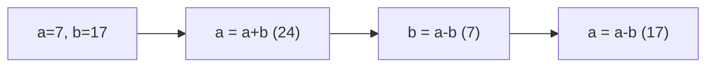
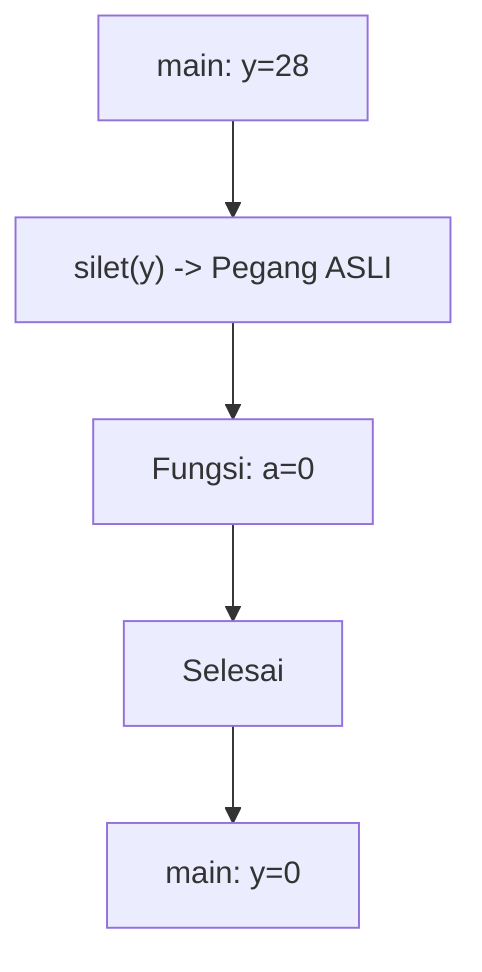
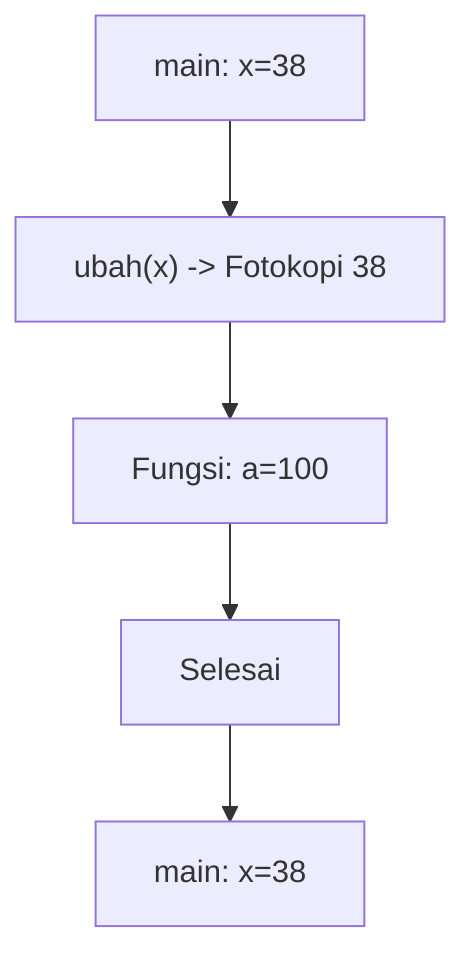
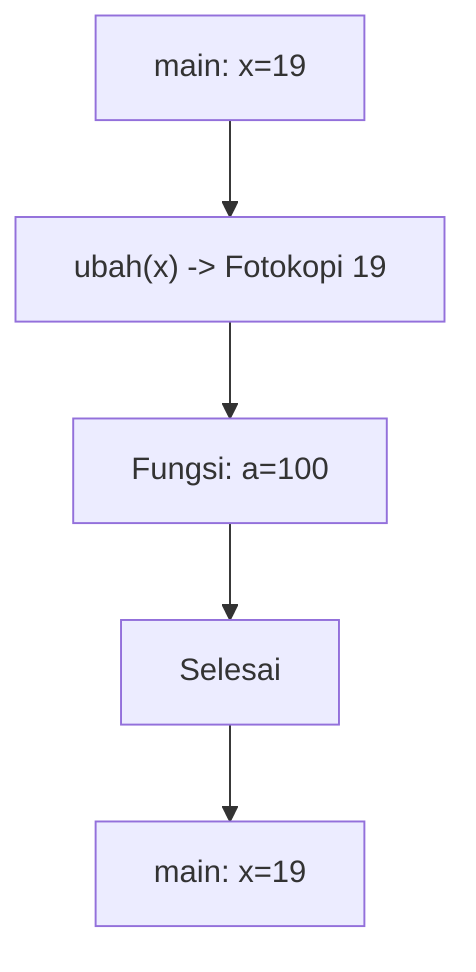
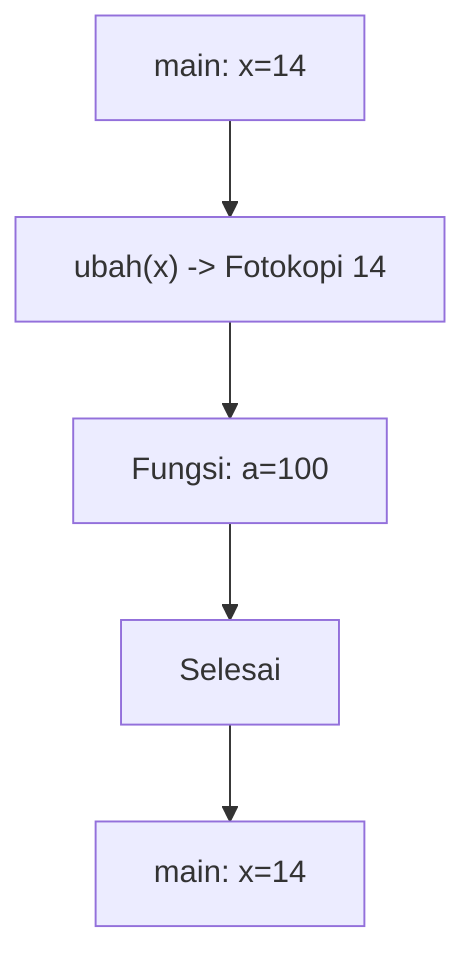
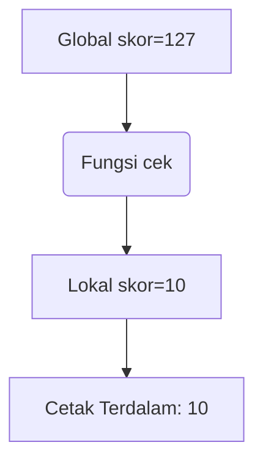
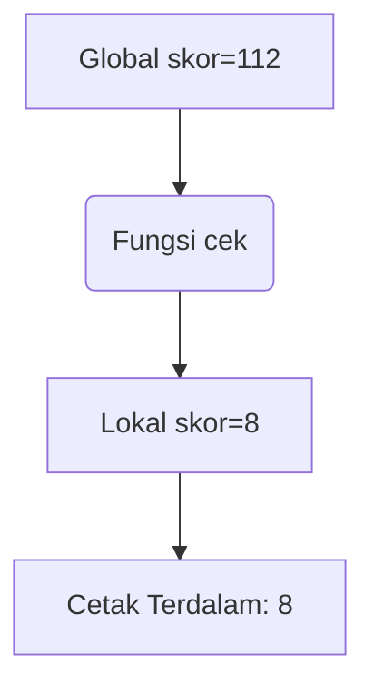
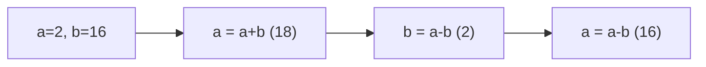
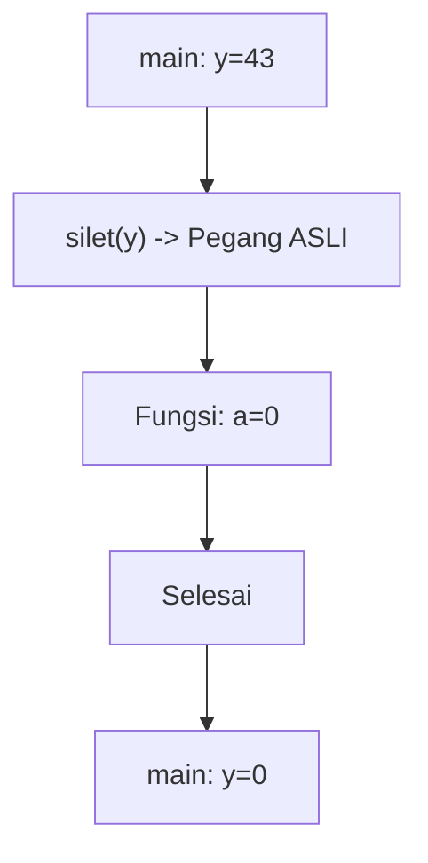

🔙 **[Kembali ke Daftar Soal](./README.md)**

---

# Latihan Soal Part C - Modul 04 - Set 02

### Soal 26 (Swap Trick)
```cpp
void tukar(int &a, int &b) {
    a = a + b;
    b = a - b;
    a = a - b;
}
// main: a=7, b=17; tukar(a,b);
```
**Pertanyaan:**
1. Setelah swap, berapa nilai `a`?
2. Setelah swap, berapa nilai `b`?
3. Kenapa tukar ini berhasil tanpa variabel ketiga?

**Jawaban & Diagnosis:**
1. **17**
2. **7**
3. **Karena menggunakan trik aritmetika (tambah-kurang) untuk membalas nilai.**

**Mermaid Flowchart:**


**📖 Cara Membaca Diagram:**
a=7, b=17. a=a+b=24. b=a-b=7=7. a=a-b=17=17. Terbalik!

---
### Soal 27 (Pass By Reference)
```cpp
void silet(int &a) {
    a = 0;
}

int main() {
    int y = 49;
    silet(y);
    // y = ?
```
**Pertanyaan:**
1. Berapakah nilai variabel `y` di akhir program?
2. Apa tanda yang menunjukkan fungsi ini menggunakan 'Reference'?
3. Analogi apa yang cocok untuk Pass-By-Reference?

**Jawaban & Diagnosis:**
1. **0**
2. **Tanda Amperstand (&) pada parameter `int &a`.**
3. **Memberikan Buku Asli (Kalau dicoret, aslinya rusak).**

**Mermaid Flowchart:**


**📖 Cara Membaca Diagram:**
y=49. Karena ada `&`, fungsi `silet` memegang dompet aslimu. Dia pasang 0, maka y di main ikut jadi 0.

---
### Soal 28 (Pass By Reference)
```cpp
void silet(int &a) {
    a = 0;
}

int main() {
    int y = 28;
    silet(y);
    // y = ?
```
**Pertanyaan:**
1. Berapakah nilai variabel `y` di akhir program?
2. Apa tanda yang menunjukkan fungsi ini menggunakan 'Reference'?
3. Analogi apa yang cocok untuk Pass-By-Reference?

**Jawaban & Diagnosis:**
1. **0**
2. **Tanda Amperstand (&) pada parameter `int &a`.**
3. **Memberikan Buku Asli (Kalau dicoret, aslinya rusak).**

**Mermaid Flowchart:**


**📖 Cara Membaca Diagram:**
y=28. Karena ada `&`, fungsi `silet` memegang dompet aslimu. Dia pasang 0, maka y di main ikut jadi 0.

---
### Soal 29 (Global vs Local)
```cpp
int skor = 126; // Global

void cek() {
    int skor = 6; // Local
    printf("%d", skor);
}

// output = ?
```
**Pertanyaan:**
1. Angka berapakah yang akan tercetak di layar?
2. Siapa yang lebih berkuasa: skor 126 atau skor 6?
3. Apa istilah untuk variabel lokal yang menutupi variabel global?

**Jawaban & Diagnosis:**
1. **6**
2. **Skor 6 (Lokal/Ketua Kelas) karena letaknya di dalam fungsi.**
3. **Shadowing (Membayangi).**

**Mermaid Flowchart:**


**📖 Cara Membaca Diagram:**
Mesin masuk fungsi. Dia melihat ada dua nama 'skor'. Dia pilih yang terdekat (lokal). Cetak lokal.

---
### Soal 30 (Pass By Value)
```cpp
void ubah(int a) {
    a = 100;
}

int main() {
    int x = 38;
    ubah(x);
    // x = ?
```
**Pertanyaan:**
1. Berapakah nilai variabel `x` di dalam `main` setelah fungsi `ubah` selesai?
2. Apa yang terjadi pada variabel `a` di dalam fungsi `ubah`?
3. Analogi apa yang cocok untuk Pass-By-Value?

**Jawaban & Diagnosis:**
1. **38**
2. **Berubah jadi 100, tapi hanya di dalam fungsi tersebut (lokal).**
3. **Fotokopi PR (Dicoret-coret temen gak ngaruh ke buku aslimu).**

**Mermaid Flowchart:**


**📖 Cara Membaca Diagram:**
x=38. Saat `ubah(x)`, komputer hanya mengirim fotokopi nilai 38. Fungsi merubah fotokopi jadi 100. Di main, dompet asli x tetap 38.

---
### Soal 31 (Pass By Value)
```cpp
void ubah(int a) {
    a = 100;
}

int main() {
    int x = 44;
    ubah(x);
    // x = ?
```
**Pertanyaan:**
1. Berapakah nilai variabel `x` di dalam `main` setelah fungsi `ubah` selesai?
2. Apa yang terjadi pada variabel `a` di dalam fungsi `ubah`?
3. Analogi apa yang cocok untuk Pass-By-Value?

**Jawaban & Diagnosis:**
1. **44**
2. **Berubah jadi 100, tapi hanya di dalam fungsi tersebut (lokal).**
3. **Fotokopi PR (Dicoret-coret temen gak ngaruh ke buku aslimu).**

**Mermaid Flowchart:**


**📖 Cara Membaca Diagram:**
x=44. Saat `ubah(x)`, komputer hanya mengirim fotokopi nilai 44. Fungsi merubah fotokopi jadi 100. Di main, dompet asli x tetap 44.

---
### Soal 32 (Pass By Value)
```cpp
void ubah(int a) {
    a = 100;
}

int main() {
    int x = 19;
    ubah(x);
    // x = ?
```
**Pertanyaan:**
1. Berapakah nilai variabel `x` di dalam `main` setelah fungsi `ubah` selesai?
2. Apa yang terjadi pada variabel `a` di dalam fungsi `ubah`?
3. Analogi apa yang cocok untuk Pass-By-Value?

**Jawaban & Diagnosis:**
1. **19**
2. **Berubah jadi 100, tapi hanya di dalam fungsi tersebut (lokal).**
3. **Fotokopi PR (Dicoret-coret temen gak ngaruh ke buku aslimu).**

**Mermaid Flowchart:**


**📖 Cara Membaca Diagram:**
x=19. Saat `ubah(x)`, komputer hanya mengirim fotokopi nilai 19. Fungsi merubah fotokopi jadi 100. Di main, dompet asli x tetap 19.

---
### Soal 33 (Pass By Reference)
```cpp
void silet(int &a) {
    a = 0;
}

int main() {
    int y = 48;
    silet(y);
    // y = ?
```
**Pertanyaan:**
1. Berapakah nilai variabel `y` di akhir program?
2. Apa tanda yang menunjukkan fungsi ini menggunakan 'Reference'?
3. Analogi apa yang cocok untuk Pass-By-Reference?

**Jawaban & Diagnosis:**
1. **0**
2. **Tanda Amperstand (&) pada parameter `int &a`.**
3. **Memberikan Buku Asli (Kalau dicoret, aslinya rusak).**

**Mermaid Flowchart:**


**📖 Cara Membaca Diagram:**
y=48. Karena ada `&`, fungsi `silet` memegang dompet aslimu. Dia pasang 0, maka y di main ikut jadi 0.

---
### Soal 34 (Pass By Reference)
```cpp
void silet(int &a) {
    a = 0;
}

int main() {
    int y = 46;
    silet(y);
    // y = ?
```
**Pertanyaan:**
1. Berapakah nilai variabel `y` di akhir program?
2. Apa tanda yang menunjukkan fungsi ini menggunakan 'Reference'?
3. Analogi apa yang cocok untuk Pass-By-Reference?

**Jawaban & Diagnosis:**
1. **0**
2. **Tanda Amperstand (&) pada parameter `int &a`.**
3. **Memberikan Buku Asli (Kalau dicoret, aslinya rusak).**

**Mermaid Flowchart:**


**📖 Cara Membaca Diagram:**
y=46. Karena ada `&`, fungsi `silet` memegang dompet aslimu. Dia pasang 0, maka y di main ikut jadi 0.

---
### Soal 35 (Pass By Value)
```cpp
void ubah(int a) {
    a = 100;
}

int main() {
    int x = 14;
    ubah(x);
    // x = ?
```
**Pertanyaan:**
1. Berapakah nilai variabel `x` di dalam `main` setelah fungsi `ubah` selesai?
2. Apa yang terjadi pada variabel `a` di dalam fungsi `ubah`?
3. Analogi apa yang cocok untuk Pass-By-Value?

**Jawaban & Diagnosis:**
1. **14**
2. **Berubah jadi 100, tapi hanya di dalam fungsi tersebut (lokal).**
3. **Fotokopi PR (Dicoret-coret temen gak ngaruh ke buku aslimu).**

**Mermaid Flowchart:**


**📖 Cara Membaca Diagram:**
x=14. Saat `ubah(x)`, komputer hanya mengirim fotokopi nilai 14. Fungsi merubah fotokopi jadi 100. Di main, dompet asli x tetap 14.

---
### Soal 36 (Pass By Reference)
```cpp
void silet(int &a) {
    a = 0;
}

int main() {
    int y = 33;
    silet(y);
    // y = ?
```
**Pertanyaan:**
1. Berapakah nilai variabel `y` di akhir program?
2. Apa tanda yang menunjukkan fungsi ini menggunakan 'Reference'?
3. Analogi apa yang cocok untuk Pass-By-Reference?

**Jawaban & Diagnosis:**
1. **0**
2. **Tanda Amperstand (&) pada parameter `int &a`.**
3. **Memberikan Buku Asli (Kalau dicoret, aslinya rusak).**

**Mermaid Flowchart:**


**📖 Cara Membaca Diagram:**
y=33. Karena ada `&`, fungsi `silet` memegang dompet aslimu. Dia pasang 0, maka y di main ikut jadi 0.

---
### Soal 37 (Pass By Value)
```cpp
void ubah(int a) {
    a = 100;
}

int main() {
    int x = 44;
    ubah(x);
    // x = ?
```
**Pertanyaan:**
1. Berapakah nilai variabel `x` di dalam `main` setelah fungsi `ubah` selesai?
2. Apa yang terjadi pada variabel `a` di dalam fungsi `ubah`?
3. Analogi apa yang cocok untuk Pass-By-Value?

**Jawaban & Diagnosis:**
1. **44**
2. **Berubah jadi 100, tapi hanya di dalam fungsi tersebut (lokal).**
3. **Fotokopi PR (Dicoret-coret temen gak ngaruh ke buku aslimu).**

**Mermaid Flowchart:**


**📖 Cara Membaca Diagram:**
x=44. Saat `ubah(x)`, komputer hanya mengirim fotokopi nilai 44. Fungsi merubah fotokopi jadi 100. Di main, dompet asli x tetap 44.

---
### Soal 38 (Global vs Local)
```cpp
int skor = 143; // Global

void cek() {
    int skor = 7; // Local
    printf("%d", skor);
}

// output = ?
```
**Pertanyaan:**
1. Angka berapakah yang akan tercetak di layar?
2. Siapa yang lebih berkuasa: skor 143 atau skor 7?
3. Apa istilah untuk variabel lokal yang menutupi variabel global?

**Jawaban & Diagnosis:**
1. **7**
2. **Skor 7 (Lokal/Ketua Kelas) karena letaknya di dalam fungsi.**
3. **Shadowing (Membayangi).**

**Mermaid Flowchart:**


**📖 Cara Membaca Diagram:**
Mesin masuk fungsi. Dia melihat ada dua nama 'skor'. Dia pilih yang terdekat (lokal). Cetak lokal.

---
### Soal 39 (Pass By Reference)
```cpp
void silet(int &a) {
    a = 0;
}

int main() {
    int y = 12;
    silet(y);
    // y = ?
```
**Pertanyaan:**
1. Berapakah nilai variabel `y` di akhir program?
2. Apa tanda yang menunjukkan fungsi ini menggunakan 'Reference'?
3. Analogi apa yang cocok untuk Pass-By-Reference?

**Jawaban & Diagnosis:**
1. **0**
2. **Tanda Amperstand (&) pada parameter `int &a`.**
3. **Memberikan Buku Asli (Kalau dicoret, aslinya rusak).**

**Mermaid Flowchart:**


**📖 Cara Membaca Diagram:**
y=12. Karena ada `&`, fungsi `silet` memegang dompet aslimu. Dia pasang 0, maka y di main ikut jadi 0.

---
### Soal 40 (Global vs Local)
```cpp
int skor = 153; // Global

void cek() {
    int skor = 9; // Local
    printf("%d", skor);
}

// output = ?
```
**Pertanyaan:**
1. Angka berapakah yang akan tercetak di layar?
2. Siapa yang lebih berkuasa: skor 153 atau skor 9?
3. Apa istilah untuk variabel lokal yang menutupi variabel global?

**Jawaban & Diagnosis:**
1. **9**
2. **Skor 9 (Lokal/Ketua Kelas) karena letaknya di dalam fungsi.**
3. **Shadowing (Membayangi).**

**Mermaid Flowchart:**


**📖 Cara Membaca Diagram:**
Mesin masuk fungsi. Dia melihat ada dua nama 'skor'. Dia pilih yang terdekat (lokal). Cetak lokal.

---
### Soal 41 (Global vs Local)
```cpp
int skor = 127; // Global

void cek() {
    int skor = 10; // Local
    printf("%d", skor);
}

// output = ?
```
**Pertanyaan:**
1. Angka berapakah yang akan tercetak di layar?
2. Siapa yang lebih berkuasa: skor 127 atau skor 10?
3. Apa istilah untuk variabel lokal yang menutupi variabel global?

**Jawaban & Diagnosis:**
1. **10**
2. **Skor 10 (Lokal/Ketua Kelas) karena letaknya di dalam fungsi.**
3. **Shadowing (Membayangi).**

**Mermaid Flowchart:**


**📖 Cara Membaca Diagram:**
Mesin masuk fungsi. Dia melihat ada dua nama 'skor'. Dia pilih yang terdekat (lokal). Cetak lokal.

---
### Soal 42 (Global vs Local)
```cpp
int skor = 112; // Global

void cek() {
    int skor = 8; // Local
    printf("%d", skor);
}

// output = ?
```
**Pertanyaan:**
1. Angka berapakah yang akan tercetak di layar?
2. Siapa yang lebih berkuasa: skor 112 atau skor 8?
3. Apa istilah untuk variabel lokal yang menutupi variabel global?

**Jawaban & Diagnosis:**
1. **8**
2. **Skor 8 (Lokal/Ketua Kelas) karena letaknya di dalam fungsi.**
3. **Shadowing (Membayangi).**

**Mermaid Flowchart:**


**📖 Cara Membaca Diagram:**
Mesin masuk fungsi. Dia melihat ada dua nama 'skor'. Dia pilih yang terdekat (lokal). Cetak lokal.

---
### Soal 43 (Global vs Local)
```cpp
int skor = 113; // Global

void cek() {
    int skor = 1; // Local
    printf("%d", skor);
}

// output = ?
```
**Pertanyaan:**
1. Angka berapakah yang akan tercetak di layar?
2. Siapa yang lebih berkuasa: skor 113 atau skor 1?
3. Apa istilah untuk variabel lokal yang menutupi variabel global?

**Jawaban & Diagnosis:**
1. **1**
2. **Skor 1 (Lokal/Ketua Kelas) karena letaknya di dalam fungsi.**
3. **Shadowing (Membayangi).**

**Mermaid Flowchart:**


**📖 Cara Membaca Diagram:**
Mesin masuk fungsi. Dia melihat ada dua nama 'skor'. Dia pilih yang terdekat (lokal). Cetak lokal.

---
### Soal 44 (Swap Trick)
```cpp
void tukar(int &a, int &b) {
    a = a + b;
    b = a - b;
    a = a - b;
}
// main: a=2, b=16; tukar(a,b);
```
**Pertanyaan:**
1. Setelah swap, berapa nilai `a`?
2. Setelah swap, berapa nilai `b`?
3. Kenapa tukar ini berhasil tanpa variabel ketiga?

**Jawaban & Diagnosis:**
1. **16**
2. **2**
3. **Karena menggunakan trik aritmetika (tambah-kurang) untuk membalas nilai.**

**Mermaid Flowchart:**


**📖 Cara Membaca Diagram:**
a=2, b=16. a=a+b=18. b=a-b=2=2. a=a-b=16=16. Terbalik!

---
### Soal 45 (Pass By Reference)
```cpp
void silet(int &a) {
    a = 0;
}

int main() {
    int y = 43;
    silet(y);
    // y = ?
```
**Pertanyaan:**
1. Berapakah nilai variabel `y` di akhir program?
2. Apa tanda yang menunjukkan fungsi ini menggunakan 'Reference'?
3. Analogi apa yang cocok untuk Pass-By-Reference?

**Jawaban & Diagnosis:**
1. **0**
2. **Tanda Amperstand (&) pada parameter `int &a`.**
3. **Memberikan Buku Asli (Kalau dicoret, aslinya rusak).**

**Mermaid Flowchart:**


**📖 Cara Membaca Diagram:**
y=43. Karena ada `&`, fungsi `silet` memegang dompet aslimu. Dia pasang 0, maka y di main ikut jadi 0.

---
### Soal 46 (Global vs Local)
```cpp
int skor = 122; // Global

void cek() {
    int skor = 6; // Local
    printf("%d", skor);
}

// output = ?
```
**Pertanyaan:**
1. Angka berapakah yang akan tercetak di layar?
2. Siapa yang lebih berkuasa: skor 122 atau skor 6?
3. Apa istilah untuk variabel lokal yang menutupi variabel global?

**Jawaban & Diagnosis:**
1. **6**
2. **Skor 6 (Lokal/Ketua Kelas) karena letaknya di dalam fungsi.**
3. **Shadowing (Membayangi).**

**Mermaid Flowchart:**
```mermaid
graph TD
    A[Global skor=122] --> B(Fungsi cek)
    B --> C[Lokal skor=6]
    C --> D[Cetak Terdalam: 6]
```

**📖 Cara Membaca Diagram:**
Mesin masuk fungsi. Dia melihat ada dua nama 'skor'. Dia pilih yang terdekat (lokal). Cetak lokal.

---
### Soal 47 (Swap Trick)
```cpp
void tukar(int &a, int &b) {
    a = a + b;
    b = a - b;
    a = a - b;
}
// main: a=10, b=12; tukar(a,b);
```
**Pertanyaan:**
1. Setelah swap, berapa nilai `a`?
2. Setelah swap, berapa nilai `b`?
3. Kenapa tukar ini berhasil tanpa variabel ketiga?

**Jawaban & Diagnosis:**
1. **12**
2. **10**
3. **Karena menggunakan trik aritmetika (tambah-kurang) untuk membalas nilai.**

**Mermaid Flowchart:**
```mermaid
graph LR
    A["a=10, b=12"] --> B["a = a+b (22)"]
    B --> C["b = a-b (10)"]
    C --> D["a = a-b (12)"]
```

**📖 Cara Membaca Diagram:**
a=10, b=12. a=a+b=22. b=a-b=10=10. a=a-b=12=12. Terbalik!

---
### Soal 48 (Swap Trick)
```cpp
void tukar(int &a, int &b) {
    a = a + b;
    b = a - b;
    a = a - b;
}
// main: a=2, b=16; tukar(a,b);
```
**Pertanyaan:**
1. Setelah swap, berapa nilai `a`?
2. Setelah swap, berapa nilai `b`?
3. Kenapa tukar ini berhasil tanpa variabel ketiga?

**Jawaban & Diagnosis:**
1. **16**
2. **2**
3. **Karena menggunakan trik aritmetika (tambah-kurang) untuk membalas nilai.**

**Mermaid Flowchart:**
```mermaid
graph LR
    A["a=2, b=16"] --> B["a = a+b (18)"]
    B --> C["b = a-b (2)"]
    C --> D["a = a-b (16)"]
```

**📖 Cara Membaca Diagram:**
a=2, b=16. a=a+b=18. b=a-b=2=2. a=a-b=16=16. Terbalik!

---
### Soal 49 (Swap Trick)
```cpp
void tukar(int &a, int &b) {
    a = a + b;
    b = a - b;
    a = a - b;
}
// main: a=6, b=17; tukar(a,b);
```
**Pertanyaan:**
1. Setelah swap, berapa nilai `a`?
2. Setelah swap, berapa nilai `b`?
3. Kenapa tukar ini berhasil tanpa variabel ketiga?

**Jawaban & Diagnosis:**
1. **17**
2. **6**
3. **Karena menggunakan trik aritmetika (tambah-kurang) untuk membalas nilai.**

**Mermaid Flowchart:**
```mermaid
graph LR
    A["a=6, b=17"] --> B["a = a+b (23)"]
    B --> C["b = a-b (6)"]
    C --> D["a = a-b (17)"]
```

**📖 Cara Membaca Diagram:**
a=6, b=17. a=a+b=23. b=a-b=6=6. a=a-b=17=17. Terbalik!

---
### Soal 50 (Swap Trick)
```cpp
void tukar(int &a, int &b) {
    a = a + b;
    b = a - b;
    a = a - b;
}
// main: a=8, b=19; tukar(a,b);
```
**Pertanyaan:**
1. Setelah swap, berapa nilai `a`?
2. Setelah swap, berapa nilai `b`?
3. Kenapa tukar ini berhasil tanpa variabel ketiga?

**Jawaban & Diagnosis:**
1. **19**
2. **8**
3. **Karena menggunakan trik aritmetika (tambah-kurang) untuk membalas nilai.**

**Mermaid Flowchart:**
```mermaid
graph LR
    A["a=8, b=19"] --> B["a = a+b (27)"]
    B --> C["b = a-b (8)"]
    C --> D["a = a-b (19)"]
```

**📖 Cara Membaca Diagram:**
a=8, b=19. a=a+b=27. b=a-b=8=8. a=a-b=19=19. Terbalik!

---
