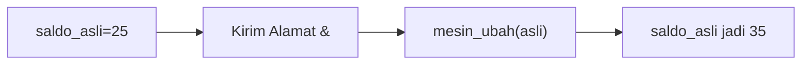
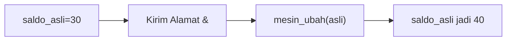
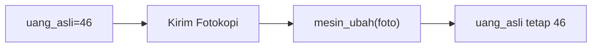
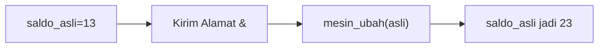
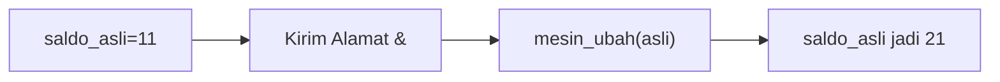
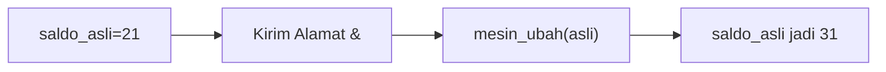
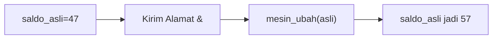
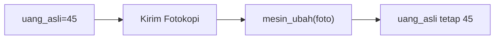
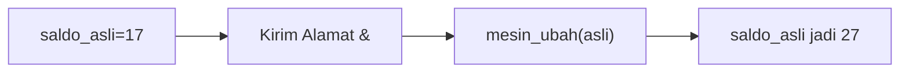
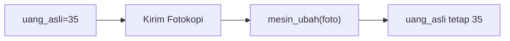

🔙 **[Kembali ke Daftar Soal](./README.md)**

---

# Latihan Soal Part C - Modul 04 - Set 02

### Soal 26
```cpp
void mesin_ajaib(int &a) { a = a + 10; }
// main: int saldo = 25; mesin_ajaib(saldo);
```
**Pertanyaan:**
1. Berapakah hasil akhirnya?
2. Deskripsikan langkah robot compiler saat memproses kode ini!

**Jawaban & Diagnosis:**
1. **35**
2. Baca bagian 'Analisis Mendalam' di bawah.

**Mermaid Flowchart:**


**📖 Penjelasan Komprehensif:**
**Analisis Mendalam (Compiler Manusia):**
1. **Pass-by-Reference**: Tanda `&` memberikan kunci akses langsung ke variabel `saldo`.
2. **Efek**: Apa pun yang dilakukan fungsi pada `a` langsung merubah isi fisik memori `saldo`.
3. **Hasil Akhir**: `saldo` bertambah jadi **35**.

---
### Soal 27
```cpp
void mesin_ajaib(int &a) { a = a + 10; }
// main: int saldo = 30; mesin_ajaib(saldo);
```
**Pertanyaan:**
1. Berapakah hasil akhirnya?
2. Deskripsikan langkah robot compiler saat memproses kode ini!

**Jawaban & Diagnosis:**
1. **40**
2. Baca bagian 'Analisis Mendalam' di bawah.

**Mermaid Flowchart:**


**📖 Penjelasan Komprehensif:**
**Analisis Mendalam (Compiler Manusia):**
1. **Pass-by-Reference**: Tanda `&` memberikan kunci akses langsung ke variabel `saldo`.
2. **Efek**: Apa pun yang dilakukan fungsi pada `a` langsung merubah isi fisik memori `saldo`.
3. **Hasil Akhir**: `saldo` bertambah jadi **40**.

---
### Soal 28
```cpp
void mesin_foto(int a) { a = a + 100; }
// main: int uang = 46; mesin_foto(uang);
```
**Pertanyaan:**
1. Berapakah hasil akhirnya?
2. Deskripsikan langkah robot compiler saat memproses kode ini!

**Jawaban & Diagnosis:**
1. **46**
2. Baca bagian 'Analisis Mendalam' di bawah.

**Mermaid Flowchart:**


**📖 Penjelasan Komprehensif:**
**Analisis Mendalam (Compiler Manusia):**
1. **Pass-by-Value**: Variabel `uang` hanya mengirim salinannya ke fungsi.
2. **Efek**: Fungsi mengacak-acak salinan tersebut (tambah 100), tapi tidak menyentuh dompet aslimu.
3. **Hasil Akhir**: Nilai `uang` di main tetap **46**.

---
### Soal 29
```cpp
void mesin_foto(int a) { a = a + 100; }
// main: int uang = 49; mesin_foto(uang);
```
**Pertanyaan:**
1. Berapakah hasil akhirnya?
2. Deskripsikan langkah robot compiler saat memproses kode ini!

**Jawaban & Diagnosis:**
1. **49**
2. Baca bagian 'Analisis Mendalam' di bawah.

**Mermaid Flowchart:**


**📖 Penjelasan Komprehensif:**
**Analisis Mendalam (Compiler Manusia):**
1. **Pass-by-Value**: Variabel `uang` hanya mengirim salinannya ke fungsi.
2. **Efek**: Fungsi mengacak-acak salinan tersebut (tambah 100), tapi tidak menyentuh dompet aslimu.
3. **Hasil Akhir**: Nilai `uang` di main tetap **49**.

---
### Soal 30
```cpp
void mesin_ajaib(int &a) { a = a + 10; }
// main: int saldo = 14; mesin_ajaib(saldo);
```
**Pertanyaan:**
1. Berapakah hasil akhirnya?
2. Deskripsikan langkah robot compiler saat memproses kode ini!

**Jawaban & Diagnosis:**
1. **24**
2. Baca bagian 'Analisis Mendalam' di bawah.

**Mermaid Flowchart:**


**📖 Penjelasan Komprehensif:**
**Analisis Mendalam (Compiler Manusia):**
1. **Pass-by-Reference**: Tanda `&` memberikan kunci akses langsung ke variabel `saldo`.
2. **Efek**: Apa pun yang dilakukan fungsi pada `a` langsung merubah isi fisik memori `saldo`.
3. **Hasil Akhir**: `saldo` bertambah jadi **24**.

---
### Soal 31
```cpp
void mesin_ajaib(int &a) { a = a + 10; }
// main: int saldo = 35; mesin_ajaib(saldo);
```
**Pertanyaan:**
1. Berapakah hasil akhirnya?
2. Deskripsikan langkah robot compiler saat memproses kode ini!

**Jawaban & Diagnosis:**
1. **45**
2. Baca bagian 'Analisis Mendalam' di bawah.

**Mermaid Flowchart:**


**📖 Penjelasan Komprehensif:**
**Analisis Mendalam (Compiler Manusia):**
1. **Pass-by-Reference**: Tanda `&` memberikan kunci akses langsung ke variabel `saldo`.
2. **Efek**: Apa pun yang dilakukan fungsi pada `a` langsung merubah isi fisik memori `saldo`.
3. **Hasil Akhir**: `saldo` bertambah jadi **45**.

---
### Soal 32
```cpp
void mesin_foto(int a) { a = a + 100; }
// main: int uang = 28; mesin_foto(uang);
```
**Pertanyaan:**
1. Berapakah hasil akhirnya?
2. Deskripsikan langkah robot compiler saat memproses kode ini!

**Jawaban & Diagnosis:**
1. **28**
2. Baca bagian 'Analisis Mendalam' di bawah.

**Mermaid Flowchart:**


**📖 Penjelasan Komprehensif:**
**Analisis Mendalam (Compiler Manusia):**
1. **Pass-by-Value**: Variabel `uang` hanya mengirim salinannya ke fungsi.
2. **Efek**: Fungsi mengacak-acak salinan tersebut (tambah 100), tapi tidak menyentuh dompet aslimu.
3. **Hasil Akhir**: Nilai `uang` di main tetap **28**.

---
### Soal 33
```cpp
void mesin_ajaib(int &a) { a = a + 10; }
// main: int saldo = 10; mesin_ajaib(saldo);
```
**Pertanyaan:**
1. Berapakah hasil akhirnya?
2. Deskripsikan langkah robot compiler saat memproses kode ini!

**Jawaban & Diagnosis:**
1. **20**
2. Baca bagian 'Analisis Mendalam' di bawah.

**Mermaid Flowchart:**


**📖 Penjelasan Komprehensif:**
**Analisis Mendalam (Compiler Manusia):**
1. **Pass-by-Reference**: Tanda `&` memberikan kunci akses langsung ke variabel `saldo`.
2. **Efek**: Apa pun yang dilakukan fungsi pada `a` langsung merubah isi fisik memori `saldo`.
3. **Hasil Akhir**: `saldo` bertambah jadi **20**.

---
### Soal 34
```cpp
void mesin_foto(int a) { a = a + 100; }
// main: int uang = 31; mesin_foto(uang);
```
**Pertanyaan:**
1. Berapakah hasil akhirnya?
2. Deskripsikan langkah robot compiler saat memproses kode ini!

**Jawaban & Diagnosis:**
1. **31**
2. Baca bagian 'Analisis Mendalam' di bawah.

**Mermaid Flowchart:**


**📖 Penjelasan Komprehensif:**
**Analisis Mendalam (Compiler Manusia):**
1. **Pass-by-Value**: Variabel `uang` hanya mengirim salinannya ke fungsi.
2. **Efek**: Fungsi mengacak-acak salinan tersebut (tambah 100), tapi tidak menyentuh dompet aslimu.
3. **Hasil Akhir**: Nilai `uang` di main tetap **31**.

---
### Soal 35
```cpp
void mesin_ajaib(int &a) { a = a + 10; }
// main: int saldo = 13; mesin_ajaib(saldo);
```
**Pertanyaan:**
1. Berapakah hasil akhirnya?
2. Deskripsikan langkah robot compiler saat memproses kode ini!

**Jawaban & Diagnosis:**
1. **23**
2. Baca bagian 'Analisis Mendalam' di bawah.

**Mermaid Flowchart:**


**📖 Penjelasan Komprehensif:**
**Analisis Mendalam (Compiler Manusia):**
1. **Pass-by-Reference**: Tanda `&` memberikan kunci akses langsung ke variabel `saldo`.
2. **Efek**: Apa pun yang dilakukan fungsi pada `a` langsung merubah isi fisik memori `saldo`.
3. **Hasil Akhir**: `saldo` bertambah jadi **23**.

---
### Soal 36
```cpp
void mesin_foto(int a) { a = a + 100; }
// main: int uang = 30; mesin_foto(uang);
```
**Pertanyaan:**
1. Berapakah hasil akhirnya?
2. Deskripsikan langkah robot compiler saat memproses kode ini!

**Jawaban & Diagnosis:**
1. **30**
2. Baca bagian 'Analisis Mendalam' di bawah.

**Mermaid Flowchart:**


**📖 Penjelasan Komprehensif:**
**Analisis Mendalam (Compiler Manusia):**
1. **Pass-by-Value**: Variabel `uang` hanya mengirim salinannya ke fungsi.
2. **Efek**: Fungsi mengacak-acak salinan tersebut (tambah 100), tapi tidak menyentuh dompet aslimu.
3. **Hasil Akhir**: Nilai `uang` di main tetap **30**.

---
### Soal 37
```cpp
void mesin_ajaib(int &a) { a = a + 10; }
// main: int saldo = 11; mesin_ajaib(saldo);
```
**Pertanyaan:**
1. Berapakah hasil akhirnya?
2. Deskripsikan langkah robot compiler saat memproses kode ini!

**Jawaban & Diagnosis:**
1. **21**
2. Baca bagian 'Analisis Mendalam' di bawah.

**Mermaid Flowchart:**


**📖 Penjelasan Komprehensif:**
**Analisis Mendalam (Compiler Manusia):**
1. **Pass-by-Reference**: Tanda `&` memberikan kunci akses langsung ke variabel `saldo`.
2. **Efek**: Apa pun yang dilakukan fungsi pada `a` langsung merubah isi fisik memori `saldo`.
3. **Hasil Akhir**: `saldo` bertambah jadi **21**.

---
### Soal 38
```cpp
void mesin_ajaib(int &a) { a = a + 10; }
// main: int saldo = 21; mesin_ajaib(saldo);
```
**Pertanyaan:**
1. Berapakah hasil akhirnya?
2. Deskripsikan langkah robot compiler saat memproses kode ini!

**Jawaban & Diagnosis:**
1. **31**
2. Baca bagian 'Analisis Mendalam' di bawah.

**Mermaid Flowchart:**


**📖 Penjelasan Komprehensif:**
**Analisis Mendalam (Compiler Manusia):**
1. **Pass-by-Reference**: Tanda `&` memberikan kunci akses langsung ke variabel `saldo`.
2. **Efek**: Apa pun yang dilakukan fungsi pada `a` langsung merubah isi fisik memori `saldo`.
3. **Hasil Akhir**: `saldo` bertambah jadi **31**.

---
### Soal 39
```cpp
void mesin_ajaib(int &a) { a = a + 10; }
// main: int saldo = 47; mesin_ajaib(saldo);
```
**Pertanyaan:**
1. Berapakah hasil akhirnya?
2. Deskripsikan langkah robot compiler saat memproses kode ini!

**Jawaban & Diagnosis:**
1. **57**
2. Baca bagian 'Analisis Mendalam' di bawah.

**Mermaid Flowchart:**


**📖 Penjelasan Komprehensif:**
**Analisis Mendalam (Compiler Manusia):**
1. **Pass-by-Reference**: Tanda `&` memberikan kunci akses langsung ke variabel `saldo`.
2. **Efek**: Apa pun yang dilakukan fungsi pada `a` langsung merubah isi fisik memori `saldo`.
3. **Hasil Akhir**: `saldo` bertambah jadi **57**.

---
### Soal 40
```cpp
void mesin_foto(int a) { a = a + 100; }
// main: int uang = 21; mesin_foto(uang);
```
**Pertanyaan:**
1. Berapakah hasil akhirnya?
2. Deskripsikan langkah robot compiler saat memproses kode ini!

**Jawaban & Diagnosis:**
1. **21**
2. Baca bagian 'Analisis Mendalam' di bawah.

**Mermaid Flowchart:**


**📖 Penjelasan Komprehensif:**
**Analisis Mendalam (Compiler Manusia):**
1. **Pass-by-Value**: Variabel `uang` hanya mengirim salinannya ke fungsi.
2. **Efek**: Fungsi mengacak-acak salinan tersebut (tambah 100), tapi tidak menyentuh dompet aslimu.
3. **Hasil Akhir**: Nilai `uang` di main tetap **21**.

---
### Soal 41
```cpp
void mesin_foto(int a) { a = a + 100; }
// main: int uang = 41; mesin_foto(uang);
```
**Pertanyaan:**
1. Berapakah hasil akhirnya?
2. Deskripsikan langkah robot compiler saat memproses kode ini!

**Jawaban & Diagnosis:**
1. **41**
2. Baca bagian 'Analisis Mendalam' di bawah.

**Mermaid Flowchart:**


**📖 Penjelasan Komprehensif:**
**Analisis Mendalam (Compiler Manusia):**
1. **Pass-by-Value**: Variabel `uang` hanya mengirim salinannya ke fungsi.
2. **Efek**: Fungsi mengacak-acak salinan tersebut (tambah 100), tapi tidak menyentuh dompet aslimu.
3. **Hasil Akhir**: Nilai `uang` di main tetap **41**.

---
### Soal 42
```cpp
void mesin_foto(int a) { a = a + 100; }
// main: int uang = 45; mesin_foto(uang);
```
**Pertanyaan:**
1. Berapakah hasil akhirnya?
2. Deskripsikan langkah robot compiler saat memproses kode ini!

**Jawaban & Diagnosis:**
1. **45**
2. Baca bagian 'Analisis Mendalam' di bawah.

**Mermaid Flowchart:**


**📖 Penjelasan Komprehensif:**
**Analisis Mendalam (Compiler Manusia):**
1. **Pass-by-Value**: Variabel `uang` hanya mengirim salinannya ke fungsi.
2. **Efek**: Fungsi mengacak-acak salinan tersebut (tambah 100), tapi tidak menyentuh dompet aslimu.
3. **Hasil Akhir**: Nilai `uang` di main tetap **45**.

---
### Soal 43
```cpp
void mesin_ajaib(int &a) { a = a + 10; }
// main: int saldo = 17; mesin_ajaib(saldo);
```
**Pertanyaan:**
1. Berapakah hasil akhirnya?
2. Deskripsikan langkah robot compiler saat memproses kode ini!

**Jawaban & Diagnosis:**
1. **27**
2. Baca bagian 'Analisis Mendalam' di bawah.

**Mermaid Flowchart:**


**📖 Penjelasan Komprehensif:**
**Analisis Mendalam (Compiler Manusia):**
1. **Pass-by-Reference**: Tanda `&` memberikan kunci akses langsung ke variabel `saldo`.
2. **Efek**: Apa pun yang dilakukan fungsi pada `a` langsung merubah isi fisik memori `saldo`.
3. **Hasil Akhir**: `saldo` bertambah jadi **27**.

---
### Soal 44
```cpp
void mesin_foto(int a) { a = a + 100; }
// main: int uang = 35; mesin_foto(uang);
```
**Pertanyaan:**
1. Berapakah hasil akhirnya?
2. Deskripsikan langkah robot compiler saat memproses kode ini!

**Jawaban & Diagnosis:**
1. **35**
2. Baca bagian 'Analisis Mendalam' di bawah.

**Mermaid Flowchart:**


**📖 Penjelasan Komprehensif:**
**Analisis Mendalam (Compiler Manusia):**
1. **Pass-by-Value**: Variabel `uang` hanya mengirim salinannya ke fungsi.
2. **Efek**: Fungsi mengacak-acak salinan tersebut (tambah 100), tapi tidak menyentuh dompet aslimu.
3. **Hasil Akhir**: Nilai `uang` di main tetap **35**.

---
### Soal 45
```cpp
void mesin_foto(int a) { a = a + 100; }
// main: int uang = 21; mesin_foto(uang);
```
**Pertanyaan:**
1. Berapakah hasil akhirnya?
2. Deskripsikan langkah robot compiler saat memproses kode ini!

**Jawaban & Diagnosis:**
1. **21**
2. Baca bagian 'Analisis Mendalam' di bawah.

**Mermaid Flowchart:**


**📖 Penjelasan Komprehensif:**
**Analisis Mendalam (Compiler Manusia):**
1. **Pass-by-Value**: Variabel `uang` hanya mengirim salinannya ke fungsi.
2. **Efek**: Fungsi mengacak-acak salinan tersebut (tambah 100), tapi tidak menyentuh dompet aslimu.
3. **Hasil Akhir**: Nilai `uang` di main tetap **21**.

---
### Soal 46
```cpp
void mesin_foto(int a) { a = a + 100; }
// main: int uang = 41; mesin_foto(uang);
```
**Pertanyaan:**
1. Berapakah hasil akhirnya?
2. Deskripsikan langkah robot compiler saat memproses kode ini!

**Jawaban & Diagnosis:**
1. **41**
2. Baca bagian 'Analisis Mendalam' di bawah.

**Mermaid Flowchart:**
```mermaid
graph LR
A["uang_asli=41"] --> B["Kirim Fotokopi"]
B --> C["mesin_ubah(foto)"]
C --> D["uang_asli tetap 41"]
```

**📖 Penjelasan Komprehensif:**
**Analisis Mendalam (Compiler Manusia):**
1. **Pass-by-Value**: Variabel `uang` hanya mengirim salinannya ke fungsi.
2. **Efek**: Fungsi mengacak-acak salinan tersebut (tambah 100), tapi tidak menyentuh dompet aslimu.
3. **Hasil Akhir**: Nilai `uang` di main tetap **41**.

---
### Soal 47
```cpp
void mesin_ajaib(int &a) { a = a + 10; }
// main: int saldo = 19; mesin_ajaib(saldo);
```
**Pertanyaan:**
1. Berapakah hasil akhirnya?
2. Deskripsikan langkah robot compiler saat memproses kode ini!

**Jawaban & Diagnosis:**
1. **29**
2. Baca bagian 'Analisis Mendalam' di bawah.

**Mermaid Flowchart:**
```mermaid
graph LR
A["saldo_asli=19"] --> B["Kirim Alamat &"]
B --> C["mesin_ubah(asli)"]
C --> D["saldo_asli jadi 29"]
```

**📖 Penjelasan Komprehensif:**
**Analisis Mendalam (Compiler Manusia):**
1. **Pass-by-Reference**: Tanda `&` memberikan kunci akses langsung ke variabel `saldo`.
2. **Efek**: Apa pun yang dilakukan fungsi pada `a` langsung merubah isi fisik memori `saldo`.
3. **Hasil Akhir**: `saldo` bertambah jadi **29**.

---
### Soal 48
```cpp
void mesin_ajaib(int &a) { a = a + 10; }
// main: int saldo = 43; mesin_ajaib(saldo);
```
**Pertanyaan:**
1. Berapakah hasil akhirnya?
2. Deskripsikan langkah robot compiler saat memproses kode ini!

**Jawaban & Diagnosis:**
1. **53**
2. Baca bagian 'Analisis Mendalam' di bawah.

**Mermaid Flowchart:**
```mermaid
graph LR
A["saldo_asli=43"] --> B["Kirim Alamat &"]
B --> C["mesin_ubah(asli)"]
C --> D["saldo_asli jadi 53"]
```

**📖 Penjelasan Komprehensif:**
**Analisis Mendalam (Compiler Manusia):**
1. **Pass-by-Reference**: Tanda `&` memberikan kunci akses langsung ke variabel `saldo`.
2. **Efek**: Apa pun yang dilakukan fungsi pada `a` langsung merubah isi fisik memori `saldo`.
3. **Hasil Akhir**: `saldo` bertambah jadi **53**.

---
### Soal 49
```cpp
void mesin_ajaib(int &a) { a = a + 10; }
// main: int saldo = 43; mesin_ajaib(saldo);
```
**Pertanyaan:**
1. Berapakah hasil akhirnya?
2. Deskripsikan langkah robot compiler saat memproses kode ini!

**Jawaban & Diagnosis:**
1. **53**
2. Baca bagian 'Analisis Mendalam' di bawah.

**Mermaid Flowchart:**
```mermaid
graph LR
A["saldo_asli=43"] --> B["Kirim Alamat &"]
B --> C["mesin_ubah(asli)"]
C --> D["saldo_asli jadi 53"]
```

**📖 Penjelasan Komprehensif:**
**Analisis Mendalam (Compiler Manusia):**
1. **Pass-by-Reference**: Tanda `&` memberikan kunci akses langsung ke variabel `saldo`.
2. **Efek**: Apa pun yang dilakukan fungsi pada `a` langsung merubah isi fisik memori `saldo`.
3. **Hasil Akhir**: `saldo` bertambah jadi **53**.

---
### Soal 50
```cpp
void mesin_ajaib(int &a) { a = a + 10; }
// main: int saldo = 43; mesin_ajaib(saldo);
```
**Pertanyaan:**
1. Berapakah hasil akhirnya?
2. Deskripsikan langkah robot compiler saat memproses kode ini!

**Jawaban & Diagnosis:**
1. **53**
2. Baca bagian 'Analisis Mendalam' di bawah.

**Mermaid Flowchart:**
```mermaid
graph LR
A["saldo_asli=43"] --> B["Kirim Alamat &"]
B --> C["mesin_ubah(asli)"]
C --> D["saldo_asli jadi 53"]
```

**📖 Penjelasan Komprehensif:**
**Analisis Mendalam (Compiler Manusia):**
1. **Pass-by-Reference**: Tanda `&` memberikan kunci akses langsung ke variabel `saldo`.
2. **Efek**: Apa pun yang dilakukan fungsi pada `a` langsung merubah isi fisik memori `saldo`.
3. **Hasil Akhir**: `saldo` bertambah jadi **53**.

---
