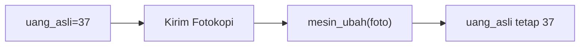
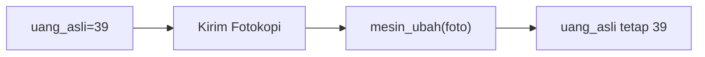
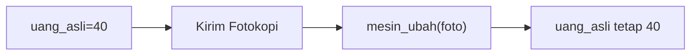
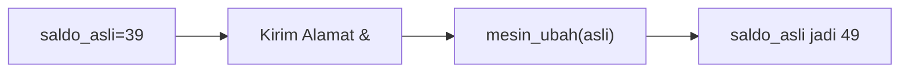
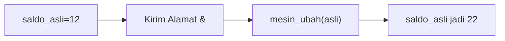
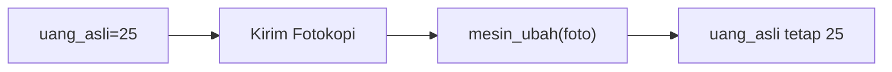
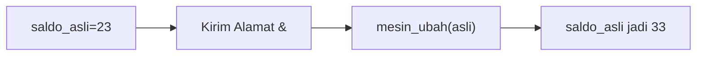
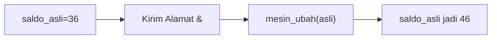

🔙 **[Kembali ke Daftar Soal](./README.md)**

---

# Latihan Soal Part C - Modul 04 - Set 03

### Soal 51
```cpp
void mesin_ajaib(int &a) { a = a + 10; }
// main: int saldo = 37; mesin_ajaib(saldo);
```
**Pertanyaan:**
1. Berapakah hasil akhirnya?
2. Deskripsikan langkah robot compiler saat memproses kode ini!

**Jawaban & Diagnosis:**
1. **47**
2. Baca bagian 'Analisis Mendalam' di bawah.

**Mermaid Flowchart:**


**📖 Penjelasan Komprehensif:**
**Analisis Mendalam (Compiler Manusia):**
1. **Pass-by-Reference**: Tanda `&` memberikan kunci akses langsung ke variabel `saldo`.
2. **Efek**: Apa pun yang dilakukan fungsi pada `a` langsung merubah isi fisik memori `saldo`.
3. **Hasil Akhir**: `saldo` bertambah jadi **47**.

---
### Soal 52
```cpp
void mesin_foto(int a) { a = a + 100; }
// main: int uang = 37; mesin_foto(uang);
```
**Pertanyaan:**
1. Berapakah hasil akhirnya?
2. Deskripsikan langkah robot compiler saat memproses kode ini!

**Jawaban & Diagnosis:**
1. **37**
2. Baca bagian 'Analisis Mendalam' di bawah.

**Mermaid Flowchart:**


**📖 Penjelasan Komprehensif:**
**Analisis Mendalam (Compiler Manusia):**
1. **Pass-by-Value**: Variabel `uang` hanya mengirim salinannya ke fungsi.
2. **Efek**: Fungsi mengacak-acak salinan tersebut (tambah 100), tapi tidak menyentuh dompet aslimu.
3. **Hasil Akhir**: Nilai `uang` di main tetap **37**.

---
### Soal 53
```cpp
void mesin_foto(int a) { a = a + 100; }
// main: int uang = 16; mesin_foto(uang);
```
**Pertanyaan:**
1. Berapakah hasil akhirnya?
2. Deskripsikan langkah robot compiler saat memproses kode ini!

**Jawaban & Diagnosis:**
1. **16**
2. Baca bagian 'Analisis Mendalam' di bawah.

**Mermaid Flowchart:**


**📖 Penjelasan Komprehensif:**
**Analisis Mendalam (Compiler Manusia):**
1. **Pass-by-Value**: Variabel `uang` hanya mengirim salinannya ke fungsi.
2. **Efek**: Fungsi mengacak-acak salinan tersebut (tambah 100), tapi tidak menyentuh dompet aslimu.
3. **Hasil Akhir**: Nilai `uang` di main tetap **16**.

---
### Soal 54
```cpp
void mesin_foto(int a) { a = a + 100; }
// main: int uang = 39; mesin_foto(uang);
```
**Pertanyaan:**
1. Berapakah hasil akhirnya?
2. Deskripsikan langkah robot compiler saat memproses kode ini!

**Jawaban & Diagnosis:**
1. **39**
2. Baca bagian 'Analisis Mendalam' di bawah.

**Mermaid Flowchart:**


**📖 Penjelasan Komprehensif:**
**Analisis Mendalam (Compiler Manusia):**
1. **Pass-by-Value**: Variabel `uang` hanya mengirim salinannya ke fungsi.
2. **Efek**: Fungsi mengacak-acak salinan tersebut (tambah 100), tapi tidak menyentuh dompet aslimu.
3. **Hasil Akhir**: Nilai `uang` di main tetap **39**.

---
### Soal 55
```cpp
void mesin_foto(int a) { a = a + 100; }
// main: int uang = 24; mesin_foto(uang);
```
**Pertanyaan:**
1. Berapakah hasil akhirnya?
2. Deskripsikan langkah robot compiler saat memproses kode ini!

**Jawaban & Diagnosis:**
1. **24**
2. Baca bagian 'Analisis Mendalam' di bawah.

**Mermaid Flowchart:**


**📖 Penjelasan Komprehensif:**
**Analisis Mendalam (Compiler Manusia):**
1. **Pass-by-Value**: Variabel `uang` hanya mengirim salinannya ke fungsi.
2. **Efek**: Fungsi mengacak-acak salinan tersebut (tambah 100), tapi tidak menyentuh dompet aslimu.
3. **Hasil Akhir**: Nilai `uang` di main tetap **24**.

---
### Soal 56
```cpp
void mesin_ajaib(int &a) { a = a + 10; }
// main: int saldo = 32; mesin_ajaib(saldo);
```
**Pertanyaan:**
1. Berapakah hasil akhirnya?
2. Deskripsikan langkah robot compiler saat memproses kode ini!

**Jawaban & Diagnosis:**
1. **42**
2. Baca bagian 'Analisis Mendalam' di bawah.

**Mermaid Flowchart:**


**📖 Penjelasan Komprehensif:**
**Analisis Mendalam (Compiler Manusia):**
1. **Pass-by-Reference**: Tanda `&` memberikan kunci akses langsung ke variabel `saldo`.
2. **Efek**: Apa pun yang dilakukan fungsi pada `a` langsung merubah isi fisik memori `saldo`.
3. **Hasil Akhir**: `saldo` bertambah jadi **42**.

---
### Soal 57
```cpp
void mesin_foto(int a) { a = a + 100; }
// main: int uang = 40; mesin_foto(uang);
```
**Pertanyaan:**
1. Berapakah hasil akhirnya?
2. Deskripsikan langkah robot compiler saat memproses kode ini!

**Jawaban & Diagnosis:**
1. **40**
2. Baca bagian 'Analisis Mendalam' di bawah.

**Mermaid Flowchart:**


**📖 Penjelasan Komprehensif:**
**Analisis Mendalam (Compiler Manusia):**
1. **Pass-by-Value**: Variabel `uang` hanya mengirim salinannya ke fungsi.
2. **Efek**: Fungsi mengacak-acak salinan tersebut (tambah 100), tapi tidak menyentuh dompet aslimu.
3. **Hasil Akhir**: Nilai `uang` di main tetap **40**.

---
### Soal 58
```cpp
void mesin_foto(int a) { a = a + 100; }
// main: int uang = 28; mesin_foto(uang);
```
**Pertanyaan:**
1. Berapakah hasil akhirnya?
2. Deskripsikan langkah robot compiler saat memproses kode ini!

**Jawaban & Diagnosis:**
1. **28**
2. Baca bagian 'Analisis Mendalam' di bawah.

**Mermaid Flowchart:**


**📖 Penjelasan Komprehensif:**
**Analisis Mendalam (Compiler Manusia):**
1. **Pass-by-Value**: Variabel `uang` hanya mengirim salinannya ke fungsi.
2. **Efek**: Fungsi mengacak-acak salinan tersebut (tambah 100), tapi tidak menyentuh dompet aslimu.
3. **Hasil Akhir**: Nilai `uang` di main tetap **28**.

---
### Soal 59
```cpp
void mesin_ajaib(int &a) { a = a + 10; }
// main: int saldo = 43; mesin_ajaib(saldo);
```
**Pertanyaan:**
1. Berapakah hasil akhirnya?
2. Deskripsikan langkah robot compiler saat memproses kode ini!

**Jawaban & Diagnosis:**
1. **53**
2. Baca bagian 'Analisis Mendalam' di bawah.

**Mermaid Flowchart:**


**📖 Penjelasan Komprehensif:**
**Analisis Mendalam (Compiler Manusia):**
1. **Pass-by-Reference**: Tanda `&` memberikan kunci akses langsung ke variabel `saldo`.
2. **Efek**: Apa pun yang dilakukan fungsi pada `a` langsung merubah isi fisik memori `saldo`.
3. **Hasil Akhir**: `saldo` bertambah jadi **53**.

---
### Soal 60
```cpp
void mesin_ajaib(int &a) { a = a + 10; }
// main: int saldo = 39; mesin_ajaib(saldo);
```
**Pertanyaan:**
1. Berapakah hasil akhirnya?
2. Deskripsikan langkah robot compiler saat memproses kode ini!

**Jawaban & Diagnosis:**
1. **49**
2. Baca bagian 'Analisis Mendalam' di bawah.

**Mermaid Flowchart:**


**📖 Penjelasan Komprehensif:**
**Analisis Mendalam (Compiler Manusia):**
1. **Pass-by-Reference**: Tanda `&` memberikan kunci akses langsung ke variabel `saldo`.
2. **Efek**: Apa pun yang dilakukan fungsi pada `a` langsung merubah isi fisik memori `saldo`.
3. **Hasil Akhir**: `saldo` bertambah jadi **49**.

---
### Soal 61
```cpp
void mesin_ajaib(int &a) { a = a + 10; }
// main: int saldo = 12; mesin_ajaib(saldo);
```
**Pertanyaan:**
1. Berapakah hasil akhirnya?
2. Deskripsikan langkah robot compiler saat memproses kode ini!

**Jawaban & Diagnosis:**
1. **22**
2. Baca bagian 'Analisis Mendalam' di bawah.

**Mermaid Flowchart:**


**📖 Penjelasan Komprehensif:**
**Analisis Mendalam (Compiler Manusia):**
1. **Pass-by-Reference**: Tanda `&` memberikan kunci akses langsung ke variabel `saldo`.
2. **Efek**: Apa pun yang dilakukan fungsi pada `a` langsung merubah isi fisik memori `saldo`.
3. **Hasil Akhir**: `saldo` bertambah jadi **22**.

---
### Soal 62
```cpp
void mesin_foto(int a) { a = a + 100; }
// main: int uang = 25; mesin_foto(uang);
```
**Pertanyaan:**
1. Berapakah hasil akhirnya?
2. Deskripsikan langkah robot compiler saat memproses kode ini!

**Jawaban & Diagnosis:**
1. **25**
2. Baca bagian 'Analisis Mendalam' di bawah.

**Mermaid Flowchart:**


**📖 Penjelasan Komprehensif:**
**Analisis Mendalam (Compiler Manusia):**
1. **Pass-by-Value**: Variabel `uang` hanya mengirim salinannya ke fungsi.
2. **Efek**: Fungsi mengacak-acak salinan tersebut (tambah 100), tapi tidak menyentuh dompet aslimu.
3. **Hasil Akhir**: Nilai `uang` di main tetap **25**.

---
### Soal 63
```cpp
void mesin_foto(int a) { a = a + 100; }
// main: int uang = 35; mesin_foto(uang);
```
**Pertanyaan:**
1. Berapakah hasil akhirnya?
2. Deskripsikan langkah robot compiler saat memproses kode ini!

**Jawaban & Diagnosis:**
1. **35**
2. Baca bagian 'Analisis Mendalam' di bawah.

**Mermaid Flowchart:**


**📖 Penjelasan Komprehensif:**
**Analisis Mendalam (Compiler Manusia):**
1. **Pass-by-Value**: Variabel `uang` hanya mengirim salinannya ke fungsi.
2. **Efek**: Fungsi mengacak-acak salinan tersebut (tambah 100), tapi tidak menyentuh dompet aslimu.
3. **Hasil Akhir**: Nilai `uang` di main tetap **35**.

---
### Soal 64
```cpp
void mesin_foto(int a) { a = a + 100; }
// main: int uang = 50; mesin_foto(uang);
```
**Pertanyaan:**
1. Berapakah hasil akhirnya?
2. Deskripsikan langkah robot compiler saat memproses kode ini!

**Jawaban & Diagnosis:**
1. **50**
2. Baca bagian 'Analisis Mendalam' di bawah.

**Mermaid Flowchart:**


**📖 Penjelasan Komprehensif:**
**Analisis Mendalam (Compiler Manusia):**
1. **Pass-by-Value**: Variabel `uang` hanya mengirim salinannya ke fungsi.
2. **Efek**: Fungsi mengacak-acak salinan tersebut (tambah 100), tapi tidak menyentuh dompet aslimu.
3. **Hasil Akhir**: Nilai `uang` di main tetap **50**.

---
### Soal 65
```cpp
void mesin_foto(int a) { a = a + 100; }
// main: int uang = 34; mesin_foto(uang);
```
**Pertanyaan:**
1. Berapakah hasil akhirnya?
2. Deskripsikan langkah robot compiler saat memproses kode ini!

**Jawaban & Diagnosis:**
1. **34**
2. Baca bagian 'Analisis Mendalam' di bawah.

**Mermaid Flowchart:**


**📖 Penjelasan Komprehensif:**
**Analisis Mendalam (Compiler Manusia):**
1. **Pass-by-Value**: Variabel `uang` hanya mengirim salinannya ke fungsi.
2. **Efek**: Fungsi mengacak-acak salinan tersebut (tambah 100), tapi tidak menyentuh dompet aslimu.
3. **Hasil Akhir**: Nilai `uang` di main tetap **34**.

---
### Soal 66
```cpp
void mesin_ajaib(int &a) { a = a + 10; }
// main: int saldo = 23; mesin_ajaib(saldo);
```
**Pertanyaan:**
1. Berapakah hasil akhirnya?
2. Deskripsikan langkah robot compiler saat memproses kode ini!

**Jawaban & Diagnosis:**
1. **33**
2. Baca bagian 'Analisis Mendalam' di bawah.

**Mermaid Flowchart:**


**📖 Penjelasan Komprehensif:**
**Analisis Mendalam (Compiler Manusia):**
1. **Pass-by-Reference**: Tanda `&` memberikan kunci akses langsung ke variabel `saldo`.
2. **Efek**: Apa pun yang dilakukan fungsi pada `a` langsung merubah isi fisik memori `saldo`.
3. **Hasil Akhir**: `saldo` bertambah jadi **33**.

---
### Soal 67
```cpp
void mesin_ajaib(int &a) { a = a + 10; }
// main: int saldo = 36; mesin_ajaib(saldo);
```
**Pertanyaan:**
1. Berapakah hasil akhirnya?
2. Deskripsikan langkah robot compiler saat memproses kode ini!

**Jawaban & Diagnosis:**
1. **46**
2. Baca bagian 'Analisis Mendalam' di bawah.

**Mermaid Flowchart:**


**📖 Penjelasan Komprehensif:**
**Analisis Mendalam (Compiler Manusia):**
1. **Pass-by-Reference**: Tanda `&` memberikan kunci akses langsung ke variabel `saldo`.
2. **Efek**: Apa pun yang dilakukan fungsi pada `a` langsung merubah isi fisik memori `saldo`.
3. **Hasil Akhir**: `saldo` bertambah jadi **46**.

---
### Soal 68
```cpp
void mesin_foto(int a) { a = a + 100; }
// main: int uang = 50; mesin_foto(uang);
```
**Pertanyaan:**
1. Berapakah hasil akhirnya?
2. Deskripsikan langkah robot compiler saat memproses kode ini!

**Jawaban & Diagnosis:**
1. **50**
2. Baca bagian 'Analisis Mendalam' di bawah.

**Mermaid Flowchart:**


**📖 Penjelasan Komprehensif:**
**Analisis Mendalam (Compiler Manusia):**
1. **Pass-by-Value**: Variabel `uang` hanya mengirim salinannya ke fungsi.
2. **Efek**: Fungsi mengacak-acak salinan tersebut (tambah 100), tapi tidak menyentuh dompet aslimu.
3. **Hasil Akhir**: Nilai `uang` di main tetap **50**.

---
### Soal 69
```cpp
void mesin_foto(int a) { a = a + 100; }
// main: int uang = 45; mesin_foto(uang);
```
**Pertanyaan:**
1. Berapakah hasil akhirnya?
2. Deskripsikan langkah robot compiler saat memproses kode ini!

**Jawaban & Diagnosis:**
1. **45**
2. Baca bagian 'Analisis Mendalam' di bawah.

**Mermaid Flowchart:**


**📖 Penjelasan Komprehensif:**
**Analisis Mendalam (Compiler Manusia):**
1. **Pass-by-Value**: Variabel `uang` hanya mengirim salinannya ke fungsi.
2. **Efek**: Fungsi mengacak-acak salinan tersebut (tambah 100), tapi tidak menyentuh dompet aslimu.
3. **Hasil Akhir**: Nilai `uang` di main tetap **45**.

---
### Soal 70
```cpp
void mesin_foto(int a) { a = a + 100; }
// main: int uang = 40; mesin_foto(uang);
```
**Pertanyaan:**
1. Berapakah hasil akhirnya?
2. Deskripsikan langkah robot compiler saat memproses kode ini!

**Jawaban & Diagnosis:**
1. **40**
2. Baca bagian 'Analisis Mendalam' di bawah.

**Mermaid Flowchart:**


**📖 Penjelasan Komprehensif:**
**Analisis Mendalam (Compiler Manusia):**
1. **Pass-by-Value**: Variabel `uang` hanya mengirim salinannya ke fungsi.
2. **Efek**: Fungsi mengacak-acak salinan tersebut (tambah 100), tapi tidak menyentuh dompet aslimu.
3. **Hasil Akhir**: Nilai `uang` di main tetap **40**.

---
### Soal 71
```cpp
void mesin_foto(int a) { a = a + 100; }
// main: int uang = 19; mesin_foto(uang);
```
**Pertanyaan:**
1. Berapakah hasil akhirnya?
2. Deskripsikan langkah robot compiler saat memproses kode ini!

**Jawaban & Diagnosis:**
1. **19**
2. Baca bagian 'Analisis Mendalam' di bawah.

**Mermaid Flowchart:**
```mermaid
graph LR
A["uang_asli=19"] --> B["Kirim Fotokopi"]
B --> C["mesin_ubah(foto)"]
C --> D["uang_asli tetap 19"]
```

**📖 Penjelasan Komprehensif:**
**Analisis Mendalam (Compiler Manusia):**
1. **Pass-by-Value**: Variabel `uang` hanya mengirim salinannya ke fungsi.
2. **Efek**: Fungsi mengacak-acak salinan tersebut (tambah 100), tapi tidak menyentuh dompet aslimu.
3. **Hasil Akhir**: Nilai `uang` di main tetap **19**.

---
### Soal 72
```cpp
void mesin_foto(int a) { a = a + 100; }
// main: int uang = 17; mesin_foto(uang);
```
**Pertanyaan:**
1. Berapakah hasil akhirnya?
2. Deskripsikan langkah robot compiler saat memproses kode ini!

**Jawaban & Diagnosis:**
1. **17**
2. Baca bagian 'Analisis Mendalam' di bawah.

**Mermaid Flowchart:**
```mermaid
graph LR
A["uang_asli=17"] --> B["Kirim Fotokopi"]
B --> C["mesin_ubah(foto)"]
C --> D["uang_asli tetap 17"]
```

**📖 Penjelasan Komprehensif:**
**Analisis Mendalam (Compiler Manusia):**
1. **Pass-by-Value**: Variabel `uang` hanya mengirim salinannya ke fungsi.
2. **Efek**: Fungsi mengacak-acak salinan tersebut (tambah 100), tapi tidak menyentuh dompet aslimu.
3. **Hasil Akhir**: Nilai `uang` di main tetap **17**.

---
### Soal 73
```cpp
void mesin_ajaib(int &a) { a = a + 10; }
// main: int saldo = 18; mesin_ajaib(saldo);
```
**Pertanyaan:**
1. Berapakah hasil akhirnya?
2. Deskripsikan langkah robot compiler saat memproses kode ini!

**Jawaban & Diagnosis:**
1. **28**
2. Baca bagian 'Analisis Mendalam' di bawah.

**Mermaid Flowchart:**
```mermaid
graph LR
A["saldo_asli=18"] --> B["Kirim Alamat &"]
B --> C["mesin_ubah(asli)"]
C --> D["saldo_asli jadi 28"]
```

**📖 Penjelasan Komprehensif:**
**Analisis Mendalam (Compiler Manusia):**
1. **Pass-by-Reference**: Tanda `&` memberikan kunci akses langsung ke variabel `saldo`.
2. **Efek**: Apa pun yang dilakukan fungsi pada `a` langsung merubah isi fisik memori `saldo`.
3. **Hasil Akhir**: `saldo` bertambah jadi **28**.

---
### Soal 74
```cpp
void mesin_ajaib(int &a) { a = a + 10; }
// main: int saldo = 50; mesin_ajaib(saldo);
```
**Pertanyaan:**
1. Berapakah hasil akhirnya?
2. Deskripsikan langkah robot compiler saat memproses kode ini!

**Jawaban & Diagnosis:**
1. **60**
2. Baca bagian 'Analisis Mendalam' di bawah.

**Mermaid Flowchart:**
```mermaid
graph LR
A["saldo_asli=50"] --> B["Kirim Alamat &"]
B --> C["mesin_ubah(asli)"]
C --> D["saldo_asli jadi 60"]
```

**📖 Penjelasan Komprehensif:**
**Analisis Mendalam (Compiler Manusia):**
1. **Pass-by-Reference**: Tanda `&` memberikan kunci akses langsung ke variabel `saldo`.
2. **Efek**: Apa pun yang dilakukan fungsi pada `a` langsung merubah isi fisik memori `saldo`.
3. **Hasil Akhir**: `saldo` bertambah jadi **60**.

---
### Soal 75
```cpp
void mesin_ajaib(int &a) { a = a + 10; }
// main: int saldo = 49; mesin_ajaib(saldo);
```
**Pertanyaan:**
1. Berapakah hasil akhirnya?
2. Deskripsikan langkah robot compiler saat memproses kode ini!

**Jawaban & Diagnosis:**
1. **59**
2. Baca bagian 'Analisis Mendalam' di bawah.

**Mermaid Flowchart:**
```mermaid
graph LR
A["saldo_asli=49"] --> B["Kirim Alamat &"]
B --> C["mesin_ubah(asli)"]
C --> D["saldo_asli jadi 59"]
```

**📖 Penjelasan Komprehensif:**
**Analisis Mendalam (Compiler Manusia):**
1. **Pass-by-Reference**: Tanda `&` memberikan kunci akses langsung ke variabel `saldo`.
2. **Efek**: Apa pun yang dilakukan fungsi pada `a` langsung merubah isi fisik memori `saldo`.
3. **Hasil Akhir**: `saldo` bertambah jadi **59**.

---
