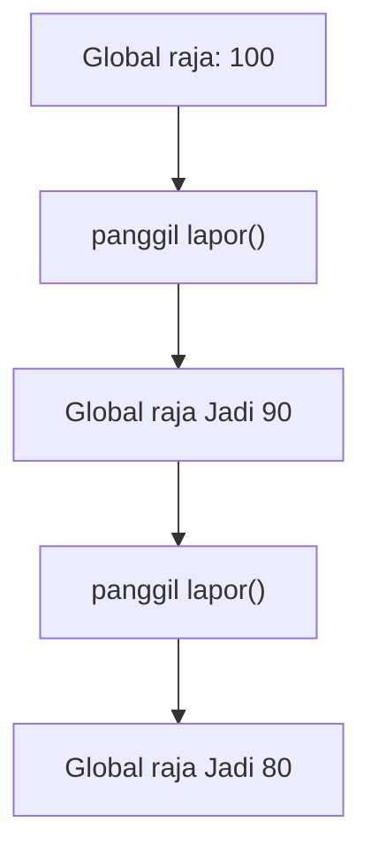
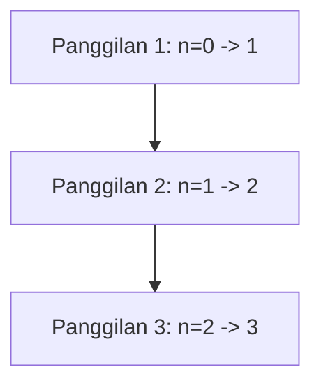
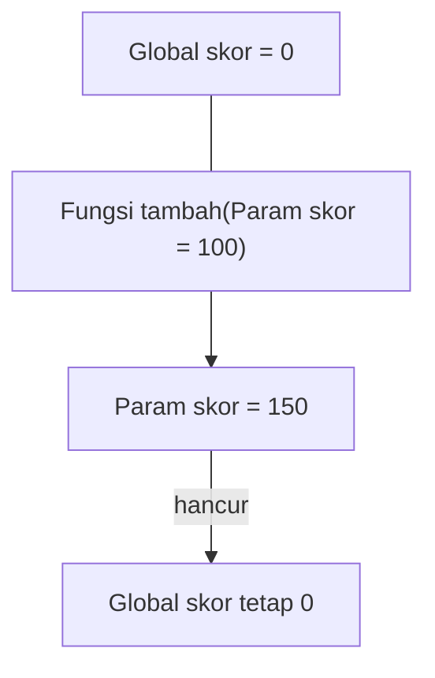
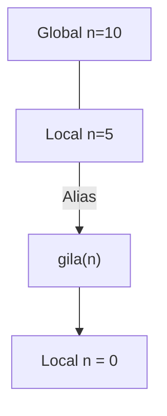

		🔙 **[Kembali ke Daftar Soal](./README.md)**

---

# Latihan Soal Part C - Modul 04 - Set 03 (Premium Edition)

---

### Soal 21: Raja Global (Global Access)
```cpp
int raja = 100;

void lapor() {
    raja -= 10;
}

int main() {
    lapor();
    lapor();
}
```
**Pertanyaan:**
1. Berapakah nilai `raja` di akhir program?
2. Mengapa fungsi `lapor()` bisa merubah nilai `raja` padahal tidak ada parameter yang dikirim?

<details>
<summary><b>Klik untuk Lihat Jawaban & Diagnosis</b></summary>

**Mermaid Flowchart:**


**Jawaban:**
1. **80**
2. Karena `raja` didefinisikan secara **Global** (di luar semua fungsi), sehingga bisa diakses dan dimodifikasi oleh fungsi manapun di dalam file tersebut.
</details>

---

### Soal 22: Bayangan Lokal (Shadowing Trap)
```cpp
int x = 10;

void ganti() {
    int x = 50;
    x += 10;
}

int main() {
    ganti();
    // Berapa x global?
}
```
**Pertanyaan:**
1. Berapakah nilai `x` global setelah `ganti()` dipanggil?
2. Mengapa perubahan di dalam fungsi tidak berefek ke luar?

<details>
<summary><b>Klik untuk Lihat Jawaban & Diagnosis</b></summary>

**Mermaid Flowchart:**


**Jawaban:**
1. **10**
2. Karena di dalam fungsi ada deklarasi baru `int x = 50`. Variable lokal ini "menutupi" (shadow) variabel global dengan nama yang sama.
</details>

---

### Soal 23: Si Pengingat (Static Variable)
```cpp
void hitung() {
    static int n = 0;
    n++;
}

int main() {
    hitung();
    hitung();
    hitung();
}
```
**Pertanyaan:**
1. Berapakah nilai `n` tepat setelah `hitung()` ketiga dijalankan? (Bayangkan kamu berada di dalam fungsi).
2. Apa guna kata kunci `static` di situ?

<details>
<summary><b>Klik untuk Lihat Jawaban & Diagnosis</b></summary>

**Mermaid Flowchart:**


**Jawaban:**
1. **3**
2. **Lifetime.** Kata kunci `static` membuat variabel tidak dihancurkan saat fungsi selesai. Ia tetap menyimpan nilainya di memori sampai program berakhir.

**📖 Analisis Mendalam:**
Tanpa `static`, hasil `n` akan selalu menjadi 1 di setiap akhir panggilan fungsi karena ia akan selalu dibuat ulang dari nol.
</details>

---

### Soal 24: Parameter Lokal (Scope Boundary)
```cpp
void fungsi(int a) {
    a *= 2;
}

int main() {
    int a = 5;
    fungsi(a);
    // a di main?
}
```
**Pertanyaan:**
1. Berapakah nilai `a` di dalam `main`?
2. Apakah variabel `a` di dalam fungsi sama dengan `a` di `main`?

<details>
<summary><b>Klik untuk Lihat Jawaban & Diagnosis</b></summary>

**Jawaban:**
1. **5**
2. **Berbeda.** Meskipun namanya sama, mereka berada di alamat memori yang berbeda (Local Scope). Hanya nilainya saja yang disalin saat pemanggilan.
</details>

---

### Soal 25: Tabrakan Global-Local (Mixed Trace)
```cpp
int skor = 0;

void tambah(int skor) {
    skor += 50;
}

int main() {
    tambah(100);
}
```
**Pertanyaan:**
1. Berapakah nilai variabel `skor` global di akhir program?
2. Mengapa fungsi `tambah(100)` seolah-olah tidak melakukan apa-apa?

<details>
<summary><b>Klik untuk Lihat Jawaban & Diagnosis</b></summary>

**Mermaid Flowchart:**


**Jawaban:**
1. **0**
2. Karena ada **parameter** bernama `skor`. Di dalam batin C++, parameter fungsi dianggap sebagai variabel lokal yang diprioritaskan di atas variabel global.
</details>

---

### Soal 26: Akmulator Rahasia (Static Global?)
```cpp
int counter = 0;

int proses() {
    static int x = 0;
    counter++;
    x += 5;
    return x;
}

int main() {
    proses();
    int hasil = proses();
}
```
**Pertanyaan:**
1. Berapakah nilai `counter`?
2. Berapakah nilai `hasil`?

<details>
<summary><b>Klik untuk Lihat Jawaban & Diagnosis</b></summary>

**Mermaid Flowchart:**


**Jawaban:**
1. **2**
2. **10**
</details>

---

### Soal 27: Luar dan Dalam (Nested Scope)
```cpp
int gas = 10;

void bakar() {
    gas -= 2;
}

int main() {
    int gas = 100;
    bakar();
}
```
**Pertanyaan:**
1. Berapakah nilai `gas` di dalam `main`?
2. Berapakah nilai `gas` global?

<details>
<summary><b>Klik untuk Lihat Jawaban & Diagnosis</b></summary>

**Jawaban:**
1. **100**
2. **8** (10 - 2)

**📖 Analisis Mendalam:**
Fungsi `bakar()` akan mencari `gas` terdekat. Karena ia tidak punya variabel lokal bernama `gas`, ia akan merubah `gas` global. Namun, `main` memiliki `gas` lokal sendiri, sehingga ia tidak menyadari perubahan pada `gas` global.
</details>

---

### Soal 28: Increment Static vs Global
```cpp
int a = 0;

void f() {
    static int s = 0;
    a++;
    s++;
}

int main() {
    f();
    f();
}
```
**Pertanyaan:**
1. Berapakah nilai `a`?
2. Berapakah nilai `s` jika diakses (secara teoritis) di akhir?
3. Apa perbedaan batin antara `a` dan `s`?

<details>
<summary><b>Klik untuk Lihat Jawaban & Diagnosis</b></summary>

**Jawaban:**
1. **2**
2. **2**
3. **Visibilitas.** `a` adalah global (siapapun bisa melihat). `s` adalah static lokal yang ingat nilai tapi **hanya fungsi `f`** yang boleh melihat/merubahnya.
</details>

---

### Soal 29: Inisialisasi Static (The First Time)
```cpp
int hitung() {
    static int n = 10;
    n += 5;
    return n;
}

int main() {
    int x = hitung();
    int y = hitung();
}
```
**Pertanyaan:**
1. Berapakah nilai `x`?
2. Berapakah nilai `y`?
3. Mengapa variabel `n` tidak di-reset menjadi 10 pada panggilan kedua?

<details>
<summary><b>Klik untuk Lihat Jawaban & Diagnosis</b></summary>

**Jawaban:**
1. **15**
2. **20**
3. Inisialisasi `static` (`n = 10`) hanya dijalankan **sekali seumur hidup** saat fungsi pertama kali dipanggil. Panggilan berikutnya akan melewati baris deklarasi tersebut.
</details>

---

### Soal 30: ⚠️ Shadowing via Reference
```cpp
int n = 10;

void gila(int &n) {
    n = 0;
}

int main() {
    int n = 5;
    gila(n);
    // n di main? n global?
}
```
**Pertanyaan:**
1. Berapakah nilai `n` lokal di `main`?
2. Berapakah nilai `n` global?

<details>
<summary><b>Klik untuk Lihat Jawaban & Diagnosis</b></summary>

**Mermaid Flowchart:**


**Jawaban:**
1. **0**
2. **10** (Global aman, karena yang dikirim ke `gila` adalah `n` lokal milik `main`).
</details>
