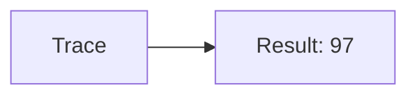
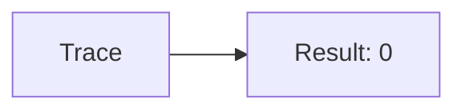
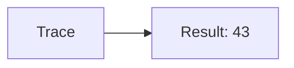
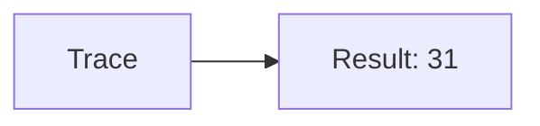
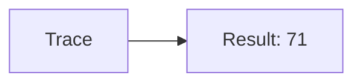

🔙 **[Kembali ke Daftar Soal](./README.md)**

---

# Latihan Soal Part C - Modul 04 - Set 03

### Soal 51
```cpp
// Bird: Pass-by-Value
void ubah(int x) { x = 0; }
// main: int bird=97;
ubah(bird);
```
**Pertanyaan:**
1. Berapakah hasil akhirnya?
2. Deskripsikan alur pikir 'Compiler Manusia' untuk soal ini!

**Jawaban & Diagnosis:**
1. **97**
2. Value 'Bird' dikirim fotokopinya. Aslinya tetap 97.

**Mermaid Flowchart:**


---
### Soal 52
```cpp
// Monster: Pass-by-Reference
void reset(int &x) { x = 0; }
// main: int monster=67;
reset(monster);
```
**Pertanyaan:**
1. Berapakah hasil akhirnya?
2. Deskripsikan alur pikir 'Compiler Manusia' untuk soal ini!

**Jawaban & Diagnosis:**
1. **0**
2. Reference '&' dikirim alamat aslinya. 'Monster' ter-reset jadi 0.

**Mermaid Flowchart:**


---
### Soal 53
```cpp
// Boss: Pass-by-Value
void ubah(int x) { x = 0; }
// main: int boss=43;
ubah(boss);
```
**Pertanyaan:**
1. Berapakah hasil akhirnya?
2. Deskripsikan alur pikir 'Compiler Manusia' untuk soal ini!

**Jawaban & Diagnosis:**
1. **43**
2. Value 'Boss' dikirim fotokopinya. Aslinya tetap 43.

**Mermaid Flowchart:**


---
### Soal 54
```cpp
// Npc: Pass-by-Reference
void reset(int &x) { x = 0; }
// main: int npc=71;
reset(npc);
```
**Pertanyaan:**
1. Berapakah hasil akhirnya?
2. Deskripsikan alur pikir 'Compiler Manusia' untuk soal ini!

**Jawaban & Diagnosis:**
1. **0**
2. Reference '&' dikirim alamat aslinya. 'Npc' ter-reset jadi 0.

**Mermaid Flowchart:**


---
### Soal 55
```cpp
// Pc: Pass-by-Value
void ubah(int x) { x = 0; }
// main: int pc=24;
ubah(pc);
```
**Pertanyaan:**
1. Berapakah hasil akhirnya?
2. Deskripsikan alur pikir 'Compiler Manusia' untuk soal ini!

**Jawaban & Diagnosis:**
1. **24**
2. Value 'Pc' dikirim fotokopinya. Aslinya tetap 24.

**Mermaid Flowchart:**


---
### Soal 56
```cpp
// User: Pass-by-Reference
void reset(int &x) { x = 0; }
// main: int user=69;
reset(user);
```
**Pertanyaan:**
1. Berapakah hasil akhirnya?
2. Deskripsikan alur pikir 'Compiler Manusia' untuk soal ini!

**Jawaban & Diagnosis:**
1. **0**
2. Reference '&' dikirim alamat aslinya. 'User' ter-reset jadi 0.

**Mermaid Flowchart:**


---
### Soal 57
```cpp
// Admin: Pass-by-Value
void ubah(int x) { x = 0; }
// main: int admin=91;
ubah(admin);
```
**Pertanyaan:**
1. Berapakah hasil akhirnya?
2. Deskripsikan alur pikir 'Compiler Manusia' untuk soal ini!

**Jawaban & Diagnosis:**
1. **91**
2. Value 'Admin' dikirim fotokopinya. Aslinya tetap 91.

**Mermaid Flowchart:**


---
### Soal 58
```cpp
// Mod: Pass-by-Reference
void reset(int &x) { x = 0; }
// main: int mod=74;
reset(mod);
```
**Pertanyaan:**
1. Berapakah hasil akhirnya?
2. Deskripsikan alur pikir 'Compiler Manusia' untuk soal ini!

**Jawaban & Diagnosis:**
1. **0**
2. Reference '&' dikirim alamat aslinya. 'Mod' ter-reset jadi 0.

**Mermaid Flowchart:**


---
### Soal 59
```cpp
// Guest: Pass-by-Value
void ubah(int x) { x = 0; }
// main: int guest=31;
ubah(guest);
```
**Pertanyaan:**
1. Berapakah hasil akhirnya?
2. Deskripsikan alur pikir 'Compiler Manusia' untuk soal ini!

**Jawaban & Diagnosis:**
1. **31**
2. Value 'Guest' dikirim fotokopinya. Aslinya tetap 31.

**Mermaid Flowchart:**


---
### Soal 60
```cpp
// Bot: Pass-by-Reference
void reset(int &x) { x = 0; }
// main: int bot=69;
reset(bot);
```
**Pertanyaan:**
1. Berapakah hasil akhirnya?
2. Deskripsikan alur pikir 'Compiler Manusia' untuk soal ini!

**Jawaban & Diagnosis:**
1. **0**
2. Reference '&' dikirim alamat aslinya. 'Bot' ter-reset jadi 0.

**Mermaid Flowchart:**


---
### Soal 61
```cpp
// Ai: Pass-by-Value
void ubah(int x) { x = 0; }
// main: int ai=29;
ubah(ai);
```
**Pertanyaan:**
1. Berapakah hasil akhirnya?
2. Deskripsikan alur pikir 'Compiler Manusia' untuk soal ini!

**Jawaban & Diagnosis:**
1. **29**
2. Value 'Ai' dikirim fotokopinya. Aslinya tetap 29.

**Mermaid Flowchart:**


---
### Soal 62
```cpp
// System: Pass-by-Reference
void reset(int &x) { x = 0; }
// main: int system=72;
reset(system);
```
**Pertanyaan:**
1. Berapakah hasil akhirnya?
2. Deskripsikan alur pikir 'Compiler Manusia' untuk soal ini!

**Jawaban & Diagnosis:**
1. **0**
2. Reference '&' dikirim alamat aslinya. 'System' ter-reset jadi 0.

**Mermaid Flowchart:**


---
### Soal 63
```cpp
// Kernel: Pass-by-Value
void ubah(int x) { x = 0; }
// main: int kernel=71;
ubah(kernel);
```
**Pertanyaan:**
1. Berapakah hasil akhirnya?
2. Deskripsikan alur pikir 'Compiler Manusia' untuk soal ini!

**Jawaban & Diagnosis:**
1. **71**
2. Value 'Kernel' dikirim fotokopinya. Aslinya tetap 71.

**Mermaid Flowchart:**


---
### Soal 64
```cpp
// Core: Pass-by-Reference
void reset(int &x) { x = 0; }
// main: int core=79;
reset(core);
```
**Pertanyaan:**
1. Berapakah hasil akhirnya?
2. Deskripsikan alur pikir 'Compiler Manusia' untuk soal ini!

**Jawaban & Diagnosis:**
1. **0**
2. Reference '&' dikirim alamat aslinya. 'Core' ter-reset jadi 0.

**Mermaid Flowchart:**


---
### Soal 65
```cpp
// Ram: Pass-by-Value
void ubah(int x) { x = 0; }
// main: int ram=63;
ubah(ram);
```
**Pertanyaan:**
1. Berapakah hasil akhirnya?
2. Deskripsikan alur pikir 'Compiler Manusia' untuk soal ini!

**Jawaban & Diagnosis:**
1. **63**
2. Value 'Ram' dikirim fotokopinya. Aslinya tetap 63.

**Mermaid Flowchart:**


---
### Soal 66
```cpp
// Rom: Pass-by-Reference
void reset(int &x) { x = 0; }
// main: int rom=97;
reset(rom);
```
**Pertanyaan:**
1. Berapakah hasil akhirnya?
2. Deskripsikan alur pikir 'Compiler Manusia' untuk soal ini!

**Jawaban & Diagnosis:**
1. **0**
2. Reference '&' dikirim alamat aslinya. 'Rom' ter-reset jadi 0.

**Mermaid Flowchart:**


---
### Soal 67
```cpp
// Cpu: Pass-by-Value
void ubah(int x) { x = 0; }
// main: int cpu=23;
ubah(cpu);
```
**Pertanyaan:**
1. Berapakah hasil akhirnya?
2. Deskripsikan alur pikir 'Compiler Manusia' untuk soal ini!

**Jawaban & Diagnosis:**
1. **23**
2. Value 'Cpu' dikirim fotokopinya. Aslinya tetap 23.

**Mermaid Flowchart:**


---
### Soal 68
```cpp
// Gpu: Pass-by-Reference
void reset(int &x) { x = 0; }
// main: int gpu=12;
reset(gpu);
```
**Pertanyaan:**
1. Berapakah hasil akhirnya?
2. Deskripsikan alur pikir 'Compiler Manusia' untuk soal ini!

**Jawaban & Diagnosis:**
1. **0**
2. Reference '&' dikirim alamat aslinya. 'Gpu' ter-reset jadi 0.

**Mermaid Flowchart:**


---
### Soal 69
```cpp
// Vram: Pass-by-Value
void ubah(int x) { x = 0; }
// main: int vram=12;
ubah(vram);
```
**Pertanyaan:**
1. Berapakah hasil akhirnya?
2. Deskripsikan alur pikir 'Compiler Manusia' untuk soal ini!

**Jawaban & Diagnosis:**
1. **12**
2. Value 'Vram' dikirim fotokopinya. Aslinya tetap 12.

**Mermaid Flowchart:**


---
### Soal 70
```cpp
// Ssd: Pass-by-Reference
void reset(int &x) { x = 0; }
// main: int ssd=55;
reset(ssd);
```
**Pertanyaan:**
1. Berapakah hasil akhirnya?
2. Deskripsikan alur pikir 'Compiler Manusia' untuk soal ini!

**Jawaban & Diagnosis:**
1. **0**
2. Reference '&' dikirim alamat aslinya. 'Ssd' ter-reset jadi 0.

**Mermaid Flowchart:**


---
### Soal 71
```cpp
// Hdd: Pass-by-Value
void ubah(int x) { x = 0; }
// main: int hdd=31;
ubah(hdd);
```
**Pertanyaan:**
1. Berapakah hasil akhirnya?
2. Deskripsikan alur pikir 'Compiler Manusia' untuk soal ini!

**Jawaban & Diagnosis:**
1. **31**
2. Value 'Hdd' dikirim fotokopinya. Aslinya tetap 31.

**Mermaid Flowchart:**
```mermaid
graph LR
A[Trace] --> B[Result: 31]
```

---
### Soal 72
```cpp
// Usb: Pass-by-Reference
void reset(int &x) { x = 0; }
// main: int usb=40;
reset(usb);
```
**Pertanyaan:**
1. Berapakah hasil akhirnya?
2. Deskripsikan alur pikir 'Compiler Manusia' untuk soal ini!

**Jawaban & Diagnosis:**
1. **0**
2. Reference '&' dikirim alamat aslinya. 'Usb' ter-reset jadi 0.

**Mermaid Flowchart:**
```mermaid
graph LR
A[Trace] --> B[Result: 0]
```

---
### Soal 73
```cpp
// Wifi: Pass-by-Value
void ubah(int x) { x = 0; }
// main: int wifi=65;
ubah(wifi);
```
**Pertanyaan:**
1. Berapakah hasil akhirnya?
2. Deskripsikan alur pikir 'Compiler Manusia' untuk soal ini!

**Jawaban & Diagnosis:**
1. **65**
2. Value 'Wifi' dikirim fotokopinya. Aslinya tetap 65.

**Mermaid Flowchart:**
```mermaid
graph LR
A[Trace] --> B[Result: 65]
```

---
### Soal 74
```cpp
// Bt: Pass-by-Reference
void reset(int &x) { x = 0; }
// main: int bt=57;
reset(bt);
```
**Pertanyaan:**
1. Berapakah hasil akhirnya?
2. Deskripsikan alur pikir 'Compiler Manusia' untuk soal ini!

**Jawaban & Diagnosis:**
1. **0**
2. Reference '&' dikirim alamat aslinya. 'Bt' ter-reset jadi 0.

**Mermaid Flowchart:**
```mermaid
graph LR
A[Trace] --> B[Result: 0]
```

---
### Soal 75
```cpp
// Nfc: Pass-by-Value
void ubah(int x) { x = 0; }
// main: int nfc=87;
ubah(nfc);
```
**Pertanyaan:**
1. Berapakah hasil akhirnya?
2. Deskripsikan alur pikir 'Compiler Manusia' untuk soal ini!

**Jawaban & Diagnosis:**
1. **87**
2. Value 'Nfc' dikirim fotokopinya. Aslinya tetap 87.

**Mermaid Flowchart:**
```mermaid
graph LR
A[Trace] --> B[Result: 87]
```

---
