🔙 **[Kembali ke Daftar Soal](./README.md)**

---

# Latihan Soal Part C - Modul 04 - Set 03

### Soal 51
```cpp
int f(int x) { return x * 2; }
// main: int a = 17; a = f(a) + f(2);
```
**Pertanyaan:**
1. Berapakah hasil akhirnya?
2. Mengapa demikian?

**Jawaban & Diagnosis:**
1. **38**
2. Lihat Tracing.

**Mermaid Flowchart:**
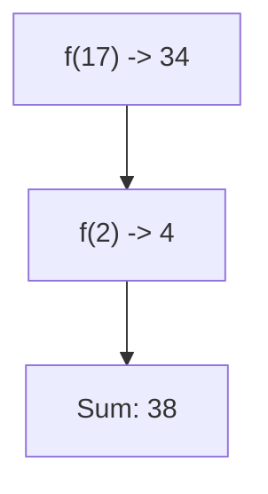

**📖 Penjelasan:**
**Langkah Tracing:**
1. f(17) = 34.
2. f(2) = 4.
3. Jumlah: 38.

---
### Soal 52
```cpp
void swap(int &a, int b) { int t=a; a=b; b=t; }
// main: int x=8, y=20; swap(x, y);
```
**Pertanyaan:**
1. Berapakah hasil akhirnya?
2. Mengapa demikian?

**Jawaban & Diagnosis:**
1. **x=20, y=20**
2. Lihat Tracing.

**Mermaid Flowchart:**
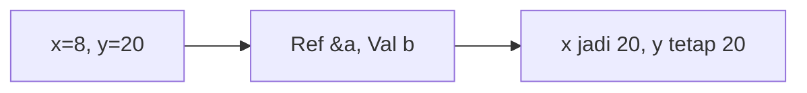

**📖 Penjelasan:**
**Langkah Tracing:**
1. x dilempar secara `reference` (&), maka nilainya berubah.
2. y dilempar secara `value`, maka aslinya aman.

---
### Soal 53
```cpp
int f(int x) { return x * 2; }
// main: int a = 12; a = f(a) + f(2);
```
**Pertanyaan:**
1. Berapakah hasil akhirnya?
2. Mengapa demikian?

**Jawaban & Diagnosis:**
1. **28**
2. Lihat Tracing.

**Mermaid Flowchart:**


**📖 Penjelasan:**
**Langkah Tracing:**
1. f(12) = 24.
2. f(2) = 4.
3. Jumlah: 28.

---
### Soal 54
```cpp
void swap(int &a, int b) { int t=a; a=b; b=t; }
// main: int x=18, y=5; swap(x, y);
```
**Pertanyaan:**
1. Berapakah hasil akhirnya?
2. Mengapa demikian?

**Jawaban & Diagnosis:**
1. **x=5, y=5**
2. Lihat Tracing.

**Mermaid Flowchart:**


**📖 Penjelasan:**
**Langkah Tracing:**
1. x dilempar secara `reference` (&), maka nilainya berubah.
2. y dilempar secara `value`, maka aslinya aman.

---
### Soal 55
```cpp
void swap(int &a, int b) { int t=a; a=b; b=t; }
// main: int x=8, y=13; swap(x, y);
```
**Pertanyaan:**
1. Berapakah hasil akhirnya?
2. Mengapa demikian?

**Jawaban & Diagnosis:**
1. **x=13, y=13**
2. Lihat Tracing.

**Mermaid Flowchart:**
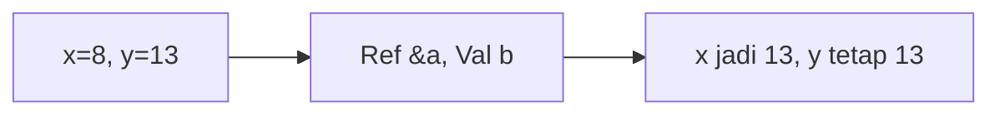

**📖 Penjelasan:**
**Langkah Tracing:**
1. x dilempar secara `reference` (&), maka nilainya berubah.
2. y dilempar secara `value`, maka aslinya aman.

---
### Soal 56
```cpp
void swap(int &a, int b) { int t=a; a=b; b=t; }
// main: int x=14, y=3; swap(x, y);
```
**Pertanyaan:**
1. Berapakah hasil akhirnya?
2. Mengapa demikian?

**Jawaban & Diagnosis:**
1. **x=3, y=3**
2. Lihat Tracing.

**Mermaid Flowchart:**
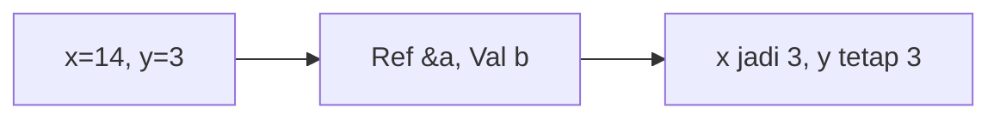

**📖 Penjelasan:**
**Langkah Tracing:**
1. x dilempar secara `reference` (&), maka nilainya berubah.
2. y dilempar secara `value`, maka aslinya aman.

---
### Soal 57
```cpp
int f(int x) { return x * 2; }
// main: int a = 19; a = f(a) + f(2);
```
**Pertanyaan:**
1. Berapakah hasil akhirnya?
2. Mengapa demikian?

**Jawaban & Diagnosis:**
1. **42**
2. Lihat Tracing.

**Mermaid Flowchart:**
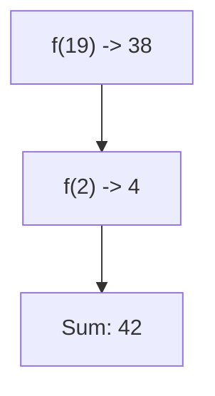

**📖 Penjelasan:**
**Langkah Tracing:**
1. f(19) = 38.
2. f(2) = 4.
3. Jumlah: 42.

---
### Soal 58
```cpp
int f(int x) { return x * 2; }
// main: int a = 15; a = f(a) + f(2);
```
**Pertanyaan:**
1. Berapakah hasil akhirnya?
2. Mengapa demikian?

**Jawaban & Diagnosis:**
1. **34**
2. Lihat Tracing.

**Mermaid Flowchart:**
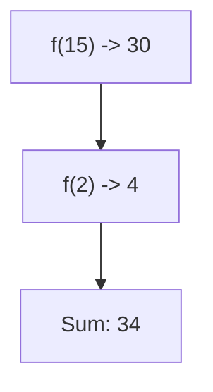

**📖 Penjelasan:**
**Langkah Tracing:**
1. f(15) = 30.
2. f(2) = 4.
3. Jumlah: 34.

---
### Soal 59
```cpp
void swap(int &a, int b) { int t=a; a=b; b=t; }
// main: int x=11, y=11; swap(x, y);
```
**Pertanyaan:**
1. Berapakah hasil akhirnya?
2. Mengapa demikian?

**Jawaban & Diagnosis:**
1. **x=11, y=11**
2. Lihat Tracing.

**Mermaid Flowchart:**
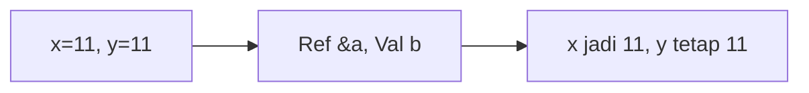

**📖 Penjelasan:**
**Langkah Tracing:**
1. x dilempar secara `reference` (&), maka nilainya berubah.
2. y dilempar secara `value`, maka aslinya aman.

---
### Soal 60
```cpp
void swap(int &a, int b) { int t=a; a=b; b=t; }
// main: int x=14, y=20; swap(x, y);
```
**Pertanyaan:**
1. Berapakah hasil akhirnya?
2. Mengapa demikian?

**Jawaban & Diagnosis:**
1. **x=20, y=20**
2. Lihat Tracing.

**Mermaid Flowchart:**
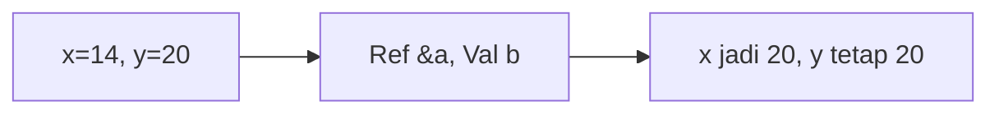

**📖 Penjelasan:**
**Langkah Tracing:**
1. x dilempar secara `reference` (&), maka nilainya berubah.
2. y dilempar secara `value`, maka aslinya aman.

---
### Soal 61
```cpp
void swap(int &a, int b) { int t=a; a=b; b=t; }
// main: int x=2, y=17; swap(x, y);
```
**Pertanyaan:**
1. Berapakah hasil akhirnya?
2. Mengapa demikian?

**Jawaban & Diagnosis:**
1. **x=17, y=17**
2. Lihat Tracing.

**Mermaid Flowchart:**
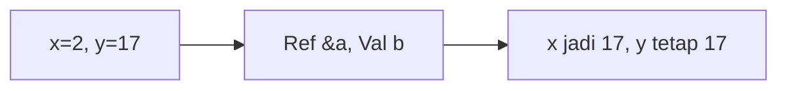

**📖 Penjelasan:**
**Langkah Tracing:**
1. x dilempar secara `reference` (&), maka nilainya berubah.
2. y dilempar secara `value`, maka aslinya aman.

---
### Soal 62
```cpp
int f(int x) { return x * 2; }
// main: int a = 17; a = f(a) + f(2);
```
**Pertanyaan:**
1. Berapakah hasil akhirnya?
2. Mengapa demikian?

**Jawaban & Diagnosis:**
1. **38**
2. Lihat Tracing.

**Mermaid Flowchart:**


**📖 Penjelasan:**
**Langkah Tracing:**
1. f(17) = 34.
2. f(2) = 4.
3. Jumlah: 38.

---
### Soal 63
```cpp
int f(int x) { return x * 2; }
// main: int a = 4; a = f(a) + f(2);
```
**Pertanyaan:**
1. Berapakah hasil akhirnya?
2. Mengapa demikian?

**Jawaban & Diagnosis:**
1. **12**
2. Lihat Tracing.

**Mermaid Flowchart:**
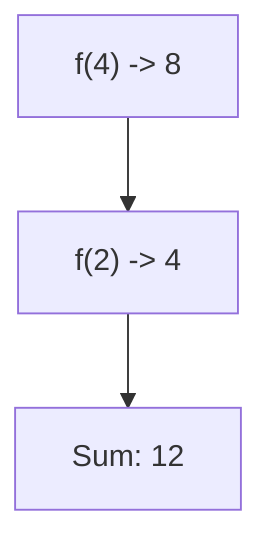

**📖 Penjelasan:**
**Langkah Tracing:**
1. f(4) = 8.
2. f(2) = 4.
3. Jumlah: 12.

---
### Soal 64
```cpp
int f(int x) { return x * 2; }
// main: int a = 12; a = f(a) + f(2);
```
**Pertanyaan:**
1. Berapakah hasil akhirnya?
2. Mengapa demikian?

**Jawaban & Diagnosis:**
1. **28**
2. Lihat Tracing.

**Mermaid Flowchart:**


**📖 Penjelasan:**
**Langkah Tracing:**
1. f(12) = 24.
2. f(2) = 4.
3. Jumlah: 28.

---
### Soal 65
```cpp
int f(int x) { return x * 2; }
// main: int a = 17; a = f(a) + f(2);
```
**Pertanyaan:**
1. Berapakah hasil akhirnya?
2. Mengapa demikian?

**Jawaban & Diagnosis:**
1. **38**
2. Lihat Tracing.

**Mermaid Flowchart:**


**📖 Penjelasan:**
**Langkah Tracing:**
1. f(17) = 34.
2. f(2) = 4.
3. Jumlah: 38.

---
### Soal 66
```cpp
int f(int x) { return x * 2; }
// main: int a = 1; a = f(a) + f(2);
```
**Pertanyaan:**
1. Berapakah hasil akhirnya?
2. Mengapa demikian?

**Jawaban & Diagnosis:**
1. **6**
2. Lihat Tracing.

**Mermaid Flowchart:**
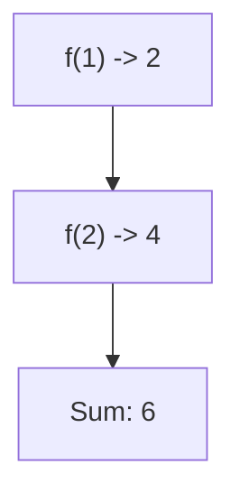

**📖 Penjelasan:**
**Langkah Tracing:**
1. f(1) = 2.
2. f(2) = 4.
3. Jumlah: 6.

---
### Soal 67
```cpp
int f(int x) { return x * 2; }
// main: int a = 11; a = f(a) + f(2);
```
**Pertanyaan:**
1. Berapakah hasil akhirnya?
2. Mengapa demikian?

**Jawaban & Diagnosis:**
1. **26**
2. Lihat Tracing.

**Mermaid Flowchart:**
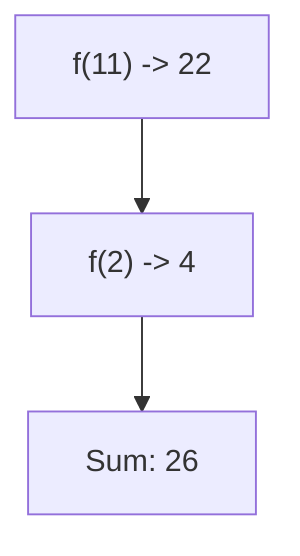

**📖 Penjelasan:**
**Langkah Tracing:**
1. f(11) = 22.
2. f(2) = 4.
3. Jumlah: 26.

---
### Soal 68
```cpp
void swap(int &a, int b) { int t=a; a=b; b=t; }
// main: int x=16, y=17; swap(x, y);
```
**Pertanyaan:**
1. Berapakah hasil akhirnya?
2. Mengapa demikian?

**Jawaban & Diagnosis:**
1. **x=17, y=17**
2. Lihat Tracing.

**Mermaid Flowchart:**
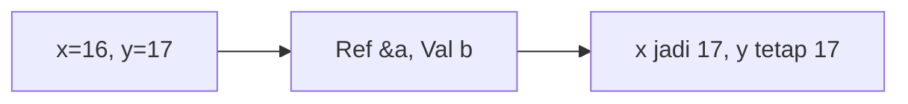

**📖 Penjelasan:**
**Langkah Tracing:**
1. x dilempar secara `reference` (&), maka nilainya berubah.
2. y dilempar secara `value`, maka aslinya aman.

---
### Soal 69
```cpp
void swap(int &a, int b) { int t=a; a=b; b=t; }
// main: int x=4, y=11; swap(x, y);
```
**Pertanyaan:**
1. Berapakah hasil akhirnya?
2. Mengapa demikian?

**Jawaban & Diagnosis:**
1. **x=11, y=11**
2. Lihat Tracing.

**Mermaid Flowchart:**
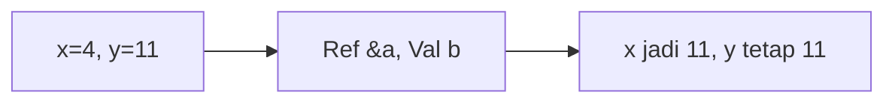

**📖 Penjelasan:**
**Langkah Tracing:**
1. x dilempar secara `reference` (&), maka nilainya berubah.
2. y dilempar secara `value`, maka aslinya aman.

---
### Soal 70
```cpp
int f(int x) { return x * 2; }
// main: int a = 19; a = f(a) + f(2);
```
**Pertanyaan:**
1. Berapakah hasil akhirnya?
2. Mengapa demikian?

**Jawaban & Diagnosis:**
1. **42**
2. Lihat Tracing.

**Mermaid Flowchart:**


**📖 Penjelasan:**
**Langkah Tracing:**
1. f(19) = 38.
2. f(2) = 4.
3. Jumlah: 42.

---
### Soal 71
```cpp
int f(int x) { return x * 2; }
// main: int a = 12; a = f(a) + f(2);
```
**Pertanyaan:**
1. Berapakah hasil akhirnya?
2. Mengapa demikian?

**Jawaban & Diagnosis:**
1. **28**
2. Lihat Tracing.

**Mermaid Flowchart:**
```mermaid
graph TD
A["f(12) -> 24"] --> B["f(2) -> 4"]
B --> C["Sum: 28"]
```

**📖 Penjelasan:**
**Langkah Tracing:**
1. f(12) = 24.
2. f(2) = 4.
3. Jumlah: 28.

---
### Soal 72
```cpp
void swap(int &a, int b) { int t=a; a=b; b=t; }
// main: int x=20, y=6; swap(x, y);
```
**Pertanyaan:**
1. Berapakah hasil akhirnya?
2. Mengapa demikian?

**Jawaban & Diagnosis:**
1. **x=6, y=6**
2. Lihat Tracing.

**Mermaid Flowchart:**
```mermaid
graph LR
A["x=20, y=6"] --> B["Ref &a, Val b"]
B --> C["x jadi 6, y tetap 6"]
```

**📖 Penjelasan:**
**Langkah Tracing:**
1. x dilempar secara `reference` (&), maka nilainya berubah.
2. y dilempar secara `value`, maka aslinya aman.

---
### Soal 73
```cpp
void swap(int &a, int b) { int t=a; a=b; b=t; }
// main: int x=5, y=6; swap(x, y);
```
**Pertanyaan:**
1. Berapakah hasil akhirnya?
2. Mengapa demikian?

**Jawaban & Diagnosis:**
1. **x=6, y=6**
2. Lihat Tracing.

**Mermaid Flowchart:**
```mermaid
graph LR
A["x=5, y=6"] --> B["Ref &a, Val b"]
B --> C["x jadi 6, y tetap 6"]
```

**📖 Penjelasan:**
**Langkah Tracing:**
1. x dilempar secara `reference` (&), maka nilainya berubah.
2. y dilempar secara `value`, maka aslinya aman.

---
### Soal 74
```cpp
int f(int x) { return x * 2; }
// main: int a = 14; a = f(a) + f(2);
```
**Pertanyaan:**
1. Berapakah hasil akhirnya?
2. Mengapa demikian?

**Jawaban & Diagnosis:**
1. **32**
2. Lihat Tracing.

**Mermaid Flowchart:**
```mermaid
graph TD
A["f(14) -> 28"] --> B["f(2) -> 4"]
B --> C["Sum: 32"]
```

**📖 Penjelasan:**
**Langkah Tracing:**
1. f(14) = 28.
2. f(2) = 4.
3. Jumlah: 32.

---
### Soal 75
```cpp
void swap(int &a, int b) { int t=a; a=b; b=t; }
// main: int x=10, y=16; swap(x, y);
```
**Pertanyaan:**
1. Berapakah hasil akhirnya?
2. Mengapa demikian?

**Jawaban & Diagnosis:**
1. **x=16, y=16**
2. Lihat Tracing.

**Mermaid Flowchart:**
```mermaid
graph LR
A["x=10, y=16"] --> B["Ref &a, Val b"]
B --> C["x jadi 16, y tetap 16"]
```

**📖 Penjelasan:**
**Langkah Tracing:**
1. x dilempar secara `reference` (&), maka nilainya berubah.
2. y dilempar secara `value`, maka aslinya aman.

---
