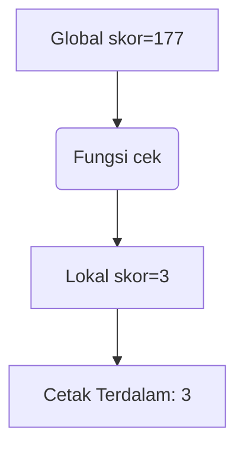
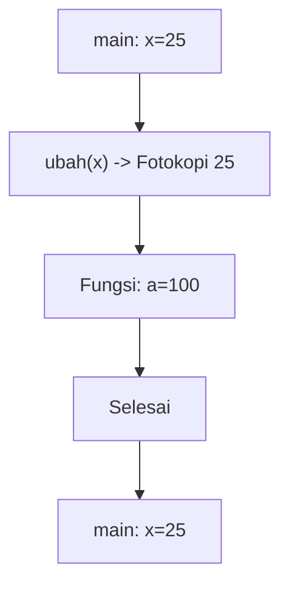
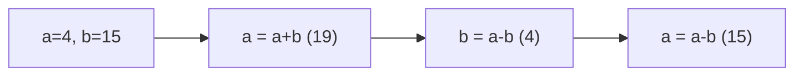
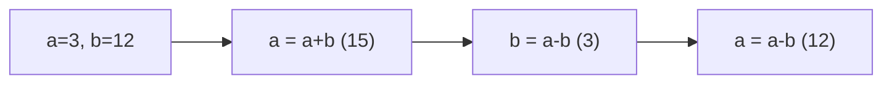
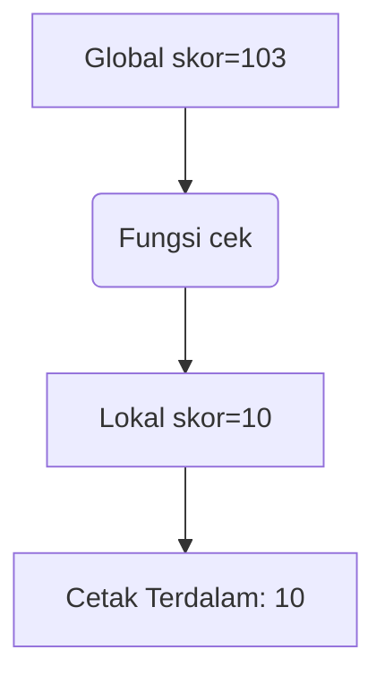
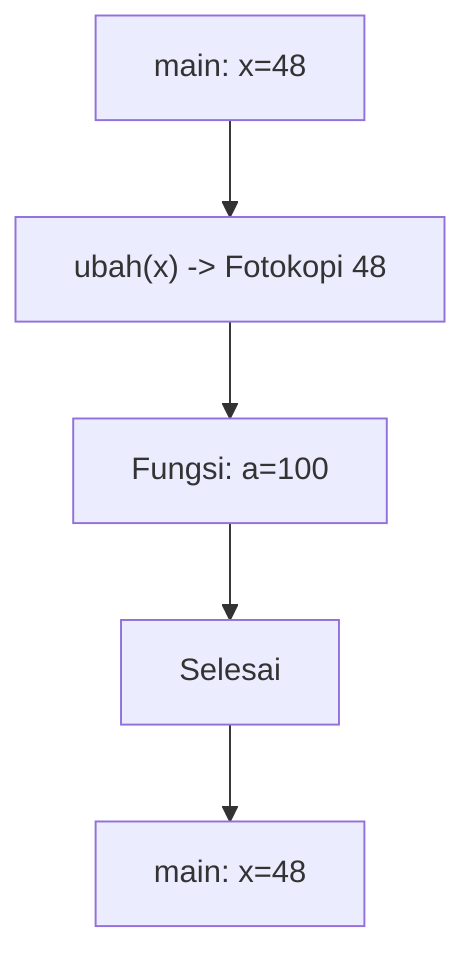
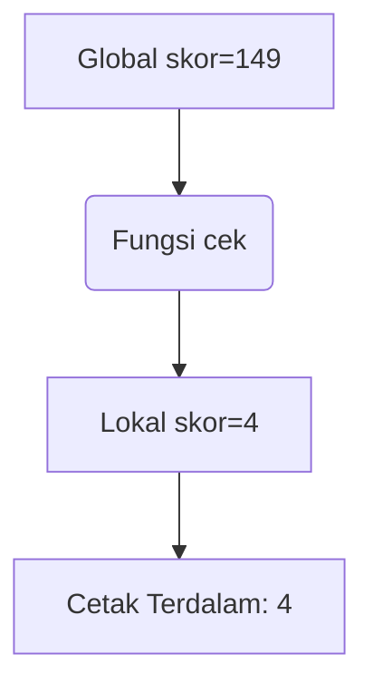
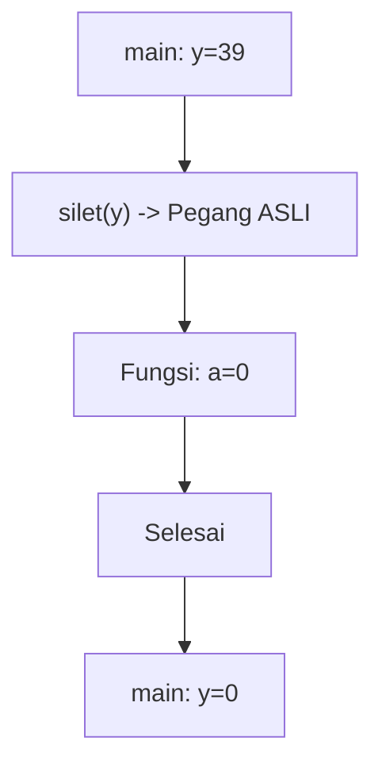
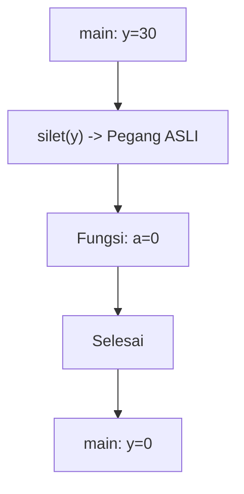
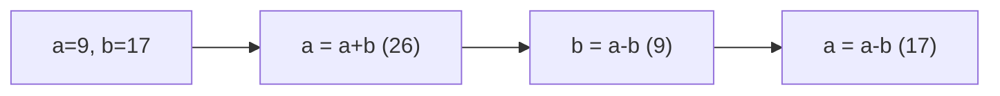

🔙 **[Kembali ke Daftar Soal](./README.md)**

---

# Latihan Soal Part C - Modul 04 - Set 03

### Soal 51 (Global vs Local)
```cpp
int skor = 177; // Global

void cek() {
    int skor = 3; // Local
    printf("%d", skor);
}

// output = ?
```
**Pertanyaan:**
1. Angka berapakah yang akan tercetak di layar?
2. Siapa yang lebih berkuasa: skor 177 atau skor 3?
3. Apa istilah untuk variabel lokal yang menutupi variabel global?

**Jawaban & Diagnosis:**
1. **3**
2. **Skor 3 (Lokal/Ketua Kelas) karena letaknya di dalam fungsi.**
3. **Shadowing (Membayangi).**

**Mermaid Flowchart:**


**📖 Cara Membaca Diagram:**
Mesin masuk fungsi. Dia melihat ada dua nama 'skor'. Dia pilih yang terdekat (lokal). Cetak lokal.

---
### Soal 52 (Pass By Reference)
```cpp
void silet(int &a) {
    a = 0;
}

int main() {
    int y = 45;
    silet(y);
    // y = ?
```
**Pertanyaan:**
1. Berapakah nilai variabel `y` di akhir program?
2. Apa tanda yang menunjukkan fungsi ini menggunakan 'Reference'?
3. Analogi apa yang cocok untuk Pass-By-Reference?

**Jawaban & Diagnosis:**
1. **0**
2. **Tanda Amperstand (&) pada parameter `int &a`.**
3. **Memberikan Buku Asli (Kalau dicoret, aslinya rusak).**

**Mermaid Flowchart:**


**📖 Cara Membaca Diagram:**
y=45. Karena ada `&`, fungsi `silet` memegang dompet aslimu. Dia pasang 0, maka y di main ikut jadi 0.

---
### Soal 53 (Pass By Reference)
```cpp
void silet(int &a) {
    a = 0;
}

int main() {
    int y = 46;
    silet(y);
    // y = ?
```
**Pertanyaan:**
1. Berapakah nilai variabel `y` di akhir program?
2. Apa tanda yang menunjukkan fungsi ini menggunakan 'Reference'?
3. Analogi apa yang cocok untuk Pass-By-Reference?

**Jawaban & Diagnosis:**
1. **0**
2. **Tanda Amperstand (&) pada parameter `int &a`.**
3. **Memberikan Buku Asli (Kalau dicoret, aslinya rusak).**

**Mermaid Flowchart:**


**📖 Cara Membaca Diagram:**
y=46. Karena ada `&`, fungsi `silet` memegang dompet aslimu. Dia pasang 0, maka y di main ikut jadi 0.

---
### Soal 54 (Global vs Local)
```cpp
int skor = 156; // Global

void cek() {
    int skor = 2; // Local
    printf("%d", skor);
}

// output = ?
```
**Pertanyaan:**
1. Angka berapakah yang akan tercetak di layar?
2. Siapa yang lebih berkuasa: skor 156 atau skor 2?
3. Apa istilah untuk variabel lokal yang menutupi variabel global?

**Jawaban & Diagnosis:**
1. **2**
2. **Skor 2 (Lokal/Ketua Kelas) karena letaknya di dalam fungsi.**
3. **Shadowing (Membayangi).**

**Mermaid Flowchart:**


**📖 Cara Membaca Diagram:**
Mesin masuk fungsi. Dia melihat ada dua nama 'skor'. Dia pilih yang terdekat (lokal). Cetak lokal.

---
### Soal 55 (Global vs Local)
```cpp
int skor = 101; // Global

void cek() {
    int skor = 3; // Local
    printf("%d", skor);
}

// output = ?
```
**Pertanyaan:**
1. Angka berapakah yang akan tercetak di layar?
2. Siapa yang lebih berkuasa: skor 101 atau skor 3?
3. Apa istilah untuk variabel lokal yang menutupi variabel global?

**Jawaban & Diagnosis:**
1. **3**
2. **Skor 3 (Lokal/Ketua Kelas) karena letaknya di dalam fungsi.**
3. **Shadowing (Membayangi).**

**Mermaid Flowchart:**


**📖 Cara Membaca Diagram:**
Mesin masuk fungsi. Dia melihat ada dua nama 'skor'. Dia pilih yang terdekat (lokal). Cetak lokal.

---
### Soal 56 (Pass By Value)
```cpp
void ubah(int a) {
    a = 100;
}

int main() {
    int x = 25;
    ubah(x);
    // x = ?
```
**Pertanyaan:**
1. Berapakah nilai variabel `x` di dalam `main` setelah fungsi `ubah` selesai?
2. Apa yang terjadi pada variabel `a` di dalam fungsi `ubah`?
3. Analogi apa yang cocok untuk Pass-By-Value?

**Jawaban & Diagnosis:**
1. **25**
2. **Berubah jadi 100, tapi hanya di dalam fungsi tersebut (lokal).**
3. **Fotokopi PR (Dicoret-coret temen gak ngaruh ke buku aslimu).**

**Mermaid Flowchart:**


**📖 Cara Membaca Diagram:**
x=25. Saat `ubah(x)`, komputer hanya mengirim fotokopi nilai 25. Fungsi merubah fotokopi jadi 100. Di main, dompet asli x tetap 25.

---
### Soal 57 (Swap Trick)
```cpp
void tukar(int &a, int &b) {
    a = a + b;
    b = a - b;
    a = a - b;
}
// main: a=4, b=15; tukar(a,b);
```
**Pertanyaan:**
1. Setelah swap, berapa nilai `a`?
2. Setelah swap, berapa nilai `b`?
3. Kenapa tukar ini berhasil tanpa variabel ketiga?

**Jawaban & Diagnosis:**
1. **15**
2. **4**
3. **Karena menggunakan trik aritmetika (tambah-kurang) untuk membalas nilai.**

**Mermaid Flowchart:**


**📖 Cara Membaca Diagram:**
a=4, b=15. a=a+b=19. b=a-b=4=4. a=a-b=15=15. Terbalik!

---
### Soal 58 (Pass By Reference)
```cpp
void silet(int &a) {
    a = 0;
}

int main() {
    int y = 24;
    silet(y);
    // y = ?
```
**Pertanyaan:**
1. Berapakah nilai variabel `y` di akhir program?
2. Apa tanda yang menunjukkan fungsi ini menggunakan 'Reference'?
3. Analogi apa yang cocok untuk Pass-By-Reference?

**Jawaban & Diagnosis:**
1. **0**
2. **Tanda Amperstand (&) pada parameter `int &a`.**
3. **Memberikan Buku Asli (Kalau dicoret, aslinya rusak).**

**Mermaid Flowchart:**


**📖 Cara Membaca Diagram:**
y=24. Karena ada `&`, fungsi `silet` memegang dompet aslimu. Dia pasang 0, maka y di main ikut jadi 0.

---
### Soal 59 (Swap Trick)
```cpp
void tukar(int &a, int &b) {
    a = a + b;
    b = a - b;
    a = a - b;
}
// main: a=3, b=12; tukar(a,b);
```
**Pertanyaan:**
1. Setelah swap, berapa nilai `a`?
2. Setelah swap, berapa nilai `b`?
3. Kenapa tukar ini berhasil tanpa variabel ketiga?

**Jawaban & Diagnosis:**
1. **12**
2. **3**
3. **Karena menggunakan trik aritmetika (tambah-kurang) untuk membalas nilai.**

**Mermaid Flowchart:**


**📖 Cara Membaca Diagram:**
a=3, b=12. a=a+b=15. b=a-b=3=3. a=a-b=12=12. Terbalik!

---
### Soal 60 (Global vs Local)
```cpp
int skor = 103; // Global

void cek() {
    int skor = 10; // Local
    printf("%d", skor);
}

// output = ?
```
**Pertanyaan:**
1. Angka berapakah yang akan tercetak di layar?
2. Siapa yang lebih berkuasa: skor 103 atau skor 10?
3. Apa istilah untuk variabel lokal yang menutupi variabel global?

**Jawaban & Diagnosis:**
1. **10**
2. **Skor 10 (Lokal/Ketua Kelas) karena letaknya di dalam fungsi.**
3. **Shadowing (Membayangi).**

**Mermaid Flowchart:**


**📖 Cara Membaca Diagram:**
Mesin masuk fungsi. Dia melihat ada dua nama 'skor'. Dia pilih yang terdekat (lokal). Cetak lokal.

---
### Soal 61 (Pass By Reference)
```cpp
void silet(int &a) {
    a = 0;
}

int main() {
    int y = 44;
    silet(y);
    // y = ?
```
**Pertanyaan:**
1. Berapakah nilai variabel `y` di akhir program?
2. Apa tanda yang menunjukkan fungsi ini menggunakan 'Reference'?
3. Analogi apa yang cocok untuk Pass-By-Reference?

**Jawaban & Diagnosis:**
1. **0**
2. **Tanda Amperstand (&) pada parameter `int &a`.**
3. **Memberikan Buku Asli (Kalau dicoret, aslinya rusak).**

**Mermaid Flowchart:**


**📖 Cara Membaca Diagram:**
y=44. Karena ada `&`, fungsi `silet` memegang dompet aslimu. Dia pasang 0, maka y di main ikut jadi 0.

---
### Soal 62 (Pass By Value)
```cpp
void ubah(int a) {
    a = 100;
}

int main() {
    int x = 48;
    ubah(x);
    // x = ?
```
**Pertanyaan:**
1. Berapakah nilai variabel `x` di dalam `main` setelah fungsi `ubah` selesai?
2. Apa yang terjadi pada variabel `a` di dalam fungsi `ubah`?
3. Analogi apa yang cocok untuk Pass-By-Value?

**Jawaban & Diagnosis:**
1. **48**
2. **Berubah jadi 100, tapi hanya di dalam fungsi tersebut (lokal).**
3. **Fotokopi PR (Dicoret-coret temen gak ngaruh ke buku aslimu).**

**Mermaid Flowchart:**


**📖 Cara Membaca Diagram:**
x=48. Saat `ubah(x)`, komputer hanya mengirim fotokopi nilai 48. Fungsi merubah fotokopi jadi 100. Di main, dompet asli x tetap 48.

---
### Soal 63 (Global vs Local)
```cpp
int skor = 184; // Global

void cek() {
    int skor = 9; // Local
    printf("%d", skor);
}

// output = ?
```
**Pertanyaan:**
1. Angka berapakah yang akan tercetak di layar?
2. Siapa yang lebih berkuasa: skor 184 atau skor 9?
3. Apa istilah untuk variabel lokal yang menutupi variabel global?

**Jawaban & Diagnosis:**
1. **9**
2. **Skor 9 (Lokal/Ketua Kelas) karena letaknya di dalam fungsi.**
3. **Shadowing (Membayangi).**

**Mermaid Flowchart:**


**📖 Cara Membaca Diagram:**
Mesin masuk fungsi. Dia melihat ada dua nama 'skor'. Dia pilih yang terdekat (lokal). Cetak lokal.

---
### Soal 64 (Pass By Value)
```cpp
void ubah(int a) {
    a = 100;
}

int main() {
    int x = 44;
    ubah(x);
    // x = ?
```
**Pertanyaan:**
1. Berapakah nilai variabel `x` di dalam `main` setelah fungsi `ubah` selesai?
2. Apa yang terjadi pada variabel `a` di dalam fungsi `ubah`?
3. Analogi apa yang cocok untuk Pass-By-Value?

**Jawaban & Diagnosis:**
1. **44**
2. **Berubah jadi 100, tapi hanya di dalam fungsi tersebut (lokal).**
3. **Fotokopi PR (Dicoret-coret temen gak ngaruh ke buku aslimu).**

**Mermaid Flowchart:**


**📖 Cara Membaca Diagram:**
x=44. Saat `ubah(x)`, komputer hanya mengirim fotokopi nilai 44. Fungsi merubah fotokopi jadi 100. Di main, dompet asli x tetap 44.

---
### Soal 65 (Global vs Local)
```cpp
int skor = 149; // Global

void cek() {
    int skor = 4; // Local
    printf("%d", skor);
}

// output = ?
```
**Pertanyaan:**
1. Angka berapakah yang akan tercetak di layar?
2. Siapa yang lebih berkuasa: skor 149 atau skor 4?
3. Apa istilah untuk variabel lokal yang menutupi variabel global?

**Jawaban & Diagnosis:**
1. **4**
2. **Skor 4 (Lokal/Ketua Kelas) karena letaknya di dalam fungsi.**
3. **Shadowing (Membayangi).**

**Mermaid Flowchart:**


**📖 Cara Membaca Diagram:**
Mesin masuk fungsi. Dia melihat ada dua nama 'skor'. Dia pilih yang terdekat (lokal). Cetak lokal.

---
### Soal 66 (Pass By Reference)
```cpp
void silet(int &a) {
    a = 0;
}

int main() {
    int y = 39;
    silet(y);
    // y = ?
```
**Pertanyaan:**
1. Berapakah nilai variabel `y` di akhir program?
2. Apa tanda yang menunjukkan fungsi ini menggunakan 'Reference'?
3. Analogi apa yang cocok untuk Pass-By-Reference?

**Jawaban & Diagnosis:**
1. **0**
2. **Tanda Amperstand (&) pada parameter `int &a`.**
3. **Memberikan Buku Asli (Kalau dicoret, aslinya rusak).**

**Mermaid Flowchart:**


**📖 Cara Membaca Diagram:**
y=39. Karena ada `&`, fungsi `silet` memegang dompet aslimu. Dia pasang 0, maka y di main ikut jadi 0.

---
### Soal 67 (Pass By Value)
```cpp
void ubah(int a) {
    a = 100;
}

int main() {
    int x = 44;
    ubah(x);
    // x = ?
```
**Pertanyaan:**
1. Berapakah nilai variabel `x` di dalam `main` setelah fungsi `ubah` selesai?
2. Apa yang terjadi pada variabel `a` di dalam fungsi `ubah`?
3. Analogi apa yang cocok untuk Pass-By-Value?

**Jawaban & Diagnosis:**
1. **44**
2. **Berubah jadi 100, tapi hanya di dalam fungsi tersebut (lokal).**
3. **Fotokopi PR (Dicoret-coret temen gak ngaruh ke buku aslimu).**

**Mermaid Flowchart:**


**📖 Cara Membaca Diagram:**
x=44. Saat `ubah(x)`, komputer hanya mengirim fotokopi nilai 44. Fungsi merubah fotokopi jadi 100. Di main, dompet asli x tetap 44.

---
### Soal 68 (Pass By Reference)
```cpp
void silet(int &a) {
    a = 0;
}

int main() {
    int y = 30;
    silet(y);
    // y = ?
```
**Pertanyaan:**
1. Berapakah nilai variabel `y` di akhir program?
2. Apa tanda yang menunjukkan fungsi ini menggunakan 'Reference'?
3. Analogi apa yang cocok untuk Pass-By-Reference?

**Jawaban & Diagnosis:**
1. **0**
2. **Tanda Amperstand (&) pada parameter `int &a`.**
3. **Memberikan Buku Asli (Kalau dicoret, aslinya rusak).**

**Mermaid Flowchart:**


**📖 Cara Membaca Diagram:**
y=30. Karena ada `&`, fungsi `silet` memegang dompet aslimu. Dia pasang 0, maka y di main ikut jadi 0.

---
### Soal 69 (Swap Trick)
```cpp
void tukar(int &a, int &b) {
    a = a + b;
    b = a - b;
    a = a - b;
}
// main: a=9, b=17; tukar(a,b);
```
**Pertanyaan:**
1. Setelah swap, berapa nilai `a`?
2. Setelah swap, berapa nilai `b`?
3. Kenapa tukar ini berhasil tanpa variabel ketiga?

**Jawaban & Diagnosis:**
1. **17**
2. **9**
3. **Karena menggunakan trik aritmetika (tambah-kurang) untuk membalas nilai.**

**Mermaid Flowchart:**


**📖 Cara Membaca Diagram:**
a=9, b=17. a=a+b=26. b=a-b=9=9. a=a-b=17=17. Terbalik!

---
### Soal 70 (Pass By Reference)
```cpp
void silet(int &a) {
    a = 0;
}

int main() {
    int y = 11;
    silet(y);
    // y = ?
```
**Pertanyaan:**
1. Berapakah nilai variabel `y` di akhir program?
2. Apa tanda yang menunjukkan fungsi ini menggunakan 'Reference'?
3. Analogi apa yang cocok untuk Pass-By-Reference?

**Jawaban & Diagnosis:**
1. **0**
2. **Tanda Amperstand (&) pada parameter `int &a`.**
3. **Memberikan Buku Asli (Kalau dicoret, aslinya rusak).**

**Mermaid Flowchart:**


**📖 Cara Membaca Diagram:**
y=11. Karena ada `&`, fungsi `silet` memegang dompet aslimu. Dia pasang 0, maka y di main ikut jadi 0.

---
### Soal 71 (Pass By Value)
```cpp
void ubah(int a) {
    a = 100;
}

int main() {
    int x = 32;
    ubah(x);
    // x = ?
```
**Pertanyaan:**
1. Berapakah nilai variabel `x` di dalam `main` setelah fungsi `ubah` selesai?
2. Apa yang terjadi pada variabel `a` di dalam fungsi `ubah`?
3. Analogi apa yang cocok untuk Pass-By-Value?

**Jawaban & Diagnosis:**
1. **32**
2. **Berubah jadi 100, tapi hanya di dalam fungsi tersebut (lokal).**
3. **Fotokopi PR (Dicoret-coret temen gak ngaruh ke buku aslimu).**

**Mermaid Flowchart:**
```mermaid
graph TD
    A[main: x=32] --> B["ubah(x) -> Fotokopi 32"]
    B --> C[Fungsi: a=100]
    C --> D[Selesai]
    D --> E[main: x=32]
```

**📖 Cara Membaca Diagram:**
x=32. Saat `ubah(x)`, komputer hanya mengirim fotokopi nilai 32. Fungsi merubah fotokopi jadi 100. Di main, dompet asli x tetap 32.

---
### Soal 72 (Pass By Reference)
```cpp
void silet(int &a) {
    a = 0;
}

int main() {
    int y = 12;
    silet(y);
    // y = ?
```
**Pertanyaan:**
1. Berapakah nilai variabel `y` di akhir program?
2. Apa tanda yang menunjukkan fungsi ini menggunakan 'Reference'?
3. Analogi apa yang cocok untuk Pass-By-Reference?

**Jawaban & Diagnosis:**
1. **0**
2. **Tanda Amperstand (&) pada parameter `int &a`.**
3. **Memberikan Buku Asli (Kalau dicoret, aslinya rusak).**

**Mermaid Flowchart:**
```mermaid
graph TD
    A[main: y=12] --> B["silet(y) -> Pegang ASLI"]
    B --> C[Fungsi: a=0]
    C --> D[Selesai]
    D --> E[main: y=0]
```

**📖 Cara Membaca Diagram:**
y=12. Karena ada `&`, fungsi `silet` memegang dompet aslimu. Dia pasang 0, maka y di main ikut jadi 0.

---
### Soal 73 (Global vs Local)
```cpp
int skor = 133; // Global

void cek() {
    int skor = 9; // Local
    printf("%d", skor);
}

// output = ?
```
**Pertanyaan:**
1. Angka berapakah yang akan tercetak di layar?
2. Siapa yang lebih berkuasa: skor 133 atau skor 9?
3. Apa istilah untuk variabel lokal yang menutupi variabel global?

**Jawaban & Diagnosis:**
1. **9**
2. **Skor 9 (Lokal/Ketua Kelas) karena letaknya di dalam fungsi.**
3. **Shadowing (Membayangi).**

**Mermaid Flowchart:**
```mermaid
graph TD
    A[Global skor=133] --> B(Fungsi cek)
    B --> C[Lokal skor=9]
    C --> D[Cetak Terdalam: 9]
```

**📖 Cara Membaca Diagram:**
Mesin masuk fungsi. Dia melihat ada dua nama 'skor'. Dia pilih yang terdekat (lokal). Cetak lokal.

---
### Soal 74 (Global vs Local)
```cpp
int skor = 198; // Global

void cek() {
    int skor = 9; // Local
    printf("%d", skor);
}

// output = ?
```
**Pertanyaan:**
1. Angka berapakah yang akan tercetak di layar?
2. Siapa yang lebih berkuasa: skor 198 atau skor 9?
3. Apa istilah untuk variabel lokal yang menutupi variabel global?

**Jawaban & Diagnosis:**
1. **9**
2. **Skor 9 (Lokal/Ketua Kelas) karena letaknya di dalam fungsi.**
3. **Shadowing (Membayangi).**

**Mermaid Flowchart:**
```mermaid
graph TD
    A[Global skor=198] --> B(Fungsi cek)
    B --> C[Lokal skor=9]
    C --> D[Cetak Terdalam: 9]
```

**📖 Cara Membaca Diagram:**
Mesin masuk fungsi. Dia melihat ada dua nama 'skor'. Dia pilih yang terdekat (lokal). Cetak lokal.

---
### Soal 75 (Global vs Local)
```cpp
int skor = 127; // Global

void cek() {
    int skor = 2; // Local
    printf("%d", skor);
}

// output = ?
```
**Pertanyaan:**
1. Angka berapakah yang akan tercetak di layar?
2. Siapa yang lebih berkuasa: skor 127 atau skor 2?
3. Apa istilah untuk variabel lokal yang menutupi variabel global?

**Jawaban & Diagnosis:**
1. **2**
2. **Skor 2 (Lokal/Ketua Kelas) karena letaknya di dalam fungsi.**
3. **Shadowing (Membayangi).**

**Mermaid Flowchart:**
```mermaid
graph TD
    A[Global skor=127] --> B(Fungsi cek)
    B --> C[Lokal skor=2]
    C --> D[Cetak Terdalam: 2]
```

**📖 Cara Membaca Diagram:**
Mesin masuk fungsi. Dia melihat ada dua nama 'skor'. Dia pilih yang terdekat (lokal). Cetak lokal.

---
