# Latihan Soal Part C - Modul 04 - Set 04

### Soal 76 (Pass By Value)
```cpp
void ubah(int a) {
    a = 100;
}

int main() {
    int x = 49;
    ubah(x);
    // x = ?
```
**Pertanyaan:**
1. Berapakah nilai variabel `x` di dalam `main` setelah fungsi `ubah` selesai?
2. Apa yang terjadi pada variabel `a` di dalam fungsi `ubah`?
3. Analogi apa yang cocok untuk Pass-By-Value?

**Jawaban & Diagnosis:**
1. **49**
2. **Berubah jadi 100, tapi hanya di dalam fungsi tersebut (lokal).**
3. **Fotokopi PR (Dicoret-coret temen gak ngaruh ke buku aslimu).**

**Mermaid Flowchart:**


**📖 Cara Membaca Diagram:**
x=49. Saat `ubah(x)`, komputer hanya mengirim fotokopi nilai 49. Fungsi merubah fotokopi jadi 100. Di main, dompet asli x tetap 49.

---
### Soal 77 (Pass By Reference)
```cpp
void silet(int &a) {
    a = 0;
}

int main() {
    int y = 50;
    silet(y);
    // y = ?
```
**Pertanyaan:**
1. Berapakah nilai variabel `y` di akhir program?
2. Apa tanda yang menunjukkan fungsi ini menggunakan 'Reference'?
3. Analogi apa yang cocok untuk Pass-By-Reference?

**Jawaban & Diagnosis:**
1. **0**
2. **Tanda Amperstand (&) pada parameter `int &a`.**
3. **Memberikan Buku Asli (Kalau dicoret, aslinya rusak).**

**Mermaid Flowchart:**


**📖 Cara Membaca Diagram:**
y=50. Karena ada `&`, fungsi `silet` memegang dompet aslimu. Dia pasang 0, maka y di main ikut jadi 0.

---
### Soal 78 (Pass By Reference)
```cpp
void silet(int &a) {
    a = 0;
}

int main() {
    int y = 16;
    silet(y);
    // y = ?
```
**Pertanyaan:**
1. Berapakah nilai variabel `y` di akhir program?
2. Apa tanda yang menunjukkan fungsi ini menggunakan 'Reference'?
3. Analogi apa yang cocok untuk Pass-By-Reference?

**Jawaban & Diagnosis:**
1. **0**
2. **Tanda Amperstand (&) pada parameter `int &a`.**
3. **Memberikan Buku Asli (Kalau dicoret, aslinya rusak).**

**Mermaid Flowchart:**
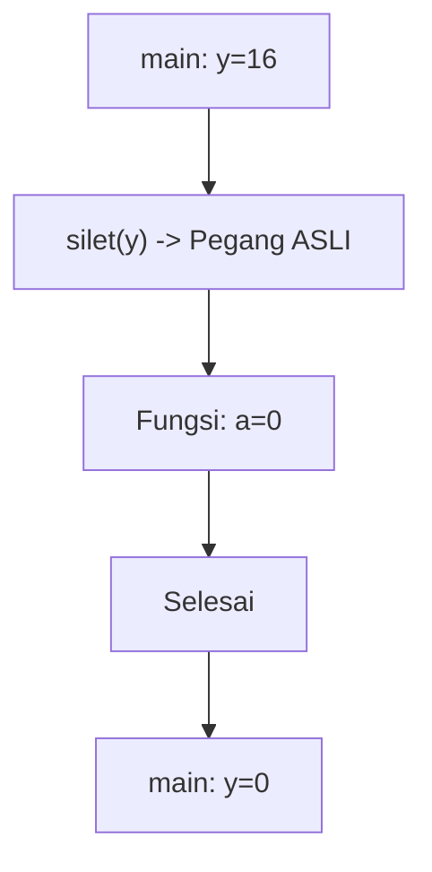

**📖 Cara Membaca Diagram:**
y=16. Karena ada `&`, fungsi `silet` memegang dompet aslimu. Dia pasang 0, maka y di main ikut jadi 0.

---
### Soal 79 (Global vs Local)
```cpp
int skor = 197; // Global

void cek() {
    int skor = 10; // Local
    printf("%d", skor);
}

// output = ?
```
**Pertanyaan:**
1. Angka berapakah yang akan tercetak di layar?
2. Siapa yang lebih berkuasa: skor 197 atau skor 10?
3. Apa istilah untuk variabel lokal yang menutupi variabel global?

**Jawaban & Diagnosis:**
1. **10**
2. **Skor 10 (Lokal/Ketua Kelas) karena letaknya di dalam fungsi.**
3. **Shadowing (Membayangi).**

**Mermaid Flowchart:**
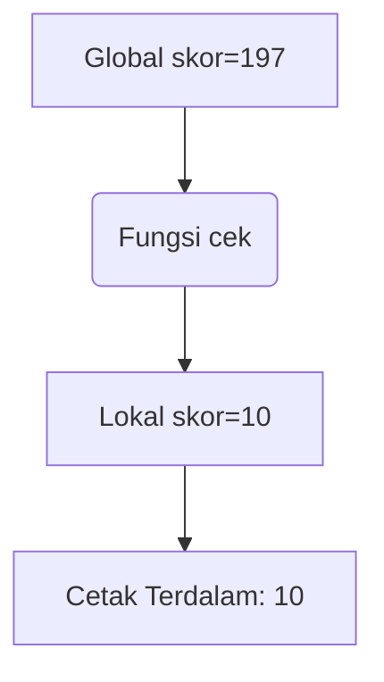

**📖 Cara Membaca Diagram:**
Mesin masuk fungsi. Dia melihat ada dua nama 'skor'. Dia pilih yang terdekat (lokal). Cetak lokal.

---
### Soal 80 (Pass By Reference)
```cpp
void silet(int &a) {
    a = 0;
}

int main() {
    int y = 11;
    silet(y);
    // y = ?
```
**Pertanyaan:**
1. Berapakah nilai variabel `y` di akhir program?
2. Apa tanda yang menunjukkan fungsi ini menggunakan 'Reference'?
3. Analogi apa yang cocok untuk Pass-By-Reference?

**Jawaban & Diagnosis:**
1. **0**
2. **Tanda Amperstand (&) pada parameter `int &a`.**
3. **Memberikan Buku Asli (Kalau dicoret, aslinya rusak).**

**Mermaid Flowchart:**


**📖 Cara Membaca Diagram:**
y=11. Karena ada `&`, fungsi `silet` memegang dompet aslimu. Dia pasang 0, maka y di main ikut jadi 0.

---
### Soal 81 (Swap Trick)
```cpp
void tukar(int &a, int &b) {
    a = a + b;
    b = a - b;
    a = a - b;
}
// main: a=4, b=14; tukar(a,b);
```
**Pertanyaan:**
1. Setelah swap, berapa nilai `a`?
2. Setelah swap, berapa nilai `b`?
3. Kenapa tukar ini berhasil tanpa variabel ketiga?

**Jawaban & Diagnosis:**
1. **14**
2. **4**
3. **Karena menggunakan trik aritmetika (tambah-kurang) untuk membalas nilai.**

**Mermaid Flowchart:**
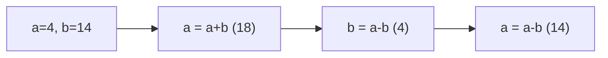

**📖 Cara Membaca Diagram:**
a=4, b=14. a=a+b=18. b=a-b=4=4. a=a-b=14=14. Terbalik!

---
### Soal 82 (Pass By Value)
```cpp
void ubah(int a) {
    a = 100;
}

int main() {
    int x = 50;
    ubah(x);
    // x = ?
```
**Pertanyaan:**
1. Berapakah nilai variabel `x` di dalam `main` setelah fungsi `ubah` selesai?
2. Apa yang terjadi pada variabel `a` di dalam fungsi `ubah`?
3. Analogi apa yang cocok untuk Pass-By-Value?

**Jawaban & Diagnosis:**
1. **50**
2. **Berubah jadi 100, tapi hanya di dalam fungsi tersebut (lokal).**
3. **Fotokopi PR (Dicoret-coret temen gak ngaruh ke buku aslimu).**

**Mermaid Flowchart:**
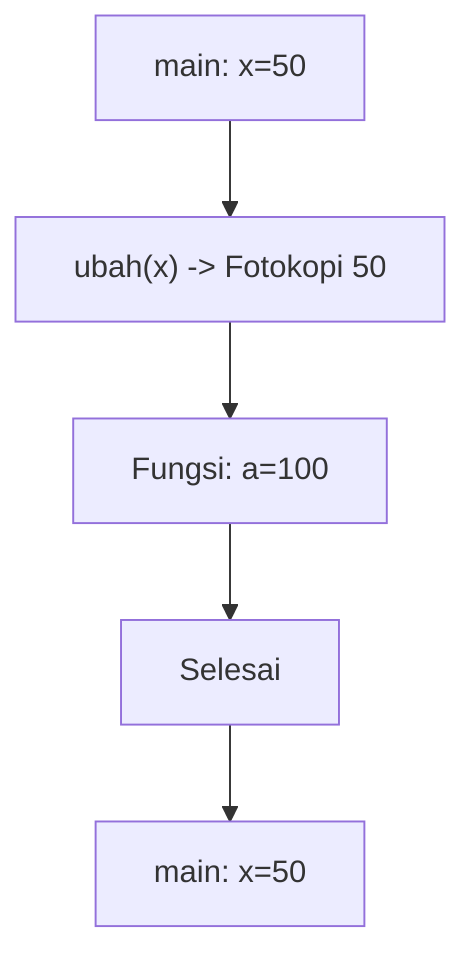

**📖 Cara Membaca Diagram:**
x=50. Saat `ubah(x)`, komputer hanya mengirim fotokopi nilai 50. Fungsi merubah fotokopi jadi 100. Di main, dompet asli x tetap 50.

---
### Soal 83 (Pass By Reference)
```cpp
void silet(int &a) {
    a = 0;
}

int main() {
    int y = 45;
    silet(y);
    // y = ?
```
**Pertanyaan:**
1. Berapakah nilai variabel `y` di akhir program?
2. Apa tanda yang menunjukkan fungsi ini menggunakan 'Reference'?
3. Analogi apa yang cocok untuk Pass-By-Reference?

**Jawaban & Diagnosis:**
1. **0**
2. **Tanda Amperstand (&) pada parameter `int &a`.**
3. **Memberikan Buku Asli (Kalau dicoret, aslinya rusak).**

**Mermaid Flowchart:**


**📖 Cara Membaca Diagram:**
y=45. Karena ada `&`, fungsi `silet` memegang dompet aslimu. Dia pasang 0, maka y di main ikut jadi 0.

---
### Soal 84 (Global vs Local)
```cpp
int skor = 101; // Global

void cek() {
    int skor = 6; // Local
    printf("%d", skor);
}

// output = ?
```
**Pertanyaan:**
1. Angka berapakah yang akan tercetak di layar?
2. Siapa yang lebih berkuasa: skor 101 atau skor 6?
3. Apa istilah untuk variabel lokal yang menutupi variabel global?

**Jawaban & Diagnosis:**
1. **6**
2. **Skor 6 (Lokal/Ketua Kelas) karena letaknya di dalam fungsi.**
3. **Shadowing (Membayangi).**

**Mermaid Flowchart:**


**📖 Cara Membaca Diagram:**
Mesin masuk fungsi. Dia melihat ada dua nama 'skor'. Dia pilih yang terdekat (lokal). Cetak lokal.

---
### Soal 85 (Pass By Value)
```cpp
void ubah(int a) {
    a = 100;
}

int main() {
    int x = 32;
    ubah(x);
    // x = ?
```
**Pertanyaan:**
1. Berapakah nilai variabel `x` di dalam `main` setelah fungsi `ubah` selesai?
2. Apa yang terjadi pada variabel `a` di dalam fungsi `ubah`?
3. Analogi apa yang cocok untuk Pass-By-Value?

**Jawaban & Diagnosis:**
1. **32**
2. **Berubah jadi 100, tapi hanya di dalam fungsi tersebut (lokal).**
3. **Fotokopi PR (Dicoret-coret temen gak ngaruh ke buku aslimu).**

**Mermaid Flowchart:**


**📖 Cara Membaca Diagram:**
x=32. Saat `ubah(x)`, komputer hanya mengirim fotokopi nilai 32. Fungsi merubah fotokopi jadi 100. Di main, dompet asli x tetap 32.

---
### Soal 86 (Global vs Local)
```cpp
int skor = 181; // Global

void cek() {
    int skor = 6; // Local
    printf("%d", skor);
}

// output = ?
```
**Pertanyaan:**
1. Angka berapakah yang akan tercetak di layar?
2. Siapa yang lebih berkuasa: skor 181 atau skor 6?
3. Apa istilah untuk variabel lokal yang menutupi variabel global?

**Jawaban & Diagnosis:**
1. **6**
2. **Skor 6 (Lokal/Ketua Kelas) karena letaknya di dalam fungsi.**
3. **Shadowing (Membayangi).**

**Mermaid Flowchart:**


**📖 Cara Membaca Diagram:**
Mesin masuk fungsi. Dia melihat ada dua nama 'skor'. Dia pilih yang terdekat (lokal). Cetak lokal.

---
### Soal 87 (Pass By Value)
```cpp
void ubah(int a) {
    a = 100;
}

int main() {
    int x = 24;
    ubah(x);
    // x = ?
```
**Pertanyaan:**
1. Berapakah nilai variabel `x` di dalam `main` setelah fungsi `ubah` selesai?
2. Apa yang terjadi pada variabel `a` di dalam fungsi `ubah`?
3. Analogi apa yang cocok untuk Pass-By-Value?

**Jawaban & Diagnosis:**
1. **24**
2. **Berubah jadi 100, tapi hanya di dalam fungsi tersebut (lokal).**
3. **Fotokopi PR (Dicoret-coret temen gak ngaruh ke buku aslimu).**

**Mermaid Flowchart:**
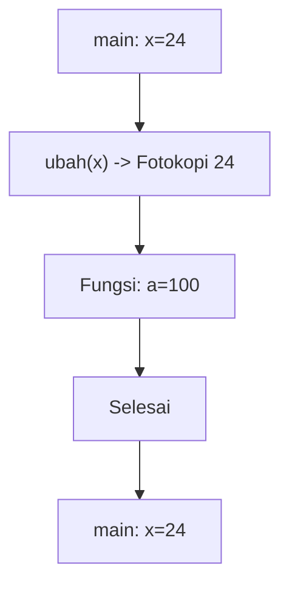

**📖 Cara Membaca Diagram:**
x=24. Saat `ubah(x)`, komputer hanya mengirim fotokopi nilai 24. Fungsi merubah fotokopi jadi 100. Di main, dompet asli x tetap 24.

---
### Soal 88 (Pass By Value)
```cpp
void ubah(int a) {
    a = 100;
}

int main() {
    int x = 23;
    ubah(x);
    // x = ?
```
**Pertanyaan:**
1. Berapakah nilai variabel `x` di dalam `main` setelah fungsi `ubah` selesai?
2. Apa yang terjadi pada variabel `a` di dalam fungsi `ubah`?
3. Analogi apa yang cocok untuk Pass-By-Value?

**Jawaban & Diagnosis:**
1. **23**
2. **Berubah jadi 100, tapi hanya di dalam fungsi tersebut (lokal).**
3. **Fotokopi PR (Dicoret-coret temen gak ngaruh ke buku aslimu).**

**Mermaid Flowchart:**


**📖 Cara Membaca Diagram:**
x=23. Saat `ubah(x)`, komputer hanya mengirim fotokopi nilai 23. Fungsi merubah fotokopi jadi 100. Di main, dompet asli x tetap 23.

---
### Soal 89 (Swap Trick)
```cpp
void tukar(int &a, int &b) {
    a = a + b;
    b = a - b;
    a = a - b;
}
// main: a=10, b=18; tukar(a,b);
```
**Pertanyaan:**
1. Setelah swap, berapa nilai `a`?
2. Setelah swap, berapa nilai `b`?
3. Kenapa tukar ini berhasil tanpa variabel ketiga?

**Jawaban & Diagnosis:**
1. **18**
2. **10**
3. **Karena menggunakan trik aritmetika (tambah-kurang) untuk membalas nilai.**

**Mermaid Flowchart:**
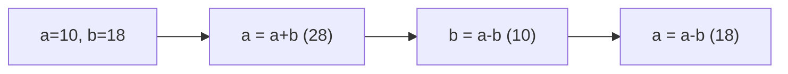

**📖 Cara Membaca Diagram:**
a=10, b=18. a=a+b=28. b=a-b=10=10. a=a-b=18=18. Terbalik!

---
### Soal 90 (Pass By Reference)
```cpp
void silet(int &a) {
    a = 0;
}

int main() {
    int y = 37;
    silet(y);
    // y = ?
```
**Pertanyaan:**
1. Berapakah nilai variabel `y` di akhir program?
2. Apa tanda yang menunjukkan fungsi ini menggunakan 'Reference'?
3. Analogi apa yang cocok untuk Pass-By-Reference?

**Jawaban & Diagnosis:**
1. **0**
2. **Tanda Amperstand (&) pada parameter `int &a`.**
3. **Memberikan Buku Asli (Kalau dicoret, aslinya rusak).**

**Mermaid Flowchart:**


**📖 Cara Membaca Diagram:**
y=37. Karena ada `&`, fungsi `silet` memegang dompet aslimu. Dia pasang 0, maka y di main ikut jadi 0.

---
### Soal 91 (Pass By Reference)
```cpp
void silet(int &a) {
    a = 0;
}

int main() {
    int y = 39;
    silet(y);
    // y = ?
```
**Pertanyaan:**
1. Berapakah nilai variabel `y` di akhir program?
2. Apa tanda yang menunjukkan fungsi ini menggunakan 'Reference'?
3. Analogi apa yang cocok untuk Pass-By-Reference?

**Jawaban & Diagnosis:**
1. **0**
2. **Tanda Amperstand (&) pada parameter `int &a`.**
3. **Memberikan Buku Asli (Kalau dicoret, aslinya rusak).**

**Mermaid Flowchart:**
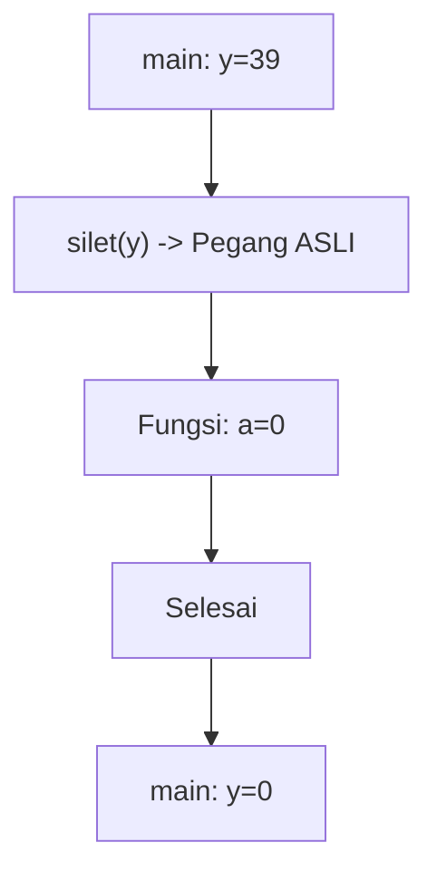

**📖 Cara Membaca Diagram:**
y=39. Karena ada `&`, fungsi `silet` memegang dompet aslimu. Dia pasang 0, maka y di main ikut jadi 0.

---
### Soal 92 (Swap Trick)
```cpp
void tukar(int &a, int &b) {
    a = a + b;
    b = a - b;
    a = a - b;
}
// main: a=2, b=16; tukar(a,b);
```
**Pertanyaan:**
1. Setelah swap, berapa nilai `a`?
2. Setelah swap, berapa nilai `b`?
3. Kenapa tukar ini berhasil tanpa variabel ketiga?

**Jawaban & Diagnosis:**
1. **16**
2. **2**
3. **Karena menggunakan trik aritmetika (tambah-kurang) untuk membalas nilai.**

**Mermaid Flowchart:**
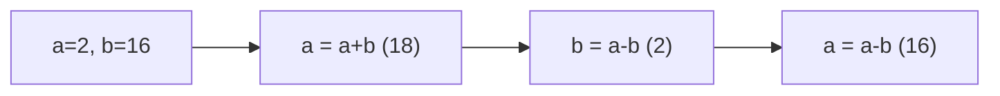

**📖 Cara Membaca Diagram:**
a=2, b=16. a=a+b=18. b=a-b=2=2. a=a-b=16=16. Terbalik!

---
### Soal 93 (Global vs Local)
```cpp
int skor = 145; // Global

void cek() {
    int skor = 7; // Local
    printf("%d", skor);
}

// output = ?
```
**Pertanyaan:**
1. Angka berapakah yang akan tercetak di layar?
2. Siapa yang lebih berkuasa: skor 145 atau skor 7?
3. Apa istilah untuk variabel lokal yang menutupi variabel global?

**Jawaban & Diagnosis:**
1. **7**
2. **Skor 7 (Lokal/Ketua Kelas) karena letaknya di dalam fungsi.**
3. **Shadowing (Membayangi).**

**Mermaid Flowchart:**
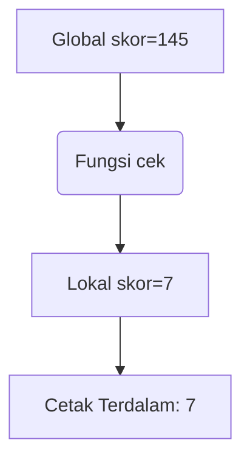

**📖 Cara Membaca Diagram:**
Mesin masuk fungsi. Dia melihat ada dua nama 'skor'. Dia pilih yang terdekat (lokal). Cetak lokal.

---
### Soal 94 (Pass By Value)
```cpp
void ubah(int a) {
    a = 100;
}

int main() {
    int x = 14;
    ubah(x);
    // x = ?
```
**Pertanyaan:**
1. Berapakah nilai variabel `x` di dalam `main` setelah fungsi `ubah` selesai?
2. Apa yang terjadi pada variabel `a` di dalam fungsi `ubah`?
3. Analogi apa yang cocok untuk Pass-By-Value?

**Jawaban & Diagnosis:**
1. **14**
2. **Berubah jadi 100, tapi hanya di dalam fungsi tersebut (lokal).**
3. **Fotokopi PR (Dicoret-coret temen gak ngaruh ke buku aslimu).**

**Mermaid Flowchart:**
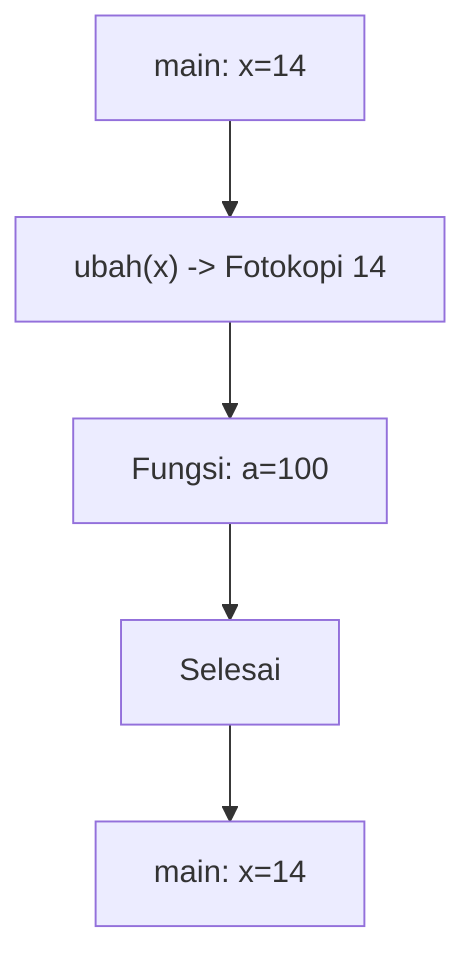

**📖 Cara Membaca Diagram:**
x=14. Saat `ubah(x)`, komputer hanya mengirim fotokopi nilai 14. Fungsi merubah fotokopi jadi 100. Di main, dompet asli x tetap 14.

---
### Soal 95 (Pass By Value)
```cpp
void ubah(int a) {
    a = 100;
}

int main() {
    int x = 29;
    ubah(x);
    // x = ?
```
**Pertanyaan:**
1. Berapakah nilai variabel `x` di dalam `main` setelah fungsi `ubah` selesai?
2. Apa yang terjadi pada variabel `a` di dalam fungsi `ubah`?
3. Analogi apa yang cocok untuk Pass-By-Value?

**Jawaban & Diagnosis:**
1. **29**
2. **Berubah jadi 100, tapi hanya di dalam fungsi tersebut (lokal).**
3. **Fotokopi PR (Dicoret-coret temen gak ngaruh ke buku aslimu).**

**Mermaid Flowchart:**
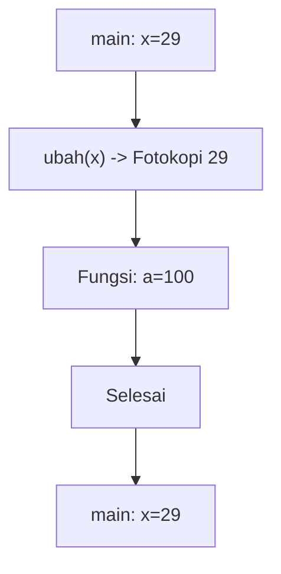

**📖 Cara Membaca Diagram:**
x=29. Saat `ubah(x)`, komputer hanya mengirim fotokopi nilai 29. Fungsi merubah fotokopi jadi 100. Di main, dompet asli x tetap 29.

---
### Soal 96 (Pass By Reference)
```cpp
void silet(int &a) {
    a = 0;
}

int main() {
    int y = 21;
    silet(y);
    // y = ?
```
**Pertanyaan:**
1. Berapakah nilai variabel `y` di akhir program?
2. Apa tanda yang menunjukkan fungsi ini menggunakan 'Reference'?
3. Analogi apa yang cocok untuk Pass-By-Reference?

**Jawaban & Diagnosis:**
1. **0**
2. **Tanda Amperstand (&) pada parameter `int &a`.**
3. **Memberikan Buku Asli (Kalau dicoret, aslinya rusak).**

**Mermaid Flowchart:**
```mermaid
graph TD
    A[main: y=21] --> B["silet(y) -> Pegang ASLI"]
    B --> C[Fungsi: a=0]
    C --> D[Selesai]
    D --> E[main: y=0]
```

**📖 Cara Membaca Diagram:**
y=21. Karena ada `&`, fungsi `silet` memegang dompet aslimu. Dia pasang 0, maka y di main ikut jadi 0.

---
### Soal 97 (Pass By Reference)
```cpp
void silet(int &a) {
    a = 0;
}

int main() {
    int y = 29;
    silet(y);
    // y = ?
```
**Pertanyaan:**
1. Berapakah nilai variabel `y` di akhir program?
2. Apa tanda yang menunjukkan fungsi ini menggunakan 'Reference'?
3. Analogi apa yang cocok untuk Pass-By-Reference?

**Jawaban & Diagnosis:**
1. **0**
2. **Tanda Amperstand (&) pada parameter `int &a`.**
3. **Memberikan Buku Asli (Kalau dicoret, aslinya rusak).**

**Mermaid Flowchart:**
```mermaid
graph TD
    A[main: y=29] --> B["silet(y) -> Pegang ASLI"]
    B --> C[Fungsi: a=0]
    C --> D[Selesai]
    D --> E[main: y=0]
```

**📖 Cara Membaca Diagram:**
y=29. Karena ada `&`, fungsi `silet` memegang dompet aslimu. Dia pasang 0, maka y di main ikut jadi 0.

---
### Soal 98 (Pass By Reference)
```cpp
void silet(int &a) {
    a = 0;
}

int main() {
    int y = 23;
    silet(y);
    // y = ?
```
**Pertanyaan:**
1. Berapakah nilai variabel `y` di akhir program?
2. Apa tanda yang menunjukkan fungsi ini menggunakan 'Reference'?
3. Analogi apa yang cocok untuk Pass-By-Reference?

**Jawaban & Diagnosis:**
1. **0**
2. **Tanda Amperstand (&) pada parameter `int &a`.**
3. **Memberikan Buku Asli (Kalau dicoret, aslinya rusak).**

**Mermaid Flowchart:**
```mermaid
graph TD
    A[main: y=23] --> B["silet(y) -> Pegang ASLI"]
    B --> C[Fungsi: a=0]
    C --> D[Selesai]
    D --> E[main: y=0]
```

**📖 Cara Membaca Diagram:**
y=23. Karena ada `&`, fungsi `silet` memegang dompet aslimu. Dia pasang 0, maka y di main ikut jadi 0.

---
### Soal 99 (Swap Trick)
```cpp
void tukar(int &a, int &b) {
    a = a + b;
    b = a - b;
    a = a - b;
}
// main: a=2, b=12; tukar(a,b);
```
**Pertanyaan:**
1. Setelah swap, berapa nilai `a`?
2. Setelah swap, berapa nilai `b`?
3. Kenapa tukar ini berhasil tanpa variabel ketiga?

**Jawaban & Diagnosis:**
1. **12**
2. **2**
3. **Karena menggunakan trik aritmetika (tambah-kurang) untuk membalas nilai.**

**Mermaid Flowchart:**
```mermaid
graph LR
    A["a=2, b=12"] --> B["a = a+b (14)"]
    B --> C["b = a-b (2)"]
    C --> D["a = a-b (12)"]
```

**📖 Cara Membaca Diagram:**
a=2, b=12. a=a+b=14. b=a-b=2=2. a=a-b=12=12. Terbalik!

---
### Soal 100 (Swap Trick)
```cpp
void tukar(int &a, int &b) {
    a = a + b;
    b = a - b;
    a = a - b;
}
// main: a=5, b=20; tukar(a,b);
```
**Pertanyaan:**
1. Setelah swap, berapa nilai `a`?
2. Setelah swap, berapa nilai `b`?
3. Kenapa tukar ini berhasil tanpa variabel ketiga?

**Jawaban & Diagnosis:**
1. **20**
2. **5**
3. **Karena menggunakan trik aritmetika (tambah-kurang) untuk membalas nilai.**

**Mermaid Flowchart:**
```mermaid
graph LR
    A["a=5, b=20"] --> B["a = a+b (25)"]
    B --> C["b = a-b (5)"]
    C --> D["a = a-b (20)"]
```

**📖 Cara Membaca Diagram:**
a=5, b=20. a=a+b=25. b=a-b=5=5. a=a-b=20=20. Terbalik!

---
