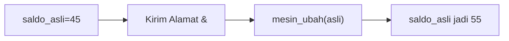
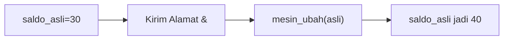
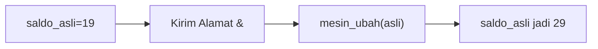
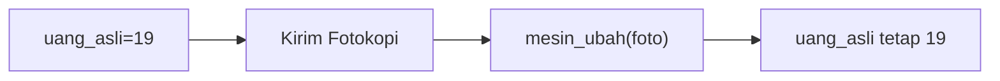
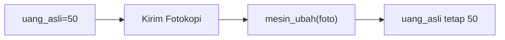
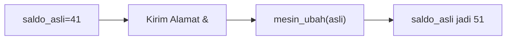
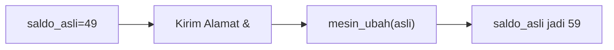
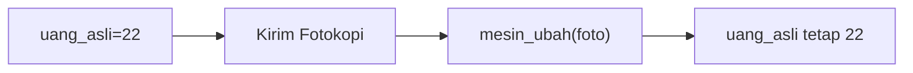
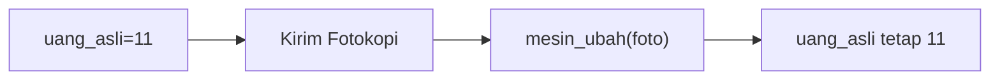
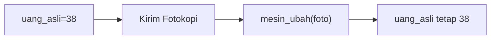

🔙 **[Kembali ke Daftar Soal](./README.md)**

---

# Latihan Soal Part C - Modul 04 - Set 04

### Soal 76
```cpp
void mesin_ajaib(int &a) { a = a + 10; }
// main: int saldo = 13; mesin_ajaib(saldo);
```
**Pertanyaan:**
1. Berapakah hasil akhirnya?
2. Deskripsikan langkah robot compiler saat memproses kode ini!

**Jawaban & Diagnosis:**
1. **23**
2. Baca bagian 'Analisis Mendalam' di bawah.

**Mermaid Flowchart:**


**📖 Penjelasan Komprehensif:**
**Analisis Mendalam (Compiler Manusia):**
1. **Pass-by-Reference**: Tanda `&` memberikan kunci akses langsung ke variabel `saldo`.
2. **Efek**: Apa pun yang dilakukan fungsi pada `a` langsung merubah isi fisik memori `saldo`.
3. **Hasil Akhir**: `saldo` bertambah jadi **23**.

---
### Soal 77
```cpp
void mesin_ajaib(int &a) { a = a + 10; }
// main: int saldo = 45; mesin_ajaib(saldo);
```
**Pertanyaan:**
1. Berapakah hasil akhirnya?
2. Deskripsikan langkah robot compiler saat memproses kode ini!

**Jawaban & Diagnosis:**
1. **55**
2. Baca bagian 'Analisis Mendalam' di bawah.

**Mermaid Flowchart:**


**📖 Penjelasan Komprehensif:**
**Analisis Mendalam (Compiler Manusia):**
1. **Pass-by-Reference**: Tanda `&` memberikan kunci akses langsung ke variabel `saldo`.
2. **Efek**: Apa pun yang dilakukan fungsi pada `a` langsung merubah isi fisik memori `saldo`.
3. **Hasil Akhir**: `saldo` bertambah jadi **55**.

---
### Soal 78
```cpp
void mesin_ajaib(int &a) { a = a + 10; }
// main: int saldo = 30; mesin_ajaib(saldo);
```
**Pertanyaan:**
1. Berapakah hasil akhirnya?
2. Deskripsikan langkah robot compiler saat memproses kode ini!

**Jawaban & Diagnosis:**
1. **40**
2. Baca bagian 'Analisis Mendalam' di bawah.

**Mermaid Flowchart:**


**📖 Penjelasan Komprehensif:**
**Analisis Mendalam (Compiler Manusia):**
1. **Pass-by-Reference**: Tanda `&` memberikan kunci akses langsung ke variabel `saldo`.
2. **Efek**: Apa pun yang dilakukan fungsi pada `a` langsung merubah isi fisik memori `saldo`.
3. **Hasil Akhir**: `saldo` bertambah jadi **40**.

---
### Soal 79
```cpp
void mesin_ajaib(int &a) { a = a + 10; }
// main: int saldo = 19; mesin_ajaib(saldo);
```
**Pertanyaan:**
1. Berapakah hasil akhirnya?
2. Deskripsikan langkah robot compiler saat memproses kode ini!

**Jawaban & Diagnosis:**
1. **29**
2. Baca bagian 'Analisis Mendalam' di bawah.

**Mermaid Flowchart:**


**📖 Penjelasan Komprehensif:**
**Analisis Mendalam (Compiler Manusia):**
1. **Pass-by-Reference**: Tanda `&` memberikan kunci akses langsung ke variabel `saldo`.
2. **Efek**: Apa pun yang dilakukan fungsi pada `a` langsung merubah isi fisik memori `saldo`.
3. **Hasil Akhir**: `saldo` bertambah jadi **29**.

---
### Soal 80
```cpp
void mesin_foto(int a) { a = a + 100; }
// main: int uang = 19; mesin_foto(uang);
```
**Pertanyaan:**
1. Berapakah hasil akhirnya?
2. Deskripsikan langkah robot compiler saat memproses kode ini!

**Jawaban & Diagnosis:**
1. **19**
2. Baca bagian 'Analisis Mendalam' di bawah.

**Mermaid Flowchart:**


**📖 Penjelasan Komprehensif:**
**Analisis Mendalam (Compiler Manusia):**
1. **Pass-by-Value**: Variabel `uang` hanya mengirim salinannya ke fungsi.
2. **Efek**: Fungsi mengacak-acak salinan tersebut (tambah 100), tapi tidak menyentuh dompet aslimu.
3. **Hasil Akhir**: Nilai `uang` di main tetap **19**.

---
### Soal 81
```cpp
void mesin_ajaib(int &a) { a = a + 10; }
// main: int saldo = 27; mesin_ajaib(saldo);
```
**Pertanyaan:**
1. Berapakah hasil akhirnya?
2. Deskripsikan langkah robot compiler saat memproses kode ini!

**Jawaban & Diagnosis:**
1. **37**
2. Baca bagian 'Analisis Mendalam' di bawah.

**Mermaid Flowchart:**


**📖 Penjelasan Komprehensif:**
**Analisis Mendalam (Compiler Manusia):**
1. **Pass-by-Reference**: Tanda `&` memberikan kunci akses langsung ke variabel `saldo`.
2. **Efek**: Apa pun yang dilakukan fungsi pada `a` langsung merubah isi fisik memori `saldo`.
3. **Hasil Akhir**: `saldo` bertambah jadi **37**.

---
### Soal 82
```cpp
void mesin_ajaib(int &a) { a = a + 10; }
// main: int saldo = 15; mesin_ajaib(saldo);
```
**Pertanyaan:**
1. Berapakah hasil akhirnya?
2. Deskripsikan langkah robot compiler saat memproses kode ini!

**Jawaban & Diagnosis:**
1. **25**
2. Baca bagian 'Analisis Mendalam' di bawah.

**Mermaid Flowchart:**


**📖 Penjelasan Komprehensif:**
**Analisis Mendalam (Compiler Manusia):**
1. **Pass-by-Reference**: Tanda `&` memberikan kunci akses langsung ke variabel `saldo`.
2. **Efek**: Apa pun yang dilakukan fungsi pada `a` langsung merubah isi fisik memori `saldo`.
3. **Hasil Akhir**: `saldo` bertambah jadi **25**.

---
### Soal 83
```cpp
void mesin_foto(int a) { a = a + 100; }
// main: int uang = 50; mesin_foto(uang);
```
**Pertanyaan:**
1. Berapakah hasil akhirnya?
2. Deskripsikan langkah robot compiler saat memproses kode ini!

**Jawaban & Diagnosis:**
1. **50**
2. Baca bagian 'Analisis Mendalam' di bawah.

**Mermaid Flowchart:**


**📖 Penjelasan Komprehensif:**
**Analisis Mendalam (Compiler Manusia):**
1. **Pass-by-Value**: Variabel `uang` hanya mengirim salinannya ke fungsi.
2. **Efek**: Fungsi mengacak-acak salinan tersebut (tambah 100), tapi tidak menyentuh dompet aslimu.
3. **Hasil Akhir**: Nilai `uang` di main tetap **50**.

---
### Soal 84
```cpp
void mesin_foto(int a) { a = a + 100; }
// main: int uang = 19; mesin_foto(uang);
```
**Pertanyaan:**
1. Berapakah hasil akhirnya?
2. Deskripsikan langkah robot compiler saat memproses kode ini!

**Jawaban & Diagnosis:**
1. **19**
2. Baca bagian 'Analisis Mendalam' di bawah.

**Mermaid Flowchart:**


**📖 Penjelasan Komprehensif:**
**Analisis Mendalam (Compiler Manusia):**
1. **Pass-by-Value**: Variabel `uang` hanya mengirim salinannya ke fungsi.
2. **Efek**: Fungsi mengacak-acak salinan tersebut (tambah 100), tapi tidak menyentuh dompet aslimu.
3. **Hasil Akhir**: Nilai `uang` di main tetap **19**.

---
### Soal 85
```cpp
void mesin_ajaib(int &a) { a = a + 10; }
// main: int saldo = 41; mesin_ajaib(saldo);
```
**Pertanyaan:**
1. Berapakah hasil akhirnya?
2. Deskripsikan langkah robot compiler saat memproses kode ini!

**Jawaban & Diagnosis:**
1. **51**
2. Baca bagian 'Analisis Mendalam' di bawah.

**Mermaid Flowchart:**


**📖 Penjelasan Komprehensif:**
**Analisis Mendalam (Compiler Manusia):**
1. **Pass-by-Reference**: Tanda `&` memberikan kunci akses langsung ke variabel `saldo`.
2. **Efek**: Apa pun yang dilakukan fungsi pada `a` langsung merubah isi fisik memori `saldo`.
3. **Hasil Akhir**: `saldo` bertambah jadi **51**.

---
### Soal 86
```cpp
void mesin_ajaib(int &a) { a = a + 10; }
// main: int saldo = 43; mesin_ajaib(saldo);
```
**Pertanyaan:**
1. Berapakah hasil akhirnya?
2. Deskripsikan langkah robot compiler saat memproses kode ini!

**Jawaban & Diagnosis:**
1. **53**
2. Baca bagian 'Analisis Mendalam' di bawah.

**Mermaid Flowchart:**


**📖 Penjelasan Komprehensif:**
**Analisis Mendalam (Compiler Manusia):**
1. **Pass-by-Reference**: Tanda `&` memberikan kunci akses langsung ke variabel `saldo`.
2. **Efek**: Apa pun yang dilakukan fungsi pada `a` langsung merubah isi fisik memori `saldo`.
3. **Hasil Akhir**: `saldo` bertambah jadi **53**.

---
### Soal 87
```cpp
void mesin_foto(int a) { a = a + 100; }
// main: int uang = 45; mesin_foto(uang);
```
**Pertanyaan:**
1. Berapakah hasil akhirnya?
2. Deskripsikan langkah robot compiler saat memproses kode ini!

**Jawaban & Diagnosis:**
1. **45**
2. Baca bagian 'Analisis Mendalam' di bawah.

**Mermaid Flowchart:**


**📖 Penjelasan Komprehensif:**
**Analisis Mendalam (Compiler Manusia):**
1. **Pass-by-Value**: Variabel `uang` hanya mengirim salinannya ke fungsi.
2. **Efek**: Fungsi mengacak-acak salinan tersebut (tambah 100), tapi tidak menyentuh dompet aslimu.
3. **Hasil Akhir**: Nilai `uang` di main tetap **45**.

---
### Soal 88
```cpp
void mesin_ajaib(int &a) { a = a + 10; }
// main: int saldo = 49; mesin_ajaib(saldo);
```
**Pertanyaan:**
1. Berapakah hasil akhirnya?
2. Deskripsikan langkah robot compiler saat memproses kode ini!

**Jawaban & Diagnosis:**
1. **59**
2. Baca bagian 'Analisis Mendalam' di bawah.

**Mermaid Flowchart:**


**📖 Penjelasan Komprehensif:**
**Analisis Mendalam (Compiler Manusia):**
1. **Pass-by-Reference**: Tanda `&` memberikan kunci akses langsung ke variabel `saldo`.
2. **Efek**: Apa pun yang dilakukan fungsi pada `a` langsung merubah isi fisik memori `saldo`.
3. **Hasil Akhir**: `saldo` bertambah jadi **59**.

---
### Soal 89
```cpp
void mesin_ajaib(int &a) { a = a + 10; }
// main: int saldo = 12; mesin_ajaib(saldo);
```
**Pertanyaan:**
1. Berapakah hasil akhirnya?
2. Deskripsikan langkah robot compiler saat memproses kode ini!

**Jawaban & Diagnosis:**
1. **22**
2. Baca bagian 'Analisis Mendalam' di bawah.

**Mermaid Flowchart:**


**📖 Penjelasan Komprehensif:**
**Analisis Mendalam (Compiler Manusia):**
1. **Pass-by-Reference**: Tanda `&` memberikan kunci akses langsung ke variabel `saldo`.
2. **Efek**: Apa pun yang dilakukan fungsi pada `a` langsung merubah isi fisik memori `saldo`.
3. **Hasil Akhir**: `saldo` bertambah jadi **22**.

---
### Soal 90
```cpp
void mesin_foto(int a) { a = a + 100; }
// main: int uang = 22; mesin_foto(uang);
```
**Pertanyaan:**
1. Berapakah hasil akhirnya?
2. Deskripsikan langkah robot compiler saat memproses kode ini!

**Jawaban & Diagnosis:**
1. **22**
2. Baca bagian 'Analisis Mendalam' di bawah.

**Mermaid Flowchart:**


**📖 Penjelasan Komprehensif:**
**Analisis Mendalam (Compiler Manusia):**
1. **Pass-by-Value**: Variabel `uang` hanya mengirim salinannya ke fungsi.
2. **Efek**: Fungsi mengacak-acak salinan tersebut (tambah 100), tapi tidak menyentuh dompet aslimu.
3. **Hasil Akhir**: Nilai `uang` di main tetap **22**.

---
### Soal 91
```cpp
void mesin_foto(int a) { a = a + 100; }
// main: int uang = 45; mesin_foto(uang);
```
**Pertanyaan:**
1. Berapakah hasil akhirnya?
2. Deskripsikan langkah robot compiler saat memproses kode ini!

**Jawaban & Diagnosis:**
1. **45**
2. Baca bagian 'Analisis Mendalam' di bawah.

**Mermaid Flowchart:**


**📖 Penjelasan Komprehensif:**
**Analisis Mendalam (Compiler Manusia):**
1. **Pass-by-Value**: Variabel `uang` hanya mengirim salinannya ke fungsi.
2. **Efek**: Fungsi mengacak-acak salinan tersebut (tambah 100), tapi tidak menyentuh dompet aslimu.
3. **Hasil Akhir**: Nilai `uang` di main tetap **45**.

---
### Soal 92
```cpp
void mesin_foto(int a) { a = a + 100; }
// main: int uang = 13; mesin_foto(uang);
```
**Pertanyaan:**
1. Berapakah hasil akhirnya?
2. Deskripsikan langkah robot compiler saat memproses kode ini!

**Jawaban & Diagnosis:**
1. **13**
2. Baca bagian 'Analisis Mendalam' di bawah.

**Mermaid Flowchart:**


**📖 Penjelasan Komprehensif:**
**Analisis Mendalam (Compiler Manusia):**
1. **Pass-by-Value**: Variabel `uang` hanya mengirim salinannya ke fungsi.
2. **Efek**: Fungsi mengacak-acak salinan tersebut (tambah 100), tapi tidak menyentuh dompet aslimu.
3. **Hasil Akhir**: Nilai `uang` di main tetap **13**.

---
### Soal 93
```cpp
void mesin_foto(int a) { a = a + 100; }
// main: int uang = 11; mesin_foto(uang);
```
**Pertanyaan:**
1. Berapakah hasil akhirnya?
2. Deskripsikan langkah robot compiler saat memproses kode ini!

**Jawaban & Diagnosis:**
1. **11**
2. Baca bagian 'Analisis Mendalam' di bawah.

**Mermaid Flowchart:**


**📖 Penjelasan Komprehensif:**
**Analisis Mendalam (Compiler Manusia):**
1. **Pass-by-Value**: Variabel `uang` hanya mengirim salinannya ke fungsi.
2. **Efek**: Fungsi mengacak-acak salinan tersebut (tambah 100), tapi tidak menyentuh dompet aslimu.
3. **Hasil Akhir**: Nilai `uang` di main tetap **11**.

---
### Soal 94
```cpp
void mesin_foto(int a) { a = a + 100; }
// main: int uang = 38; mesin_foto(uang);
```
**Pertanyaan:**
1. Berapakah hasil akhirnya?
2. Deskripsikan langkah robot compiler saat memproses kode ini!

**Jawaban & Diagnosis:**
1. **38**
2. Baca bagian 'Analisis Mendalam' di bawah.

**Mermaid Flowchart:**


**📖 Penjelasan Komprehensif:**
**Analisis Mendalam (Compiler Manusia):**
1. **Pass-by-Value**: Variabel `uang` hanya mengirim salinannya ke fungsi.
2. **Efek**: Fungsi mengacak-acak salinan tersebut (tambah 100), tapi tidak menyentuh dompet aslimu.
3. **Hasil Akhir**: Nilai `uang` di main tetap **38**.

---
### Soal 95
```cpp
void mesin_ajaib(int &a) { a = a + 10; }
// main: int saldo = 36; mesin_ajaib(saldo);
```
**Pertanyaan:**
1. Berapakah hasil akhirnya?
2. Deskripsikan langkah robot compiler saat memproses kode ini!

**Jawaban & Diagnosis:**
1. **46**
2. Baca bagian 'Analisis Mendalam' di bawah.

**Mermaid Flowchart:**


**📖 Penjelasan Komprehensif:**
**Analisis Mendalam (Compiler Manusia):**
1. **Pass-by-Reference**: Tanda `&` memberikan kunci akses langsung ke variabel `saldo`.
2. **Efek**: Apa pun yang dilakukan fungsi pada `a` langsung merubah isi fisik memori `saldo`.
3. **Hasil Akhir**: `saldo` bertambah jadi **46**.

---
### Soal 96
```cpp
void mesin_foto(int a) { a = a + 100; }
// main: int uang = 14; mesin_foto(uang);
```
**Pertanyaan:**
1. Berapakah hasil akhirnya?
2. Deskripsikan langkah robot compiler saat memproses kode ini!

**Jawaban & Diagnosis:**
1. **14**
2. Baca bagian 'Analisis Mendalam' di bawah.

**Mermaid Flowchart:**
```mermaid
graph LR
A["uang_asli=14"] --> B["Kirim Fotokopi"]
B --> C["mesin_ubah(foto)"]
C --> D["uang_asli tetap 14"]
```

**📖 Penjelasan Komprehensif:**
**Analisis Mendalam (Compiler Manusia):**
1. **Pass-by-Value**: Variabel `uang` hanya mengirim salinannya ke fungsi.
2. **Efek**: Fungsi mengacak-acak salinan tersebut (tambah 100), tapi tidak menyentuh dompet aslimu.
3. **Hasil Akhir**: Nilai `uang` di main tetap **14**.

---
### Soal 97
```cpp
void mesin_foto(int a) { a = a + 100; }
// main: int uang = 15; mesin_foto(uang);
```
**Pertanyaan:**
1. Berapakah hasil akhirnya?
2. Deskripsikan langkah robot compiler saat memproses kode ini!

**Jawaban & Diagnosis:**
1. **15**
2. Baca bagian 'Analisis Mendalam' di bawah.

**Mermaid Flowchart:**
```mermaid
graph LR
A["uang_asli=15"] --> B["Kirim Fotokopi"]
B --> C["mesin_ubah(foto)"]
C --> D["uang_asli tetap 15"]
```

**📖 Penjelasan Komprehensif:**
**Analisis Mendalam (Compiler Manusia):**
1. **Pass-by-Value**: Variabel `uang` hanya mengirim salinannya ke fungsi.
2. **Efek**: Fungsi mengacak-acak salinan tersebut (tambah 100), tapi tidak menyentuh dompet aslimu.
3. **Hasil Akhir**: Nilai `uang` di main tetap **15**.

---
### Soal 98
```cpp
void mesin_ajaib(int &a) { a = a + 10; }
// main: int saldo = 14; mesin_ajaib(saldo);
```
**Pertanyaan:**
1. Berapakah hasil akhirnya?
2. Deskripsikan langkah robot compiler saat memproses kode ini!

**Jawaban & Diagnosis:**
1. **24**
2. Baca bagian 'Analisis Mendalam' di bawah.

**Mermaid Flowchart:**
```mermaid
graph LR
A["saldo_asli=14"] --> B["Kirim Alamat &"]
B --> C["mesin_ubah(asli)"]
C --> D["saldo_asli jadi 24"]
```

**📖 Penjelasan Komprehensif:**
**Analisis Mendalam (Compiler Manusia):**
1. **Pass-by-Reference**: Tanda `&` memberikan kunci akses langsung ke variabel `saldo`.
2. **Efek**: Apa pun yang dilakukan fungsi pada `a` langsung merubah isi fisik memori `saldo`.
3. **Hasil Akhir**: `saldo` bertambah jadi **24**.

---
### Soal 99
```cpp
void mesin_ajaib(int &a) { a = a + 10; }
// main: int saldo = 48; mesin_ajaib(saldo);
```
**Pertanyaan:**
1. Berapakah hasil akhirnya?
2. Deskripsikan langkah robot compiler saat memproses kode ini!

**Jawaban & Diagnosis:**
1. **58**
2. Baca bagian 'Analisis Mendalam' di bawah.

**Mermaid Flowchart:**
```mermaid
graph LR
A["saldo_asli=48"] --> B["Kirim Alamat &"]
B --> C["mesin_ubah(asli)"]
C --> D["saldo_asli jadi 58"]
```

**📖 Penjelasan Komprehensif:**
**Analisis Mendalam (Compiler Manusia):**
1. **Pass-by-Reference**: Tanda `&` memberikan kunci akses langsung ke variabel `saldo`.
2. **Efek**: Apa pun yang dilakukan fungsi pada `a` langsung merubah isi fisik memori `saldo`.
3. **Hasil Akhir**: `saldo` bertambah jadi **58**.

---
### Soal 100
```cpp
void mesin_ajaib(int &a) { a = a + 10; }
// main: int saldo = 27; mesin_ajaib(saldo);
```
**Pertanyaan:**
1. Berapakah hasil akhirnya?
2. Deskripsikan langkah robot compiler saat memproses kode ini!

**Jawaban & Diagnosis:**
1. **37**
2. Baca bagian 'Analisis Mendalam' di bawah.

**Mermaid Flowchart:**
```mermaid
graph LR
A["saldo_asli=27"] --> B["Kirim Alamat &"]
B --> C["mesin_ubah(asli)"]
C --> D["saldo_asli jadi 37"]
```

**📖 Penjelasan Komprehensif:**
**Analisis Mendalam (Compiler Manusia):**
1. **Pass-by-Reference**: Tanda `&` memberikan kunci akses langsung ke variabel `saldo`.
2. **Efek**: Apa pun yang dilakukan fungsi pada `a` langsung merubah isi fisik memori `saldo`.
3. **Hasil Akhir**: `saldo` bertambah jadi **37**.

---
