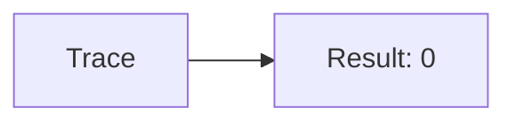
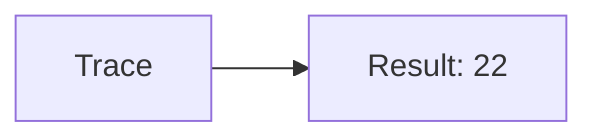
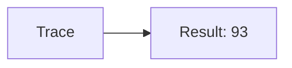
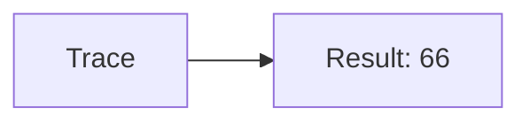

🔙 **[Kembali ke Daftar Soal](./README.md)**

---

# Latihan Soal Part C - Modul 04 - Set 04

### Soal 76
```cpp
// Gps: Pass-by-Reference
void reset(int &x) { x = 0; }
// main: int gps=11;
reset(gps);
```
**Pertanyaan:**
1. Berapakah hasil akhirnya?
2. Deskripsikan alur pikir 'Compiler Manusia' untuk soal ini!

**Jawaban & Diagnosis:**
1. **0**
2. Reference '&' dikirim alamat aslinya. 'Gps' ter-reset jadi 0.

**Mermaid Flowchart:**


---
### Soal 77
```cpp
// Sms: Pass-by-Value
void ubah(int x) { x = 0; }
// main: int sms=22;
ubah(sms);
```
**Pertanyaan:**
1. Berapakah hasil akhirnya?
2. Deskripsikan alur pikir 'Compiler Manusia' untuk soal ini!

**Jawaban & Diagnosis:**
1. **22**
2. Value 'Sms' dikirim fotokopinya. Aslinya tetap 22.

**Mermaid Flowchart:**


---
### Soal 78
```cpp
// Call: Pass-by-Reference
void reset(int &x) { x = 0; }
// main: int call=19;
reset(call);
```
**Pertanyaan:**
1. Berapakah hasil akhirnya?
2. Deskripsikan alur pikir 'Compiler Manusia' untuk soal ini!

**Jawaban & Diagnosis:**
1. **0**
2. Reference '&' dikirim alamat aslinya. 'Call' ter-reset jadi 0.

**Mermaid Flowchart:**


---
### Soal 79
```cpp
// Mail: Pass-by-Value
void ubah(int x) { x = 0; }
// main: int mail=97;
ubah(mail);
```
**Pertanyaan:**
1. Berapakah hasil akhirnya?
2. Deskripsikan alur pikir 'Compiler Manusia' untuk soal ini!

**Jawaban & Diagnosis:**
1. **97**
2. Value 'Mail' dikirim fotokopinya. Aslinya tetap 97.

**Mermaid Flowchart:**


---
### Soal 80
```cpp
// Chat: Pass-by-Reference
void reset(int &x) { x = 0; }
// main: int chat=38;
reset(chat);
```
**Pertanyaan:**
1. Berapakah hasil akhirnya?
2. Deskripsikan alur pikir 'Compiler Manusia' untuk soal ini!

**Jawaban & Diagnosis:**
1. **0**
2. Reference '&' dikirim alamat aslinya. 'Chat' ter-reset jadi 0.

**Mermaid Flowchart:**


---
### Soal 81
```cpp
// Video: Pass-by-Value
void ubah(int x) { x = 0; }
// main: int video=79;
ubah(video);
```
**Pertanyaan:**
1. Berapakah hasil akhirnya?
2. Deskripsikan alur pikir 'Compiler Manusia' untuk soal ini!

**Jawaban & Diagnosis:**
1. **79**
2. Value 'Video' dikirim fotokopinya. Aslinya tetap 79.

**Mermaid Flowchart:**


---
### Soal 82
```cpp
// Photo: Pass-by-Reference
void reset(int &x) { x = 0; }
// main: int photo=29;
reset(photo);
```
**Pertanyaan:**
1. Berapakah hasil akhirnya?
2. Deskripsikan alur pikir 'Compiler Manusia' untuk soal ini!

**Jawaban & Diagnosis:**
1. **0**
2. Reference '&' dikirim alamat aslinya. 'Photo' ter-reset jadi 0.

**Mermaid Flowchart:**


---
### Soal 83
```cpp
// Audio: Pass-by-Value
void ubah(int x) { x = 0; }
// main: int audio=65;
ubah(audio);
```
**Pertanyaan:**
1. Berapakah hasil akhirnya?
2. Deskripsikan alur pikir 'Compiler Manusia' untuk soal ini!

**Jawaban & Diagnosis:**
1. **65**
2. Value 'Audio' dikirim fotokopinya. Aslinya tetap 65.

**Mermaid Flowchart:**


---
### Soal 84
```cpp
// Music: Pass-by-Reference
void reset(int &x) { x = 0; }
// main: int music=17;
reset(music);
```
**Pertanyaan:**
1. Berapakah hasil akhirnya?
2. Deskripsikan alur pikir 'Compiler Manusia' untuk soal ini!

**Jawaban & Diagnosis:**
1. **0**
2. Reference '&' dikirim alamat aslinya. 'Music' ter-reset jadi 0.

**Mermaid Flowchart:**


---
### Soal 85
```cpp
// Movie: Pass-by-Value
void ubah(int x) { x = 0; }
// main: int movie=93;
ubah(movie);
```
**Pertanyaan:**
1. Berapakah hasil akhirnya?
2. Deskripsikan alur pikir 'Compiler Manusia' untuk soal ini!

**Jawaban & Diagnosis:**
1. **93**
2. Value 'Movie' dikirim fotokopinya. Aslinya tetap 93.

**Mermaid Flowchart:**


---
### Soal 86
```cpp
// Game: Pass-by-Reference
void reset(int &x) { x = 0; }
// main: int game=52;
reset(game);
```
**Pertanyaan:**
1. Berapakah hasil akhirnya?
2. Deskripsikan alur pikir 'Compiler Manusia' untuk soal ini!

**Jawaban & Diagnosis:**
1. **0**
2. Reference '&' dikirim alamat aslinya. 'Game' ter-reset jadi 0.

**Mermaid Flowchart:**


---
### Soal 87
```cpp
// App: Pass-by-Value
void ubah(int x) { x = 0; }
// main: int app=97;
ubah(app);
```
**Pertanyaan:**
1. Berapakah hasil akhirnya?
2. Deskripsikan alur pikir 'Compiler Manusia' untuk soal ini!

**Jawaban & Diagnosis:**
1. **97**
2. Value 'App' dikirim fotokopinya. Aslinya tetap 97.

**Mermaid Flowchart:**


---
### Soal 88
```cpp
// Web: Pass-by-Reference
void reset(int &x) { x = 0; }
// main: int web=36;
reset(web);
```
**Pertanyaan:**
1. Berapakah hasil akhirnya?
2. Deskripsikan alur pikir 'Compiler Manusia' untuk soal ini!

**Jawaban & Diagnosis:**
1. **0**
2. Reference '&' dikirim alamat aslinya. 'Web' ter-reset jadi 0.

**Mermaid Flowchart:**


---
### Soal 89
```cpp
// Cloud: Pass-by-Value
void ubah(int x) { x = 0; }
// main: int cloud=58;
ubah(cloud);
```
**Pertanyaan:**
1. Berapakah hasil akhirnya?
2. Deskripsikan alur pikir 'Compiler Manusia' untuk soal ini!

**Jawaban & Diagnosis:**
1. **58**
2. Value 'Cloud' dikirim fotokopinya. Aslinya tetap 58.

**Mermaid Flowchart:**


---
### Soal 90
```cpp
// Ssh: Pass-by-Reference
void reset(int &x) { x = 0; }
// main: int ssh=64;
reset(ssh);
```
**Pertanyaan:**
1. Berapakah hasil akhirnya?
2. Deskripsikan alur pikir 'Compiler Manusia' untuk soal ini!

**Jawaban & Diagnosis:**
1. **0**
2. Reference '&' dikirim alamat aslinya. 'Ssh' ter-reset jadi 0.

**Mermaid Flowchart:**


---
### Soal 91
```cpp
// Ftp: Pass-by-Value
void ubah(int x) { x = 0; }
// main: int ftp=28;
ubah(ftp);
```
**Pertanyaan:**
1. Berapakah hasil akhirnya?
2. Deskripsikan alur pikir 'Compiler Manusia' untuk soal ini!

**Jawaban & Diagnosis:**
1. **28**
2. Value 'Ftp' dikirim fotokopinya. Aslinya tetap 28.

**Mermaid Flowchart:**


---
### Soal 92
```cpp
// Http: Pass-by-Reference
void reset(int &x) { x = 0; }
// main: int http=34;
reset(http);
```
**Pertanyaan:**
1. Berapakah hasil akhirnya?
2. Deskripsikan alur pikir 'Compiler Manusia' untuk soal ini!

**Jawaban & Diagnosis:**
1. **0**
2. Reference '&' dikirim alamat aslinya. 'Http' ter-reset jadi 0.

**Mermaid Flowchart:**


---
### Soal 93
```cpp
// Tcp: Pass-by-Value
void ubah(int x) { x = 0; }
// main: int tcp=66;
ubah(tcp);
```
**Pertanyaan:**
1. Berapakah hasil akhirnya?
2. Deskripsikan alur pikir 'Compiler Manusia' untuk soal ini!

**Jawaban & Diagnosis:**
1. **66**
2. Value 'Tcp' dikirim fotokopinya. Aslinya tetap 66.

**Mermaid Flowchart:**


---
### Soal 94
```cpp
// Udp: Pass-by-Reference
void reset(int &x) { x = 0; }
// main: int udp=44;
reset(udp);
```
**Pertanyaan:**
1. Berapakah hasil akhirnya?
2. Deskripsikan alur pikir 'Compiler Manusia' untuk soal ini!

**Jawaban & Diagnosis:**
1. **0**
2. Reference '&' dikirim alamat aslinya. 'Udp' ter-reset jadi 0.

**Mermaid Flowchart:**


---
### Soal 95
```cpp
// Icmp: Pass-by-Value
void ubah(int x) { x = 0; }
// main: int icmp=47;
ubah(icmp);
```
**Pertanyaan:**
1. Berapakah hasil akhirnya?
2. Deskripsikan alur pikir 'Compiler Manusia' untuk soal ini!

**Jawaban & Diagnosis:**
1. **47**
2. Value 'Icmp' dikirim fotokopinya. Aslinya tetap 47.

**Mermaid Flowchart:**


---
### Soal 96
```cpp
// Arp: Pass-by-Reference
void reset(int &x) { x = 0; }
// main: int arp=88;
reset(arp);
```
**Pertanyaan:**
1. Berapakah hasil akhirnya?
2. Deskripsikan alur pikir 'Compiler Manusia' untuk soal ini!

**Jawaban & Diagnosis:**
1. **0**
2. Reference '&' dikirim alamat aslinya. 'Arp' ter-reset jadi 0.

**Mermaid Flowchart:**
```mermaid
graph LR
A[Trace] --> B[Result: 0]
```

---
### Soal 97
```cpp
// Dns: Pass-by-Value
void ubah(int x) { x = 0; }
// main: int dns=55;
ubah(dns);
```
**Pertanyaan:**
1. Berapakah hasil akhirnya?
2. Deskripsikan alur pikir 'Compiler Manusia' untuk soal ini!

**Jawaban & Diagnosis:**
1. **55**
2. Value 'Dns' dikirim fotokopinya. Aslinya tetap 55.

**Mermaid Flowchart:**
```mermaid
graph LR
A[Trace] --> B[Result: 55]
```

---
### Soal 98
```cpp
// Dhcp: Pass-by-Reference
void reset(int &x) { x = 0; }
// main: int dhcp=71;
reset(dhcp);
```
**Pertanyaan:**
1. Berapakah hasil akhirnya?
2. Deskripsikan alur pikir 'Compiler Manusia' untuk soal ini!

**Jawaban & Diagnosis:**
1. **0**
2. Reference '&' dikirim alamat aslinya. 'Dhcp' ter-reset jadi 0.

**Mermaid Flowchart:**
```mermaid
graph LR
A[Trace] --> B[Result: 0]
```

---
### Soal 99
```cpp
// Nat: Pass-by-Value
void ubah(int x) { x = 0; }
// main: int nat=92;
ubah(nat);
```
**Pertanyaan:**
1. Berapakah hasil akhirnya?
2. Deskripsikan alur pikir 'Compiler Manusia' untuk soal ini!

**Jawaban & Diagnosis:**
1. **92**
2. Value 'Nat' dikirim fotokopinya. Aslinya tetap 92.

**Mermaid Flowchart:**
```mermaid
graph LR
A[Trace] --> B[Result: 92]
```

---
### Soal 100
```cpp
// Vpn: Pass-by-Reference
void reset(int &x) { x = 0; }
// main: int vpn=95;
reset(vpn);
```
**Pertanyaan:**
1. Berapakah hasil akhirnya?
2. Deskripsikan alur pikir 'Compiler Manusia' untuk soal ini!

**Jawaban & Diagnosis:**
1. **0**
2. Reference '&' dikirim alamat aslinya. 'Vpn' ter-reset jadi 0.

**Mermaid Flowchart:**
```mermaid
graph LR
A[Trace] --> B[Result: 0]
```

---
