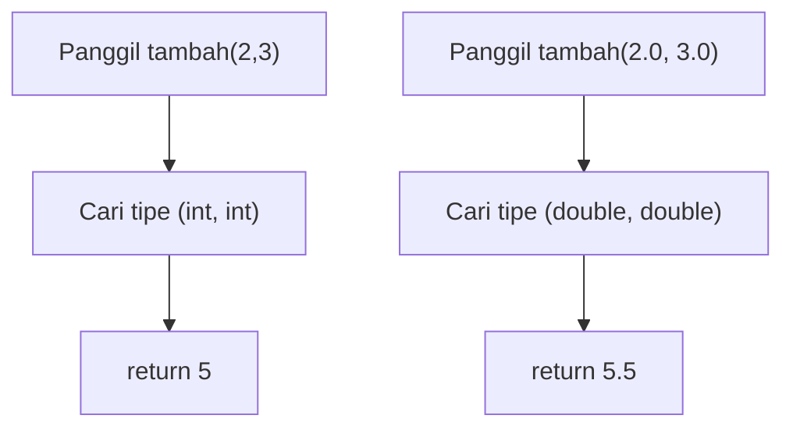
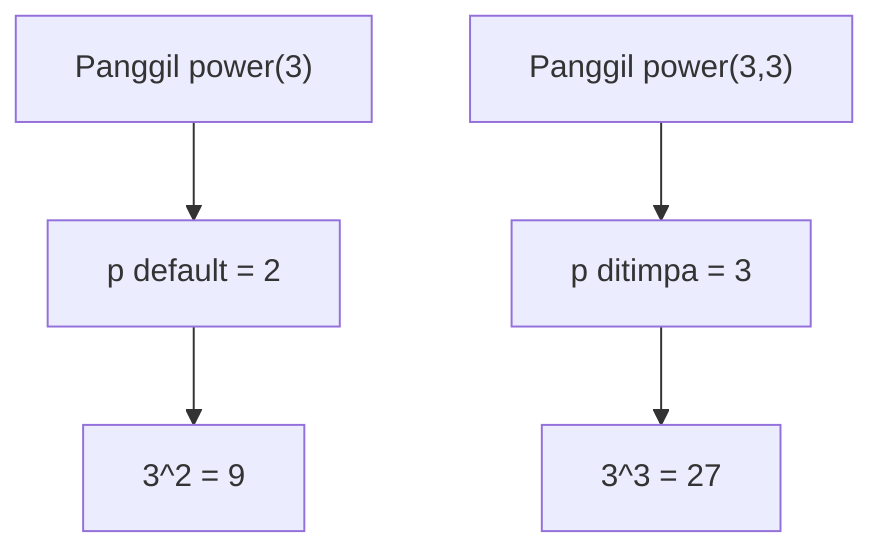
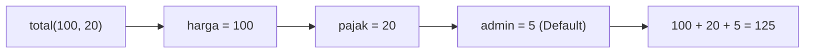
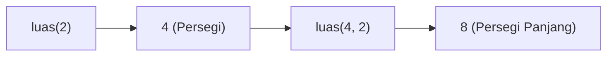

		🔙 **[Kembali ke Daftar Soal](./README.md)**

---

# Latihan Soal Part C - Modul 04 - Set 04 (Premium Edition)

---

### Soal 31: Overloading Dasar (Int vs Double)
```cpp
int tambah(int a, int b) { return a + b; }
double tambah(double a, double b) { return a + b + 0.5; }

int main() {
    int x = tambah(2, 3);
    double y = tambah(2.0, 3.0);
}
```
**Pertanyaan:**
1. Berapakah nilai `x`?
2. Berapakah nilai `y`?
3. Apa nama fitur C++ yang mengijinkan dua fungsi memiliki nama yang sama?

<details>
<summary><b>Klik untuk Lihat Jawaban & Diagnosis</b></summary>

**Mermaid Flowchart:**


**Jawaban:**
1. **5**
2. **5.5**
3. **Function Overloading.** C++ melihat tipe data argumen untuk menentukan fungsi mana yang harus dipanggil.
</details>

---

### Soal 32: Beda Jumlah Parameter
```cpp
int hitung(int a) { return a * a; }
int hitung(int a, int b) { return a + b; }

int main() {
    int x = hitung(5);
    int y = hitung(5, 10);
}
```
**Pertanyaan:**
1. Berapakah nilai `x`?
2. Berapakah nilai `y`?

<details>
<summary><b>Klik untuk Lihat Jawaban & Diagnosis</b></summary>

**Jawaban:**
1. **25** (5 * 5)
2. **15** (5 + 10)

**📖 Analisis Mendalam:**
Selain tipe data, jumlah parameter juga menjadi pembeda utama dalam *Overloading*. Komputer tidak bingung karena tanda dalam kurungnya berbeda.
</details>

---

### Soal 33: Parameter Default (Optional Arg)
```cpp
int power(int n, int p = 2) {
    int hasil = 1;
    for(int i=0; i<p; i++) hasil *= n;
    return hasil;
}

int main() {
    int a = power(3);
    int b = power(3, 3);
}
```
**Pertanyaan:**
1. Berapakah nilai `a`?
2. Berapakah nilai `b`?

<details>
<summary><b>Klik untuk Lihat Jawaban & Diagnosis</b></summary>

**Mermaid Flowchart:**


**Jawaban:**
1. **9**
2. **27**
</details>

---

### Soal 34: ⚠️ Overloading Ambiguitas
```cpp
void f(int n) { /* opsi 1 */ }
void f(float n) { /* opsi 2 */ }

int main() {
    f(5.5); // Ini memanggil yang mana?
}
```
**Pertanyaan:**
1. Tipe data apakah angka **5.5** secara default di C++?
2. Apakah program di atas memanggil `f(int)` atau `f(float)`?

<details>
<summary><b>Klik untuk Lihat Jawaban & Diagnosis</b></summary>

**Jawaban:**
1. **Double** (bukan float).
2. **Error / Ambiguitas.** (Jika tidak ada `f(double)`, compiler akan bingung memilih apakah harus diubah ke `int` atau `float`. Namun biasanya ia akan komplain karena tidak menemukan kecocokan yang pas).

**📖 Analisis Mendalam:**
Hati-hati, simbol desimal seperti `5.5` dianggap `double`. Untuk menjadikannya `float`, harus ditulis `5.5f`.
</details>

---

### Soal 35: Menu dengan Default Param
```cpp
int belanja(int harga, int diskon = 0) {
    return harga - diskon;
}

int main() {
    int bayar1 = belanja(10000);
    int bayar2 = belanja(10000, 2000);
}
```
**Pertanyaan:**
1. Berapakah nilai `bayar1`?
2. Berapakah nilai `bayar2`?

<details>
<summary><b>Klik untuk Lihat Jawaban & Diagnosis</b></summary>

**Jawaban:**
1. **10000**
2. **8000**
</details>

---

### Soal 36: Urutan Parameter Default
```cpp
// Skenario: Pajak default 10%
int total(int harga, int pajak = 10, int admin = 5) {
    return harga + pajak + admin;
}

int main() {
    int x = total(100, 20);
}
```
**Pertanyaan:**
1. Berapakah nilai `x`?
2. Nilai `20` tersebut dikirim ke parameter mana?

<details>
<summary><b>Klik untuk Lihat Jawaban & Diagnosis</b></summary>

**Mermaid Flowchart:**


**Jawaban:**
1. **125**
2. **pajak.** Argumen diisi dari kiri ke kanan. Sisanya baru menggunakan default.
</details>

---

### Soal 37: ⚠️ Jebakan Overloading (Tipe Mirip)
```cpp
void cetak(char c) { /* A */ }
void cetak(int n) { /* B */ }

int main() {
    cetak('A');
    cetak(65);
}
```
**Pertanyaan:**
1. Blok mana yang dijalankan saat `cetak('A')`?
2. Blok mana yang dijalankan saat `cetak(65)`?

<details>
<summary><b>Klik untuk Lihat Jawaban & Diagnosis</b></summary>

**Jawaban:**
1. **Blok A** (Karakter).
2. **Blok B** (Integer).

**📖 Analisis Mendalam:**
Meskipun 'A' memiliki kode ASCII 65, C++ sangat memedulikan tipe data aslinya sebelum melakukan konversi otomatis.
</details>

---

### Soal 38: Luas Bangun (Overload Logic)
```cpp
int luas(int s) { return s * s; }
int luas(int p, int l) { return p * l; }

int main() {
   int x = luas(luas(2), 2);
}
```
**Pertanyaan:**
1. Berapakah nilai `x`?
2. Fungsi `luas` yang mana yang dipanggil paling dalam?

<details>
<summary><b>Klik untuk Lihat Jawaban & Diagnosis</b></summary>

**Mermaid Flowchart:**


**Jawaban:**
1. **8**
2. **luas(int s)** (Persegi).
</details>

---

### Soal 39: Gabung String Default
```cpp
string gabung(string a, string b = "ku") {
    return a + b;
}

int main() {
    string s1 = gabung("Buku");
    string s2 = gabung("I", "bu");
}
```
**Pertanyaan:**
1. Berapakah isi `s1`?
2. Berapakah isi `s2`?

<details>
<summary><b>Klik untuk Lihat Jawaban & Diagnosis</b></summary>

**Jawaban:**
1. **"Bukuku"**
2. **"Ibu"**
</details>

---

### Soal 40: ⚠️ Default vs Overload (Conflict?)
```cpp
void f(int a) { /* Opsi 1 */ }
void f(int a, int b = 5) { /* Opsi 2 */ }

int main() {
    f(10); // Ambiguitas?
}
```
**Pertanyaan:**
1. Apakah program ini bisa dikompilasi (berjalan)?
2. Mengapa compiler akan marah (error) pada baris `f(10)`?

<details>
<summary><b>Klik untuk Lihat Jawaban & Diagnosis</b></summary>

**Jawaban:**
1. **Tidak.** Ini akan menyebabkan *Compile Error*.
2. Karena **Ambiguitas**. Saat dipanggil dengan satu angka, compiler bingung: 
   - Apakah memanggil Opsi 1 (pas 1 parameter).
   - Ataukah memanggil Opsi 2 (menggunakan default parameter untuk b).
   Keduanya sama-sama valid, sehingga compiler menyerah.
</details>
