🔙 **[Kembali ke Daftar Soal](./README.md)**

---

# Latihan Soal Part C - Modul 04 - Set 04

### Soal 76
```cpp
int f(int x) { return x * 2; }
// main: int a = 12; a = f(a) + f(2);
```
**Pertanyaan:**
1. Berapakah hasil akhirnya?
2. Mengapa demikian?

**Jawaban & Diagnosis:**
1. **28**
2. Lihat Tracing.

**Mermaid Flowchart:**
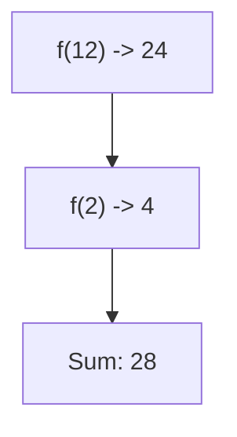

**📖 Penjelasan:**
**Langkah Tracing:**
1. f(12) = 24.
2. f(2) = 4.
3. Jumlah: 28.

---
### Soal 77
```cpp
void swap(int &a, int b) { int t=a; a=b; b=t; }
// main: int x=6, y=18; swap(x, y);
```
**Pertanyaan:**
1. Berapakah hasil akhirnya?
2. Mengapa demikian?

**Jawaban & Diagnosis:**
1. **x=18, y=18**
2. Lihat Tracing.

**Mermaid Flowchart:**
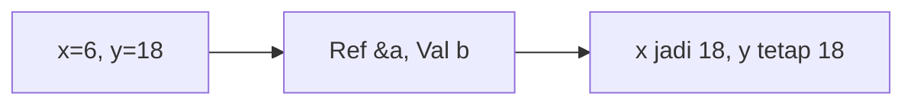

**📖 Penjelasan:**
**Langkah Tracing:**
1. x dilempar secara `reference` (&), maka nilainya berubah.
2. y dilempar secara `value`, maka aslinya aman.

---
### Soal 78
```cpp
void swap(int &a, int b) { int t=a; a=b; b=t; }
// main: int x=16, y=1; swap(x, y);
```
**Pertanyaan:**
1. Berapakah hasil akhirnya?
2. Mengapa demikian?

**Jawaban & Diagnosis:**
1. **x=1, y=1**
2. Lihat Tracing.

**Mermaid Flowchart:**
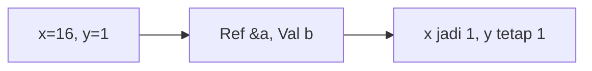

**📖 Penjelasan:**
**Langkah Tracing:**
1. x dilempar secara `reference` (&), maka nilainya berubah.
2. y dilempar secara `value`, maka aslinya aman.

---
### Soal 79
```cpp
void swap(int &a, int b) { int t=a; a=b; b=t; }
// main: int x=5, y=4; swap(x, y);
```
**Pertanyaan:**
1. Berapakah hasil akhirnya?
2. Mengapa demikian?

**Jawaban & Diagnosis:**
1. **x=4, y=4**
2. Lihat Tracing.

**Mermaid Flowchart:**
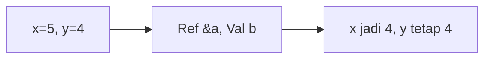

**📖 Penjelasan:**
**Langkah Tracing:**
1. x dilempar secara `reference` (&), maka nilainya berubah.
2. y dilempar secara `value`, maka aslinya aman.

---
### Soal 80
```cpp
int f(int x) { return x * 2; }
// main: int a = 6; a = f(a) + f(2);
```
**Pertanyaan:**
1. Berapakah hasil akhirnya?
2. Mengapa demikian?

**Jawaban & Diagnosis:**
1. **16**
2. Lihat Tracing.

**Mermaid Flowchart:**
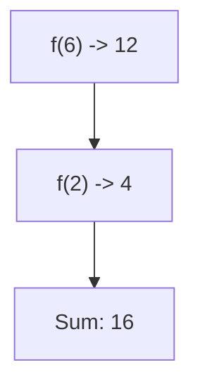

**📖 Penjelasan:**
**Langkah Tracing:**
1. f(6) = 12.
2. f(2) = 4.
3. Jumlah: 16.

---
### Soal 81
```cpp
int f(int x) { return x * 2; }
// main: int a = 18; a = f(a) + f(2);
```
**Pertanyaan:**
1. Berapakah hasil akhirnya?
2. Mengapa demikian?

**Jawaban & Diagnosis:**
1. **40**
2. Lihat Tracing.

**Mermaid Flowchart:**
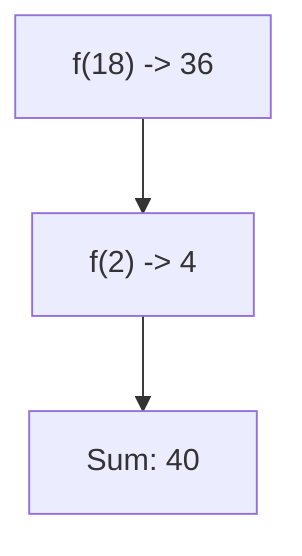

**📖 Penjelasan:**
**Langkah Tracing:**
1. f(18) = 36.
2. f(2) = 4.
3. Jumlah: 40.

---
### Soal 82
```cpp
int f(int x) { return x * 2; }
// main: int a = 6; a = f(a) + f(2);
```
**Pertanyaan:**
1. Berapakah hasil akhirnya?
2. Mengapa demikian?

**Jawaban & Diagnosis:**
1. **16**
2. Lihat Tracing.

**Mermaid Flowchart:**


**📖 Penjelasan:**
**Langkah Tracing:**
1. f(6) = 12.
2. f(2) = 4.
3. Jumlah: 16.

---
### Soal 83
```cpp
void swap(int &a, int b) { int t=a; a=b; b=t; }
// main: int x=9, y=1; swap(x, y);
```
**Pertanyaan:**
1. Berapakah hasil akhirnya?
2. Mengapa demikian?

**Jawaban & Diagnosis:**
1. **x=1, y=1**
2. Lihat Tracing.

**Mermaid Flowchart:**
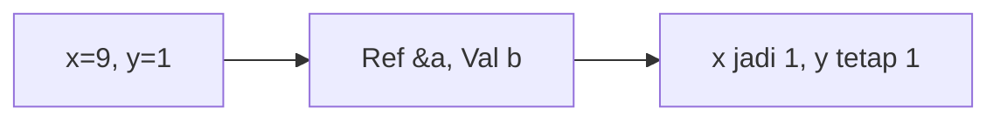

**📖 Penjelasan:**
**Langkah Tracing:**
1. x dilempar secara `reference` (&), maka nilainya berubah.
2. y dilempar secara `value`, maka aslinya aman.

---
### Soal 84
```cpp
void swap(int &a, int b) { int t=a; a=b; b=t; }
// main: int x=5, y=18; swap(x, y);
```
**Pertanyaan:**
1. Berapakah hasil akhirnya?
2. Mengapa demikian?

**Jawaban & Diagnosis:**
1. **x=18, y=18**
2. Lihat Tracing.

**Mermaid Flowchart:**
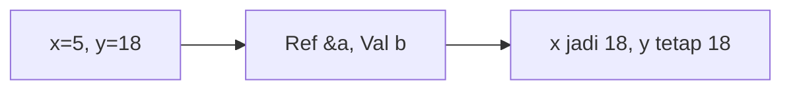

**📖 Penjelasan:**
**Langkah Tracing:**
1. x dilempar secara `reference` (&), maka nilainya berubah.
2. y dilempar secara `value`, maka aslinya aman.

---
### Soal 85
```cpp
int f(int x) { return x * 2; }
// main: int a = 15; a = f(a) + f(2);
```
**Pertanyaan:**
1. Berapakah hasil akhirnya?
2. Mengapa demikian?

**Jawaban & Diagnosis:**
1. **34**
2. Lihat Tracing.

**Mermaid Flowchart:**
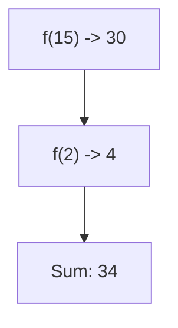

**📖 Penjelasan:**
**Langkah Tracing:**
1. f(15) = 30.
2. f(2) = 4.
3. Jumlah: 34.

---
### Soal 86
```cpp
void swap(int &a, int b) { int t=a; a=b; b=t; }
// main: int x=11, y=12; swap(x, y);
```
**Pertanyaan:**
1. Berapakah hasil akhirnya?
2. Mengapa demikian?

**Jawaban & Diagnosis:**
1. **x=12, y=12**
2. Lihat Tracing.

**Mermaid Flowchart:**
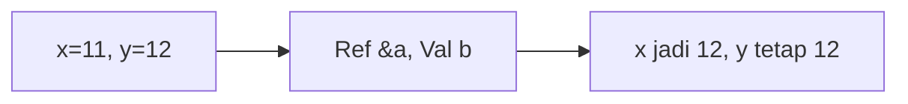

**📖 Penjelasan:**
**Langkah Tracing:**
1. x dilempar secara `reference` (&), maka nilainya berubah.
2. y dilempar secara `value`, maka aslinya aman.

---
### Soal 87
```cpp
int f(int x) { return x * 2; }
// main: int a = 2; a = f(a) + f(2);
```
**Pertanyaan:**
1. Berapakah hasil akhirnya?
2. Mengapa demikian?

**Jawaban & Diagnosis:**
1. **8**
2. Lihat Tracing.

**Mermaid Flowchart:**


**📖 Penjelasan:**
**Langkah Tracing:**
1. f(2) = 4.
2. f(2) = 4.
3. Jumlah: 8.

---
### Soal 88
```cpp
int f(int x) { return x * 2; }
// main: int a = 10; a = f(a) + f(2);
```
**Pertanyaan:**
1. Berapakah hasil akhirnya?
2. Mengapa demikian?

**Jawaban & Diagnosis:**
1. **24**
2. Lihat Tracing.

**Mermaid Flowchart:**


**📖 Penjelasan:**
**Langkah Tracing:**
1. f(10) = 20.
2. f(2) = 4.
3. Jumlah: 24.

---
### Soal 89
```cpp
int f(int x) { return x * 2; }
// main: int a = 6; a = f(a) + f(2);
```
**Pertanyaan:**
1. Berapakah hasil akhirnya?
2. Mengapa demikian?

**Jawaban & Diagnosis:**
1. **16**
2. Lihat Tracing.

**Mermaid Flowchart:**


**📖 Penjelasan:**
**Langkah Tracing:**
1. f(6) = 12.
2. f(2) = 4.
3. Jumlah: 16.

---
### Soal 90
```cpp
int f(int x) { return x * 2; }
// main: int a = 13; a = f(a) + f(2);
```
**Pertanyaan:**
1. Berapakah hasil akhirnya?
2. Mengapa demikian?

**Jawaban & Diagnosis:**
1. **30**
2. Lihat Tracing.

**Mermaid Flowchart:**


**📖 Penjelasan:**
**Langkah Tracing:**
1. f(13) = 26.
2. f(2) = 4.
3. Jumlah: 30.

---
### Soal 91
```cpp
int f(int x) { return x * 2; }
// main: int a = 1; a = f(a) + f(2);
```
**Pertanyaan:**
1. Berapakah hasil akhirnya?
2. Mengapa demikian?

**Jawaban & Diagnosis:**
1. **6**
2. Lihat Tracing.

**Mermaid Flowchart:**
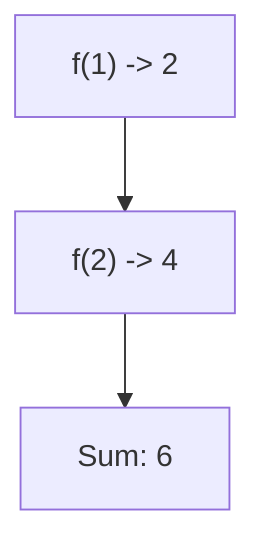

**📖 Penjelasan:**
**Langkah Tracing:**
1. f(1) = 2.
2. f(2) = 4.
3. Jumlah: 6.

---
### Soal 92
```cpp
int f(int x) { return x * 2; }
// main: int a = 3; a = f(a) + f(2);
```
**Pertanyaan:**
1. Berapakah hasil akhirnya?
2. Mengapa demikian?

**Jawaban & Diagnosis:**
1. **10**
2. Lihat Tracing.

**Mermaid Flowchart:**
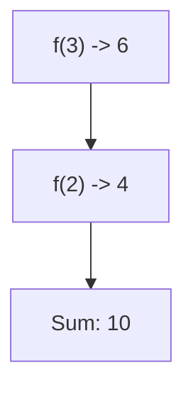

**📖 Penjelasan:**
**Langkah Tracing:**
1. f(3) = 6.
2. f(2) = 4.
3. Jumlah: 10.

---
### Soal 93
```cpp
int f(int x) { return x * 2; }
// main: int a = 7; a = f(a) + f(2);
```
**Pertanyaan:**
1. Berapakah hasil akhirnya?
2. Mengapa demikian?

**Jawaban & Diagnosis:**
1. **18**
2. Lihat Tracing.

**Mermaid Flowchart:**
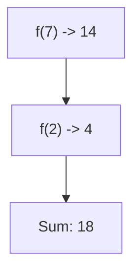

**📖 Penjelasan:**
**Langkah Tracing:**
1. f(7) = 14.
2. f(2) = 4.
3. Jumlah: 18.

---
### Soal 94
```cpp
int f(int x) { return x * 2; }
// main: int a = 8; a = f(a) + f(2);
```
**Pertanyaan:**
1. Berapakah hasil akhirnya?
2. Mengapa demikian?

**Jawaban & Diagnosis:**
1. **20**
2. Lihat Tracing.

**Mermaid Flowchart:**
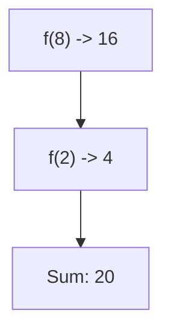

**📖 Penjelasan:**
**Langkah Tracing:**
1. f(8) = 16.
2. f(2) = 4.
3. Jumlah: 20.

---
### Soal 95
```cpp
void swap(int &a, int b) { int t=a; a=b; b=t; }
// main: int x=18, y=5; swap(x, y);
```
**Pertanyaan:**
1. Berapakah hasil akhirnya?
2. Mengapa demikian?

**Jawaban & Diagnosis:**
1. **x=5, y=5**
2. Lihat Tracing.

**Mermaid Flowchart:**
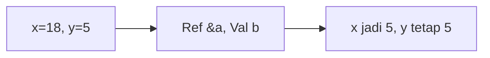

**📖 Penjelasan:**
**Langkah Tracing:**
1. x dilempar secara `reference` (&), maka nilainya berubah.
2. y dilempar secara `value`, maka aslinya aman.

---
### Soal 96
```cpp
int f(int x) { return x * 2; }
// main: int a = 7; a = f(a) + f(2);
```
**Pertanyaan:**
1. Berapakah hasil akhirnya?
2. Mengapa demikian?

**Jawaban & Diagnosis:**
1. **18**
2. Lihat Tracing.

**Mermaid Flowchart:**
```mermaid
graph TD
A["f(7) -> 14"] --> B["f(2) -> 4"]
B --> C["Sum: 18"]
```

**📖 Penjelasan:**
**Langkah Tracing:**
1. f(7) = 14.
2. f(2) = 4.
3. Jumlah: 18.

---
### Soal 97
```cpp
void swap(int &a, int b) { int t=a; a=b; b=t; }
// main: int x=2, y=8; swap(x, y);
```
**Pertanyaan:**
1. Berapakah hasil akhirnya?
2. Mengapa demikian?

**Jawaban & Diagnosis:**
1. **x=8, y=8**
2. Lihat Tracing.

**Mermaid Flowchart:**
```mermaid
graph LR
A["x=2, y=8"] --> B["Ref &a, Val b"]
B --> C["x jadi 8, y tetap 8"]
```

**📖 Penjelasan:**
**Langkah Tracing:**
1. x dilempar secara `reference` (&), maka nilainya berubah.
2. y dilempar secara `value`, maka aslinya aman.

---
### Soal 98
```cpp
void swap(int &a, int b) { int t=a; a=b; b=t; }
// main: int x=10, y=20; swap(x, y);
```
**Pertanyaan:**
1. Berapakah hasil akhirnya?
2. Mengapa demikian?

**Jawaban & Diagnosis:**
1. **x=20, y=20**
2. Lihat Tracing.

**Mermaid Flowchart:**
```mermaid
graph LR
A["x=10, y=20"] --> B["Ref &a, Val b"]
B --> C["x jadi 20, y tetap 20"]
```

**📖 Penjelasan:**
**Langkah Tracing:**
1. x dilempar secara `reference` (&), maka nilainya berubah.
2. y dilempar secara `value`, maka aslinya aman.

---
### Soal 99
```cpp
int f(int x) { return x * 2; }
// main: int a = 9; a = f(a) + f(2);
```
**Pertanyaan:**
1. Berapakah hasil akhirnya?
2. Mengapa demikian?

**Jawaban & Diagnosis:**
1. **22**
2. Lihat Tracing.

**Mermaid Flowchart:**
```mermaid
graph TD
A["f(9) -> 18"] --> B["f(2) -> 4"]
B --> C["Sum: 22"]
```

**📖 Penjelasan:**
**Langkah Tracing:**
1. f(9) = 18.
2. f(2) = 4.
3. Jumlah: 22.

---
### Soal 100
```cpp
int f(int x) { return x * 2; }
// main: int a = 12; a = f(a) + f(2);
```
**Pertanyaan:**
1. Berapakah hasil akhirnya?
2. Mengapa demikian?

**Jawaban & Diagnosis:**
1. **28**
2. Lihat Tracing.

**Mermaid Flowchart:**
```mermaid
graph TD
A["f(12) -> 24"] --> B["f(2) -> 4"]
B --> C["Sum: 28"]
```

**📖 Penjelasan:**
**Langkah Tracing:**
1. f(12) = 24.
2. f(2) = 4.
3. Jumlah: 28.

---
