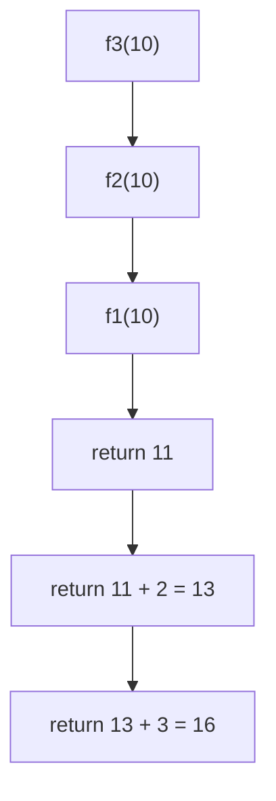
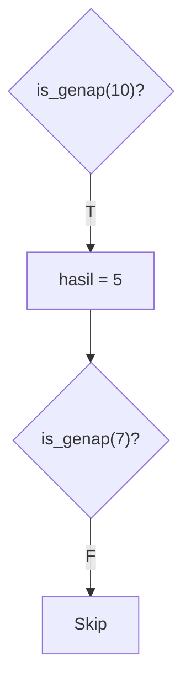
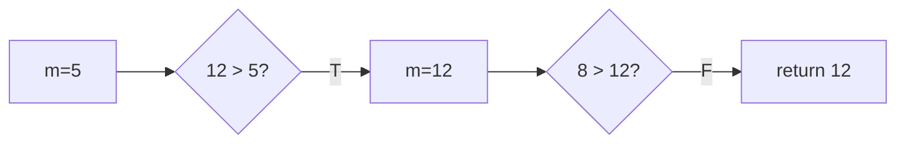
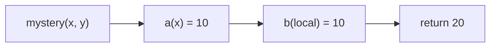
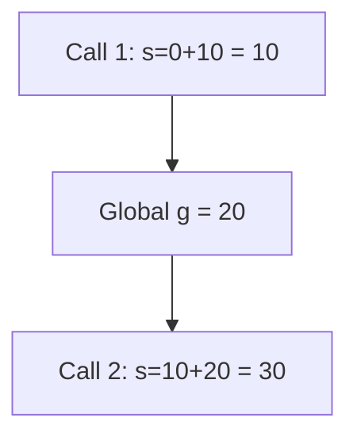
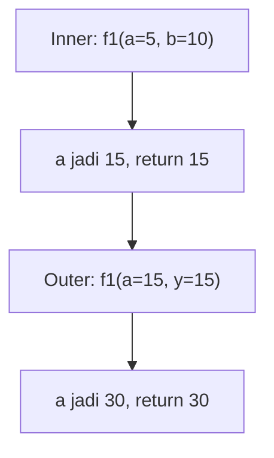

		🔙 **[Kembali ke Daftar Soal](./README.md)**

---

# Latihan Soal Part C - Modul 04 - Set 05 (Premium Edition)

---

### Soal 41: Rantai Penjumlahan (Function Chain)
```cpp
int f1(int n) { return n + 1; }
int f2(int n) { return f1(n) + 2; }
int f3(int n) { return f2(n) + 3; }

int main() {
    int x = f3(10);
}
```
**Pertanyaan:**
1. Berapakah nilai `x`?
2. Bagaimana alur pengembalian nilai dari `f1` ke `main`?

<details>
<summary><b>Klik untuk Lihat Jawaban & Diagnosis</b></summary>

**Mermaid Flowchart:**


**Jawaban:**
1. **16**
2. `f1` mengembalikan 11 ke `f2`, lalu `f2` mengembalikan 13 ke `f3`, dan akhirnya `f3` mengembalikan 16 ke `main`.
</details>

---

### Soal 42: Deteksi Kondisi (Boolean Helper)
```cpp
bool is_genap(int n) {
    if (n % 2 == 0) return true;
    return false;
}

int main() {
    int hasil = 0;
    if (is_genap(10)) hasil += 5;
    if (is_genap(7)) hasil += 2;
}
```
**Pertanyaan:**
1. Berapakah nilai `hasil`?
2. Apakah baris `hasil += 2` dieksekusi?

<details>
<summary><b>Klik untuk Lihat Jawaban & Diagnosis</b></summary>

**Mermaid Flowchart:**


**Jawaban:**
1. **5**
2. **Tidak.** Karena `is_genap(7)` mengembalikan `false`.
</details>

---

### Soal 43: Pencari Maksimum (Conditional Return)
```cpp
int max_tiga(int a, int b, int c) {
    int m = a;
    if (b > m) m = b;
    if (c > m) m = c;
    return m;
}

int main() {
    int x = max_tiga(5, 12, 8);
}
```
**Pertanyaan:**
1. Berapakah nilai `x`?
2. Variabel `m` menyimpan nilai apa pada saat fungsi selesai?

<details>
<summary><b>Klik untuk Lihat Jawaban & Diagnosis</b></summary>

**Mermaid Flowchart:**


**Jawaban:**
1. **12**
2. Nilai terbesar (maksimum) dari ketiga parameter tersebut.
</details>

---

### Soal 44: Operasi Ternary di Return
```cpp
int mutlak(int n) {
    return (n < 0) ? -n : n;
}

int main() {
    int a = mutlak(-10);
    int b = mutlak(5);
}
```
**Pertanyaan:**
1. Berapakah nilai `a`?
2. Berapakah nilai `b`?

<details>
<summary><b>Klik untuk Lihat Jawaban & Diagnosis</b></summary>

**Jawaban:**
1. **10**
2. **5**
</details>

---

### Soal 45: ⚠️ Side Effect Reference
```cpp
int mystery(int &a, int b) {
    a *= 2;
    b *= 2;
    return a + b;
}

int main() {
    int x = 5, y = 5;
    int z = mystery(x, y);
    // Berapa x, y, z?
}
```
**Pertanyaan:**
1. Berapakah nilai `x`?
2. Berapakah nilai `y`?
3. Berapakah nilai `z`?

<details>
<summary><b>Klik untuk Lihat Jawaban & Diagnosis</b></summary>

**Mermaid Flowchart:**


**Jawaban:**
1. **10** (Karena reference `&`)
2. **5** (Karena pass-by-value)
3. **20**
</details>

---

### Soal 46: Kelipatan dalam Fungsi
```cpp
void kelipatan(int n, int &total) {
    for (int i = 1; i <= n; i++) {
        total += 2;
    }
}

int main() {
    int t = 0;
    kelipatan(3, t);
}
```
**Pertanyaan:**
1. Berapakah nilai `t`?
2. Berapa kali loop di dalam fungsi berjalan?

<details>
<summary><b>Klik untuk Lihat Jawaban & Diagnosis</b></summary>

**Jawaban:**
1. **6** (3 * 2)
2. **3 kali**
</details>

---

### Soal 47: ⚠️ Static Global Interaction
```cpp
int g = 10;

int hitung() {
    static int s = 0;
    s += g;
    return s;
}

int main() {
    hitung();
    g = 20;
    int hasil = hitung();
}
```
**Pertanyaan:**
1. Berapakah nilai `hasil`?
2. Berapa nilai `s` setelah panggilan pertama?

<details>
<summary><b>Klik untuk Lihat Jawaban & Diagnosis</b></summary>

**Mermaid Flowchart:**


**Jawaban:**
1. **30**
2. **10**
</details>

---

### Soal 48: Gabungan Overload & Ref
```cpp
void f(int n) { n = 1; }
void f(int &n) { n = 2; } // Ini ilegal?
```
**Pertanyaan:**
1. Mengapa compiler C++ akan marah (error) jika kedua fungsi di atas ada di file yang sama?
2. Kapan ambiguitas ini terjadi?

<details>
<summary><b>Klik untuk Lihat Jawaban & Diagnosis</b></summary>

**Jawaban:**
1. **Ambiguitas.** Keduanya memiliki nama dan jumlah parameter yang sama. Compiler tidak tahu apakah harus melakukan copy (value) atau alias (reference).
2. Saat dipanggil seperti `f(x)`.

**📖 Analisis Mendalam:**
Ini adalah kesalahan umum. Overloading hanya bisa membedakan tipe data yang benar-benar berbeda (seperti `int` vs `double`), bukan perbedaan `&` pada tipe data yang sama.
</details>

---

### Soal 49: Rantai Penentu (Logic Puzzle)
```cpp
bool is_pos(int n) { return n > 0; }
bool is_big(int n) { return n > 100; }

int proses(int n) {
    if (is_pos(n)) {
        if (is_big(n)) return 2;
        return 1;
    }
    return 0;
}

int main() {
    int a = proses(50);
    int b = proses(-10);
}
```
**Pertanyaan:**
1. Berapakah nilai `a`?
2. Berapakah nilai `b`?

<details>
<summary><b>Klik untuk Lihat Jawaban & Diagnosis</b></summary>

**Jawaban:**
1. **1**
2. **0**
</details>

---

### Soal 50: Grand Final (Call Stack Visualization)
```cpp
int f1(int &x, int y) {
    x += y;
    return x;
}

int main() {
    int a = 5, b = 10;
    int hasil = f1(a, f1(a, b));
}
```
**Pertanyaan:**
1. Berapakah nilai `a` akhir?
2. Berapakah nilai `hasil`?
3. Tracing-lah alur memorinya!

<details>
<summary><b>Klik untuk Lihat Jawaban & Diagnosis</b></summary>

**Mermaid Flowchart:**


**Jawaban:**
1. **30**
2. **30**

**📖 Diagnosis Khusus:**
Hati-hati! Karena `a` dikirim sebagai referensi ke panggilan yang sama dua kali, perubahannya di pemanggilan *dalam* akan terbawa ke pemanggilan *luar*. 
1. `f1(a, 10)` $\rightarrow$ `a` jadi 15, return 15.
2. `f1(a, 15)` $\rightarrow$ `a` jadi 30, return 30.
</details>
