🔙 **[Kembali ke Daftar Soal](./README.md)**

---

# Latihan Soal Part C - Modul 04 - Set 05

### Soal 101
```cpp
int f(int x) { return x * 2; }
// main: int a = 4; a = f(a) + f(2);
```
**Pertanyaan:**
1. Berapakah hasil akhirnya?
2. Mengapa demikian?

**Jawaban & Diagnosis:**
1. **12**
2. Lihat Tracing.

**Mermaid Flowchart:**
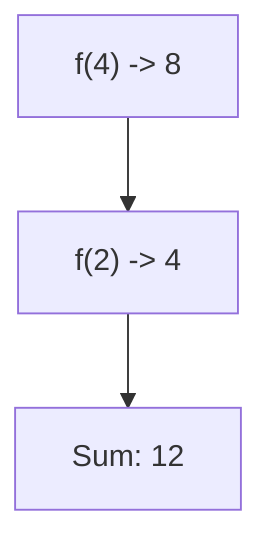

**📖 Penjelasan:**
**Langkah Tracing:**
1. f(4) = 8.
2. f(2) = 4.
3. Jumlah: 12.

---
### Soal 102
```cpp
int f(int x) { return x * 2; }
// main: int a = 18; a = f(a) + f(2);
```
**Pertanyaan:**
1. Berapakah hasil akhirnya?
2. Mengapa demikian?

**Jawaban & Diagnosis:**
1. **40**
2. Lihat Tracing.

**Mermaid Flowchart:**
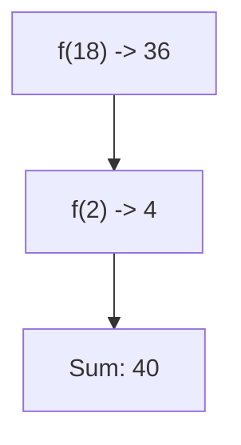

**📖 Penjelasan:**
**Langkah Tracing:**
1. f(18) = 36.
2. f(2) = 4.
3. Jumlah: 40.

---
### Soal 103
```cpp
void swap(int &a, int b) { int t=a; a=b; b=t; }
// main: int x=3, y=1; swap(x, y);
```
**Pertanyaan:**
1. Berapakah hasil akhirnya?
2. Mengapa demikian?

**Jawaban & Diagnosis:**
1. **x=1, y=1**
2. Lihat Tracing.

**Mermaid Flowchart:**
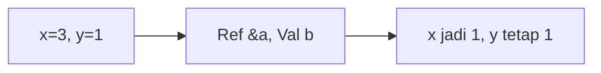

**📖 Penjelasan:**
**Langkah Tracing:**
1. x dilempar secara `reference` (&), maka nilainya berubah.
2. y dilempar secara `value`, maka aslinya aman.

---
### Soal 104
```cpp
void swap(int &a, int b) { int t=a; a=b; b=t; }
// main: int x=17, y=5; swap(x, y);
```
**Pertanyaan:**
1. Berapakah hasil akhirnya?
2. Mengapa demikian?

**Jawaban & Diagnosis:**
1. **x=5, y=5**
2. Lihat Tracing.

**Mermaid Flowchart:**
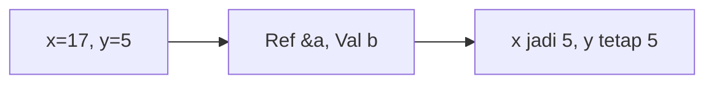

**📖 Penjelasan:**
**Langkah Tracing:**
1. x dilempar secara `reference` (&), maka nilainya berubah.
2. y dilempar secara `value`, maka aslinya aman.

---
### Soal 105
```cpp
int f(int x) { return x * 2; }
// main: int a = 1; a = f(a) + f(2);
```
**Pertanyaan:**
1. Berapakah hasil akhirnya?
2. Mengapa demikian?

**Jawaban & Diagnosis:**
1. **6**
2. Lihat Tracing.

**Mermaid Flowchart:**
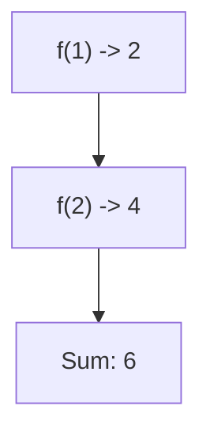

**📖 Penjelasan:**
**Langkah Tracing:**
1. f(1) = 2.
2. f(2) = 4.
3. Jumlah: 6.

---
### Soal 106
```cpp
int f(int x) { return x * 2; }
// main: int a = 19; a = f(a) + f(2);
```
**Pertanyaan:**
1. Berapakah hasil akhirnya?
2. Mengapa demikian?

**Jawaban & Diagnosis:**
1. **42**
2. Lihat Tracing.

**Mermaid Flowchart:**
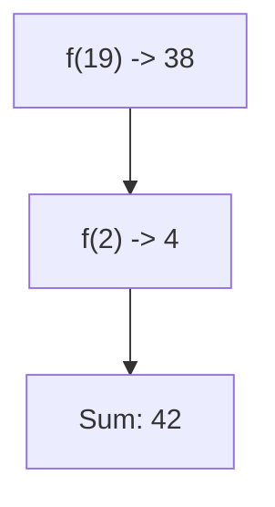

**📖 Penjelasan:**
**Langkah Tracing:**
1. f(19) = 38.
2. f(2) = 4.
3. Jumlah: 42.

---
### Soal 107
```cpp
int f(int x) { return x * 2; }
// main: int a = 1; a = f(a) + f(2);
```
**Pertanyaan:**
1. Berapakah hasil akhirnya?
2. Mengapa demikian?

**Jawaban & Diagnosis:**
1. **6**
2. Lihat Tracing.

**Mermaid Flowchart:**


**📖 Penjelasan:**
**Langkah Tracing:**
1. f(1) = 2.
2. f(2) = 4.
3. Jumlah: 6.

---
### Soal 108
```cpp
int f(int x) { return x * 2; }
// main: int a = 7; a = f(a) + f(2);
```
**Pertanyaan:**
1. Berapakah hasil akhirnya?
2. Mengapa demikian?

**Jawaban & Diagnosis:**
1. **18**
2. Lihat Tracing.

**Mermaid Flowchart:**
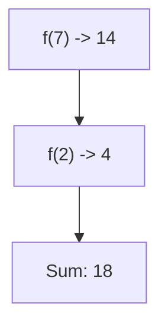

**📖 Penjelasan:**
**Langkah Tracing:**
1. f(7) = 14.
2. f(2) = 4.
3. Jumlah: 18.

---
### Soal 109
```cpp
void swap(int &a, int b) { int t=a; a=b; b=t; }
// main: int x=20, y=10; swap(x, y);
```
**Pertanyaan:**
1. Berapakah hasil akhirnya?
2. Mengapa demikian?

**Jawaban & Diagnosis:**
1. **x=10, y=10**
2. Lihat Tracing.

**Mermaid Flowchart:**
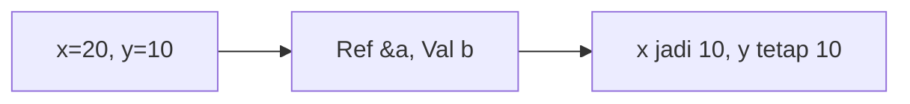

**📖 Penjelasan:**
**Langkah Tracing:**
1. x dilempar secara `reference` (&), maka nilainya berubah.
2. y dilempar secara `value`, maka aslinya aman.

---
### Soal 110
```cpp
void swap(int &a, int b) { int t=a; a=b; b=t; }
// main: int x=18, y=8; swap(x, y);
```
**Pertanyaan:**
1. Berapakah hasil akhirnya?
2. Mengapa demikian?

**Jawaban & Diagnosis:**
1. **x=8, y=8**
2. Lihat Tracing.

**Mermaid Flowchart:**


**📖 Penjelasan:**
**Langkah Tracing:**
1. x dilempar secara `reference` (&), maka nilainya berubah.
2. y dilempar secara `value`, maka aslinya aman.

---
### Soal 111
```cpp
int f(int x) { return x * 2; }
// main: int a = 5; a = f(a) + f(2);
```
**Pertanyaan:**
1. Berapakah hasil akhirnya?
2. Mengapa demikian?

**Jawaban & Diagnosis:**
1. **14**
2. Lihat Tracing.

**Mermaid Flowchart:**
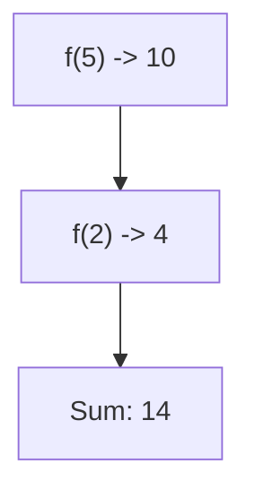

**📖 Penjelasan:**
**Langkah Tracing:**
1. f(5) = 10.
2. f(2) = 4.
3. Jumlah: 14.

---
### Soal 112
```cpp
int f(int x) { return x * 2; }
// main: int a = 2; a = f(a) + f(2);
```
**Pertanyaan:**
1. Berapakah hasil akhirnya?
2. Mengapa demikian?

**Jawaban & Diagnosis:**
1. **8**
2. Lihat Tracing.

**Mermaid Flowchart:**


**📖 Penjelasan:**
**Langkah Tracing:**
1. f(2) = 4.
2. f(2) = 4.
3. Jumlah: 8.

---
### Soal 113
```cpp
void swap(int &a, int b) { int t=a; a=b; b=t; }
// main: int x=4, y=13; swap(x, y);
```
**Pertanyaan:**
1. Berapakah hasil akhirnya?
2. Mengapa demikian?

**Jawaban & Diagnosis:**
1. **x=13, y=13**
2. Lihat Tracing.

**Mermaid Flowchart:**
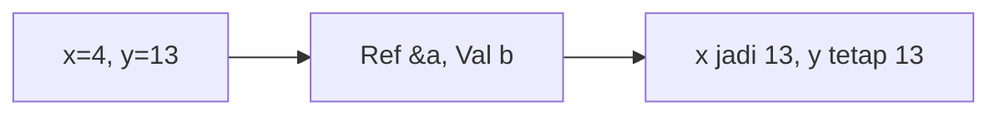

**📖 Penjelasan:**
**Langkah Tracing:**
1. x dilempar secara `reference` (&), maka nilainya berubah.
2. y dilempar secara `value`, maka aslinya aman.

---
### Soal 114
```cpp
void swap(int &a, int b) { int t=a; a=b; b=t; }
// main: int x=10, y=8; swap(x, y);
```
**Pertanyaan:**
1. Berapakah hasil akhirnya?
2. Mengapa demikian?

**Jawaban & Diagnosis:**
1. **x=8, y=8**
2. Lihat Tracing.

**Mermaid Flowchart:**
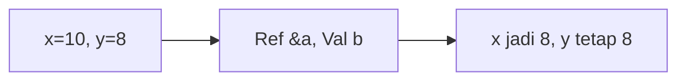

**📖 Penjelasan:**
**Langkah Tracing:**
1. x dilempar secara `reference` (&), maka nilainya berubah.
2. y dilempar secara `value`, maka aslinya aman.

---
### Soal 115
```cpp
void swap(int &a, int b) { int t=a; a=b; b=t; }
// main: int x=17, y=7; swap(x, y);
```
**Pertanyaan:**
1. Berapakah hasil akhirnya?
2. Mengapa demikian?

**Jawaban & Diagnosis:**
1. **x=7, y=7**
2. Lihat Tracing.

**Mermaid Flowchart:**
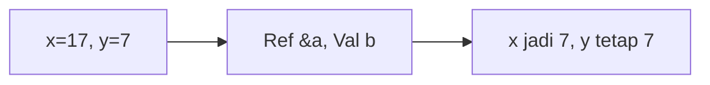

**📖 Penjelasan:**
**Langkah Tracing:**
1. x dilempar secara `reference` (&), maka nilainya berubah.
2. y dilempar secara `value`, maka aslinya aman.

---
### Soal 116
```cpp
int f(int x) { return x * 2; }
// main: int a = 18; a = f(a) + f(2);
```
**Pertanyaan:**
1. Berapakah hasil akhirnya?
2. Mengapa demikian?

**Jawaban & Diagnosis:**
1. **40**
2. Lihat Tracing.

**Mermaid Flowchart:**


**📖 Penjelasan:**
**Langkah Tracing:**
1. f(18) = 36.
2. f(2) = 4.
3. Jumlah: 40.

---
### Soal 117
```cpp
void swap(int &a, int b) { int t=a; a=b; b=t; }
// main: int x=5, y=5; swap(x, y);
```
**Pertanyaan:**
1. Berapakah hasil akhirnya?
2. Mengapa demikian?

**Jawaban & Diagnosis:**
1. **x=5, y=5**
2. Lihat Tracing.

**Mermaid Flowchart:**
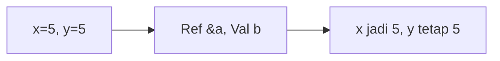

**📖 Penjelasan:**
**Langkah Tracing:**
1. x dilempar secara `reference` (&), maka nilainya berubah.
2. y dilempar secara `value`, maka aslinya aman.

---
### Soal 118
```cpp
void swap(int &a, int b) { int t=a; a=b; b=t; }
// main: int x=4, y=13; swap(x, y);
```
**Pertanyaan:**
1. Berapakah hasil akhirnya?
2. Mengapa demikian?

**Jawaban & Diagnosis:**
1. **x=13, y=13**
2. Lihat Tracing.

**Mermaid Flowchart:**


**📖 Penjelasan:**
**Langkah Tracing:**
1. x dilempar secara `reference` (&), maka nilainya berubah.
2. y dilempar secara `value`, maka aslinya aman.

---
### Soal 119
```cpp
int f(int x) { return x * 2; }
// main: int a = 9; a = f(a) + f(2);
```
**Pertanyaan:**
1. Berapakah hasil akhirnya?
2. Mengapa demikian?

**Jawaban & Diagnosis:**
1. **22**
2. Lihat Tracing.

**Mermaid Flowchart:**


**📖 Penjelasan:**
**Langkah Tracing:**
1. f(9) = 18.
2. f(2) = 4.
3. Jumlah: 22.

---
### Soal 120
```cpp
int f(int x) { return x * 2; }
// main: int a = 13; a = f(a) + f(2);
```
**Pertanyaan:**
1. Berapakah hasil akhirnya?
2. Mengapa demikian?

**Jawaban & Diagnosis:**
1. **30**
2. Lihat Tracing.

**Mermaid Flowchart:**
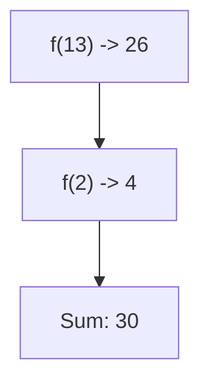

**📖 Penjelasan:**
**Langkah Tracing:**
1. f(13) = 26.
2. f(2) = 4.
3. Jumlah: 30.

---
### Soal 121
```cpp
void swap(int &a, int b) { int t=a; a=b; b=t; }
// main: int x=17, y=1; swap(x, y);
```
**Pertanyaan:**
1. Berapakah hasil akhirnya?
2. Mengapa demikian?

**Jawaban & Diagnosis:**
1. **x=1, y=1**
2. Lihat Tracing.

**Mermaid Flowchart:**
```mermaid
graph LR
A["x=17, y=1"] --> B["Ref &a, Val b"]
B --> C["x jadi 1, y tetap 1"]
```

**📖 Penjelasan:**
**Langkah Tracing:**
1. x dilempar secara `reference` (&), maka nilainya berubah.
2. y dilempar secara `value`, maka aslinya aman.

---
### Soal 122
```cpp
int f(int x) { return x * 2; }
// main: int a = 12; a = f(a) + f(2);
```
**Pertanyaan:**
1. Berapakah hasil akhirnya?
2. Mengapa demikian?

**Jawaban & Diagnosis:**
1. **28**
2. Lihat Tracing.

**Mermaid Flowchart:**
```mermaid
graph TD
A["f(12) -> 24"] --> B["f(2) -> 4"]
B --> C["Sum: 28"]
```

**📖 Penjelasan:**
**Langkah Tracing:**
1. f(12) = 24.
2. f(2) = 4.
3. Jumlah: 28.

---
### Soal 123
```cpp
void swap(int &a, int b) { int t=a; a=b; b=t; }
// main: int x=14, y=6; swap(x, y);
```
**Pertanyaan:**
1. Berapakah hasil akhirnya?
2. Mengapa demikian?

**Jawaban & Diagnosis:**
1. **x=6, y=6**
2. Lihat Tracing.

**Mermaid Flowchart:**
```mermaid
graph LR
A["x=14, y=6"] --> B["Ref &a, Val b"]
B --> C["x jadi 6, y tetap 6"]
```

**📖 Penjelasan:**
**Langkah Tracing:**
1. x dilempar secara `reference` (&), maka nilainya berubah.
2. y dilempar secara `value`, maka aslinya aman.

---
### Soal 124
```cpp
void swap(int &a, int b) { int t=a; a=b; b=t; }
// main: int x=20, y=20; swap(x, y);
```
**Pertanyaan:**
1. Berapakah hasil akhirnya?
2. Mengapa demikian?

**Jawaban & Diagnosis:**
1. **x=20, y=20**
2. Lihat Tracing.

**Mermaid Flowchart:**
```mermaid
graph LR
A["x=20, y=20"] --> B["Ref &a, Val b"]
B --> C["x jadi 20, y tetap 20"]
```

**📖 Penjelasan:**
**Langkah Tracing:**
1. x dilempar secara `reference` (&), maka nilainya berubah.
2. y dilempar secara `value`, maka aslinya aman.

---
### Soal 125
```cpp
void swap(int &a, int b) { int t=a; a=b; b=t; }
// main: int x=6, y=16; swap(x, y);
```
**Pertanyaan:**
1. Berapakah hasil akhirnya?
2. Mengapa demikian?

**Jawaban & Diagnosis:**
1. **x=16, y=16**
2. Lihat Tracing.

**Mermaid Flowchart:**
```mermaid
graph LR
A["x=6, y=16"] --> B["Ref &a, Val b"]
B --> C["x jadi 16, y tetap 16"]
```

**📖 Penjelasan:**
**Langkah Tracing:**
1. x dilempar secara `reference` (&), maka nilainya berubah.
2. y dilempar secara `value`, maka aslinya aman.

---
