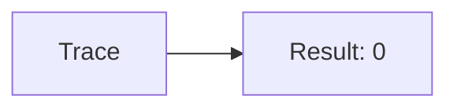
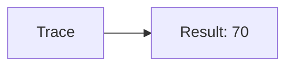
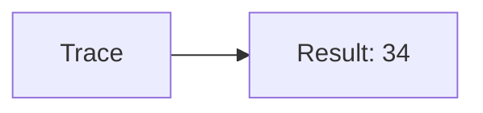
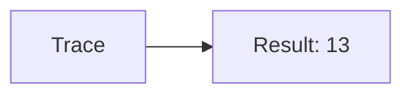
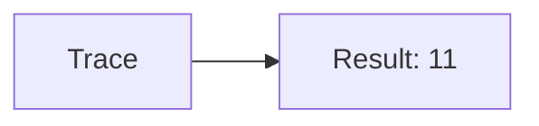

🔙 **[Kembali ke Daftar Soal](./README.md)**

---

# Latihan Soal Part C - Modul 04 - Set 05

### Soal 101
```cpp
// PR: Pass-by-Value
void ubah(int x) { x = 0; }
// main: int pr=37;
ubah(pr);
```
**Pertanyaan:**
1. Berapakah hasil akhirnya?
2. Deskripsikan alur pikir 'Compiler Manusia' untuk soal ini!

**Jawaban & Diagnosis:**
1. **37**
2. Value 'PR' dikirim fotokopinya. Aslinya tetap 37.

**Mermaid Flowchart:**


---
### Soal 102
```cpp
// Laporan: Pass-by-Reference
void reset(int &x) { x = 0; }
// main: int laporan=11;
reset(laporan);
```
**Pertanyaan:**
1. Berapakah hasil akhirnya?
2. Deskripsikan alur pikir 'Compiler Manusia' untuk soal ini!

**Jawaban & Diagnosis:**
1. **0**
2. Reference '&' dikirim alamat aslinya. 'Laporan' ter-reset jadi 0.

**Mermaid Flowchart:**


---
### Soal 103
```cpp
// Data: Pass-by-Value
void ubah(int x) { x = 0; }
// main: int data=15;
ubah(data);
```
**Pertanyaan:**
1. Berapakah hasil akhirnya?
2. Deskripsikan alur pikir 'Compiler Manusia' untuk soal ini!

**Jawaban & Diagnosis:**
1. **15**
2. Value 'Data' dikirim fotokopinya. Aslinya tetap 15.

**Mermaid Flowchart:**


---
### Soal 104
```cpp
// Uang: Pass-by-Reference
void reset(int &x) { x = 0; }
// main: int uang=14;
reset(uang);
```
**Pertanyaan:**
1. Berapakah hasil akhirnya?
2. Deskripsikan alur pikir 'Compiler Manusia' untuk soal ini!

**Jawaban & Diagnosis:**
1. **0**
2. Reference '&' dikirim alamat aslinya. 'Uang' ter-reset jadi 0.

**Mermaid Flowchart:**


---
### Soal 105
```cpp
// Saldo: Pass-by-Value
void ubah(int x) { x = 0; }
// main: int saldo=92;
ubah(saldo);
```
**Pertanyaan:**
1. Berapakah hasil akhirnya?
2. Deskripsikan alur pikir 'Compiler Manusia' untuk soal ini!

**Jawaban & Diagnosis:**
1. **92**
2. Value 'Saldo' dikirim fotokopinya. Aslinya tetap 92.

**Mermaid Flowchart:**


---
### Soal 106
```cpp
// Poin: Pass-by-Reference
void reset(int &x) { x = 0; }
// main: int poin=70;
reset(poin);
```
**Pertanyaan:**
1. Berapakah hasil akhirnya?
2. Deskripsikan alur pikir 'Compiler Manusia' untuk soal ini!

**Jawaban & Diagnosis:**
1. **0**
2. Reference '&' dikirim alamat aslinya. 'Poin' ter-reset jadi 0.

**Mermaid Flowchart:**


---
### Soal 107
```cpp
// Skor: Pass-by-Value
void ubah(int x) { x = 0; }
// main: int skor=75;
ubah(skor);
```
**Pertanyaan:**
1. Berapakah hasil akhirnya?
2. Deskripsikan alur pikir 'Compiler Manusia' untuk soal ini!

**Jawaban & Diagnosis:**
1. **75**
2. Value 'Skor' dikirim fotokopinya. Aslinya tetap 75.

**Mermaid Flowchart:**


---
### Soal 108
```cpp
// Level: Pass-by-Reference
void reset(int &x) { x = 0; }
// main: int level=12;
reset(level);
```
**Pertanyaan:**
1. Berapakah hasil akhirnya?
2. Deskripsikan alur pikir 'Compiler Manusia' untuk soal ini!

**Jawaban & Diagnosis:**
1. **0**
2. Reference '&' dikirim alamat aslinya. 'Level' ter-reset jadi 0.

**Mermaid Flowchart:**


---
### Soal 109
```cpp
// Hp: Pass-by-Value
void ubah(int x) { x = 0; }
// main: int hp=70;
ubah(hp);
```
**Pertanyaan:**
1. Berapakah hasil akhirnya?
2. Deskripsikan alur pikir 'Compiler Manusia' untuk soal ini!

**Jawaban & Diagnosis:**
1. **70**
2. Value 'Hp' dikirim fotokopinya. Aslinya tetap 70.

**Mermaid Flowchart:**


---
### Soal 110
```cpp
// Atk: Pass-by-Reference
void reset(int &x) { x = 0; }
// main: int atk=75;
reset(atk);
```
**Pertanyaan:**
1. Berapakah hasil akhirnya?
2. Deskripsikan alur pikir 'Compiler Manusia' untuk soal ini!

**Jawaban & Diagnosis:**
1. **0**
2. Reference '&' dikirim alamat aslinya. 'Atk' ter-reset jadi 0.

**Mermaid Flowchart:**


---
### Soal 111
```cpp
// Def: Pass-by-Value
void ubah(int x) { x = 0; }
// main: int def=34;
ubah(def);
```
**Pertanyaan:**
1. Berapakah hasil akhirnya?
2. Deskripsikan alur pikir 'Compiler Manusia' untuk soal ini!

**Jawaban & Diagnosis:**
1. **34**
2. Value 'Def' dikirim fotokopinya. Aslinya tetap 34.

**Mermaid Flowchart:**


---
### Soal 112
```cpp
// Spd: Pass-by-Reference
void reset(int &x) { x = 0; }
// main: int spd=98;
reset(spd);
```
**Pertanyaan:**
1. Berapakah hasil akhirnya?
2. Deskripsikan alur pikir 'Compiler Manusia' untuk soal ini!

**Jawaban & Diagnosis:**
1. **0**
2. Reference '&' dikirim alamat aslinya. 'Spd' ter-reset jadi 0.

**Mermaid Flowchart:**


---
### Soal 113
```cpp
// Luck: Pass-by-Value
void ubah(int x) { x = 0; }
// main: int luck=13;
ubah(luck);
```
**Pertanyaan:**
1. Berapakah hasil akhirnya?
2. Deskripsikan alur pikir 'Compiler Manusia' untuk soal ini!

**Jawaban & Diagnosis:**
1. **13**
2. Value 'Luck' dikirim fotokopinya. Aslinya tetap 13.

**Mermaid Flowchart:**


---
### Soal 114
```cpp
// Cri: Pass-by-Reference
void reset(int &x) { x = 0; }
// main: int cri=59;
reset(cri);
```
**Pertanyaan:**
1. Berapakah hasil akhirnya?
2. Deskripsikan alur pikir 'Compiler Manusia' untuk soal ini!

**Jawaban & Diagnosis:**
1. **0**
2. Reference '&' dikirim alamat aslinya. 'Cri' ter-reset jadi 0.

**Mermaid Flowchart:**


---
### Soal 115
```cpp
// Eva: Pass-by-Value
void ubah(int x) { x = 0; }
// main: int eva=11;
ubah(eva);
```
**Pertanyaan:**
1. Berapakah hasil akhirnya?
2. Deskripsikan alur pikir 'Compiler Manusia' untuk soal ini!

**Jawaban & Diagnosis:**
1. **11**
2. Value 'Eva' dikirim fotokopinya. Aslinya tetap 11.

**Mermaid Flowchart:**


---
### Soal 116
```cpp
// Hit: Pass-by-Reference
void reset(int &x) { x = 0; }
// main: int hit=91;
reset(hit);
```
**Pertanyaan:**
1. Berapakah hasil akhirnya?
2. Deskripsikan alur pikir 'Compiler Manusia' untuk soal ini!

**Jawaban & Diagnosis:**
1. **0**
2. Reference '&' dikirim alamat aslinya. 'Hit' ter-reset jadi 0.

**Mermaid Flowchart:**


---
### Soal 117
```cpp
// Res: Pass-by-Value
void ubah(int x) { x = 0; }
// main: int res=85;
ubah(res);
```
**Pertanyaan:**
1. Berapakah hasil akhirnya?
2. Deskripsikan alur pikir 'Compiler Manusia' untuk soal ini!

**Jawaban & Diagnosis:**
1. **85**
2. Value 'Res' dikirim fotokopinya. Aslinya tetap 85.

**Mermaid Flowchart:**


---
### Soal 118
```cpp
// Elem: Pass-by-Reference
void reset(int &x) { x = 0; }
// main: int elem=57;
reset(elem);
```
**Pertanyaan:**
1. Berapakah hasil akhirnya?
2. Deskripsikan alur pikir 'Compiler Manusia' untuk soal ini!

**Jawaban & Diagnosis:**
1. **0**
2. Reference '&' dikirim alamat aslinya. 'Elem' ter-reset jadi 0.

**Mermaid Flowchart:**


---
### Soal 119
```cpp
// Skill: Pass-by-Value
void ubah(int x) { x = 0; }
// main: int skill=76;
ubah(skill);
```
**Pertanyaan:**
1. Berapakah hasil akhirnya?
2. Deskripsikan alur pikir 'Compiler Manusia' untuk soal ini!

**Jawaban & Diagnosis:**
1. **76**
2. Value 'Skill' dikirim fotokopinya. Aslinya tetap 76.

**Mermaid Flowchart:**


---
### Soal 120
```cpp
// Magic: Pass-by-Reference
void reset(int &x) { x = 0; }
// main: int magic=47;
reset(magic);
```
**Pertanyaan:**
1. Berapakah hasil akhirnya?
2. Deskripsikan alur pikir 'Compiler Manusia' untuk soal ini!

**Jawaban & Diagnosis:**
1. **0**
2. Reference '&' dikirim alamat aslinya. 'Magic' ter-reset jadi 0.

**Mermaid Flowchart:**


---
### Soal 121
```cpp
// Stam: Pass-by-Value
void ubah(int x) { x = 0; }
// main: int stam=91;
ubah(stam);
```
**Pertanyaan:**
1. Berapakah hasil akhirnya?
2. Deskripsikan alur pikir 'Compiler Manusia' untuk soal ini!

**Jawaban & Diagnosis:**
1. **91**
2. Value 'Stam' dikirim fotokopinya. Aslinya tetap 91.

**Mermaid Flowchart:**
```mermaid
graph LR
A[Trace] --> B[Result: 91]
```

---
### Soal 122
```cpp
// Mana: Pass-by-Reference
void reset(int &x) { x = 0; }
// main: int mana=72;
reset(mana);
```
**Pertanyaan:**
1. Berapakah hasil akhirnya?
2. Deskripsikan alur pikir 'Compiler Manusia' untuk soal ini!

**Jawaban & Diagnosis:**
1. **0**
2. Reference '&' dikirim alamat aslinya. 'Mana' ter-reset jadi 0.

**Mermaid Flowchart:**
```mermaid
graph LR
A[Trace] --> B[Result: 0]
```

---
### Soal 123
```cpp
// Health: Pass-by-Value
void ubah(int x) { x = 0; }
// main: int health=28;
ubah(health);
```
**Pertanyaan:**
1. Berapakah hasil akhirnya?
2. Deskripsikan alur pikir 'Compiler Manusia' untuk soal ini!

**Jawaban & Diagnosis:**
1. **28**
2. Value 'Health' dikirim fotokopinya. Aslinya tetap 28.

**Mermaid Flowchart:**
```mermaid
graph LR
A[Trace] --> B[Result: 28]
```

---
### Soal 124
```cpp
// Shield: Pass-by-Reference
void reset(int &x) { x = 0; }
// main: int shield=23;
reset(shield);
```
**Pertanyaan:**
1. Berapakah hasil akhirnya?
2. Deskripsikan alur pikir 'Compiler Manusia' untuk soal ini!

**Jawaban & Diagnosis:**
1. **0**
2. Reference '&' dikirim alamat aslinya. 'Shield' ter-reset jadi 0.

**Mermaid Flowchart:**
```mermaid
graph LR
A[Trace] --> B[Result: 0]
```

---
### Soal 125
```cpp
// Armor: Pass-by-Value
void ubah(int x) { x = 0; }
// main: int armor=89;
ubah(armor);
```
**Pertanyaan:**
1. Berapakah hasil akhirnya?
2. Deskripsikan alur pikir 'Compiler Manusia' untuk soal ini!

**Jawaban & Diagnosis:**
1. **89**
2. Value 'Armor' dikirim fotokopinya. Aslinya tetap 89.

**Mermaid Flowchart:**
```mermaid
graph LR
A[Trace] --> B[Result: 89]
```

---
