🔙 **[Kembali ke Daftar Soal](./README.md)**

---

# Latihan Soal Part C - Modul 04 - Set 05

### Soal 101 (Pass By Value)
```cpp
void ubah(int a) {
    a = 100;
}

int main() {
    int x = 29;
    ubah(x);
    // x = ?
```
**Pertanyaan:**
1. Berapakah nilai variabel `x` di dalam `main` setelah fungsi `ubah` selesai?
2. Apa yang terjadi pada variabel `a` di dalam fungsi `ubah`?
3. Analogi apa yang cocok untuk Pass-By-Value?

**Jawaban & Diagnosis:**
1. **29**
2. **Berubah jadi 100, tapi hanya di dalam fungsi tersebut (lokal).**
3. **Fotokopi PR (Dicoret-coret temen gak ngaruh ke buku aslimu).**

**Mermaid Flowchart:**
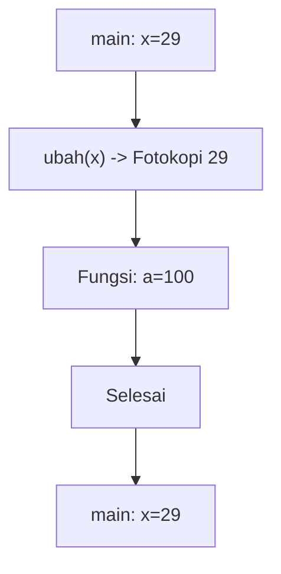

**📖 Cara Membaca Diagram:**
x=29. Saat `ubah(x)`, komputer hanya mengirim fotokopi nilai 29. Fungsi merubah fotokopi jadi 100. Di main, dompet asli x tetap 29.

---
### Soal 102 (Pass By Value)
```cpp
void ubah(int a) {
    a = 100;
}

int main() {
    int x = 43;
    ubah(x);
    // x = ?
```
**Pertanyaan:**
1. Berapakah nilai variabel `x` di dalam `main` setelah fungsi `ubah` selesai?
2. Apa yang terjadi pada variabel `a` di dalam fungsi `ubah`?
3. Analogi apa yang cocok untuk Pass-By-Value?

**Jawaban & Diagnosis:**
1. **43**
2. **Berubah jadi 100, tapi hanya di dalam fungsi tersebut (lokal).**
3. **Fotokopi PR (Dicoret-coret temen gak ngaruh ke buku aslimu).**

**Mermaid Flowchart:**


**📖 Cara Membaca Diagram:**
x=43. Saat `ubah(x)`, komputer hanya mengirim fotokopi nilai 43. Fungsi merubah fotokopi jadi 100. Di main, dompet asli x tetap 43.

---
### Soal 103 (Pass By Value)
```cpp
void ubah(int a) {
    a = 100;
}

int main() {
    int x = 31;
    ubah(x);
    // x = ?
```
**Pertanyaan:**
1. Berapakah nilai variabel `x` di dalam `main` setelah fungsi `ubah` selesai?
2. Apa yang terjadi pada variabel `a` di dalam fungsi `ubah`?
3. Analogi apa yang cocok untuk Pass-By-Value?

**Jawaban & Diagnosis:**
1. **31**
2. **Berubah jadi 100, tapi hanya di dalam fungsi tersebut (lokal).**
3. **Fotokopi PR (Dicoret-coret temen gak ngaruh ke buku aslimu).**

**Mermaid Flowchart:**
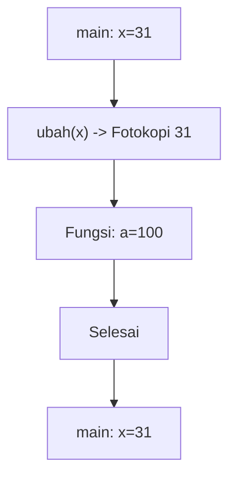

**📖 Cara Membaca Diagram:**
x=31. Saat `ubah(x)`, komputer hanya mengirim fotokopi nilai 31. Fungsi merubah fotokopi jadi 100. Di main, dompet asli x tetap 31.

---
### Soal 104 (Global vs Local)
```cpp
int skor = 169; // Global

void cek() {
    int skor = 3; // Local
    printf("%d", skor);
}

// output = ?
```
**Pertanyaan:**
1. Angka berapakah yang akan tercetak di layar?
2. Siapa yang lebih berkuasa: skor 169 atau skor 3?
3. Apa istilah untuk variabel lokal yang menutupi variabel global?

**Jawaban & Diagnosis:**
1. **3**
2. **Skor 3 (Lokal/Ketua Kelas) karena letaknya di dalam fungsi.**
3. **Shadowing (Membayangi).**

**Mermaid Flowchart:**
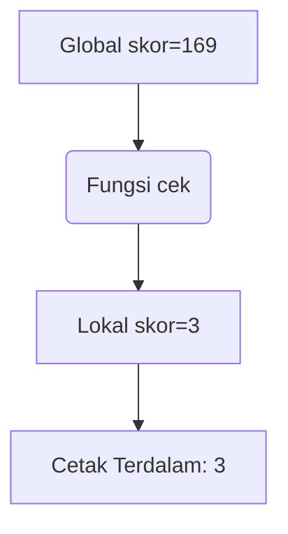

**📖 Cara Membaca Diagram:**
Mesin masuk fungsi. Dia melihat ada dua nama 'skor'. Dia pilih yang terdekat (lokal). Cetak lokal.

---
### Soal 105 (Pass By Reference)
```cpp
void silet(int &a) {
    a = 0;
}

int main() {
    int y = 23;
    silet(y);
    // y = ?
```
**Pertanyaan:**
1. Berapakah nilai variabel `y` di akhir program?
2. Apa tanda yang menunjukkan fungsi ini menggunakan 'Reference'?
3. Analogi apa yang cocok untuk Pass-By-Reference?

**Jawaban & Diagnosis:**
1. **0**
2. **Tanda Amperstand (&) pada parameter `int &a`.**
3. **Memberikan Buku Asli (Kalau dicoret, aslinya rusak).**

**Mermaid Flowchart:**


**📖 Cara Membaca Diagram:**
y=23. Karena ada `&`, fungsi `silet` memegang dompet aslimu. Dia pasang 0, maka y di main ikut jadi 0.

---
### Soal 106 (Pass By Reference)
```cpp
void silet(int &a) {
    a = 0;
}

int main() {
    int y = 30;
    silet(y);
    // y = ?
```
**Pertanyaan:**
1. Berapakah nilai variabel `y` di akhir program?
2. Apa tanda yang menunjukkan fungsi ini menggunakan 'Reference'?
3. Analogi apa yang cocok untuk Pass-By-Reference?

**Jawaban & Diagnosis:**
1. **0**
2. **Tanda Amperstand (&) pada parameter `int &a`.**
3. **Memberikan Buku Asli (Kalau dicoret, aslinya rusak).**

**Mermaid Flowchart:**
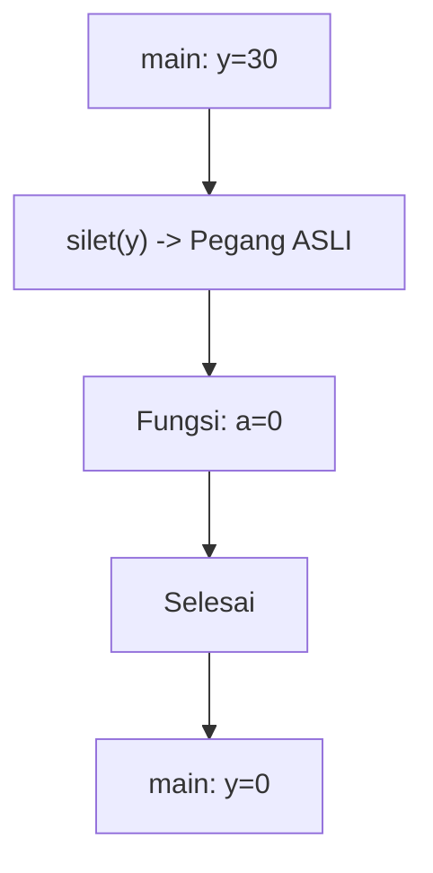

**📖 Cara Membaca Diagram:**
y=30. Karena ada `&`, fungsi `silet` memegang dompet aslimu. Dia pasang 0, maka y di main ikut jadi 0.

---
### Soal 107 (Swap Trick)
```cpp
void tukar(int &a, int &b) {
    a = a + b;
    b = a - b;
    a = a - b;
}
// main: a=5, b=16; tukar(a,b);
```
**Pertanyaan:**
1. Setelah swap, berapa nilai `a`?
2. Setelah swap, berapa nilai `b`?
3. Kenapa tukar ini berhasil tanpa variabel ketiga?

**Jawaban & Diagnosis:**
1. **16**
2. **5**
3. **Karena menggunakan trik aritmetika (tambah-kurang) untuk membalas nilai.**

**Mermaid Flowchart:**
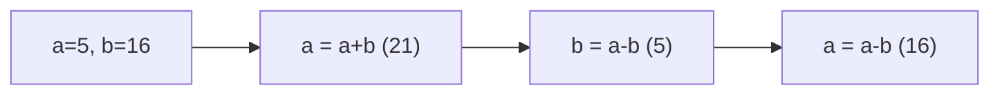

**📖 Cara Membaca Diagram:**
a=5, b=16. a=a+b=21. b=a-b=5=5. a=a-b=16=16. Terbalik!

---
### Soal 108 (Pass By Value)
```cpp
void ubah(int a) {
    a = 100;
}

int main() {
    int x = 37;
    ubah(x);
    // x = ?
```
**Pertanyaan:**
1. Berapakah nilai variabel `x` di dalam `main` setelah fungsi `ubah` selesai?
2. Apa yang terjadi pada variabel `a` di dalam fungsi `ubah`?
3. Analogi apa yang cocok untuk Pass-By-Value?

**Jawaban & Diagnosis:**
1. **37**
2. **Berubah jadi 100, tapi hanya di dalam fungsi tersebut (lokal).**
3. **Fotokopi PR (Dicoret-coret temen gak ngaruh ke buku aslimu).**

**Mermaid Flowchart:**
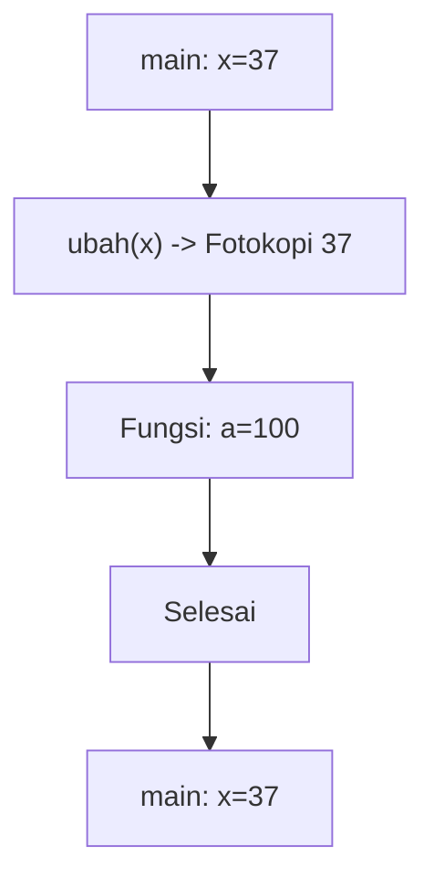

**📖 Cara Membaca Diagram:**
x=37. Saat `ubah(x)`, komputer hanya mengirim fotokopi nilai 37. Fungsi merubah fotokopi jadi 100. Di main, dompet asli x tetap 37.

---
### Soal 109 (Swap Trick)
```cpp
void tukar(int &a, int &b) {
    a = a + b;
    b = a - b;
    a = a - b;
}
// main: a=5, b=17; tukar(a,b);
```
**Pertanyaan:**
1. Setelah swap, berapa nilai `a`?
2. Setelah swap, berapa nilai `b`?
3. Kenapa tukar ini berhasil tanpa variabel ketiga?

**Jawaban & Diagnosis:**
1. **17**
2. **5**
3. **Karena menggunakan trik aritmetika (tambah-kurang) untuk membalas nilai.**

**Mermaid Flowchart:**
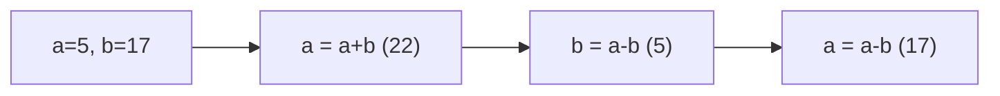

**📖 Cara Membaca Diagram:**
a=5, b=17. a=a+b=22. b=a-b=5=5. a=a-b=17=17. Terbalik!

---
### Soal 110 (Pass By Value)
```cpp
void ubah(int a) {
    a = 100;
}

int main() {
    int x = 10;
    ubah(x);
    // x = ?
```
**Pertanyaan:**
1. Berapakah nilai variabel `x` di dalam `main` setelah fungsi `ubah` selesai?
2. Apa yang terjadi pada variabel `a` di dalam fungsi `ubah`?
3. Analogi apa yang cocok untuk Pass-By-Value?

**Jawaban & Diagnosis:**
1. **10**
2. **Berubah jadi 100, tapi hanya di dalam fungsi tersebut (lokal).**
3. **Fotokopi PR (Dicoret-coret temen gak ngaruh ke buku aslimu).**

**Mermaid Flowchart:**
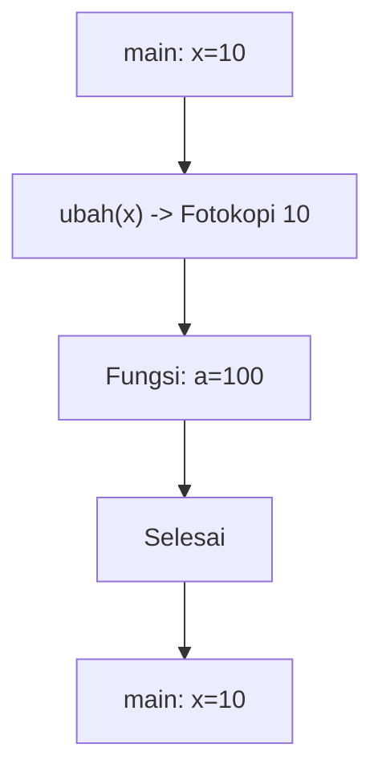

**📖 Cara Membaca Diagram:**
x=10. Saat `ubah(x)`, komputer hanya mengirim fotokopi nilai 10. Fungsi merubah fotokopi jadi 100. Di main, dompet asli x tetap 10.

---
### Soal 111 (Pass By Reference)
```cpp
void silet(int &a) {
    a = 0;
}

int main() {
    int y = 19;
    silet(y);
    // y = ?
```
**Pertanyaan:**
1. Berapakah nilai variabel `y` di akhir program?
2. Apa tanda yang menunjukkan fungsi ini menggunakan 'Reference'?
3. Analogi apa yang cocok untuk Pass-By-Reference?

**Jawaban & Diagnosis:**
1. **0**
2. **Tanda Amperstand (&) pada parameter `int &a`.**
3. **Memberikan Buku Asli (Kalau dicoret, aslinya rusak).**

**Mermaid Flowchart:**


**📖 Cara Membaca Diagram:**
y=19. Karena ada `&`, fungsi `silet` memegang dompet aslimu. Dia pasang 0, maka y di main ikut jadi 0.

---
### Soal 112 (Pass By Value)
```cpp
void ubah(int a) {
    a = 100;
}

int main() {
    int x = 20;
    ubah(x);
    // x = ?
```
**Pertanyaan:**
1. Berapakah nilai variabel `x` di dalam `main` setelah fungsi `ubah` selesai?
2. Apa yang terjadi pada variabel `a` di dalam fungsi `ubah`?
3. Analogi apa yang cocok untuk Pass-By-Value?

**Jawaban & Diagnosis:**
1. **20**
2. **Berubah jadi 100, tapi hanya di dalam fungsi tersebut (lokal).**
3. **Fotokopi PR (Dicoret-coret temen gak ngaruh ke buku aslimu).**

**Mermaid Flowchart:**


**📖 Cara Membaca Diagram:**
x=20. Saat `ubah(x)`, komputer hanya mengirim fotokopi nilai 20. Fungsi merubah fotokopi jadi 100. Di main, dompet asli x tetap 20.

---
### Soal 113 (Pass By Value)
```cpp
void ubah(int a) {
    a = 100;
}

int main() {
    int x = 19;
    ubah(x);
    // x = ?
```
**Pertanyaan:**
1. Berapakah nilai variabel `x` di dalam `main` setelah fungsi `ubah` selesai?
2. Apa yang terjadi pada variabel `a` di dalam fungsi `ubah`?
3. Analogi apa yang cocok untuk Pass-By-Value?

**Jawaban & Diagnosis:**
1. **19**
2. **Berubah jadi 100, tapi hanya di dalam fungsi tersebut (lokal).**
3. **Fotokopi PR (Dicoret-coret temen gak ngaruh ke buku aslimu).**

**Mermaid Flowchart:**


**📖 Cara Membaca Diagram:**
x=19. Saat `ubah(x)`, komputer hanya mengirim fotokopi nilai 19. Fungsi merubah fotokopi jadi 100. Di main, dompet asli x tetap 19.

---
### Soal 114 (Pass By Value)
```cpp
void ubah(int a) {
    a = 100;
}

int main() {
    int x = 15;
    ubah(x);
    // x = ?
```
**Pertanyaan:**
1. Berapakah nilai variabel `x` di dalam `main` setelah fungsi `ubah` selesai?
2. Apa yang terjadi pada variabel `a` di dalam fungsi `ubah`?
3. Analogi apa yang cocok untuk Pass-By-Value?

**Jawaban & Diagnosis:**
1. **15**
2. **Berubah jadi 100, tapi hanya di dalam fungsi tersebut (lokal).**
3. **Fotokopi PR (Dicoret-coret temen gak ngaruh ke buku aslimu).**

**Mermaid Flowchart:**


**📖 Cara Membaca Diagram:**
x=15. Saat `ubah(x)`, komputer hanya mengirim fotokopi nilai 15. Fungsi merubah fotokopi jadi 100. Di main, dompet asli x tetap 15.

---
### Soal 115 (Pass By Value)
```cpp
void ubah(int a) {
    a = 100;
}

int main() {
    int x = 50;
    ubah(x);
    // x = ?
```
**Pertanyaan:**
1. Berapakah nilai variabel `x` di dalam `main` setelah fungsi `ubah` selesai?
2. Apa yang terjadi pada variabel `a` di dalam fungsi `ubah`?
3. Analogi apa yang cocok untuk Pass-By-Value?

**Jawaban & Diagnosis:**
1. **50**
2. **Berubah jadi 100, tapi hanya di dalam fungsi tersebut (lokal).**
3. **Fotokopi PR (Dicoret-coret temen gak ngaruh ke buku aslimu).**

**Mermaid Flowchart:**
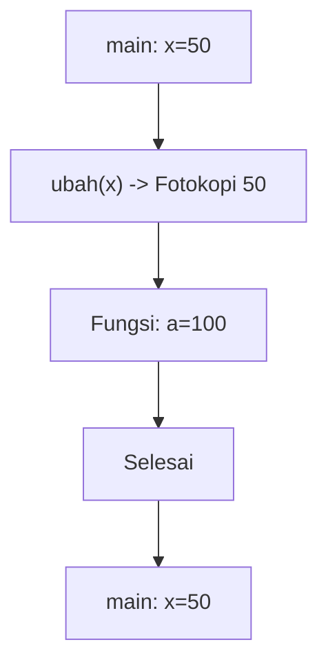

**📖 Cara Membaca Diagram:**
x=50. Saat `ubah(x)`, komputer hanya mengirim fotokopi nilai 50. Fungsi merubah fotokopi jadi 100. Di main, dompet asli x tetap 50.

---
### Soal 116 (Global vs Local)
```cpp
int skor = 148; // Global

void cek() {
    int skor = 3; // Local
    printf("%d", skor);
}

// output = ?
```
**Pertanyaan:**
1. Angka berapakah yang akan tercetak di layar?
2. Siapa yang lebih berkuasa: skor 148 atau skor 3?
3. Apa istilah untuk variabel lokal yang menutupi variabel global?

**Jawaban & Diagnosis:**
1. **3**
2. **Skor 3 (Lokal/Ketua Kelas) karena letaknya di dalam fungsi.**
3. **Shadowing (Membayangi).**

**Mermaid Flowchart:**


**📖 Cara Membaca Diagram:**
Mesin masuk fungsi. Dia melihat ada dua nama 'skor'. Dia pilih yang terdekat (lokal). Cetak lokal.

---
### Soal 117 (Swap Trick)
```cpp
void tukar(int &a, int &b) {
    a = a + b;
    b = a - b;
    a = a - b;
}
// main: a=2, b=15; tukar(a,b);
```
**Pertanyaan:**
1. Setelah swap, berapa nilai `a`?
2. Setelah swap, berapa nilai `b`?
3. Kenapa tukar ini berhasil tanpa variabel ketiga?

**Jawaban & Diagnosis:**
1. **15**
2. **2**
3. **Karena menggunakan trik aritmetika (tambah-kurang) untuk membalas nilai.**

**Mermaid Flowchart:**
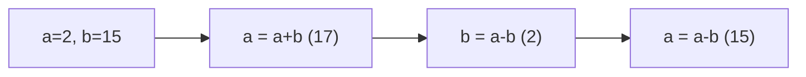

**📖 Cara Membaca Diagram:**
a=2, b=15. a=a+b=17. b=a-b=2=2. a=a-b=15=15. Terbalik!

---
### Soal 118 (Pass By Value)
```cpp
void ubah(int a) {
    a = 100;
}

int main() {
    int x = 11;
    ubah(x);
    // x = ?
```
**Pertanyaan:**
1. Berapakah nilai variabel `x` di dalam `main` setelah fungsi `ubah` selesai?
2. Apa yang terjadi pada variabel `a` di dalam fungsi `ubah`?
3. Analogi apa yang cocok untuk Pass-By-Value?

**Jawaban & Diagnosis:**
1. **11**
2. **Berubah jadi 100, tapi hanya di dalam fungsi tersebut (lokal).**
3. **Fotokopi PR (Dicoret-coret temen gak ngaruh ke buku aslimu).**

**Mermaid Flowchart:**
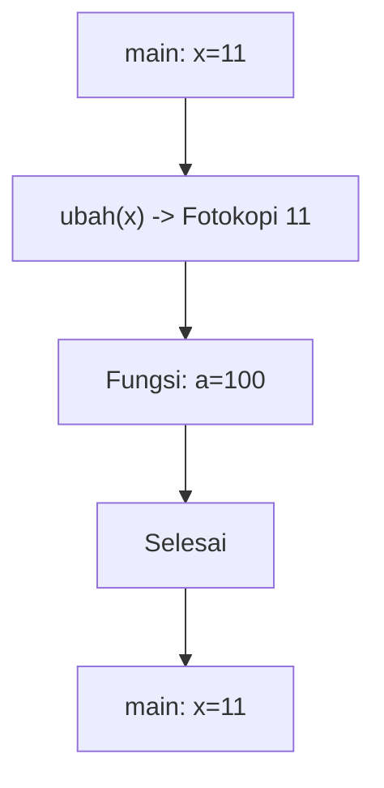

**📖 Cara Membaca Diagram:**
x=11. Saat `ubah(x)`, komputer hanya mengirim fotokopi nilai 11. Fungsi merubah fotokopi jadi 100. Di main, dompet asli x tetap 11.

---
### Soal 119 (Pass By Reference)
```cpp
void silet(int &a) {
    a = 0;
}

int main() {
    int y = 43;
    silet(y);
    // y = ?
```
**Pertanyaan:**
1. Berapakah nilai variabel `y` di akhir program?
2. Apa tanda yang menunjukkan fungsi ini menggunakan 'Reference'?
3. Analogi apa yang cocok untuk Pass-By-Reference?

**Jawaban & Diagnosis:**
1. **0**
2. **Tanda Amperstand (&) pada parameter `int &a`.**
3. **Memberikan Buku Asli (Kalau dicoret, aslinya rusak).**

**Mermaid Flowchart:**


**📖 Cara Membaca Diagram:**
y=43. Karena ada `&`, fungsi `silet` memegang dompet aslimu. Dia pasang 0, maka y di main ikut jadi 0.

---
### Soal 120 (Pass By Reference)
```cpp
void silet(int &a) {
    a = 0;
}

int main() {
    int y = 49;
    silet(y);
    // y = ?
```
**Pertanyaan:**
1. Berapakah nilai variabel `y` di akhir program?
2. Apa tanda yang menunjukkan fungsi ini menggunakan 'Reference'?
3. Analogi apa yang cocok untuk Pass-By-Reference?

**Jawaban & Diagnosis:**
1. **0**
2. **Tanda Amperstand (&) pada parameter `int &a`.**
3. **Memberikan Buku Asli (Kalau dicoret, aslinya rusak).**

**Mermaid Flowchart:**


**📖 Cara Membaca Diagram:**
y=49. Karena ada `&`, fungsi `silet` memegang dompet aslimu. Dia pasang 0, maka y di main ikut jadi 0.

---
### Soal 121 (Swap Trick)
```cpp
void tukar(int &a, int &b) {
    a = a + b;
    b = a - b;
    a = a - b;
}
// main: a=10, b=11; tukar(a,b);
```
**Pertanyaan:**
1. Setelah swap, berapa nilai `a`?
2. Setelah swap, berapa nilai `b`?
3. Kenapa tukar ini berhasil tanpa variabel ketiga?

**Jawaban & Diagnosis:**
1. **11**
2. **10**
3. **Karena menggunakan trik aritmetika (tambah-kurang) untuk membalas nilai.**

**Mermaid Flowchart:**
```mermaid
graph LR
    A["a=10, b=11"] --> B["a = a+b (21)"]
    B --> C["b = a-b (10)"]
    C --> D["a = a-b (11)"]
```

**📖 Cara Membaca Diagram:**
a=10, b=11. a=a+b=21. b=a-b=10=10. a=a-b=11=11. Terbalik!

---
### Soal 122 (Global vs Local)
```cpp
int skor = 100; // Global

void cek() {
    int skor = 9; // Local
    printf("%d", skor);
}

// output = ?
```
**Pertanyaan:**
1. Angka berapakah yang akan tercetak di layar?
2. Siapa yang lebih berkuasa: skor 100 atau skor 9?
3. Apa istilah untuk variabel lokal yang menutupi variabel global?

**Jawaban & Diagnosis:**
1. **9**
2. **Skor 9 (Lokal/Ketua Kelas) karena letaknya di dalam fungsi.**
3. **Shadowing (Membayangi).**

**Mermaid Flowchart:**
```mermaid
graph TD
    A[Global skor=100] --> B(Fungsi cek)
    B --> C[Lokal skor=9]
    C --> D[Cetak Terdalam: 9]
```

**📖 Cara Membaca Diagram:**
Mesin masuk fungsi. Dia melihat ada dua nama 'skor'. Dia pilih yang terdekat (lokal). Cetak lokal.

---
### Soal 123 (Global vs Local)
```cpp
int skor = 142; // Global

void cek() {
    int skor = 2; // Local
    printf("%d", skor);
}

// output = ?
```
**Pertanyaan:**
1. Angka berapakah yang akan tercetak di layar?
2. Siapa yang lebih berkuasa: skor 142 atau skor 2?
3. Apa istilah untuk variabel lokal yang menutupi variabel global?

**Jawaban & Diagnosis:**
1. **2**
2. **Skor 2 (Lokal/Ketua Kelas) karena letaknya di dalam fungsi.**
3. **Shadowing (Membayangi).**

**Mermaid Flowchart:**
```mermaid
graph TD
    A[Global skor=142] --> B(Fungsi cek)
    B --> C[Lokal skor=2]
    C --> D[Cetak Terdalam: 2]
```

**📖 Cara Membaca Diagram:**
Mesin masuk fungsi. Dia melihat ada dua nama 'skor'. Dia pilih yang terdekat (lokal). Cetak lokal.

---
### Soal 124 (Pass By Reference)
```cpp
void silet(int &a) {
    a = 0;
}

int main() {
    int y = 34;
    silet(y);
    // y = ?
```
**Pertanyaan:**
1. Berapakah nilai variabel `y` di akhir program?
2. Apa tanda yang menunjukkan fungsi ini menggunakan 'Reference'?
3. Analogi apa yang cocok untuk Pass-By-Reference?

**Jawaban & Diagnosis:**
1. **0**
2. **Tanda Amperstand (&) pada parameter `int &a`.**
3. **Memberikan Buku Asli (Kalau dicoret, aslinya rusak).**

**Mermaid Flowchart:**
```mermaid
graph TD
    A[main: y=34] --> B["silet(y) -> Pegang ASLI"]
    B --> C[Fungsi: a=0]
    C --> D[Selesai]
    D --> E[main: y=0]
```

**📖 Cara Membaca Diagram:**
y=34. Karena ada `&`, fungsi `silet` memegang dompet aslimu. Dia pasang 0, maka y di main ikut jadi 0.

---
### Soal 125 (Pass By Reference)
```cpp
void silet(int &a) {
    a = 0;
}

int main() {
    int y = 29;
    silet(y);
    // y = ?
```
**Pertanyaan:**
1. Berapakah nilai variabel `y` di akhir program?
2. Apa tanda yang menunjukkan fungsi ini menggunakan 'Reference'?
3. Analogi apa yang cocok untuk Pass-By-Reference?

**Jawaban & Diagnosis:**
1. **0**
2. **Tanda Amperstand (&) pada parameter `int &a`.**
3. **Memberikan Buku Asli (Kalau dicoret, aslinya rusak).**

**Mermaid Flowchart:**
```mermaid
graph TD
    A[main: y=29] --> B["silet(y) -> Pegang ASLI"]
    B --> C[Fungsi: a=0]
    C --> D[Selesai]
    D --> E[main: y=0]
```

**📖 Cara Membaca Diagram:**
y=29. Karena ada `&`, fungsi `silet` memegang dompet aslimu. Dia pasang 0, maka y di main ikut jadi 0.

---
