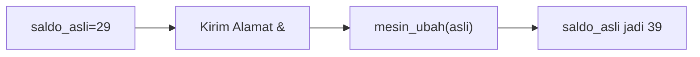
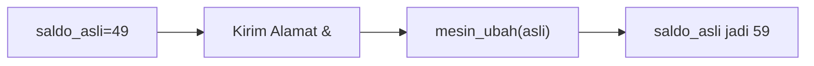
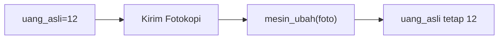
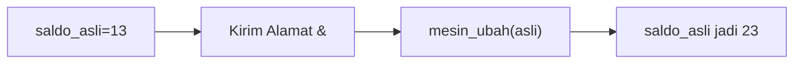
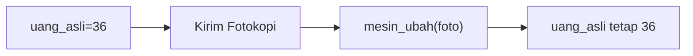
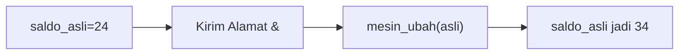
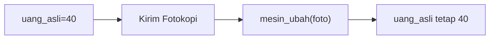
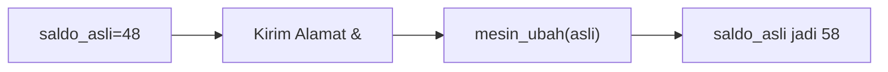

🔙 **[Kembali ke Daftar Soal](./README.md)**

---

# Latihan Soal Part C - Modul 04 - Set 05

### Soal 101
```cpp
void mesin_ajaib(int &a) { a = a + 10; }
// main: int saldo = 29; mesin_ajaib(saldo);
```
**Pertanyaan:**
1. Berapakah hasil akhirnya?
2. Deskripsikan langkah robot compiler saat memproses kode ini!

**Jawaban & Diagnosis:**
1. **39**
2. Baca bagian 'Analisis Mendalam' di bawah.

**Mermaid Flowchart:**


**📖 Penjelasan Komprehensif:**
**Analisis Mendalam (Compiler Manusia):**
1. **Pass-by-Reference**: Tanda `&` memberikan kunci akses langsung ke variabel `saldo`.
2. **Efek**: Apa pun yang dilakukan fungsi pada `a` langsung merubah isi fisik memori `saldo`.
3. **Hasil Akhir**: `saldo` bertambah jadi **39**.

---
### Soal 102
```cpp
void mesin_ajaib(int &a) { a = a + 10; }
// main: int saldo = 34; mesin_ajaib(saldo);
```
**Pertanyaan:**
1. Berapakah hasil akhirnya?
2. Deskripsikan langkah robot compiler saat memproses kode ini!

**Jawaban & Diagnosis:**
1. **44**
2. Baca bagian 'Analisis Mendalam' di bawah.

**Mermaid Flowchart:**


**📖 Penjelasan Komprehensif:**
**Analisis Mendalam (Compiler Manusia):**
1. **Pass-by-Reference**: Tanda `&` memberikan kunci akses langsung ke variabel `saldo`.
2. **Efek**: Apa pun yang dilakukan fungsi pada `a` langsung merubah isi fisik memori `saldo`.
3. **Hasil Akhir**: `saldo` bertambah jadi **44**.

---
### Soal 103
```cpp
void mesin_ajaib(int &a) { a = a + 10; }
// main: int saldo = 49; mesin_ajaib(saldo);
```
**Pertanyaan:**
1. Berapakah hasil akhirnya?
2. Deskripsikan langkah robot compiler saat memproses kode ini!

**Jawaban & Diagnosis:**
1. **59**
2. Baca bagian 'Analisis Mendalam' di bawah.

**Mermaid Flowchart:**


**📖 Penjelasan Komprehensif:**
**Analisis Mendalam (Compiler Manusia):**
1. **Pass-by-Reference**: Tanda `&` memberikan kunci akses langsung ke variabel `saldo`.
2. **Efek**: Apa pun yang dilakukan fungsi pada `a` langsung merubah isi fisik memori `saldo`.
3. **Hasil Akhir**: `saldo` bertambah jadi **59**.

---
### Soal 104
```cpp
void mesin_ajaib(int &a) { a = a + 10; }
// main: int saldo = 38; mesin_ajaib(saldo);
```
**Pertanyaan:**
1. Berapakah hasil akhirnya?
2. Deskripsikan langkah robot compiler saat memproses kode ini!

**Jawaban & Diagnosis:**
1. **48**
2. Baca bagian 'Analisis Mendalam' di bawah.

**Mermaid Flowchart:**


**📖 Penjelasan Komprehensif:**
**Analisis Mendalam (Compiler Manusia):**
1. **Pass-by-Reference**: Tanda `&` memberikan kunci akses langsung ke variabel `saldo`.
2. **Efek**: Apa pun yang dilakukan fungsi pada `a` langsung merubah isi fisik memori `saldo`.
3. **Hasil Akhir**: `saldo` bertambah jadi **48**.

---
### Soal 105
```cpp
void mesin_foto(int a) { a = a + 100; }
// main: int uang = 12; mesin_foto(uang);
```
**Pertanyaan:**
1. Berapakah hasil akhirnya?
2. Deskripsikan langkah robot compiler saat memproses kode ini!

**Jawaban & Diagnosis:**
1. **12**
2. Baca bagian 'Analisis Mendalam' di bawah.

**Mermaid Flowchart:**


**📖 Penjelasan Komprehensif:**
**Analisis Mendalam (Compiler Manusia):**
1. **Pass-by-Value**: Variabel `uang` hanya mengirim salinannya ke fungsi.
2. **Efek**: Fungsi mengacak-acak salinan tersebut (tambah 100), tapi tidak menyentuh dompet aslimu.
3. **Hasil Akhir**: Nilai `uang` di main tetap **12**.

---
### Soal 106
```cpp
void mesin_ajaib(int &a) { a = a + 10; }
// main: int saldo = 13; mesin_ajaib(saldo);
```
**Pertanyaan:**
1. Berapakah hasil akhirnya?
2. Deskripsikan langkah robot compiler saat memproses kode ini!

**Jawaban & Diagnosis:**
1. **23**
2. Baca bagian 'Analisis Mendalam' di bawah.

**Mermaid Flowchart:**


**📖 Penjelasan Komprehensif:**
**Analisis Mendalam (Compiler Manusia):**
1. **Pass-by-Reference**: Tanda `&` memberikan kunci akses langsung ke variabel `saldo`.
2. **Efek**: Apa pun yang dilakukan fungsi pada `a` langsung merubah isi fisik memori `saldo`.
3. **Hasil Akhir**: `saldo` bertambah jadi **23**.

---
### Soal 107
```cpp
void mesin_foto(int a) { a = a + 100; }
// main: int uang = 36; mesin_foto(uang);
```
**Pertanyaan:**
1. Berapakah hasil akhirnya?
2. Deskripsikan langkah robot compiler saat memproses kode ini!

**Jawaban & Diagnosis:**
1. **36**
2. Baca bagian 'Analisis Mendalam' di bawah.

**Mermaid Flowchart:**


**📖 Penjelasan Komprehensif:**
**Analisis Mendalam (Compiler Manusia):**
1. **Pass-by-Value**: Variabel `uang` hanya mengirim salinannya ke fungsi.
2. **Efek**: Fungsi mengacak-acak salinan tersebut (tambah 100), tapi tidak menyentuh dompet aslimu.
3. **Hasil Akhir**: Nilai `uang` di main tetap **36**.

---
### Soal 108
```cpp
void mesin_foto(int a) { a = a + 100; }
// main: int uang = 39; mesin_foto(uang);
```
**Pertanyaan:**
1. Berapakah hasil akhirnya?
2. Deskripsikan langkah robot compiler saat memproses kode ini!

**Jawaban & Diagnosis:**
1. **39**
2. Baca bagian 'Analisis Mendalam' di bawah.

**Mermaid Flowchart:**


**📖 Penjelasan Komprehensif:**
**Analisis Mendalam (Compiler Manusia):**
1. **Pass-by-Value**: Variabel `uang` hanya mengirim salinannya ke fungsi.
2. **Efek**: Fungsi mengacak-acak salinan tersebut (tambah 100), tapi tidak menyentuh dompet aslimu.
3. **Hasil Akhir**: Nilai `uang` di main tetap **39**.

---
### Soal 109
```cpp
void mesin_foto(int a) { a = a + 100; }
// main: int uang = 23; mesin_foto(uang);
```
**Pertanyaan:**
1. Berapakah hasil akhirnya?
2. Deskripsikan langkah robot compiler saat memproses kode ini!

**Jawaban & Diagnosis:**
1. **23**
2. Baca bagian 'Analisis Mendalam' di bawah.

**Mermaid Flowchart:**


**📖 Penjelasan Komprehensif:**
**Analisis Mendalam (Compiler Manusia):**
1. **Pass-by-Value**: Variabel `uang` hanya mengirim salinannya ke fungsi.
2. **Efek**: Fungsi mengacak-acak salinan tersebut (tambah 100), tapi tidak menyentuh dompet aslimu.
3. **Hasil Akhir**: Nilai `uang` di main tetap **23**.

---
### Soal 110
```cpp
void mesin_foto(int a) { a = a + 100; }
// main: int uang = 44; mesin_foto(uang);
```
**Pertanyaan:**
1. Berapakah hasil akhirnya?
2. Deskripsikan langkah robot compiler saat memproses kode ini!

**Jawaban & Diagnosis:**
1. **44**
2. Baca bagian 'Analisis Mendalam' di bawah.

**Mermaid Flowchart:**


**📖 Penjelasan Komprehensif:**
**Analisis Mendalam (Compiler Manusia):**
1. **Pass-by-Value**: Variabel `uang` hanya mengirim salinannya ke fungsi.
2. **Efek**: Fungsi mengacak-acak salinan tersebut (tambah 100), tapi tidak menyentuh dompet aslimu.
3. **Hasil Akhir**: Nilai `uang` di main tetap **44**.

---
### Soal 111
```cpp
void mesin_ajaib(int &a) { a = a + 10; }
// main: int saldo = 24; mesin_ajaib(saldo);
```
**Pertanyaan:**
1. Berapakah hasil akhirnya?
2. Deskripsikan langkah robot compiler saat memproses kode ini!

**Jawaban & Diagnosis:**
1. **34**
2. Baca bagian 'Analisis Mendalam' di bawah.

**Mermaid Flowchart:**


**📖 Penjelasan Komprehensif:**
**Analisis Mendalam (Compiler Manusia):**
1. **Pass-by-Reference**: Tanda `&` memberikan kunci akses langsung ke variabel `saldo`.
2. **Efek**: Apa pun yang dilakukan fungsi pada `a` langsung merubah isi fisik memori `saldo`.
3. **Hasil Akhir**: `saldo` bertambah jadi **34**.

---
### Soal 112
```cpp
void mesin_foto(int a) { a = a + 100; }
// main: int uang = 44; mesin_foto(uang);
```
**Pertanyaan:**
1. Berapakah hasil akhirnya?
2. Deskripsikan langkah robot compiler saat memproses kode ini!

**Jawaban & Diagnosis:**
1. **44**
2. Baca bagian 'Analisis Mendalam' di bawah.

**Mermaid Flowchart:**


**📖 Penjelasan Komprehensif:**
**Analisis Mendalam (Compiler Manusia):**
1. **Pass-by-Value**: Variabel `uang` hanya mengirim salinannya ke fungsi.
2. **Efek**: Fungsi mengacak-acak salinan tersebut (tambah 100), tapi tidak menyentuh dompet aslimu.
3. **Hasil Akhir**: Nilai `uang` di main tetap **44**.

---
### Soal 113
```cpp
void mesin_ajaib(int &a) { a = a + 10; }
// main: int saldo = 46; mesin_ajaib(saldo);
```
**Pertanyaan:**
1. Berapakah hasil akhirnya?
2. Deskripsikan langkah robot compiler saat memproses kode ini!

**Jawaban & Diagnosis:**
1. **56**
2. Baca bagian 'Analisis Mendalam' di bawah.

**Mermaid Flowchart:**


**📖 Penjelasan Komprehensif:**
**Analisis Mendalam (Compiler Manusia):**
1. **Pass-by-Reference**: Tanda `&` memberikan kunci akses langsung ke variabel `saldo`.
2. **Efek**: Apa pun yang dilakukan fungsi pada `a` langsung merubah isi fisik memori `saldo`.
3. **Hasil Akhir**: `saldo` bertambah jadi **56**.

---
### Soal 114
```cpp
void mesin_ajaib(int &a) { a = a + 10; }
// main: int saldo = 32; mesin_ajaib(saldo);
```
**Pertanyaan:**
1. Berapakah hasil akhirnya?
2. Deskripsikan langkah robot compiler saat memproses kode ini!

**Jawaban & Diagnosis:**
1. **42**
2. Baca bagian 'Analisis Mendalam' di bawah.

**Mermaid Flowchart:**


**📖 Penjelasan Komprehensif:**
**Analisis Mendalam (Compiler Manusia):**
1. **Pass-by-Reference**: Tanda `&` memberikan kunci akses langsung ke variabel `saldo`.
2. **Efek**: Apa pun yang dilakukan fungsi pada `a` langsung merubah isi fisik memori `saldo`.
3. **Hasil Akhir**: `saldo` bertambah jadi **42**.

---
### Soal 115
```cpp
void mesin_foto(int a) { a = a + 100; }
// main: int uang = 40; mesin_foto(uang);
```
**Pertanyaan:**
1. Berapakah hasil akhirnya?
2. Deskripsikan langkah robot compiler saat memproses kode ini!

**Jawaban & Diagnosis:**
1. **40**
2. Baca bagian 'Analisis Mendalam' di bawah.

**Mermaid Flowchart:**


**📖 Penjelasan Komprehensif:**
**Analisis Mendalam (Compiler Manusia):**
1. **Pass-by-Value**: Variabel `uang` hanya mengirim salinannya ke fungsi.
2. **Efek**: Fungsi mengacak-acak salinan tersebut (tambah 100), tapi tidak menyentuh dompet aslimu.
3. **Hasil Akhir**: Nilai `uang` di main tetap **40**.

---
### Soal 116
```cpp
void mesin_foto(int a) { a = a + 100; }
// main: int uang = 18; mesin_foto(uang);
```
**Pertanyaan:**
1. Berapakah hasil akhirnya?
2. Deskripsikan langkah robot compiler saat memproses kode ini!

**Jawaban & Diagnosis:**
1. **18**
2. Baca bagian 'Analisis Mendalam' di bawah.

**Mermaid Flowchart:**


**📖 Penjelasan Komprehensif:**
**Analisis Mendalam (Compiler Manusia):**
1. **Pass-by-Value**: Variabel `uang` hanya mengirim salinannya ke fungsi.
2. **Efek**: Fungsi mengacak-acak salinan tersebut (tambah 100), tapi tidak menyentuh dompet aslimu.
3. **Hasil Akhir**: Nilai `uang` di main tetap **18**.

---
### Soal 117
```cpp
void mesin_foto(int a) { a = a + 100; }
// main: int uang = 19; mesin_foto(uang);
```
**Pertanyaan:**
1. Berapakah hasil akhirnya?
2. Deskripsikan langkah robot compiler saat memproses kode ini!

**Jawaban & Diagnosis:**
1. **19**
2. Baca bagian 'Analisis Mendalam' di bawah.

**Mermaid Flowchart:**


**📖 Penjelasan Komprehensif:**
**Analisis Mendalam (Compiler Manusia):**
1. **Pass-by-Value**: Variabel `uang` hanya mengirim salinannya ke fungsi.
2. **Efek**: Fungsi mengacak-acak salinan tersebut (tambah 100), tapi tidak menyentuh dompet aslimu.
3. **Hasil Akhir**: Nilai `uang` di main tetap **19**.

---
### Soal 118
```cpp
void mesin_foto(int a) { a = a + 100; }
// main: int uang = 33; mesin_foto(uang);
```
**Pertanyaan:**
1. Berapakah hasil akhirnya?
2. Deskripsikan langkah robot compiler saat memproses kode ini!

**Jawaban & Diagnosis:**
1. **33**
2. Baca bagian 'Analisis Mendalam' di bawah.

**Mermaid Flowchart:**


**📖 Penjelasan Komprehensif:**
**Analisis Mendalam (Compiler Manusia):**
1. **Pass-by-Value**: Variabel `uang` hanya mengirim salinannya ke fungsi.
2. **Efek**: Fungsi mengacak-acak salinan tersebut (tambah 100), tapi tidak menyentuh dompet aslimu.
3. **Hasil Akhir**: Nilai `uang` di main tetap **33**.

---
### Soal 119
```cpp
void mesin_ajaib(int &a) { a = a + 10; }
// main: int saldo = 48; mesin_ajaib(saldo);
```
**Pertanyaan:**
1. Berapakah hasil akhirnya?
2. Deskripsikan langkah robot compiler saat memproses kode ini!

**Jawaban & Diagnosis:**
1. **58**
2. Baca bagian 'Analisis Mendalam' di bawah.

**Mermaid Flowchart:**


**📖 Penjelasan Komprehensif:**
**Analisis Mendalam (Compiler Manusia):**
1. **Pass-by-Reference**: Tanda `&` memberikan kunci akses langsung ke variabel `saldo`.
2. **Efek**: Apa pun yang dilakukan fungsi pada `a` langsung merubah isi fisik memori `saldo`.
3. **Hasil Akhir**: `saldo` bertambah jadi **58**.

---
### Soal 120
```cpp
void mesin_ajaib(int &a) { a = a + 10; }
// main: int saldo = 50; mesin_ajaib(saldo);
```
**Pertanyaan:**
1. Berapakah hasil akhirnya?
2. Deskripsikan langkah robot compiler saat memproses kode ini!

**Jawaban & Diagnosis:**
1. **60**
2. Baca bagian 'Analisis Mendalam' di bawah.

**Mermaid Flowchart:**


**📖 Penjelasan Komprehensif:**
**Analisis Mendalam (Compiler Manusia):**
1. **Pass-by-Reference**: Tanda `&` memberikan kunci akses langsung ke variabel `saldo`.
2. **Efek**: Apa pun yang dilakukan fungsi pada `a` langsung merubah isi fisik memori `saldo`.
3. **Hasil Akhir**: `saldo` bertambah jadi **60**.

---
### Soal 121
```cpp
void mesin_ajaib(int &a) { a = a + 10; }
// main: int saldo = 44; mesin_ajaib(saldo);
```
**Pertanyaan:**
1. Berapakah hasil akhirnya?
2. Deskripsikan langkah robot compiler saat memproses kode ini!

**Jawaban & Diagnosis:**
1. **54**
2. Baca bagian 'Analisis Mendalam' di bawah.

**Mermaid Flowchart:**
```mermaid
graph LR
A["saldo_asli=44"] --> B["Kirim Alamat &"]
B --> C["mesin_ubah(asli)"]
C --> D["saldo_asli jadi 54"]
```

**📖 Penjelasan Komprehensif:**
**Analisis Mendalam (Compiler Manusia):**
1. **Pass-by-Reference**: Tanda `&` memberikan kunci akses langsung ke variabel `saldo`.
2. **Efek**: Apa pun yang dilakukan fungsi pada `a` langsung merubah isi fisik memori `saldo`.
3. **Hasil Akhir**: `saldo` bertambah jadi **54**.

---
### Soal 122
```cpp
void mesin_foto(int a) { a = a + 100; }
// main: int uang = 32; mesin_foto(uang);
```
**Pertanyaan:**
1. Berapakah hasil akhirnya?
2. Deskripsikan langkah robot compiler saat memproses kode ini!

**Jawaban & Diagnosis:**
1. **32**
2. Baca bagian 'Analisis Mendalam' di bawah.

**Mermaid Flowchart:**
```mermaid
graph LR
A["uang_asli=32"] --> B["Kirim Fotokopi"]
B --> C["mesin_ubah(foto)"]
C --> D["uang_asli tetap 32"]
```

**📖 Penjelasan Komprehensif:**
**Analisis Mendalam (Compiler Manusia):**
1. **Pass-by-Value**: Variabel `uang` hanya mengirim salinannya ke fungsi.
2. **Efek**: Fungsi mengacak-acak salinan tersebut (tambah 100), tapi tidak menyentuh dompet aslimu.
3. **Hasil Akhir**: Nilai `uang` di main tetap **32**.

---
### Soal 123
```cpp
void mesin_foto(int a) { a = a + 100; }
// main: int uang = 38; mesin_foto(uang);
```
**Pertanyaan:**
1. Berapakah hasil akhirnya?
2. Deskripsikan langkah robot compiler saat memproses kode ini!

**Jawaban & Diagnosis:**
1. **38**
2. Baca bagian 'Analisis Mendalam' di bawah.

**Mermaid Flowchart:**
```mermaid
graph LR
A["uang_asli=38"] --> B["Kirim Fotokopi"]
B --> C["mesin_ubah(foto)"]
C --> D["uang_asli tetap 38"]
```

**📖 Penjelasan Komprehensif:**
**Analisis Mendalam (Compiler Manusia):**
1. **Pass-by-Value**: Variabel `uang` hanya mengirim salinannya ke fungsi.
2. **Efek**: Fungsi mengacak-acak salinan tersebut (tambah 100), tapi tidak menyentuh dompet aslimu.
3. **Hasil Akhir**: Nilai `uang` di main tetap **38**.

---
### Soal 124
```cpp
void mesin_ajaib(int &a) { a = a + 10; }
// main: int saldo = 35; mesin_ajaib(saldo);
```
**Pertanyaan:**
1. Berapakah hasil akhirnya?
2. Deskripsikan langkah robot compiler saat memproses kode ini!

**Jawaban & Diagnosis:**
1. **45**
2. Baca bagian 'Analisis Mendalam' di bawah.

**Mermaid Flowchart:**
```mermaid
graph LR
A["saldo_asli=35"] --> B["Kirim Alamat &"]
B --> C["mesin_ubah(asli)"]
C --> D["saldo_asli jadi 45"]
```

**📖 Penjelasan Komprehensif:**
**Analisis Mendalam (Compiler Manusia):**
1. **Pass-by-Reference**: Tanda `&` memberikan kunci akses langsung ke variabel `saldo`.
2. **Efek**: Apa pun yang dilakukan fungsi pada `a` langsung merubah isi fisik memori `saldo`.
3. **Hasil Akhir**: `saldo` bertambah jadi **45**.

---
### Soal 125
```cpp
void mesin_foto(int a) { a = a + 100; }
// main: int uang = 21; mesin_foto(uang);
```
**Pertanyaan:**
1. Berapakah hasil akhirnya?
2. Deskripsikan langkah robot compiler saat memproses kode ini!

**Jawaban & Diagnosis:**
1. **21**
2. Baca bagian 'Analisis Mendalam' di bawah.

**Mermaid Flowchart:**
```mermaid
graph LR
A["uang_asli=21"] --> B["Kirim Fotokopi"]
B --> C["mesin_ubah(foto)"]
C --> D["uang_asli tetap 21"]
```

**📖 Penjelasan Komprehensif:**
**Analisis Mendalam (Compiler Manusia):**
1. **Pass-by-Value**: Variabel `uang` hanya mengirim salinannya ke fungsi.
2. **Efek**: Fungsi mengacak-acak salinan tersebut (tambah 100), tapi tidak menyentuh dompet aslimu.
3. **Hasil Akhir**: Nilai `uang` di main tetap **21**.

---
