🔙 **[Kembali ke Daftar Soal](./README.md)**

---

# Latihan Soal Part C - Modul 04 - Set 06

### Soal 126
```cpp
int f(int x) { return x * 2; }
// main: int a = 3; a = f(a) + f(2);
```
**Pertanyaan:**
1. Berapakah hasil akhirnya?
2. Mengapa demikian?

**Jawaban & Diagnosis:**
1. **10**
2. Lihat Tracing.

**Mermaid Flowchart:**


**📖 Penjelasan:**
**Langkah Tracing:**
1. f(3) = 6.
2. f(2) = 4.
3. Jumlah: 10.

---
### Soal 127
```cpp
int f(int x) { return x * 2; }
// main: int a = 2; a = f(a) + f(2);
```
**Pertanyaan:**
1. Berapakah hasil akhirnya?
2. Mengapa demikian?

**Jawaban & Diagnosis:**
1. **8**
2. Lihat Tracing.

**Mermaid Flowchart:**
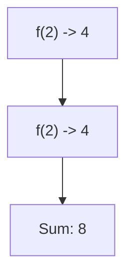

**📖 Penjelasan:**
**Langkah Tracing:**
1. f(2) = 4.
2. f(2) = 4.
3. Jumlah: 8.

---
### Soal 128
```cpp
int f(int x) { return x * 2; }
// main: int a = 4; a = f(a) + f(2);
```
**Pertanyaan:**
1. Berapakah hasil akhirnya?
2. Mengapa demikian?

**Jawaban & Diagnosis:**
1. **12**
2. Lihat Tracing.

**Mermaid Flowchart:**
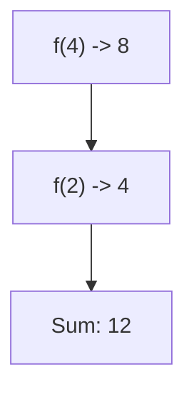

**📖 Penjelasan:**
**Langkah Tracing:**
1. f(4) = 8.
2. f(2) = 4.
3. Jumlah: 12.

---
### Soal 129
```cpp
int f(int x) { return x * 2; }
// main: int a = 5; a = f(a) + f(2);
```
**Pertanyaan:**
1. Berapakah hasil akhirnya?
2. Mengapa demikian?

**Jawaban & Diagnosis:**
1. **14**
2. Lihat Tracing.

**Mermaid Flowchart:**
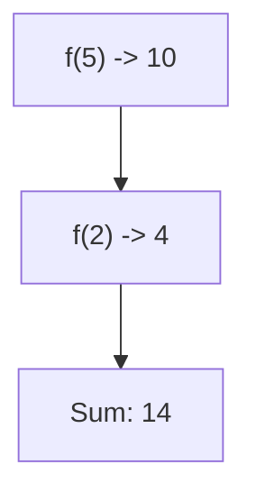

**📖 Penjelasan:**
**Langkah Tracing:**
1. f(5) = 10.
2. f(2) = 4.
3. Jumlah: 14.

---
### Soal 130
```cpp
void swap(int &a, int b) { int t=a; a=b; b=t; }
// main: int x=8, y=13; swap(x, y);
```
**Pertanyaan:**
1. Berapakah hasil akhirnya?
2. Mengapa demikian?

**Jawaban & Diagnosis:**
1. **x=13, y=13**
2. Lihat Tracing.

**Mermaid Flowchart:**
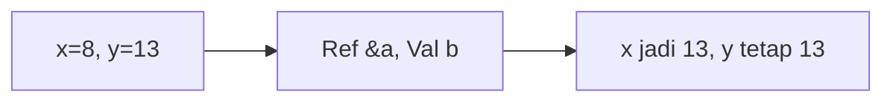

**📖 Penjelasan:**
**Langkah Tracing:**
1. x dilempar secara `reference` (&), maka nilainya berubah.
2. y dilempar secara `value`, maka aslinya aman.

---
### Soal 131
```cpp
void swap(int &a, int b) { int t=a; a=b; b=t; }
// main: int x=8, y=18; swap(x, y);
```
**Pertanyaan:**
1. Berapakah hasil akhirnya?
2. Mengapa demikian?

**Jawaban & Diagnosis:**
1. **x=18, y=18**
2. Lihat Tracing.

**Mermaid Flowchart:**
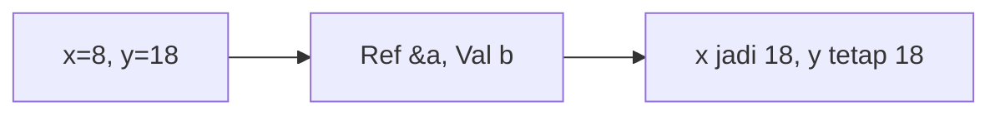

**📖 Penjelasan:**
**Langkah Tracing:**
1. x dilempar secara `reference` (&), maka nilainya berubah.
2. y dilempar secara `value`, maka aslinya aman.

---
### Soal 132
```cpp
void swap(int &a, int b) { int t=a; a=b; b=t; }
// main: int x=12, y=7; swap(x, y);
```
**Pertanyaan:**
1. Berapakah hasil akhirnya?
2. Mengapa demikian?

**Jawaban & Diagnosis:**
1. **x=7, y=7**
2. Lihat Tracing.

**Mermaid Flowchart:**
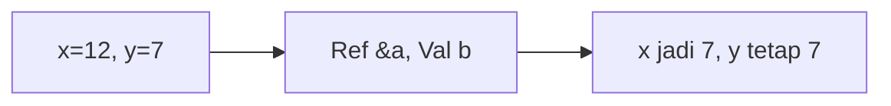

**📖 Penjelasan:**
**Langkah Tracing:**
1. x dilempar secara `reference` (&), maka nilainya berubah.
2. y dilempar secara `value`, maka aslinya aman.

---
### Soal 133
```cpp
int f(int x) { return x * 2; }
// main: int a = 9; a = f(a) + f(2);
```
**Pertanyaan:**
1. Berapakah hasil akhirnya?
2. Mengapa demikian?

**Jawaban & Diagnosis:**
1. **22**
2. Lihat Tracing.

**Mermaid Flowchart:**


**📖 Penjelasan:**
**Langkah Tracing:**
1. f(9) = 18.
2. f(2) = 4.
3. Jumlah: 22.

---
### Soal 134
```cpp
int f(int x) { return x * 2; }
// main: int a = 17; a = f(a) + f(2);
```
**Pertanyaan:**
1. Berapakah hasil akhirnya?
2. Mengapa demikian?

**Jawaban & Diagnosis:**
1. **38**
2. Lihat Tracing.

**Mermaid Flowchart:**
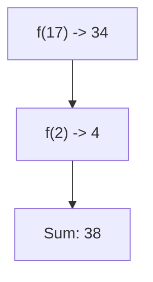

**📖 Penjelasan:**
**Langkah Tracing:**
1. f(17) = 34.
2. f(2) = 4.
3. Jumlah: 38.

---
### Soal 135
```cpp
int f(int x) { return x * 2; }
// main: int a = 11; a = f(a) + f(2);
```
**Pertanyaan:**
1. Berapakah hasil akhirnya?
2. Mengapa demikian?

**Jawaban & Diagnosis:**
1. **26**
2. Lihat Tracing.

**Mermaid Flowchart:**
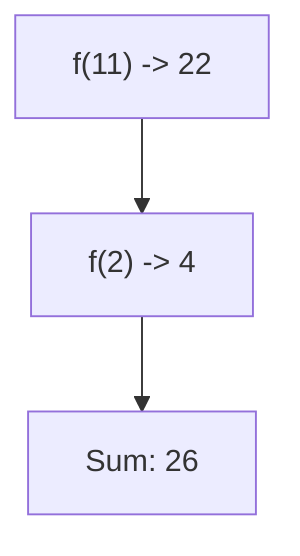

**📖 Penjelasan:**
**Langkah Tracing:**
1. f(11) = 22.
2. f(2) = 4.
3. Jumlah: 26.

---
### Soal 136
```cpp
int f(int x) { return x * 2; }
// main: int a = 3; a = f(a) + f(2);
```
**Pertanyaan:**
1. Berapakah hasil akhirnya?
2. Mengapa demikian?

**Jawaban & Diagnosis:**
1. **10**
2. Lihat Tracing.

**Mermaid Flowchart:**


**📖 Penjelasan:**
**Langkah Tracing:**
1. f(3) = 6.
2. f(2) = 4.
3. Jumlah: 10.

---
### Soal 137
```cpp
int f(int x) { return x * 2; }
// main: int a = 19; a = f(a) + f(2);
```
**Pertanyaan:**
1. Berapakah hasil akhirnya?
2. Mengapa demikian?

**Jawaban & Diagnosis:**
1. **42**
2. Lihat Tracing.

**Mermaid Flowchart:**
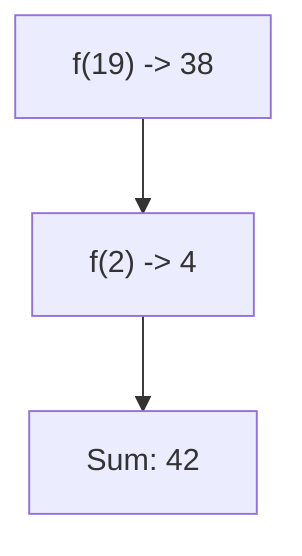

**📖 Penjelasan:**
**Langkah Tracing:**
1. f(19) = 38.
2. f(2) = 4.
3. Jumlah: 42.

---
### Soal 138
```cpp
int f(int x) { return x * 2; }
// main: int a = 13; a = f(a) + f(2);
```
**Pertanyaan:**
1. Berapakah hasil akhirnya?
2. Mengapa demikian?

**Jawaban & Diagnosis:**
1. **30**
2. Lihat Tracing.

**Mermaid Flowchart:**


**📖 Penjelasan:**
**Langkah Tracing:**
1. f(13) = 26.
2. f(2) = 4.
3. Jumlah: 30.

---
### Soal 139
```cpp
int f(int x) { return x * 2; }
// main: int a = 5; a = f(a) + f(2);
```
**Pertanyaan:**
1. Berapakah hasil akhirnya?
2. Mengapa demikian?

**Jawaban & Diagnosis:**
1. **14**
2. Lihat Tracing.

**Mermaid Flowchart:**


**📖 Penjelasan:**
**Langkah Tracing:**
1. f(5) = 10.
2. f(2) = 4.
3. Jumlah: 14.

---
### Soal 140
```cpp
int f(int x) { return x * 2; }
// main: int a = 13; a = f(a) + f(2);
```
**Pertanyaan:**
1. Berapakah hasil akhirnya?
2. Mengapa demikian?

**Jawaban & Diagnosis:**
1. **30**
2. Lihat Tracing.

**Mermaid Flowchart:**


**📖 Penjelasan:**
**Langkah Tracing:**
1. f(13) = 26.
2. f(2) = 4.
3. Jumlah: 30.

---
### Soal 141
```cpp
int f(int x) { return x * 2; }
// main: int a = 13; a = f(a) + f(2);
```
**Pertanyaan:**
1. Berapakah hasil akhirnya?
2. Mengapa demikian?

**Jawaban & Diagnosis:**
1. **30**
2. Lihat Tracing.

**Mermaid Flowchart:**


**📖 Penjelasan:**
**Langkah Tracing:**
1. f(13) = 26.
2. f(2) = 4.
3. Jumlah: 30.

---
### Soal 142
```cpp
void swap(int &a, int b) { int t=a; a=b; b=t; }
// main: int x=9, y=19; swap(x, y);
```
**Pertanyaan:**
1. Berapakah hasil akhirnya?
2. Mengapa demikian?

**Jawaban & Diagnosis:**
1. **x=19, y=19**
2. Lihat Tracing.

**Mermaid Flowchart:**
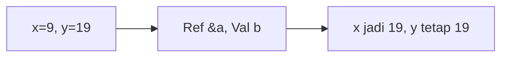

**📖 Penjelasan:**
**Langkah Tracing:**
1. x dilempar secara `reference` (&), maka nilainya berubah.
2. y dilempar secara `value`, maka aslinya aman.

---
### Soal 143
```cpp
int f(int x) { return x * 2; }
// main: int a = 9; a = f(a) + f(2);
```
**Pertanyaan:**
1. Berapakah hasil akhirnya?
2. Mengapa demikian?

**Jawaban & Diagnosis:**
1. **22**
2. Lihat Tracing.

**Mermaid Flowchart:**


**📖 Penjelasan:**
**Langkah Tracing:**
1. f(9) = 18.
2. f(2) = 4.
3. Jumlah: 22.

---
### Soal 144
```cpp
void swap(int &a, int b) { int t=a; a=b; b=t; }
// main: int x=12, y=10; swap(x, y);
```
**Pertanyaan:**
1. Berapakah hasil akhirnya?
2. Mengapa demikian?

**Jawaban & Diagnosis:**
1. **x=10, y=10**
2. Lihat Tracing.

**Mermaid Flowchart:**


**📖 Penjelasan:**
**Langkah Tracing:**
1. x dilempar secara `reference` (&), maka nilainya berubah.
2. y dilempar secara `value`, maka aslinya aman.

---
### Soal 145
```cpp
void swap(int &a, int b) { int t=a; a=b; b=t; }
// main: int x=17, y=20; swap(x, y);
```
**Pertanyaan:**
1. Berapakah hasil akhirnya?
2. Mengapa demikian?

**Jawaban & Diagnosis:**
1. **x=20, y=20**
2. Lihat Tracing.

**Mermaid Flowchart:**
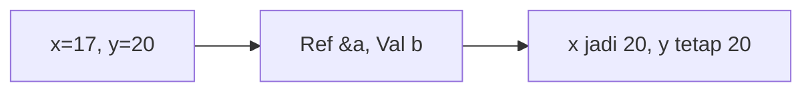

**📖 Penjelasan:**
**Langkah Tracing:**
1. x dilempar secara `reference` (&), maka nilainya berubah.
2. y dilempar secara `value`, maka aslinya aman.

---
### Soal 146
```cpp
void swap(int &a, int b) { int t=a; a=b; b=t; }
// main: int x=3, y=11; swap(x, y);
```
**Pertanyaan:**
1. Berapakah hasil akhirnya?
2. Mengapa demikian?

**Jawaban & Diagnosis:**
1. **x=11, y=11**
2. Lihat Tracing.

**Mermaid Flowchart:**
```mermaid
graph LR
A["x=3, y=11"] --> B["Ref &a, Val b"]
B --> C["x jadi 11, y tetap 11"]
```

**📖 Penjelasan:**
**Langkah Tracing:**
1. x dilempar secara `reference` (&), maka nilainya berubah.
2. y dilempar secara `value`, maka aslinya aman.

---
### Soal 147
```cpp
void swap(int &a, int b) { int t=a; a=b; b=t; }
// main: int x=10, y=1; swap(x, y);
```
**Pertanyaan:**
1. Berapakah hasil akhirnya?
2. Mengapa demikian?

**Jawaban & Diagnosis:**
1. **x=1, y=1**
2. Lihat Tracing.

**Mermaid Flowchart:**
```mermaid
graph LR
A["x=10, y=1"] --> B["Ref &a, Val b"]
B --> C["x jadi 1, y tetap 1"]
```

**📖 Penjelasan:**
**Langkah Tracing:**
1. x dilempar secara `reference` (&), maka nilainya berubah.
2. y dilempar secara `value`, maka aslinya aman.

---
### Soal 148
```cpp
int f(int x) { return x * 2; }
// main: int a = 12; a = f(a) + f(2);
```
**Pertanyaan:**
1. Berapakah hasil akhirnya?
2. Mengapa demikian?

**Jawaban & Diagnosis:**
1. **28**
2. Lihat Tracing.

**Mermaid Flowchart:**
```mermaid
graph TD
A["f(12) -> 24"] --> B["f(2) -> 4"]
B --> C["Sum: 28"]
```

**📖 Penjelasan:**
**Langkah Tracing:**
1. f(12) = 24.
2. f(2) = 4.
3. Jumlah: 28.

---
### Soal 149
```cpp
int f(int x) { return x * 2; }
// main: int a = 2; a = f(a) + f(2);
```
**Pertanyaan:**
1. Berapakah hasil akhirnya?
2. Mengapa demikian?

**Jawaban & Diagnosis:**
1. **8**
2. Lihat Tracing.

**Mermaid Flowchart:**
```mermaid
graph TD
A["f(2) -> 4"] --> B["f(2) -> 4"]
B --> C["Sum: 8"]
```

**📖 Penjelasan:**
**Langkah Tracing:**
1. f(2) = 4.
2. f(2) = 4.
3. Jumlah: 8.

---
### Soal 150
```cpp
void swap(int &a, int b) { int t=a; a=b; b=t; }
// main: int x=11, y=7; swap(x, y);
```
**Pertanyaan:**
1. Berapakah hasil akhirnya?
2. Mengapa demikian?

**Jawaban & Diagnosis:**
1. **x=7, y=7**
2. Lihat Tracing.

**Mermaid Flowchart:**
```mermaid
graph LR
A["x=11, y=7"] --> B["Ref &a, Val b"]
B --> C["x jadi 7, y tetap 7"]
```

**📖 Penjelasan:**
**Langkah Tracing:**
1. x dilempar secara `reference` (&), maka nilainya berubah.
2. y dilempar secara `value`, maka aslinya aman.

---
