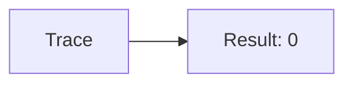
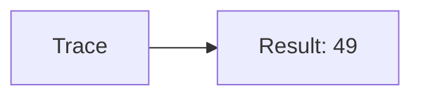
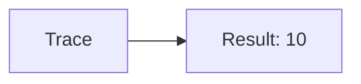
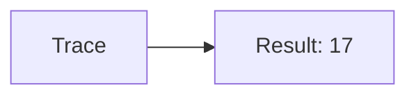
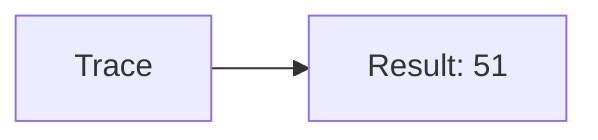

🔙 **[Kembali ke Daftar Soal](./README.md)**

---

# Latihan Soal Part C - Modul 04 - Set 06

### Soal 126
```cpp
// Weapon: Pass-by-Reference
void reset(int &x) { x = 0; }
// main: int weapon=19;
reset(weapon);
```
**Pertanyaan:**
1. Berapakah hasil akhirnya?
2. Deskripsikan alur pikir 'Compiler Manusia' untuk soal ini!

**Jawaban & Diagnosis:**
1. **0**
2. Reference '&' dikirim alamat aslinya. 'Weapon' ter-reset jadi 0.

**Mermaid Flowchart:**


---
### Soal 127
```cpp
// Tool: Pass-by-Value
void ubah(int x) { x = 0; }
// main: int tool=29;
ubah(tool);
```
**Pertanyaan:**
1. Berapakah hasil akhirnya?
2. Deskripsikan alur pikir 'Compiler Manusia' untuk soal ini!

**Jawaban & Diagnosis:**
1. **29**
2. Value 'Tool' dikirim fotokopinya. Aslinya tetap 29.

**Mermaid Flowchart:**


---
### Soal 128
```cpp
// Item: Pass-by-Reference
void reset(int &x) { x = 0; }
// main: int item=37;
reset(item);
```
**Pertanyaan:**
1. Berapakah hasil akhirnya?
2. Deskripsikan alur pikir 'Compiler Manusia' untuk soal ini!

**Jawaban & Diagnosis:**
1. **0**
2. Reference '&' dikirim alamat aslinya. 'Item' ter-reset jadi 0.

**Mermaid Flowchart:**


---
### Soal 129
```cpp
// Food: Pass-by-Value
void ubah(int x) { x = 0; }
// main: int food=99;
ubah(food);
```
**Pertanyaan:**
1. Berapakah hasil akhirnya?
2. Deskripsikan alur pikir 'Compiler Manusia' untuk soal ini!

**Jawaban & Diagnosis:**
1. **99**
2. Value 'Food' dikirim fotokopinya. Aslinya tetap 99.

**Mermaid Flowchart:**


---
### Soal 130
```cpp
// Drink: Pass-by-Reference
void reset(int &x) { x = 0; }
// main: int drink=49;
reset(drink);
```
**Pertanyaan:**
1. Berapakah hasil akhirnya?
2. Deskripsikan alur pikir 'Compiler Manusia' untuk soal ini!

**Jawaban & Diagnosis:**
1. **0**
2. Reference '&' dikirim alamat aslinya. 'Drink' ter-reset jadi 0.

**Mermaid Flowchart:**


---
### Soal 131
```cpp
// Potion: Pass-by-Value
void ubah(int x) { x = 0; }
// main: int potion=49;
ubah(potion);
```
**Pertanyaan:**
1. Berapakah hasil akhirnya?
2. Deskripsikan alur pikir 'Compiler Manusia' untuk soal ini!

**Jawaban & Diagnosis:**
1. **49**
2. Value 'Potion' dikirim fotokopinya. Aslinya tetap 49.

**Mermaid Flowchart:**


---
### Soal 132
```cpp
// Scroll: Pass-by-Reference
void reset(int &x) { x = 0; }
// main: int scroll=97;
reset(scroll);
```
**Pertanyaan:**
1. Berapakah hasil akhirnya?
2. Deskripsikan alur pikir 'Compiler Manusia' untuk soal ini!

**Jawaban & Diagnosis:**
1. **0**
2. Reference '&' dikirim alamat aslinya. 'Scroll' ter-reset jadi 0.

**Mermaid Flowchart:**


---
### Soal 133
```cpp
// Book: Pass-by-Value
void ubah(int x) { x = 0; }
// main: int book=60;
ubah(book);
```
**Pertanyaan:**
1. Berapakah hasil akhirnya?
2. Deskripsikan alur pikir 'Compiler Manusia' untuk soal ini!

**Jawaban & Diagnosis:**
1. **60**
2. Value 'Book' dikirim fotokopinya. Aslinya tetap 60.

**Mermaid Flowchart:**


---
### Soal 134
```cpp
// Map: Pass-by-Reference
void reset(int &x) { x = 0; }
// main: int map=47;
reset(map);
```
**Pertanyaan:**
1. Berapakah hasil akhirnya?
2. Deskripsikan alur pikir 'Compiler Manusia' untuk soal ini!

**Jawaban & Diagnosis:**
1. **0**
2. Reference '&' dikirim alamat aslinya. 'Map' ter-reset jadi 0.

**Mermaid Flowchart:**


---
### Soal 135
```cpp
// Key: Pass-by-Value
void ubah(int x) { x = 0; }
// main: int key=50;
ubah(key);
```
**Pertanyaan:**
1. Berapakah hasil akhirnya?
2. Deskripsikan alur pikir 'Compiler Manusia' untuk soal ini!

**Jawaban & Diagnosis:**
1. **50**
2. Value 'Key' dikirim fotokopinya. Aslinya tetap 50.

**Mermaid Flowchart:**


---
### Soal 136
```cpp
// Coin: Pass-by-Reference
void reset(int &x) { x = 0; }
// main: int coin=77;
reset(coin);
```
**Pertanyaan:**
1. Berapakah hasil akhirnya?
2. Deskripsikan alur pikir 'Compiler Manusia' untuk soal ini!

**Jawaban & Diagnosis:**
1. **0**
2. Reference '&' dikirim alamat aslinya. 'Coin' ter-reset jadi 0.

**Mermaid Flowchart:**


---
### Soal 137
```cpp
// Gem: Pass-by-Value
void ubah(int x) { x = 0; }
// main: int gem=10;
ubah(gem);
```
**Pertanyaan:**
1. Berapakah hasil akhirnya?
2. Deskripsikan alur pikir 'Compiler Manusia' untuk soal ini!

**Jawaban & Diagnosis:**
1. **10**
2. Value 'Gem' dikirim fotokopinya. Aslinya tetap 10.

**Mermaid Flowchart:**


---
### Soal 138
```cpp
// Jewel: Pass-by-Reference
void reset(int &x) { x = 0; }
// main: int jewel=36;
reset(jewel);
```
**Pertanyaan:**
1. Berapakah hasil akhirnya?
2. Deskripsikan alur pikir 'Compiler Manusia' untuk soal ini!

**Jawaban & Diagnosis:**
1. **0**
2. Reference '&' dikirim alamat aslinya. 'Jewel' ter-reset jadi 0.

**Mermaid Flowchart:**


---
### Soal 139
```cpp
// Stone: Pass-by-Value
void ubah(int x) { x = 0; }
// main: int stone=78;
ubah(stone);
```
**Pertanyaan:**
1. Berapakah hasil akhirnya?
2. Deskripsikan alur pikir 'Compiler Manusia' untuk soal ini!

**Jawaban & Diagnosis:**
1. **78**
2. Value 'Stone' dikirim fotokopinya. Aslinya tetap 78.

**Mermaid Flowchart:**


---
### Soal 140
```cpp
// Ore: Pass-by-Reference
void reset(int &x) { x = 0; }
// main: int ore=86;
reset(ore);
```
**Pertanyaan:**
1. Berapakah hasil akhirnya?
2. Deskripsikan alur pikir 'Compiler Manusia' untuk soal ini!

**Jawaban & Diagnosis:**
1. **0**
2. Reference '&' dikirim alamat aslinya. 'Ore' ter-reset jadi 0.

**Mermaid Flowchart:**


---
### Soal 141
```cpp
// Metal: Pass-by-Value
void ubah(int x) { x = 0; }
// main: int metal=17;
ubah(metal);
```
**Pertanyaan:**
1. Berapakah hasil akhirnya?
2. Deskripsikan alur pikir 'Compiler Manusia' untuk soal ini!

**Jawaban & Diagnosis:**
1. **17**
2. Value 'Metal' dikirim fotokopinya. Aslinya tetap 17.

**Mermaid Flowchart:**


---
### Soal 142
```cpp
// Wood: Pass-by-Reference
void reset(int &x) { x = 0; }
// main: int wood=45;
reset(wood);
```
**Pertanyaan:**
1. Berapakah hasil akhirnya?
2. Deskripsikan alur pikir 'Compiler Manusia' untuk soal ini!

**Jawaban & Diagnosis:**
1. **0**
2. Reference '&' dikirim alamat aslinya. 'Wood' ter-reset jadi 0.

**Mermaid Flowchart:**


---
### Soal 143
```cpp
// Leather: Pass-by-Value
void ubah(int x) { x = 0; }
// main: int leather=51;
ubah(leather);
```
**Pertanyaan:**
1. Berapakah hasil akhirnya?
2. Deskripsikan alur pikir 'Compiler Manusia' untuk soal ini!

**Jawaban & Diagnosis:**
1. **51**
2. Value 'Leather' dikirim fotokopinya. Aslinya tetap 51.

**Mermaid Flowchart:**


---
### Soal 144
```cpp
// Cloth: Pass-by-Reference
void reset(int &x) { x = 0; }
// main: int cloth=61;
reset(cloth);
```
**Pertanyaan:**
1. Berapakah hasil akhirnya?
2. Deskripsikan alur pikir 'Compiler Manusia' untuk soal ini!

**Jawaban & Diagnosis:**
1. **0**
2. Reference '&' dikirim alamat aslinya. 'Cloth' ter-reset jadi 0.

**Mermaid Flowchart:**


---
### Soal 145
```cpp
// Herb: Pass-by-Value
void ubah(int x) { x = 0; }
// main: int herb=25;
ubah(herb);
```
**Pertanyaan:**
1. Berapakah hasil akhirnya?
2. Deskripsikan alur pikir 'Compiler Manusia' untuk soal ini!

**Jawaban & Diagnosis:**
1. **25**
2. Value 'Herb' dikirim fotokopinya. Aslinya tetap 25.

**Mermaid Flowchart:**


---
### Soal 146
```cpp
// Seed: Pass-by-Reference
void reset(int &x) { x = 0; }
// main: int seed=13;
reset(seed);
```
**Pertanyaan:**
1. Berapakah hasil akhirnya?
2. Deskripsikan alur pikir 'Compiler Manusia' untuk soal ini!

**Jawaban & Diagnosis:**
1. **0**
2. Reference '&' dikirim alamat aslinya. 'Seed' ter-reset jadi 0.

**Mermaid Flowchart:**
```mermaid
graph LR
A[Trace] --> B[Result: 0]
```

---
### Soal 147
```cpp
// Crop: Pass-by-Value
void ubah(int x) { x = 0; }
// main: int crop=80;
ubah(crop);
```
**Pertanyaan:**
1. Berapakah hasil akhirnya?
2. Deskripsikan alur pikir 'Compiler Manusia' untuk soal ini!

**Jawaban & Diagnosis:**
1. **80**
2. Value 'Crop' dikirim fotokopinya. Aslinya tetap 80.

**Mermaid Flowchart:**
```mermaid
graph LR
A[Trace] --> B[Result: 80]
```

---
### Soal 148
```cpp
// Animal: Pass-by-Reference
void reset(int &x) { x = 0; }
// main: int animal=19;
reset(animal);
```
**Pertanyaan:**
1. Berapakah hasil akhirnya?
2. Deskripsikan alur pikir 'Compiler Manusia' untuk soal ini!

**Jawaban & Diagnosis:**
1. **0**
2. Reference '&' dikirim alamat aslinya. 'Animal' ter-reset jadi 0.

**Mermaid Flowchart:**
```mermaid
graph LR
A[Trace] --> B[Result: 0]
```

---
### Soal 149
```cpp
// Fish: Pass-by-Value
void ubah(int x) { x = 0; }
// main: int fish=50;
ubah(fish);
```
**Pertanyaan:**
1. Berapakah hasil akhirnya?
2. Deskripsikan alur pikir 'Compiler Manusia' untuk soal ini!

**Jawaban & Diagnosis:**
1. **50**
2. Value 'Fish' dikirim fotokopinya. Aslinya tetap 50.

**Mermaid Flowchart:**
```mermaid
graph LR
A[Trace] --> B[Result: 50]
```

---
### Soal 150
```cpp
// Insect: Pass-by-Reference
void reset(int &x) { x = 0; }
// main: int insect=26;
reset(insect);
```
**Pertanyaan:**
1. Berapakah hasil akhirnya?
2. Deskripsikan alur pikir 'Compiler Manusia' untuk soal ini!

**Jawaban & Diagnosis:**
1. **0**
2. Reference '&' dikirim alamat aslinya. 'Insect' ter-reset jadi 0.

**Mermaid Flowchart:**
```mermaid
graph LR
A[Trace] --> B[Result: 0]
```

---
