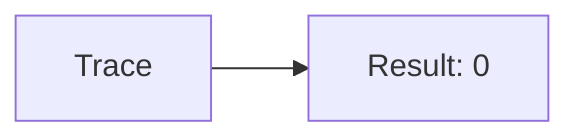
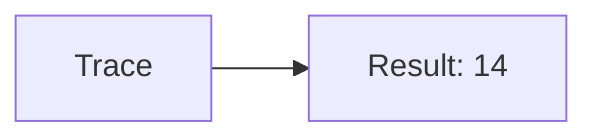
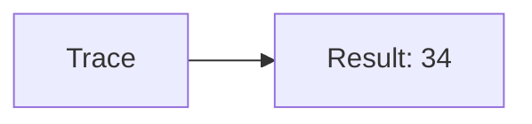
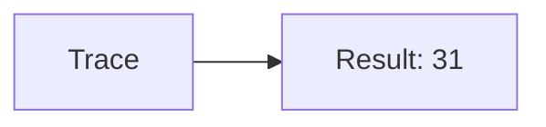
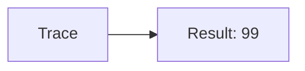

🔙 **[Kembali ke Daftar Soal](./README.md)**

---

# Latihan Soal Part C - Modul 04 - Set 07

### Soal 151
```cpp
// Bird: Pass-by-Value
void ubah(int x) { x = 0; }
// main: int bird=55;
ubah(bird);
```
**Pertanyaan:**
1. Berapakah hasil akhirnya?
2. Deskripsikan alur pikir 'Compiler Manusia' untuk soal ini!

**Jawaban & Diagnosis:**
1. **55**
2. Value 'Bird' dikirim fotokopinya. Aslinya tetap 55.

**Mermaid Flowchart:**


---
### Soal 152
```cpp
// Monster: Pass-by-Reference
void reset(int &x) { x = 0; }
// main: int monster=61;
reset(monster);
```
**Pertanyaan:**
1. Berapakah hasil akhirnya?
2. Deskripsikan alur pikir 'Compiler Manusia' untuk soal ini!

**Jawaban & Diagnosis:**
1. **0**
2. Reference '&' dikirim alamat aslinya. 'Monster' ter-reset jadi 0.

**Mermaid Flowchart:**


---
### Soal 153
```cpp
// Boss: Pass-by-Value
void ubah(int x) { x = 0; }
// main: int boss=22;
ubah(boss);
```
**Pertanyaan:**
1. Berapakah hasil akhirnya?
2. Deskripsikan alur pikir 'Compiler Manusia' untuk soal ini!

**Jawaban & Diagnosis:**
1. **22**
2. Value 'Boss' dikirim fotokopinya. Aslinya tetap 22.

**Mermaid Flowchart:**


---
### Soal 154
```cpp
// Npc: Pass-by-Reference
void reset(int &x) { x = 0; }
// main: int npc=22;
reset(npc);
```
**Pertanyaan:**
1. Berapakah hasil akhirnya?
2. Deskripsikan alur pikir 'Compiler Manusia' untuk soal ini!

**Jawaban & Diagnosis:**
1. **0**
2. Reference '&' dikirim alamat aslinya. 'Npc' ter-reset jadi 0.

**Mermaid Flowchart:**


---
### Soal 155
```cpp
// Pc: Pass-by-Value
void ubah(int x) { x = 0; }
// main: int pc=14;
ubah(pc);
```
**Pertanyaan:**
1. Berapakah hasil akhirnya?
2. Deskripsikan alur pikir 'Compiler Manusia' untuk soal ini!

**Jawaban & Diagnosis:**
1. **14**
2. Value 'Pc' dikirim fotokopinya. Aslinya tetap 14.

**Mermaid Flowchart:**


---
### Soal 156
```cpp
// User: Pass-by-Reference
void reset(int &x) { x = 0; }
// main: int user=43;
reset(user);
```
**Pertanyaan:**
1. Berapakah hasil akhirnya?
2. Deskripsikan alur pikir 'Compiler Manusia' untuk soal ini!

**Jawaban & Diagnosis:**
1. **0**
2. Reference '&' dikirim alamat aslinya. 'User' ter-reset jadi 0.

**Mermaid Flowchart:**


---
### Soal 157
```cpp
// Admin: Pass-by-Value
void ubah(int x) { x = 0; }
// main: int admin=34;
ubah(admin);
```
**Pertanyaan:**
1. Berapakah hasil akhirnya?
2. Deskripsikan alur pikir 'Compiler Manusia' untuk soal ini!

**Jawaban & Diagnosis:**
1. **34**
2. Value 'Admin' dikirim fotokopinya. Aslinya tetap 34.

**Mermaid Flowchart:**


---
### Soal 158
```cpp
// Mod: Pass-by-Reference
void reset(int &x) { x = 0; }
// main: int mod=61;
reset(mod);
```
**Pertanyaan:**
1. Berapakah hasil akhirnya?
2. Deskripsikan alur pikir 'Compiler Manusia' untuk soal ini!

**Jawaban & Diagnosis:**
1. **0**
2. Reference '&' dikirim alamat aslinya. 'Mod' ter-reset jadi 0.

**Mermaid Flowchart:**


---
### Soal 159
```cpp
// Guest: Pass-by-Value
void ubah(int x) { x = 0; }
// main: int guest=31;
ubah(guest);
```
**Pertanyaan:**
1. Berapakah hasil akhirnya?
2. Deskripsikan alur pikir 'Compiler Manusia' untuk soal ini!

**Jawaban & Diagnosis:**
1. **31**
2. Value 'Guest' dikirim fotokopinya. Aslinya tetap 31.

**Mermaid Flowchart:**


---
### Soal 160
```cpp
// Bot: Pass-by-Reference
void reset(int &x) { x = 0; }
// main: int bot=18;
reset(bot);
```
**Pertanyaan:**
1. Berapakah hasil akhirnya?
2. Deskripsikan alur pikir 'Compiler Manusia' untuk soal ini!

**Jawaban & Diagnosis:**
1. **0**
2. Reference '&' dikirim alamat aslinya. 'Bot' ter-reset jadi 0.

**Mermaid Flowchart:**


---
### Soal 161
```cpp
// Ai: Pass-by-Value
void ubah(int x) { x = 0; }
// main: int ai=32;
ubah(ai);
```
**Pertanyaan:**
1. Berapakah hasil akhirnya?
2. Deskripsikan alur pikir 'Compiler Manusia' untuk soal ini!

**Jawaban & Diagnosis:**
1. **32**
2. Value 'Ai' dikirim fotokopinya. Aslinya tetap 32.

**Mermaid Flowchart:**


---
### Soal 162
```cpp
// System: Pass-by-Reference
void reset(int &x) { x = 0; }
// main: int system=17;
reset(system);
```
**Pertanyaan:**
1. Berapakah hasil akhirnya?
2. Deskripsikan alur pikir 'Compiler Manusia' untuk soal ini!

**Jawaban & Diagnosis:**
1. **0**
2. Reference '&' dikirim alamat aslinya. 'System' ter-reset jadi 0.

**Mermaid Flowchart:**


---
### Soal 163
```cpp
// Kernel: Pass-by-Value
void ubah(int x) { x = 0; }
// main: int kernel=99;
ubah(kernel);
```
**Pertanyaan:**
1. Berapakah hasil akhirnya?
2. Deskripsikan alur pikir 'Compiler Manusia' untuk soal ini!

**Jawaban & Diagnosis:**
1. **99**
2. Value 'Kernel' dikirim fotokopinya. Aslinya tetap 99.

**Mermaid Flowchart:**


---
### Soal 164
```cpp
// Core: Pass-by-Reference
void reset(int &x) { x = 0; }
// main: int core=26;
reset(core);
```
**Pertanyaan:**
1. Berapakah hasil akhirnya?
2. Deskripsikan alur pikir 'Compiler Manusia' untuk soal ini!

**Jawaban & Diagnosis:**
1. **0**
2. Reference '&' dikirim alamat aslinya. 'Core' ter-reset jadi 0.

**Mermaid Flowchart:**


---
### Soal 165
```cpp
// Ram: Pass-by-Value
void ubah(int x) { x = 0; }
// main: int ram=90;
ubah(ram);
```
**Pertanyaan:**
1. Berapakah hasil akhirnya?
2. Deskripsikan alur pikir 'Compiler Manusia' untuk soal ini!

**Jawaban & Diagnosis:**
1. **90**
2. Value 'Ram' dikirim fotokopinya. Aslinya tetap 90.

**Mermaid Flowchart:**


---
### Soal 166
```cpp
// Rom: Pass-by-Reference
void reset(int &x) { x = 0; }
// main: int rom=66;
reset(rom);
```
**Pertanyaan:**
1. Berapakah hasil akhirnya?
2. Deskripsikan alur pikir 'Compiler Manusia' untuk soal ini!

**Jawaban & Diagnosis:**
1. **0**
2. Reference '&' dikirim alamat aslinya. 'Rom' ter-reset jadi 0.

**Mermaid Flowchart:**


---
### Soal 167
```cpp
// Cpu: Pass-by-Value
void ubah(int x) { x = 0; }
// main: int cpu=79;
ubah(cpu);
```
**Pertanyaan:**
1. Berapakah hasil akhirnya?
2. Deskripsikan alur pikir 'Compiler Manusia' untuk soal ini!

**Jawaban & Diagnosis:**
1. **79**
2. Value 'Cpu' dikirim fotokopinya. Aslinya tetap 79.

**Mermaid Flowchart:**


---
### Soal 168
```cpp
// Gpu: Pass-by-Reference
void reset(int &x) { x = 0; }
// main: int gpu=38;
reset(gpu);
```
**Pertanyaan:**
1. Berapakah hasil akhirnya?
2. Deskripsikan alur pikir 'Compiler Manusia' untuk soal ini!

**Jawaban & Diagnosis:**
1. **0**
2. Reference '&' dikirim alamat aslinya. 'Gpu' ter-reset jadi 0.

**Mermaid Flowchart:**


---
### Soal 169
```cpp
// Vram: Pass-by-Value
void ubah(int x) { x = 0; }
// main: int vram=45;
ubah(vram);
```
**Pertanyaan:**
1. Berapakah hasil akhirnya?
2. Deskripsikan alur pikir 'Compiler Manusia' untuk soal ini!

**Jawaban & Diagnosis:**
1. **45**
2. Value 'Vram' dikirim fotokopinya. Aslinya tetap 45.

**Mermaid Flowchart:**


---
### Soal 170
```cpp
// Ssd: Pass-by-Reference
void reset(int &x) { x = 0; }
// main: int ssd=42;
reset(ssd);
```
**Pertanyaan:**
1. Berapakah hasil akhirnya?
2. Deskripsikan alur pikir 'Compiler Manusia' untuk soal ini!

**Jawaban & Diagnosis:**
1. **0**
2. Reference '&' dikirim alamat aslinya. 'Ssd' ter-reset jadi 0.

**Mermaid Flowchart:**


---
### Soal 171
```cpp
// Hdd: Pass-by-Value
void ubah(int x) { x = 0; }
// main: int hdd=39;
ubah(hdd);
```
**Pertanyaan:**
1. Berapakah hasil akhirnya?
2. Deskripsikan alur pikir 'Compiler Manusia' untuk soal ini!

**Jawaban & Diagnosis:**
1. **39**
2. Value 'Hdd' dikirim fotokopinya. Aslinya tetap 39.

**Mermaid Flowchart:**
```mermaid
graph LR
A[Trace] --> B[Result: 39]
```

---
### Soal 172
```cpp
// Usb: Pass-by-Reference
void reset(int &x) { x = 0; }
// main: int usb=13;
reset(usb);
```
**Pertanyaan:**
1. Berapakah hasil akhirnya?
2. Deskripsikan alur pikir 'Compiler Manusia' untuk soal ini!

**Jawaban & Diagnosis:**
1. **0**
2. Reference '&' dikirim alamat aslinya. 'Usb' ter-reset jadi 0.

**Mermaid Flowchart:**
```mermaid
graph LR
A[Trace] --> B[Result: 0]
```

---
### Soal 173
```cpp
// Wifi: Pass-by-Value
void ubah(int x) { x = 0; }
// main: int wifi=98;
ubah(wifi);
```
**Pertanyaan:**
1. Berapakah hasil akhirnya?
2. Deskripsikan alur pikir 'Compiler Manusia' untuk soal ini!

**Jawaban & Diagnosis:**
1. **98**
2. Value 'Wifi' dikirim fotokopinya. Aslinya tetap 98.

**Mermaid Flowchart:**
```mermaid
graph LR
A[Trace] --> B[Result: 98]
```

---
### Soal 174
```cpp
// Bt: Pass-by-Reference
void reset(int &x) { x = 0; }
// main: int bt=68;
reset(bt);
```
**Pertanyaan:**
1. Berapakah hasil akhirnya?
2. Deskripsikan alur pikir 'Compiler Manusia' untuk soal ini!

**Jawaban & Diagnosis:**
1. **0**
2. Reference '&' dikirim alamat aslinya. 'Bt' ter-reset jadi 0.

**Mermaid Flowchart:**
```mermaid
graph LR
A[Trace] --> B[Result: 0]
```

---
### Soal 175
```cpp
// Nfc: Pass-by-Value
void ubah(int x) { x = 0; }
// main: int nfc=75;
ubah(nfc);
```
**Pertanyaan:**
1. Berapakah hasil akhirnya?
2. Deskripsikan alur pikir 'Compiler Manusia' untuk soal ini!

**Jawaban & Diagnosis:**
1. **75**
2. Value 'Nfc' dikirim fotokopinya. Aslinya tetap 75.

**Mermaid Flowchart:**
```mermaid
graph LR
A[Trace] --> B[Result: 75]
```

---
