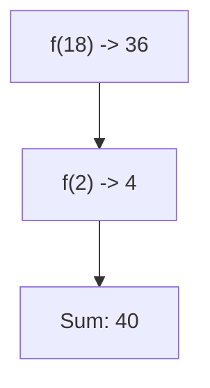
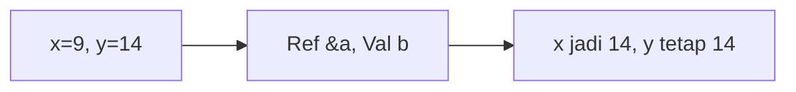
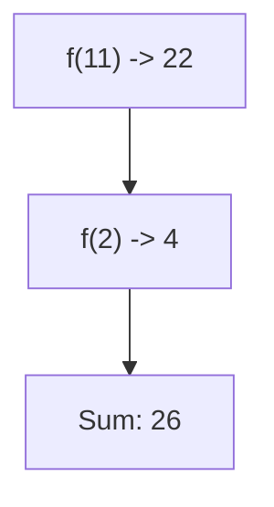
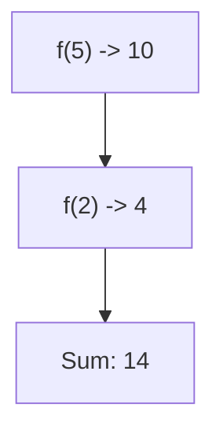
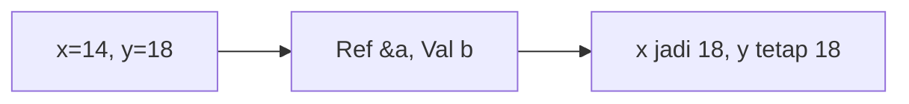
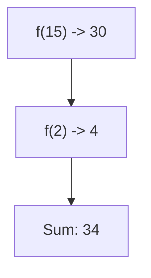
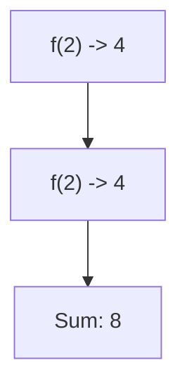
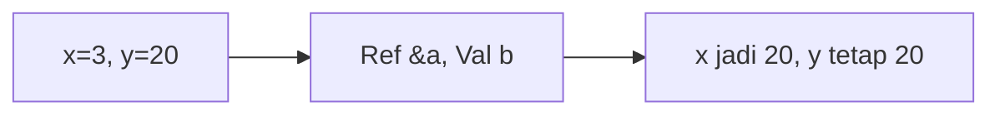
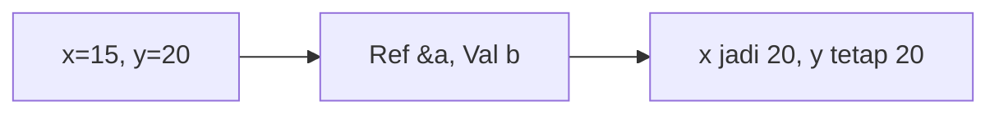

🔙 **[Kembali ke Daftar Soal](./README.md)**

---

# Latihan Soal Part C - Modul 04 - Set 08

### Soal 176
```cpp
int f(int x) { return x * 2; }
// main: int a = 18; a = f(a) + f(2);
```
**Pertanyaan:**
1. Berapakah hasil akhirnya?
2. Mengapa demikian?

**Jawaban & Diagnosis:**
1. **40**
2. Lihat Tracing.

**Mermaid Flowchart:**


**📖 Penjelasan:**
**Langkah Tracing:**
1. f(18) = 36.
2. f(2) = 4.
3. Jumlah: 40.

---
### Soal 177
```cpp
int f(int x) { return x * 2; }
// main: int a = 16; a = f(a) + f(2);
```
**Pertanyaan:**
1. Berapakah hasil akhirnya?
2. Mengapa demikian?

**Jawaban & Diagnosis:**
1. **36**
2. Lihat Tracing.

**Mermaid Flowchart:**


**📖 Penjelasan:**
**Langkah Tracing:**
1. f(16) = 32.
2. f(2) = 4.
3. Jumlah: 36.

---
### Soal 178
```cpp
void swap(int &a, int b) { int t=a; a=b; b=t; }
// main: int x=9, y=14; swap(x, y);
```
**Pertanyaan:**
1. Berapakah hasil akhirnya?
2. Mengapa demikian?

**Jawaban & Diagnosis:**
1. **x=14, y=14**
2. Lihat Tracing.

**Mermaid Flowchart:**


**📖 Penjelasan:**
**Langkah Tracing:**
1. x dilempar secara `reference` (&), maka nilainya berubah.
2. y dilempar secara `value`, maka aslinya aman.

---
### Soal 179
```cpp
int f(int x) { return x * 2; }
// main: int a = 12; a = f(a) + f(2);
```
**Pertanyaan:**
1. Berapakah hasil akhirnya?
2. Mengapa demikian?

**Jawaban & Diagnosis:**
1. **28**
2. Lihat Tracing.

**Mermaid Flowchart:**


**📖 Penjelasan:**
**Langkah Tracing:**
1. f(12) = 24.
2. f(2) = 4.
3. Jumlah: 28.

---
### Soal 180
```cpp
int f(int x) { return x * 2; }
// main: int a = 11; a = f(a) + f(2);
```
**Pertanyaan:**
1. Berapakah hasil akhirnya?
2. Mengapa demikian?

**Jawaban & Diagnosis:**
1. **26**
2. Lihat Tracing.

**Mermaid Flowchart:**


**📖 Penjelasan:**
**Langkah Tracing:**
1. f(11) = 22.
2. f(2) = 4.
3. Jumlah: 26.

---
### Soal 181
```cpp
int f(int x) { return x * 2; }
// main: int a = 5; a = f(a) + f(2);
```
**Pertanyaan:**
1. Berapakah hasil akhirnya?
2. Mengapa demikian?

**Jawaban & Diagnosis:**
1. **14**
2. Lihat Tracing.

**Mermaid Flowchart:**


**📖 Penjelasan:**
**Langkah Tracing:**
1. f(5) = 10.
2. f(2) = 4.
3. Jumlah: 14.

---
### Soal 182
```cpp
int f(int x) { return x * 2; }
// main: int a = 16; a = f(a) + f(2);
```
**Pertanyaan:**
1. Berapakah hasil akhirnya?
2. Mengapa demikian?

**Jawaban & Diagnosis:**
1. **36**
2. Lihat Tracing.

**Mermaid Flowchart:**


**📖 Penjelasan:**
**Langkah Tracing:**
1. f(16) = 32.
2. f(2) = 4.
3. Jumlah: 36.

---
### Soal 183
```cpp
void swap(int &a, int b) { int t=a; a=b; b=t; }
// main: int x=14, y=18; swap(x, y);
```
**Pertanyaan:**
1. Berapakah hasil akhirnya?
2. Mengapa demikian?

**Jawaban & Diagnosis:**
1. **x=18, y=18**
2. Lihat Tracing.

**Mermaid Flowchart:**


**📖 Penjelasan:**
**Langkah Tracing:**
1. x dilempar secara `reference` (&), maka nilainya berubah.
2. y dilempar secara `value`, maka aslinya aman.

---
### Soal 184
```cpp
int f(int x) { return x * 2; }
// main: int a = 15; a = f(a) + f(2);
```
**Pertanyaan:**
1. Berapakah hasil akhirnya?
2. Mengapa demikian?

**Jawaban & Diagnosis:**
1. **34**
2. Lihat Tracing.

**Mermaid Flowchart:**


**📖 Penjelasan:**
**Langkah Tracing:**
1. f(15) = 30.
2. f(2) = 4.
3. Jumlah: 34.

---
### Soal 185
```cpp
int f(int x) { return x * 2; }
// main: int a = 14; a = f(a) + f(2);
```
**Pertanyaan:**
1. Berapakah hasil akhirnya?
2. Mengapa demikian?

**Jawaban & Diagnosis:**
1. **32**
2. Lihat Tracing.

**Mermaid Flowchart:**


**📖 Penjelasan:**
**Langkah Tracing:**
1. f(14) = 28.
2. f(2) = 4.
3. Jumlah: 32.

---
### Soal 186
```cpp
int f(int x) { return x * 2; }
// main: int a = 2; a = f(a) + f(2);
```
**Pertanyaan:**
1. Berapakah hasil akhirnya?
2. Mengapa demikian?

**Jawaban & Diagnosis:**
1. **8**
2. Lihat Tracing.

**Mermaid Flowchart:**


**📖 Penjelasan:**
**Langkah Tracing:**
1. f(2) = 4.
2. f(2) = 4.
3. Jumlah: 8.

---
### Soal 187
```cpp
int f(int x) { return x * 2; }
// main: int a = 12; a = f(a) + f(2);
```
**Pertanyaan:**
1. Berapakah hasil akhirnya?
2. Mengapa demikian?

**Jawaban & Diagnosis:**
1. **28**
2. Lihat Tracing.

**Mermaid Flowchart:**


**📖 Penjelasan:**
**Langkah Tracing:**
1. f(12) = 24.
2. f(2) = 4.
3. Jumlah: 28.

---
### Soal 188
```cpp
int f(int x) { return x * 2; }
// main: int a = 18; a = f(a) + f(2);
```
**Pertanyaan:**
1. Berapakah hasil akhirnya?
2. Mengapa demikian?

**Jawaban & Diagnosis:**
1. **40**
2. Lihat Tracing.

**Mermaid Flowchart:**


**📖 Penjelasan:**
**Langkah Tracing:**
1. f(18) = 36.
2. f(2) = 4.
3. Jumlah: 40.

---
### Soal 189
```cpp
int f(int x) { return x * 2; }
// main: int a = 9; a = f(a) + f(2);
```
**Pertanyaan:**
1. Berapakah hasil akhirnya?
2. Mengapa demikian?

**Jawaban & Diagnosis:**
1. **22**
2. Lihat Tracing.

**Mermaid Flowchart:**


**📖 Penjelasan:**
**Langkah Tracing:**
1. f(9) = 18.
2. f(2) = 4.
3. Jumlah: 22.

---
### Soal 190
```cpp
void swap(int &a, int b) { int t=a; a=b; b=t; }
// main: int x=15, y=13; swap(x, y);
```
**Pertanyaan:**
1. Berapakah hasil akhirnya?
2. Mengapa demikian?

**Jawaban & Diagnosis:**
1. **x=13, y=13**
2. Lihat Tracing.

**Mermaid Flowchart:**


**📖 Penjelasan:**
**Langkah Tracing:**
1. x dilempar secara `reference` (&), maka nilainya berubah.
2. y dilempar secara `value`, maka aslinya aman.

---
### Soal 191
```cpp
int f(int x) { return x * 2; }
// main: int a = 2; a = f(a) + f(2);
```
**Pertanyaan:**
1. Berapakah hasil akhirnya?
2. Mengapa demikian?

**Jawaban & Diagnosis:**
1. **8**
2. Lihat Tracing.

**Mermaid Flowchart:**


**📖 Penjelasan:**
**Langkah Tracing:**
1. f(2) = 4.
2. f(2) = 4.
3. Jumlah: 8.

---
### Soal 192
```cpp
int f(int x) { return x * 2; }
// main: int a = 9; a = f(a) + f(2);
```
**Pertanyaan:**
1. Berapakah hasil akhirnya?
2. Mengapa demikian?

**Jawaban & Diagnosis:**
1. **22**
2. Lihat Tracing.

**Mermaid Flowchart:**


**📖 Penjelasan:**
**Langkah Tracing:**
1. f(9) = 18.
2. f(2) = 4.
3. Jumlah: 22.

---
### Soal 193
```cpp
void swap(int &a, int b) { int t=a; a=b; b=t; }
// main: int x=3, y=20; swap(x, y);
```
**Pertanyaan:**
1. Berapakah hasil akhirnya?
2. Mengapa demikian?

**Jawaban & Diagnosis:**
1. **x=20, y=20**
2. Lihat Tracing.

**Mermaid Flowchart:**


**📖 Penjelasan:**
**Langkah Tracing:**
1. x dilempar secara `reference` (&), maka nilainya berubah.
2. y dilempar secara `value`, maka aslinya aman.

---
### Soal 194
```cpp
int f(int x) { return x * 2; }
// main: int a = 10; a = f(a) + f(2);
```
**Pertanyaan:**
1. Berapakah hasil akhirnya?
2. Mengapa demikian?

**Jawaban & Diagnosis:**
1. **24**
2. Lihat Tracing.

**Mermaid Flowchart:**


**📖 Penjelasan:**
**Langkah Tracing:**
1. f(10) = 20.
2. f(2) = 4.
3. Jumlah: 24.

---
### Soal 195
```cpp
void swap(int &a, int b) { int t=a; a=b; b=t; }
// main: int x=15, y=20; swap(x, y);
```
**Pertanyaan:**
1. Berapakah hasil akhirnya?
2. Mengapa demikian?

**Jawaban & Diagnosis:**
1. **x=20, y=20**
2. Lihat Tracing.

**Mermaid Flowchart:**


**📖 Penjelasan:**
**Langkah Tracing:**
1. x dilempar secara `reference` (&), maka nilainya berubah.
2. y dilempar secara `value`, maka aslinya aman.

---
### Soal 196
```cpp
void swap(int &a, int b) { int t=a; a=b; b=t; }
// main: int x=3, y=20; swap(x, y);
```
**Pertanyaan:**
1. Berapakah hasil akhirnya?
2. Mengapa demikian?

**Jawaban & Diagnosis:**
1. **x=20, y=20**
2. Lihat Tracing.

**Mermaid Flowchart:**
```mermaid
graph LR
A["x=3, y=20"] --> B["Ref &a, Val b"]
B --> C["x jadi 20, y tetap 20"]
```

**📖 Penjelasan:**
**Langkah Tracing:**
1. x dilempar secara `reference` (&), maka nilainya berubah.
2. y dilempar secara `value`, maka aslinya aman.

---
### Soal 197
```cpp
void swap(int &a, int b) { int t=a; a=b; b=t; }
// main: int x=12, y=1; swap(x, y);
```
**Pertanyaan:**
1. Berapakah hasil akhirnya?
2. Mengapa demikian?

**Jawaban & Diagnosis:**
1. **x=1, y=1**
2. Lihat Tracing.

**Mermaid Flowchart:**
```mermaid
graph LR
A["x=12, y=1"] --> B["Ref &a, Val b"]
B --> C["x jadi 1, y tetap 1"]
```

**📖 Penjelasan:**
**Langkah Tracing:**
1. x dilempar secara `reference` (&), maka nilainya berubah.
2. y dilempar secara `value`, maka aslinya aman.

---
### Soal 198
```cpp
void swap(int &a, int b) { int t=a; a=b; b=t; }
// main: int x=6, y=9; swap(x, y);
```
**Pertanyaan:**
1. Berapakah hasil akhirnya?
2. Mengapa demikian?

**Jawaban & Diagnosis:**
1. **x=9, y=9**
2. Lihat Tracing.

**Mermaid Flowchart:**
```mermaid
graph LR
A["x=6, y=9"] --> B["Ref &a, Val b"]
B --> C["x jadi 9, y tetap 9"]
```

**📖 Penjelasan:**
**Langkah Tracing:**
1. x dilempar secara `reference` (&), maka nilainya berubah.
2. y dilempar secara `value`, maka aslinya aman.

---
### Soal 199
```cpp
void swap(int &a, int b) { int t=a; a=b; b=t; }
// main: int x=16, y=13; swap(x, y);
```
**Pertanyaan:**
1. Berapakah hasil akhirnya?
2. Mengapa demikian?

**Jawaban & Diagnosis:**
1. **x=13, y=13**
2. Lihat Tracing.

**Mermaid Flowchart:**
```mermaid
graph LR
A["x=16, y=13"] --> B["Ref &a, Val b"]
B --> C["x jadi 13, y tetap 13"]
```

**📖 Penjelasan:**
**Langkah Tracing:**
1. x dilempar secara `reference` (&), maka nilainya berubah.
2. y dilempar secara `value`, maka aslinya aman.

---
### Soal 200
```cpp
void swap(int &a, int b) { int t=a; a=b; b=t; }
// main: int x=12, y=8; swap(x, y);
```
**Pertanyaan:**
1. Berapakah hasil akhirnya?
2. Mengapa demikian?

**Jawaban & Diagnosis:**
1. **x=8, y=8**
2. Lihat Tracing.

**Mermaid Flowchart:**
```mermaid
graph LR
A["x=12, y=8"] --> B["Ref &a, Val b"]
B --> C["x jadi 8, y tetap 8"]
```

**📖 Penjelasan:**
**Langkah Tracing:**
1. x dilempar secara `reference` (&), maka nilainya berubah.
2. y dilempar secara `value`, maka aslinya aman.

---
