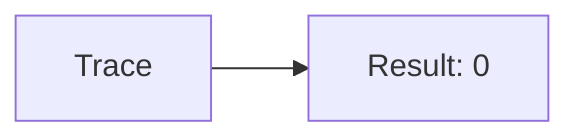
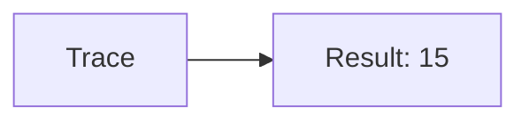
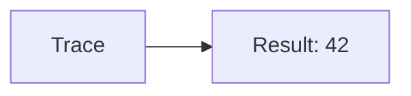
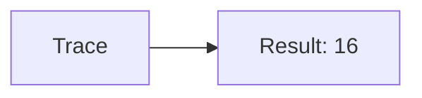
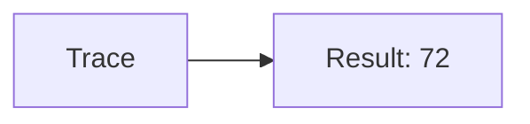
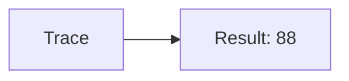

🔙 **[Kembali ke Daftar Soal](./README.md)**

---

# Latihan Soal Part C - Modul 04 - Set 08

### Soal 176
```cpp
// Gps: Pass-by-Reference
void reset(int &x) { x = 0; }
// main: int gps=38;
reset(gps);
```
**Pertanyaan:**
1. Berapakah hasil akhirnya?
2. Deskripsikan alur pikir 'Compiler Manusia' untuk soal ini!

**Jawaban & Diagnosis:**
1. **0**
2. Reference '&' dikirim alamat aslinya. 'Gps' ter-reset jadi 0.

**Mermaid Flowchart:**


---
### Soal 177
```cpp
// Sms: Pass-by-Value
void ubah(int x) { x = 0; }
// main: int sms=50;
ubah(sms);
```
**Pertanyaan:**
1. Berapakah hasil akhirnya?
2. Deskripsikan alur pikir 'Compiler Manusia' untuk soal ini!

**Jawaban & Diagnosis:**
1. **50**
2. Value 'Sms' dikirim fotokopinya. Aslinya tetap 50.

**Mermaid Flowchart:**


---
### Soal 178
```cpp
// Call: Pass-by-Reference
void reset(int &x) { x = 0; }
// main: int call=47;
reset(call);
```
**Pertanyaan:**
1. Berapakah hasil akhirnya?
2. Deskripsikan alur pikir 'Compiler Manusia' untuk soal ini!

**Jawaban & Diagnosis:**
1. **0**
2. Reference '&' dikirim alamat aslinya. 'Call' ter-reset jadi 0.

**Mermaid Flowchart:**


---
### Soal 179
```cpp
// Mail: Pass-by-Value
void ubah(int x) { x = 0; }
// main: int mail=15;
ubah(mail);
```
**Pertanyaan:**
1. Berapakah hasil akhirnya?
2. Deskripsikan alur pikir 'Compiler Manusia' untuk soal ini!

**Jawaban & Diagnosis:**
1. **15**
2. Value 'Mail' dikirim fotokopinya. Aslinya tetap 15.

**Mermaid Flowchart:**


---
### Soal 180
```cpp
// Chat: Pass-by-Reference
void reset(int &x) { x = 0; }
// main: int chat=34;
reset(chat);
```
**Pertanyaan:**
1. Berapakah hasil akhirnya?
2. Deskripsikan alur pikir 'Compiler Manusia' untuk soal ini!

**Jawaban & Diagnosis:**
1. **0**
2. Reference '&' dikirim alamat aslinya. 'Chat' ter-reset jadi 0.

**Mermaid Flowchart:**


---
### Soal 181
```cpp
// Video: Pass-by-Value
void ubah(int x) { x = 0; }
// main: int video=62;
ubah(video);
```
**Pertanyaan:**
1. Berapakah hasil akhirnya?
2. Deskripsikan alur pikir 'Compiler Manusia' untuk soal ini!

**Jawaban & Diagnosis:**
1. **62**
2. Value 'Video' dikirim fotokopinya. Aslinya tetap 62.

**Mermaid Flowchart:**


---
### Soal 182
```cpp
// Photo: Pass-by-Reference
void reset(int &x) { x = 0; }
// main: int photo=56;
reset(photo);
```
**Pertanyaan:**
1. Berapakah hasil akhirnya?
2. Deskripsikan alur pikir 'Compiler Manusia' untuk soal ini!

**Jawaban & Diagnosis:**
1. **0**
2. Reference '&' dikirim alamat aslinya. 'Photo' ter-reset jadi 0.

**Mermaid Flowchart:**


---
### Soal 183
```cpp
// Audio: Pass-by-Value
void ubah(int x) { x = 0; }
// main: int audio=42;
ubah(audio);
```
**Pertanyaan:**
1. Berapakah hasil akhirnya?
2. Deskripsikan alur pikir 'Compiler Manusia' untuk soal ini!

**Jawaban & Diagnosis:**
1. **42**
2. Value 'Audio' dikirim fotokopinya. Aslinya tetap 42.

**Mermaid Flowchart:**


---
### Soal 184
```cpp
// Music: Pass-by-Reference
void reset(int &x) { x = 0; }
// main: int music=60;
reset(music);
```
**Pertanyaan:**
1. Berapakah hasil akhirnya?
2. Deskripsikan alur pikir 'Compiler Manusia' untuk soal ini!

**Jawaban & Diagnosis:**
1. **0**
2. Reference '&' dikirim alamat aslinya. 'Music' ter-reset jadi 0.

**Mermaid Flowchart:**


---
### Soal 185
```cpp
// Movie: Pass-by-Value
void ubah(int x) { x = 0; }
// main: int movie=16;
ubah(movie);
```
**Pertanyaan:**
1. Berapakah hasil akhirnya?
2. Deskripsikan alur pikir 'Compiler Manusia' untuk soal ini!

**Jawaban & Diagnosis:**
1. **16**
2. Value 'Movie' dikirim fotokopinya. Aslinya tetap 16.

**Mermaid Flowchart:**


---
### Soal 186
```cpp
// Game: Pass-by-Reference
void reset(int &x) { x = 0; }
// main: int game=68;
reset(game);
```
**Pertanyaan:**
1. Berapakah hasil akhirnya?
2. Deskripsikan alur pikir 'Compiler Manusia' untuk soal ini!

**Jawaban & Diagnosis:**
1. **0**
2. Reference '&' dikirim alamat aslinya. 'Game' ter-reset jadi 0.

**Mermaid Flowchart:**


---
### Soal 187
```cpp
// App: Pass-by-Value
void ubah(int x) { x = 0; }
// main: int app=46;
ubah(app);
```
**Pertanyaan:**
1. Berapakah hasil akhirnya?
2. Deskripsikan alur pikir 'Compiler Manusia' untuk soal ini!

**Jawaban & Diagnosis:**
1. **46**
2. Value 'App' dikirim fotokopinya. Aslinya tetap 46.

**Mermaid Flowchart:**


---
### Soal 188
```cpp
// Web: Pass-by-Reference
void reset(int &x) { x = 0; }
// main: int web=56;
reset(web);
```
**Pertanyaan:**
1. Berapakah hasil akhirnya?
2. Deskripsikan alur pikir 'Compiler Manusia' untuk soal ini!

**Jawaban & Diagnosis:**
1. **0**
2. Reference '&' dikirim alamat aslinya. 'Web' ter-reset jadi 0.

**Mermaid Flowchart:**


---
### Soal 189
```cpp
// Cloud: Pass-by-Value
void ubah(int x) { x = 0; }
// main: int cloud=15;
ubah(cloud);
```
**Pertanyaan:**
1. Berapakah hasil akhirnya?
2. Deskripsikan alur pikir 'Compiler Manusia' untuk soal ini!

**Jawaban & Diagnosis:**
1. **15**
2. Value 'Cloud' dikirim fotokopinya. Aslinya tetap 15.

**Mermaid Flowchart:**


---
### Soal 190
```cpp
// Ssh: Pass-by-Reference
void reset(int &x) { x = 0; }
// main: int ssh=26;
reset(ssh);
```
**Pertanyaan:**
1. Berapakah hasil akhirnya?
2. Deskripsikan alur pikir 'Compiler Manusia' untuk soal ini!

**Jawaban & Diagnosis:**
1. **0**
2. Reference '&' dikirim alamat aslinya. 'Ssh' ter-reset jadi 0.

**Mermaid Flowchart:**


---
### Soal 191
```cpp
// Ftp: Pass-by-Value
void ubah(int x) { x = 0; }
// main: int ftp=54;
ubah(ftp);
```
**Pertanyaan:**
1. Berapakah hasil akhirnya?
2. Deskripsikan alur pikir 'Compiler Manusia' untuk soal ini!

**Jawaban & Diagnosis:**
1. **54**
2. Value 'Ftp' dikirim fotokopinya. Aslinya tetap 54.

**Mermaid Flowchart:**


---
### Soal 192
```cpp
// Http: Pass-by-Reference
void reset(int &x) { x = 0; }
// main: int http=35;
reset(http);
```
**Pertanyaan:**
1. Berapakah hasil akhirnya?
2. Deskripsikan alur pikir 'Compiler Manusia' untuk soal ini!

**Jawaban & Diagnosis:**
1. **0**
2. Reference '&' dikirim alamat aslinya. 'Http' ter-reset jadi 0.

**Mermaid Flowchart:**


---
### Soal 193
```cpp
// Tcp: Pass-by-Value
void ubah(int x) { x = 0; }
// main: int tcp=72;
ubah(tcp);
```
**Pertanyaan:**
1. Berapakah hasil akhirnya?
2. Deskripsikan alur pikir 'Compiler Manusia' untuk soal ini!

**Jawaban & Diagnosis:**
1. **72**
2. Value 'Tcp' dikirim fotokopinya. Aslinya tetap 72.

**Mermaid Flowchart:**


---
### Soal 194
```cpp
// Udp: Pass-by-Reference
void reset(int &x) { x = 0; }
// main: int udp=90;
reset(udp);
```
**Pertanyaan:**
1. Berapakah hasil akhirnya?
2. Deskripsikan alur pikir 'Compiler Manusia' untuk soal ini!

**Jawaban & Diagnosis:**
1. **0**
2. Reference '&' dikirim alamat aslinya. 'Udp' ter-reset jadi 0.

**Mermaid Flowchart:**


---
### Soal 195
```cpp
// Icmp: Pass-by-Value
void ubah(int x) { x = 0; }
// main: int icmp=88;
ubah(icmp);
```
**Pertanyaan:**
1. Berapakah hasil akhirnya?
2. Deskripsikan alur pikir 'Compiler Manusia' untuk soal ini!

**Jawaban & Diagnosis:**
1. **88**
2. Value 'Icmp' dikirim fotokopinya. Aslinya tetap 88.

**Mermaid Flowchart:**


---
### Soal 196
```cpp
// Arp: Pass-by-Reference
void reset(int &x) { x = 0; }
// main: int arp=12;
reset(arp);
```
**Pertanyaan:**
1. Berapakah hasil akhirnya?
2. Deskripsikan alur pikir 'Compiler Manusia' untuk soal ini!

**Jawaban & Diagnosis:**
1. **0**
2. Reference '&' dikirim alamat aslinya. 'Arp' ter-reset jadi 0.

**Mermaid Flowchart:**
```mermaid
graph LR
A[Trace] --> B[Result: 0]
```

---
### Soal 197
```cpp
// Dns: Pass-by-Value
void ubah(int x) { x = 0; }
// main: int dns=58;
ubah(dns);
```
**Pertanyaan:**
1. Berapakah hasil akhirnya?
2. Deskripsikan alur pikir 'Compiler Manusia' untuk soal ini!

**Jawaban & Diagnosis:**
1. **58**
2. Value 'Dns' dikirim fotokopinya. Aslinya tetap 58.

**Mermaid Flowchart:**
```mermaid
graph LR
A[Trace] --> B[Result: 58]
```

---
### Soal 198
```cpp
// Dhcp: Pass-by-Reference
void reset(int &x) { x = 0; }
// main: int dhcp=94;
reset(dhcp);
```
**Pertanyaan:**
1. Berapakah hasil akhirnya?
2. Deskripsikan alur pikir 'Compiler Manusia' untuk soal ini!

**Jawaban & Diagnosis:**
1. **0**
2. Reference '&' dikirim alamat aslinya. 'Dhcp' ter-reset jadi 0.

**Mermaid Flowchart:**
```mermaid
graph LR
A[Trace] --> B[Result: 0]
```

---
### Soal 199
```cpp
// Nat: Pass-by-Value
void ubah(int x) { x = 0; }
// main: int nat=80;
ubah(nat);
```
**Pertanyaan:**
1. Berapakah hasil akhirnya?
2. Deskripsikan alur pikir 'Compiler Manusia' untuk soal ini!

**Jawaban & Diagnosis:**
1. **80**
2. Value 'Nat' dikirim fotokopinya. Aslinya tetap 80.

**Mermaid Flowchart:**
```mermaid
graph LR
A[Trace] --> B[Result: 80]
```

---
### Soal 200
```cpp
// Vpn: Pass-by-Reference
void reset(int &x) { x = 0; }
// main: int vpn=72;
reset(vpn);
```
**Pertanyaan:**
1. Berapakah hasil akhirnya?
2. Deskripsikan alur pikir 'Compiler Manusia' untuk soal ini!

**Jawaban & Diagnosis:**
1. **0**
2. Reference '&' dikirim alamat aslinya. 'Vpn' ter-reset jadi 0.

**Mermaid Flowchart:**
```mermaid
graph LR
A[Trace] --> B[Result: 0]
```

---
