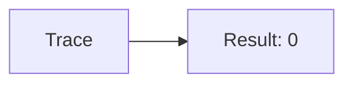
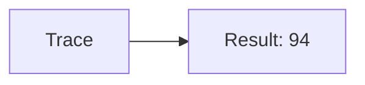
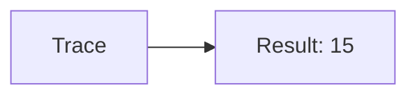
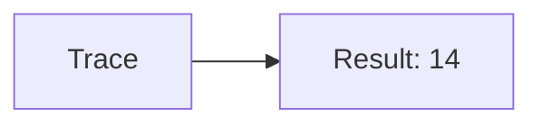
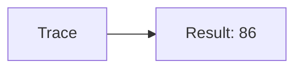
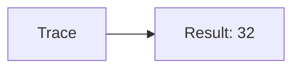
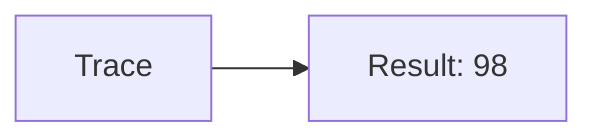

🔙 **[Kembali ke Daftar Soal](./README.md)**

---

# Latihan Soal Part C - Modul 04 - Set 09

### Soal 201
```cpp
// PR: Pass-by-Value
void ubah(int x) { x = 0; }
// main: int pr=35;
ubah(pr);
```
**Pertanyaan:**
1. Berapakah hasil akhirnya?
2. Deskripsikan alur pikir 'Compiler Manusia' untuk soal ini!

**Jawaban & Diagnosis:**
1. **35**
2. Value 'PR' dikirim fotokopinya. Aslinya tetap 35.

**Mermaid Flowchart:**


---
### Soal 202
```cpp
// Laporan: Pass-by-Reference
void reset(int &x) { x = 0; }
// main: int laporan=83;
reset(laporan);
```
**Pertanyaan:**
1. Berapakah hasil akhirnya?
2. Deskripsikan alur pikir 'Compiler Manusia' untuk soal ini!

**Jawaban & Diagnosis:**
1. **0**
2. Reference '&' dikirim alamat aslinya. 'Laporan' ter-reset jadi 0.

**Mermaid Flowchart:**


---
### Soal 203
```cpp
// Data: Pass-by-Value
void ubah(int x) { x = 0; }
// main: int data=94;
ubah(data);
```
**Pertanyaan:**
1. Berapakah hasil akhirnya?
2. Deskripsikan alur pikir 'Compiler Manusia' untuk soal ini!

**Jawaban & Diagnosis:**
1. **94**
2. Value 'Data' dikirim fotokopinya. Aslinya tetap 94.

**Mermaid Flowchart:**


---
### Soal 204
```cpp
// Uang: Pass-by-Reference
void reset(int &x) { x = 0; }
// main: int uang=92;
reset(uang);
```
**Pertanyaan:**
1. Berapakah hasil akhirnya?
2. Deskripsikan alur pikir 'Compiler Manusia' untuk soal ini!

**Jawaban & Diagnosis:**
1. **0**
2. Reference '&' dikirim alamat aslinya. 'Uang' ter-reset jadi 0.

**Mermaid Flowchart:**


---
### Soal 205
```cpp
// Saldo: Pass-by-Value
void ubah(int x) { x = 0; }
// main: int saldo=55;
ubah(saldo);
```
**Pertanyaan:**
1. Berapakah hasil akhirnya?
2. Deskripsikan alur pikir 'Compiler Manusia' untuk soal ini!

**Jawaban & Diagnosis:**
1. **55**
2. Value 'Saldo' dikirim fotokopinya. Aslinya tetap 55.

**Mermaid Flowchart:**


---
### Soal 206
```cpp
// Poin: Pass-by-Reference
void reset(int &x) { x = 0; }
// main: int poin=50;
reset(poin);
```
**Pertanyaan:**
1. Berapakah hasil akhirnya?
2. Deskripsikan alur pikir 'Compiler Manusia' untuk soal ini!

**Jawaban & Diagnosis:**
1. **0**
2. Reference '&' dikirim alamat aslinya. 'Poin' ter-reset jadi 0.

**Mermaid Flowchart:**


---
### Soal 207
```cpp
// Skor: Pass-by-Value
void ubah(int x) { x = 0; }
// main: int skor=15;
ubah(skor);
```
**Pertanyaan:**
1. Berapakah hasil akhirnya?
2. Deskripsikan alur pikir 'Compiler Manusia' untuk soal ini!

**Jawaban & Diagnosis:**
1. **15**
2. Value 'Skor' dikirim fotokopinya. Aslinya tetap 15.

**Mermaid Flowchart:**


---
### Soal 208
```cpp
// Level: Pass-by-Reference
void reset(int &x) { x = 0; }
// main: int level=28;
reset(level);
```
**Pertanyaan:**
1. Berapakah hasil akhirnya?
2. Deskripsikan alur pikir 'Compiler Manusia' untuk soal ini!

**Jawaban & Diagnosis:**
1. **0**
2. Reference '&' dikirim alamat aslinya. 'Level' ter-reset jadi 0.

**Mermaid Flowchart:**


---
### Soal 209
```cpp
// Hp: Pass-by-Value
void ubah(int x) { x = 0; }
// main: int hp=73;
ubah(hp);
```
**Pertanyaan:**
1. Berapakah hasil akhirnya?
2. Deskripsikan alur pikir 'Compiler Manusia' untuk soal ini!

**Jawaban & Diagnosis:**
1. **73**
2. Value 'Hp' dikirim fotokopinya. Aslinya tetap 73.

**Mermaid Flowchart:**


---
### Soal 210
```cpp
// Atk: Pass-by-Reference
void reset(int &x) { x = 0; }
// main: int atk=94;
reset(atk);
```
**Pertanyaan:**
1. Berapakah hasil akhirnya?
2. Deskripsikan alur pikir 'Compiler Manusia' untuk soal ini!

**Jawaban & Diagnosis:**
1. **0**
2. Reference '&' dikirim alamat aslinya. 'Atk' ter-reset jadi 0.

**Mermaid Flowchart:**


---
### Soal 211
```cpp
// Def: Pass-by-Value
void ubah(int x) { x = 0; }
// main: int def=14;
ubah(def);
```
**Pertanyaan:**
1. Berapakah hasil akhirnya?
2. Deskripsikan alur pikir 'Compiler Manusia' untuk soal ini!

**Jawaban & Diagnosis:**
1. **14**
2. Value 'Def' dikirim fotokopinya. Aslinya tetap 14.

**Mermaid Flowchart:**


---
### Soal 212
```cpp
// Spd: Pass-by-Reference
void reset(int &x) { x = 0; }
// main: int spd=95;
reset(spd);
```
**Pertanyaan:**
1. Berapakah hasil akhirnya?
2. Deskripsikan alur pikir 'Compiler Manusia' untuk soal ini!

**Jawaban & Diagnosis:**
1. **0**
2. Reference '&' dikirim alamat aslinya. 'Spd' ter-reset jadi 0.

**Mermaid Flowchart:**


---
### Soal 213
```cpp
// Luck: Pass-by-Value
void ubah(int x) { x = 0; }
// main: int luck=86;
ubah(luck);
```
**Pertanyaan:**
1. Berapakah hasil akhirnya?
2. Deskripsikan alur pikir 'Compiler Manusia' untuk soal ini!

**Jawaban & Diagnosis:**
1. **86**
2. Value 'Luck' dikirim fotokopinya. Aslinya tetap 86.

**Mermaid Flowchart:**


---
### Soal 214
```cpp
// Cri: Pass-by-Reference
void reset(int &x) { x = 0; }
// main: int cri=29;
reset(cri);
```
**Pertanyaan:**
1. Berapakah hasil akhirnya?
2. Deskripsikan alur pikir 'Compiler Manusia' untuk soal ini!

**Jawaban & Diagnosis:**
1. **0**
2. Reference '&' dikirim alamat aslinya. 'Cri' ter-reset jadi 0.

**Mermaid Flowchart:**


---
### Soal 215
```cpp
// Eva: Pass-by-Value
void ubah(int x) { x = 0; }
// main: int eva=47;
ubah(eva);
```
**Pertanyaan:**
1. Berapakah hasil akhirnya?
2. Deskripsikan alur pikir 'Compiler Manusia' untuk soal ini!

**Jawaban & Diagnosis:**
1. **47**
2. Value 'Eva' dikirim fotokopinya. Aslinya tetap 47.

**Mermaid Flowchart:**


---
### Soal 216
```cpp
// Hit: Pass-by-Reference
void reset(int &x) { x = 0; }
// main: int hit=12;
reset(hit);
```
**Pertanyaan:**
1. Berapakah hasil akhirnya?
2. Deskripsikan alur pikir 'Compiler Manusia' untuk soal ini!

**Jawaban & Diagnosis:**
1. **0**
2. Reference '&' dikirim alamat aslinya. 'Hit' ter-reset jadi 0.

**Mermaid Flowchart:**


---
### Soal 217
```cpp
// Res: Pass-by-Value
void ubah(int x) { x = 0; }
// main: int res=32;
ubah(res);
```
**Pertanyaan:**
1. Berapakah hasil akhirnya?
2. Deskripsikan alur pikir 'Compiler Manusia' untuk soal ini!

**Jawaban & Diagnosis:**
1. **32**
2. Value 'Res' dikirim fotokopinya. Aslinya tetap 32.

**Mermaid Flowchart:**


---
### Soal 218
```cpp
// Elem: Pass-by-Reference
void reset(int &x) { x = 0; }
// main: int elem=91;
reset(elem);
```
**Pertanyaan:**
1. Berapakah hasil akhirnya?
2. Deskripsikan alur pikir 'Compiler Manusia' untuk soal ini!

**Jawaban & Diagnosis:**
1. **0**
2. Reference '&' dikirim alamat aslinya. 'Elem' ter-reset jadi 0.

**Mermaid Flowchart:**


---
### Soal 219
```cpp
// Skill: Pass-by-Value
void ubah(int x) { x = 0; }
// main: int skill=98;
ubah(skill);
```
**Pertanyaan:**
1. Berapakah hasil akhirnya?
2. Deskripsikan alur pikir 'Compiler Manusia' untuk soal ini!

**Jawaban & Diagnosis:**
1. **98**
2. Value 'Skill' dikirim fotokopinya. Aslinya tetap 98.

**Mermaid Flowchart:**


---
### Soal 220
```cpp
// Magic: Pass-by-Reference
void reset(int &x) { x = 0; }
// main: int magic=75;
reset(magic);
```
**Pertanyaan:**
1. Berapakah hasil akhirnya?
2. Deskripsikan alur pikir 'Compiler Manusia' untuk soal ini!

**Jawaban & Diagnosis:**
1. **0**
2. Reference '&' dikirim alamat aslinya. 'Magic' ter-reset jadi 0.

**Mermaid Flowchart:**


---
### Soal 221
```cpp
// Stam: Pass-by-Value
void ubah(int x) { x = 0; }
// main: int stam=76;
ubah(stam);
```
**Pertanyaan:**
1. Berapakah hasil akhirnya?
2. Deskripsikan alur pikir 'Compiler Manusia' untuk soal ini!

**Jawaban & Diagnosis:**
1. **76**
2. Value 'Stam' dikirim fotokopinya. Aslinya tetap 76.

**Mermaid Flowchart:**
```mermaid
graph LR
A[Trace] --> B[Result: 76]
```

---
### Soal 222
```cpp
// Mana: Pass-by-Reference
void reset(int &x) { x = 0; }
// main: int mana=68;
reset(mana);
```
**Pertanyaan:**
1. Berapakah hasil akhirnya?
2. Deskripsikan alur pikir 'Compiler Manusia' untuk soal ini!

**Jawaban & Diagnosis:**
1. **0**
2. Reference '&' dikirim alamat aslinya. 'Mana' ter-reset jadi 0.

**Mermaid Flowchart:**
```mermaid
graph LR
A[Trace] --> B[Result: 0]
```

---
### Soal 223
```cpp
// Health: Pass-by-Value
void ubah(int x) { x = 0; }
// main: int health=23;
ubah(health);
```
**Pertanyaan:**
1. Berapakah hasil akhirnya?
2. Deskripsikan alur pikir 'Compiler Manusia' untuk soal ini!

**Jawaban & Diagnosis:**
1. **23**
2. Value 'Health' dikirim fotokopinya. Aslinya tetap 23.

**Mermaid Flowchart:**
```mermaid
graph LR
A[Trace] --> B[Result: 23]
```

---
### Soal 224
```cpp
// Shield: Pass-by-Reference
void reset(int &x) { x = 0; }
// main: int shield=69;
reset(shield);
```
**Pertanyaan:**
1. Berapakah hasil akhirnya?
2. Deskripsikan alur pikir 'Compiler Manusia' untuk soal ini!

**Jawaban & Diagnosis:**
1. **0**
2. Reference '&' dikirim alamat aslinya. 'Shield' ter-reset jadi 0.

**Mermaid Flowchart:**
```mermaid
graph LR
A[Trace] --> B[Result: 0]
```

---
### Soal 225
```cpp
// Armor: Pass-by-Value
void ubah(int x) { x = 0; }
// main: int armor=48;
ubah(armor);
```
**Pertanyaan:**
1. Berapakah hasil akhirnya?
2. Deskripsikan alur pikir 'Compiler Manusia' untuk soal ini!

**Jawaban & Diagnosis:**
1. **48**
2. Value 'Armor' dikirim fotokopinya. Aslinya tetap 48.

**Mermaid Flowchart:**
```mermaid
graph LR
A[Trace] --> B[Result: 48]
```

---
