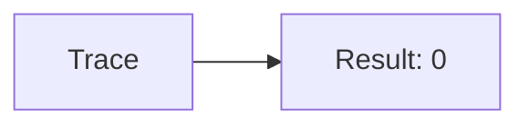
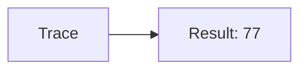
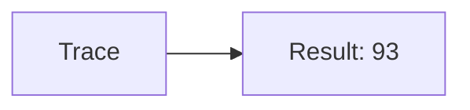
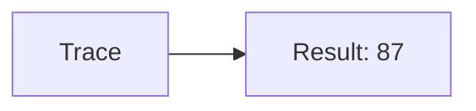

🔙 **[Kembali ke Daftar Soal](./README.md)**

---

# Latihan Soal Part C - Modul 04 - Set 10

### Soal 226
```cpp
// Weapon: Pass-by-Reference
void reset(int &x) { x = 0; }
// main: int weapon=82;
reset(weapon);
```
**Pertanyaan:**
1. Berapakah hasil akhirnya?
2. Deskripsikan alur pikir 'Compiler Manusia' untuk soal ini!

**Jawaban & Diagnosis:**
1. **0**
2. Reference '&' dikirim alamat aslinya. 'Weapon' ter-reset jadi 0.

**Mermaid Flowchart:**


---
### Soal 227
```cpp
// Tool: Pass-by-Value
void ubah(int x) { x = 0; }
// main: int tool=85;
ubah(tool);
```
**Pertanyaan:**
1. Berapakah hasil akhirnya?
2. Deskripsikan alur pikir 'Compiler Manusia' untuk soal ini!

**Jawaban & Diagnosis:**
1. **85**
2. Value 'Tool' dikirim fotokopinya. Aslinya tetap 85.

**Mermaid Flowchart:**


---
### Soal 228
```cpp
// Item: Pass-by-Reference
void reset(int &x) { x = 0; }
// main: int item=12;
reset(item);
```
**Pertanyaan:**
1. Berapakah hasil akhirnya?
2. Deskripsikan alur pikir 'Compiler Manusia' untuk soal ini!

**Jawaban & Diagnosis:**
1. **0**
2. Reference '&' dikirim alamat aslinya. 'Item' ter-reset jadi 0.

**Mermaid Flowchart:**


---
### Soal 229
```cpp
// Food: Pass-by-Value
void ubah(int x) { x = 0; }
// main: int food=77;
ubah(food);
```
**Pertanyaan:**
1. Berapakah hasil akhirnya?
2. Deskripsikan alur pikir 'Compiler Manusia' untuk soal ini!

**Jawaban & Diagnosis:**
1. **77**
2. Value 'Food' dikirim fotokopinya. Aslinya tetap 77.

**Mermaid Flowchart:**


---
### Soal 230
```cpp
// Drink: Pass-by-Reference
void reset(int &x) { x = 0; }
// main: int drink=61;
reset(drink);
```
**Pertanyaan:**
1. Berapakah hasil akhirnya?
2. Deskripsikan alur pikir 'Compiler Manusia' untuk soal ini!

**Jawaban & Diagnosis:**
1. **0**
2. Reference '&' dikirim alamat aslinya. 'Drink' ter-reset jadi 0.

**Mermaid Flowchart:**


---
### Soal 231
```cpp
// Potion: Pass-by-Value
void ubah(int x) { x = 0; }
// main: int potion=36;
ubah(potion);
```
**Pertanyaan:**
1. Berapakah hasil akhirnya?
2. Deskripsikan alur pikir 'Compiler Manusia' untuk soal ini!

**Jawaban & Diagnosis:**
1. **36**
2. Value 'Potion' dikirim fotokopinya. Aslinya tetap 36.

**Mermaid Flowchart:**


---
### Soal 232
```cpp
// Scroll: Pass-by-Reference
void reset(int &x) { x = 0; }
// main: int scroll=13;
reset(scroll);
```
**Pertanyaan:**
1. Berapakah hasil akhirnya?
2. Deskripsikan alur pikir 'Compiler Manusia' untuk soal ini!

**Jawaban & Diagnosis:**
1. **0**
2. Reference '&' dikirim alamat aslinya. 'Scroll' ter-reset jadi 0.

**Mermaid Flowchart:**


---
### Soal 233
```cpp
// Book: Pass-by-Value
void ubah(int x) { x = 0; }
// main: int book=90;
ubah(book);
```
**Pertanyaan:**
1. Berapakah hasil akhirnya?
2. Deskripsikan alur pikir 'Compiler Manusia' untuk soal ini!

**Jawaban & Diagnosis:**
1. **90**
2. Value 'Book' dikirim fotokopinya. Aslinya tetap 90.

**Mermaid Flowchart:**


---
### Soal 234
```cpp
// Map: Pass-by-Reference
void reset(int &x) { x = 0; }
// main: int map=24;
reset(map);
```
**Pertanyaan:**
1. Berapakah hasil akhirnya?
2. Deskripsikan alur pikir 'Compiler Manusia' untuk soal ini!

**Jawaban & Diagnosis:**
1. **0**
2. Reference '&' dikirim alamat aslinya. 'Map' ter-reset jadi 0.

**Mermaid Flowchart:**


---
### Soal 235
```cpp
// Key: Pass-by-Value
void ubah(int x) { x = 0; }
// main: int key=93;
ubah(key);
```
**Pertanyaan:**
1. Berapakah hasil akhirnya?
2. Deskripsikan alur pikir 'Compiler Manusia' untuk soal ini!

**Jawaban & Diagnosis:**
1. **93**
2. Value 'Key' dikirim fotokopinya. Aslinya tetap 93.

**Mermaid Flowchart:**


---
### Soal 236
```cpp
// Coin: Pass-by-Reference
void reset(int &x) { x = 0; }
// main: int coin=88;
reset(coin);
```
**Pertanyaan:**
1. Berapakah hasil akhirnya?
2. Deskripsikan alur pikir 'Compiler Manusia' untuk soal ini!

**Jawaban & Diagnosis:**
1. **0**
2. Reference '&' dikirim alamat aslinya. 'Coin' ter-reset jadi 0.

**Mermaid Flowchart:**


---
### Soal 237
```cpp
// Gem: Pass-by-Value
void ubah(int x) { x = 0; }
// main: int gem=62;
ubah(gem);
```
**Pertanyaan:**
1. Berapakah hasil akhirnya?
2. Deskripsikan alur pikir 'Compiler Manusia' untuk soal ini!

**Jawaban & Diagnosis:**
1. **62**
2. Value 'Gem' dikirim fotokopinya. Aslinya tetap 62.

**Mermaid Flowchart:**


---
### Soal 238
```cpp
// Jewel: Pass-by-Reference
void reset(int &x) { x = 0; }
// main: int jewel=77;
reset(jewel);
```
**Pertanyaan:**
1. Berapakah hasil akhirnya?
2. Deskripsikan alur pikir 'Compiler Manusia' untuk soal ini!

**Jawaban & Diagnosis:**
1. **0**
2. Reference '&' dikirim alamat aslinya. 'Jewel' ter-reset jadi 0.

**Mermaid Flowchart:**


---
### Soal 239
```cpp
// Stone: Pass-by-Value
void ubah(int x) { x = 0; }
// main: int stone=60;
ubah(stone);
```
**Pertanyaan:**
1. Berapakah hasil akhirnya?
2. Deskripsikan alur pikir 'Compiler Manusia' untuk soal ini!

**Jawaban & Diagnosis:**
1. **60**
2. Value 'Stone' dikirim fotokopinya. Aslinya tetap 60.

**Mermaid Flowchart:**


---
### Soal 240
```cpp
// Ore: Pass-by-Reference
void reset(int &x) { x = 0; }
// main: int ore=59;
reset(ore);
```
**Pertanyaan:**
1. Berapakah hasil akhirnya?
2. Deskripsikan alur pikir 'Compiler Manusia' untuk soal ini!

**Jawaban & Diagnosis:**
1. **0**
2. Reference '&' dikirim alamat aslinya. 'Ore' ter-reset jadi 0.

**Mermaid Flowchart:**


---
### Soal 241
```cpp
// Metal: Pass-by-Value
void ubah(int x) { x = 0; }
// main: int metal=48;
ubah(metal);
```
**Pertanyaan:**
1. Berapakah hasil akhirnya?
2. Deskripsikan alur pikir 'Compiler Manusia' untuk soal ini!

**Jawaban & Diagnosis:**
1. **48**
2. Value 'Metal' dikirim fotokopinya. Aslinya tetap 48.

**Mermaid Flowchart:**


---
### Soal 242
```cpp
// Wood: Pass-by-Reference
void reset(int &x) { x = 0; }
// main: int wood=77;
reset(wood);
```
**Pertanyaan:**
1. Berapakah hasil akhirnya?
2. Deskripsikan alur pikir 'Compiler Manusia' untuk soal ini!

**Jawaban & Diagnosis:**
1. **0**
2. Reference '&' dikirim alamat aslinya. 'Wood' ter-reset jadi 0.

**Mermaid Flowchart:**


---
### Soal 243
```cpp
// Leather: Pass-by-Value
void ubah(int x) { x = 0; }
// main: int leather=61;
ubah(leather);
```
**Pertanyaan:**
1. Berapakah hasil akhirnya?
2. Deskripsikan alur pikir 'Compiler Manusia' untuk soal ini!

**Jawaban & Diagnosis:**
1. **61**
2. Value 'Leather' dikirim fotokopinya. Aslinya tetap 61.

**Mermaid Flowchart:**


---
### Soal 244
```cpp
// Cloth: Pass-by-Reference
void reset(int &x) { x = 0; }
// main: int cloth=44;
reset(cloth);
```
**Pertanyaan:**
1. Berapakah hasil akhirnya?
2. Deskripsikan alur pikir 'Compiler Manusia' untuk soal ini!

**Jawaban & Diagnosis:**
1. **0**
2. Reference '&' dikirim alamat aslinya. 'Cloth' ter-reset jadi 0.

**Mermaid Flowchart:**


---
### Soal 245
```cpp
// Herb: Pass-by-Value
void ubah(int x) { x = 0; }
// main: int herb=87;
ubah(herb);
```
**Pertanyaan:**
1. Berapakah hasil akhirnya?
2. Deskripsikan alur pikir 'Compiler Manusia' untuk soal ini!

**Jawaban & Diagnosis:**
1. **87**
2. Value 'Herb' dikirim fotokopinya. Aslinya tetap 87.

**Mermaid Flowchart:**


---
### Soal 246
```cpp
// Seed: Pass-by-Reference
void reset(int &x) { x = 0; }
// main: int seed=51;
reset(seed);
```
**Pertanyaan:**
1. Berapakah hasil akhirnya?
2. Deskripsikan alur pikir 'Compiler Manusia' untuk soal ini!

**Jawaban & Diagnosis:**
1. **0**
2. Reference '&' dikirim alamat aslinya. 'Seed' ter-reset jadi 0.

**Mermaid Flowchart:**
```mermaid
graph LR
A[Trace] --> B[Result: 0]
```

---
### Soal 247
```cpp
// Crop: Pass-by-Value
void ubah(int x) { x = 0; }
// main: int crop=98;
ubah(crop);
```
**Pertanyaan:**
1. Berapakah hasil akhirnya?
2. Deskripsikan alur pikir 'Compiler Manusia' untuk soal ini!

**Jawaban & Diagnosis:**
1. **98**
2. Value 'Crop' dikirim fotokopinya. Aslinya tetap 98.

**Mermaid Flowchart:**
```mermaid
graph LR
A[Trace] --> B[Result: 98]
```

---
### Soal 248
```cpp
// Animal: Pass-by-Reference
void reset(int &x) { x = 0; }
// main: int animal=13;
reset(animal);
```
**Pertanyaan:**
1. Berapakah hasil akhirnya?
2. Deskripsikan alur pikir 'Compiler Manusia' untuk soal ini!

**Jawaban & Diagnosis:**
1. **0**
2. Reference '&' dikirim alamat aslinya. 'Animal' ter-reset jadi 0.

**Mermaid Flowchart:**
```mermaid
graph LR
A[Trace] --> B[Result: 0]
```

---
### Soal 249
```cpp
// Fish: Pass-by-Value
void ubah(int x) { x = 0; }
// main: int fish=71;
ubah(fish);
```
**Pertanyaan:**
1. Berapakah hasil akhirnya?
2. Deskripsikan alur pikir 'Compiler Manusia' untuk soal ini!

**Jawaban & Diagnosis:**
1. **71**
2. Value 'Fish' dikirim fotokopinya. Aslinya tetap 71.

**Mermaid Flowchart:**
```mermaid
graph LR
A[Trace] --> B[Result: 71]
```

---
### Soal 250
```cpp
// Insect: Pass-by-Reference
void reset(int &x) { x = 0; }
// main: int insect=99;
reset(insect);
```
**Pertanyaan:**
1. Berapakah hasil akhirnya?
2. Deskripsikan alur pikir 'Compiler Manusia' untuk soal ini!

**Jawaban & Diagnosis:**
1. **0**
2. Reference '&' dikirim alamat aslinya. 'Insect' ter-reset jadi 0.

**Mermaid Flowchart:**
```mermaid
graph LR
A[Trace] --> B[Result: 0]
```

---
