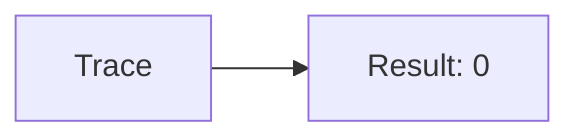
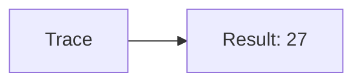
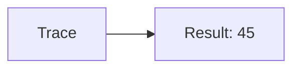
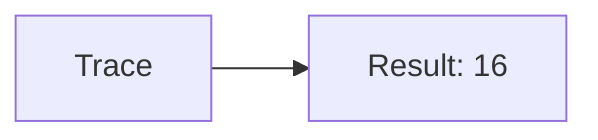
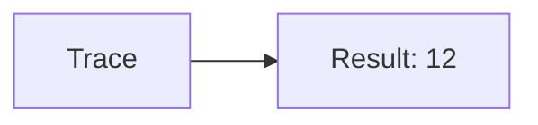
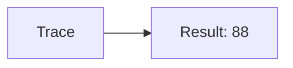

🔙 **[Kembali ke Daftar Soal](./README.md)**

---

# Latihan Soal Part C - Modul 04 - Set 11

### Soal 251
```cpp
// Bird: Pass-by-Value
void ubah(int x) { x = 0; }
// main: int bird=52;
ubah(bird);
```
**Pertanyaan:**
1. Berapakah hasil akhirnya?
2. Deskripsikan alur pikir 'Compiler Manusia' untuk soal ini!

**Jawaban & Diagnosis:**
1. **52**
2. Value 'Bird' dikirim fotokopinya. Aslinya tetap 52.

**Mermaid Flowchart:**


---
### Soal 252
```cpp
// Monster: Pass-by-Reference
void reset(int &x) { x = 0; }
// main: int monster=31;
reset(monster);
```
**Pertanyaan:**
1. Berapakah hasil akhirnya?
2. Deskripsikan alur pikir 'Compiler Manusia' untuk soal ini!

**Jawaban & Diagnosis:**
1. **0**
2. Reference '&' dikirim alamat aslinya. 'Monster' ter-reset jadi 0.

**Mermaid Flowchart:**


---
### Soal 253
```cpp
// Boss: Pass-by-Value
void ubah(int x) { x = 0; }
// main: int boss=27;
ubah(boss);
```
**Pertanyaan:**
1. Berapakah hasil akhirnya?
2. Deskripsikan alur pikir 'Compiler Manusia' untuk soal ini!

**Jawaban & Diagnosis:**
1. **27**
2. Value 'Boss' dikirim fotokopinya. Aslinya tetap 27.

**Mermaid Flowchart:**


---
### Soal 254
```cpp
// Npc: Pass-by-Reference
void reset(int &x) { x = 0; }
// main: int npc=56;
reset(npc);
```
**Pertanyaan:**
1. Berapakah hasil akhirnya?
2. Deskripsikan alur pikir 'Compiler Manusia' untuk soal ini!

**Jawaban & Diagnosis:**
1. **0**
2. Reference '&' dikirim alamat aslinya. 'Npc' ter-reset jadi 0.

**Mermaid Flowchart:**


---
### Soal 255
```cpp
// Pc: Pass-by-Value
void ubah(int x) { x = 0; }
// main: int pc=56;
ubah(pc);
```
**Pertanyaan:**
1. Berapakah hasil akhirnya?
2. Deskripsikan alur pikir 'Compiler Manusia' untuk soal ini!

**Jawaban & Diagnosis:**
1. **56**
2. Value 'Pc' dikirim fotokopinya. Aslinya tetap 56.

**Mermaid Flowchart:**


---
### Soal 256
```cpp
// User: Pass-by-Reference
void reset(int &x) { x = 0; }
// main: int user=31;
reset(user);
```
**Pertanyaan:**
1. Berapakah hasil akhirnya?
2. Deskripsikan alur pikir 'Compiler Manusia' untuk soal ini!

**Jawaban & Diagnosis:**
1. **0**
2. Reference '&' dikirim alamat aslinya. 'User' ter-reset jadi 0.

**Mermaid Flowchart:**


---
### Soal 257
```cpp
// Admin: Pass-by-Value
void ubah(int x) { x = 0; }
// main: int admin=45;
ubah(admin);
```
**Pertanyaan:**
1. Berapakah hasil akhirnya?
2. Deskripsikan alur pikir 'Compiler Manusia' untuk soal ini!

**Jawaban & Diagnosis:**
1. **45**
2. Value 'Admin' dikirim fotokopinya. Aslinya tetap 45.

**Mermaid Flowchart:**


---
### Soal 258
```cpp
// Mod: Pass-by-Reference
void reset(int &x) { x = 0; }
// main: int mod=23;
reset(mod);
```
**Pertanyaan:**
1. Berapakah hasil akhirnya?
2. Deskripsikan alur pikir 'Compiler Manusia' untuk soal ini!

**Jawaban & Diagnosis:**
1. **0**
2. Reference '&' dikirim alamat aslinya. 'Mod' ter-reset jadi 0.

**Mermaid Flowchart:**


---
### Soal 259
```cpp
// Guest: Pass-by-Value
void ubah(int x) { x = 0; }
// main: int guest=16;
ubah(guest);
```
**Pertanyaan:**
1. Berapakah hasil akhirnya?
2. Deskripsikan alur pikir 'Compiler Manusia' untuk soal ini!

**Jawaban & Diagnosis:**
1. **16**
2. Value 'Guest' dikirim fotokopinya. Aslinya tetap 16.

**Mermaid Flowchart:**


---
### Soal 260
```cpp
// Bot: Pass-by-Reference
void reset(int &x) { x = 0; }
// main: int bot=89;
reset(bot);
```
**Pertanyaan:**
1. Berapakah hasil akhirnya?
2. Deskripsikan alur pikir 'Compiler Manusia' untuk soal ini!

**Jawaban & Diagnosis:**
1. **0**
2. Reference '&' dikirim alamat aslinya. 'Bot' ter-reset jadi 0.

**Mermaid Flowchart:**


---
### Soal 261
```cpp
// Ai: Pass-by-Value
void ubah(int x) { x = 0; }
// main: int ai=43;
ubah(ai);
```
**Pertanyaan:**
1. Berapakah hasil akhirnya?
2. Deskripsikan alur pikir 'Compiler Manusia' untuk soal ini!

**Jawaban & Diagnosis:**
1. **43**
2. Value 'Ai' dikirim fotokopinya. Aslinya tetap 43.

**Mermaid Flowchart:**


---
### Soal 262
```cpp
// System: Pass-by-Reference
void reset(int &x) { x = 0; }
// main: int system=89;
reset(system);
```
**Pertanyaan:**
1. Berapakah hasil akhirnya?
2. Deskripsikan alur pikir 'Compiler Manusia' untuk soal ini!

**Jawaban & Diagnosis:**
1. **0**
2. Reference '&' dikirim alamat aslinya. 'System' ter-reset jadi 0.

**Mermaid Flowchart:**


---
### Soal 263
```cpp
// Kernel: Pass-by-Value
void ubah(int x) { x = 0; }
// main: int kernel=12;
ubah(kernel);
```
**Pertanyaan:**
1. Berapakah hasil akhirnya?
2. Deskripsikan alur pikir 'Compiler Manusia' untuk soal ini!

**Jawaban & Diagnosis:**
1. **12**
2. Value 'Kernel' dikirim fotokopinya. Aslinya tetap 12.

**Mermaid Flowchart:**


---
### Soal 264
```cpp
// Core: Pass-by-Reference
void reset(int &x) { x = 0; }
// main: int core=25;
reset(core);
```
**Pertanyaan:**
1. Berapakah hasil akhirnya?
2. Deskripsikan alur pikir 'Compiler Manusia' untuk soal ini!

**Jawaban & Diagnosis:**
1. **0**
2. Reference '&' dikirim alamat aslinya. 'Core' ter-reset jadi 0.

**Mermaid Flowchart:**


---
### Soal 265
```cpp
// Ram: Pass-by-Value
void ubah(int x) { x = 0; }
// main: int ram=78;
ubah(ram);
```
**Pertanyaan:**
1. Berapakah hasil akhirnya?
2. Deskripsikan alur pikir 'Compiler Manusia' untuk soal ini!

**Jawaban & Diagnosis:**
1. **78**
2. Value 'Ram' dikirim fotokopinya. Aslinya tetap 78.

**Mermaid Flowchart:**


---
### Soal 266
```cpp
// Rom: Pass-by-Reference
void reset(int &x) { x = 0; }
// main: int rom=58;
reset(rom);
```
**Pertanyaan:**
1. Berapakah hasil akhirnya?
2. Deskripsikan alur pikir 'Compiler Manusia' untuk soal ini!

**Jawaban & Diagnosis:**
1. **0**
2. Reference '&' dikirim alamat aslinya. 'Rom' ter-reset jadi 0.

**Mermaid Flowchart:**


---
### Soal 267
```cpp
// Cpu: Pass-by-Value
void ubah(int x) { x = 0; }
// main: int cpu=88;
ubah(cpu);
```
**Pertanyaan:**
1. Berapakah hasil akhirnya?
2. Deskripsikan alur pikir 'Compiler Manusia' untuk soal ini!

**Jawaban & Diagnosis:**
1. **88**
2. Value 'Cpu' dikirim fotokopinya. Aslinya tetap 88.

**Mermaid Flowchart:**


---
### Soal 268
```cpp
// Gpu: Pass-by-Reference
void reset(int &x) { x = 0; }
// main: int gpu=47;
reset(gpu);
```
**Pertanyaan:**
1. Berapakah hasil akhirnya?
2. Deskripsikan alur pikir 'Compiler Manusia' untuk soal ini!

**Jawaban & Diagnosis:**
1. **0**
2. Reference '&' dikirim alamat aslinya. 'Gpu' ter-reset jadi 0.

**Mermaid Flowchart:**


---
### Soal 269
```cpp
// Vram: Pass-by-Value
void ubah(int x) { x = 0; }
// main: int vram=59;
ubah(vram);
```
**Pertanyaan:**
1. Berapakah hasil akhirnya?
2. Deskripsikan alur pikir 'Compiler Manusia' untuk soal ini!

**Jawaban & Diagnosis:**
1. **59**
2. Value 'Vram' dikirim fotokopinya. Aslinya tetap 59.

**Mermaid Flowchart:**


---
### Soal 270
```cpp
// Ssd: Pass-by-Reference
void reset(int &x) { x = 0; }
// main: int ssd=24;
reset(ssd);
```
**Pertanyaan:**
1. Berapakah hasil akhirnya?
2. Deskripsikan alur pikir 'Compiler Manusia' untuk soal ini!

**Jawaban & Diagnosis:**
1. **0**
2. Reference '&' dikirim alamat aslinya. 'Ssd' ter-reset jadi 0.

**Mermaid Flowchart:**


---
### Soal 271
```cpp
// Hdd: Pass-by-Value
void ubah(int x) { x = 0; }
// main: int hdd=75;
ubah(hdd);
```
**Pertanyaan:**
1. Berapakah hasil akhirnya?
2. Deskripsikan alur pikir 'Compiler Manusia' untuk soal ini!

**Jawaban & Diagnosis:**
1. **75**
2. Value 'Hdd' dikirim fotokopinya. Aslinya tetap 75.

**Mermaid Flowchart:**
```mermaid
graph LR
A[Trace] --> B[Result: 75]
```

---
### Soal 272
```cpp
// Usb: Pass-by-Reference
void reset(int &x) { x = 0; }
// main: int usb=30;
reset(usb);
```
**Pertanyaan:**
1. Berapakah hasil akhirnya?
2. Deskripsikan alur pikir 'Compiler Manusia' untuk soal ini!

**Jawaban & Diagnosis:**
1. **0**
2. Reference '&' dikirim alamat aslinya. 'Usb' ter-reset jadi 0.

**Mermaid Flowchart:**
```mermaid
graph LR
A[Trace] --> B[Result: 0]
```

---
### Soal 273
```cpp
// Wifi: Pass-by-Value
void ubah(int x) { x = 0; }
// main: int wifi=40;
ubah(wifi);
```
**Pertanyaan:**
1. Berapakah hasil akhirnya?
2. Deskripsikan alur pikir 'Compiler Manusia' untuk soal ini!

**Jawaban & Diagnosis:**
1. **40**
2. Value 'Wifi' dikirim fotokopinya. Aslinya tetap 40.

**Mermaid Flowchart:**
```mermaid
graph LR
A[Trace] --> B[Result: 40]
```

---
### Soal 274
```cpp
// Bt: Pass-by-Reference
void reset(int &x) { x = 0; }
// main: int bt=43;
reset(bt);
```
**Pertanyaan:**
1. Berapakah hasil akhirnya?
2. Deskripsikan alur pikir 'Compiler Manusia' untuk soal ini!

**Jawaban & Diagnosis:**
1. **0**
2. Reference '&' dikirim alamat aslinya. 'Bt' ter-reset jadi 0.

**Mermaid Flowchart:**
```mermaid
graph LR
A[Trace] --> B[Result: 0]
```

---
### Soal 275
```cpp
// Nfc: Pass-by-Value
void ubah(int x) { x = 0; }
// main: int nfc=45;
ubah(nfc);
```
**Pertanyaan:**
1. Berapakah hasil akhirnya?
2. Deskripsikan alur pikir 'Compiler Manusia' untuk soal ini!

**Jawaban & Diagnosis:**
1. **45**
2. Value 'Nfc' dikirim fotokopinya. Aslinya tetap 45.

**Mermaid Flowchart:**
```mermaid
graph LR
A[Trace] --> B[Result: 45]
```

---
