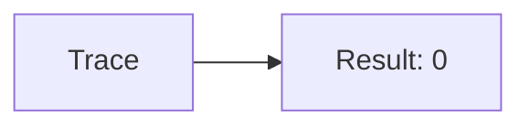
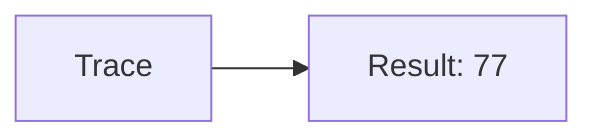
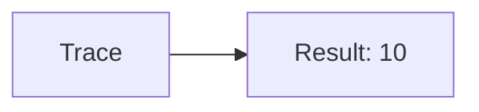
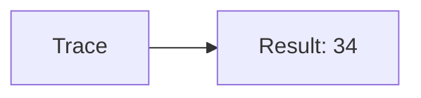

🔙 **[Kembali ke Daftar Soal](./README.md)**

---

# Latihan Soal Part C - Modul 04 - Set 12

### Soal 276
```cpp
// Gps: Pass-by-Reference
void reset(int &x) { x = 0; }
// main: int gps=29;
reset(gps);
```
**Pertanyaan:**
1. Berapakah hasil akhirnya?
2. Deskripsikan alur pikir 'Compiler Manusia' untuk soal ini!

**Jawaban & Diagnosis:**
1. **0**
2. Reference '&' dikirim alamat aslinya. 'Gps' ter-reset jadi 0.

**Mermaid Flowchart:**


---
### Soal 277
```cpp
// Sms: Pass-by-Value
void ubah(int x) { x = 0; }
// main: int sms=29;
ubah(sms);
```
**Pertanyaan:**
1. Berapakah hasil akhirnya?
2. Deskripsikan alur pikir 'Compiler Manusia' untuk soal ini!

**Jawaban & Diagnosis:**
1. **29**
2. Value 'Sms' dikirim fotokopinya. Aslinya tetap 29.

**Mermaid Flowchart:**


---
### Soal 278
```cpp
// Call: Pass-by-Reference
void reset(int &x) { x = 0; }
// main: int call=88;
reset(call);
```
**Pertanyaan:**
1. Berapakah hasil akhirnya?
2. Deskripsikan alur pikir 'Compiler Manusia' untuk soal ini!

**Jawaban & Diagnosis:**
1. **0**
2. Reference '&' dikirim alamat aslinya. 'Call' ter-reset jadi 0.

**Mermaid Flowchart:**


---
### Soal 279
```cpp
// Mail: Pass-by-Value
void ubah(int x) { x = 0; }
// main: int mail=79;
ubah(mail);
```
**Pertanyaan:**
1. Berapakah hasil akhirnya?
2. Deskripsikan alur pikir 'Compiler Manusia' untuk soal ini!

**Jawaban & Diagnosis:**
1. **79**
2. Value 'Mail' dikirim fotokopinya. Aslinya tetap 79.

**Mermaid Flowchart:**


---
### Soal 280
```cpp
// Chat: Pass-by-Reference
void reset(int &x) { x = 0; }
// main: int chat=47;
reset(chat);
```
**Pertanyaan:**
1. Berapakah hasil akhirnya?
2. Deskripsikan alur pikir 'Compiler Manusia' untuk soal ini!

**Jawaban & Diagnosis:**
1. **0**
2. Reference '&' dikirim alamat aslinya. 'Chat' ter-reset jadi 0.

**Mermaid Flowchart:**


---
### Soal 281
```cpp
// Video: Pass-by-Value
void ubah(int x) { x = 0; }
// main: int video=20;
ubah(video);
```
**Pertanyaan:**
1. Berapakah hasil akhirnya?
2. Deskripsikan alur pikir 'Compiler Manusia' untuk soal ini!

**Jawaban & Diagnosis:**
1. **20**
2. Value 'Video' dikirim fotokopinya. Aslinya tetap 20.

**Mermaid Flowchart:**


---
### Soal 282
```cpp
// Photo: Pass-by-Reference
void reset(int &x) { x = 0; }
// main: int photo=43;
reset(photo);
```
**Pertanyaan:**
1. Berapakah hasil akhirnya?
2. Deskripsikan alur pikir 'Compiler Manusia' untuk soal ini!

**Jawaban & Diagnosis:**
1. **0**
2. Reference '&' dikirim alamat aslinya. 'Photo' ter-reset jadi 0.

**Mermaid Flowchart:**


---
### Soal 283
```cpp
// Audio: Pass-by-Value
void ubah(int x) { x = 0; }
// main: int audio=77;
ubah(audio);
```
**Pertanyaan:**
1. Berapakah hasil akhirnya?
2. Deskripsikan alur pikir 'Compiler Manusia' untuk soal ini!

**Jawaban & Diagnosis:**
1. **77**
2. Value 'Audio' dikirim fotokopinya. Aslinya tetap 77.

**Mermaid Flowchart:**


---
### Soal 284
```cpp
// Music: Pass-by-Reference
void reset(int &x) { x = 0; }
// main: int music=15;
reset(music);
```
**Pertanyaan:**
1. Berapakah hasil akhirnya?
2. Deskripsikan alur pikir 'Compiler Manusia' untuk soal ini!

**Jawaban & Diagnosis:**
1. **0**
2. Reference '&' dikirim alamat aslinya. 'Music' ter-reset jadi 0.

**Mermaid Flowchart:**


---
### Soal 285
```cpp
// Movie: Pass-by-Value
void ubah(int x) { x = 0; }
// main: int movie=99;
ubah(movie);
```
**Pertanyaan:**
1. Berapakah hasil akhirnya?
2. Deskripsikan alur pikir 'Compiler Manusia' untuk soal ini!

**Jawaban & Diagnosis:**
1. **99**
2. Value 'Movie' dikirim fotokopinya. Aslinya tetap 99.

**Mermaid Flowchart:**


---
### Soal 286
```cpp
// Game: Pass-by-Reference
void reset(int &x) { x = 0; }
// main: int game=48;
reset(game);
```
**Pertanyaan:**
1. Berapakah hasil akhirnya?
2. Deskripsikan alur pikir 'Compiler Manusia' untuk soal ini!

**Jawaban & Diagnosis:**
1. **0**
2. Reference '&' dikirim alamat aslinya. 'Game' ter-reset jadi 0.

**Mermaid Flowchart:**


---
### Soal 287
```cpp
// App: Pass-by-Value
void ubah(int x) { x = 0; }
// main: int app=18;
ubah(app);
```
**Pertanyaan:**
1. Berapakah hasil akhirnya?
2. Deskripsikan alur pikir 'Compiler Manusia' untuk soal ini!

**Jawaban & Diagnosis:**
1. **18**
2. Value 'App' dikirim fotokopinya. Aslinya tetap 18.

**Mermaid Flowchart:**


---
### Soal 288
```cpp
// Web: Pass-by-Reference
void reset(int &x) { x = 0; }
// main: int web=94;
reset(web);
```
**Pertanyaan:**
1. Berapakah hasil akhirnya?
2. Deskripsikan alur pikir 'Compiler Manusia' untuk soal ini!

**Jawaban & Diagnosis:**
1. **0**
2. Reference '&' dikirim alamat aslinya. 'Web' ter-reset jadi 0.

**Mermaid Flowchart:**


---
### Soal 289
```cpp
// Cloud: Pass-by-Value
void ubah(int x) { x = 0; }
// main: int cloud=63;
ubah(cloud);
```
**Pertanyaan:**
1. Berapakah hasil akhirnya?
2. Deskripsikan alur pikir 'Compiler Manusia' untuk soal ini!

**Jawaban & Diagnosis:**
1. **63**
2. Value 'Cloud' dikirim fotokopinya. Aslinya tetap 63.

**Mermaid Flowchart:**


---
### Soal 290
```cpp
// Ssh: Pass-by-Reference
void reset(int &x) { x = 0; }
// main: int ssh=97;
reset(ssh);
```
**Pertanyaan:**
1. Berapakah hasil akhirnya?
2. Deskripsikan alur pikir 'Compiler Manusia' untuk soal ini!

**Jawaban & Diagnosis:**
1. **0**
2. Reference '&' dikirim alamat aslinya. 'Ssh' ter-reset jadi 0.

**Mermaid Flowchart:**


---
### Soal 291
```cpp
// Ftp: Pass-by-Value
void ubah(int x) { x = 0; }
// main: int ftp=64;
ubah(ftp);
```
**Pertanyaan:**
1. Berapakah hasil akhirnya?
2. Deskripsikan alur pikir 'Compiler Manusia' untuk soal ini!

**Jawaban & Diagnosis:**
1. **64**
2. Value 'Ftp' dikirim fotokopinya. Aslinya tetap 64.

**Mermaid Flowchart:**


---
### Soal 292
```cpp
// Http: Pass-by-Reference
void reset(int &x) { x = 0; }
// main: int http=42;
reset(http);
```
**Pertanyaan:**
1. Berapakah hasil akhirnya?
2. Deskripsikan alur pikir 'Compiler Manusia' untuk soal ini!

**Jawaban & Diagnosis:**
1. **0**
2. Reference '&' dikirim alamat aslinya. 'Http' ter-reset jadi 0.

**Mermaid Flowchart:**


---
### Soal 293
```cpp
// Tcp: Pass-by-Value
void ubah(int x) { x = 0; }
// main: int tcp=10;
ubah(tcp);
```
**Pertanyaan:**
1. Berapakah hasil akhirnya?
2. Deskripsikan alur pikir 'Compiler Manusia' untuk soal ini!

**Jawaban & Diagnosis:**
1. **10**
2. Value 'Tcp' dikirim fotokopinya. Aslinya tetap 10.

**Mermaid Flowchart:**


---
### Soal 294
```cpp
// Udp: Pass-by-Reference
void reset(int &x) { x = 0; }
// main: int udp=30;
reset(udp);
```
**Pertanyaan:**
1. Berapakah hasil akhirnya?
2. Deskripsikan alur pikir 'Compiler Manusia' untuk soal ini!

**Jawaban & Diagnosis:**
1. **0**
2. Reference '&' dikirim alamat aslinya. 'Udp' ter-reset jadi 0.

**Mermaid Flowchart:**


---
### Soal 295
```cpp
// Icmp: Pass-by-Value
void ubah(int x) { x = 0; }
// main: int icmp=34;
ubah(icmp);
```
**Pertanyaan:**
1. Berapakah hasil akhirnya?
2. Deskripsikan alur pikir 'Compiler Manusia' untuk soal ini!

**Jawaban & Diagnosis:**
1. **34**
2. Value 'Icmp' dikirim fotokopinya. Aslinya tetap 34.

**Mermaid Flowchart:**


---
### Soal 296
```cpp
// Arp: Pass-by-Reference
void reset(int &x) { x = 0; }
// main: int arp=83;
reset(arp);
```
**Pertanyaan:**
1. Berapakah hasil akhirnya?
2. Deskripsikan alur pikir 'Compiler Manusia' untuk soal ini!

**Jawaban & Diagnosis:**
1. **0**
2. Reference '&' dikirim alamat aslinya. 'Arp' ter-reset jadi 0.

**Mermaid Flowchart:**
```mermaid
graph LR
A[Trace] --> B[Result: 0]
```

---
### Soal 297
```cpp
// Dns: Pass-by-Value
void ubah(int x) { x = 0; }
// main: int dns=38;
ubah(dns);
```
**Pertanyaan:**
1. Berapakah hasil akhirnya?
2. Deskripsikan alur pikir 'Compiler Manusia' untuk soal ini!

**Jawaban & Diagnosis:**
1. **38**
2. Value 'Dns' dikirim fotokopinya. Aslinya tetap 38.

**Mermaid Flowchart:**
```mermaid
graph LR
A[Trace] --> B[Result: 38]
```

---
### Soal 298
```cpp
// Dhcp: Pass-by-Reference
void reset(int &x) { x = 0; }
// main: int dhcp=63;
reset(dhcp);
```
**Pertanyaan:**
1. Berapakah hasil akhirnya?
2. Deskripsikan alur pikir 'Compiler Manusia' untuk soal ini!

**Jawaban & Diagnosis:**
1. **0**
2. Reference '&' dikirim alamat aslinya. 'Dhcp' ter-reset jadi 0.

**Mermaid Flowchart:**
```mermaid
graph LR
A[Trace] --> B[Result: 0]
```

---
### Soal 299
```cpp
// Nat: Pass-by-Value
void ubah(int x) { x = 0; }
// main: int nat=99;
ubah(nat);
```
**Pertanyaan:**
1. Berapakah hasil akhirnya?
2. Deskripsikan alur pikir 'Compiler Manusia' untuk soal ini!

**Jawaban & Diagnosis:**
1. **99**
2. Value 'Nat' dikirim fotokopinya. Aslinya tetap 99.

**Mermaid Flowchart:**
```mermaid
graph LR
A[Trace] --> B[Result: 99]
```

---
### Soal 300
```cpp
// Vpn: Pass-by-Reference
void reset(int &x) { x = 0; }
// main: int vpn=49;
reset(vpn);
```
**Pertanyaan:**
1. Berapakah hasil akhirnya?
2. Deskripsikan alur pikir 'Compiler Manusia' untuk soal ini!

**Jawaban & Diagnosis:**
1. **0**
2. Reference '&' dikirim alamat aslinya. 'Vpn' ter-reset jadi 0.

**Mermaid Flowchart:**
```mermaid
graph LR
A[Trace] --> B[Result: 0]
```

---
