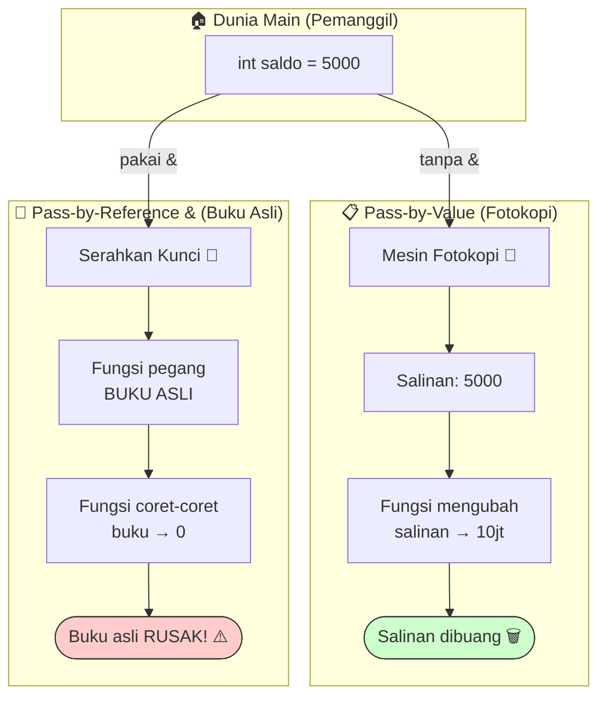

# 4. Fungsi C++ & Trik Transfer Parameter (Ilmu Nyontek Buku PR)

Kodingan tipe data berbaris ke bawah sudah mulai gampang dilacak. Sayangnya, pembuat soal OSN-K level Nasional enggan memberi celah kemudahan. 
Mereka akan melebar, membelah logika program menjadi berlembar-lembar kotak terpisah yang disebut dengan **FUNGSI (`void, int, dll`)**.

Di tahap ini, kemampuan matamu bergeser: Melacak bukan saja nilai bilangannya, tapi *siapa melempar nilai ke siapa*, dan **APAKAH NILAI TERSEBUT MURNI DISALIN ATAU DIIKAT BENANG GAIB?**


**📖 Cara Membaca Diagram "*Value vs Reference*":**
- **Jalur Kiri (Hijau/Aman):** Saat parameter TANPA simbol `&`, mesin C++ memfotokopi nilai lalu melempar salinannya ke fungsi. Apapun yang terjadi pada salinan (diubah, dihapus), **variabel asli di `main` tetap aman sentosa**.
- **Jalur Kanan (Merah/Bahaya):** Saat parameter PAKAI simbol `&`, mesin menyerahkan kunci brankas asli! Fungsi langsung memegang benda nyata. Setiap coretan di dalam fungsi **menembus balik ke variabel asli** di `main`.
- Kunci OSN-K: Selalu periksa ada atau tidaknya simbol `&` di parameter fungsi sebelum mulai tracing!


---

### 📝 Latihan Soal Tracing
Sudah paham teorinya? Uji ketajaman matamu di sini:
👉 **[Bank Soal Modul 04: Fungsi (300 Soal)](./latihan/README.md)**

---

## 🖨️ A. Pass By Value (Trik Pemalasan Nyontek Fotokopi)

C++ itu egois. Di titik ia dipanggil menyerahkan sebuah fungsi/nilainya (*Passing Paramater*), C++ secara takdir *Default-nya* akan **MELEMPARKAN FOTOKOPI MURNINYA**!

**Analogi Nyontek Tugas:**
Pak Dengklek minta tolong Pak RT (*sebuah Fungsi* `int Pak_RT(int uang)`) untuk mengubah saldonya menjadi 10 Juta Rupiah. Pak Dengklek melempar nilainya dari kampung `main`.

```cpp
void Pak_RT(int uang) {
    uang = 10000000;      // Pak RT merombak saldo jadi 10 Juta
    printf("Saldo RT: %d\n", uang); 
}

int main() {
    int saldo_asli = 5000;
    Pak_RT(saldo_asli);  // Memanggil RT
    printf("Saldo Asli: %d\n", saldo_asli);
}
```

Bagi Compiler Manusia OSN:
- Pak Dengklek memiliki Dompet Asli (Berisi 5000 Rupiah).
- Juri memanggil `Pak_RT(saldo_asli)`.
- Karena sistem C++ mematuhi hukum pelit **(Pass-By-Value)**: Pak Dengklek **TIDAK MAU** menyerahkan dompetnya yang asli! Beliau pergi ke tukang fotokopi, memfotokopi tulisan uang "5000 Rupiah", dan melempar kertas fotokopian murahan itu kepada fungsi `Pak_RT`!
- Fungsi `Pak_RT` menerima kertas fotokopian itu. Pak RT tersenyum iblis, mengambil spidol hitam, mencoret kertas fotokopian itu lalu menuliskan angka `10000000`. (Cetakan pertama `Saldo RT: 10000000`).
- Pertanyaan emas OSN-K: *Berapakah nasib uang dompet Pak Dengklek pas pulang ke fungsi Main?*
- Jawabannya: **Saldomu masih 5000 Rupiah Asli!!** Fotokopian yang dirobek RT tadi enggak berpengaruh sama barang aslinya di rute kehidupan nyata. Paham ya esensi *Pass-by-Value*?

---

## 🔗 B. Pass by Reference Memakai Simbol `&` (Ilmu Tip-Ex Gaib BUKU ASLI)

Kadang OSN-K suka membakar kewarasanmu dengan tanda gaib simbol Amperstand **`&`** di antara lekukan pemanggil fungsinya. Simbol ini artinya **Pass-By-Reference**.

**Analogi Nyontek Extrem:**
> Simbol `&` adalah bahasa roh C++ yang memerintahkan komputermu: *"Hei, jangan difotokopi! Berikaaaaaaan KUNCI BRANKASNYA! Serahkan barang aslinya 100%!"*

```cpp
void Pak_Preman(int &uang_rakyat) { // INGAT, ADA TANDA KUTUKAN '&'
    uang_rakyat = 0;              // Habis tak tersisa dirampok!
}

int main() {
    int dompet = 500000;
    Pak_Preman(dompet);           // Preman dipanggil.
    printf("Sisa: %d", dompet);
}
```

**Tracing Compiler Manusia-mu:**
- Pak Dengklek punya Dompet asli `500000`.
- Memanggil `Pak_Preman(dompet)`.
- Eh, fungsi `Pak_Preman` ternyata dibekali pisau kutukan **`&uang_rakyat`**. Artinya, fungsi ini dipastikan menculik/menarik/meminjam wujud fisik sesungguhnya milik sang `dompet` pemanggil! (Bukan fotokopian!).
- Di dalam markas Preman, dia menyilet/merampok isinya `uang_rakyat = 0`.
- Karena dompet preman itu sesungguhnya adalah benang gaib dari dompet Pak Dengklek... maka di saat pulang ke bumi (kembali ke `main`), dompet Pak Dengklek ikutan lenyap mendadak dan tersisa `0` rupiah tanpa sisa!! Sangat sadis!

*(Bila ada segerombolan pertanyaan panjang di kertas OSN-K mu yang bermain parameter masuk dan keluar... pastikan mata banting menyoroti celah simbol `&`, karena sekali kamu kelewatan titik gaib ini, seluruh perhitungan matematismu ke bawah akan hangus salah semua).*

---

## 🦖 C. Jebakan Batman: Parameter Vector & String
 
 Ini adalah jebakan maut di OSN-K Nasional (seperti soal **OSNK 2024**). 
 
 Kamu mungkin tahu bahwa Array tradisional (`int A[]`) selalu dikirim pakai alamat asli (otomatis Reference). **TAPI, di C++, `std::vector` dan `std::string` secara default dikirim pakai Fotokopi (Value)!**
 
 ```cpp
 void rahasia(vector<int> v) { // TIDAK pakai &, berarti Fotokopi!
     v.push_back(100);
 }
 
 int main() {
     vector<int> v = {1, 2, 3};
     rahasia(v);
     cout << v.size(); // Tetap 3!
 }
 ```
 
 > [!CAUTION]
 > **Hati-hati:** Jika kamu melihat fungsi yang menerima `vector<int> V` (tanpa tanda `&`), berapapun banyak kamu `push_back` atau `pop_back` di dalam fungsi itu, **Vector aslinya di `main` tidak akan berubah sama sekali!** Juri sangat suka menipu ketelitianmu di sini.
 
 ---
 
 ### Siap Di Uji Tracing?

Kamu ditunjuk menjadi Inspektur Fungsi C++ dengan soal maut berikut ini:

```cpp
void ilmu_hitam(int &a, int b) {
    a = a + b;
    b = a - b;
    a = a - b;
}

int main() {
    int x = 15;
    int y = 50;
    
    ilmu_hitam(x, y);
    
    printf("X=%d, Y=%d", x, y);
}
```

**Diagnosis Logika Papan Tulis Juri C++:**
- Fokus ke pendeteksi parameter gaib di atas: `int &a, int b`. 
- Parameter Kesatu (`a`): Terikat benang roh gaib `&`. Artinya, `a` ini murni merupakan alter-ego (tubuh pengganti) absolut dari `x` di dunia fana! Apapun yang terjadi pada tubuh `a` di langit, `x` akan menanggung pedihnya di bumi.
- Parameter Kedua (`b`): Pelit fotokopi biasa. Apa yang menimpa `b` disana, nggak akan ngaruh nyenggol tubuh suci `y`.

**Mulai Eksekusi:**
- *Snapshot Awal:* $A = 15$ (Gaib), $B = 50$ (Fotokopi).
- Baris 1: `a = a + b` $\rightarrow 15 + 50 = 65$. (Tubuh Gaib `a` jadi 65. *Realitas memudar: `x` di Bumi langsung tembus jadi 65*).
- Baris 2: `b = a - b` $\rightarrow 65 - 50 = 15$. (Tubuh Fotokopi `b` pindah megang angka 15).
- Baris 3: `a = a - b` $\rightarrow 65 - 15 = 50$. (Tubuh Gaib `a` dimutasi ulang memegang 50 aslinya). *Realitas memudar tajam: `x` di Bumi disilet tembus ulang menggenggam 50*.

**Laporan Kepulangan Main OSN-K:**
- Nilai `x` berubah ekstrem menjadi **$50$** karena tumbal ilmu gaib Reference `&a`.
- Nilai `y` berdiri pongah santai tak tersentuh abadi pada angka **$50$**, karena dia sekedar menyuplai kertas fotokopian murahan Pass-By-Value murni.

*(Tahukah kamu? Skrip sihir `a=a+b; b=a-b; a=a-b;` itu adalah mantra legendaris C++ di OSN-K yang menyajikan seni ilmu "Tukar Menukar Loker / Swapping" murni tanpa memakai loker variabel bantuan!).*

⏩ **Lanjut ke Modul Klimaks Kelima:** [Rekursi & Call Stack (Jejak Balik Anak Cucu ATM)](./05-rekursi-dan-call-stack.md)
