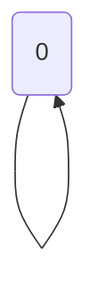

🔙 **[Kembali ke Daftar Soal](./README.md)**

---

# Latihan Soal Part C - Modul 05 - Set 01

### Soal 1
```cpp
int f(int n) {
  if(n==0) return 1;
  return 2 * f(n-1);
}
// f(3)
```
**Pertanyaan:**
1. Berapakah hasil akhirnya?
2. Mengapa demikian?

**Jawaban & Diagnosis:**
1. **8**
2. Lihat Tracing.

**Mermaid Flowchart:**


**📖 Penjelasan:**
**Langkah Tracing:**
1. Rekursi Power dengan n=3.
2. Hasil akhir: 8.

---
### Soal 2
```cpp
int f(int n) {
  if(n==0) return 1;
  return 2 * f(n-1);
}
// f(4)
```
**Pertanyaan:**
1. Berapakah hasil akhirnya?
2. Mengapa demikian?

**Jawaban & Diagnosis:**
1. **16**
2. Lihat Tracing.

**Mermaid Flowchart:**


**📖 Penjelasan:**
**Langkah Tracing:**
1. Rekursi Power dengan n=4.
2. Hasil akhir: 16.

---
### Soal 3
```cpp
int f(int n) {
  if(n==0) return 0;
  return n + f(n-1);
}
// f(2)
```
**Pertanyaan:**
1. Berapakah hasil akhirnya?
2. Mengapa demikian?

**Jawaban & Diagnosis:**
1. **3**
2. Lihat Tracing.

**Mermaid Flowchart:**


**📖 Penjelasan:**
**Langkah Tracing:**
1. Rekursi Sum dengan n=2.
2. Hasil akhir: 3.

---
### Soal 4
```cpp
int f(int n) {
  if(n==0) return 0;
  return n + f(n-1);
}
// f(5)
```
**Pertanyaan:**
1. Berapakah hasil akhirnya?
2. Mengapa demikian?

**Jawaban & Diagnosis:**
1. **15**
2. Lihat Tracing.

**Mermaid Flowchart:**


**📖 Penjelasan:**
**Langkah Tracing:**
1. Rekursi Sum dengan n=5.
2. Hasil akhir: 15.

---
### Soal 5
```cpp
int f(int n) {
  if(n==0) return 1;
  return 2 * f(n-1);
}
// f(4)
```
**Pertanyaan:**
1. Berapakah hasil akhirnya?
2. Mengapa demikian?

**Jawaban & Diagnosis:**
1. **16**
2. Lihat Tracing.

**Mermaid Flowchart:**


**📖 Penjelasan:**
**Langkah Tracing:**
1. Rekursi Power dengan n=4.
2. Hasil akhir: 16.

---
### Soal 6
```cpp
int f(int n) {
  if(n<=1) return 1;
  return n * f(n-1);
}
// f(2)
```
**Pertanyaan:**
1. Berapakah hasil akhirnya?
2. Mengapa demikian?

**Jawaban & Diagnosis:**
1. **2**
2. Lihat Tracing.

**Mermaid Flowchart:**


**📖 Penjelasan:**
**Langkah Tracing:**
1. Rekursi Fact dengan n=2.
2. Hasil akhir: 2.

---
### Soal 7
```cpp
int f(int n) {
  if(n==0) return 0;
  return n + f(n-1);
}
// f(2)
```
**Pertanyaan:**
1. Berapakah hasil akhirnya?
2. Mengapa demikian?

**Jawaban & Diagnosis:**
1. **3**
2. Lihat Tracing.

**Mermaid Flowchart:**


**📖 Penjelasan:**
**Langkah Tracing:**
1. Rekursi Sum dengan n=2.
2. Hasil akhir: 3.

---
### Soal 8
```cpp
int f(int n) {
  if(n<=1) return 1;
  return n * f(n-1);
}
// f(2)
```
**Pertanyaan:**
1. Berapakah hasil akhirnya?
2. Mengapa demikian?

**Jawaban & Diagnosis:**
1. **2**
2. Lihat Tracing.

**Mermaid Flowchart:**


**📖 Penjelasan:**
**Langkah Tracing:**
1. Rekursi Fact dengan n=2.
2. Hasil akhir: 2.

---
### Soal 9
```cpp
int f(int n) {
  if(n<=1) return 1;
  return n * f(n-1);
}
// f(4)
```
**Pertanyaan:**
1. Berapakah hasil akhirnya?
2. Mengapa demikian?

**Jawaban & Diagnosis:**
1. **24**
2. Lihat Tracing.

**Mermaid Flowchart:**


**📖 Penjelasan:**
**Langkah Tracing:**
1. Rekursi Fact dengan n=4.
2. Hasil akhir: 24.

---
### Soal 10
```cpp
int f(int n) {
  if(n<=1) return 1;
  return n * f(n-1);
}
// f(3)
```
**Pertanyaan:**
1. Berapakah hasil akhirnya?
2. Mengapa demikian?

**Jawaban & Diagnosis:**
1. **6**
2. Lihat Tracing.

**Mermaid Flowchart:**


**📖 Penjelasan:**
**Langkah Tracing:**
1. Rekursi Fact dengan n=3.
2. Hasil akhir: 6.

---
### Soal 11
```cpp
int f(int n) {
  if(n==0) return 0;
  return n + f(n-1);
}
// f(5)
```
**Pertanyaan:**
1. Berapakah hasil akhirnya?
2. Mengapa demikian?

**Jawaban & Diagnosis:**
1. **15**
2. Lihat Tracing.

**Mermaid Flowchart:**


**📖 Penjelasan:**
**Langkah Tracing:**
1. Rekursi Sum dengan n=5.
2. Hasil akhir: 15.

---
### Soal 12
```cpp
int f(int n) {
  if(n==0) return 1;
  return 2 * f(n-1);
}
// f(5)
```
**Pertanyaan:**
1. Berapakah hasil akhirnya?
2. Mengapa demikian?

**Jawaban & Diagnosis:**
1. **32**
2. Lihat Tracing.

**Mermaid Flowchart:**


**📖 Penjelasan:**
**Langkah Tracing:**
1. Rekursi Power dengan n=5.
2. Hasil akhir: 32.

---
### Soal 13
```cpp
int f(int n) {
  if(n==0) return 0;
  return n + f(n-1);
}
// f(4)
```
**Pertanyaan:**
1. Berapakah hasil akhirnya?
2. Mengapa demikian?

**Jawaban & Diagnosis:**
1. **10**
2. Lihat Tracing.

**Mermaid Flowchart:**


**📖 Penjelasan:**
**Langkah Tracing:**
1. Rekursi Sum dengan n=4.
2. Hasil akhir: 10.

---
### Soal 14
```cpp
int f(int n) {
  if(n==0) return 1;
  return 2 * f(n-1);
}
// f(5)
```
**Pertanyaan:**
1. Berapakah hasil akhirnya?
2. Mengapa demikian?

**Jawaban & Diagnosis:**
1. **32**
2. Lihat Tracing.

**Mermaid Flowchart:**


**📖 Penjelasan:**
**Langkah Tracing:**
1. Rekursi Power dengan n=5.
2. Hasil akhir: 32.

---
### Soal 15
```cpp
int f(int n) {
  if(n==0) return 0;
  return n + f(n-1);
}
// f(5)
```
**Pertanyaan:**
1. Berapakah hasil akhirnya?
2. Mengapa demikian?

**Jawaban & Diagnosis:**
1. **15**
2. Lihat Tracing.

**Mermaid Flowchart:**


**📖 Penjelasan:**
**Langkah Tracing:**
1. Rekursi Sum dengan n=5.
2. Hasil akhir: 15.

---
### Soal 16
```cpp
int f(int n) {
  if(n==0) return 0;
  return n + f(n-1);
}
// f(4)
```
**Pertanyaan:**
1. Berapakah hasil akhirnya?
2. Mengapa demikian?

**Jawaban & Diagnosis:**
1. **10**
2. Lihat Tracing.

**Mermaid Flowchart:**


**📖 Penjelasan:**
**Langkah Tracing:**
1. Rekursi Sum dengan n=4.
2. Hasil akhir: 10.

---
### Soal 17
```cpp
int f(int n) {
  if(n==0) return 1;
  return 2 * f(n-1);
}
// f(5)
```
**Pertanyaan:**
1. Berapakah hasil akhirnya?
2. Mengapa demikian?

**Jawaban & Diagnosis:**
1. **32**
2. Lihat Tracing.

**Mermaid Flowchart:**


**📖 Penjelasan:**
**Langkah Tracing:**
1. Rekursi Power dengan n=5.
2. Hasil akhir: 32.

---
### Soal 18
```cpp
int f(int n) {
  if(n==0) return 0;
  return n + f(n-1);
}
// f(4)
```
**Pertanyaan:**
1. Berapakah hasil akhirnya?
2. Mengapa demikian?

**Jawaban & Diagnosis:**
1. **10**
2. Lihat Tracing.

**Mermaid Flowchart:**


**📖 Penjelasan:**
**Langkah Tracing:**
1. Rekursi Sum dengan n=4.
2. Hasil akhir: 10.

---
### Soal 19
```cpp
int f(int n) {
  if(n==0) return 0;
  return n + f(n-1);
}
// f(4)
```
**Pertanyaan:**
1. Berapakah hasil akhirnya?
2. Mengapa demikian?

**Jawaban & Diagnosis:**
1. **10**
2. Lihat Tracing.

**Mermaid Flowchart:**


**📖 Penjelasan:**
**Langkah Tracing:**
1. Rekursi Sum dengan n=4.
2. Hasil akhir: 10.

---
### Soal 20
```cpp
int f(int n) {
  if(n==0) return 1;
  return 2 * f(n-1);
}
// f(5)
```
**Pertanyaan:**
1. Berapakah hasil akhirnya?
2. Mengapa demikian?

**Jawaban & Diagnosis:**
1. **32**
2. Lihat Tracing.

**Mermaid Flowchart:**


**📖 Penjelasan:**
**Langkah Tracing:**
1. Rekursi Power dengan n=5.
2. Hasil akhir: 32.

---
### Soal 21
```cpp
int f(int n) {
  if(n<=1) return 1;
  return n * f(n-1);
}
// f(3)
```
**Pertanyaan:**
1. Berapakah hasil akhirnya?
2. Mengapa demikian?

**Jawaban & Diagnosis:**
1. **6**
2. Lihat Tracing.

**Mermaid Flowchart:**
```mermaid
graph TD
f(3) --> f(2) --> f(1) --> f(0)
```

**📖 Penjelasan:**
**Langkah Tracing:**
1. Rekursi Fact dengan n=3.
2. Hasil akhir: 6.

---
### Soal 22
```cpp
int f(int n) {
  if(n==0) return 0;
  return n + f(n-1);
}
// f(3)
```
**Pertanyaan:**
1. Berapakah hasil akhirnya?
2. Mengapa demikian?

**Jawaban & Diagnosis:**
1. **6**
2. Lihat Tracing.

**Mermaid Flowchart:**
```mermaid
graph TD
f(3) --> f(2) --> f(1) --> f(0)
```

**📖 Penjelasan:**
**Langkah Tracing:**
1. Rekursi Sum dengan n=3.
2. Hasil akhir: 6.

---
### Soal 23
```cpp
int f(int n) {
  if(n==0) return 1;
  return 2 * f(n-1);
}
// f(4)
```
**Pertanyaan:**
1. Berapakah hasil akhirnya?
2. Mengapa demikian?

**Jawaban & Diagnosis:**
1. **16**
2. Lihat Tracing.

**Mermaid Flowchart:**
```mermaid
graph TD
f(4) --> f(3) --> f(2) --> f(1) --> f(0)
```

**📖 Penjelasan:**
**Langkah Tracing:**
1. Rekursi Power dengan n=4.
2. Hasil akhir: 16.

---
### Soal 24
```cpp
int f(int n) {
  if(n==0) return 0;
  return n + f(n-1);
}
// f(3)
```
**Pertanyaan:**
1. Berapakah hasil akhirnya?
2. Mengapa demikian?

**Jawaban & Diagnosis:**
1. **6**
2. Lihat Tracing.

**Mermaid Flowchart:**
```mermaid
graph TD
f(3) --> f(2) --> f(1) --> f(0)
```

**📖 Penjelasan:**
**Langkah Tracing:**
1. Rekursi Sum dengan n=3.
2. Hasil akhir: 6.

---
### Soal 25
```cpp
int f(int n) {
  if(n<=1) return 1;
  return n * f(n-1);
}
// f(5)
```
**Pertanyaan:**
1. Berapakah hasil akhirnya?
2. Mengapa demikian?

**Jawaban & Diagnosis:**
1. **120**
2. Lihat Tracing.

**Mermaid Flowchart:**
```mermaid
graph TD
f(5) --> f(4) --> f(3) --> f(2) --> f(1) --> f(0)
```

**📖 Penjelasan:**
**Langkah Tracing:**
1. Rekursi Fact dengan n=5.
2. Hasil akhir: 120.

---
