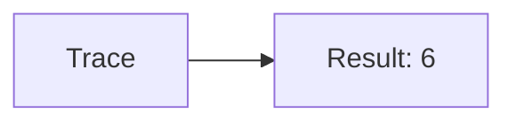
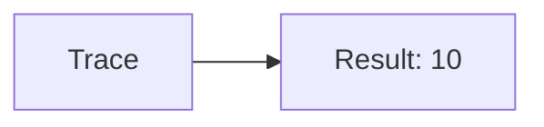
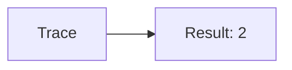

🔙 **[Kembali ke Daftar Soal](./README.md)**

---

# Latihan Soal Part C - Modul 05 - Set 01

### Soal 1
```cpp
// Faktorial: Faktorial
int f(int n) {
  if(n<=1) return 1;
  return n * f(n-1);
}
// f(4);
```
**Pertanyaan:**
1. Berapakah hasil akhirnya?
2. Deskripsikan alur pikir 'Compiler Manusia' untuk soal ini!

**Jawaban & Diagnosis:**
1. **24**
2. Faktorial dari 4 adalah 24.

**Mermaid Flowchart:**


---
### Soal 2
```cpp
// Tangga: Deret
int s(int n) {
  if(n==0) return 0;
  return n + s(n-1);
}
// s(2);
```
**Pertanyaan:**
1. Berapakah hasil akhirnya?
2. Deskripsikan alur pikir 'Compiler Manusia' untuk soal ini!

**Jawaban & Diagnosis:**
1. **3**
2. Jumlah deret 1 s/d 2 adalah 3.

**Mermaid Flowchart:**


---
### Soal 3
```cpp
// Pohon: Faktorial
int f(int n) {
  if(n<=1) return 1;
  return n * f(n-1);
}
// f(3);
```
**Pertanyaan:**
1. Berapakah hasil akhirnya?
2. Deskripsikan alur pikir 'Compiler Manusia' untuk soal ini!

**Jawaban & Diagnosis:**
1. **6**
2. Faktorial dari 3 adalah 6.

**Mermaid Flowchart:**


---
### Soal 4
```cpp
// Stack: Deret
int s(int n) {
  if(n==0) return 0;
  return n + s(n-1);
}
// s(2);
```
**Pertanyaan:**
1. Berapakah hasil akhirnya?
2. Deskripsikan alur pikir 'Compiler Manusia' untuk soal ini!

**Jawaban & Diagnosis:**
1. **3**
2. Jumlah deret 1 s/d 2 adalah 3.

**Mermaid Flowchart:**


---
### Soal 5
```cpp
// Antrian: Faktorial
int f(int n) {
  if(n<=1) return 1;
  return n * f(n-1);
}
// f(4);
```
**Pertanyaan:**
1. Berapakah hasil akhirnya?
2. Deskripsikan alur pikir 'Compiler Manusia' untuk soal ini!

**Jawaban & Diagnosis:**
1. **24**
2. Faktorial dari 4 adalah 24.

**Mermaid Flowchart:**


---
### Soal 6
```cpp
// Recursi: Deret
int s(int n) {
  if(n==0) return 0;
  return n + s(n-1);
}
// s(4);
```
**Pertanyaan:**
1. Berapakah hasil akhirnya?
2. Deskripsikan alur pikir 'Compiler Manusia' untuk soal ini!

**Jawaban & Diagnosis:**
1. **10**
2. Jumlah deret 1 s/d 4 adalah 10.

**Mermaid Flowchart:**


---
### Soal 7
```cpp
// Chain: Faktorial
int f(int n) {
  if(n<=1) return 1;
  return n * f(n-1);
}
// f(4);
```
**Pertanyaan:**
1. Berapakah hasil akhirnya?
2. Deskripsikan alur pikir 'Compiler Manusia' untuk soal ini!

**Jawaban & Diagnosis:**
1. **24**
2. Faktorial dari 4 adalah 24.

**Mermaid Flowchart:**


---
### Soal 8
```cpp
// LoopBack: Deret
int s(int n) {
  if(n==0) return 0;
  return n + s(n-1);
}
// s(4);
```
**Pertanyaan:**
1. Berapakah hasil akhirnya?
2. Deskripsikan alur pikir 'Compiler Manusia' untuk soal ini!

**Jawaban & Diagnosis:**
1. **10**
2. Jumlah deret 1 s/d 4 adalah 10.

**Mermaid Flowchart:**


---
### Soal 9
```cpp
// Mirror: Faktorial
int f(int n) {
  if(n<=1) return 1;
  return n * f(n-1);
}
// f(3);
```
**Pertanyaan:**
1. Berapakah hasil akhirnya?
2. Deskripsikan alur pikir 'Compiler Manusia' untuk soal ini!

**Jawaban & Diagnosis:**
1. **6**
2. Faktorial dari 3 adalah 6.

**Mermaid Flowchart:**


---
### Soal 10
```cpp
// Double: Deret
int s(int n) {
  if(n==0) return 0;
  return n + s(n-1);
}
// s(4);
```
**Pertanyaan:**
1. Berapakah hasil akhirnya?
2. Deskripsikan alur pikir 'Compiler Manusia' untuk soal ini!

**Jawaban & Diagnosis:**
1. **10**
2. Jumlah deret 1 s/d 4 adalah 10.

**Mermaid Flowchart:**


---
### Soal 11
```cpp
// Half: Faktorial
int f(int n) {
  if(n<=1) return 1;
  return n * f(n-1);
}
// f(3);
```
**Pertanyaan:**
1. Berapakah hasil akhirnya?
2. Deskripsikan alur pikir 'Compiler Manusia' untuk soal ini!

**Jawaban & Diagnosis:**
1. **6**
2. Faktorial dari 3 adalah 6.

**Mermaid Flowchart:**


---
### Soal 12
```cpp
// Split: Deret
int s(int n) {
  if(n==0) return 0;
  return n + s(n-1);
}
// s(2);
```
**Pertanyaan:**
1. Berapakah hasil akhirnya?
2. Deskripsikan alur pikir 'Compiler Manusia' untuk soal ini!

**Jawaban & Diagnosis:**
1. **3**
2. Jumlah deret 1 s/d 2 adalah 3.

**Mermaid Flowchart:**


---
### Soal 13
```cpp
// Merge: Faktorial
int f(int n) {
  if(n<=1) return 1;
  return n * f(n-1);
}
// f(2);
```
**Pertanyaan:**
1. Berapakah hasil akhirnya?
2. Deskripsikan alur pikir 'Compiler Manusia' untuk soal ini!

**Jawaban & Diagnosis:**
1. **2**
2. Faktorial dari 2 adalah 2.

**Mermaid Flowchart:**


---
### Soal 14
```cpp
// Sort: Deret
int s(int n) {
  if(n==0) return 0;
  return n + s(n-1);
}
// s(4);
```
**Pertanyaan:**
1. Berapakah hasil akhirnya?
2. Deskripsikan alur pikir 'Compiler Manusia' untuk soal ini!

**Jawaban & Diagnosis:**
1. **10**
2. Jumlah deret 1 s/d 4 adalah 10.

**Mermaid Flowchart:**


---
### Soal 15
```cpp
// Search: Faktorial
int f(int n) {
  if(n<=1) return 1;
  return n * f(n-1);
}
// f(2);
```
**Pertanyaan:**
1. Berapakah hasil akhirnya?
2. Deskripsikan alur pikir 'Compiler Manusia' untuk soal ini!

**Jawaban & Diagnosis:**
1. **2**
2. Faktorial dari 2 adalah 2.

**Mermaid Flowchart:**


---
### Soal 16
```cpp
// Find: Deret
int s(int n) {
  if(n==0) return 0;
  return n + s(n-1);
}
// s(2);
```
**Pertanyaan:**
1. Berapakah hasil akhirnya?
2. Deskripsikan alur pikir 'Compiler Manusia' untuk soal ini!

**Jawaban & Diagnosis:**
1. **3**
2. Jumlah deret 1 s/d 2 adalah 3.

**Mermaid Flowchart:**


---
### Soal 17
```cpp
// Path: Faktorial
int f(int n) {
  if(n<=1) return 1;
  return n * f(n-1);
}
// f(2);
```
**Pertanyaan:**
1. Berapakah hasil akhirnya?
2. Deskripsikan alur pikir 'Compiler Manusia' untuk soal ini!

**Jawaban & Diagnosis:**
1. **2**
2. Faktorial dari 2 adalah 2.

**Mermaid Flowchart:**


---
### Soal 18
```cpp
// Node: Deret
int s(int n) {
  if(n==0) return 0;
  return n + s(n-1);
}
// s(4);
```
**Pertanyaan:**
1. Berapakah hasil akhirnya?
2. Deskripsikan alur pikir 'Compiler Manusia' untuk soal ini!

**Jawaban & Diagnosis:**
1. **10**
2. Jumlah deret 1 s/d 4 adalah 10.

**Mermaid Flowchart:**


---
### Soal 19
```cpp
// Edge: Faktorial
int f(int n) {
  if(n<=1) return 1;
  return n * f(n-1);
}
// f(3);
```
**Pertanyaan:**
1. Berapakah hasil akhirnya?
2. Deskripsikan alur pikir 'Compiler Manusia' untuk soal ini!

**Jawaban & Diagnosis:**
1. **6**
2. Faktorial dari 3 adalah 6.

**Mermaid Flowchart:**


---
### Soal 20
```cpp
// Graph: Deret
int s(int n) {
  if(n==0) return 0;
  return n + s(n-1);
}
// s(3);
```
**Pertanyaan:**
1. Berapakah hasil akhirnya?
2. Deskripsikan alur pikir 'Compiler Manusia' untuk soal ini!

**Jawaban & Diagnosis:**
1. **6**
2. Jumlah deret 1 s/d 3 adalah 6.

**Mermaid Flowchart:**


---
### Soal 21
```cpp
// Tree: Faktorial
int f(int n) {
  if(n<=1) return 1;
  return n * f(n-1);
}
// f(4);
```
**Pertanyaan:**
1. Berapakah hasil akhirnya?
2. Deskripsikan alur pikir 'Compiler Manusia' untuk soal ini!

**Jawaban & Diagnosis:**
1. **24**
2. Faktorial dari 4 adalah 24.

**Mermaid Flowchart:**
```mermaid
graph LR
A[Trace] --> B[Result: 24]
```

---
### Soal 22
```cpp
// List: Deret
int s(int n) {
  if(n==0) return 0;
  return n + s(n-1);
}
// s(3);
```
**Pertanyaan:**
1. Berapakah hasil akhirnya?
2. Deskripsikan alur pikir 'Compiler Manusia' untuk soal ini!

**Jawaban & Diagnosis:**
1. **6**
2. Jumlah deret 1 s/d 3 adalah 6.

**Mermaid Flowchart:**
```mermaid
graph LR
A[Trace] --> B[Result: 6]
```

---
### Soal 23
```cpp
// Array: Faktorial
int f(int n) {
  if(n<=1) return 1;
  return n * f(n-1);
}
// f(3);
```
**Pertanyaan:**
1. Berapakah hasil akhirnya?
2. Deskripsikan alur pikir 'Compiler Manusia' untuk soal ini!

**Jawaban & Diagnosis:**
1. **6**
2. Faktorial dari 3 adalah 6.

**Mermaid Flowchart:**
```mermaid
graph LR
A[Trace] --> B[Result: 6]
```

---
### Soal 24
```cpp
// Map: Deret
int s(int n) {
  if(n==0) return 0;
  return n + s(n-1);
}
// s(3);
```
**Pertanyaan:**
1. Berapakah hasil akhirnya?
2. Deskripsikan alur pikir 'Compiler Manusia' untuk soal ini!

**Jawaban & Diagnosis:**
1. **6**
2. Jumlah deret 1 s/d 3 adalah 6.

**Mermaid Flowchart:**
```mermaid
graph LR
A[Trace] --> B[Result: 6]
```

---
### Soal 25
```cpp
// Set: Faktorial
int f(int n) {
  if(n<=1) return 1;
  return n * f(n-1);
}
// f(4);
```
**Pertanyaan:**
1. Berapakah hasil akhirnya?
2. Deskripsikan alur pikir 'Compiler Manusia' untuk soal ini!

**Jawaban & Diagnosis:**
1. **24**
2. Faktorial dari 4 adalah 24.

**Mermaid Flowchart:**
```mermaid
graph LR
A[Trace] --> B[Result: 24]
```

---
