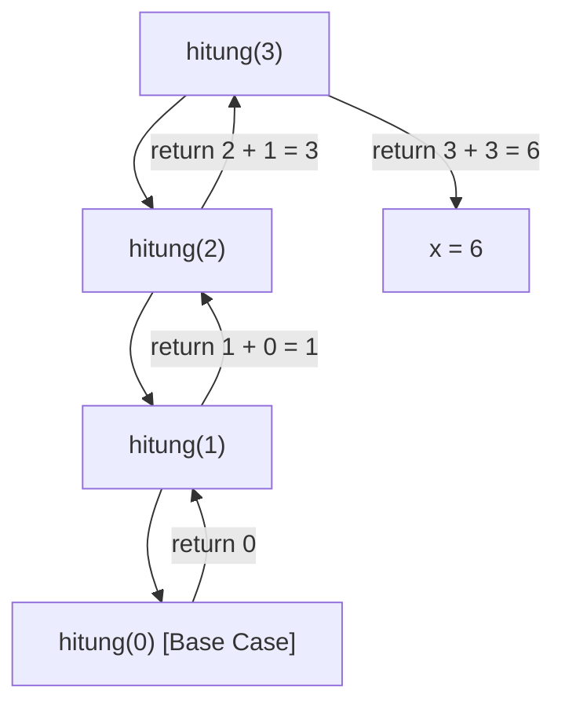
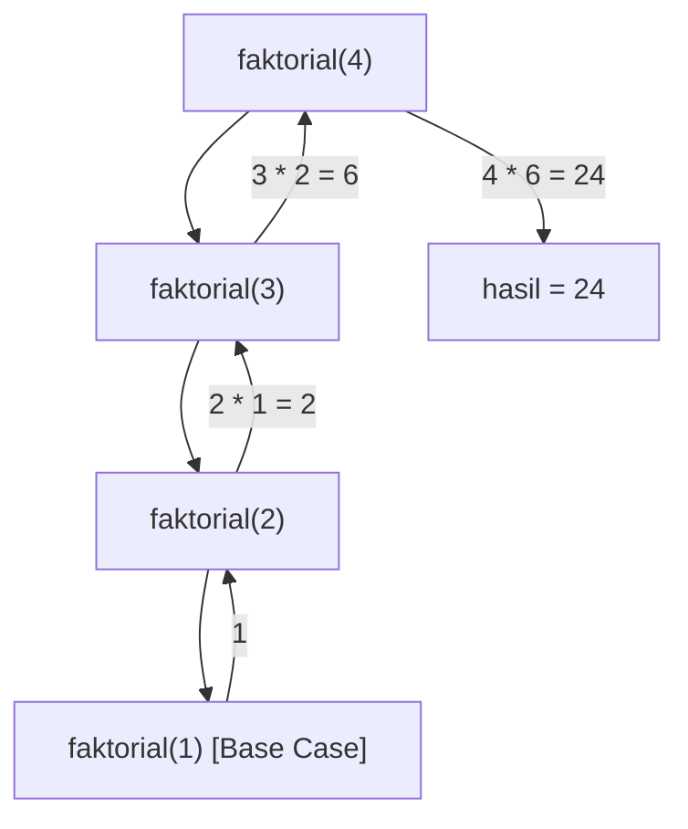
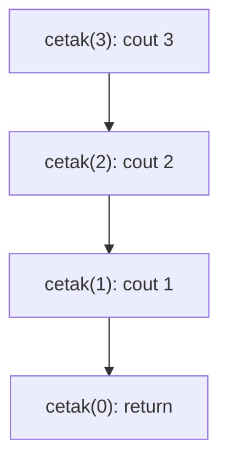
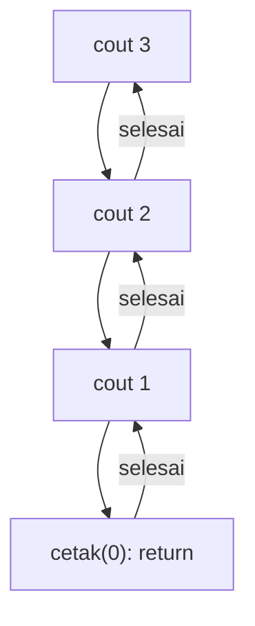
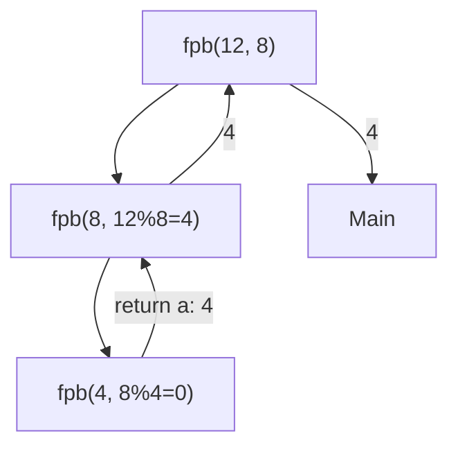
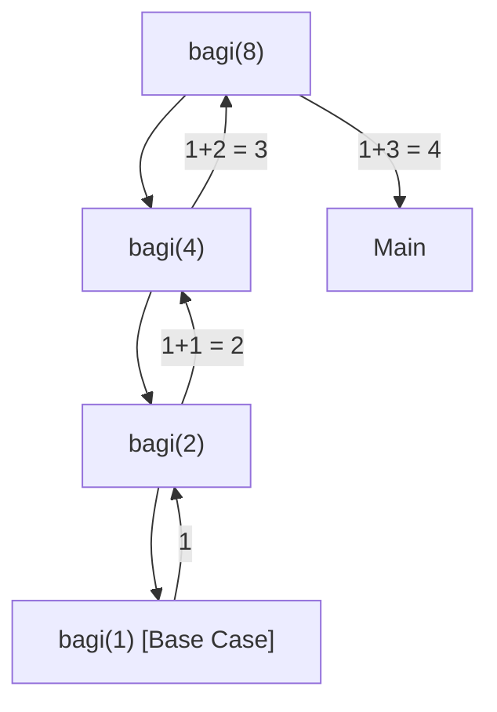
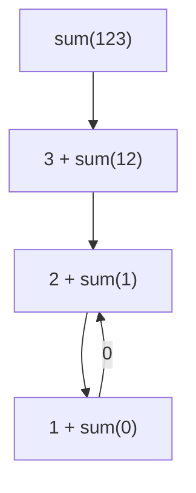
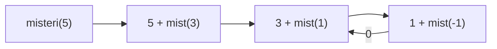
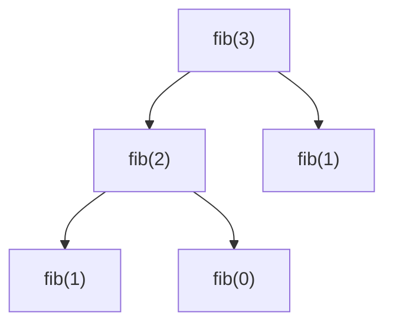

		🔙 **[Kembali ke Daftar Soal](./README.md)**

---

# Latihan Soal Part C - Modul 05 - Set 01 (Premium Edition)

> [!IMPORTANT]
> Dalam Rekursi, perhatikan dua hal: **Base Case** (kapan berhenti) dan **Recursive Step** (kapan memanggil diri sendiri). Jangan sampai lupas Base Case atau kamu akan terkena *Stack Overflow*!

---

### Soal 1: Penjumlahan Berantai (Sum Recursion)
```cpp
int hitung(int n) {
    if (n == 0) return 0;
    return n + hitung(n - 1);
}

int main() {
    int x = hitung(3);
}
```
**Pertanyaan:**
1. Berapakah nilai `x`?
2. Berapa kali fungsi `hitung` dipanggil secara total (termasuk panggilan awal)?

<details>
<summary><b>Klik untuk Lihat Jawaban & Diagnosis</b></summary>

**Mermaid Call Stack:**


**Jawaban:**
1. **6** (3 + 2 + 1 + 0)
2. **4 kali** (panggilan untuk n=3, 2, 1, dan 0).
</details>

---

### Soal 2: Faktorial Sederhana (Factorial Trace)
```cpp
int faktorial(int n) {
    if (n <= 1) return 1;
    return n * faktorial(n - 1);
}

int main() {
    int hasil = faktorial(4);
}
```
**Pertanyaan:**
1. Berapakah nilai `hasil`?
2. Apa yang dikembalikan oleh `faktorial(1)`?

<details>
<summary><b>Klik untuk Lihat Jawaban & Diagnosis</b></summary>

**Mermaid Call Stack:**


**Jawaban:**
1. **24** (4 * 3 * 2 * 1)
2. **1**
</details>

---

### Soal 3: Urutan Cetak A (Pre-order Print)
```cpp
void cetak(int n) {
    if (n < 1) return;
    cout << n;
    cetak(n - 1);
}

int main() {
    cetak(3);
}
```
**Pertanyaan:**
1. Apa output program tersebut?
2. Apakah `cout` dijalankan **sebelum** atau **sesudah** fungsi memanggil dirinya sendiri?

<details>
<summary><b>Klik untuk Lihat Jawaban & Diagnosis</b></summary>

**Mermaid Call Stack:**


**Jawaban:**
1. **321**
2. **Sebelum.** Karena `cout` berada di atas baris `cetak(n-1)`. Ini disebut *Pre-order traversal* dalam rekursi.
</details>

---

### Soal 4: Urutan Cetak B (Post-order Print)
```cpp
void cetak(int n) {
    if (n < 1) return;
    cetak(n - 1);
    cout << n;
}

int main() {
    cetak(3);
}
```
**Pertanyaan:**
1. Apa output program tersebut?
2. Mengapa outputnya terbalik dibanding Soal 3?

<details>
<summary><b>Klik untuk Lihat Jawaban & Diagnosis</b></summary>

**Mermaid Call Stack:**


**Jawaban:**
1. **123**
2. Karena `cout` berada **di bawah** panggilan rekursif. Program "masuk" dulu sampai ke dasar (n=0), baru saat perjalanan "pulang" (backtracking), ia mencetak angkanya.
</details>

---

### Soal 5: Kelipatan Dua (Power of 2)
```cpp
int dua_pangkat(int n) {
    if (n == 0) return 1;
    return 2 * dua_pangkat(n - 1);
}

int main() {
    int x = dua_pangkat(3);
}
```
**Pertanyaan:**
1. Berapakah nilai `x`?
2. Berapa nilai yang dikembalikan saat `n = 0`?

<details>
<summary><b>Klik untuk Lihat Jawaban & Diagnosis</b></summary>

**Jawaban:**
1. **8** ($2 \times 2 \times 2 \times 1$)
2. **1**
</details>

---

### Soal 6: Pencari FPB (Recursive GCD)
```cpp
int fpb(int a, int b) {
    if (b == 0) return a;
    return fpb(b, a % b);
}

int main() {
    int hasil = fpb(12, 8);
}
```
**Pertanyaan:**
1. Berapakah nilai `hasil`?
2. Bagaimana urutan parameter `(a, b)` pada panggilan kedua?

<details>
<summary><b>Klik untuk Lihat Jawaban & Diagnosis</b></summary>

**Mermaid Call Stack:**


**Jawaban:**
1. **4**
2. **(8, 4)**
</details>

---

### Soal 7: Pembagi Dua (Logarithmic Stack)
```cpp
int bagi(int n) {
    if (n <= 1) return 1;
    return 1 + bagi(n / 2);
}

int main() {
    int x = bagi(8);
}
```
**Pertanyaan:**
1. Berapakah nilai `x`?
2. Berapa kali fungsi ini memanggil dirinya sendiri (tidak termasuk main)?

<details>
<summary><b>Klik untuk Lihat Jawaban & Diagnosis</b></summary>

**Mermaid Call Stack:**


**Jawaban:**
1. **4**
2. **3 kali** (bagi 4, 2, dan 1).
</details>

---

### Soal 8: Jumlah Digit (Digit Sum)
```cpp
int sum_digit(int n) {
    if (n == 0) return 0;
    return (n % 10) + sum_digit(n / 10);
}

int main() {
    int s = sum_digit(123);
}
```
**Pertanyaan:**
1. Berapakah nilai `s`?
2. Apa peran `n / 10` dalam rekursi di atas?

<details>
<summary><b>Klik untuk Lihat Jawaban & Diagnosis</b></summary>

**Mermaid Call Stack:**


**Jawaban:**
1. **6** (3 + 2 + 1 + 0)
2. Untuk **membuang digit terakhir** sehingga angka menjadi semakin kecil dan akhirnya mencapai 0 (Base Case).
</details>

---

### Soal 9: Misteri Parameter (Static Trap?)
```cpp
int misteri(int n) {
    if (n <= 0) return 0;
    return n + misteri(n - 2);
}

int main() {
    int x = misteri(5);
}
```
**Pertanyaan:**
1. Berapakah nilai `x`?
2. Apakah fungsi ini akan pernah memanggil `misteri(0)`?

<details>
<summary><b>Klik untuk Lihat Jawaban & Diagnosis</b></summary>

**Mermaid Call Stack:**


**Jawaban:**
1. **9** (5 + 3 + 1 + 0)
2. **Tidak.** Dari 1 langsung melompat ke -1 karena `n - 2`. Namun karena kondisinya `n <= 0`, maka `misteri(-1)` tetap mengembalikan 0 dan berhenti.
</details>

---

### Soal 10: Fibonacci Mini (Tree Intro)
```cpp
int fib(int n) {
    if (n <= 1) return n;
    return fib(n-1) + fib(n-2);
}

int main() {
    int hasil = fib(3);
}
```
**Pertanyaan:**
1. Berapakah nilai `hasil`?
2. Berapa kali `fib(1)` dipanggil dalam proses ini?

<details>
<summary><b>Klik untuk Lihat Jawaban & Diagnosis</b></summary>

**Mermaid Tree Trace:**


**Jawaban:**
1. **2**
2. **2 kali.** (Sekali dari fib(3) dan sekali dari fib(2)).
</details>
