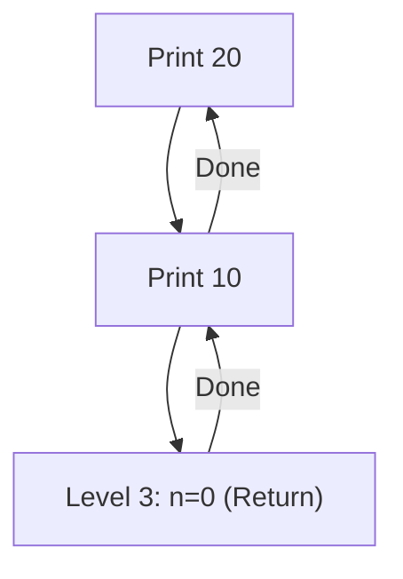
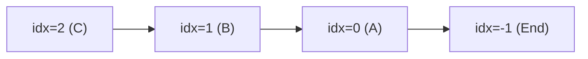
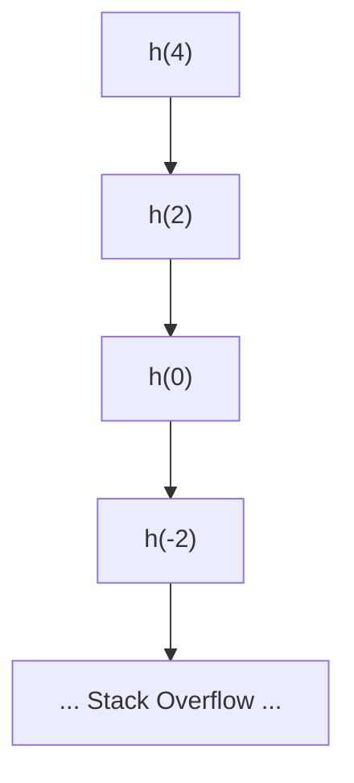
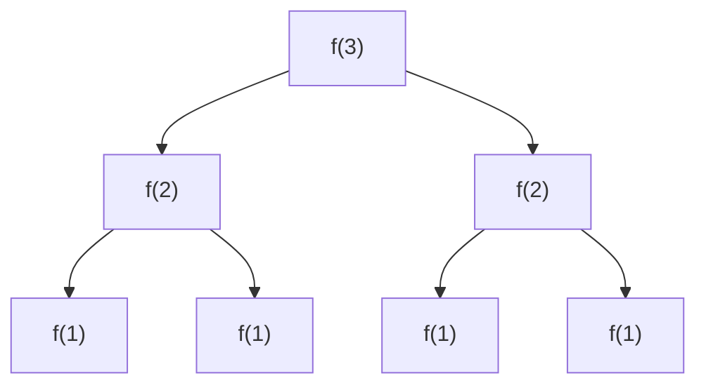
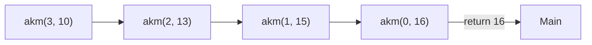

		🔙 **[Kembali ke Daftar Soal](./README.md)**

---

# Latihan Soal Part C - Modul 05 - Set 02 (Premium Edition)

---

### Soal 11: Bayangan Stack (Recursive Scoping)
```cpp
void fungsi(int n) {
    if (n == 0) return;
    int x = n * 10;
    fungsi(n - 1);
    cout << x << " ";
}

int main() {
    fungsi(2);
}
```
**Pertanyaan:**
1. Apa output dari program tersebut?
2. Mengapa nilai `x` tidak berubah menjadi 10 saat kembali dari rekursi?

<details>
<summary><b>Klik untuk Lihat Jawaban & Diagnosis</b></summary>

**Mermaid Call Stack:**


**Jawaban:**
1. **10 20**
2. Karena setiap panggilan fungsi membuat **salinan variabel lokal** `x` yang baru di alamat stack yang berbeda. Variabel `x=10` di level 2 tidak mengganggu `x=20` di level 1.
</details>

---

### Soal 12: Penambah Global (Global Side Effect)
```cpp
int total = 0;
void tambah(int n) {
    if (n == 0) return;
    total += n;
    tambah(n - 1);
}

int main() {
    tambah(3);
}
```
**Pertanyaan:**
1. Berapakah nilai `total` diakhir?
2. Apa perbedaan variabel `total` di sini dibanding jika ditaruh di dalam fungsi?

<details>
<summary><b>Klik untuk Lihat Jawaban & Diagnosis</b></summary>

**Jawaban:**
1. **6** (3 + 2 + 1)
2. Jika ditaruh di dalam fungsi (tanpa `static`), ia akan di-reset menjadi 0 setiap kali fungsi dipanggil. Karena ia **Global**, semua level rekursi berbagi variabel yang sama.
</details>

---

### Soal 13: Cermin String (String Reverse Trace)
```cpp
void cermin(string s, int idx) {
    if (idx < 0) return;
    cout << s[idx];
    cermin(s, idx - 1);
}

int main() {
    cermin("ABC", 2);
}
```
**Pertanyaan:**
1. Apa output program tersebut?
2. Apa peran `idx` dalam rekursi ini?

<details>
<summary><b>Klik untuk Lihat Jawaban & Diagnosis</b></summary>

**Mermaid Call Stack:**


**Jawaban:**
1. **CBA**
2. Sebagai penunjuk indeks karakter yang akan dicetak, yang bergerak mundur dari belakang ke depan.
</details>

---

### Soal 14: Pencari Harta (Recursive Search)
```cpp
bool cari(int arr[], int n, int target) {
    if (n < 0) return false;
    if (arr[n] == target) return true;
    return cari(arr, n - 1, target);
}

int main() {
    int data[] = {10, 20, 30};
    bool ada = cari(data, 2, 20);
}
```
**Pertanyaan:**
1. Berapakah nilai `ada` (true/false)?
2. Fungsi ini mencari dari indeks depan ke belakang atau belakang ke depan?

<details>
<summary><b>Klik untuk Lihat Jawaban & Diagnosis</b></summary>

**Jawaban:**
1. **true**
2. **Belakang ke depan.** (Mulai dari `n=2` turun ke 0).
</details>

---

### Soal 15: ⚠️ Jebakan Base Case (Infinite Risk)
```cpp
int hitung(int n) {
    if (n == 1) return 1;
    return n + hitung(n - 2);
}

int main() {
    int x = hitung(4);
}
```
**Pertanyaan:**
1. Apa yang akan terjadi pada program ini?
2. Mengapa Base Case `n == 1` gagal menghentikan program?

<details>
<summary><b>Klik untuk Lihat Jawaban & Diagnosis</b></summary>

**Mermaid Trace (The Fall):**


**Jawaban:**
1. **Crash / Stack Overflow.**
2. Karena `n` berkurang 2. Dari 4 -> 2 -> 0 -> -2, ia **melompati** angka 1 sehingga tidak pernah memenuhi syarat `n == 1`.
</details>

---

### Soal 16: Pengali Ganda (Double Return)
```cpp
int f(int n) {
    if (n <= 1) return 1;
    return f(n-1) + f(n-1);
}

int main() {
    int x = f(3);
}
```
**Pertanyaan:**
1. Berapakah nilai `x`?
2. Berapa kali fungsi `f` dipanggil secara total?

<details>
<summary><b>Klik untuk Lihat Jawaban & Diagnosis</b></summary>

**Mermaid Tree Trace:**


**Jawaban:**
1. **4** (1+1+1+1)
2. **7 kali** (1 panggilan f(3), 2 panggilan f(2), 4 panggilan f(1)).
</details>

---

### Soal 17: Logika Karakter (Recursive Char)
```cpp
void geser(char c) {
    if (c > 'C') return;
    geser(c + 1);
    cout << c;
}

int main() {
    geser('A');
}
```
**Pertanyaan:**
1. Apa output program tersebut?
2. Karakter apa yang menjadi Base Case?

<details>
<summary><b>Klik untuk Lihat Jawaban & Diagnosis</b></summary>

**Jawaban:**
1. **CBA**
2. **'D'** (Karena saat `c = 'D'`, kondisi `'D' > 'C'` benar, dan ia return).
</details>

---

### Soal 18: Stack Akumulator (Tail-ish Trace)
```cpp
int akm(int n, int a) {
    if (n == 0) return a;
    return akm(n - 1, a + n);
}

int main() {
    int x = akm(3, 10);
}
```
**Pertanyaan:**
1. Berapakah nilai `x`?
2. Nilai `a` pada panggilan terakhir (n=0) adalah?

<details>
<summary><b>Klik untuk Lihat Jawaban & Diagnosis</b></summary>

**Mermaid Flow:**


**Jawaban:**
1. **16**
2. **16**
</details>

---

### Soal 19: Lompatan Kelinci (Recursive Step)
```cpp
int loncat(int n) {
    if (n <= 0) return 0;
    if (n == 1) return 1;
    return loncat(n - 1) + 1;
}

int main() {
    int x = loncat(4);
}
```
**Pertanyaan:**
1. Berapakah nilai `x`?
2. Apakah fungsi ini lebih efisien daripada loop biasa?

<details>
<summary><b>Klik untuk Lihat Jawaban & Diagnosis</b></summary>

**Jawaban:**
1. **4**
2. **Tidak.** Fungsi ini melakukan banyak panggilan stack hanya untuk melakukan penambahan yang sebenarnya bisa dilakukan dengan loop sederhana (atau bahkan rumus matematika langsung).
</details>

---

### Soal 20: Pencetak Pola (Recursive Pattern)
```cpp
void pola(int n) {
    if (n == 0) return;
    for(int i=0; i<n; i++) cout << "*";
    cout << "\n";
    pola(n - 1);
}

int main() {
    pola(3);
}
```
**Pertanyaan:**
1. Berapa total bintang (`*`) yang dicetak?
2. Bagaimana bentuk pola yang dihasilkan?

<details>
<summary><b>Klik untuk Lihat Jawaban & Diagnosis</b></summary>

**Jawaban:**
1. **6** (3 + 2 + 1)
2. **Segitiga Terbalik**:
   ```
   ***
   **
   *
   ```
</details>
