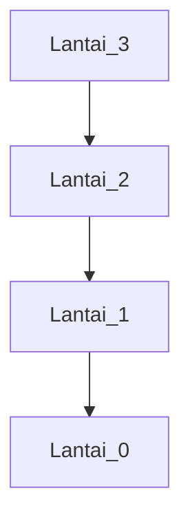
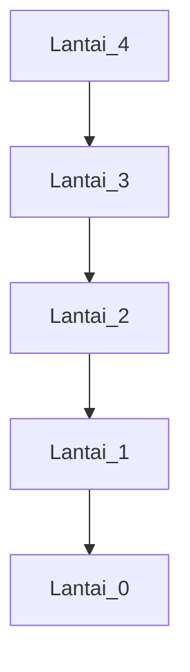

🔙 **[Kembali ke Daftar Soal](./README.md)**

---

# Latihan Soal Part C - Modul 05 - Set 02

### Soal 26
```cpp
int tangga(int n) {
  if (n <= 1) return 1;
  return n + tangga(n-1);
}
// panggil: tangga(3);
```
**Pertanyaan:**
1. Berapakah hasil akhirnya?
2. Deskripsikan langkah robot compiler saat memproses kode ini!

**Jawaban & Diagnosis:**
1. **6**
2. Baca bagian 'Analisis Mendalam' di bawah.

**Mermaid Flowchart:**


**📖 Penjelasan Komprehensif:**
**Analisis Mendalam (Compiler Manusia):**
1. **Analogi Tangga**: Kita menuruni lantai 3 satu per satu.
2. **Call Stack**: Mesin mengingat setiap lantai yang dilewati (n=3, n=2...).
3. **Landing**: Sampai di lantai 1 (Base Case), mesin mulai menjumlahkan seluruh energi yang dikeluarkan.
4. **Hasil Akhir**: Nilai kembalian total adalah **6**.

---
### Soal 27
```cpp
int tangga(int n) {
  if (n <= 1) return 1;
  return n + tangga(n-1);
}
// panggil: tangga(3);
```
**Pertanyaan:**
1. Berapakah hasil akhirnya?
2. Deskripsikan langkah robot compiler saat memproses kode ini!

**Jawaban & Diagnosis:**
1. **6**
2. Baca bagian 'Analisis Mendalam' di bawah.

**Mermaid Flowchart:**


**📖 Penjelasan Komprehensif:**
**Analisis Mendalam (Compiler Manusia):**
1. **Analogi Tangga**: Kita menuruni lantai 3 satu per satu.
2. **Call Stack**: Mesin mengingat setiap lantai yang dilewati (n=3, n=2...).
3. **Landing**: Sampai di lantai 1 (Base Case), mesin mulai menjumlahkan seluruh energi yang dikeluarkan.
4. **Hasil Akhir**: Nilai kembalian total adalah **6**.

---
### Soal 28
```cpp
int tangga(int n) {
  if (n <= 1) return 1;
  return n + tangga(n-1);
}
// panggil: tangga(4);
```
**Pertanyaan:**
1. Berapakah hasil akhirnya?
2. Deskripsikan langkah robot compiler saat memproses kode ini!

**Jawaban & Diagnosis:**
1. **10**
2. Baca bagian 'Analisis Mendalam' di bawah.

**Mermaid Flowchart:**


**📖 Penjelasan Komprehensif:**
**Analisis Mendalam (Compiler Manusia):**
1. **Analogi Tangga**: Kita menuruni lantai 4 satu per satu.
2. **Call Stack**: Mesin mengingat setiap lantai yang dilewati (n=4, n=3...).
3. **Landing**: Sampai di lantai 1 (Base Case), mesin mulai menjumlahkan seluruh energi yang dikeluarkan.
4. **Hasil Akhir**: Nilai kembalian total adalah **10**.

---
### Soal 29
```cpp
int tangga(int n) {
  if (n <= 1) return 1;
  return n + tangga(n-1);
}
// panggil: tangga(3);
```
**Pertanyaan:**
1. Berapakah hasil akhirnya?
2. Deskripsikan langkah robot compiler saat memproses kode ini!

**Jawaban & Diagnosis:**
1. **6**
2. Baca bagian 'Analisis Mendalam' di bawah.

**Mermaid Flowchart:**


**📖 Penjelasan Komprehensif:**
**Analisis Mendalam (Compiler Manusia):**
1. **Analogi Tangga**: Kita menuruni lantai 3 satu per satu.
2. **Call Stack**: Mesin mengingat setiap lantai yang dilewati (n=3, n=2...).
3. **Landing**: Sampai di lantai 1 (Base Case), mesin mulai menjumlahkan seluruh energi yang dikeluarkan.
4. **Hasil Akhir**: Nilai kembalian total adalah **6**.

---
### Soal 30
```cpp
int tangga(int n) {
  if (n <= 1) return 1;
  return n + tangga(n-1);
}
// panggil: tangga(4);
```
**Pertanyaan:**
1. Berapakah hasil akhirnya?
2. Deskripsikan langkah robot compiler saat memproses kode ini!

**Jawaban & Diagnosis:**
1. **10**
2. Baca bagian 'Analisis Mendalam' di bawah.

**Mermaid Flowchart:**


**📖 Penjelasan Komprehensif:**
**Analisis Mendalam (Compiler Manusia):**
1. **Analogi Tangga**: Kita menuruni lantai 4 satu per satu.
2. **Call Stack**: Mesin mengingat setiap lantai yang dilewati (n=4, n=3...).
3. **Landing**: Sampai di lantai 1 (Base Case), mesin mulai menjumlahkan seluruh energi yang dikeluarkan.
4. **Hasil Akhir**: Nilai kembalian total adalah **10**.

---
### Soal 31
```cpp
int tangga(int n) {
  if (n <= 1) return 1;
  return n + tangga(n-1);
}
// panggil: tangga(3);
```
**Pertanyaan:**
1. Berapakah hasil akhirnya?
2. Deskripsikan langkah robot compiler saat memproses kode ini!

**Jawaban & Diagnosis:**
1. **6**
2. Baca bagian 'Analisis Mendalam' di bawah.

**Mermaid Flowchart:**


**📖 Penjelasan Komprehensif:**
**Analisis Mendalam (Compiler Manusia):**
1. **Analogi Tangga**: Kita menuruni lantai 3 satu per satu.
2. **Call Stack**: Mesin mengingat setiap lantai yang dilewati (n=3, n=2...).
3. **Landing**: Sampai di lantai 1 (Base Case), mesin mulai menjumlahkan seluruh energi yang dikeluarkan.
4. **Hasil Akhir**: Nilai kembalian total adalah **6**.

---
### Soal 32
```cpp
int tangga(int n) {
  if (n <= 1) return 1;
  return n + tangga(n-1);
}
// panggil: tangga(4);
```
**Pertanyaan:**
1. Berapakah hasil akhirnya?
2. Deskripsikan langkah robot compiler saat memproses kode ini!

**Jawaban & Diagnosis:**
1. **10**
2. Baca bagian 'Analisis Mendalam' di bawah.

**Mermaid Flowchart:**


**📖 Penjelasan Komprehensif:**
**Analisis Mendalam (Compiler Manusia):**
1. **Analogi Tangga**: Kita menuruni lantai 4 satu per satu.
2. **Call Stack**: Mesin mengingat setiap lantai yang dilewati (n=4, n=3...).
3. **Landing**: Sampai di lantai 1 (Base Case), mesin mulai menjumlahkan seluruh energi yang dikeluarkan.
4. **Hasil Akhir**: Nilai kembalian total adalah **10**.

---
### Soal 33
```cpp
int tangga(int n) {
  if (n <= 1) return 1;
  return n + tangga(n-1);
}
// panggil: tangga(3);
```
**Pertanyaan:**
1. Berapakah hasil akhirnya?
2. Deskripsikan langkah robot compiler saat memproses kode ini!

**Jawaban & Diagnosis:**
1. **6**
2. Baca bagian 'Analisis Mendalam' di bawah.

**Mermaid Flowchart:**


**📖 Penjelasan Komprehensif:**
**Analisis Mendalam (Compiler Manusia):**
1. **Analogi Tangga**: Kita menuruni lantai 3 satu per satu.
2. **Call Stack**: Mesin mengingat setiap lantai yang dilewati (n=3, n=2...).
3. **Landing**: Sampai di lantai 1 (Base Case), mesin mulai menjumlahkan seluruh energi yang dikeluarkan.
4. **Hasil Akhir**: Nilai kembalian total adalah **6**.

---
### Soal 34
```cpp
int tangga(int n) {
  if (n <= 1) return 1;
  return n + tangga(n-1);
}
// panggil: tangga(4);
```
**Pertanyaan:**
1. Berapakah hasil akhirnya?
2. Deskripsikan langkah robot compiler saat memproses kode ini!

**Jawaban & Diagnosis:**
1. **10**
2. Baca bagian 'Analisis Mendalam' di bawah.

**Mermaid Flowchart:**


**📖 Penjelasan Komprehensif:**
**Analisis Mendalam (Compiler Manusia):**
1. **Analogi Tangga**: Kita menuruni lantai 4 satu per satu.
2. **Call Stack**: Mesin mengingat setiap lantai yang dilewati (n=4, n=3...).
3. **Landing**: Sampai di lantai 1 (Base Case), mesin mulai menjumlahkan seluruh energi yang dikeluarkan.
4. **Hasil Akhir**: Nilai kembalian total adalah **10**.

---
### Soal 35
```cpp
int tangga(int n) {
  if (n <= 1) return 1;
  return n + tangga(n-1);
}
// panggil: tangga(4);
```
**Pertanyaan:**
1. Berapakah hasil akhirnya?
2. Deskripsikan langkah robot compiler saat memproses kode ini!

**Jawaban & Diagnosis:**
1. **10**
2. Baca bagian 'Analisis Mendalam' di bawah.

**Mermaid Flowchart:**


**📖 Penjelasan Komprehensif:**
**Analisis Mendalam (Compiler Manusia):**
1. **Analogi Tangga**: Kita menuruni lantai 4 satu per satu.
2. **Call Stack**: Mesin mengingat setiap lantai yang dilewati (n=4, n=3...).
3. **Landing**: Sampai di lantai 1 (Base Case), mesin mulai menjumlahkan seluruh energi yang dikeluarkan.
4. **Hasil Akhir**: Nilai kembalian total adalah **10**.

---
### Soal 36
```cpp
int tangga(int n) {
  if (n <= 1) return 1;
  return n + tangga(n-1);
}
// panggil: tangga(4);
```
**Pertanyaan:**
1. Berapakah hasil akhirnya?
2. Deskripsikan langkah robot compiler saat memproses kode ini!

**Jawaban & Diagnosis:**
1. **10**
2. Baca bagian 'Analisis Mendalam' di bawah.

**Mermaid Flowchart:**


**📖 Penjelasan Komprehensif:**
**Analisis Mendalam (Compiler Manusia):**
1. **Analogi Tangga**: Kita menuruni lantai 4 satu per satu.
2. **Call Stack**: Mesin mengingat setiap lantai yang dilewati (n=4, n=3...).
3. **Landing**: Sampai di lantai 1 (Base Case), mesin mulai menjumlahkan seluruh energi yang dikeluarkan.
4. **Hasil Akhir**: Nilai kembalian total adalah **10**.

---
### Soal 37
```cpp
int tangga(int n) {
  if (n <= 1) return 1;
  return n + tangga(n-1);
}
// panggil: tangga(3);
```
**Pertanyaan:**
1. Berapakah hasil akhirnya?
2. Deskripsikan langkah robot compiler saat memproses kode ini!

**Jawaban & Diagnosis:**
1. **6**
2. Baca bagian 'Analisis Mendalam' di bawah.

**Mermaid Flowchart:**


**📖 Penjelasan Komprehensif:**
**Analisis Mendalam (Compiler Manusia):**
1. **Analogi Tangga**: Kita menuruni lantai 3 satu per satu.
2. **Call Stack**: Mesin mengingat setiap lantai yang dilewati (n=3, n=2...).
3. **Landing**: Sampai di lantai 1 (Base Case), mesin mulai menjumlahkan seluruh energi yang dikeluarkan.
4. **Hasil Akhir**: Nilai kembalian total adalah **6**.

---
### Soal 38
```cpp
int tangga(int n) {
  if (n <= 1) return 1;
  return n + tangga(n-1);
}
// panggil: tangga(3);
```
**Pertanyaan:**
1. Berapakah hasil akhirnya?
2. Deskripsikan langkah robot compiler saat memproses kode ini!

**Jawaban & Diagnosis:**
1. **6**
2. Baca bagian 'Analisis Mendalam' di bawah.

**Mermaid Flowchart:**


**📖 Penjelasan Komprehensif:**
**Analisis Mendalam (Compiler Manusia):**
1. **Analogi Tangga**: Kita menuruni lantai 3 satu per satu.
2. **Call Stack**: Mesin mengingat setiap lantai yang dilewati (n=3, n=2...).
3. **Landing**: Sampai di lantai 1 (Base Case), mesin mulai menjumlahkan seluruh energi yang dikeluarkan.
4. **Hasil Akhir**: Nilai kembalian total adalah **6**.

---
### Soal 39
```cpp
int tangga(int n) {
  if (n <= 1) return 1;
  return n + tangga(n-1);
}
// panggil: tangga(3);
```
**Pertanyaan:**
1. Berapakah hasil akhirnya?
2. Deskripsikan langkah robot compiler saat memproses kode ini!

**Jawaban & Diagnosis:**
1. **6**
2. Baca bagian 'Analisis Mendalam' di bawah.

**Mermaid Flowchart:**


**📖 Penjelasan Komprehensif:**
**Analisis Mendalam (Compiler Manusia):**
1. **Analogi Tangga**: Kita menuruni lantai 3 satu per satu.
2. **Call Stack**: Mesin mengingat setiap lantai yang dilewati (n=3, n=2...).
3. **Landing**: Sampai di lantai 1 (Base Case), mesin mulai menjumlahkan seluruh energi yang dikeluarkan.
4. **Hasil Akhir**: Nilai kembalian total adalah **6**.

---
### Soal 40
```cpp
int tangga(int n) {
  if (n <= 1) return 1;
  return n + tangga(n-1);
}
// panggil: tangga(3);
```
**Pertanyaan:**
1. Berapakah hasil akhirnya?
2. Deskripsikan langkah robot compiler saat memproses kode ini!

**Jawaban & Diagnosis:**
1. **6**
2. Baca bagian 'Analisis Mendalam' di bawah.

**Mermaid Flowchart:**


**📖 Penjelasan Komprehensif:**
**Analisis Mendalam (Compiler Manusia):**
1. **Analogi Tangga**: Kita menuruni lantai 3 satu per satu.
2. **Call Stack**: Mesin mengingat setiap lantai yang dilewati (n=3, n=2...).
3. **Landing**: Sampai di lantai 1 (Base Case), mesin mulai menjumlahkan seluruh energi yang dikeluarkan.
4. **Hasil Akhir**: Nilai kembalian total adalah **6**.

---
### Soal 41
```cpp
int tangga(int n) {
  if (n <= 1) return 1;
  return n + tangga(n-1);
}
// panggil: tangga(3);
```
**Pertanyaan:**
1. Berapakah hasil akhirnya?
2. Deskripsikan langkah robot compiler saat memproses kode ini!

**Jawaban & Diagnosis:**
1. **6**
2. Baca bagian 'Analisis Mendalam' di bawah.

**Mermaid Flowchart:**


**📖 Penjelasan Komprehensif:**
**Analisis Mendalam (Compiler Manusia):**
1. **Analogi Tangga**: Kita menuruni lantai 3 satu per satu.
2. **Call Stack**: Mesin mengingat setiap lantai yang dilewati (n=3, n=2...).
3. **Landing**: Sampai di lantai 1 (Base Case), mesin mulai menjumlahkan seluruh energi yang dikeluarkan.
4. **Hasil Akhir**: Nilai kembalian total adalah **6**.

---
### Soal 42
```cpp
int tangga(int n) {
  if (n <= 1) return 1;
  return n + tangga(n-1);
}
// panggil: tangga(3);
```
**Pertanyaan:**
1. Berapakah hasil akhirnya?
2. Deskripsikan langkah robot compiler saat memproses kode ini!

**Jawaban & Diagnosis:**
1. **6**
2. Baca bagian 'Analisis Mendalam' di bawah.

**Mermaid Flowchart:**


**📖 Penjelasan Komprehensif:**
**Analisis Mendalam (Compiler Manusia):**
1. **Analogi Tangga**: Kita menuruni lantai 3 satu per satu.
2. **Call Stack**: Mesin mengingat setiap lantai yang dilewati (n=3, n=2...).
3. **Landing**: Sampai di lantai 1 (Base Case), mesin mulai menjumlahkan seluruh energi yang dikeluarkan.
4. **Hasil Akhir**: Nilai kembalian total adalah **6**.

---
### Soal 43
```cpp
int tangga(int n) {
  if (n <= 1) return 1;
  return n + tangga(n-1);
}
// panggil: tangga(3);
```
**Pertanyaan:**
1. Berapakah hasil akhirnya?
2. Deskripsikan langkah robot compiler saat memproses kode ini!

**Jawaban & Diagnosis:**
1. **6**
2. Baca bagian 'Analisis Mendalam' di bawah.

**Mermaid Flowchart:**


**📖 Penjelasan Komprehensif:**
**Analisis Mendalam (Compiler Manusia):**
1. **Analogi Tangga**: Kita menuruni lantai 3 satu per satu.
2. **Call Stack**: Mesin mengingat setiap lantai yang dilewati (n=3, n=2...).
3. **Landing**: Sampai di lantai 1 (Base Case), mesin mulai menjumlahkan seluruh energi yang dikeluarkan.
4. **Hasil Akhir**: Nilai kembalian total adalah **6**.

---
### Soal 44
```cpp
int tangga(int n) {
  if (n <= 1) return 1;
  return n + tangga(n-1);
}
// panggil: tangga(3);
```
**Pertanyaan:**
1. Berapakah hasil akhirnya?
2. Deskripsikan langkah robot compiler saat memproses kode ini!

**Jawaban & Diagnosis:**
1. **6**
2. Baca bagian 'Analisis Mendalam' di bawah.

**Mermaid Flowchart:**


**📖 Penjelasan Komprehensif:**
**Analisis Mendalam (Compiler Manusia):**
1. **Analogi Tangga**: Kita menuruni lantai 3 satu per satu.
2. **Call Stack**: Mesin mengingat setiap lantai yang dilewati (n=3, n=2...).
3. **Landing**: Sampai di lantai 1 (Base Case), mesin mulai menjumlahkan seluruh energi yang dikeluarkan.
4. **Hasil Akhir**: Nilai kembalian total adalah **6**.

---
### Soal 45
```cpp
int tangga(int n) {
  if (n <= 1) return 1;
  return n + tangga(n-1);
}
// panggil: tangga(4);
```
**Pertanyaan:**
1. Berapakah hasil akhirnya?
2. Deskripsikan langkah robot compiler saat memproses kode ini!

**Jawaban & Diagnosis:**
1. **10**
2. Baca bagian 'Analisis Mendalam' di bawah.

**Mermaid Flowchart:**


**📖 Penjelasan Komprehensif:**
**Analisis Mendalam (Compiler Manusia):**
1. **Analogi Tangga**: Kita menuruni lantai 4 satu per satu.
2. **Call Stack**: Mesin mengingat setiap lantai yang dilewati (n=4, n=3...).
3. **Landing**: Sampai di lantai 1 (Base Case), mesin mulai menjumlahkan seluruh energi yang dikeluarkan.
4. **Hasil Akhir**: Nilai kembalian total adalah **10**.

---
### Soal 46
```cpp
int tangga(int n) {
  if (n <= 1) return 1;
  return n + tangga(n-1);
}
// panggil: tangga(4);
```
**Pertanyaan:**
1. Berapakah hasil akhirnya?
2. Deskripsikan langkah robot compiler saat memproses kode ini!

**Jawaban & Diagnosis:**
1. **10**
2. Baca bagian 'Analisis Mendalam' di bawah.

**Mermaid Flowchart:**
```mermaid
graph TD
Lantai_4 --> Lantai_3 --> Lantai_2 --> Lantai_1 --> Lantai_0
```

**📖 Penjelasan Komprehensif:**
**Analisis Mendalam (Compiler Manusia):**
1. **Analogi Tangga**: Kita menuruni lantai 4 satu per satu.
2. **Call Stack**: Mesin mengingat setiap lantai yang dilewati (n=4, n=3...).
3. **Landing**: Sampai di lantai 1 (Base Case), mesin mulai menjumlahkan seluruh energi yang dikeluarkan.
4. **Hasil Akhir**: Nilai kembalian total adalah **10**.

---
### Soal 47
```cpp
int tangga(int n) {
  if (n <= 1) return 1;
  return n + tangga(n-1);
}
// panggil: tangga(3);
```
**Pertanyaan:**
1. Berapakah hasil akhirnya?
2. Deskripsikan langkah robot compiler saat memproses kode ini!

**Jawaban & Diagnosis:**
1. **6**
2. Baca bagian 'Analisis Mendalam' di bawah.

**Mermaid Flowchart:**
```mermaid
graph TD
Lantai_3 --> Lantai_2 --> Lantai_1 --> Lantai_0
```

**📖 Penjelasan Komprehensif:**
**Analisis Mendalam (Compiler Manusia):**
1. **Analogi Tangga**: Kita menuruni lantai 3 satu per satu.
2. **Call Stack**: Mesin mengingat setiap lantai yang dilewati (n=3, n=2...).
3. **Landing**: Sampai di lantai 1 (Base Case), mesin mulai menjumlahkan seluruh energi yang dikeluarkan.
4. **Hasil Akhir**: Nilai kembalian total adalah **6**.

---
### Soal 48
```cpp
int tangga(int n) {
  if (n <= 1) return 1;
  return n + tangga(n-1);
}
// panggil: tangga(4);
```
**Pertanyaan:**
1. Berapakah hasil akhirnya?
2. Deskripsikan langkah robot compiler saat memproses kode ini!

**Jawaban & Diagnosis:**
1. **10**
2. Baca bagian 'Analisis Mendalam' di bawah.

**Mermaid Flowchart:**
```mermaid
graph TD
Lantai_4 --> Lantai_3 --> Lantai_2 --> Lantai_1 --> Lantai_0
```

**📖 Penjelasan Komprehensif:**
**Analisis Mendalam (Compiler Manusia):**
1. **Analogi Tangga**: Kita menuruni lantai 4 satu per satu.
2. **Call Stack**: Mesin mengingat setiap lantai yang dilewati (n=4, n=3...).
3. **Landing**: Sampai di lantai 1 (Base Case), mesin mulai menjumlahkan seluruh energi yang dikeluarkan.
4. **Hasil Akhir**: Nilai kembalian total adalah **10**.

---
### Soal 49
```cpp
int tangga(int n) {
  if (n <= 1) return 1;
  return n + tangga(n-1);
}
// panggil: tangga(3);
```
**Pertanyaan:**
1. Berapakah hasil akhirnya?
2. Deskripsikan langkah robot compiler saat memproses kode ini!

**Jawaban & Diagnosis:**
1. **6**
2. Baca bagian 'Analisis Mendalam' di bawah.

**Mermaid Flowchart:**
```mermaid
graph TD
Lantai_3 --> Lantai_2 --> Lantai_1 --> Lantai_0
```

**📖 Penjelasan Komprehensif:**
**Analisis Mendalam (Compiler Manusia):**
1. **Analogi Tangga**: Kita menuruni lantai 3 satu per satu.
2. **Call Stack**: Mesin mengingat setiap lantai yang dilewati (n=3, n=2...).
3. **Landing**: Sampai di lantai 1 (Base Case), mesin mulai menjumlahkan seluruh energi yang dikeluarkan.
4. **Hasil Akhir**: Nilai kembalian total adalah **6**.

---
### Soal 50
```cpp
int tangga(int n) {
  if (n <= 1) return 1;
  return n + tangga(n-1);
}
// panggil: tangga(3);
```
**Pertanyaan:**
1. Berapakah hasil akhirnya?
2. Deskripsikan langkah robot compiler saat memproses kode ini!

**Jawaban & Diagnosis:**
1. **6**
2. Baca bagian 'Analisis Mendalam' di bawah.

**Mermaid Flowchart:**
```mermaid
graph TD
Lantai_3 --> Lantai_2 --> Lantai_1 --> Lantai_0
```

**📖 Penjelasan Komprehensif:**
**Analisis Mendalam (Compiler Manusia):**
1. **Analogi Tangga**: Kita menuruni lantai 3 satu per satu.
2. **Call Stack**: Mesin mengingat setiap lantai yang dilewati (n=3, n=2...).
3. **Landing**: Sampai di lantai 1 (Base Case), mesin mulai menjumlahkan seluruh energi yang dikeluarkan.
4. **Hasil Akhir**: Nilai kembalian total adalah **6**.

---
