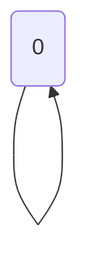

🔙 **[Kembali ke Daftar Soal](./README.md)**

---

# Latihan Soal Part C - Modul 05 - Set 03

### Soal 51
```cpp
int f(int n) {
  if(n==0) return 0;
  return n + f(n-1);
}
// f(3)
```
**Pertanyaan:**
1. Berapakah hasil akhirnya?
2. Mengapa demikian?

**Jawaban & Diagnosis:**
1. **6**
2. Lihat Tracing.

**Mermaid Flowchart:**


**📖 Penjelasan:**
**Langkah Tracing:**
1. Rekursi Sum dengan n=3.
2. Hasil akhir: 6.

---
### Soal 52
```cpp
int f(int n) {
  if(n<=1) return 1;
  return n * f(n-1);
}
// f(5)
```
**Pertanyaan:**
1. Berapakah hasil akhirnya?
2. Mengapa demikian?

**Jawaban & Diagnosis:**
1. **120**
2. Lihat Tracing.

**Mermaid Flowchart:**


**📖 Penjelasan:**
**Langkah Tracing:**
1. Rekursi Fact dengan n=5.
2. Hasil akhir: 120.

---
### Soal 53
```cpp
int f(int n) {
  if(n<=1) return 1;
  return n * f(n-1);
}
// f(5)
```
**Pertanyaan:**
1. Berapakah hasil akhirnya?
2. Mengapa demikian?

**Jawaban & Diagnosis:**
1. **120**
2. Lihat Tracing.

**Mermaid Flowchart:**


**📖 Penjelasan:**
**Langkah Tracing:**
1. Rekursi Fact dengan n=5.
2. Hasil akhir: 120.

---
### Soal 54
```cpp
int f(int n) {
  if(n==0) return 1;
  return 2 * f(n-1);
}
// f(5)
```
**Pertanyaan:**
1. Berapakah hasil akhirnya?
2. Mengapa demikian?

**Jawaban & Diagnosis:**
1. **32**
2. Lihat Tracing.

**Mermaid Flowchart:**


**📖 Penjelasan:**
**Langkah Tracing:**
1. Rekursi Power dengan n=5.
2. Hasil akhir: 32.

---
### Soal 55
```cpp
int f(int n) {
  if(n<=1) return 1;
  return n * f(n-1);
}
// f(2)
```
**Pertanyaan:**
1. Berapakah hasil akhirnya?
2. Mengapa demikian?

**Jawaban & Diagnosis:**
1. **2**
2. Lihat Tracing.

**Mermaid Flowchart:**


**📖 Penjelasan:**
**Langkah Tracing:**
1. Rekursi Fact dengan n=2.
2. Hasil akhir: 2.

---
### Soal 56
```cpp
int f(int n) {
  if(n==0) return 0;
  return n + f(n-1);
}
// f(3)
```
**Pertanyaan:**
1. Berapakah hasil akhirnya?
2. Mengapa demikian?

**Jawaban & Diagnosis:**
1. **6**
2. Lihat Tracing.

**Mermaid Flowchart:**


**📖 Penjelasan:**
**Langkah Tracing:**
1. Rekursi Sum dengan n=3.
2. Hasil akhir: 6.

---
### Soal 57
```cpp
int f(int n) {
  if(n<=1) return 1;
  return n * f(n-1);
}
// f(5)
```
**Pertanyaan:**
1. Berapakah hasil akhirnya?
2. Mengapa demikian?

**Jawaban & Diagnosis:**
1. **120**
2. Lihat Tracing.

**Mermaid Flowchart:**


**📖 Penjelasan:**
**Langkah Tracing:**
1. Rekursi Fact dengan n=5.
2. Hasil akhir: 120.

---
### Soal 58
```cpp
int f(int n) {
  if(n==0) return 0;
  return n + f(n-1);
}
// f(3)
```
**Pertanyaan:**
1. Berapakah hasil akhirnya?
2. Mengapa demikian?

**Jawaban & Diagnosis:**
1. **6**
2. Lihat Tracing.

**Mermaid Flowchart:**


**📖 Penjelasan:**
**Langkah Tracing:**
1. Rekursi Sum dengan n=3.
2. Hasil akhir: 6.

---
### Soal 59
```cpp
int f(int n) {
  if(n==0) return 0;
  return n + f(n-1);
}
// f(2)
```
**Pertanyaan:**
1. Berapakah hasil akhirnya?
2. Mengapa demikian?

**Jawaban & Diagnosis:**
1. **3**
2. Lihat Tracing.

**Mermaid Flowchart:**


**📖 Penjelasan:**
**Langkah Tracing:**
1. Rekursi Sum dengan n=2.
2. Hasil akhir: 3.

---
### Soal 60
```cpp
int f(int n) {
  if(n==0) return 0;
  return n + f(n-1);
}
// f(5)
```
**Pertanyaan:**
1. Berapakah hasil akhirnya?
2. Mengapa demikian?

**Jawaban & Diagnosis:**
1. **15**
2. Lihat Tracing.

**Mermaid Flowchart:**


**📖 Penjelasan:**
**Langkah Tracing:**
1. Rekursi Sum dengan n=5.
2. Hasil akhir: 15.

---
### Soal 61
```cpp
int f(int n) {
  if(n<=1) return 1;
  return n * f(n-1);
}
// f(3)
```
**Pertanyaan:**
1. Berapakah hasil akhirnya?
2. Mengapa demikian?

**Jawaban & Diagnosis:**
1. **6**
2. Lihat Tracing.

**Mermaid Flowchart:**


**📖 Penjelasan:**
**Langkah Tracing:**
1. Rekursi Fact dengan n=3.
2. Hasil akhir: 6.

---
### Soal 62
```cpp
int f(int n) {
  if(n==0) return 0;
  return n + f(n-1);
}
// f(2)
```
**Pertanyaan:**
1. Berapakah hasil akhirnya?
2. Mengapa demikian?

**Jawaban & Diagnosis:**
1. **3**
2. Lihat Tracing.

**Mermaid Flowchart:**


**📖 Penjelasan:**
**Langkah Tracing:**
1. Rekursi Sum dengan n=2.
2. Hasil akhir: 3.

---
### Soal 63
```cpp
int f(int n) {
  if(n==0) return 1;
  return 2 * f(n-1);
}
// f(4)
```
**Pertanyaan:**
1. Berapakah hasil akhirnya?
2. Mengapa demikian?

**Jawaban & Diagnosis:**
1. **16**
2. Lihat Tracing.

**Mermaid Flowchart:**


**📖 Penjelasan:**
**Langkah Tracing:**
1. Rekursi Power dengan n=4.
2. Hasil akhir: 16.

---
### Soal 64
```cpp
int f(int n) {
  if(n==0) return 0;
  return n + f(n-1);
}
// f(3)
```
**Pertanyaan:**
1. Berapakah hasil akhirnya?
2. Mengapa demikian?

**Jawaban & Diagnosis:**
1. **6**
2. Lihat Tracing.

**Mermaid Flowchart:**


**📖 Penjelasan:**
**Langkah Tracing:**
1. Rekursi Sum dengan n=3.
2. Hasil akhir: 6.

---
### Soal 65
```cpp
int f(int n) {
  if(n==0) return 1;
  return 2 * f(n-1);
}
// f(3)
```
**Pertanyaan:**
1. Berapakah hasil akhirnya?
2. Mengapa demikian?

**Jawaban & Diagnosis:**
1. **8**
2. Lihat Tracing.

**Mermaid Flowchart:**


**📖 Penjelasan:**
**Langkah Tracing:**
1. Rekursi Power dengan n=3.
2. Hasil akhir: 8.

---
### Soal 66
```cpp
int f(int n) {
  if(n==0) return 1;
  return 2 * f(n-1);
}
// f(2)
```
**Pertanyaan:**
1. Berapakah hasil akhirnya?
2. Mengapa demikian?

**Jawaban & Diagnosis:**
1. **4**
2. Lihat Tracing.

**Mermaid Flowchart:**


**📖 Penjelasan:**
**Langkah Tracing:**
1. Rekursi Power dengan n=2.
2. Hasil akhir: 4.

---
### Soal 67
```cpp
int f(int n) {
  if(n<=1) return 1;
  return n * f(n-1);
}
// f(4)
```
**Pertanyaan:**
1. Berapakah hasil akhirnya?
2. Mengapa demikian?

**Jawaban & Diagnosis:**
1. **24**
2. Lihat Tracing.

**Mermaid Flowchart:**


**📖 Penjelasan:**
**Langkah Tracing:**
1. Rekursi Fact dengan n=4.
2. Hasil akhir: 24.

---
### Soal 68
```cpp
int f(int n) {
  if(n==0) return 1;
  return 2 * f(n-1);
}
// f(3)
```
**Pertanyaan:**
1. Berapakah hasil akhirnya?
2. Mengapa demikian?

**Jawaban & Diagnosis:**
1. **8**
2. Lihat Tracing.

**Mermaid Flowchart:**


**📖 Penjelasan:**
**Langkah Tracing:**
1. Rekursi Power dengan n=3.
2. Hasil akhir: 8.

---
### Soal 69
```cpp
int f(int n) {
  if(n==0) return 1;
  return 2 * f(n-1);
}
// f(3)
```
**Pertanyaan:**
1. Berapakah hasil akhirnya?
2. Mengapa demikian?

**Jawaban & Diagnosis:**
1. **8**
2. Lihat Tracing.

**Mermaid Flowchart:**


**📖 Penjelasan:**
**Langkah Tracing:**
1. Rekursi Power dengan n=3.
2. Hasil akhir: 8.

---
### Soal 70
```cpp
int f(int n) {
  if(n==0) return 1;
  return 2 * f(n-1);
}
// f(3)
```
**Pertanyaan:**
1. Berapakah hasil akhirnya?
2. Mengapa demikian?

**Jawaban & Diagnosis:**
1. **8**
2. Lihat Tracing.

**Mermaid Flowchart:**


**📖 Penjelasan:**
**Langkah Tracing:**
1. Rekursi Power dengan n=3.
2. Hasil akhir: 8.

---
### Soal 71
```cpp
int f(int n) {
  if(n==0) return 0;
  return n + f(n-1);
}
// f(5)
```
**Pertanyaan:**
1. Berapakah hasil akhirnya?
2. Mengapa demikian?

**Jawaban & Diagnosis:**
1. **15**
2. Lihat Tracing.

**Mermaid Flowchart:**
```mermaid
graph TD
f(5) --> f(4) --> f(3) --> f(2) --> f(1) --> f(0)
```

**📖 Penjelasan:**
**Langkah Tracing:**
1. Rekursi Sum dengan n=5.
2. Hasil akhir: 15.

---
### Soal 72
```cpp
int f(int n) {
  if(n<=1) return 1;
  return n * f(n-1);
}
// f(5)
```
**Pertanyaan:**
1. Berapakah hasil akhirnya?
2. Mengapa demikian?

**Jawaban & Diagnosis:**
1. **120**
2. Lihat Tracing.

**Mermaid Flowchart:**
```mermaid
graph TD
f(5) --> f(4) --> f(3) --> f(2) --> f(1) --> f(0)
```

**📖 Penjelasan:**
**Langkah Tracing:**
1. Rekursi Fact dengan n=5.
2. Hasil akhir: 120.

---
### Soal 73
```cpp
int f(int n) {
  if(n==0) return 0;
  return n + f(n-1);
}
// f(3)
```
**Pertanyaan:**
1. Berapakah hasil akhirnya?
2. Mengapa demikian?

**Jawaban & Diagnosis:**
1. **6**
2. Lihat Tracing.

**Mermaid Flowchart:**
```mermaid
graph TD
f(3) --> f(2) --> f(1) --> f(0)
```

**📖 Penjelasan:**
**Langkah Tracing:**
1. Rekursi Sum dengan n=3.
2. Hasil akhir: 6.

---
### Soal 74
```cpp
int f(int n) {
  if(n<=1) return 1;
  return n * f(n-1);
}
// f(5)
```
**Pertanyaan:**
1. Berapakah hasil akhirnya?
2. Mengapa demikian?

**Jawaban & Diagnosis:**
1. **120**
2. Lihat Tracing.

**Mermaid Flowchart:**
```mermaid
graph TD
f(5) --> f(4) --> f(3) --> f(2) --> f(1) --> f(0)
```

**📖 Penjelasan:**
**Langkah Tracing:**
1. Rekursi Fact dengan n=5.
2. Hasil akhir: 120.

---
### Soal 75
```cpp
int f(int n) {
  if(n==0) return 1;
  return 2 * f(n-1);
}
// f(5)
```
**Pertanyaan:**
1. Berapakah hasil akhirnya?
2. Mengapa demikian?

**Jawaban & Diagnosis:**
1. **32**
2. Lihat Tracing.

**Mermaid Flowchart:**
```mermaid
graph TD
f(5) --> f(4) --> f(3) --> f(2) --> f(1) --> f(0)
```

**📖 Penjelasan:**
**Langkah Tracing:**
1. Rekursi Power dengan n=5.
2. Hasil akhir: 32.

---
