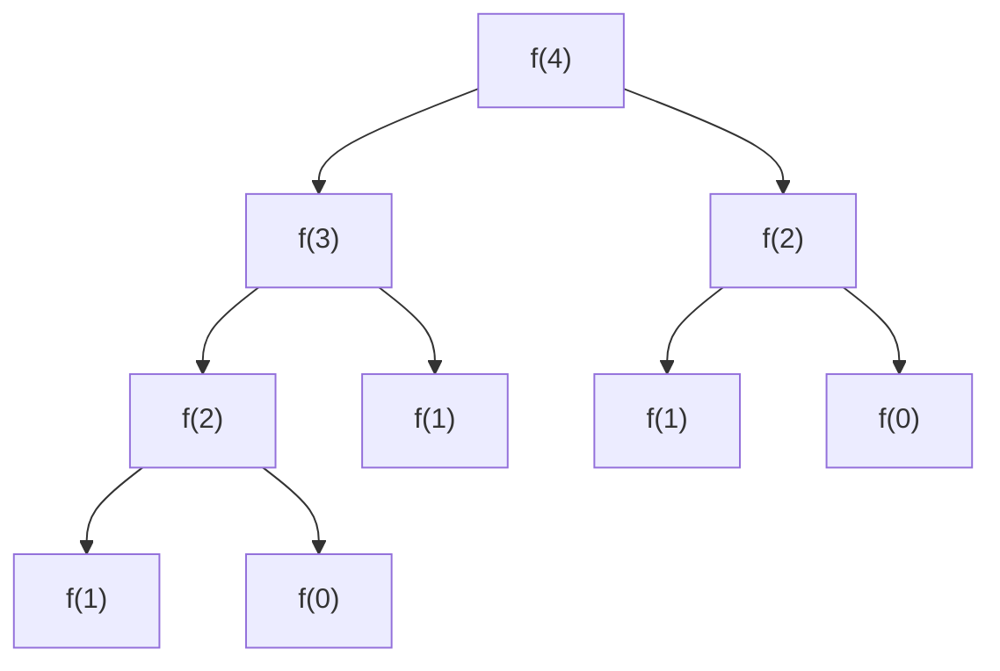
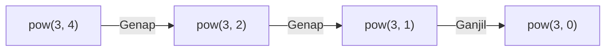
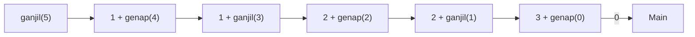
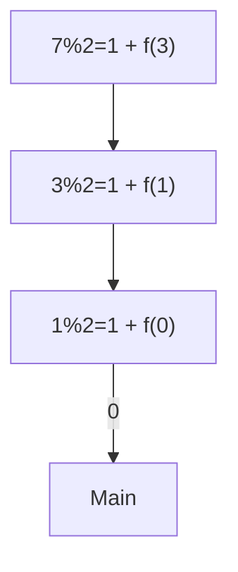
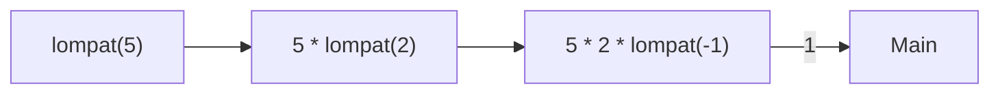
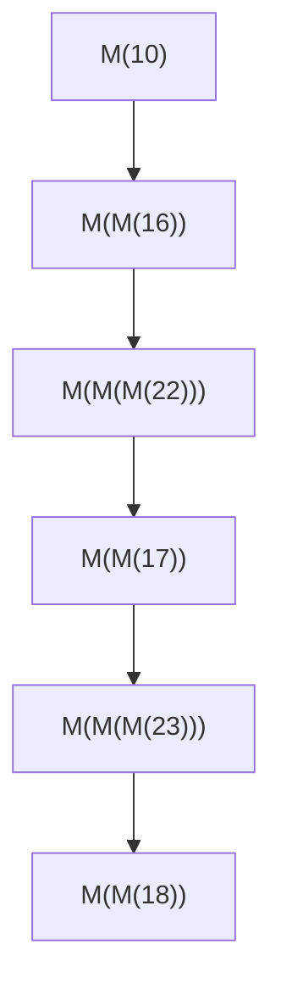

		🔙 **[Kembali ke Daftar Soal](./README.md)**

---

# Latihan Soal Part C - Modul 05 - Set 03 (Premium Edition)

---

### Soal 21: Fibonacci Klasik (Tree Trace)
```cpp
int f(int n) {
    if (n <= 1) return n;
    return f(n-1) + f(n-2);
}

int main() {
    int x = f(4);
}
```
**Pertanyaan:**
1. Berapakah nilai `x`?
2. Berapa kali fungsi `f(0)` dipanggil?

<details>
<summary><b>Klik untuk Lihat Jawaban & Diagnosis</b></summary>

**Mermaid Tree Trace:**


**Jawaban:**
1. **3** (0, 1, 1, 2, 3)
2. **2 kali** (lihat diagram: bercabang dari setiap f(2)).
</details>

---

### Soal 22: Eksponensial Kuadrat (Power Optimization)
```cpp
int pow(int a, int b) {
    if (b == 0) return 1;
    if (b % 2 == 0) {
        int temp = pow(a, b/2);
        return temp * temp;
    }
    return a * pow(a, b-1);
}

int main() {
    int hasil = pow(3, 4);
}
```
**Pertanyaan:**
1. Berapakah nilai `hasil`?
2. Jalur mana yang diambil saat `b = 4`? (Opsi genap atau ganjil?)

<details>
<summary><b>Klik untuk Lihat Jawaban & Diagnosis</b></summary>

**Mermaid Trace:**


**Jawaban:**
1. **81** ($3^4$)
2. **Opsi Genap.** Ia akan memanggil `pow(3, 2)` lalu hasilnya dikuadratkan.
</details>

---

### Soal 23: Kombinasi Pascal (nCr Recursion)
```cpp
int C(int n, int r) {
    if (r == 0 || r == n) return 1;
    return C(n-1, r-1) + C(n-1, r);
}

int main() {
    int x = C(4, 2);
}
```
**Pertanyaan:**
1. Berapakah nilai `x`?
2. Rumus matematika apa yang setara dengan fungsi ini?

<details>
<summary><b>Klik untuk Lihat Jawaban & Diagnosis</b></summary>

**Jawaban:**
1. **6**
2. **Kombinasi** atau Koefisien Binomial. ($4C2 = \frac{4!}{2!2!} = 6$).
</details>

---

### Soal 24: ⚠️ Jalur Ganda (Mutual Tail?)
```cpp
int ganjil(int n);
int genap(int n);

int ganjil(int n) {
    if (n <= 0) return 0;
    return 1 + genap(n - 1);
}

int genap(int n) {
    if (n <= 0) return 0;
    return ganjil(n - 1);
}

int main() {
    int x = ganjil(5);
}
```
**Pertanyaan:**
1. Berapakah nilai `x`?
2. Apa istilah untuk dua fungsi yang saling memanggil seperti ini?

<details>
<summary><b>Klik untuk Lihat Jawaban & Diagnosis</b></summary>

**Mermaid Flow:**


**Jawaban:**
1. **3**
2. **Indirect Recursion** (Rekursi Tidak Langsung).
</details>

---

### Soal 25: Pangkat Tiga Berantai
```cpp
int pangkat3(int n) {
    if (n == 0) return 0;
    return n*n*n + pangkat3(n - 1);
}

int main() {
    int hasil = pangkat3(2);
}
```
**Pertanyaan:**
1. Berapakah nilai `hasil`?
2. Tunjukkan urutan penjumlahannya!

<details>
<summary><b>Klik untuk Lihat Jawaban & Diagnosis</b></summary>

**Jawaban:**
1. **9**
2. $2^3 + 1^3 + 0 = 8 + 1 = 9$.
</details>

---

### Soal 26: Pencacah Biner (Binary Count)
```cpp
int count_bit(int n) {
    if (n == 0) return 0;
    return (n % 2) + count_bit(n / 2);
}

int main() {
    int x = count_bit(7);
}
```
**Pertanyaan:**
1. Berapakah nilai `x`?
2. Berapa jumlah bit '1' pada angka 7 dalam biner?

<details>
<summary><b>Klik untuk Lihat Jawaban & Diagnosis</b></summary>

**Mermaid Trace:**


**Jawaban:**
1. **3**
2. **3** (111). Fungsi ini menghitung jumlah populasi bit (set bits).
</details>

---

### Soal 27: Misteri Indeks Terakhir
```cpp
int cari_max(int a[], int n) {
    if (n == 0) return a[0];
    int m = cari_max(a, n - 1);
    return (a[n] > m) ? a[n] : m;
}

int main() {
    int data[] = {5, 12, 8};
    int r = cari_max(data, 2);
}
```
**Pertanyaan:**
1. Berapakah nilai `r`?
2. Apa yang ditaruh di variabel `m` saat `n = 1`?

<details>
<summary><b>Klik untuk Lihat Jawaban & Diagnosis</b></summary>

**Jawaban:**
1. **12**
2. **5** (Hasil dari `cari_max` untuk indeks 0).
</details>

---

### Soal 28: ⚠️ Skip Step Rekursi
```cpp
int lompat(int n) {
    if (n <= 0) return 1;
    return n * lompat(n - 3);
}

int main() {
    int x = lompat(5);
}
```
**Pertanyaan:**
1. Berapakah nilai `x`?
2. Berapa nilai `n` pada panggilan rekursi terakhir sebelum Base Case?

<details>
<summary><b>Klik untuk Lihat Jawaban & Diagnosis</b></summary>

**Mermaid Trace:**


**Jawaban:**
1. **10**
2. **-1** (Karena 2 - 3 = -1, dan -1 <= 0 memenuhi Base Case).
</details>

---

### Soal 29: String Palindrome Rec
```cpp
bool is_palin(string s, int f, int l) {
    if (f >= l) return true;
    if (s[f] != s[l]) return false;
    return is_palin(s, f + 1, l - 1);
}

int main() {
    bool r = is_palin("RADAR", 0, 4);
}
```
**Pertanyaan:**
1. Berapakah nilai `r` (true/false)?
2. Apa kondisi berhenti jika string tersebut **bukan** palindrome?

<details>
<summary><b>Klik untuk Lihat Jawaban & Diagnosis</b></summary>

**Jawaban:**
1. **true**
2. `s[f] != s[l]` (Karakter depan tidak sama dengan karakter belakang).
</details>

---

### Soal 30: Grand Final (McCarthy 91 Simple)
```cpp
int M(int n) {
    if (n > 20) return n - 5;
    return M(M(n + 6));
}

int main() {
    int res = M(10);
}
```
**Pertanyaan:**
1. Berapakah nilai `res`?
2. Berapa kali fungsi `M` dipanggil (estimasi)?

<details>
<summary><b>Klik untuk Lihat Jawaban & Diagnosis</b></summary>

**Mermaid Trace:**


**Jawaban:**
1. **16**
2. **Banyak.** Ini adalah versi sederhana dari fungsi McCarthy yang terkenal dengan rekursi bersarangnya (*Nested Recursion*).
   - M(10) -> M(M(16)) -> M(M(M(22))) -> M(M(17)) -> M(M(M(23))) -> M(M(18)) ... akhirnya akan keluar di angka 16.
</details>
