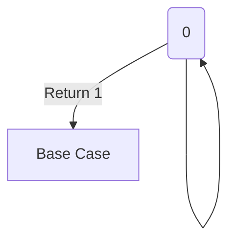

🔙 **[Kembali ke Daftar Soal](./README.md)**

---

# Latihan Soal Part C - Modul 05 - Set 04

### Soal 76 (Factorial Trace)
```cpp
int f(int n) {
    if (n == 0) return 1;
    return n * f(n - 1);
}
// f(3) = ?
```
**Pertanyaan:**
1. Berapakah hasil akhir dari `f(3)`?
2. Berapa kali fungsi `f` dipanggil total?
3. Apa yang terjadi jika baris `if (n == 0) return 1;` dihapus?

**Jawaban & Diagnosis:**
1. **6**
2. **4**
3. **Infinite Recursion (Stack Overflow) karena tidak ada pintu keluar.**

**Mermaid Flowchart:**


**📖 Cara Membaca Diagram:**
Mulai f(3). Turun ke f(2)... sampai f(0)=1. Balik lunas: 1 * 2 * ... * 3 = 6.

---
### Soal 77 (Factorial Trace)
```cpp
int f(int n) {
    if (n == 0) return 1;
    return n * f(n - 1);
}
// f(3) = ?
```
**Pertanyaan:**
1. Berapakah hasil akhir dari `f(3)`?
2. Berapa kali fungsi `f` dipanggil total?
3. Apa yang terjadi jika baris `if (n == 0) return 1;` dihapus?

**Jawaban & Diagnosis:**
1. **6**
2. **4**
3. **Infinite Recursion (Stack Overflow) karena tidak ada pintu keluar.**

**Mermaid Flowchart:**


**📖 Cara Membaca Diagram:**
Mulai f(3). Turun ke f(2)... sampai f(0)=1. Balik lunas: 1 * 2 * ... * 3 = 6.

---
### Soal 78 (Fibonacci Branch)
```cpp
int fib(int n) {
    if (n <= 1) return n;
    return fib(n-1) + fib(n-2);
}
// fib(4) = ?
```
**Pertanyaan:**
1. Berapakah nilai `fib(4)`?
2. Mengapa rekursi ini disebut rekursi bercabang?
3. Apa analogi yang paling tepat untuk rekursi?

**Jawaban & Diagnosis:**
1. **3**
2. **Karena satu fungsi memanggil dua fungsi lainnya sekaligus.**
3. **Tugas Berantai Minta Uang Jajan (Mundur ke Ayah, balik cair ke Adik).**

**Mermaid Flowchart:**
```mermaid
graph TD
    A[fib(4)] --> B[fib(3)]
    A --> C[fib(2)]
```

**📖 Cara Membaca Diagram:**
fib(4) pecah jadi fib(3) dan fib(2). Terus pecah sampai n=1 atau n=0 (Base case).

---
### Soal 79 (Power Trace)
```cpp
int p(int x, int y) {
    if (y == 0) return 1;
    return x * p(x, y-1);
}
// p(2, 4) = ?
```
**Pertanyaan:**
1. Berapakah hasil `p(2, 4)`?
2. Fungsi di atas sebenarnya menghitung apa?
3. Berapa nilai `y` pada pemanggilan rekursi paling terakhir (base case)?

**Jawaban & Diagnosis:**
1. **16**
2. **Perpangkatan (Power).**
3. **0**

**Mermaid Flowchart:**
```mermaid
graph TD
    A[p(2,3)] --> B[p(2,2)]
    B --> C[p(2,1)]
    C --> D[p(2,0)]
    D -->|1| C
    C -->|2| B
    B -->|4| A
    A -->|8| res
```

**📖 Cara Membaca Diagram:**
2 * 2 * ... dikalikan 4 kali sampai base case y=0.

---
### Soal 80 (Power Trace)
```cpp
int p(int x, int y) {
    if (y == 0) return 1;
    return x * p(x, y-1);
}
// p(2, 5) = ?
```
**Pertanyaan:**
1. Berapakah hasil `p(2, 5)`?
2. Fungsi di atas sebenarnya menghitung apa?
3. Berapa nilai `y` pada pemanggilan rekursi paling terakhir (base case)?

**Jawaban & Diagnosis:**
1. **32**
2. **Perpangkatan (Power).**
3. **0**

**Mermaid Flowchart:**
```mermaid
graph TD
    A[p(2,3)] --> B[p(2,2)]
    B --> C[p(2,1)]
    C --> D[p(2,0)]
    D -->|1| C
    C -->|2| B
    B -->|4| A
    A -->|8| res
```

**📖 Cara Membaca Diagram:**
2 * 2 * ... dikalikan 5 kali sampai base case y=0.

---
### Soal 81 (Power Trace)
```cpp
int p(int x, int y) {
    if (y == 0) return 1;
    return x * p(x, y-1);
}
// p(2, 3) = ?
```
**Pertanyaan:**
1. Berapakah hasil `p(2, 3)`?
2. Fungsi di atas sebenarnya menghitung apa?
3. Berapa nilai `y` pada pemanggilan rekursi paling terakhir (base case)?

**Jawaban & Diagnosis:**
1. **8**
2. **Perpangkatan (Power).**
3. **0**

**Mermaid Flowchart:**
```mermaid
graph TD
    A[p(2,3)] --> B[p(2,2)]
    B --> C[p(2,1)]
    C --> D[p(2,0)]
    D -->|1| C
    C -->|2| B
    B -->|4| A
    A -->|8| res
```

**📖 Cara Membaca Diagram:**
2 * 2 * ... dikalikan 3 kali sampai base case y=0.

---
### Soal 82 (Base Case Error)
```cpp
int f(int n) {
    return n + f(n - 1);
}
// main: f(5);
```
**Pertanyaan:**
1. Apa output dari pemanggilan `f(5)`?
2. Apa yang hilang dari fungsi tersebut?
3. Apa dampak dari 'Base Case' yang hilang?

**Jawaban & Diagnosis:**
1. **Program Error / Stack Overflow / Tidak Berhenti.**
2. **Base Case (Kondisi Berhenti).**
3. **Memory Call Stack penuh dan program hancur (Crash).**

**Mermaid Flowchart:**
```mermaid
graph TD
    A[f(5)] --> B[f(4)]
    B --> C[f(3)]
    C --> D[...] 
    D --> E[Kiamat Memori]
```

**📖 Cara Membaca Diagram:**
Fungsi memanggil dirinya sendiri terus menerus tanpa henti sampai memori habis.

---
### Soal 83 (Power Trace)
```cpp
int p(int x, int y) {
    if (y == 0) return 1;
    return x * p(x, y-1);
}
// p(2, 4) = ?
```
**Pertanyaan:**
1. Berapakah hasil `p(2, 4)`?
2. Fungsi di atas sebenarnya menghitung apa?
3. Berapa nilai `y` pada pemanggilan rekursi paling terakhir (base case)?

**Jawaban & Diagnosis:**
1. **16**
2. **Perpangkatan (Power).**
3. **0**

**Mermaid Flowchart:**
```mermaid
graph TD
    A[p(2,3)] --> B[p(2,2)]
    B --> C[p(2,1)]
    C --> D[p(2,0)]
    D -->|1| C
    C -->|2| B
    B -->|4| A
    A -->|8| res
```

**📖 Cara Membaca Diagram:**
2 * 2 * ... dikalikan 4 kali sampai base case y=0.

---
### Soal 84 (Fibonacci Branch)
```cpp
int fib(int n) {
    if (n <= 1) return n;
    return fib(n-1) + fib(n-2);
}
// fib(3) = ?
```
**Pertanyaan:**
1. Berapakah nilai `fib(3)`?
2. Mengapa rekursi ini disebut rekursi bercabang?
3. Apa analogi yang paling tepat untuk rekursi?

**Jawaban & Diagnosis:**
1. **2**
2. **Karena satu fungsi memanggil dua fungsi lainnya sekaligus.**
3. **Tugas Berantai Minta Uang Jajan (Mundur ke Ayah, balik cair ke Adik).**

**Mermaid Flowchart:**
```mermaid
graph TD
    A[fib(3)] --> B[fib(2)]
    A --> C[fib(1)]
```

**📖 Cara Membaca Diagram:**
fib(3) pecah jadi fib(2) dan fib(1). Terus pecah sampai n=1 atau n=0 (Base case).

---
### Soal 85 (Factorial Trace)
```cpp
int f(int n) {
    if (n == 0) return 1;
    return n * f(n - 1);
}
// f(3) = ?
```
**Pertanyaan:**
1. Berapakah hasil akhir dari `f(3)`?
2. Berapa kali fungsi `f` dipanggil total?
3. Apa yang terjadi jika baris `if (n == 0) return 1;` dihapus?

**Jawaban & Diagnosis:**
1. **6**
2. **4**
3. **Infinite Recursion (Stack Overflow) karena tidak ada pintu keluar.**

**Mermaid Flowchart:**


**📖 Cara Membaca Diagram:**
Mulai f(3). Turun ke f(2)... sampai f(0)=1. Balik lunas: 1 * 2 * ... * 3 = 6.

---
### Soal 86 (Power Trace)
```cpp
int p(int x, int y) {
    if (y == 0) return 1;
    return x * p(x, y-1);
}
// p(2, 4) = ?
```
**Pertanyaan:**
1. Berapakah hasil `p(2, 4)`?
2. Fungsi di atas sebenarnya menghitung apa?
3. Berapa nilai `y` pada pemanggilan rekursi paling terakhir (base case)?

**Jawaban & Diagnosis:**
1. **16**
2. **Perpangkatan (Power).**
3. **0**

**Mermaid Flowchart:**
```mermaid
graph TD
    A[p(2,3)] --> B[p(2,2)]
    B --> C[p(2,1)]
    C --> D[p(2,0)]
    D -->|1| C
    C -->|2| B
    B -->|4| A
    A -->|8| res
```

**📖 Cara Membaca Diagram:**
2 * 2 * ... dikalikan 4 kali sampai base case y=0.

---
### Soal 87 (Fibonacci Branch)
```cpp
int fib(int n) {
    if (n <= 1) return n;
    return fib(n-1) + fib(n-2);
}
// fib(4) = ?
```
**Pertanyaan:**
1. Berapakah nilai `fib(4)`?
2. Mengapa rekursi ini disebut rekursi bercabang?
3. Apa analogi yang paling tepat untuk rekursi?

**Jawaban & Diagnosis:**
1. **3**
2. **Karena satu fungsi memanggil dua fungsi lainnya sekaligus.**
3. **Tugas Berantai Minta Uang Jajan (Mundur ke Ayah, balik cair ke Adik).**

**Mermaid Flowchart:**
```mermaid
graph TD
    A[fib(4)] --> B[fib(3)]
    A --> C[fib(2)]
```

**📖 Cara Membaca Diagram:**
fib(4) pecah jadi fib(3) dan fib(2). Terus pecah sampai n=1 atau n=0 (Base case).

---
### Soal 88 (Power Trace)
```cpp
int p(int x, int y) {
    if (y == 0) return 1;
    return x * p(x, y-1);
}
// p(2, 3) = ?
```
**Pertanyaan:**
1. Berapakah hasil `p(2, 3)`?
2. Fungsi di atas sebenarnya menghitung apa?
3. Berapa nilai `y` pada pemanggilan rekursi paling terakhir (base case)?

**Jawaban & Diagnosis:**
1. **8**
2. **Perpangkatan (Power).**
3. **0**

**Mermaid Flowchart:**
```mermaid
graph TD
    A[p(2,3)] --> B[p(2,2)]
    B --> C[p(2,1)]
    C --> D[p(2,0)]
    D -->|1| C
    C -->|2| B
    B -->|4| A
    A -->|8| res
```

**📖 Cara Membaca Diagram:**
2 * 2 * ... dikalikan 3 kali sampai base case y=0.

---
### Soal 89 (Fibonacci Branch)
```cpp
int fib(int n) {
    if (n <= 1) return n;
    return fib(n-1) + fib(n-2);
}
// fib(3) = ?
```
**Pertanyaan:**
1. Berapakah nilai `fib(3)`?
2. Mengapa rekursi ini disebut rekursi bercabang?
3. Apa analogi yang paling tepat untuk rekursi?

**Jawaban & Diagnosis:**
1. **2**
2. **Karena satu fungsi memanggil dua fungsi lainnya sekaligus.**
3. **Tugas Berantai Minta Uang Jajan (Mundur ke Ayah, balik cair ke Adik).**

**Mermaid Flowchart:**
```mermaid
graph TD
    A[fib(3)] --> B[fib(2)]
    A --> C[fib(1)]
```

**📖 Cara Membaca Diagram:**
fib(3) pecah jadi fib(2) dan fib(1). Terus pecah sampai n=1 atau n=0 (Base case).

---
### Soal 90 (Power Trace)
```cpp
int p(int x, int y) {
    if (y == 0) return 1;
    return x * p(x, y-1);
}
// p(2, 5) = ?
```
**Pertanyaan:**
1. Berapakah hasil `p(2, 5)`?
2. Fungsi di atas sebenarnya menghitung apa?
3. Berapa nilai `y` pada pemanggilan rekursi paling terakhir (base case)?

**Jawaban & Diagnosis:**
1. **32**
2. **Perpangkatan (Power).**
3. **0**

**Mermaid Flowchart:**
```mermaid
graph TD
    A[p(2,3)] --> B[p(2,2)]
    B --> C[p(2,1)]
    C --> D[p(2,0)]
    D -->|1| C
    C -->|2| B
    B -->|4| A
    A -->|8| res
```

**📖 Cara Membaca Diagram:**
2 * 2 * ... dikalikan 5 kali sampai base case y=0.

---
### Soal 91 (Factorial Trace)
```cpp
int f(int n) {
    if (n == 0) return 1;
    return n * f(n - 1);
}
// f(4) = ?
```
**Pertanyaan:**
1. Berapakah hasil akhir dari `f(4)`?
2. Berapa kali fungsi `f` dipanggil total?
3. Apa yang terjadi jika baris `if (n == 0) return 1;` dihapus?

**Jawaban & Diagnosis:**
1. **24**
2. **5**
3. **Infinite Recursion (Stack Overflow) karena tidak ada pintu keluar.**

**Mermaid Flowchart:**


**📖 Cara Membaca Diagram:**
Mulai f(4). Turun ke f(3)... sampai f(0)=1. Balik lunas: 1 * 2 * ... * 4 = 24.

---
### Soal 92 (Power Trace)
```cpp
int p(int x, int y) {
    if (y == 0) return 1;
    return x * p(x, y-1);
}
// p(2, 3) = ?
```
**Pertanyaan:**
1. Berapakah hasil `p(2, 3)`?
2. Fungsi di atas sebenarnya menghitung apa?
3. Berapa nilai `y` pada pemanggilan rekursi paling terakhir (base case)?

**Jawaban & Diagnosis:**
1. **8**
2. **Perpangkatan (Power).**
3. **0**

**Mermaid Flowchart:**
```mermaid
graph TD
    A[p(2,3)] --> B[p(2,2)]
    B --> C[p(2,1)]
    C --> D[p(2,0)]
    D -->|1| C
    C -->|2| B
    B -->|4| A
    A -->|8| res
```

**📖 Cara Membaca Diagram:**
2 * 2 * ... dikalikan 3 kali sampai base case y=0.

---
### Soal 93 (Factorial Trace)
```cpp
int f(int n) {
    if (n == 0) return 1;
    return n * f(n - 1);
}
// f(4) = ?
```
**Pertanyaan:**
1. Berapakah hasil akhir dari `f(4)`?
2. Berapa kali fungsi `f` dipanggil total?
3. Apa yang terjadi jika baris `if (n == 0) return 1;` dihapus?

**Jawaban & Diagnosis:**
1. **24**
2. **5**
3. **Infinite Recursion (Stack Overflow) karena tidak ada pintu keluar.**

**Mermaid Flowchart:**


**📖 Cara Membaca Diagram:**
Mulai f(4). Turun ke f(3)... sampai f(0)=1. Balik lunas: 1 * 2 * ... * 4 = 24.

---
### Soal 94 (Fibonacci Branch)
```cpp
int fib(int n) {
    if (n <= 1) return n;
    return fib(n-1) + fib(n-2);
}
// fib(3) = ?
```
**Pertanyaan:**
1. Berapakah nilai `fib(3)`?
2. Mengapa rekursi ini disebut rekursi bercabang?
3. Apa analogi yang paling tepat untuk rekursi?

**Jawaban & Diagnosis:**
1. **2**
2. **Karena satu fungsi memanggil dua fungsi lainnya sekaligus.**
3. **Tugas Berantai Minta Uang Jajan (Mundur ke Ayah, balik cair ke Adik).**

**Mermaid Flowchart:**
```mermaid
graph TD
    A[fib(3)] --> B[fib(2)]
    A --> C[fib(1)]
```

**📖 Cara Membaca Diagram:**
fib(3) pecah jadi fib(2) dan fib(1). Terus pecah sampai n=1 atau n=0 (Base case).

---
### Soal 95 (Power Trace)
```cpp
int p(int x, int y) {
    if (y == 0) return 1;
    return x * p(x, y-1);
}
// p(2, 5) = ?
```
**Pertanyaan:**
1. Berapakah hasil `p(2, 5)`?
2. Fungsi di atas sebenarnya menghitung apa?
3. Berapa nilai `y` pada pemanggilan rekursi paling terakhir (base case)?

**Jawaban & Diagnosis:**
1. **32**
2. **Perpangkatan (Power).**
3. **0**

**Mermaid Flowchart:**
```mermaid
graph TD
    A[p(2,3)] --> B[p(2,2)]
    B --> C[p(2,1)]
    C --> D[p(2,0)]
    D -->|1| C
    C -->|2| B
    B -->|4| A
    A -->|8| res
```

**📖 Cara Membaca Diagram:**
2 * 2 * ... dikalikan 5 kali sampai base case y=0.

---
### Soal 96 (Base Case Error)
```cpp
int f(int n) {
    return n + f(n - 1);
}
// main: f(5);
```
**Pertanyaan:**
1. Apa output dari pemanggilan `f(5)`?
2. Apa yang hilang dari fungsi tersebut?
3. Apa dampak dari 'Base Case' yang hilang?

**Jawaban & Diagnosis:**
1. **Program Error / Stack Overflow / Tidak Berhenti.**
2. **Base Case (Kondisi Berhenti).**
3. **Memory Call Stack penuh dan program hancur (Crash).**

**Mermaid Flowchart:**
```mermaid
graph TD
    A[f(5)] --> B[f(4)]
    B --> C[f(3)]
    C --> D[...] 
    D --> E[Kiamat Memori]
```

**📖 Cara Membaca Diagram:**
Fungsi memanggil dirinya sendiri terus menerus tanpa henti sampai memori habis.

---
### Soal 97 (Power Trace)
```cpp
int p(int x, int y) {
    if (y == 0) return 1;
    return x * p(x, y-1);
}
// p(2, 3) = ?
```
**Pertanyaan:**
1. Berapakah hasil `p(2, 3)`?
2. Fungsi di atas sebenarnya menghitung apa?
3. Berapa nilai `y` pada pemanggilan rekursi paling terakhir (base case)?

**Jawaban & Diagnosis:**
1. **8**
2. **Perpangkatan (Power).**
3. **0**

**Mermaid Flowchart:**
```mermaid
graph TD
    A[p(2,3)] --> B[p(2,2)]
    B --> C[p(2,1)]
    C --> D[p(2,0)]
    D -->|1| C
    C -->|2| B
    B -->|4| A
    A -->|8| res
```

**📖 Cara Membaca Diagram:**
2 * 2 * ... dikalikan 3 kali sampai base case y=0.

---
### Soal 98 (Fibonacci Branch)
```cpp
int fib(int n) {
    if (n <= 1) return n;
    return fib(n-1) + fib(n-2);
}
// fib(3) = ?
```
**Pertanyaan:**
1. Berapakah nilai `fib(3)`?
2. Mengapa rekursi ini disebut rekursi bercabang?
3. Apa analogi yang paling tepat untuk rekursi?

**Jawaban & Diagnosis:**
1. **2**
2. **Karena satu fungsi memanggil dua fungsi lainnya sekaligus.**
3. **Tugas Berantai Minta Uang Jajan (Mundur ke Ayah, balik cair ke Adik).**

**Mermaid Flowchart:**
```mermaid
graph TD
    A[fib(3)] --> B[fib(2)]
    A --> C[fib(1)]
```

**📖 Cara Membaca Diagram:**
fib(3) pecah jadi fib(2) dan fib(1). Terus pecah sampai n=1 atau n=0 (Base case).

---
### Soal 99 (Power Trace)
```cpp
int p(int x, int y) {
    if (y == 0) return 1;
    return x * p(x, y-1);
}
// p(2, 5) = ?
```
**Pertanyaan:**
1. Berapakah hasil `p(2, 5)`?
2. Fungsi di atas sebenarnya menghitung apa?
3. Berapa nilai `y` pada pemanggilan rekursi paling terakhir (base case)?

**Jawaban & Diagnosis:**
1. **32**
2. **Perpangkatan (Power).**
3. **0**

**Mermaid Flowchart:**
```mermaid
graph TD
    A[p(2,3)] --> B[p(2,2)]
    B --> C[p(2,1)]
    C --> D[p(2,0)]
    D -->|1| C
    C -->|2| B
    B -->|4| A
    A -->|8| res
```

**📖 Cara Membaca Diagram:**
2 * 2 * ... dikalikan 5 kali sampai base case y=0.

---
### Soal 100 (Base Case Error)
```cpp
int f(int n) {
    return n + f(n - 1);
}
// main: f(5);
```
**Pertanyaan:**
1. Apa output dari pemanggilan `f(5)`?
2. Apa yang hilang dari fungsi tersebut?
3. Apa dampak dari 'Base Case' yang hilang?

**Jawaban & Diagnosis:**
1. **Program Error / Stack Overflow / Tidak Berhenti.**
2. **Base Case (Kondisi Berhenti).**
3. **Memory Call Stack penuh dan program hancur (Crash).**

**Mermaid Flowchart:**
```mermaid
graph TD
    A[f(5)] --> B[f(4)]
    B --> C[f(3)]
    C --> D[...] 
    D --> E[Kiamat Memori]
```

**📖 Cara Membaca Diagram:**
Fungsi memanggil dirinya sendiri terus menerus tanpa henti sampai memori habis.

---
