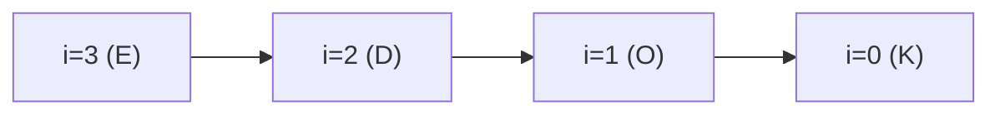
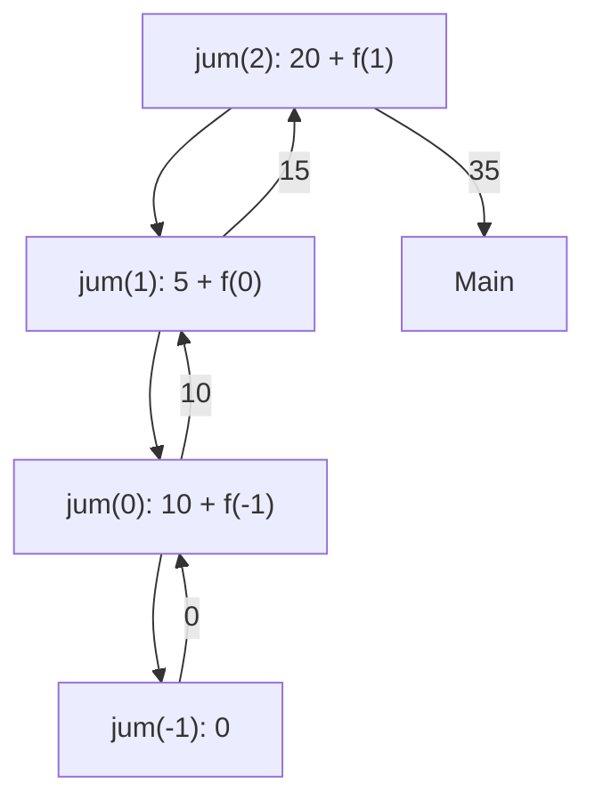
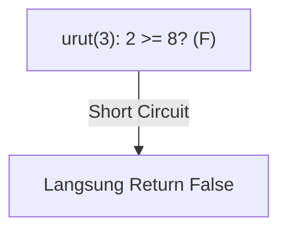
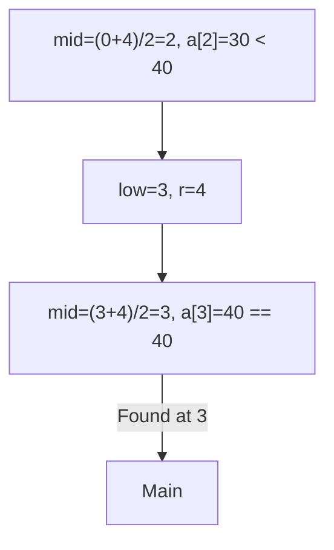

		🔙 **[Kembali ke Daftar Soal](./README.md)**

---

# Latihan Soal Part C - Modul 05 - Set 04 (Premium Edition)

---

### Soal 31: Pembalik Kata (Reverse String)
```cpp
void balik(string s, int i) {
    if (i < 0) return;
    cout << s[i];
    balik(s, i - 1);
}

int main() {
    balik("KODE", 3);
}
```
**Pertanyaan:**
1. Apa output program tersebut?
2. Karakter mana yang pertama kali dicetak?

<details>
<summary><b>Klik untuk Lihat Jawaban & Diagnosis</b></summary>

**Mermaid Call Stack:**


**Jawaban:**
1. **EDOK**
2. **'E'** (indeks ke-3).
</details>

---

### Soal 32: Penghitung Huruf Vokal
```cpp
bool vokal(char c) {
    return (c=='a'||c=='A'); // Sederhana saja
}

int hitung(string s, int i) {
    if (i == s.length()) return 0;
    int tambah = vokal(s[i]) ? 1 : 0;
    return tambah + hitung(s, i + 1);
}

int main() {
    int x = hitung("Awan", 0);
}
```
**Pertanyaan:**
1. Berapakah nilai `x`?
2. Berapa kali fungsi `hitung` dipanggil?

<details>
<summary><b>Klik untuk Lihat Jawaban & Diagnosis</b></summary>

**Jawaban:**
1. **2** (huruf 'A' dan 'a').
2. **5 kali** (indeks 0, 1, 2, 3, dan indeks 4 untuk Base Case).
</details>

---

### Soal 33: Jumlah Isi Loker (Array Sum)
```cpp
int jum(int a[], int n) {
    if (n < 0) return 0;
    return a[n] + jum(a, n - 1);
}

int main() {
    int loker[] = {10, 5, 20};
    int total = jum(loker, 2);
}
```
**Pertanyaan:**
1. Berapakah nilai `total`?
2. Tunjukkan alur penjumlahannya dari Base Case ke atas!

<details>
<summary><b>Klik untuk Lihat Jawaban & Diagnosis</b></summary>

**Mermaid Flow:**


**Jawaban:**
1. **35**
2. $0 \rightarrow 0+10 \rightarrow 10+5 \rightarrow 15+20 = 35$.
</details>

---

### Soal 34: Pencari Nilai Terkecil (Min Array)
```cpp
int cari_min(int a[], int n) {
    if (n == 0) return a[0];
    int m = cari_min(a, n - 1);
    return (a[n] < m) ? a[n] : m;
}

int main() {
    int data[] = {40, 10, 30};
    int r = cari_min(data, 2);
}
```
**Pertanyaan:**
1. Berapakah nilai `r`?
2. Saat `n = 1`, apa nilai yang dibandingkan?

<details>
<summary><b>Klik untuk Lihat Jawaban & Diagnosis</b></summary>

**Jawaban:**
1. **10**
2. **a[1] (yaitu 10)** dibandingkan dengan **m (yaitu 40)**.
</details>

---

### Soal 35: Detektor Urutan (Is Sorted)
```cpp
bool urut(int a[], int n) {
    if (n <= 1) return true;
    return (a[n-1] >= a[n-2]) && urut(a, n - 1);
}

int main() {
    int data[] = {5, 8, 2};
    bool res = urut(data, 3);
}
```
**Pertanyaan:**
1. Berapakah nilai `res` (true/false)?
2. Pada langkah mana fungsi ini mulai menghasilkan `false`?

<details>
<summary><b>Klik untuk Lihat Jawaban & Diagnosis</b></summary>

**Mermaid Trace:**


**Jawaban:**
1. **false**
2. Pada pemanggilan pertama (`n = 3`), karena `a[2] < a[1]` (2 < 8).
</details>

---

### Soal 36: Perkalian Array
```cpp
int kali(int a[], int n) {
    if (n < 0) return 1;
    return a[n] * kali(a, n - 1);
}

int main() {
    int data[] = {2, 3, 4};
    int total = kali(data, 2);
}
```
**Pertanyaan:**
1. Berapakah nilai `total`?
2. Mengapa Base Case mengembalikan 1, bukan 0?

<details>
<summary><b>Klik untuk Lihat Jawaban & Diagnosis</b></summary>

**Jawaban:**
1. **24** (4 * 3 * 2 * 1)
2. Karena jika dikalikan dengan 0, maka seluruh hasil akhirnya akan selalu menjadi 0. Angka 1 adalah **identitas perkalian**.
</details>

---

### Soal 37: Panjang String Manual
```cpp
int hitung(char* s) {
    if (*s == '\0') return 0;
    return 1 + hitung(s + 1);
}

int main() {
    int n = hitung("C++");
}
```
**Pertanyaan:**
1. Berapakah nilai `n`?
2. Apa yang dimaksud dengan `s + 1` pada parameter fungsi tersebut?

<details>
<summary><b>Klik untuk Lihat Jawaban & Diagnosis</b></summary>

**Jawaban:**
1. **3**
2. **Pointer arithmetic.** Menggeser alamat memori ke karakter berikutnya dalam string.
</details>

---

### Soal 38: Filter Huruf (Clean Trace)
```cpp
void bersihkan(string s, int i) {
    if (i == s.length()) return;
    if (s[i] != '*') cout << s[i];
    bersihkan(s, i + 1);
}

int main() {
    bersihkan("A*B*C", 0);
}
```
**Pertanyaan:**
1. Apa output program tersebut?
2. Apa yang dilewati oleh fungsi tersebut?

<details>
<summary><b>Klik untuk Lihat Jawaban & Diagnosis</b></summary>

**Jawaban:**
1. **ABC**
2. Karakter bintang (`*`).
</details>

---

### Soal 39: ⚠️ Rekursi dalam Loop
```cpp
int total = 0;
void loop_rec(int n) {
    if (n <= 0) return;
    for(int i=0; i<n; i++) total++;
    loop_rec(n - 1);
}

int main() {
    loop_rec(3);
}
```
**Pertanyaan:**
1. Berapakah nilai `total` akhir?
2. Berapa kali loop `for` berjalan secara total?

<details>
<summary><b>Klik untuk Lihat Jawaban & Diagnosis</b></summary>

**Jawaban:**
1. **6** (3 + 2 + 1)
2. **3 kali** (panggilan pertama loop n=3, kedua n=2, ketiga n=1).
</details>

---

### Soal 40: Binary Search Rec (Simple)
```cpp
int b_search(int a[], int l, int r, int t) {
    if (l > r) return -1;
    int m = (l + r) / 2;
    if (a[m] == t) return m;
    if (a[m] > t) return b_search(a, l, m - 1, t);
    return b_search(a, m + 1, r, t);
}

int main() {
    int data[] = {10, 20, 30, 40, 50};
    int idx = b_search(data, 0, 4, 40);
}
```
**Pertanyaan:**
1. Berapakah nilai `idx`?
2. Berapa kali fungsi `b_search` dipanggil (termasuk main)?

<details>
<summary><b>Klik untuk Lihat Jawaban & Diagnosis</b></summary>

**Mermaid Trace:**


**Jawaban:**
1. **3**
2. **2 kali.** (Panggilan awal, lalu panggilan ke bagian kanan array).
</details>
