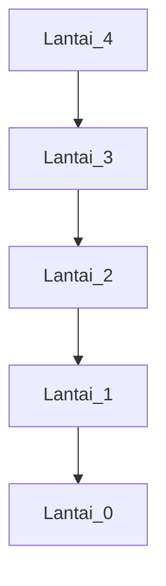
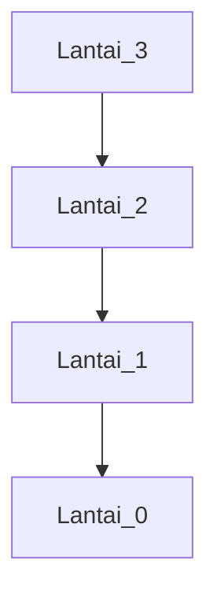

🔙 **[Kembali ke Daftar Soal](./README.md)**

---

# Latihan Soal Part C - Modul 05 - Set 05

### Soal 101
```cpp
int tangga(int n) {
  if (n <= 1) return 1;
  return n + tangga(n-1);
}
// panggil: tangga(4);
```
**Pertanyaan:**
1. Berapakah hasil akhirnya?
2. Deskripsikan langkah robot compiler saat memproses kode ini!

**Jawaban & Diagnosis:**
1. **10**
2. Baca bagian 'Analisis Mendalam' di bawah.

**Mermaid Flowchart:**


**📖 Penjelasan Komprehensif:**
**Analisis Mendalam (Compiler Manusia):**
1. **Analogi Tangga**: Kita menuruni lantai 4 satu per satu.
2. **Call Stack**: Mesin mengingat setiap lantai yang dilewati (n=4, n=3...).
3. **Landing**: Sampai di lantai 1 (Base Case), mesin mulai menjumlahkan seluruh energi yang dikeluarkan.
4. **Hasil Akhir**: Nilai kembalian total adalah **10**.

---
### Soal 102
```cpp
int tangga(int n) {
  if (n <= 1) return 1;
  return n + tangga(n-1);
}
// panggil: tangga(3);
```
**Pertanyaan:**
1. Berapakah hasil akhirnya?
2. Deskripsikan langkah robot compiler saat memproses kode ini!

**Jawaban & Diagnosis:**
1. **6**
2. Baca bagian 'Analisis Mendalam' di bawah.

**Mermaid Flowchart:**


**📖 Penjelasan Komprehensif:**
**Analisis Mendalam (Compiler Manusia):**
1. **Analogi Tangga**: Kita menuruni lantai 3 satu per satu.
2. **Call Stack**: Mesin mengingat setiap lantai yang dilewati (n=3, n=2...).
3. **Landing**: Sampai di lantai 1 (Base Case), mesin mulai menjumlahkan seluruh energi yang dikeluarkan.
4. **Hasil Akhir**: Nilai kembalian total adalah **6**.

---
### Soal 103
```cpp
int tangga(int n) {
  if (n <= 1) return 1;
  return n + tangga(n-1);
}
// panggil: tangga(4);
```
**Pertanyaan:**
1. Berapakah hasil akhirnya?
2. Deskripsikan langkah robot compiler saat memproses kode ini!

**Jawaban & Diagnosis:**
1. **10**
2. Baca bagian 'Analisis Mendalam' di bawah.

**Mermaid Flowchart:**


**📖 Penjelasan Komprehensif:**
**Analisis Mendalam (Compiler Manusia):**
1. **Analogi Tangga**: Kita menuruni lantai 4 satu per satu.
2. **Call Stack**: Mesin mengingat setiap lantai yang dilewati (n=4, n=3...).
3. **Landing**: Sampai di lantai 1 (Base Case), mesin mulai menjumlahkan seluruh energi yang dikeluarkan.
4. **Hasil Akhir**: Nilai kembalian total adalah **10**.

---
### Soal 104
```cpp
int tangga(int n) {
  if (n <= 1) return 1;
  return n + tangga(n-1);
}
// panggil: tangga(4);
```
**Pertanyaan:**
1. Berapakah hasil akhirnya?
2. Deskripsikan langkah robot compiler saat memproses kode ini!

**Jawaban & Diagnosis:**
1. **10**
2. Baca bagian 'Analisis Mendalam' di bawah.

**Mermaid Flowchart:**


**📖 Penjelasan Komprehensif:**
**Analisis Mendalam (Compiler Manusia):**
1. **Analogi Tangga**: Kita menuruni lantai 4 satu per satu.
2. **Call Stack**: Mesin mengingat setiap lantai yang dilewati (n=4, n=3...).
3. **Landing**: Sampai di lantai 1 (Base Case), mesin mulai menjumlahkan seluruh energi yang dikeluarkan.
4. **Hasil Akhir**: Nilai kembalian total adalah **10**.

---
### Soal 105
```cpp
int tangga(int n) {
  if (n <= 1) return 1;
  return n + tangga(n-1);
}
// panggil: tangga(4);
```
**Pertanyaan:**
1. Berapakah hasil akhirnya?
2. Deskripsikan langkah robot compiler saat memproses kode ini!

**Jawaban & Diagnosis:**
1. **10**
2. Baca bagian 'Analisis Mendalam' di bawah.

**Mermaid Flowchart:**


**📖 Penjelasan Komprehensif:**
**Analisis Mendalam (Compiler Manusia):**
1. **Analogi Tangga**: Kita menuruni lantai 4 satu per satu.
2. **Call Stack**: Mesin mengingat setiap lantai yang dilewati (n=4, n=3...).
3. **Landing**: Sampai di lantai 1 (Base Case), mesin mulai menjumlahkan seluruh energi yang dikeluarkan.
4. **Hasil Akhir**: Nilai kembalian total adalah **10**.

---
### Soal 106
```cpp
int tangga(int n) {
  if (n <= 1) return 1;
  return n + tangga(n-1);
}
// panggil: tangga(4);
```
**Pertanyaan:**
1. Berapakah hasil akhirnya?
2. Deskripsikan langkah robot compiler saat memproses kode ini!

**Jawaban & Diagnosis:**
1. **10**
2. Baca bagian 'Analisis Mendalam' di bawah.

**Mermaid Flowchart:**


**📖 Penjelasan Komprehensif:**
**Analisis Mendalam (Compiler Manusia):**
1. **Analogi Tangga**: Kita menuruni lantai 4 satu per satu.
2. **Call Stack**: Mesin mengingat setiap lantai yang dilewati (n=4, n=3...).
3. **Landing**: Sampai di lantai 1 (Base Case), mesin mulai menjumlahkan seluruh energi yang dikeluarkan.
4. **Hasil Akhir**: Nilai kembalian total adalah **10**.

---
### Soal 107
```cpp
int tangga(int n) {
  if (n <= 1) return 1;
  return n + tangga(n-1);
}
// panggil: tangga(4);
```
**Pertanyaan:**
1. Berapakah hasil akhirnya?
2. Deskripsikan langkah robot compiler saat memproses kode ini!

**Jawaban & Diagnosis:**
1. **10**
2. Baca bagian 'Analisis Mendalam' di bawah.

**Mermaid Flowchart:**


**📖 Penjelasan Komprehensif:**
**Analisis Mendalam (Compiler Manusia):**
1. **Analogi Tangga**: Kita menuruni lantai 4 satu per satu.
2. **Call Stack**: Mesin mengingat setiap lantai yang dilewati (n=4, n=3...).
3. **Landing**: Sampai di lantai 1 (Base Case), mesin mulai menjumlahkan seluruh energi yang dikeluarkan.
4. **Hasil Akhir**: Nilai kembalian total adalah **10**.

---
### Soal 108
```cpp
int tangga(int n) {
  if (n <= 1) return 1;
  return n + tangga(n-1);
}
// panggil: tangga(3);
```
**Pertanyaan:**
1. Berapakah hasil akhirnya?
2. Deskripsikan langkah robot compiler saat memproses kode ini!

**Jawaban & Diagnosis:**
1. **6**
2. Baca bagian 'Analisis Mendalam' di bawah.

**Mermaid Flowchart:**


**📖 Penjelasan Komprehensif:**
**Analisis Mendalam (Compiler Manusia):**
1. **Analogi Tangga**: Kita menuruni lantai 3 satu per satu.
2. **Call Stack**: Mesin mengingat setiap lantai yang dilewati (n=3, n=2...).
3. **Landing**: Sampai di lantai 1 (Base Case), mesin mulai menjumlahkan seluruh energi yang dikeluarkan.
4. **Hasil Akhir**: Nilai kembalian total adalah **6**.

---
### Soal 109
```cpp
int tangga(int n) {
  if (n <= 1) return 1;
  return n + tangga(n-1);
}
// panggil: tangga(3);
```
**Pertanyaan:**
1. Berapakah hasil akhirnya?
2. Deskripsikan langkah robot compiler saat memproses kode ini!

**Jawaban & Diagnosis:**
1. **6**
2. Baca bagian 'Analisis Mendalam' di bawah.

**Mermaid Flowchart:**


**📖 Penjelasan Komprehensif:**
**Analisis Mendalam (Compiler Manusia):**
1. **Analogi Tangga**: Kita menuruni lantai 3 satu per satu.
2. **Call Stack**: Mesin mengingat setiap lantai yang dilewati (n=3, n=2...).
3. **Landing**: Sampai di lantai 1 (Base Case), mesin mulai menjumlahkan seluruh energi yang dikeluarkan.
4. **Hasil Akhir**: Nilai kembalian total adalah **6**.

---
### Soal 110
```cpp
int tangga(int n) {
  if (n <= 1) return 1;
  return n + tangga(n-1);
}
// panggil: tangga(4);
```
**Pertanyaan:**
1. Berapakah hasil akhirnya?
2. Deskripsikan langkah robot compiler saat memproses kode ini!

**Jawaban & Diagnosis:**
1. **10**
2. Baca bagian 'Analisis Mendalam' di bawah.

**Mermaid Flowchart:**


**📖 Penjelasan Komprehensif:**
**Analisis Mendalam (Compiler Manusia):**
1. **Analogi Tangga**: Kita menuruni lantai 4 satu per satu.
2. **Call Stack**: Mesin mengingat setiap lantai yang dilewati (n=4, n=3...).
3. **Landing**: Sampai di lantai 1 (Base Case), mesin mulai menjumlahkan seluruh energi yang dikeluarkan.
4. **Hasil Akhir**: Nilai kembalian total adalah **10**.

---
### Soal 111
```cpp
int tangga(int n) {
  if (n <= 1) return 1;
  return n + tangga(n-1);
}
// panggil: tangga(4);
```
**Pertanyaan:**
1. Berapakah hasil akhirnya?
2. Deskripsikan langkah robot compiler saat memproses kode ini!

**Jawaban & Diagnosis:**
1. **10**
2. Baca bagian 'Analisis Mendalam' di bawah.

**Mermaid Flowchart:**


**📖 Penjelasan Komprehensif:**
**Analisis Mendalam (Compiler Manusia):**
1. **Analogi Tangga**: Kita menuruni lantai 4 satu per satu.
2. **Call Stack**: Mesin mengingat setiap lantai yang dilewati (n=4, n=3...).
3. **Landing**: Sampai di lantai 1 (Base Case), mesin mulai menjumlahkan seluruh energi yang dikeluarkan.
4. **Hasil Akhir**: Nilai kembalian total adalah **10**.

---
### Soal 112
```cpp
int tangga(int n) {
  if (n <= 1) return 1;
  return n + tangga(n-1);
}
// panggil: tangga(3);
```
**Pertanyaan:**
1. Berapakah hasil akhirnya?
2. Deskripsikan langkah robot compiler saat memproses kode ini!

**Jawaban & Diagnosis:**
1. **6**
2. Baca bagian 'Analisis Mendalam' di bawah.

**Mermaid Flowchart:**


**📖 Penjelasan Komprehensif:**
**Analisis Mendalam (Compiler Manusia):**
1. **Analogi Tangga**: Kita menuruni lantai 3 satu per satu.
2. **Call Stack**: Mesin mengingat setiap lantai yang dilewati (n=3, n=2...).
3. **Landing**: Sampai di lantai 1 (Base Case), mesin mulai menjumlahkan seluruh energi yang dikeluarkan.
4. **Hasil Akhir**: Nilai kembalian total adalah **6**.

---
### Soal 113
```cpp
int tangga(int n) {
  if (n <= 1) return 1;
  return n + tangga(n-1);
}
// panggil: tangga(3);
```
**Pertanyaan:**
1. Berapakah hasil akhirnya?
2. Deskripsikan langkah robot compiler saat memproses kode ini!

**Jawaban & Diagnosis:**
1. **6**
2. Baca bagian 'Analisis Mendalam' di bawah.

**Mermaid Flowchart:**


**📖 Penjelasan Komprehensif:**
**Analisis Mendalam (Compiler Manusia):**
1. **Analogi Tangga**: Kita menuruni lantai 3 satu per satu.
2. **Call Stack**: Mesin mengingat setiap lantai yang dilewati (n=3, n=2...).
3. **Landing**: Sampai di lantai 1 (Base Case), mesin mulai menjumlahkan seluruh energi yang dikeluarkan.
4. **Hasil Akhir**: Nilai kembalian total adalah **6**.

---
### Soal 114
```cpp
int tangga(int n) {
  if (n <= 1) return 1;
  return n + tangga(n-1);
}
// panggil: tangga(3);
```
**Pertanyaan:**
1. Berapakah hasil akhirnya?
2. Deskripsikan langkah robot compiler saat memproses kode ini!

**Jawaban & Diagnosis:**
1. **6**
2. Baca bagian 'Analisis Mendalam' di bawah.

**Mermaid Flowchart:**


**📖 Penjelasan Komprehensif:**
**Analisis Mendalam (Compiler Manusia):**
1. **Analogi Tangga**: Kita menuruni lantai 3 satu per satu.
2. **Call Stack**: Mesin mengingat setiap lantai yang dilewati (n=3, n=2...).
3. **Landing**: Sampai di lantai 1 (Base Case), mesin mulai menjumlahkan seluruh energi yang dikeluarkan.
4. **Hasil Akhir**: Nilai kembalian total adalah **6**.

---
### Soal 115
```cpp
int tangga(int n) {
  if (n <= 1) return 1;
  return n + tangga(n-1);
}
// panggil: tangga(4);
```
**Pertanyaan:**
1. Berapakah hasil akhirnya?
2. Deskripsikan langkah robot compiler saat memproses kode ini!

**Jawaban & Diagnosis:**
1. **10**
2. Baca bagian 'Analisis Mendalam' di bawah.

**Mermaid Flowchart:**


**📖 Penjelasan Komprehensif:**
**Analisis Mendalam (Compiler Manusia):**
1. **Analogi Tangga**: Kita menuruni lantai 4 satu per satu.
2. **Call Stack**: Mesin mengingat setiap lantai yang dilewati (n=4, n=3...).
3. **Landing**: Sampai di lantai 1 (Base Case), mesin mulai menjumlahkan seluruh energi yang dikeluarkan.
4. **Hasil Akhir**: Nilai kembalian total adalah **10**.

---
### Soal 116
```cpp
int tangga(int n) {
  if (n <= 1) return 1;
  return n + tangga(n-1);
}
// panggil: tangga(3);
```
**Pertanyaan:**
1. Berapakah hasil akhirnya?
2. Deskripsikan langkah robot compiler saat memproses kode ini!

**Jawaban & Diagnosis:**
1. **6**
2. Baca bagian 'Analisis Mendalam' di bawah.

**Mermaid Flowchart:**


**📖 Penjelasan Komprehensif:**
**Analisis Mendalam (Compiler Manusia):**
1. **Analogi Tangga**: Kita menuruni lantai 3 satu per satu.
2. **Call Stack**: Mesin mengingat setiap lantai yang dilewati (n=3, n=2...).
3. **Landing**: Sampai di lantai 1 (Base Case), mesin mulai menjumlahkan seluruh energi yang dikeluarkan.
4. **Hasil Akhir**: Nilai kembalian total adalah **6**.

---
### Soal 117
```cpp
int tangga(int n) {
  if (n <= 1) return 1;
  return n + tangga(n-1);
}
// panggil: tangga(3);
```
**Pertanyaan:**
1. Berapakah hasil akhirnya?
2. Deskripsikan langkah robot compiler saat memproses kode ini!

**Jawaban & Diagnosis:**
1. **6**
2. Baca bagian 'Analisis Mendalam' di bawah.

**Mermaid Flowchart:**


**📖 Penjelasan Komprehensif:**
**Analisis Mendalam (Compiler Manusia):**
1. **Analogi Tangga**: Kita menuruni lantai 3 satu per satu.
2. **Call Stack**: Mesin mengingat setiap lantai yang dilewati (n=3, n=2...).
3. **Landing**: Sampai di lantai 1 (Base Case), mesin mulai menjumlahkan seluruh energi yang dikeluarkan.
4. **Hasil Akhir**: Nilai kembalian total adalah **6**.

---
### Soal 118
```cpp
int tangga(int n) {
  if (n <= 1) return 1;
  return n + tangga(n-1);
}
// panggil: tangga(4);
```
**Pertanyaan:**
1. Berapakah hasil akhirnya?
2. Deskripsikan langkah robot compiler saat memproses kode ini!

**Jawaban & Diagnosis:**
1. **10**
2. Baca bagian 'Analisis Mendalam' di bawah.

**Mermaid Flowchart:**


**📖 Penjelasan Komprehensif:**
**Analisis Mendalam (Compiler Manusia):**
1. **Analogi Tangga**: Kita menuruni lantai 4 satu per satu.
2. **Call Stack**: Mesin mengingat setiap lantai yang dilewati (n=4, n=3...).
3. **Landing**: Sampai di lantai 1 (Base Case), mesin mulai menjumlahkan seluruh energi yang dikeluarkan.
4. **Hasil Akhir**: Nilai kembalian total adalah **10**.

---
### Soal 119
```cpp
int tangga(int n) {
  if (n <= 1) return 1;
  return n + tangga(n-1);
}
// panggil: tangga(3);
```
**Pertanyaan:**
1. Berapakah hasil akhirnya?
2. Deskripsikan langkah robot compiler saat memproses kode ini!

**Jawaban & Diagnosis:**
1. **6**
2. Baca bagian 'Analisis Mendalam' di bawah.

**Mermaid Flowchart:**


**📖 Penjelasan Komprehensif:**
**Analisis Mendalam (Compiler Manusia):**
1. **Analogi Tangga**: Kita menuruni lantai 3 satu per satu.
2. **Call Stack**: Mesin mengingat setiap lantai yang dilewati (n=3, n=2...).
3. **Landing**: Sampai di lantai 1 (Base Case), mesin mulai menjumlahkan seluruh energi yang dikeluarkan.
4. **Hasil Akhir**: Nilai kembalian total adalah **6**.

---
### Soal 120
```cpp
int tangga(int n) {
  if (n <= 1) return 1;
  return n + tangga(n-1);
}
// panggil: tangga(3);
```
**Pertanyaan:**
1. Berapakah hasil akhirnya?
2. Deskripsikan langkah robot compiler saat memproses kode ini!

**Jawaban & Diagnosis:**
1. **6**
2. Baca bagian 'Analisis Mendalam' di bawah.

**Mermaid Flowchart:**


**📖 Penjelasan Komprehensif:**
**Analisis Mendalam (Compiler Manusia):**
1. **Analogi Tangga**: Kita menuruni lantai 3 satu per satu.
2. **Call Stack**: Mesin mengingat setiap lantai yang dilewati (n=3, n=2...).
3. **Landing**: Sampai di lantai 1 (Base Case), mesin mulai menjumlahkan seluruh energi yang dikeluarkan.
4. **Hasil Akhir**: Nilai kembalian total adalah **6**.

---
### Soal 121
```cpp
int tangga(int n) {
  if (n <= 1) return 1;
  return n + tangga(n-1);
}
// panggil: tangga(4);
```
**Pertanyaan:**
1. Berapakah hasil akhirnya?
2. Deskripsikan langkah robot compiler saat memproses kode ini!

**Jawaban & Diagnosis:**
1. **10**
2. Baca bagian 'Analisis Mendalam' di bawah.

**Mermaid Flowchart:**
```mermaid
graph TD
Lantai_4 --> Lantai_3 --> Lantai_2 --> Lantai_1 --> Lantai_0
```

**📖 Penjelasan Komprehensif:**
**Analisis Mendalam (Compiler Manusia):**
1. **Analogi Tangga**: Kita menuruni lantai 4 satu per satu.
2. **Call Stack**: Mesin mengingat setiap lantai yang dilewati (n=4, n=3...).
3. **Landing**: Sampai di lantai 1 (Base Case), mesin mulai menjumlahkan seluruh energi yang dikeluarkan.
4. **Hasil Akhir**: Nilai kembalian total adalah **10**.

---
### Soal 122
```cpp
int tangga(int n) {
  if (n <= 1) return 1;
  return n + tangga(n-1);
}
// panggil: tangga(3);
```
**Pertanyaan:**
1. Berapakah hasil akhirnya?
2. Deskripsikan langkah robot compiler saat memproses kode ini!

**Jawaban & Diagnosis:**
1. **6**
2. Baca bagian 'Analisis Mendalam' di bawah.

**Mermaid Flowchart:**
```mermaid
graph TD
Lantai_3 --> Lantai_2 --> Lantai_1 --> Lantai_0
```

**📖 Penjelasan Komprehensif:**
**Analisis Mendalam (Compiler Manusia):**
1. **Analogi Tangga**: Kita menuruni lantai 3 satu per satu.
2. **Call Stack**: Mesin mengingat setiap lantai yang dilewati (n=3, n=2...).
3. **Landing**: Sampai di lantai 1 (Base Case), mesin mulai menjumlahkan seluruh energi yang dikeluarkan.
4. **Hasil Akhir**: Nilai kembalian total adalah **6**.

---
### Soal 123
```cpp
int tangga(int n) {
  if (n <= 1) return 1;
  return n + tangga(n-1);
}
// panggil: tangga(4);
```
**Pertanyaan:**
1. Berapakah hasil akhirnya?
2. Deskripsikan langkah robot compiler saat memproses kode ini!

**Jawaban & Diagnosis:**
1. **10**
2. Baca bagian 'Analisis Mendalam' di bawah.

**Mermaid Flowchart:**
```mermaid
graph TD
Lantai_4 --> Lantai_3 --> Lantai_2 --> Lantai_1 --> Lantai_0
```

**📖 Penjelasan Komprehensif:**
**Analisis Mendalam (Compiler Manusia):**
1. **Analogi Tangga**: Kita menuruni lantai 4 satu per satu.
2. **Call Stack**: Mesin mengingat setiap lantai yang dilewati (n=4, n=3...).
3. **Landing**: Sampai di lantai 1 (Base Case), mesin mulai menjumlahkan seluruh energi yang dikeluarkan.
4. **Hasil Akhir**: Nilai kembalian total adalah **10**.

---
### Soal 124
```cpp
int tangga(int n) {
  if (n <= 1) return 1;
  return n + tangga(n-1);
}
// panggil: tangga(4);
```
**Pertanyaan:**
1. Berapakah hasil akhirnya?
2. Deskripsikan langkah robot compiler saat memproses kode ini!

**Jawaban & Diagnosis:**
1. **10**
2. Baca bagian 'Analisis Mendalam' di bawah.

**Mermaid Flowchart:**
```mermaid
graph TD
Lantai_4 --> Lantai_3 --> Lantai_2 --> Lantai_1 --> Lantai_0
```

**📖 Penjelasan Komprehensif:**
**Analisis Mendalam (Compiler Manusia):**
1. **Analogi Tangga**: Kita menuruni lantai 4 satu per satu.
2. **Call Stack**: Mesin mengingat setiap lantai yang dilewati (n=4, n=3...).
3. **Landing**: Sampai di lantai 1 (Base Case), mesin mulai menjumlahkan seluruh energi yang dikeluarkan.
4. **Hasil Akhir**: Nilai kembalian total adalah **10**.

---
### Soal 125
```cpp
int tangga(int n) {
  if (n <= 1) return 1;
  return n + tangga(n-1);
}
// panggil: tangga(3);
```
**Pertanyaan:**
1. Berapakah hasil akhirnya?
2. Deskripsikan langkah robot compiler saat memproses kode ini!

**Jawaban & Diagnosis:**
1. **6**
2. Baca bagian 'Analisis Mendalam' di bawah.

**Mermaid Flowchart:**
```mermaid
graph TD
Lantai_3 --> Lantai_2 --> Lantai_1 --> Lantai_0
```

**📖 Penjelasan Komprehensif:**
**Analisis Mendalam (Compiler Manusia):**
1. **Analogi Tangga**: Kita menuruni lantai 3 satu per satu.
2. **Call Stack**: Mesin mengingat setiap lantai yang dilewati (n=3, n=2...).
3. **Landing**: Sampai di lantai 1 (Base Case), mesin mulai menjumlahkan seluruh energi yang dikeluarkan.
4. **Hasil Akhir**: Nilai kembalian total adalah **6**.

---
